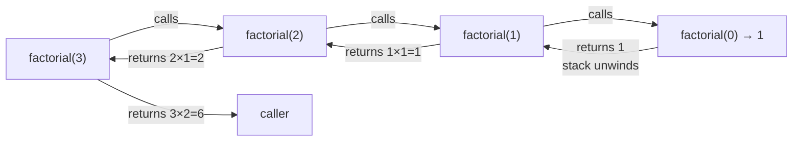

# CPS Style Skill

A guide for writing a study chapter on **Continuation-Passing Style (CPS)** —
what it is, why it exists, and how it connects to async, tail calls, and functional abstractions.

---

## What this chapter is about

CPS is a program transformation where:
- functions never return to the caller
- instead, they receive an extra argument — a **continuation** — which is a callback
  representing "what to do with the result"
- control flow becomes explicit data

CPS is not a niche pattern. It is:
- the theoretical model behind JavaScript async/callbacks
- a standard compiler transformation (used by Scheme, Haskell, OCaml compilers)
- the foundation for understanding `callCC`, effects, and coroutines
- the reason tail calls matter: CPS makes every call a tail call

---

## Pedagogical progression — strict order

The author MUST follow this order. Do not skip steps.

### Stage 1: Direct style — make the reader feel the limitation

Show a recursive function in **direct style** (normal return-based code).
Pick something simple: factorial, fibonacci, tree traversal.

```ts
function factorial(n: number): number {
  if (n === 0) return 1;
  return n * factorial(n - 1);  // ← pending work after recursive call
}
```

Explain the stack frame problem: each call suspends and waits.
The call stack grows O(n).

> [!important] Key question to plant in the reader's mind:
> What if we could express "what happens next" as a value — so nothing is left pending?

---

### Stage 2: Introduce continuation as a concept, not syntax

Before any code, explain **what a continuation is** in plain language:

> A continuation is a snapshot of "the rest of the computation" — everything that will happen
> after the current expression returns. In direct style it's implicit (the call stack). In CPS
> it becomes an explicit function argument.

Use a concrete analogy:
- Direct style: you call a taxi, wait at the curb, get in, go home.
- CPS: you call a taxi and say "when you arrive, call me on this number and I'll come out".
  The callback IS the continuation.

---

### Stage 3: CPS transformation by hand

Show how to convert the factorial to CPS step by step.

```ts
// Direct style
function factorial(n: number): number {
  if (n === 0) return 1;
  return n * factorial(n - 1);
}

// CPS — step 1: add continuation parameter
function factorialCPS(n: number, k: (result: number) => void): void {
  if (n === 0) {
    k(1);                                        // ← pass result to continuation
    return;
  }
  factorialCPS(n - 1, (result) => {             // ← recursive call
    k(n * result);                               // ← continuation chains forward
  });
}

// Usage
factorialCPS(5, (result) => console.log(result)); // 120
```

Walk through execution manually for n=3:
- `factorialCPS(3, k0)` → calls `factorialCPS(2, k1)` where k1 = r => k0(3 * r)
- `factorialCPS(2, k1)` → calls `factorialCPS(1, k2)` where k2 = r => k1(2 * r)
- `factorialCPS(1, k2)` → calls `factorialCPS(0, k3)` where k3 = r => k2(1 * r)
- `factorialCPS(0, k3)` → calls k3(1) → k2(1) → k1(2) → k0(6)

> [!tip] Continuations chain as closures — each continuation captures the previous one.
> This is a linked list of suspended computations, built on the heap instead of the call stack.

---

### Stage 4: Why this matters — tail calls and trampolining

Every CPS call is a **tail call** — there is no pending work after the recursive call.
With tail call optimization (TCO), this runs in O(1) stack space.

But JavaScript engines (except Safari) do not implement TCO.
Show **trampolining** as the practical fix:

```ts
// A thunk is a zero-argument function — a suspended computation
type Thunk<T> = () => T | Thunk<T>;

function trampoline<T>(f: Thunk<T>): T {
  let result: T | Thunk<T> = f;
  while (typeof result === "function") {
    result = (result as Thunk<T>)();           // ← execute one step at a time
  }
  return result;
}

// Factorial with trampoline (returns thunk instead of calling directly)
function factorialT(n: number, acc: number = 1): Thunk<number> {
  if (n === 0) return () => acc;
  return () => factorialT(n - 1, n * acc);    // ← defer instead of recurse
}

const result = trampoline(factorialT(10000)); // no stack overflow
```

---

### Stage 5: CPS and async — the real-world connection

Show that Node.js-style callbacks ARE CPS:

```ts
// Direct style (synchronous — hypothetical)
const data = readFile("file.txt");
process(data);

// CPS style (Node.js callbacks)
readFile("file.txt", (err, data) => {         // ← continuation = callback
  if (err) handleError(err);
  else process(data);
});
```

Then show that Promises are **monadic CPS** — `.then()` is `bind`, the Promise wraps the continuation:

```ts
// Promise chains are CPS in disguise
readFile("file.txt")
  .then(data => process(data))               // ← .then() passes a continuation
  .catch(err => handleError(err));

// async/await desugars to Promise CPS
async function main() {
  const data = await readFile("file.txt");   // ← compiler inserts the continuation
  process(data);
}
```

> [!info] async/await is syntactic sugar that lets you write direct-style code
> while the compiler generates CPS underneath. Understanding CPS makes async/await legible.

---

### Stage 6 (optional, advanced): callCC

If the chapter targets an advanced audience, include `callCC` — "call with current continuation".

```ts
// callCC captures the current continuation as a first-class value
// This is the power primitive behind exceptions, coroutines, generators

// Simulated callCC in TypeScript (conceptual)
function callCC<T, R>(
  f: (k: (value: T) => R) => R
): (k: (value: T) => R) => R {
  return (k) => f(k);
}

// Classic example: early exit from a computation
function findFirst<T>(
  items: T[],
  predicate: (x: T) => boolean,
  k: (result: T | null) => void
): void {
  callCC<T | null, void>((exit) => {
    for (const item of items) {
      if (predicate(item)) exit(item);       // ← jumps out, like a return
    }
    exit(null);
  })(k);
}
```

Keep this section brief and clearly marked as advanced — it is not required for the main insight.

---

## Code style rules

- Language: **TypeScript** with explicit types
- Always show **direct style first**, then CPS equivalent — side by side when possible
- Annotate continuation arguments: `k` is the conventional name for a continuation
- Show execution traces for small inputs (n=3 max)
- Use `void` return type for CPS functions to reinforce that they never "return" meaningfully
- Avoid mixing CPS patterns with other patterns (no fluent builders, no monads)

---

## Conceptual anchors to hit

Every chapter on CPS must establish these four ideas, in this order:

| # | Concept | Core statement |
|---|---------|----------------|
| 1 | What a continuation is | "Everything that happens after this expression" |
| 2 | CPS transformation | Passing that "everything" as an explicit function argument |
| 3 | Tail position | In CPS, all calls are in tail position — nothing waits |
| 4 | Stack vs heap | CPS moves call chain from stack frames to heap-allocated closures |

---

## Common misconceptions to preempt

- "CPS is the same as callbacks" — Callbacks are one manifestation. CPS is the transformation principle.
- "CPS is only for async" — CPS also solves stack overflow (TCO), models control flow (exceptions, coroutines), and is a compiler IR.
- "You need to write CPS manually" — Compilers do it for you. You need to *understand* it, not write it daily.
- "async/await replaced CPS" — async/await IS CPS, compiled. The continuation is generated by the engine.

---

## Mermaid diagram (include in Overview section)




The two diagrams side-by-side are the most powerful teaching tool in this chapter.
Include both in the Overview and reference them in the Deep Dive.

---

## What to include in exercises.md

Minimum three exercises, in order of difficulty:

1. **Manual CPS transform** — take a simple recursive function (sum of list, tree depth),
   write it in CPS by hand. Verify by tracing execution.

2. **Trampoline implementation** — implement `trampoline()` from scratch, then convert
   a recursive algorithm to use it. Verify it handles n=100_000 without stack overflow.

3. **Async pipeline in CPS style** — write three async operations (fetch, transform, save)
   as explicit CPS functions, then chain them. Then rewrite as Promises and async/await.
   Compare the structure.

---

## What to include in anki-cards.txt

Cover these concepts (minimum 8 cards):

- What is a continuation?
- What is CPS? (definition)
- How does CPS transformation change a function signature?
- Why are all calls in CPS in tail position?
- What is a trampoline and why is it needed in JS?
- What is a thunk?
- How do Node.js callbacks relate to CPS?
- How does async/await relate to CPS?
- (Advanced) What does callCC do?

---

## Related vault topics to link

- `[[Callbacks and Async]]`
- `[[Promises and the Event Loop]]`
- `[[Tail Call Optimization]]`
- `[[Monads]]` (if exists)
- `[[Functional Programming]]`
- `[[Recursion and Stack]]`
- `[[Trampolining]]`

---

## Sources to cite

- SICP (Structure and Interpretation of Computer Programs) — Chapter 5 on register machines and CPS
- "Compiling with Continuations" — Andrew Appel (advanced, for reference)
- "Mostly Adequate Guide to Functional Programming" — Chapter on composition and continuations
- MDN: async/await, Promises
- Dan Abramov's "How Does setState Know What to Do?" — indirectly illustrates continuation capture
