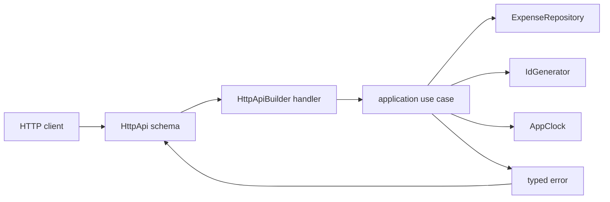

# Expense Approval API на Effect 4

Этот guided project учит собирать один backend vertical slice целиком: от недоверенного входа через application use case и Effect services до HTTP response. Здесь намеренно нет базы данных, authentication, Queue, PubSub, STM и retry: они не должны скрывать wiring основного запроса.

## Оглавление

- [Результат](#learning-outcome)
- [Prerequisites и источники](#prerequisites)
- [Что starter уже делает](#baseline)
- [Карта проекта](#project-map)
- [Архитектура и data flow](#architecture)
- [Рабочий цикл](#workflow)
- [Этап 1. Недоверенный input](#milestone-1)
- [Этап 2. Переход состояния](#milestone-2)
- [Этап 3. HTTP vertical slice](#milestone-3)
- [Независимый transfer. Batch import](#transfer)
- [Финальная проверка](#final-check)
- [Источники](#sources)

<a id="learning-outcome"></a>
## Результат

После завершения проекта вы сможете провести один запрос по цепочке:

```text
unknown input
  → Schema decoding
  → application use case
  → services в Effect environment
  → repository
  → typed error или domain value
  → HTTP response
```

Наблюдаемое evidence:

- невалидный input завершается до обращения к ID, clock и repository;
- application use cases проверяются без HTTP;
- failure не оставляет частично изменённое состояние;
- HTTP layer вызывает application core, а не повторяет business rules;
- тот же core переиспользуется из batch adapter без HTTP.

Профиль проекта — `supported`. Подсказки раскрываются постепенно. Если открыта полная реализация этапа, этот этап считается практикой с поддержкой, а не самостоятельным evidence. Независимый transfer полного решения не содержит.

<a id="prerequisites"></a>
## Prerequisites и источники

Перед началом нужны знакомые по mentor lessons механизмы:

- `Effect.gen`, `yield*` и каналы `A`, `E`, `R`;
- `Schema` и выполнение decoder;
- tagged errors;
- services и `Layer`.

HTTP API — новый связующий механизм. Перед этапом 3 достаточно понять три роли:

- `HttpApiEndpoint` описывает один endpoint;
- `HttpApiGroup` объединяет endpoints;
- `HttpApiBuilder.group` связывает описание с Effect handlers.

Проект использует **Effect `4.0.0-beta.101`**. В Effect 4 HTTP modules находятся в `effect/unstable/http` и `effect/unstable/httpapi`. Старые примеры с `@effect/platform` нельзя копировать механически.

Репозиторий [EffectPatterns](https://github.com/PaulJPhilp/EffectPatterns) используйте как каталог архитектурных паттернов. Некоторые snippets написаны для Effect 3, поэтому сверяйте названия функций с imports проекта и официальным Effect 4 source.

<a id="baseline"></a>
## Что starter уже делает

Starter компилируется и запускает HTTP server на порту `3000`.

Работают:

```text
GET /health
GET /expenses/seed-expense
GET /expenses/:unknown-id → 404 ExpenseNotFound
```

Также уже работают:

- in-memory `ExpenseRepository`;
- live и test Layers для repository, ID и clock;
- `getExpense` application use case;
- happy path создания расхода из корректного trusted object;
- happy path согласования pending-расхода;
- автоматическое преобразование schema-backed `ExpenseNotFound` в HTTP `404`.

Намеренно не реализованы:

- runtime validation внутри `submitExpense`;
- invariants перехода `Pending → Approved`;
- write endpoints в `ExpensesGroup` и их handlers;
- изоляция ошибок отдельных элементов batch import.

Это отсутствующее поведение, а не сломанный scaffold: baseline checks проходят до ваших изменений.

<a id="project-map"></a>
## Карта проекта

```text
src/
├── domain/
│   └── expense.ts              schemas, wire/domain types
├── application/
│   ├── getExpense.ts           готовый read use case
│   ├── submitExpense.ts        этап 1: редактировать
│   └── approveExpense.ts       этап 2: редактировать
├── services/
│   ├── ExpenseRepository.ts    supporting service + live layer
│   ├── IdGenerator.ts          supporting service
│   └── AppClock.ts             supporting service
├── http/
│   ├── api.ts                  этап 3: редактировать ExpensesGroup
│   ├── handlers.ts             этап 3: добавить handlers
│   └── server.ts               supporting server wiring
├── errors.ts                   готовые schema-backed errors
├── importExpenses.ts           independent transfer
├── layers.ts                   composition root и seed
└── index.ts                    entrypoint

checks/
├── support.ts                  deterministic test services
├── baseline.test.ts            уже работающее поведение
├── milestone-1.test.ts
├── milestone-2.test.ts
├── milestone-3.test.ts
└── transfer.test.ts
```

Обычно не редактируйте:

- `src/services/*`;
- `src/errors.ts`;
- `src/layers.ts`;
- `src/http/server.ts`;
- `src/index.ts`;
- `checks/*`;
- project configuration и lockfile.

Если check падает, сначала меняйте только edit surface текущего этапа. Не подгоняйте check под реализацию.

<a id="architecture"></a>
## Архитектура и data flow



`src/http/api.ts` знает wire schemas и HTTP statuses. Application files не знают о HTTP. `src/http/handlers.ts` — тонкий adapter: он получает уже разобранный request и вызывает use case.

В Effect 4 handler dependencies становятся request-level requirements. `HttpRouter.provideRequest(ApplicationLive)` в `src/http/server.ts` предоставляет один application Layer всем requests. Это не нужно повторять внутри каждого handler.

<a id="workflow"></a>
## Рабочий цикл

Из директории проекта:

```bash
pnpm install --frozen-lockfile
pnpm run build
pnpm run test:baseline
```

Перед этапом запускайте его check и прочитайте failure. После изменения повторите build и check:

```bash
pnpm run build
pnpm run check:1
```

Команды накапливаются: `check:2` запускает этапы 1–2, `check:3` — этапы 1–3.

Запуск сервера:

```bash
pnpm run start
```

Baseline smoke:

```bash
curl -i http://localhost:3000/health
curl -i http://localhost:3000/expenses/seed-expense
curl -i http://localhost:3000/expenses/missing
```

<a id="milestone-1"></a>
## Этап 1. Недоверенный input до сохранённого Expense

### Результат

`submitExpense(input)` принимает `unknown`, выполняет `ExpenseDraftSchema` decoder и только после успеха обращается к dependencies.

### Зачем

Type assertion меняет только мнение TypeScript. Он не проверяет runtime value. Application boundary должна доказать форму данных до создания ID, чтения времени и изменения repository.

### Где работать

Редактируйте только:

- `src/application/submitExpense.ts`;
- symbol `submitExpense`.

### Что уже есть

Функция умеет собрать и сохранить корректный `Expense`, но строка:

```typescript
const draft = input as ExpenseDraft
```

доверяет любому значению. Из-за этого невалидный object получает ID, timestamp и попадает в repository.

`ExpenseDraftSchema` уже объявлена в `src/domain/expense.ts`. `InvalidExpenseInput` уже объявлена в `src/errors.ts`.

### Что изменить

Контракт decoder:

| Поле | Условие |
|---|---|
| `vendor` | непустая строка |
| `amountCents` | integer от `1` до `1_000_000` включительно |
| `category` | `travel`, `equipment`, `training` или `other` |
| `submittedBy` | непустая строка |

При ошибке:

- вернуть `InvalidExpenseInput` в `E`;
- поместить читаемое сообщение Schema в `reason`;
- не запрашивать ID;
- не читать clock;
- не вызывать repository `save`.

При успехе сохраните существующий порядок: decode → dependencies → construct → save.

### Шаги реализации

1. Импортируйте `Schema`, `ExpenseDraftSchema` и runtime class `InvalidExpenseInput`.
2. Удалите type assertion.
3. Создайте decoder через `Schema.decodeUnknownEffect(ExpenseDraftSchema)`.
4. Выполните decoder на `input` внутри `Effect.gen`.
5. Через `Effect.mapError` преобразуйте только `SchemaError` в `InvalidExpenseInput`.
6. Оставьте получение services и запись после успешного `yield*` decoder.
7. Не оборачивайте decoder в `Effect.try`: он уже возвращает Effect.

Паттерны для поиска:

- [Validate Request Body](https://github.com/PaulJPhilp/EffectPatterns/blob/main/content/published/patterns/building-apis/validate-request-body.mdx) — идея trusted boundary; HTTP API из snippet не копировать;
- [Mapping Errors to Fit Your Domain](https://github.com/PaulJPhilp/EffectPatterns/blob/main/content/published/patterns/error-management/mapping-errors-to-fit-your-domain.mdx).

### Проверка

```bash
pnpm run build
pnpm run check:1
```

Check проверяет valid object и пять правдоподобных invalid variants. Для invalid input counters ID, clock и save должны остаться нулевыми.

### Контрольная точка

До запуска ответьте:

1. Почему `as ExpenseDraft` не меняет runtime value?
2. В какой момент `R` программы впервые начинает использоваться?
3. Почему decoding должен стоять раньше `yield* IdGenerator`?

> [!tip]- Подсказка 1: концепция
> Найдите первую строку, после которой input действительно имеет доказанный `ExpenseDraft` type. Type assertion такой строкой не является.

> [!tip]- Подсказка 2: API
> В Effect 4 нужен `Schema.decodeUnknownEffect(ExpenseDraftSchema)(input)`. Его error — `SchemaError`; application contract ожидает `InvalidExpenseInput`.

> [!tip]- Подсказка 3: форма pipeline
> Сначала соберите decoding Effect и примените к нему `Effect.mapError`. Затем `yield*` результат внутри существующего `Effect.gen`. Код ниже получения services менять не требуется.

> [!warning]- Полная реализация — открыть после попытки
> Замените содержимое `src/application/submitExpense.ts`:
>
> ```typescript
> import { Effect, Schema } from "effect"
> import { ExpenseDraftSchema, type Expense } from "../domain/expense.js"
> import { InvalidExpenseInput } from "../errors.js"
> import { AppClock } from "../services/AppClock.js"
> import { ExpenseRepository } from "../services/ExpenseRepository.js"
> import { IdGenerator } from "../services/IdGenerator.js"
>
> export const submitExpense = (
>   input: unknown
> ): Effect.Effect<
>   Expense,
>   InvalidExpenseInput,
>   ExpenseRepository | IdGenerator | AppClock
> > =>
>   Effect.gen(function* () {
>     const draft = yield* Schema.decodeUnknownEffect(ExpenseDraftSchema)(
>       input
>     ).pipe(
>       Effect.mapError(
>         (error) => new InvalidExpenseInput({ reason: error.message })
>       )
>     )
>     const repository = yield* ExpenseRepository
>     const idGenerator = yield* IdGenerator
>     const clock = yield* AppClock
>     const id = yield* idGenerator.next
>     const submittedAt = yield* clock.now
>
>     const expense: Expense = {
>       ...draft,
>       id,
>       submittedAt,
>       status: "Pending",
>       approvedAt: null,
>       approvedBy: null
>     }
>
>     yield* repository.save(expense)
>     return expense
>   })
> ```
>
> `decodeUnknownEffect` выполняет runtime decoding, а не только выводит type. `mapError` не ловит последующие repository failures. Dependencies запрашиваются после decoder, поэтому invalid input не вызывает observable work.

<a id="milestone-2"></a>
## Этап 2. Безопасный переход Pending → Approved

### Результат

`approveExpense` изменяет только допустимый pending-расход и оставляет repository без изменений при любом ожидаемом отказе.

### Зачем

State transition — это не присваивание `status`. Сначала нужно прочитать текущее состояние, проверить все invariants, и только затем выполнить observable write.

### Где работать

Редактируйте только:

- `src/application/approveExpense.ts`;
- symbol `approveExpense`.

### Что уже есть

Baseline находит расход, получает время и сохраняет `Approved`. Happy path работает, но повторное согласование и сумма выше лимита также перезаписывают состояние.

Ошибки уже объявлены:

- `ExpenseNotFound` возвращает repository;
- `ExpenseAlreadyReviewed` принимает `id` и текущий `status`;
- `ManualReviewRequired` принимает `id` и `amountCents`.

### Что изменить

Порядок правил:

1. найти expense;
2. если status не `Pending`, вернуть `ExpenseAlreadyReviewed`;
3. если `amountCents > 100_000`, вернуть `ManualReviewRequired`;
4. только затем прочитать clock;
5. построить новое immutable value;
6. сохранить его один раз.

Граница `100_000` включительна: такой расход согласуется автоматически, `100_001` — нет.

При failure нельзя вызывать clock или `save`.

### Шаги реализации

1. Замените type-only imports двух ошибок на runtime imports.
2. Сразу после `findById` проверьте status.
3. При нарушении завершите generator через `return yield* new ExpenseAlreadyReviewed(...)`.
4. Затем проверьте amount.
5. Только после обеих проверок получите `AppClock` и выполните `clock.now`.
6. Сохраните существующее immutable обновление через object spread.

Паттерны для поиска:

- [Handle Errors with catchTag, catchTags, and catchAll](https://github.com/PaulJPhilp/EffectPatterns/blob/main/content/published/patterns/error-management/handle-errors-with-catch.mdx);
- [Conditionally Branching Workflows](https://github.com/PaulJPhilp/EffectPatterns/blob/main/content/published/patterns/error-management/conditionally-branching-workflows.mdx).

Здесь `catchTag` не нужен: use case создаёт typed failures, а boundary решает, как их представить.

### Проверка

```bash
pnpm run build
pnpm run check:2
```

Check защищает четыре ветви: success на границе лимита, manual review, already reviewed и not found. Для failure сравнивается исходный repository state и counters side effects.

### Контрольная точка

До изменения выпишите порядок `read → validate state → validate amount → clock → save`. Какой observable defect появится, если `clock.now` находится раньше проверок?

> [!tip]- Подсказка 1: invariant
> До первого observable write должны быть известны ответы на два вопроса: допустим ли переход из текущего status и проходит ли сумма автоматический лимит.

> [!tip]- Подсказка 2: typed early return
> Schema-backed error classes в Effect 4 yieldable. Внутри generator можно использовать `return yield* new ExpenseAlreadyReviewed({...})`.

> [!tip]- Подсказка 3: две guards
> Первая guard проверяет `expense.status !== "Pending"`. Вторая — `expense.amountCents > 100_000`. `clock` должен находиться после них.

> [!warning]- Полная реализация — открыть после попытки
> Замените содержимое `src/application/approveExpense.ts`:
>
> ```typescript
> import { Effect } from "effect"
> import type { Expense } from "../domain/expense.js"
> import {
>   ExpenseAlreadyReviewed,
>   type ExpenseNotFound,
>   ManualReviewRequired
> } from "../errors.js"
> import { AppClock } from "../services/AppClock.js"
> import { ExpenseRepository } from "../services/ExpenseRepository.js"
>
> export const approveExpense = (
>   id: string,
>   approvedBy: string
> ): Effect.Effect<
>   Expense,
>   ExpenseNotFound | ExpenseAlreadyReviewed | ManualReviewRequired,
>   ExpenseRepository | AppClock
> > =>
>   Effect.gen(function* () {
>     const repository = yield* ExpenseRepository
>     const expense = yield* repository.findById(id)
>
>     if (expense.status !== "Pending") {
>       return yield* new ExpenseAlreadyReviewed({
>         id: expense.id,
>         status: expense.status
>       })
>     }
>
>     if (expense.amountCents > 100_000) {
>       return yield* new ManualReviewRequired({
>         id: expense.id,
>         amountCents: expense.amountCents
>       })
>     }
>
>     const clock = yield* AppClock
>     const approved: Expense = {
>       ...expense,
>       status: "Approved",
>       approvedAt: yield* clock.now,
>       approvedBy
>     }
>
>     yield* repository.save(approved)
>     return approved
>   })
> ```
>
> Guard order сохраняет repository и clock untouched при failure. Лимит проверяется до timestamp, потому что timestamp относится к состоявшемуся transition. Object spread создаёт новое domain value вместо мутации полученного объекта.

<a id="milestone-3"></a>
## Этап 3. Application core через HTTP

### Результат

Два write endpoints используют уже проверенные application functions:

| Request | Success | Expected failures |
|---|---:|---|
| `POST /expenses` | `201` | invalid payload → `400` |
| `POST /expenses/:id/approve` | `200` | not found → `404`, reviewed → `409`, manual review → `422` |

### Зачем

HTTP handler не должен становиться вторым application layer. Его ответственность: получить decoded request parts, вызвать use case и вернуть его value/error в объявленный API contract.

### Где работать

Редактируйте:

- `src/http/api.ts`: только `ExpensesGroup`;
- `src/http/handlers.ts`: imports и builder chain.

Не меняйте `server.ts`: `HttpRouter.provideRequest(ApplicationLive)` уже предоставляет dependencies каждому request.

### Что уже есть

`submitExpenseEndpoint` и `approveExpenseEndpoint` полностью объявлены, но пока не добавлены в `ExpensesGroup`. Поэтому server отвечает `404` на write routes.

`ExpensesHandlersLive` реализует все endpoints текущей baseline group: `health` и `getExpense`.

### Что изменить

1. Добавьте оба готовых write endpoint values в `ExpensesGroup.add(...)`.
2. После этого TypeScript сообщит, что builder вернул не все handlers.
3. Импортируйте `submitExpense` и `approveExpense` application functions.
4. `submitExpense` handler получает `{ payload }` и передаёт payload в use case.
5. `approveExpense` handler получает `{ params, payload }` и передаёт `params.id`, `payload.approvedBy`.
6. Не используйте `Effect.runPromise` внутри handler: handler уже возвращает Effect runtime-у.
7. Не ловите typed errors вручную: endpoint schemas уже содержат status annotations.

Паттерны для поиска:

- [Provide Dependencies to Routes](https://github.com/PaulJPhilp/EffectPatterns/blob/main/content/published/patterns/building-apis/provide-dependencies-to-routes.mdx);
- [Handle API Errors](https://github.com/PaulJPhilp/EffectPatterns/blob/main/content/published/patterns/building-apis/handle-api-errors.mdx).

В этих страницах ориентируйтесь на разделение responsibilities, а не на старые имена HTTP functions. В Effect 4 этого проекта используются `HttpApiBuilder.group`, schema status annotations и `HttpRouter.provideRequest`.

### Проверка

```bash
pnpm run build
pnpm run check:3
```

Integration check строит настоящий Fetch-compatible HTTP application. Он проверяет status/body и затем repository state, поэтому fake handler с правильным JSON не пройдёт.

После check запустите ручной smoke:

```bash
pnpm run start
```

```bash
curl -i -X POST http://localhost:3000/expenses \
  -H 'content-type: application/json' \
  -d '{"vendor":"Rail Europe","amountCents":24500,"category":"travel","submittedBy":"alice"}'
```

### Контрольная точка

Объясните две границы validation:

- `HttpApi` декодирует HTTP payload до handler;
- `submitExpense` всё равно принимает `unknown`, потому что application core может вызываться не только из HTTP.

> [!tip]- Подсказка 1: declaration и implementation
> Endpoint constants уже существуют. Один edit включает их в declaration group; второй edit добавляет соответствующие implementations в builder chain.

> [!tip]- Подсказка 2: handler arguments
> Create handler использует `payload`. Approve handler использует одновременно `params.id` и `payload.approvedBy`.

> [!tip]- Подсказка 3: wiring shape
> В `api.ts` расширьте существующий `.add(...)`. В `handlers.ts` продолжите chain двумя `.handle(...)`. Каждый callback должен просто вернуть соответствующий application Effect.

> [!warning]- Полная реализация — открыть после попытки
> В `src/http/api.ts` замените только declaration группы:
>
> ```typescript
> export const ExpensesGroup = HttpApiGroup.make("expenses").add(
>   healthEndpoint,
>   getExpenseEndpoint,
>   submitExpenseEndpoint,
>   approveExpenseEndpoint
> )
> ```
>
> В `src/http/handlers.ts` замените файл:
>
> ```typescript
> import { Effect, Layer } from "effect"
> import { HttpApiBuilder } from "effect/unstable/httpapi"
> import { approveExpense } from "../application/approveExpense.js"
> import { getExpense } from "../application/getExpense.js"
> import { submitExpense } from "../application/submitExpense.js"
> import { ExpensesApi } from "./api.js"
>
> export const ExpensesHandlersLive = HttpApiBuilder.group(
>   ExpensesApi,
>   "expenses",
>   (handlers) =>
>     handlers
>       .handle("health", () => Effect.succeed({ status: "ok" as const }))
>       .handle("getExpense", ({ params }) => getExpense(params.id))
>       .handle("submitExpense", ({ payload }) => submitExpense(payload))
>       .handle("approveExpense", ({ params, payload }) =>
>         approveExpense(params.id, payload.approvedBy)
>       )
> )
>
> export const makeApiLayer = () =>
>   HttpApiBuilder.layer(ExpensesApi).pipe(Layer.provide(ExpensesHandlersLive))
> ```
>
> Group declaration определяет обязательный набор handlers на type level. Handlers не создают Layer вручную и не выполняют Effects: dependencies остаются в `R`, а runtime получает их через `HttpRouter.provideRequest`.

<a id="transfer"></a>
## Независимый transfer. Batch import без HTTP

### Результат

`importExpenses(input)` применяет тот же `submitExpense` к другой входной поверхности: batch data вместо одного HTTP request.

### Где работать

Редактируйте только:

- `src/importExpenses.ts`;
- symbol `importExpenses`.

`fixtures/expenses.json` показывает форму данных, но check передаёт значения напрямую и не зависит от файловой системы.

### Что уже есть

Baseline доверяет, что outer value — массив, и использует fail-fast `Effect.forEach`. Полностью корректный batch сохраняется, но один invalid item завершает весь import и теряет результаты остальных элементов.

### Что изменить

Контракт:

- outer value должен быть массивом; иначе `InvalidExpenseInput`;
- каждый item передаётся в `submitExpense`, без копирования его validation или construction;
- failure одного item становится `RejectedItem`, а не прерывает batch;
- success становится `ImportedItem` с созданным ID;
- у каждого result сохраняется исходный `index`;
- output order совпадает с input order;
- invalid item не запрашивает ID/clock и не сохраняется;
- два valid item вокруг invalid item оба сохраняются.

Форма результата уже объявлена:

```typescript
interface ImportSummary {
  readonly results: ReadonlyArray<ImportedItem | RejectedItem>
}
```

### Проверка

```bash
pnpm run build
pnpm run check:transfer
```

Для transfer нет полной реализации и algorithm-level подсказок. Если проблема только в незнакомом Effect 4 API, используйте:

- `Schema.Array(Schema.Unknown)` для outer boundary;
- `Effect.result(effect)` для превращения typed success/failure в `Result` data;
- `Result.match` или `Result.isSuccess`/`Result.isFailure` для построения item result.

Не открывайте spoilers прошлых этапов во время transfer. Если без них не получается, завершите попытку как supported practice и повторите transfer позже с чистого состояния.

<a id="final-check"></a>
## Финальная проверка

```bash
pnpm run build
pnpm run lint
pnpm run test:baseline
pnpm run check
pnpm run start
```

Проект даёт independent evidence только если:

- этапы 1–3 выполнены без копирования полных spoilers;
- вы можете объяснить порядок observable operations;
- HTTP handlers не содержат business rules;
- transfer выполнен без implementation spoiler;
- все checks проходят вместе.

После открытия полного spoiler этап подтверждает supported practice. Это полезная попытка, но для самостоятельности позже повторите тот же механизм в другом небольшом vertical slice с подсказками не глубже уровня 1–2.

<a id="sources"></a>
## Источники

### Effect 4

- [Effect 4 Schema source](https://github.com/Effect-TS/effect/blob/main/packages/effect/src/Schema.ts)
- [Effect 4 Context source](https://github.com/Effect-TS/effect/blob/main/packages/effect/src/Context.ts)
- [Effect 4 Layer source](https://github.com/Effect-TS/effect/blob/main/packages/effect/src/Layer.ts)
- [Effect 4 HttpApi source](https://github.com/Effect-TS/effect/blob/main/packages/effect/src/unstable/httpapi/HttpApi.ts)
- [Effect 4 HttpApiBuilder source](https://github.com/Effect-TS/effect/blob/main/packages/effect/src/unstable/httpapi/HttpApiBuilder.ts)
- [Effect 4 HttpRouter source](https://github.com/Effect-TS/effect/blob/main/packages/effect/src/unstable/http/HttpRouter.ts)

### EffectPatterns

- [EffectPatterns repository](https://github.com/PaulJPhilp/EffectPatterns)
- [Validate Request Body](https://github.com/PaulJPhilp/EffectPatterns/blob/main/content/published/patterns/building-apis/validate-request-body.mdx)
- [Handle API Errors](https://github.com/PaulJPhilp/EffectPatterns/blob/main/content/published/patterns/building-apis/handle-api-errors.mdx)
- [Provide Dependencies to Routes](https://github.com/PaulJPhilp/EffectPatterns/blob/main/content/published/patterns/building-apis/provide-dependencies-to-routes.mdx)
- [Mapping Errors to Fit Your Domain](https://github.com/PaulJPhilp/EffectPatterns/blob/main/content/published/patterns/error-management/mapping-errors-to-fit-your-domain.mdx)
