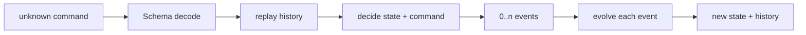

# Expense Claim Decider на Effect

Этот guided project переносит Decider pattern из hotel reservation в систему согласования корпоративных расходов. Здесь переход зависит от суммы и личности reviewer, а одна команда может выпустить несколько событий. Проект не использует БД, HTTP или event-store: изучаемая граница — `initial + decide + evolve + replay`.

## Оглавление

- [Результат обучения](#learning-outcome)
- [Что нужно знать](#prerequisites)
- [Карта starter](#starter-map)
- [Рабочий цикл](#workflow)
- [Контракт домена](#domain-contract)
- [Этап 1. Policy-aware Decider](#milestone-1)
- [Этап 2. Replay и multi-event runner](#milestone-2)
- [Независимый transfer](#transfer)
- [Финальная проверка](#final-check)
- [Источники и EffectPatterns](#sources)

<a id="learning-outcome"></a>
## Результат обучения

После проекта вы сможете:

1. отделять отклоняемую команду от уже произошедшего события;
2. реализовывать `Decider<Command, State, Event, Error>` через `initial`, `decide` и `evolve`;
3. возвращать несколько событий из одного решения и применять каждое из них по порядку;
4. восстанавливать state из event history;
5. сохранять бизнес-ошибки в typed error channel;
6. получать event time через `Clock`, не вызывая `Date.now()` в domain logic;
7. переносить тот же механизм в другую предметную область.

Независимое evidence — пройденный transfer без полного spoiler и algorithm-level подсказок. Открытый spoiler основных этапов означает практику с поддержкой, а не самостоятельное владение.

<a id="prerequisites"></a>
## Что нужно знать

Нужны знакомые механизмы:

- `Effect<A, E, R>` и `Effect.gen`;
- `Schema.TaggedStruct`, `Schema.Union`, branded values;
- `Data.TaggedError` и `Effect.fail`;
- discriminated union по `_tag`;
- `Clock.currentTimeMillis` и `TestClock`;
- `Array.reduce` как последовательное применение событий.

Основной источник Decider — mentor lesson 15:

```text
/home/vyacheslav/Documents/bat-effect/15/BatSchool · Decider pattern на Effect.gen_ decide, evolve, initial.html
```

В `EffectPatterns` нет отдельной статьи про Decider. Ссылки из подсказок относятся к его строительным блокам. Используйте оттуда форму API, но не переносите incidental `any`, generic `Error` или `Date.now()` вместо контрактов этого проекта.

**Профиль guidance: `supported`.** Сначала открывайте concept hint и ссылку на pattern. Полная реализация — последняя ступень помощи. У transfer её нет.

<a id="starter-map"></a>
## Карта starter

```text
src/
├── decider.ts                 generic Decider и готовый replay
├── domain.ts                  expense schemas, state, events и errors
├── expense-claim.ts           основной learner edit surface этапа 1
├── scenario.ts                learner edit surface этапа 2
├── index.ts                   working smoke-сценарий
└── transfer/
    └── device-loan.ts         independent transfer
checks/
├── support.ts                 deterministic fixtures и direct runner
├── starter.test.ts            working baseline
├── milestone-1.test.ts        policy-aware Decider
├── milestone-2.test.ts        multi-event runner и replay invariant
└── transfer.test.ts           новая предметная область
eslint.config.js                 project-local lint rules
```

### Где работать

| Этап | Обычно изменяется | Обычно не изменяется |
|---|---|---|
| 1 | `src/domain.ts`, `src/expense-claim.ts` | `src/decider.ts`, `src/index.ts`, `checks/**` |
| 2 | `src/scenario.ts` | domain и checks |
| Transfer | `src/transfer/device-loan.ts` | expense domain, runner и checks |

Checks проверяют публичное поведение. Не меняйте их, чтобы подогнать ожидание под реализацию.

### Что starter уже делает

Baseline компилируется и проводит недорогую заявку по пути:

```text
SubmitClaim → ClaimSubmitted
ApproveByManager → ClaimApproved
ReimburseClaim → ClaimReimbursed
```

Итоговый state — `Reimbursed`, history содержит три события. `RejectClaim` работает на manager stage. Все baseline-команды выпускают по одному событию, поэтому текущий `runScenario` применяет только первый event результата и пока остаётся корректным.

Не реализованы finance review, self-approval guard и damaged-device workflow. Это отсутствующее поведение, а не сломанная установка.

### Data flow



<a id="workflow"></a>
## Рабочий цикл

Из директории проекта:

```bash
pnpm install --frozen-lockfile
pnpm run build
pnpm run lint
pnpm run check:starter
pnpm run smoke
```

Ожидаемый smoke-result:

```text
Claim clm_demo0001: Reimbursed; events=3
```

Для каждого этапа:

1. прочитайте только его контракт;
2. предскажите events или error до запуска;
3. измените названные symbols;
4. выполните targeted check;
5. открывайте подсказки по одной;
6. после green check объясните механизм без пересказа test name.

<a id="domain-contract"></a>
## Контракт домена

Порог finance review:

```text
100_000 cents
```

- `amountCents <= 100_000` — одного manager approval достаточно;
- `amountCents > 100_000` — после manager approval требуется finance approval.

### Разрешённые решения

| State | Command | Events | Следующий state |
|---|---|---|---|
| `NotSubmitted` | `SubmitClaim` | `ClaimSubmitted` | `PendingManagerReview` |
| `PendingManagerReview`, сумма до порога включительно | `ApproveByManager` | `ClaimApproved` | `Approved` |
| `PendingManagerReview`, сумма выше порога | `ApproveByManager` | `ManagerApprovalGranted`, затем `FinanceReviewRequested` | `PendingFinanceReview` |
| `PendingManagerReview` или `PendingFinanceReview` | `RejectClaim` | `ClaimRejected` | `Rejected` |
| `PendingFinanceReview` | `ApproveByFinance` | `ClaimApproved` | `Approved` |
| `Approved` | `ReimburseClaim` | `ClaimReimbursed` | `Reimbursed` |

Дополнительные инварианты:

- manager reviewer не равен `employeeId` заявки;
- `claimId` команды совпадает с текущей заявкой;
- все events одной команды получают один `occurredAt`;
- любое сочетание state/command вне таблицы возвращает `InvalidStateTransition`;
- self-approval возвращает `SelfApprovalForbidden`;
- rejected command не выпускает events.

<a id="milestone-1"></a>
## Этап 1. Policy-aware Decider

### Зачем

`decide` отвечает на вопрос «какие факты разрешено выпустить?». `evolve` не принимает бизнес-решений: он только материализует уже произошедший факт. Дорогая заявка делает различие наблюдаемым, потому что одна manager-команда выпускает два events.

### Где работать

В `src/domain.ts`:

- `ExpenseClaimCommand`;
- `ExpenseClaimEvent`;
- `ExpenseClaimState`.

В `src/expense-claim.ts`:

- imports finance variants и `SelfApprovalForbidden`;
- `FINANCE_REVIEW_THRESHOLD_CENTS`;
- `decide`;
- `evolve`.

### Что уже есть

Finance schemas `ApproveByFinance`, `ManagerApprovalGranted` и `FinanceReviewRequested` объявлены для ориентации, но не включены в публичные unions. Baseline manager approval всегда выпускает `ClaimApproved`, даже для дорогой или собственной заявки.

### Что изменить

1. Включите `ApproveByFinance` в `ExpenseClaimCommand`.
2. Включите `ManagerApprovalGranted` и `FinanceReviewRequested` в `ExpenseClaimEvent`.
3. Добавьте состояния `ManagerApproved` и `PendingFinanceReview`; оба сохраняют claim data и `managerId`.
4. В `ApproveByManager` сначала подтвердите state и `claimId`, затем проверьте self-approval.
5. Для суммы до порога сохраните baseline `ClaimApproved`.
6. Для суммы выше порога верните два events в порядке из таблицы.
7. Разрешите `ApproveByFinance` только из `PendingFinanceReview`.
8. Разрешите `RejectClaim` из обеих review stages.
9. Добавьте обе finance-ветки в `evolve`.

### Проверка

```bash
pnpm run check:1
```

Команда cumulative: starter checks тоже должны остаться зелёными.

### Контрольная точка

До запуска предскажите:

```text
SubmitClaim(150_000)
ApproveByManager(manager)
```

Назовите:

1. два event tags второго решения и их порядок;
2. state после первого event;
3. state после второго event;
4. почему `ApproveByFinance` до второго event должен быть отвергнут.

После green check объясните, почему `FinanceReviewRequested` нельзя создать внутри `evolve`: `evolve` получает факт, но не решает, нужен ли этот факт.

> [!tip]- Подсказка 1: какой механизм отвечает за каждую часть
> Команда может быть отвергнута — это `decide` и channel `E`. Event уже произошёл — `evolve` обязан только преобразовать state. Для формы tagged unions перечитайте [Discriminated Unions with Type Narrowing](https://github.com/PaulJPhilp/EffectPatterns/blob/main/content/published/patterns/schema/unions/discriminated-unions.mdx).

> [!tip]- Подсказка 2: точные seams
> Finance schemas уже объявлены в `src/domain.ts`. Сначала включите их в unions и расширьте `ExpenseClaimState`. Затем TypeScript покажет необработанные command/event tags в `src/expense-claim.ts`.

> [!tip]- Подсказка 3: форма решения
> ```text
> ApproveByManager:
>   require PendingManagerReview + matching claimId
>   reject employeeId === reviewerId
>   if amount <= threshold: [ClaimApproved]
>   else: [ManagerApprovalGranted, FinanceReviewRequested]
>
> ApproveByFinance:
>   require PendingFinanceReview + matching claimId
>   [ClaimApproved]
> ```
> Для typed failure используйте тот же подход, что в [Define Type-Safe Errors with Data.TaggedError](https://github.com/PaulJPhilp/EffectPatterns/blob/main/content/published/patterns/domain-modeling/define-tagged-errors.mdx).

> [!warning]- Полная реализация — открыть после попытки
> В `src/domain.ts` замените три unions/state declarations следующими версиями:
>
> ```typescript
> export const ExpenseClaimCommand = Schema.Union(
>   SubmitClaim,
>   ApproveByManager,
>   ApproveByFinance,
>   RejectClaim,
>   ReimburseClaim,
> );
> export type ExpenseClaimCommand = Schema.Schema.Type<
>   typeof ExpenseClaimCommand
> >;
>
> export const ExpenseClaimEvent = Schema.Union(
>   ClaimSubmitted,
>   ManagerApprovalGranted,
>   FinanceReviewRequested,
>   ClaimApproved,
>   ClaimRejected,
>   ClaimReimbursed,
> );
> export type ExpenseClaimEvent = Schema.Schema.Type<typeof ExpenseClaimEvent>;
>
> export type ExpenseClaimState =
>   | { readonly _tag: "NotSubmitted" }
>   | ({ readonly _tag: "PendingManagerReview" } & ClaimData)
>   | ({
>       readonly _tag: "ManagerApproved";
>       readonly managerId: EmployeeId;
>     } & ClaimData)
>   | ({
>       readonly _tag: "PendingFinanceReview";
>       readonly managerId: EmployeeId;
>     } & ClaimData)
>   | ({
>       readonly _tag: "Approved";
>       readonly approvedBy: EmployeeId;
>     } & ClaimData)
>   | ({
>       readonly _tag: "Rejected";
>       readonly rejectedBy: EmployeeId;
>       readonly reason: RejectionReason;
>     } & ClaimData)
>   | ({
>       readonly _tag: "Reimbursed";
>       readonly approvedBy: EmployeeId;
>       readonly transactionId: TransactionId;
>     } & ClaimData);
> ```
>
> В imports `src/expense-claim.ts` добавьте `FinanceReviewRequested`, `ManagerApprovalGranted` и `SelfApprovalForbidden`, затем замените `decide` и `evolve`:
>
> ```typescript
> const FINANCE_REVIEW_THRESHOLD_CENTS = 100_000;
>
> const decide = (
>   state: ExpenseClaimState,
>   command: ExpenseClaimCommand,
> ): Effect.Effect<ReadonlyArray<ExpenseClaimEvent>, ExpenseClaimError> =>
>   Effect.gen(function* () {
>     const occurredAt = yield* Clock.currentTimeMillis;
>
>     switch (command._tag) {
>       case "SubmitClaim":
>         if (state._tag !== "NotSubmitted") {
>           return yield* invalidTransition(state, command);
>         }
>         return [
>           ClaimSubmitted.make({
>             claimId: command.claimId,
>             employeeId: command.employeeId,
>             amountCents: command.amountCents,
>             occurredAt,
>           }),
>         ];
>
>       case "ApproveByManager":
>         if (
>           state._tag !== "PendingManagerReview" ||
>           state.claimId !== command.claimId
>         ) {
>           return yield* invalidTransition(state, command);
>         }
>         if (state.employeeId === command.reviewerId) {
>           return yield* Effect.fail(
>             new SelfApprovalForbidden({
>               employeeId: state.employeeId,
>               reviewerId: command.reviewerId,
>             }),
>           );
>         }
>         if (state.amountCents <= FINANCE_REVIEW_THRESHOLD_CENTS) {
>           return [
>             ClaimApproved.make({
>               claimId: state.claimId,
>               employeeId: state.employeeId,
>               amountCents: state.amountCents,
>               approvedBy: command.reviewerId,
>               occurredAt,
>             }),
>           ];
>         }
>         return [
>           ManagerApprovalGranted.make({
>             claimId: state.claimId,
>             employeeId: state.employeeId,
>             amountCents: state.amountCents,
>             managerId: command.reviewerId,
>             occurredAt,
>           }),
>           FinanceReviewRequested.make({
>             claimId: state.claimId,
>             employeeId: state.employeeId,
>             amountCents: state.amountCents,
>             managerId: command.reviewerId,
>             occurredAt,
>           }),
>         ];
>
>       case "ApproveByFinance":
>         if (
>           state._tag !== "PendingFinanceReview" ||
>           state.claimId !== command.claimId
>         ) {
>           return yield* invalidTransition(state, command);
>         }
>         return [
>           ClaimApproved.make({
>             claimId: state.claimId,
>             employeeId: state.employeeId,
>             amountCents: state.amountCents,
>             approvedBy: command.reviewerId,
>             occurredAt,
>           }),
>         ];
>
>       case "RejectClaim":
>         if (
>           (state._tag !== "PendingManagerReview" &&
>             state._tag !== "PendingFinanceReview") ||
>           state.claimId !== command.claimId
>         ) {
>           return yield* invalidTransition(state, command);
>         }
>         return [
>           ClaimRejected.make({
>             claimId: state.claimId,
>             employeeId: state.employeeId,
>             amountCents: state.amountCents,
>             rejectedBy: command.reviewerId,
>             reason: command.reason,
>             occurredAt,
>           }),
>         ];
>
>       case "ReimburseClaim":
>         if (
>           state._tag !== "Approved" ||
>           state.claimId !== command.claimId
>         ) {
>           return yield* invalidTransition(state, command);
>         }
>         return [
>           ClaimReimbursed.make({
>             claimId: state.claimId,
>             employeeId: state.employeeId,
>             amountCents: state.amountCents,
>             approvedBy: state.approvedBy,
>             transactionId: command.transactionId,
>             occurredAt,
>           }),
>         ];
>     }
>   });
>
> const evolve = (
>   _state: ExpenseClaimState,
>   event: ExpenseClaimEvent,
> ): ExpenseClaimState => {
>   switch (event._tag) {
>     case "ClaimSubmitted":
>       return {
>         _tag: "PendingManagerReview",
>         claimId: event.claimId,
>         employeeId: event.employeeId,
>         amountCents: event.amountCents,
>       };
>     case "ManagerApprovalGranted":
>       return {
>         _tag: "ManagerApproved",
>         claimId: event.claimId,
>         employeeId: event.employeeId,
>         amountCents: event.amountCents,
>         managerId: event.managerId,
>       };
>     case "FinanceReviewRequested":
>       return {
>         _tag: "PendingFinanceReview",
>         claimId: event.claimId,
>         employeeId: event.employeeId,
>         amountCents: event.amountCents,
>         managerId: event.managerId,
>       };
>     case "ClaimApproved":
>       return {
>         _tag: "Approved",
>         claimId: event.claimId,
>         employeeId: event.employeeId,
>         amountCents: event.amountCents,
>         approvedBy: event.approvedBy,
>       };
>     case "ClaimRejected":
>       return {
>         _tag: "Rejected",
>         claimId: event.claimId,
>         employeeId: event.employeeId,
>         amountCents: event.amountCents,
>         rejectedBy: event.rejectedBy,
>         reason: event.reason,
>       };
>     case "ClaimReimbursed":
>       return {
>         _tag: "Reimbursed",
>         claimId: event.claimId,
>         employeeId: event.employeeId,
>         amountCents: event.amountCents,
>         approvedBy: event.approvedBy,
>         transactionId: event.transactionId,
>       };
>   }
> };
> ```
>
> Порог сравнивается через `<=`: ровно `100_000` остаётся одноэтапной заявкой. Два finance events создаются в `decide` с одним timestamp и применяются по порядку; `evolve` не повторяет threshold policy.

<a id="milestone-2"></a>
## Этап 2. Replay и multi-event runner

### Зачем

Baseline runner содержит правдоподобное, но слишком узкое допущение: после `decide` он применяет только `events[0]`. Это работало, пока каждая команда выпускала один event. Этап 1 создаёт counterexample.

### Где работать

Редактируйте только `runScenario` в `src/scenario.ts`.

`src/decider.ts` уже содержит корректный generic `replay`. Checks, expense domain и transfer на этом этапе не меняйте.

### Что уже есть

Runner:

1. вызывает `decide` один раз;
2. добавляет все events в history;
3. изменяет state только первым event.

Поэтому после дорогого manager approval history содержит оба факта, но state остаётся `ManagerApproved`. Следующая `ApproveByFinance` закономерно получает `InvalidStateTransition`.

### Что изменить

1. После успешного `decide` пройдите по всему `events` слева направо.
2. Для каждого event вызовите `evolve` ровно один раз.
3. Добавляйте event в history в том же цикле и порядке.
4. Не помещайте `catchAll` вокруг `decide`: первая typed error должна остановить сценарий.
5. Не добавляйте events до успешного результата `decide`.

### Проверка

```bash
pnpm run check:2
```

Check подтверждает:

- `decide` вызван по разу на команду;
- `evolve` вызван по разу на каждый event;
- history order сохранён;
- `replay(expenseClaimDecider, history)` совпадает с returned state;
- выполнение прекращается на первой typed error.

### Диагностическая контрольная точка

До изменения проследите дорогой manager approval:

```text
state = PendingManagerReview
 events = [ManagerApprovalGranted, FinanceReviewRequested]
```

Назовите state после применения только `events[0]` и объясните, почему finance command затем отклоняется. После исправления повторите трассировку для обоих events.

> [!tip]- Подсказка 1: invariant
> Число вызовов `evolve` для успешного сценария равно общему числу выпущенных events, а не числу commands.

> [!tip]- Подсказка 2: место
> Дефект находится в `src/scenario.ts` рядом с `const first = events[0]`. Domain Decider этапа 1 менять не нужно.

> [!tip]- Подсказка 3: форма алгоритма
> ```text
> for command:
>   events = decide(state, command)
>   for event in events:
>     state = evolve(state, event)
>     append event to history
> ```
> `Effect.gen` здесь только последовательно извлекает результат `decide`; см. [Use Effect.gen for Business Logic](https://github.com/PaulJPhilp/EffectPatterns/blob/main/content/published/patterns/domain-modeling/use-gen-for-business-logic.mdx).

> [!warning]- Полная реализация — открыть после попытки
> Замените `runScenario` в `src/scenario.ts`:
>
> ```typescript
> export const runScenario = <Command, State, Event, Error, Requirements>(
>   decider: Decider<Command, State, Event, Error, Requirements>,
>   commands: ReadonlyArray<Command>,
> ): Effect.Effect<ScenarioResult<State, Event>, Error, Requirements> =>
>   Effect.gen(function* () {
>     let state = decider.initial;
>     const history: Array<Event> = [];
>
>     for (const command of commands) {
>       const events = yield* decider.decide(state, command);
>       for (const event of events) {
>         state = decider.evolve(state, event);
>         history.push(event);
>       }
>     }
>
>     return { state, history };
>   });
> ```
>
> Events добавляются только после успешного `decide`, поэтому rejected command не оставляет частичный результат. Один цикл одновременно сохраняет event order и синхронизирует returned state с history.

<a id="transfer"></a>
## Независимый transfer. Device Loan Decider

### Результат

Повреждённое устройство после возврата попадает в maintenance, остаётся недоступным для нового checkout и снова становится доступным только после `CompleteMaintenance`.

### Где работать

Только `src/transfer/device-loan.ts`:

- `DeviceLoanCommand`;
- `DeviceLoanEvent`;
- `DeviceLoanState`;
- `deviceLoanDecider.decide`;
- `deviceLoanDecider.evolve`.

### Что уже есть

Working baseline поддерживает:

```text
Available --CheckoutDevice--> CheckedOut
CheckedOut --ReturnDevice(condition="ok")--> Available
```

`ReturnDevice(condition="damaged")` возвращает `DamagedReturnUnsupported`. Schemas `CompleteMaintenance`, `MaintenanceRequested` и `MaintenanceCompleted` объявлены, но не включены в unions.

### Что изменить

Контракт transfer:

| State | Command | Events | Следующий state |
|---|---|---|---|
| `Available` | `CheckoutDevice` | `DeviceCheckedOut` | `CheckedOut` |
| `CheckedOut`, condition `ok` | `ReturnDevice` | `DeviceReturned` | `Available` |
| `CheckedOut`, condition `damaged` | `ReturnDevice` | `DeviceReturned`, затем `MaintenanceRequested` | `InMaintenance` |
| `InMaintenance` | `CompleteMaintenance` | `MaintenanceCompleted` | `Available` |

Любой checkout в `InMaintenance` возвращает `InvalidDeviceTransition`. `deviceId` команды должен совпадать с текущим устройством.

Самостоятельно определите необходимые union/state additions и ветки `decide/evolve`. Полного spoiler и target-specific hints нет.

### Проверка

```bash
pnpm run check:transfer
```

После green check объясните, почему damaged return — два факта, а не один `DeviceSentToMaintenance`: устройство сначала действительно вернули, затем зарегистрировали отдельное решение о ремонте.

<a id="final-check"></a>
## Финальная проверка

```bash
pnpm run build
pnpm run lint
pnpm run check
pnpm run smoke
```

Ожидаемое evidence:

- TypeScript принимает exhaustive command/event unions;
- ESLint принимает starter и learner implementation;
- 13 behavior checks проходят;
- low-value smoke остаётся `Reimbursed; events=3`;
- дорогой claim создаёт пять events полного цикла;
- transfer проходит без milestone spoiler.

Не считайте проект самостоятельным evidence, если transfer реализован после копирования готового решения извне. В этом случае завершите проект как supported practice и позже повторите маленький Decider в новом домене без guide.

<a id="sources"></a>
## Источники и EffectPatterns

- Mentor lesson 14: `/home/vyacheslav/Documents/bat-effect/14`
- Mentor lesson 15: `/home/vyacheslav/Documents/bat-effect/15`
- [Effect Schema introduction](https://effect.website/docs/v3/schema/introduction)
- [Effect TestClock](https://effect.website/docs/v3/testing/testclock)
- [EffectPatterns: Discriminated Unions](https://github.com/PaulJPhilp/EffectPatterns/blob/main/content/published/patterns/schema/unions/discriminated-unions.mdx)
- [EffectPatterns: Data.TaggedError](https://github.com/PaulJPhilp/EffectPatterns/blob/main/content/published/patterns/domain-modeling/define-tagged-errors.mdx)
- [EffectPatterns: Effect.gen for Business Logic](https://github.com/PaulJPhilp/EffectPatterns/blob/main/content/published/patterns/domain-modeling/use-gen-for-business-logic.mdx)
- [EffectPatterns: Clock](https://github.com/PaulJPhilp/EffectPatterns/blob/main/content/published/patterns/testing/accessing-current-time-with-clock.mdx)
