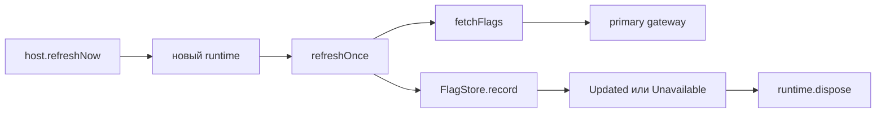

# Feature Flag Refresh Agent

> [!info] Контекст
> Это standalone guided project по `Runtime`, `Schedule`, `retry`, `repeat`, `timeout` и `race` в Effect 3.22.0. Агент получает snapshot feature flags из primary/replica, хранит последнее наблюдение и обслуживает внешние host callbacks. Сеть заменена детерминированным gateway: сложность проекта находится в политике исполнения, а не в HTTP.

## Результат

После самостоятельного transfer-этапа вы должны уметь по требованиям собрать и доказать такую политику:

- повторять только transient failures с ограниченным exponential backoff;
- отличать максимум retries от общего числа запусков;
- запускать replica с задержкой и выбирать первый успешный результат;
- ограничивать каждую попытку и всю операцию разными timeout;
- продолжать polling после неуспешного раунда, сохраняя typed observation;
- использовать один `ManagedRuntime` на жизненный цикл host и один раз закрывать scoped resources;
- отказаться от конкурентного `race`, когда предметная область требует последовательного fallback.

Прохождение после открытия полной подсказки — поддерживаемая практика. Независимым доказательством результата считаются: проверки этапов, объяснение reasoning checkpoints и transfer без spoiler.

## Профиль помощи

Профиль: **supported**.

Причина: глава вводит модель, но ещё нет наблюдаемого подтверждения, что вы самостоятельно собирали эти API. Для этапов 1–4 есть четыре уровня помощи:

1. вопрос о механизме;
2. точный файл и граница;
3. форма композиции;
4. сворачиваемая минимальная реализация этапа.

Открывайте следующий уровень только после собственной попытки. У transfer-этапа полной реализации нет.

## Предварительные знания и источники

Нужны `Effect<A, E, R>`, tagged errors, `Layer`, fibers и interruption. `TestClock` используется внутри готовых checks; писать тестовый clock не требуется.

Основной материал цикла:

```text
/home/vyacheslav/Documents/bat-effect/11/chapter.md
```

Первичные источники рядом с новыми API:

- [Runtime](https://effect.website/docs/runtime/)
- [Scheduling](https://effect.website/docs/scheduling/introduction/)
- [Retrying](https://effect.website/docs/error-management/retrying/)
- [Repetition](https://effect.website/docs/scheduling/repetition/)
- [Effect API](https://effect-ts.github.io/effect/effect/Effect.ts.html)
- [Schedule API](https://effect-ts.github.io/effect/effect/Schedule.ts.html)
- [ManagedRuntime API](https://effect-ts.github.io/effect/effect/ManagedRuntime.ts.html)

## Установка и команды

Все команды выполняются из этой директории:

```bash
pnpm install --frozen-lockfile
pnpm run start
pnpm run build
pnpm run lint
pnpm run test:baseline
```

Проверки накапливаются:

```bash
pnpm run check:1
pnpm run check:2
pnpm run check:3
pnpm run check:4
pnpm run check:transfer
pnpm run check
```

`pnpm run check` в исходном starter обязан падать: поздние возможности намеренно отсутствуют. `pnpm run test:baseline`, `build`, `lint` и `start` должны работать до ваших изменений.

## Что уже работает

Baseline:

1. `createHost()` принимает внешний callback `refreshNow`;
2. callback строит отдельный runtime, выполняет один refresh и корректно закрывает Layer;
3. `fetchFlags` читает только primary;
4. `refreshOnce` превращает success/failure в `Updated | Unavailable`;
5. `FlagStore` сохраняет последнее наблюдение и не стирает последний успешный snapshot на failure;
6. `main.ts` печатает один `Updated` и завершает host.

Это цельная однократная программа. Её ограничение — отсутствует долгоживущая политика: нет selective retry, hedging, периодичности и общего runtime между callbacks.

## Карта starter

```text
src/
├── model.ts          # FlagSnapshot, RefreshObservation, RefreshState
├── errors.ts         # typed errors и границы timeout
├── flag-gateway.ts   # сервис внешнего чтения и demo Layer
├── flag-store.ts     # Ref-backed состояние, обычно не редактировать
├── resilience.ts     # этап 1: retryPolicy
├── fetch-flags.ts    # этап 2: hedge, timeouts, retry
├── refresh-loop.ts   # этап 3: repeat
├── app-layer.ts      # composition Layer
├── runtime.ts        # этап 4: ownership runtime
├── host.ts           # этап 4: host callbacks и shutdown
├── transfer.ts       # независимый перенос: side-effecting audit write
└── main.ts           # рабочий baseline entrypoint

checks/
├── support.ts            # детерминированный gateway harness; не редактировать
├── baseline.test.ts      # starter contract
├── milestone-1.test.ts   # selective retry и off-by-one
├── milestone-2.test.ts   # first success, hedge, interruption, deadlines
├── milestone-3.test.ts   # repeat и сохранение lastGood
├── milestone-4.test.ts   # один acquire/finalizer на host lifetime
└── transfer.test.ts      # последовательный fallback для write
```

## Поток данных baseline



К концу проекта `runtime` переедет с уровня одного callback на уровень всего host, а `fetchFlags` и `refreshLoop` получат временные политики.

## Этап 1. Selective retry policy

### Зачем

`retry` не должен повторять любую ошибку. В проекте transient:

- `AttemptTimeout`;
- `GatewayUnavailable` со status `500..599`.

`SnapshotRejected` и `4xx` считаются permanent. Максимум четыре retries означает максимум пять запусков вместе с начальным.

### Где работать

Редактируйте только:

```text
src/resilience.ts
```

`checks/milestone-1.test.ts` и `checks/support.ts` не меняйте.

### Что уже есть

`retryPolicy` использует `Schedule.recurs(0)` и predicate, который всегда возвращает `false`. Это честная baseline-политика «одна попытка без retry».

### Что изменить

Соберите policy со свойствами:

1. `Schedule.exponential("10 millis", 2)`;
2. jitter в диапазоне `0.8..1.2`;
3. потолок одной задержки `100 millis`;
4. четыре retries;
5. predicate по typed error.

### Шаги реализации

1. Начните с exponential schedule.
2. Добавьте `jitteredWith` до потолка.
3. Объедините его через `union` с `spaced("100 millis")`: оба schedules бесконечны, а `union` выбирает меньший интервал.
4. Пересеките результат с `recurs(4)`: `intersect` остановится, когда исчерпается лимит.
5. Добавьте `whileInput<AttemptError>` последним, чтобы policy видела ошибку попытки.

### Reasoning checkpoint

До запуска ответьте:

- сколько вызовов будет у постоянно падающего эффекта;
- почему `recurs(4)` не означает четыре вызова всего;
- почему `upTo("100 millis")` не заменяет delay cap;
- как перестановка jitter после cap может дать задержку до 120 ms.

### Проверка

```bash
pnpm run check:1
```

Проверка различает `503`, `404`, `AttemptTimeout` и исчерпание четырёх retries.

> [!tip]- Подсказка 1: концепция
> Отделите форму задержки, максимальную задержку, лимит повторений и predicate. У каждого требования должен быть свой комбинатор.

> [!tip]- Подсказка 2: AND против OR
> `intersect` нужен для ограничения количества: продолжать должны оба плеча. `union` нужен для cap: выбирается более короткий из exponential и 100 ms.

> [!tip]- Подсказка 3: форма
> `exponential -> jitteredWith -> union(spaced(cap)) -> intersect(recurs(limit)) -> whileInput`.

> [!example]- Полная реализация — открыть после попытки
> ```typescript
> import { Schedule } from "effect";
>
> import type { AttemptError } from "./errors.js";
>
> export const retryPolicy = Schedule.exponential("10 millis", 2).pipe(
>   Schedule.jitteredWith({ min: 0.8, max: 1.2 }),
>   Schedule.union(Schedule.spaced("100 millis")),
>   Schedule.intersect(Schedule.recurs(4)),
>   Schedule.whileInput<AttemptError>(
>     (error) =>
>       error._tag === "AttemptTimeout" ||
>       (error._tag === "GatewayUnavailable" && error.status >= 500),
>   ),
> );
> ```
>
> `union` стоит после jitter, поэтому итоговая задержка не выходит за cap. `whileInput` использует `_tag`, а `recurs(4)` разрешает четыре дополнительных запуска.

## Этап 2. Hedged fetch и две области времени

### Зачем

Primary может быстро упасть, медленно ответить или зависнуть. Требуется:

- primary начинает сейчас;
- replica начинает через 20 ms;
- первый успешный результат побеждает;
- одна source-попытка ограничена 40 ms;
- `AttemptTimeout` участвует в retry-policy;
- вся операция, включая retries и backoff, ограничена 180 ms;
- общий deadline не ретраится.

### Где работать

```text
src/fetch-flags.ts
```

`flag-gateway.ts` уже предоставляет `load(source)`. Не переносите retry внутрь gateway: transport-сервис описывает одну попытку, а use case владеет политикой.

### Что уже есть

`fetchFlags` напрямую вызывает `gateway.load("primary")`. Этот baseline сохраняет typed gateway errors, но не ограничивает время и не использует replica.

### Что изменить

Соберите структуру:

```text
total timeout 180ms
└── retry policy
    └── race: first success
        ├── attempt timeout 40ms: primary
        └── delay 20ms -> attempt timeout 40ms: replica
```

### Шаги реализации

1. Создайте локальную функцию `loadSource(source)`.
2. Получите `FlagGateway` через `Effect.gen` и вызовите `load(source)`.
3. Оберните одну source-попытку в `timeoutFail` с `AttemptTimeout({ source })`.
4. Соберите `Effect.race(primary, delayedReplica)`, не `raceFirst`.
5. Оберните race в `Effect.retry(retryPolicy)`.
6. Последним поставьте общий `timeoutFail` с `DeadlineExceeded`.

### Reasoning checkpoint

Объясните до проверки:

- почему ранний `SnapshotRejected` primary не должен немедленно отменять replica;
- какой timeout видит `retryPolicy`;
- почему `DeadlineExceeded` не попадает в retry;
- какой fiber прерывается, если replica выигрывает у зависшего primary.

### Проверка

```bash
pnpm run check:2
```

Проверка охватывает fast primary, early primary failure, hanging primary, interruption loser и общий deadline.

> [!tip]- Подсказка 1: first success
> `race` ждёт первый `Success`; `raceFirst` принимает первый `Exit`, включая failure.

> [!tip]- Подсказка 2: область таймаута
> Таймаут source должен находиться внутри retry. Таймаут всей операции — снаружи retry.

> [!tip]- Подсказка 3: форма
> Сначала создайте два одинаковых `loadSource`, затем задержите всё replica-плечо и только после race добавьте retry и total timeout.

> [!example]- Полная реализация — открыть после попытки
> ```typescript
> import { Effect } from "effect";
>
> import { AttemptTimeout, DeadlineExceeded } from "./errors.js";
> import { FlagGateway } from "./flag-gateway.js";
> import type { FlagSource } from "./model.js";
> import { retryPolicy } from "./resilience.js";
>
> const loadSource = (source: FlagSource) =>
>   Effect.gen(function* () {
>     const gateway = yield* FlagGateway;
>     return yield* gateway.load(source);
>   }).pipe(
>     Effect.timeoutFail({
>       duration: "40 millis",
>       onTimeout: () => new AttemptTimeout({ source }),
>     }),
>   );
>
> const hedgedAttempt = Effect.race(
>   loadSource("primary"),
>   loadSource("replica").pipe(Effect.delay("20 millis")),
> );
>
> export const fetchFlags = hedgedAttempt.pipe(
>   Effect.retry(retryPolicy),
>   Effect.timeoutFail({
>     duration: "180 millis",
>     onTimeout: () =>
>       new DeadlineExceeded({ operation: "refresh-flags" }),
>   }),
> );
> ```
>
> `delay` охватывает всё replica-плечо, поэтому gateway ещё не вызывается. Внешний timeout прерывает текущий race вместе с обоими дочерними fibers.

## Этап 3. Периодический refresh без потери ошибки

### Зачем

`Effect.repeat` продолжает работу только после success. `refreshOnce` уже превращает любой итог `fetchFlags` в успешный `RefreshObservation`, поэтому unavailable round остаётся данными и не убивает polling.

`FlagStore.record` сохраняет `lastObservation`, но обновляет `lastGood` только для `Updated`.

### Где работать

```text
src/refresh-loop.ts
```

Не меняйте `refreshOnce` и `FlagStore`. Они уже задают нужный доменный инвариант.

### Что уже есть

`refreshLoop` использует `Schedule.recurs(0)`: выполняет один раунд и штатно завершается.

### Что изменить

Замените конечную политику на `Schedule.fixed("1 second")`.

### Шаги реализации

1. До изменения проследите `fetchFlags -> Effect.match -> FlagStore.record`.
2. Убедитесь, что error не превращается в `Effect.void`: он остаётся в `Unavailable`.
3. Измените только schedule внешнего `repeat`.
4. Не добавляйте второй `catchAll`: error channel у `refreshOnce` уже `never`.

### Reasoning checkpoint

Объясните:

- почему failure `fetchFlags` не останавливает `repeat`;
- почему `lastGood` переживает unavailable round;
- чем `fixed("1 second")` отличается от `spaced("1 second")`, если refresh занимает 300 ms;
- почему статический success-тип не доказывает, что бесконечный loop завершится сам.

### Проверка

```bash
pnpm run check:3
```

Check использует `TestClock`: начальный round, unavailable round и последующий success проходят без двух секунд реального ожидания.

> [!tip]- Подсказка 1: граница модели
> Повторяется не сырой request, а `refreshOnce`, который всегда возвращает typed observation как success.

> [!tip]- Подсказка 2: место
> Нужная строка находится в самом низу `src/refresh-loop.ts`.

> [!example]- Полная реализация — открыть после попытки
> ```typescript
> export const refreshLoop = refreshOnce.pipe(
>   Effect.repeat(Schedule.fixed("1 second")),
> );
> ```
>
> `fixed` задаёт регулярные временные слоты. Конкурентных overlapping rounds этот schedule сам не создаёт.

## Этап 4. Один ManagedRuntime на host lifetime

### Зачем

Baseline создаёт и закрывает новый runtime для каждого callback. Ресурсы не протекают, но `FlagStore` между `refreshNow` и `readStatus` не сохраняется, а scoped gateway открывается повторно.

Host должен владеть одним runtime:

```text
createHost -> make ManagedRuntime -> callbacks -> stop -> dispose once
```

### Где работать

```text
src/runtime.ts
src/host.ts
```

`app-layer.ts` продолжает экспортировать `AppLive` и не импортирует runtime. Это сохраняет ацикличное направление зависимостей.

### Что уже есть

- `runWithFreshRuntime` создаёт runtime на один callback и гарантированно вызывает `dispose`;
- `createHost` блокирует callbacks после `stop`, но до этого не хранит общий runtime.

### Что изменить

1. В `runtime.ts` замените per-call runner фабрикой `makeAppRuntime(layer)`.
2. В `createHost` создайте runtime один раз до возврата callback-ов.
3. `refreshNow` и `readStatus` запускайте через `runtime.runPromise`.
4. `stop` сначала помечает host остановленным, затем вызывает `runtime.dispose()`.
5. Сделайте `stop` идемпотентным.

### Reasoning checkpoint

Объясните:

- почему runtime создаётся внутри `createHost`, а не внутри callback;
- почему module-global runtime не обязателен: ownership определяется жизненным циклом host;
- почему после `stop` нельзя принимать новый callback;
- в каком порядке идут `AppLive -> runtime -> host` imports.

### Проверка

```bash
pnpm run check:4
```

Check вызывает `refreshNow`, затем `readStatus`: state обязан сохраниться. Gateway acquire должен произойти один раз, finalizer — один раз после `stop`.

> [!tip]- Подсказка 1: ownership
> Runtime должен жить столько же, сколько объект, которому принадлежат callbacks.

> [!tip]- Подсказка 2: граница
> `runtime.ts` создаёт runtime из переданного Layer. `host.ts` решает, когда создать и когда закрыть его.

> [!tip]- Подсказка 3: форма
> `const runtime = makeAppRuntime(layer)` находится снаружи callback-ов, но внутри `createHost`.

> [!example]- Полная реализация — открыть после попытки
> `src/runtime.ts`:
>
> ```typescript
> import { ManagedRuntime } from "effect";
> import type { Layer } from "effect";
>
> import type { FlagGateway } from "./flag-gateway.js";
> import type { FlagStore } from "./flag-store.js";
>
> export type AppServices = FlagGateway | FlagStore;
>
> export const makeAppRuntime = (
>   layer: Layer.Layer<AppServices, never, never>,
> ) => ManagedRuntime.make(layer);
> ```
>
> `src/host.ts`:
>
> ```typescript
> import type { Layer } from "effect";
>
> import { AppLive } from "./app-layer.js";
> import { HostStopped } from "./errors.js";
> import type { FlagGateway } from "./flag-gateway.js";
> import { readFlagState } from "./flag-store.js";
> import type { FlagStore } from "./flag-store.js";
> import type { RefreshObservation, RefreshState } from "./model.js";
> import { refreshOnce } from "./refresh-loop.js";
> import { makeAppRuntime } from "./runtime.js";
>
> export interface RefreshHost {
>   readonly refreshNow: () => Promise<RefreshObservation>;
>   readonly readStatus: () => Promise<RefreshState>;
>   readonly stop: () => Promise<void>;
> }
>
> export const createHost = (
>   layer: Layer.Layer<FlagGateway | FlagStore, never, never> = AppLive,
> ): RefreshHost => {
>   const runtime = makeAppRuntime(layer);
>   let stopped = false;
>
>   return {
>     refreshNow: () =>
>       stopped
>         ? Promise.reject(new HostStopped({ operation: "host-callback" }))
>         : runtime.runPromise(refreshOnce),
>     readStatus: () =>
>       stopped
>         ? Promise.reject(new HostStopped({ operation: "host-callback" }))
>         : runtime.runPromise(readFlagState),
>     stop: async () => {
>       if (stopped) return;
>       stopped = true;
>       await runtime.dispose();
>     },
>   };
> };
> ```
>
> `stopped` закрывает вход до disposal. Runtime остаётся локальным ресурсом конкретного host, а не скрытым process-global singleton.

## Этап 5. Независимый перенос: audit write

### Зачем

Hedging безопасен для idempotent read, но конкурентный запуск двух side-effecting writes может создать две записи. Здесь нужно выбрать другую композицию, а не механически скопировать `race`.

### Где работать

```text
src/transfer.ts
```

Baseline `submitAudit` конкурентно запускает primary и secondary через `Effect.race`. Он компилируется и может вернуть receipt, но нарушает требование последовательного fallback.

### Контракт

Сохраните публичную сигнатуру `submitAudit` и реализуйте:

1. primary запускается первым;
2. transient `AuditWriteError` повторяется не больше двух раз после начальной попытки;
3. permanent error не повторяется;
4. secondary запускается только после исчерпания primary;
5. один `idempotencyKey` проходит через весь вызов;
6. общий timeout равен `100 millis` и выдаёт `AuditDeadlineExceeded`;
7. primary success не запускает secondary вообще.

### Ограничения

- не используйте `race`, `raceFirst`, `all` или ручные `Promise`;
- не меняйте checks;
- не копируйте feature-flag decomposition: здесь нет polling, replica hedge или store;
- не добавляйте retry к secondary: контракт этого не требует.

### Reasoning checkpoint

До кода ответьте:

- какой комбинатор выражает последовательное «если primary окончательно упал, запусти secondary»;
- где должен стоять retry, чтобы он принадлежал только primary;
- где должен стоять общий timeout;
- почему idempotency key снижает риск повтора, но не делает конкурентную двойную запись желательной.

### Проверка

```bash
pnpm run check:transfer
```

Transfer пройден независимо, если checks проходят без открытия чужой реализации и вы можете объяснить, почему read использовал hedged race, а write использует последовательный fallback.

## Финальная интеграция

После всех этапов:

```bash
pnpm run build
pnpm run lint
pnpm run check
pnpm run start
```

Итоговое доказательство включает:

- 14 passing checks;
- точное объяснение off-by-one у `recurs(4)`;
- prediction для `race` против `raceFirst` при fast failure primary;
- дерево `total-timeout[retry[race[attempt-timeout]]]`;
- наблюдение одного gateway acquire и одного finalizer;
- самостоятельный transfer с последовательным fallback.

Не считайте проект доказательством независимого владения, если полные подсказки были открыты. В этом случае повторите transfer позже без GUIDE либо реализуйте новую политику с другими SLA и типами ошибок.

## Что намеренно не входит

- реальный HTTP и `@effect/platform`;
- `Stream`, batching и `RequestResolver`;
- circuit breaker, rate limiter и metrics backend;
- persistence store;
- process signal handling.

Эти механизмы расширяют приложение, но не улучшают доказательство целевой способности этой работы.
