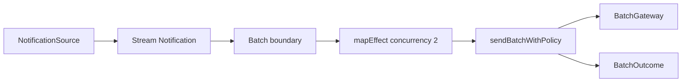

# Notification Batch Dispatcher на Effect 4

Этот guided project учит собирать небольшой backend worker из уже знакомых Effect-концепций. Worker получает поток уведомлений, формирует bulk batches, отправляет ограниченное число batches параллельно и локализует ошибки отдельного batch.

Проект намеренно не содержит HTTP server, базы данных, `Queue`, `PubSub`, STM и `RequestResolver`. Они не нужны, чтобы увидеть различия между асинхронностью, concurrency и batching.

<a id="toc"></a>
## Оглавление

- [Результат обучения](#learning-outcome)
- [Почему именно такой scope](#scope)
- [Предварительные знания](#prerequisites)
- [Что starter уже делает](#baseline)
- [Карта файлов и точек изменения](#project-map)
- [Поток данных](#data-flow)
- [Команды и рабочий цикл](#workflow)
- [Этап 1. Фиксированная batch boundary](#milestone-1)
- [Этап 2. Bounded concurrency](#milestone-2)
- [Этап 3. Retry и failure isolation](#milestone-3)
- [Независимый transfer. Размер или время](#transfer)
- [Финальная самопроверка](#self-check)
- [Источники](#sources)

<a id="learning-outcome"></a>
## Результат обучения

После завершения проекта вы сможете по наблюдаемому поведению различать и связывать три механизма:

- **асинхронность**: один `BatchGateway.sendBatch` может ожидать I/O, не блокируя JavaScript thread;
- **batching**: несколько `Notification` становятся одной единицей внешнего I/O;
- **concurrency**: несколько независимых batch-вызовов находятся в работе одновременно, но их число ограничено.

Итоговый pipeline должен:

1. получить `Stream<Notification>` из service;
2. сформировать batches по три элемента;
3. отправлять не больше двух batches одновременно;
4. повторять `GatewayUnavailable` не более двух раз после первой попытки;
5. не повторять `BatchRejected`;
6. вернуть `BatchOutcome` для каждого batch, не потеряв успешные соседние batches;
7. перенести фиксированную границу на правило «три элемента или 50 millis».

Прохождение checks после открытия полной реализации считается supported practice. Evidence самостоятельного переноса даёт `check:transfer`, выполненный без готового решения.

[К оглавлению](#toc)

<a id="scope"></a>
## Почему именно такой scope

В прошлом проекте один этап одновременно требовал связать `Queue`, `Deferred`, worker fibers, `PubSub`, `Semaphore` и scope. Здесь каждый этап меняет один наблюдаемый механизм:

1. сначала меняется единица работы — notification превращаются в batches;
2. затем меняется способ исполнения batches — sequential становится concurrent;
3. затем добавляется политика ошибок одного batch.

`Request` / `RequestResolver` здесь не используются. Это другой вид batching: runtime коалесцирует независимые requests, дошедшие до общей batch boundary. В этом проекте `Stream.grouped` явно превращает последовательность значений в bulk units. Смешивание обоих механизмов до уверенного владения одним из них добавило бы лишнюю скрытую зависимость.

EffectPatterns использует Effect 3. Примеры из него показывают форму паттерна, но их нельзя копировать без проверки. В установленном Effect 4 `Stream.grouped` и `Stream.groupedWithin` возвращают `Array<A>`, а не `Chunk<A>`.

[К оглавлению](#toc)

<a id="prerequisites"></a>
## Предварительные знания

Нужны:

- чтение `Effect<A, E, R>`;
- `Effect.gen` и `yield*`;
- tagged errors и `Effect.match`;
- service как требование в `R` и предоставление через `Layer`;
- понимание, что созданный `Effect` ленив и ничего не делает до включения в исполняемую композицию.

Не требуется заранее знать:

- внутреннее устройство `Stream`;
- `Channel`;
- ручное управление fibers;
- `Semaphore`;
- алгоритмы динамического batching.

Перед этапом 1 полезно перечитать mentor lesson 9: `Stream: pull vs push, buffer, grouped, merge, broadcast`. Перед этапом 3 — lesson 11 о `Schedule` и retry. Нужные API и проверенные внешние паттерны также связаны рядом с конкретным этапом.

[К оглавлению](#toc)

<a id="baseline"></a>
## Что starter уже делает

Starter полностью запускается. Он не содержит `TODO`, пустых handlers или искусственных исключений.

`runDispatcher`:

1. получает `NotificationSource` из Effect environment;
2. читает `source.stream`;
3. превращает каждую notification в singleton batch;
4. последовательно вызывает `BatchGateway.sendBatch`;
5. превращает success или typed failure в `BatchOutcome`;
6. собирает outcomes.

Для семи notifications baseline выполняет семь gateway-вызовов по одному элементу. Это корректно, но не использует bulk API и не перекрывает ожидание независимых запросов.

Запустите:

```bash
pnpm run smoke
```

В логах будут семь отдельных сообщений `gateway accepted [...]`, после чего — итоговая строка dispatcher-а.

[К оглавлению](#toc)

<a id="project-map"></a>
## Карта файлов и точек изменения

```text
src/
├── domain.ts     # Notification, GatewayReceipt, errors, BatchOutcome
├── services.ts   # NotificationSource, BatchGateway и demo layers
├── pipeline.ts   # learner surface этапов 1–3
├── transfer.ts   # learner surface независимого transfer
└── index.ts      # готовый smoke scenario

checks/
├── support.ts
├── starter.test.ts
├── milestone-1.test.ts
├── milestone-2.test.ts
├── milestone-3.test.ts
└── transfer.test.ts

package.json       # scripts и project-local dependencies
pnpm-lock.yaml     # зафиксированное дерево dependencies
tsconfig.json      # строгая TypeScript-проверка src и checks
vitest.config.ts   # project-local test discovery
eslint.config.js   # project-local lint rules
```

| Этап | Редактировать | Публичный symbol | Обычно не менять |
|---|---|---|---|
| 1 | `src/pipeline.ts` | `dispatchFixedBatches` | `domain.ts`, `services.ts`, checks |
| 2 | `src/pipeline.ts` | `dispatchFixedBatches` | `sendBatchWithPolicy`, checks |
| 3 | `src/pipeline.ts` | `sendBatchWithPolicy` | services и test scripts |
| Transfer | `src/transfer.ts` | `dispatchWithin` | основные этапы и checks |

`checks/**` — проверочная инфраструктура. Она наблюдает gateway calls, число активных операций и outcomes через публичное поведение. Не подстраивайте production-код под приватные helper names и не меняйте checks, чтобы сделать их зелёными.

[К оглавлению](#toc)

<a id="data-flow"></a>
## Поток данных



Разделение responsibilities:

- `NotificationSource` владеет способом получения входа;
- `Stream.grouped` или `groupedWithin` владеет batch boundary;
- `Stream.mapEffect` владеет concurrency между единицами потока;
- `sendBatchWithPolicy` владеет retry одного batch и преобразованием ошибки в outcome;
- `BatchGateway` владеет внешним I/O, но не решает, как группировать и планировать работу.

[К оглавлению](#toc)

<a id="workflow"></a>
## Команды и рабочий цикл

Установка выполняется только внутри проекта:

```bash
cd projects/guided/notification-batch-dispatcher
pnpm install
```

Проверка baseline:

```bash
pnpm run build
pnpm run lint
pnpm test
pnpm run smoke
```

Для каждого этапа:

1. прочитайте только контракт текущего этапа;
2. предскажите, почему baseline нарушает его;
3. запустите targeted check;
4. измените только названный symbol;
5. повторите cumulative check;
6. ответьте на reasoning checkpoint;
7. открывайте подсказки по одной, а не все сразу.

Команды:

```bash
pnpm run check:1
pnpm run check:2
pnpm run check:3
pnpm run check:transfer
pnpm run check
```

`check:2` включает starter и этап 1; `check:3` включает все предыдущие этапы. Поэтому более позднее изменение не должно ломать уже доказанные свойства.

[К оглавлению](#toc)

<a id="milestone-1"></a>
## Этап 1. Фиксированная batch boundary

### Зачем

Gateway поддерживает bulk operation: один вызов принимает несколько notifications. Сейчас `dispatchFixedBatches` вручную создаёт `[notification]`, поэтому внешний вызов остаётся per-item.

На этом этапе concurrency намеренно остаётся равной одному. Иначе по наблюдению будет трудно отделить выигрыш от уменьшения числа вызовов от выигрыша из-за перекрытия ожиданий.

### Где работать

Редактируйте только:

```text
src/pipeline.ts → dispatchFixedBatches
```

Не меняйте `sendBatchWithPolicy`, gateway service, `runDispatcher` и checks.

### Что уже есть

Текущий pipeline:

```text
Notification
  → [Notification]
  → sendBatchWithPolicy
  → BatchOutcome
```

`Stream.mapEffect` уже исполняет effectful callback. Проблема находится до него: `Stream.map` делает singleton array для каждого элемента.

### Что изменить

Нужно получить:

```text
Notification × 7
  → [n1, n2, n3]
  → [n4, n5, n6]
  → [n7]
```

Контракт:

- размер полного batch равен трём;
- последний неполный batch отправляется при завершении конечного source;
- порядок внутри batch сохраняется;
- notification не теряются и не дублируются;
- batches пока отправляются последовательно.

### Шаги реализации

1. Найдите место, где отдельная notification превращается в singleton array.
2. Уберите эту ручную трансформацию.
3. До `Stream.mapEffect` примените оператор, который группирует последовательные элементы по фиксированному размеру.
4. Передайте размер `3`.
5. Не меняйте `concurrency: 1`.
6. Проверьте тип значения, которое приходит в `sendBatchWithPolicy`: в Effect 4 это `Array<Notification>`.

Рядом с задачей полезны:

- [EffectPatterns: Process Items in Batches](https://github.com/PaulJPhilp/EffectPatterns/blob/main/content/published/patterns/building-data-pipelines/stream-process-in-batches.mdx);
- [Effect 4 Stream declarations: `grouped`](https://unpkg.com/effect@4.0.0-beta.101/dist/Stream.d.ts).

> [!warning]
> EffectPatterns показывает Effect 3 и `Chunk`. Не добавляйте `Chunk.toArray`: в установленной версии `Stream.grouped` уже выдаёт `Array`.

### Проверка

```bash
pnpm run check:1
```

Check требует gateway calls с ID:

```text
[n1, n2, n3]
[n4, n5, n6]
[n7]
```

Он также проверяет, что итоговая последовательность содержит все семь ID ровно один раз.

### Reasoning checkpoint

Ответьте своими словами:

1. Почему `Stream.grouped(3)` уменьшает число внешних вызовов, но само по себе не делает их concurrent?
2. В какой момент последний batch из одного элемента становится доступен downstream?
3. Что случилось бы с неполным batch, если бы source никогда не завершался?

> [!tip]- Подсказка 1: концепция
> Нужен оператор, который меняет **единицу элемента потока**: `Stream<Notification>` должен стать `Stream<Array<Notification>>`.

> [!tip]- Подсказка 2: место
> Замените `Stream.map((notification) => [notification])` внутри `dispatchFixedBatches`. Остальная композиция уже принимает array.

> [!tip]- Подсказка 3: форма
> ```text
> source
>   → grouped(3)
>   → mapEffect(sendBatchWithPolicy, concurrency 1)
> ```

> [!example]- Полная реализация — открыть после попытки
> Замените только `dispatchFixedBatches`:
>
> ```typescript
> export const dispatchFixedBatches = (
>   source: Stream.Stream<Notification, SourceError>,
> ): Stream.Stream<BatchOutcome, SourceError, BatchGateway> =>
>   source.pipe(
>     Stream.grouped(3),
>     Stream.mapEffect(sendBatchWithPolicy, { concurrency: 1 }),
>   );
> ```
>
> `grouped(3)` сохраняет порядок и выпускает последний неполный array при завершении конечного source. `mapEffect` остаётся последовательным, поэтому этот этап не скрывает batching за concurrency.

[К оглавлению](#toc)

<a id="milestone-2"></a>
## Этап 2. Bounded concurrency

### Зачем

После этапа 1 gateway получает правильные batches, но следующий вызов начинается только после завершения предыдущего. `sendBatch` асинхронный, однако последовательная композиция ожидает каждый effect перед переходом дальше.

Теперь batches независимы, поэтому можно перекрыть I/O. Лимит нужен, чтобы worker не отправил неограниченное число запросов внешнему сервису.

### Где работать

Редактируйте только:

```text
src/pipeline.ts → dispatchFixedBatches
```

Сохраните `Stream.grouped(3)` из этапа 1. Не добавляйте ручные fibers, `Effect.all`, `Semaphore` или массив promises.

### Что уже есть

После этапа 1 pipeline формирует три batches, но `Stream.mapEffect` использует `concurrency: 1`.

Test gateway ведёт два счётчика:

- сколько вызовов активно сейчас;
- максимальное наблюдавшееся число активных вызовов.

Check измеряет overlap самого gateway, а не длительность всего теста.

### Что изменить

Установите лимит concurrency равным двум.

Контракт:

- два batch-запроса могут находиться в работе одновременно;
- третий не стартует, пока не освободится один слот;
- `maxActive` равен двум и никогда не превышает два;
- outcomes остаются в исходном порядке batches;
- этап 1 продолжает формировать `3, 3, 1`.

### Шаги реализации

1. Найдите options текущего `Stream.mapEffect`.
2. Измените только значение concurrency.
3. Не включайте `unordered`: по умолчанию downstream получает результаты в исходном порядке.
4. Не перемещайте concurrency на gateway service. Ограничение относится к планированию batch units в pipeline.
5. Запустите cumulative check.

Рядом с задачей полезны:

- [EffectPatterns: Process Items Concurrently](https://github.com/PaulJPhilp/EffectPatterns/blob/main/content/published/patterns/building-data-pipelines/stream-process-concurrently.mdx);
- [Effect 4 `Stream.mapEffect` signature](https://unpkg.com/effect@4.0.0-beta.101/dist/Stream.d.ts).

### Проверка

```bash
pnpm run check:2
```

Check использует медленный test gateway и подтверждает сам факт overlap. Он не принимает `unbounded`, потому что наблюдаемое значение превысило бы контракт на большем входе.

### Reasoning checkpoint

До изменения предскажите timeline для трёх batches `A`, `B`, `C`:

```text
concurrency 1: ?
concurrency 2: ?
```

После проверки объясните:

1. Почему `sendBatch` оставался асинхронным и при `concurrency: 1`?
2. Какое свойство добавило значение `2`?
3. Почему сохранение порядка результата не означает, что gateway calls завершались по порядку?

> [!tip]- Подсказка 1: концепция
> Асинхронность описывает возможность ожидать I/O. Concurrency описывает число независимых effects, которым runtime разрешил продвигаться одновременно.

> [!tip]- Подсказка 2: место
> Нужное управление уже находится в options единственного `Stream.mapEffect` внутри `dispatchFixedBatches`.

> [!tip]- Подсказка 3: форма
> Batch boundary не меняется. Меняется только число slots, доступных effectful mapping.

> [!example]- Полная реализация — открыть после попытки
> Итоговая функция этапа 2:
>
> ```typescript
> export const dispatchFixedBatches = (
>   source: Stream.Stream<Notification, SourceError>,
> ): Stream.Stream<BatchOutcome, SourceError, BatchGateway> =>
>   source.pipe(
>     Stream.grouped(3),
>     Stream.mapEffect(sendBatchWithPolicy, { concurrency: 2 }),
>   );
> ```
>
> Лимит принадлежит `mapEffect`, потому что именно этот оператор запускает внешний effect для каждой единицы потока. `unordered` не нужен: проект требует стабильный порядок outcomes.

[К оглавлению](#toc)

<a id="milestone-3"></a>
## Этап 3. Retry и failure isolation

### Зачем

Concurrent stream по умолчанию fail-fast: failure одной effectful операции может прервать остальные in-flight effects. Starter уже преобразует gateway error в `BatchOutcome`, поэтому соседние batches не теряются, но transient failure получает только одну попытку.

Retry должен применяться **до** `Effect.match`. После `match` error channel уже `never`, и runtime не увидит failure, который можно повторить.

### Где работать

Редактируйте только:

```text
src/pipeline.ts → sendBatchWithPolicy
```

Не меняйте `dispatchFixedBatches`, error classes, gateway contract и test scripts.

### Что уже есть

`sendBatchWithPolicy`:

1. получает `BatchGateway`;
2. один раз вызывает `sendBatch`;
3. через `Effect.match` превращает success или error в `BatchOutcome`.

Gateway может вернуть:

- `GatewayUnavailable` — временная недоступность;
- `BatchRejected` — batch отклонён из-за его содержимого.

### Что изменить

Добавьте retry только для `GatewayUnavailable`.

Контракт:

- первая попытка выполняется всегда;
- после `GatewayUnavailable` разрешены ещё две попытки;
- всего может быть не больше трёх gateway calls для одного batch;
- `BatchRejected` не повторяется;
- success после retry превращается в `Delivered`;
- terminal error после исчерпания retry превращается в `Failed`;
- ошибка одного batch остаётся значением и не прерывает соседние batches.

### Шаги реализации

1. Сначала постройте effect одного gateway-вызова, сохранив `GatewayError` в `E`.
2. До `Effect.match` примените `Effect.retry`.
3. Задайте `times: 2`: это две повторные попытки после исходной.
4. Добавьте predicate `while`, который возвращает `true` только для `_tag === "GatewayUnavailable"`.
5. Оставьте существующий `Effect.match` после retry.
6. Не добавляйте retry вокруг всего `dispatchFixedBatches`: это повторило бы уже успешные batches и повторно прочитало source.

Рядом с задачей полезны:

- [EffectPatterns: Retry failed operations](https://github.com/PaulJPhilp/EffectPatterns/blob/main/content/published/patterns/error-management/handle-flaky-operations-with-retry-timeout.mdx);
- [Effect 4 `Effect.retry` declaration](https://unpkg.com/effect@4.0.0-beta.101/dist/Effect.d.ts).

> [!warning]
> Внешний пример использует Effect 3 и более широкую retry policy. Контракт проекта требует selective retry по `_tag`, а не повтор любой ошибки.

### Проверка

```bash
pnpm run check:3
```

Сценарий check:

- первый batch дважды получает `GatewayUnavailable`, затем success;
- второй получает `BatchRejected`;
- третий сразу получает success.

Наблюдаемое доказательство:

- число попыток: `3`, `1`, `1`;
- outcomes: `Delivered`, `Failed`, `Delivered`;
- failed outcome второго batch содержит `reason: "BatchRejected"`.

### Reasoning checkpoint

Объясните:

1. Почему `Effect.retry` должен стоять до `Effect.match`?
2. Почему retry всего stream может повторно отправить уже доставленные notifications?
3. Почему `times: 2` означает максимум три gateway calls, а не два?
4. Какая сторона системы решает, является ошибка transient: gateway, pipeline или `Stream.mapEffect`?

> [!tip]- Подсказка 1: концепция
> Retry работает только с typed failure в канале `E`. После превращения failure в обычный `BatchOutcome` повторять уже нечего.

> [!tip]- Подсказка 2: место
> Внутри `sendBatchWithPolicy` отделите effect `gateway.sendBatch(batch)` от следующего `Effect.match`. Между ними находится policy boundary.

> [!tip]- Подсказка 3: форма
> ```text
> sendBatch
>   → retry(times 2, while error is GatewayUnavailable)
>   → match
>   → BatchOutcome
> ```

> [!example]- Полная реализация — открыть после попытки
> Замените только `sendBatchWithPolicy`:
>
> ```typescript
> export const sendBatchWithPolicy = (
>   batch: ReadonlyArray<Notification>,
> ): Effect.Effect<BatchOutcome, never, BatchGateway> =>
>   Effect.gen(function* () {
>     const gateway = yield* BatchGateway;
>     return yield* gateway.sendBatch(batch);
>   }).pipe(
>     Effect.retry({
>       times: 2,
>       while: (error) => error._tag === "GatewayUnavailable",
>     }),
>     Effect.match({
>       onFailure: (error): BatchOutcome => ({
>         _tag: "Failed",
>         notificationIds: batch.map(({ id }) => id),
>         reason: error._tag,
>       }),
>       onSuccess: (receipt): BatchOutcome => ({
>         _tag: "Delivered",
>         notificationIds: batch.map(({ id }) => id),
>         gatewayBatchId: receipt.gatewayBatchId,
>       }),
>     }),
>   );
> ```
>
> Predicate сохраняет `BatchRejected` terminal. `match` расположен после retry, поэтому success третьей попытки становится `Delivered`, а последняя ошибка — `Failed`.

[К оглавлению](#toc)

<a id="transfer"></a>
## Независимый transfer. Размер или время

### Результат

`dispatchWithin` должен работать с low-traffic source, который может долго не завершаться.

Batch выпускается при первом наступившем условии:

- накоплено три notifications;
- прошло `50 millis` с начала текущего непустого batch.

### Где работать

Редактируйте только:

```text
src/transfer.ts → dispatchWithin
```

Не меняйте `dispatchFixedBatches`, `sendBatchWithPolicy` и transfer check.

### Что уже есть

Baseline использует `Stream.grouped(3)`. Для конечного source он выпускает остаток при завершении. Для source вида:

```text
notification → затем тишина без завершения
```

остаток никогда не достигает размера три и не отправляется.

### Что изменить

Сохраните:

- maximum batch size `3`;
- `concurrency: 2`;
- вызов `sendBatchWithPolicy`;
- тип результата.

Добавьте temporal boundary `50 millis`. Пустые batches отправляться не должны.

### Проверка

```bash
pnpm run check:transfer
```

Check создаёт stream с одной notification, который после неё остаётся открытым. Через `49 millis` gateway ещё не вызван. После следующей `1 millis` batch должен быть выпущен. Время управляется через `TestClock`, реального ожидания нет.

Это независимый transfer. Полной реализации и алгоритмической подсказки здесь нет. Сигнатура нужного Effect 4 API доступна в [официальных declarations `Stream.groupedWithin`](https://unpkg.com/effect@4.0.0-beta.101/dist/Stream.d.ts).

### Reasoning checkpoint

После прохождения объясните:

1. Какое событие открывает временное окно?
2. Что произойдёт раньше при быстром входе: size boundary или time boundary?
3. Почему `Stream.grouped(3)` достаточно для конечного файла, но недостаточно для долгоживущего socket/event source?

[К оглавлению](#toc)

<a id="self-check"></a>
## Финальная самопроверка

Запустите:

```bash
pnpm run build
pnpm run lint
pnpm run check
pnpm run smoke
```

Затем без кода объясните весь путь одной notification:

```text
source
→ stream element
→ batch
→ concurrency slot
→ gateway attempt
→ optional retry
→ BatchOutcome
```

Evidence самостоятельного владения требует, чтобы вы могли:

- назвать место каждой boundary;
- предсказать число gateway calls для семи notifications;
- предсказать максимальное число in-flight calls;
- объяснить, почему rejected batch не повторяется;
- выполнить transfer без полного spoiler.

Если для этапа был открыт `Полная реализация`, это нормальная supported practice, но не независимое evidence. После завершения стоит повторить соответствующий symbol через несколько дней без guide.

[К оглавлению](#toc)

<a id="sources"></a>
## Источники

Локальные материалы ментора:

- lesson 6 — fibers и bounded concurrency;
- lesson 9 — `Stream`, `mapEffect`, `grouped`, backpressure;
- lesson 11 — retry и `Schedule`.

EffectPatterns, используемые как аналогии паттернов:

- [Process Items in Batches](https://github.com/PaulJPhilp/EffectPatterns/blob/main/content/published/patterns/building-data-pipelines/stream-process-in-batches.mdx);
- [Process Items Concurrently](https://github.com/PaulJPhilp/EffectPatterns/blob/main/content/published/patterns/building-data-pipelines/stream-process-concurrently.mdx);
- [Handle Flaky Operations with Retries and Timeouts](https://github.com/PaulJPhilp/EffectPatterns/blob/main/content/published/patterns/error-management/handle-flaky-operations-with-retry-timeout.mdx).

Версионные первичные источники:

- [`effect@4.0.0-beta.101` package](https://www.npmjs.com/package/effect/v/4.0.0-beta.101);
- [Effect 4 `Stream.d.ts`](https://unpkg.com/effect@4.0.0-beta.101/dist/Stream.d.ts);
- [Effect 4 `Effect.d.ts`](https://unpkg.com/effect@4.0.0-beta.101/dist/Effect.d.ts);
- [`@effect/vitest@4.0.0-beta.101`](https://www.npmjs.com/package/@effect/vitest/v/4.0.0-beta.101).

[К оглавлению](#toc)
