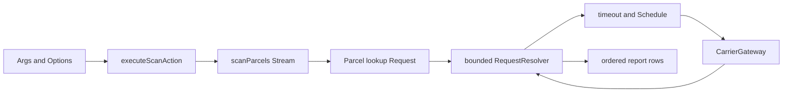

# Parcel Status Radar

> [!info] Контекст
> Это компактный guided project по главам 09–12 BatSchool Effect-TS. Вы построите CLI, который принимает tracking IDs, обрабатывает их как конечный `Stream`, объединяет независимые lookup-запросы через `RequestResolver`, применяет ограниченную retry/timeout policy и печатает отчёт через `@effect/cli`.

## Результат

После завершения вы сможете:

- построить cold `Stream` из конечного входа и ограничить concurrency effectful stage;
- сохранить порядок отчёта при различном порядке завершения lookup-ов;
- отличить explicit Stream batching от runtime batching независимых `Request`;
- завершить каждый request успехом или typed error внутри `RequestResolver`;
- дедуплицировать одинаковые concurrent requests и ограничить размер gateway batch;
- применить timeout к каждой внешней попытке, а retry — только к `CarrierUnavailable`;
- описать variadic args и числовые options через `@effect/cli`;
- запустить composition root через `NodeRuntime.runMain`;
- перенести тот же механизм в агрегирующий отчёт без готовой декомпозиции.

Финальная команда:

```bash
pnpm start -- scan PKG-101 PKG-102 PKG-101 \
  --concurrency 3 \
  --batch-size 3 \
  --retries 2
```

Она должна вывести три строки в исходном порядке. Повторный `PKG-101` остаётся в отчёте, но внутри одной request boundary не создаёт второй gateway lookup.

## Scope

Проект использует один сквозной механизм из каждой главы:

| Глава | Практикуемый механизм |
|---|---|
| 09 · Stream | finite/cold `Stream`, `mapEffect`, bounded concurrency, ordered output |
| 10 · Batching | `Request`, `RequestResolver.makeBatched`, `batchN`, request deduplication |
| 11 · Runtime и Schedule | per-attempt timeout, exponential retry, cap, tagged retry condition |
| 12 · Production-обвязка | `Args`, `Options`, `Command`, `NodeContext`, `NodeRuntime.runMain` |

Чтобы работа оставалась небольшой, здесь нет `asyncPush`, `broadcast`, TTL value cache, `repeat`, `race`, raw Terminal UI, Prompt, `HttpApi` и SSE. Они не нужны для заявленного результата.

## Профиль помощи

Профиль: **supported**.

Для этапов 1–4 доступны четыре уровня раскрытия:

1. governing concept;
2. точный файл и boundary;
3. pseudocode/API shape;
4. полная реализация только текущего milestone.

Открывайте следующий уровень после собственной гипотезы и запуска проверки. Полный spoiler означает supported practice, а не самостоятельное mastery. У независимого transfer нет подсказок и реализации.

## Предварительные знания

Нужны уже знакомые механизмы из предыдущих глав:

- `Effect<A, E, R>` и `Effect.gen`;
- typed errors через `Data.TaggedError`;
- service contract и `Layer`;
- fibers на уровне понимания concurrency, без ручного управления ими;
- `Scope` на уровне понимания lifecycle `NodeRuntime`.

Новые API вводятся непосредственно перед местом применения.

## Установка и команды

Проект является самостоятельным package и не использует root `node_modules`:

```bash
cd projects/guided/parcel-status-radar
pnpm install --frozen-lockfile
```

Рабочий цикл:

```bash
pnpm run test:baseline
pnpm run check:1
pnpm run check:2
pnpm run check:3
pnpm run check:4
pnpm run check:transfer
```

Финальная проверка:

```bash
pnpm run check
pnpm run build
pnpm run lint
pnpm run smoke
pnpm start -- scan PKG-101 PKG-102 PKG-101 --concurrency 3 --batch-size 3 --retries 2
```

`check:N` является накопительной проверкой: этап `N` обязан сохранять предыдущие контракты.

## Что уже работает

Starter не содержит заглушек или `TODO`-исключений. Он:

1. принимает tracking IDs через простой ручной argv adapter;
2. вызывает `CarrierGateway.fetchBatch([trackingId])` для каждого ID;
3. возвращает `ParcelNotFound` для отсутствующего статуса;
4. превращает успех или ошибку каждого lookup в отдельную строку отчёта;
5. сохраняет исходный порядок;
6. печатает deterministic demo report;
7. вычисляет правильный hub summary, хотя пока делает lookup-и последовательно.

Проверьте baseline:

```bash
pnpm run test:baseline
pnpm run smoke
```

Ожидаемый demo report:

```text
PKG-101	in_transit	Riga
PKG-102	delayed	Berlin
PKG-101	in_transit	Riga
```

Красные milestone checks до реализации ожидаемы. Ошибка должна указывать на отсутствующее поведение, а не на импорт, TypeScript или setup.

## Карта starter-а

```text
src/
├── domain.ts       типы статусов, report rows и typed errors; обычно не менять
├── carrier.ts      gateway contract и deterministic demo Layer; scaffold
├── pipeline.ts     этап 1 и request batch boundary этапа 2
├── requests.ts     direct lookup baseline; этап 2
├── resilience.ts   single-attempt baseline; этап 3
├── cli.ts          transport-neutral action и вывод; этап 4
├── main.ts         ручной argv adapter; этап 4
└── summary.ts      рабочий sequential transfer baseline

checks/
├── support.ts
├── baseline.test.ts
├── milestone-1.test.ts
├── milestone-2.test.ts
├── milestone-3.test.ts
├── milestone-4.test.ts
└── transfer.test.ts
```

`checks/`, `domain.ts` и demo implementation в `carrier.ts` — supporting scaffold. Не меняйте проверки, публичные имена, error tags и форму report rows.

## Архитектура и data flow



Границы ответственности:

- `pipeline.ts` владеет входным порядком, concurrency и превращением результата в report row;
- `requests.ts` владеет request identity, batch boundary и completion каждой заявки;
- `resilience.ts` владеет lifetime и retry одной gateway operation;
- `cli.ts` переводит уже разобранный transport input в `ScanAction`;
- `main.ts` является единственным composition root.

## Рабочий цикл этапа

1. Запишите prediction до запуска.
2. Запустите только текущий cumulative check.
3. Объясните failure через механизм.
4. Измените названные symbols.
5. Повторите check.
6. Открывайте подсказки по одной.
7. После green кратко ответьте на reasoning checkpoint.

---

## Этап 1. Finite Stream и bounded concurrency

### Зачем

Последовательный direct client корректен, но latency складывается: четыре независимых lookup-а ждут друг друга. `Stream.mapEffect` позволяет ограничить число одновременно выполняемых эффектов без ручного создания fibers. По умолчанию ordered mode сохраняет порядок элементов, даже если быстрый lookup завершился раньше медленного.

### Где работать

Изменяйте только:

- `src/pipeline.ts`;
- функцию `scanParcels` и необходимые imports.

`makeParcelLookup`, error mapping и report row contract сохраняются.

### Что уже есть

`scanParcels` использует последовательный `Effect.forEach`. Он возвращает правильный отчёт и не обрывает весь запуск из-за одного `ParcelNotFound`.

### Что изменить

Постройте cold stream из пар `{ trackingId, index }`, выполните lookup через `Stream.mapEffect` с `options.concurrency`, соберите stream и верните обычный `ReadonlyArray<ParcelReportRow>`.

### Шаги реализации

1. Импортируйте `Chunk` и `Stream` из `effect`.
2. До построения stream один раз создайте `lookup` — как в baseline.
3. Преобразуйте вход в пары `{ trackingId, index }`; индекс нужен report row, а не scheduler-у.
4. Создайте `Stream.fromIterable`.
5. Перенесите существующий `lookup(...).pipe(Effect.match(...))` в `Stream.mapEffect`.
6. Передайте `{ concurrency: options.concurrency }`. Не включайте `unordered`.
7. Выполните stream через `Stream.runCollect`.
8. Преобразуйте `Chunk` в readonly array только на внешней границе.

### Проверка

```bash
pnpm run check:1
```

Check использует `batchSize: 1`, чтобы измерять именно concurrency pipeline, а не последующий resolver batching. Один lookup искусственно медленнее остальных. Должны наблюдаться два активных gateway call и исходный порядок строк.

### Reasoning checkpoint

До кода предскажите:

1. в каком порядке завершатся `PKG-SLOW` и `PKG-FAST-1`;
2. в каком порядке они окажутся в результате;
3. что изменит `{ unordered: true }`;
4. почему создание `Stream` ещё не запускает gateway.

Источник: [Effect Stream introduction](https://effect.website/docs/stream/introduction/).

> [!tip]- Подсказка 1: концепция
> Concurrency отвечает за число одновременно исполняемых effectful callbacks. Ordered `mapEffect` отдельно удерживает логический порядок output.

> [!tip]- Подсказка 2: место
> Меняется только последовательность после создания `lookup` внутри `scanParcels`. Error mapping уже корректен — перенесите его без изменения семантики.

> [!tip]- Подсказка 3: форма
> ```text
> input with indexes
>   -> Stream.fromIterable
>   -> Stream.mapEffect(lookup + match, { concurrency })
>   -> Stream.runCollect
>   -> Chunk.toReadonlyArray
> ```

> [!tip]- Полная реализация — открыть после попытки
> В `pipeline.ts` замените импорт и `scanParcels`:
>
> ```typescript
> import { Chunk, Effect, Stream } from "effect";
>
> export const scanParcels = (
>   trackingIds: ReadonlyArray<TrackingId>,
>   gateway: CarrierGatewayService,
>   options: ScanOptions,
> ): Effect.Effect<ReadonlyArray<ParcelReportRow>> => {
>   const lookup = makeParcelLookup(gateway, {
>     batchSize: options.batchSize,
>     resilience: options.resilience,
>   });
>   const indexed = trackingIds.map((trackingId, index) => ({
>     trackingId,
>     index,
>   }));
>
>   return Stream.fromIterable(indexed).pipe(
>     Stream.mapEffect(
>       ({ trackingId, index }) =>
>         lookup.lookup(trackingId).pipe(
>           Effect.match({
>             onFailure: (error): ParcelReportRow => ({
>               _tag: "Failed",
>               index,
>               trackingId,
>               error,
>             }),
>             onSuccess: (status): ParcelReportRow => ({
>               _tag: "Found",
>               index,
>               trackingId,
>               status,
>             }),
>           }),
>         ),
>       { concurrency: options.concurrency },
>     ),
>     Stream.runCollect,
>     Effect.map(Chunk.toReadonlyArray),
>   );
> };
> ```
>
> `index` путешествует вместе с value, поэтому порядок не восстанавливается сортировкой после выполнения. `Chunk` остаётся внутренним представлением Stream и преобразуется один раз на boundary.

---

## Этап 2. RequestResolver, batching и deduplication

### Зачем

Concurrent singleton calls всё ещё создают N внешних обращений. `Request` описывает желаемый lookup, `RequestResolver` знает, как обработать собранный пакет, а runtime создаёт batch boundary. Повторные requests с одинаковым `trackingId` схлопываются по structural equality, но каждая исходная позиция получает результат.

### Где работать

Изменяйте:

- `src/requests.ts`: `ParcelStatusRequest` и `makeParcelLookup`;
- `src/pipeline.ts`: effectful mapping boundary внутри `scanParcels`.

Не переносите batching в `CarrierGateway`. Gateway принимает уже сформированный batch и не должен знать о fibers или input order.

### Что уже есть

`makeParcelLookup` вызывает `fetchBatchWithPolicy([trackingId])` напрямую. Этап 1 запускает несколько таких lookup-ов concurrent, но они остаются независимыми effects.

### Что изменить

1. Опишите `ParcelStatusRequest extends Request.Request<ParcelStatus, ParcelLookupError>`.
2. Создайте constructor через `Request.tagged`.
3. В `makeParcelLookup` создайте один `RequestResolver.makeBatched`.
4. Один раз вызовите `fetchBatchWithPolicy` со всеми IDs входного resolver batch.
5. Превратите результат gateway в `Either`, чтобы resolver effect имел error type `never`.
6. Завершите **каждую** заявку через `Request.completeEffect`:
   - весь gateway batch упал — каждая request получает эту ошибку;
   - ответ найден — request получает `ParcelStatus`;
   - ответ отсутствует — только эта request получает `ParcelNotFound`.
7. Ограничьте resolver через `RequestResolver.batchN(..., options.batchSize)`.
8. Реализуйте `lookup` через `Effect.request`.
9. В pipeline разделите вход на bounded windows через `Stream.grouped(options.batchSize)`.
10. Выполняйте windows через ordered `Stream.mapEffect` с `options.concurrency`.
11. Внутри одного window запустите lookup-и через `Effect.forEach(..., { concurrency: "unbounded", batching: true })`.
12. Разверните массивы report rows обратно в stream и включите request caching для запуска.

> [!warning] Версия API
> В установленном `effect@3.22.0` у `Stream.mapEffect` есть `concurrency` и `unordered`, но нет option `batching`. Поэтому `Stream.grouped` задаёт bounded collection window, а runtime request boundary находится во вложенном `Effect.forEach` с `{ batching: true }`. `RequestResolver.batchN` остаётся независимой защитой gateway contract и отдельно проверяется без Stream.

### Проверка

```bash
pnpm run check:2
```

Первый check передаёт пять позиций и четыре уникальных IDs. При `batchSize: 3` gateway должен получить два batch-а, каждый не больше трёх. Повторный ID остаётся в output дважды, но находится в gateway calls один раз.

Второй check подаёт missing ID рядом с двумя существующими. Все три report rows должны завершиться менее чем за 500 ms. Молчаливый `return` не создаст `Failed` row: проверка завершится request failure либо сработает timeout guard.

Третий check вызывает `makeParcelLookup` напрямую через один concurrent `Effect.forEach`. Он подтверждает, что `RequestResolver.batchN` ограничивает resolver batch независимо от предварительного `Stream.grouped`.

### Reasoning checkpoint

Объясните без названий функций:

1. где именно возникает batch boundary;
2. почему `Promise.all` или один только concurrent `mapEffect` не устраняет N+1;
3. что дедуплицируется, а что обязано остаться в отчёте;
4. почему resolver должен завершать missing request явно;
5. какую ответственность несёт `Stream.grouped`, а какую — `RequestResolver.batchN`.

Источники:

- [Effect RequestResolver API](https://effect-ts.github.io/effect/effect/RequestResolver.ts.html);
- [Effect Request API](https://effect-ts.github.io/effect/effect/Request.ts.html);
- [effect@3.22.0 Stream declarations](https://unpkg.com/effect@3.22.0/dist/dts/Stream.d.ts).

> [!tip]- Подсказка 1: концепция
> `Request` — identity и желаемый результат. Resolver — пакетное исполнение. `Effect.forEach` с batching — место, где concurrent fibers сначала регистрируют requests, а затем runtime отдаёт их resolver-у.

> [!tip]- Подсказка 2: место
> Resolver создаётся один раз внутри `makeParcelLookup`, а не при каждом `lookup`. Индекс ответа строится после одного `fetchBatchWithPolicy(requests.map(...))`.

> [!tip]- Подсказка 3: форма
> ```text
> makeParcelLookup
>   -> makeBatched(requests)
>      -> fetch one batch
>      -> Either
>      -> forEach request: complete success or typed failure
>   -> batchN
>   -> lookup(id) = Effect.request(tagged request, bounded resolver)
>
> Stream.grouped(batchSize)
>   -> Stream.mapEffect(window, { concurrency })
>   -> Effect.forEach(lookup, { concurrency: unbounded, batching: true })
>   -> flatten report rows
>   -> request caching enabled for the run
> ```

> [!tip]- Полная реализация — открыть после попытки
> `src/requests.ts`:
>
> ```typescript
> import {
>   Effect,
>   Request,
>   RequestResolver,
> } from "effect";
>
> import type { CarrierGatewayService } from "./carrier.js";
> import {
>   ParcelNotFound,
>   type ParcelLookupError,
>   type ParcelStatus,
>   type TrackingId,
> } from "./domain.js";
> import {
>   fetchBatchWithPolicy,
>   type ResilienceOptions,
> } from "./resilience.js";
>
> export interface ParcelLookupOptions {
>   readonly batchSize: number;
>   readonly resilience: ResilienceOptions;
> }
>
> export interface ParcelLookupService {
>   readonly lookup: (
>     trackingId: TrackingId,
>   ) => Effect.Effect<ParcelStatus, ParcelLookupError>;
> }
>
> export interface ParcelStatusRequest
>   extends Request.Request<ParcelStatus, ParcelLookupError> {
>   readonly _tag: "ParcelStatusRequest";
>   readonly trackingId: TrackingId;
> }
>
> export const ParcelStatusRequest =
>   Request.tagged<ParcelStatusRequest>("ParcelStatusRequest");
>
> export const makeParcelLookup = (
>   gateway: CarrierGatewayService,
>   options: ParcelLookupOptions,
> ): ParcelLookupService => {
>   const resolver = RequestResolver.makeBatched(
>     (requests: ReadonlyArray<ParcelStatusRequest>) =>
>       fetchBatchWithPolicy(
>         gateway.fetchBatch,
>         requests.map((request) => request.trackingId),
>         options.resilience,
>       ).pipe(
>         Effect.either,
>         Effect.flatMap((result) => {
>           if (result._tag === "Left") {
>             return Effect.forEach(
>               requests,
>               (request) =>
>                 Request.completeEffect(request, Effect.fail(result.left)),
>               { discard: true },
>             );
>           }
>
>           const statusById = new Map(
>             result.right.map((status) => [status.trackingId, status]),
>           );
>           return Effect.forEach(
>             requests,
>             (request) => {
>               const status = statusById.get(request.trackingId);
>               return Request.completeEffect(
>                 request,
>                 status === undefined
>                   ? Effect.fail(
>                       new ParcelNotFound({
>                         trackingId: request.trackingId,
>                       }),
>                     )
>                   : Effect.succeed(status),
>               );
>             },
>             { discard: true },
>           );
>         }),
>       ),
>   );
>   const boundedResolver = RequestResolver.batchN(
>     resolver,
>     options.batchSize,
>   );
>
>   return {
>     lookup: (trackingId) =>
>       Effect.request(ParcelStatusRequest({ trackingId }), boundedResolver),
>   };
> };
> ```
>
> В `pipeline.ts` оставьте imports `Chunk`, `Effect`, `Stream`, но замените stream mapping:
>
> ```typescript
> return Stream.fromIterable(indexed).pipe(
>   Stream.grouped(options.batchSize),
>   Stream.mapEffect(
>     (group) =>
>       Effect.forEach(
>         Chunk.toReadonlyArray(group),
>         ({ trackingId, index }) =>
>           lookup.lookup(trackingId).pipe(
>             Effect.match({
>               onFailure: (error): ParcelReportRow => ({
>                 _tag: "Failed",
>                 index,
>                 trackingId,
>                 error,
>               }),
>               onSuccess: (status): ParcelReportRow => ({
>                 _tag: "Found",
>                 index,
>                 trackingId,
>                 status,
>               }),
>             }),
>           ),
>         {
>           concurrency: "unbounded",
>           batching: true,
>         },
>       ),
>     { concurrency: options.concurrency },
>   ),
>   Stream.flatMap((rows) => Stream.fromIterable(rows)),
>   Stream.runCollect,
>   Effect.map(Chunk.toReadonlyArray),
>   Effect.withRequestCaching(true),
> );
> ```
>
> `Either` нужен не для бизнес-ветвления снаружи, а чтобы resolver всегда дошёл до completion каждой заявки. `Map` здесь динамический индекс ответа gateway, а не долгоживущий cache.

---

## Этап 3. Per-attempt timeout и selective retry

### Зачем

Resolver batching не определяет, сколько ждать carrier и какие ошибки повторять. Эти решения принадлежат policy одной gateway operation. Порядок композиции меняет контракт:

```text
retry(timeout(attempt))  — timeout применяется к каждой попытке

timeout(retry(attempt))  — один timeout ограничивает попытки вместе с паузами
```

В проекте требуется первая форма. Повторяется только `CarrierUnavailable`; `CarrierTimeout` возвращается наружу, а `ParcelNotFound` возникает после успешного batch response и также не повторяется.

### Где работать

Изменяйте только:

- `src/resilience.ts`;
- функцию `fetchBatchWithPolicy` и imports.

Не добавляйте retry в resolver или pipeline. Иначе transport policy станет зависеть от формы consumer-а.

### Что уже есть

`fetchBatchWithPolicy` делегирует одну попытку `fetchBatch(trackingIds)`. Это корректный baseline без resilience.

### Что изменить

1. Создайте один `attempt`, оборачивающий `fetchBatch(trackingIds)` в `Effect.timeoutFail`.
2. При timeout создавайте `CarrierTimeout` с IDs и `timeoutMs`.
3. Постройте exponential `Schedule` от `initialDelayMs`.
4. Ограничьте каждую задержку через `Schedule.modifyDelay` и `maxDelayMs`.
5. Пересеките schedule с `Schedule.recurs(maxRetries)`.
6. Сузьте вход schedule через `Schedule.whileInput`: продолжать только для `_tag === "CarrierUnavailable"`.
7. Примените `Effect.retry` **после** построения per-attempt timeout.

`maxRetries` — число повторов после первой попытки. При `maxRetries: 2` максимум gateway calls равен трём.

### Проверка

```bash
pnpm run check:3
```

Check подтверждает четыре свойства:

- две transient failures завершаются успехом на третьей попытке;
- exponential delays упираются в `maxDelayMs`;
- retry delay не расходует timeout следующей attempt;
- зависшая attempt прерывается один раз и возвращает `CarrierTimeout`.

Время контролируется `TestClock`; wall-clock ожидания в реализации не нужны.

### Reasoning checkpoint

1. Сколько gateway calls возможно при `maxRetries: 3`?
2. Почему timeout находится внутри повторяемого effect?
3. Что произойдёт, если добавить `CarrierTimeout` в `whileInput`?
4. Почему `Schedule.recurs(3)` не означает три попытки всего?
5. На каком тике задержка `40, 80, 160...` впервые станет `50` при cap `50`?

Источники:

- [Effect Scheduling introduction](https://effect.website/docs/scheduling/introduction/);
- [Effect timeout](https://effect.website/docs/concurrency/basic-concurrency/#timeout).

> [!tip]- Подсказка 1: концепция
> Сначала определите lifetime одной attempt. Затем Schedule решает, повторять ли уже ограниченную attempt после typed failure.

> [!tip]- Подсказка 2: место
> `attempt` создаётся внутри `fetchBatchWithPolicy`, но вне `Effect.retry`. Predicate schedule проверяет error tag, а не текст сообщения.

> [!tip]- Подсказка 3: форма
> ```text
> attempt = fetchBatch(ids) |> timeoutFail(CarrierTimeout)
> policy = exponential
>          |> modifyDelay(cap)
>          |> intersect(recurs(maxRetries))
>          |> whileInput(error is CarrierUnavailable)
> result = attempt |> retry(policy)
> ```

> [!tip]- Полная реализация — открыть после попытки
> `src/resilience.ts`:
>
> ```typescript
> import { Duration, Effect, Schedule } from "effect";
>
> import {
>   CarrierTimeout,
>   type CarrierUnavailable,
>   type ParcelStatus,
>   type TrackingId,
> } from "./domain.js";
>
> export interface ResilienceOptions {
>   readonly timeoutMs: number;
>   readonly maxRetries: number;
>   readonly initialDelayMs: number;
>   readonly maxDelayMs: number;
> }
>
> export const defaultResilienceOptions: ResilienceOptions = {
>   timeoutMs: 250,
>   maxRetries: 2,
>   initialDelayMs: 20,
>   maxDelayMs: 100,
> };
>
> export type FetchParcelBatch = (
>   trackingIds: ReadonlyArray<TrackingId>,
> ) => Effect.Effect<ReadonlyArray<ParcelStatus>, CarrierUnavailable>;
>
> export const fetchBatchWithPolicy = (
>   fetchBatch: FetchParcelBatch,
>   trackingIds: ReadonlyArray<TrackingId>,
>   options: ResilienceOptions,
> ): Effect.Effect<
>   ReadonlyArray<ParcelStatus>,
>   CarrierUnavailable | CarrierTimeout
> => {
>   const attempt = fetchBatch(trackingIds).pipe(
>     Effect.timeoutFail({
>       duration: Duration.millis(options.timeoutMs),
>       onTimeout: () =>
>         new CarrierTimeout({
>           trackingIds,
>           timeoutMs: options.timeoutMs,
>         }),
>     }),
>   );
>   const policy = Schedule.exponential(
>     Duration.millis(options.initialDelayMs),
>   ).pipe(
>     Schedule.modifyDelay((_, delay) =>
>       Duration.toMillis(delay) > options.maxDelayMs
>         ? Duration.millis(options.maxDelayMs)
>         : delay,
>     ),
>     Schedule.intersect(Schedule.recurs(options.maxRetries)),
>     Schedule.whileInput<CarrierUnavailable | CarrierTimeout>(
>       (error) => error._tag === "CarrierUnavailable",
>     ),
>   );
>
>   return attempt.pipe(Effect.retry(policy));
> };
> ```
>
> `timeoutFail` расширяет error union до `CarrierTimeout`. `whileInput` читает этот union, но разрешает следующий тик только для transient carrier failure.

---

## Этап 4. Declarative CLI и NodeRuntime

### Зачем

Ручной `process.argv.slice(2)` не описывает grammar команды, не генерирует help, не различает IDs и options и не управляет lifecycle root fiber. `@effect/cli` превращает command grammar в typed values, а `NodeRuntime.runMain` связывает exit code и сигналы с Effect lifecycle.

### Где работать

Изменяйте:

- `src/cli.ts`;
- `src/main.ts`.

`executeScanAction` остаётся transport-neutral. CLI handler не должен копировать pipeline или gateway policy.

### Что уже есть

`executeScanAction`, `formatReportRow` и `printReport` работают. `main.ts` вручную считает все tokens positional IDs и запускает `Effect.runPromise`.

### Что изменить

1. В `cli.ts` объявите repeated positional `trackingIds` через `Args.text(...).pipe(Args.repeated)`.
2. Объявите integer options с defaults:
   - `--concurrency 3`;
   - `--batch-size 3`;
   - `--retries 2`.
3. Создайте `scan` command. Handler получает typed values, извлекает `CarrierGateway`, вызывает `executeScanAction` и печатает rows.
4. Создайте root `parcel-radar` и подключите `scan` через `Command.withSubcommands`.
5. Экспортируйте runner через `Command.run`.
6. В `main.ts` передайте runner-у `process.argv`.
7. Предоставьте `CarrierGatewayDemo` и `NodeContext.layer`.
8. Завершите composition через `NodeRuntime.runMain`.

Не вызывайте `process.exit`. Typed failure должен дойти до runtime, который установит ненулевой exit code.

### Проверка

```bash
pnpm run check:4
```

Check запускает настоящий `src/main.ts` в дочернем Node process и проверяет:

- variadic IDs не смешиваются с options;
- output содержит ровно три report rows;
- `--help` генерируется command tree;
- `--concurrency 0` даёт ненулевой exit code.

После automated check выполните:

```bash
pnpm start -- --help
pnpm start -- scan PKG-101 PKG-102 PKG-101 --concurrency 3 --batch-size 3 --retries 2
```

### Reasoning checkpoint

Нарисуйте два пути:

```text
argv -> parser -> ScanAction -> scanParcels
manual/test ScanAction -------> scanParcels
```

Они обязаны сходиться в `executeScanAction`. Объясните:

1. где строка становится числом;
2. где проверяется положительность `concurrency`;
3. почему `NodeContext.layer` не относится к domain logic;
4. как typed failure превращается в process exit;
5. почему в handler не нужен второй `CarrierGatewayDemo`.

Источники:

- [Effect CLI package source](https://github.com/Effect-TS/effect/tree/main/packages/cli);
- [Effect Platform introduction](https://effect.website/docs/platform/introduction/);
- [NodeRuntime API](https://effect-ts.github.io/effect/platform-node/NodeRuntime.ts.html).

> [!tip]- Подсказка 1: концепция
> `Command` описывает grammar и handler. `Command.run` превращает описание в `argv -> Effect`. `NodeRuntime.runMain` исполняет этот Effect как root program.

> [!tip]- Подсказка 2: место
> Новые command values живут рядом с `executeScanAction` в `cli.ts`. Единственная строка запуска и Layer wiring живут в `main.ts`.

> [!tip]- Подсказка 3: форма
> ```text
> repeated Arg + integer Options
>   -> scan Command handler
>   -> CarrierGateway from environment
>   -> executeScanAction
>   -> printReport
>
> root with scan subcommand
>   -> Command.run
>   -> provide demo Layer
>   -> provide NodeContext
>   -> NodeRuntime.runMain
> ```

> [!tip]- Полная реализация — открыть после попытки
> В начале `src/cli.ts` замените imports из `@effect/cli`, `effect` и `carrier.ts` следующими. Imports из `domain.ts` и `pipeline.ts` оставьте:
>
> ```typescript
> import { Args, Command, Options } from "@effect/cli";
> import { Console, Data, Effect } from "effect";
>
> import {
>   CarrierGateway,
>   type CarrierGatewayService,
> } from "./carrier.js";
> ```
>
> После существующего `printReport` добавьте command tree:
>
> ```typescript
> const trackingIds = Args.text({ name: "tracking-id" }).pipe(
>   Args.repeated,
> );
> const concurrency = Options.integer("concurrency").pipe(
>   Options.withDefault(defaultScanOptions.concurrency),
> );
> const batchSize = Options.integer("batch-size").pipe(
>   Options.withDefault(defaultScanOptions.batchSize),
> );
> const retries = Options.integer("retries").pipe(
>   Options.withDefault(defaultScanOptions.resilience.maxRetries),
> );
>
> export const scanCommand = Command.make(
>   "scan",
>   { trackingIds, concurrency, batchSize, retries },
>   ({ trackingIds, concurrency, batchSize, retries }) =>
>     Effect.gen(function* () {
>       const gateway = yield* CarrierGateway;
>       const rows = yield* executeScanAction(gateway, {
>         trackingIds,
>         concurrency,
>         batchSize,
>         maxRetries: retries,
>       });
>       yield* printReport(rows);
>     }),
> ).pipe(Command.withDescription("Проверить статусы отправлений"));
>
> export const parcelRadarCommand = Command.make("parcel-radar").pipe(
>   Command.withDescription("Parcel Status Radar"),
>   Command.withSubcommands([scanCommand]),
> );
>
> export const runParcelRadarCli = Command.run(parcelRadarCommand, {
>   name: "Parcel Status Radar",
>   version: "1.0.0",
> });
> ```
>
> `src/main.ts`:
>
> ```typescript
> import { NodeContext, NodeRuntime } from "@effect/platform-node";
> import { Effect } from "effect";
>
> import { CarrierGatewayDemo } from "./carrier.js";
> import { runParcelRadarCli } from "./cli.js";
>
> runParcelRadarCli(process.argv).pipe(
>   Effect.provide(CarrierGatewayDemo),
>   Effect.provide(NodeContext.layer),
>   NodeRuntime.runMain,
> );
> ```
>
> Handler использует тот же transport-neutral action, что и тестовый или будущий HTTP adapter. `NodeRuntime` является единственным исполнителем root Effect.

---

## Независимый transfer. Hub summary

### Результат

Измените только `summarizeByHub` в `src/summary.ts`.

Функция получает те же tracking IDs, gateway и `ScanOptions`, но возвращает агрегат:

```typescript
ReadonlyArray<{
  readonly hub: string;
  readonly parcels: number;
}>
```

Контракт:

- каждая входная позиция участвует в счётчике, поэтому повторный `PKG-A` увеличивает итог дважды;
- lookup request для повторного ID дедуплицируется внутри одной boundary;
- gateway batches не превышают `options.batchSize`;
- `options.concurrency` остаётся верхней границей effectful work;
- результат сортируется по `hub` для deterministic output;
- ошибки lookup остаются в `E` функции, а не превращаются в нулевой счётчик;
- не собирайте один ручной `gateway.fetchBatch(trackingIds)` и не копируйте resolver.

Starter уже считает правильные значения, но делает последовательные lookup-и. Перенесите изученный Stream/request boundary в другую форму consumer-а: вместо ordered report rows stream должен питать агрегирование.

### Проверка

```bash
pnpm run check:transfer
```

Check подаёт пять позиций и четыре уникальных IDs. При `batchSize: 2` gateway должен получить два batch-а. Expected summary:

```text
North: 3
South: 2
```

Подсказок и полного spoiler для transfer нет. Если нужна algorithm-level помощь, вернитесь к reasoning checkpoints этапов 1–2, затем повторите transfer позже без раскрытого материала.

---

## Финальная интеграция

```bash
pnpm run check
pnpm run build
pnpm run lint
pnpm run smoke
pnpm start -- --help
pnpm start -- scan PKG-101 PKG-102 PKG-101 --concurrency 3 --batch-size 3 --retries 2
```

Завершение проекта является независимым evidence только если вы без полного spoiler можете:

1. объяснить output order при out-of-order completion;
2. показать точную request batch boundary;
3. отделить request deduplication от сохранения повторных report positions;
4. доказать, что каждая request завершается;
5. вычислить максимум attempts из `maxRetries`;
6. объяснить разницу `retry(timeout(attempt))` и `timeout(retry(attempt))`;
7. проследить CLI path до единственного application function;
8. выполнить hub-summary transfer без hints.

Green checks после полного milestone spoiler подтверждают supported practice. Для mastery повторите соответствующий этап позднее с чистой реализацией и без раскрытого кода.

## Sources

- Mentor lesson 09: `/home/vyacheslav/Documents/bat-effect/9`
- Mentor lesson 10: `/home/vyacheslav/Documents/bat-effect/10`
- Mentor lesson 11: `/home/vyacheslav/Documents/bat-effect/11`
- Mentor lesson 12: `/home/vyacheslav/Documents/bat-effect/12`
- [Effect Stream introduction](https://effect.website/docs/stream/introduction/)
- [Effect Request API](https://effect-ts.github.io/effect/effect/Request.ts.html)
- [Effect RequestResolver API](https://effect-ts.github.io/effect/effect/RequestResolver.ts.html)
- [Effect Scheduling introduction](https://effect.website/docs/scheduling/introduction/)
- [Effect CLI package source](https://github.com/Effect-TS/effect/tree/main/packages/cli)
- [Effect Platform introduction](https://effect.website/docs/platform/introduction/)
- [NodeRuntime API](https://effect-ts.github.io/effect/platform-node/NodeRuntime.ts.html)
