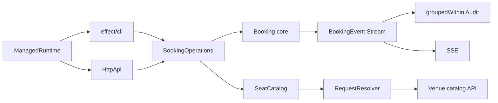

# Seat Reservation Engine: Operations & Delivery

> [!info] Контекст
> Первая итерация строит корректное transactional core. Эта итерация превращает его в обслуживаемое приложение: события проходят через `Stream`, внешние чтения батчатся и кешируются, transient failures получают ограниченную retry policy, а CLI и HTTP используют один application port и один runtime.


## Входной gate

Сначала завершите основной `GUIDE.md`:

```bash
npm run check
npm run check:transfer
npm run lint
npm run build
npm run smoke
```

До начала объясните без подсказки:

1. почему `PubSub` не является durable event store;
2. кому принадлежит lifetime worker fibers;
3. почему `PaymentDeclined` находится в `E`, а не в defect channel;
4. какой read/check/write invariant защищает STM.

Если ответы требуют algorithm-level hints, вернитесь к соответствующему этапу первой итерации. Новые checks предполагают, что прежние контракты уже сохранены.

## Результат обучения

После завершения вы сможете:

- преобразовать booking events в bounded size-or-time pipeline;
- разделить один scoped upstream между несколькими consumers;
- устранить N+1 через `Request` и `RequestResolver`;
- отличить request deduplication от TTL value cache;
- повторять только transient tagged errors с ограниченной `Schedule`;
- ограничить lifetime каждой внешней попытки timeout-ом;
- подключить CLI, `HttpApi` и SSE к одному application port;
- переиспользовать один Layer graph через `ManagedRuntime`;
- перенести batching из live workflow в конечный JSONL stream.

## Архитектурная граница



`BookingOperations` — входной port. CLI и HTTP не обращаются к repository internals и не реализуют booking workflow повторно.

`SeatCatalog` — внешнее read-only metadata. Не переносите mutable reservation state в `Cache`: его по-прежнему защищает STM.

## Starter

Новые файлы находятся в `src/operations/`:

```text
application.ts   application port для adapters
cli.ts           рабочая read-only status-команда
http.ts          рабочий GET /status
runtime.ts       helper для одного ManagedRuntime
event-stream.ts  immediate singleton batches и cold source
seat-catalog.ts  прямой upstream lookup без batching/cache
resilience.ts    одна payment attempt без timeout/retry
reconcile.ts     корректный последовательный JSONL workflow
```

Starter компилируется и сохраняет полезное baseline behavior. Он намеренно:

- flush-ит каждое событие отдельно;
- повторно запускает cold stream для каждого consumer;
- делает один catalog request на каждый lookup;
- не кеширует metadata;
- не повторяет transient payment failure;
- не ограничивает зависшую payment attempt;
- поддерживает только read-only CLI и HTTP status;
- выполняет offline reconciliation последовательно.

## Рабочий цикл

Для каждого этапа:

1. сначала запишите prediction для наблюдаемого сценария;
2. запустите только cumulative check текущего этапа;
3. объясните причину failure через механизм, а не через имя функции;
4. измените поведение в `src/operations/`;
5. повторите check;
6. открывайте подсказки по одной только после собственной гипотезы.

```bash
npm run check:ops:1
npm run check:ops:2
npm run check:ops:3
npm run check:ops:4
npm run check:ops:transfer
```

## Этап 1. Stream pipeline

### Результат

`batchBookingEvents` формирует batch при первом из двух условий:

- накоплено `maxBatchSize` событий;
- истекло `within` с момента начала неполного batch.

`shareBookingEvents` создаёт один lazy upstream для одновременных consumers. Upstream принадлежит scope, поддерживает bounded capacity, replay и `idleTimeToLive`.

### Проверка

```bash
npm run check:ops:1
```

Check подтверждает:

- пять событий при размере три дают batches `3 + 2`;
- два события не flush-ятся раньше временной границы;
- два одновременных consumer-а приобретают upstream один раз.

### Ручная контрольная точка

Перед реализацией предскажите различия между:

```text
cold source copied twice
Stream.share(source)
Stream.broadcastDynamic(source)
```

Назовите момент запуска upstream, момент finalization и судьбу позднего subscriber-а в каждом варианте.

> [!tip]- Подсказка 1: концепция
> Для batching нужен оператор, чья граница задаётся одновременно количеством и временем. Для sharing нужен scoped оператор с reference counting, а не сохранение элементов в обычный массив.

> [!tip]- Подсказка 2: граница
> Преобразуйте `Chunk<BookingEvent>` в `ReadonlyArray<BookingEvent>` только на выходе `batchBookingEvents`. `shareBookingEvents` должен переносить requirement исходного stream в момент создания shared stream.

## Этап 2. Request batching и TTL Cache

### Результат

`makeSeatCatalog` предоставляет прежний публичный контракт `get/invalidate`, но внутри:

- описывает lookup через `Request<SeatDetails, SeatCatalogError>`;
- завершает каждую заявку в `RequestResolver.makeBatched`;
- ограничивает upstream batch через `RequestResolver.batchN`;
- использует общий `Request.Cache` для in-flight deduplication;
- кеширует завершённые значения через `Cache.make` с `capacity` и `timeToLive`;
- при `invalidate` удаляет ключ из обоих cache layers.

Mutable availability и reservation status не попадают в этот cache.

### Проверка

```bash
npm run check:ops:2
```

Check отправляет 100 конкурентных lookup для 30 уникальных мест. При `batchSize = 10` upstream должен получить три batch-а. Отдельный сценарий проверяет cache hit, истечение TTL и explicit invalidation через `TestClock`.

### Диагностическая контрольная точка

Объясните отдельно:

1. почему `Promise.all` не устраняет N+1;
2. где возникает batch boundary;
3. что дедуплицирует одинаковые concurrent `Request`;
4. почему TTL cache остаётся нужен после request deduplication.

> [!tip]- Подсказка 1: структура
> Resolver формирует upstream batches, общий `Request.Cache` разделяет один in-flight request, а value `Cache` задаёт TTL уже завершённого результата. Это три разные ответственности.

> [!tip]- Подсказка 2: concurrent miss
> На cache hit верните `getOptionComplete`. На miss выполните `Effect.request` с общим request cache и запишите завершённое значение через `Cache.set`. Если поместить request прямо в single-flight lookup и одновременно запустить дубликаты, ожидающие cache fibers могут не дойти до общей batch boundary. При explicit invalidation очистите value cache и соответствующий request key.

> [!tip]- Подсказка 3: completion
> Batch response нужно сопоставить с каждой исходной заявкой. Отсутствующий seat завершает только соответствующий `Request` через typed error; один пропуск не должен оставлять остальные requests незавершёнными.

## Этап 3. Schedule, timeout и tagged retry

### Результат

`chargeWithResilience` применяет политику:

- каждая payment attempt имеет timeout `timeoutMs`;
- timeout становится `PaymentTimeout`;
- `PaymentGatewayUnavailable` повторяется не более `maxRetries` раз;
- `PaymentDeclined` возвращается после первой попытки;
- задержка растёт от `initialDelayMs`, но одна задержка не превышает `maxDelayMs`.

Не используйте `catchAll` с безусловным retry. Error tag определяет, имеет ли повтор смысл.

### Проверка

```bash
npm run check:ops:3
```

Check подтверждает:

- две transient failures завершаются успехом на третьей попытке;
- постоянный decline вызывает ровно один gateway call;
- зависшая попытка завершается typed timeout после виртуальных пяти секунд.

### Ручная контрольная точка

Перед кодом запишите порядок операторов и ответьте:

```text
retry(timeout(attempt))
timeout(retry(attempt))
```

Какой вариант ограничивает каждую попытку, а какой — весь retry workflow? Как изменится максимальное реальное время операции?

> [!tip]- Подсказка
> Сначала преобразуйте одну attempt через `Effect.timeoutFail`, затем примените `Effect.retry` с `Schedule.whileInput`. Ограничьте число повторов через `Schedule.recurs`; per-delay ceiling выражайте через `Schedule.modifyDelay`, а не через расписание с другой семантикой.

## Этап 4. CLI, HttpApi и SSE

### Результат

Transport adapters используют `BookingOperations`:

- `executeCliAction` направляет `status`, `hold`, `confirm` и `cancel` в один port;
- `seatEngineCommand` представляет те же действия через `@effect/cli`;
- `POST /reservations` создаёт hold через тот же port;
- `GET /events` кодирует `BookingEvent` как SSE;
- status, mutations и SSE собираются через один `HttpApi`;
- CLI и HTTP entry points запускаются на одном `ManagedRuntime` и одном Layer graph.

Минимальный SSE frame:

```text
event: ReservationHeld
data: {"_tag":"ReservationHeld",...}

```

### Проверка

```bash
npm run check:ops:4
```

Automated check подставляет test `BookingOperations` Layer и проверяет CLI dispatch, `GET /status`, `POST /reservations` и конечный SSE source. После него вручную запустите настоящие entry points на completed core и подтвердите, что service constructors выполняются один раз.

### Ручная контрольная точка

Нарисуйте два dependency paths — CLI hold и HTTP hold. Они должны сходиться в `BookingOperations.hold` до входа в domain. Если paths содержат две реализации `createHold` или два `MainLive`, исправьте composition root.

> [!tip]- Подсказка
> Сначала добавьте transport-neutral dispatch и HTTP handlers. После совпадения outcomes подключите `Args`, `Options` и Node runtime. SSE handler должен возвращать response над `operations.events`, а не копировать event log в момент запроса.

## Независимый transfer. Offline reconciliation

### Результат

Команда reconciliation получает конечный JSONL stream вместо live `PubSub`:

```json
{"reservationId":"r-1","seats":["A1"]}
```

Она должна:

- декодировать каждую строку;
- сохранить точные `processedReservations`, `seatLookups` и `totalPrice`;
- запускать catalog lookups с request batching;
- сохранить `batchSize` и cache semantics;
- корректно завершить конечный stream.

Не копируйте live pipeline и не превращайте весь файл в один ручной upstream request. Перенесите механизм batching через существующий `SeatCatalog` contract.

### Проверка

```bash
npm run check:ops:transfer
```

Transfer использует 20 records и 12 уникальных мест. При `batchSize = 5` upstream должен получить три batch-а. Подсказок нет.

## Финальная проверка

```bash
npm run check
npm run check:transfer
npm run check:ops
npm run check:ops:transfer
npm run lint
npm run build
npm run smoke
```

Самостоятельное выполнение подтверждается, если вы можете:

- объяснить size boundary и time boundary без ссылки на имя `groupedWithin`;
- показать, где именно cold source становится shared;
- разделить ответственность RequestResolver и Cache;
- доказать по error tags, почему decline не повторяется;
- вычислить верхнюю границу числа payment attempts;
- показать общий application path для CLI и HTTP;
- объяснить закрытие SSE subscription при disconnect;
- перенести batching в offline workflow без подсказки.

Passing checks после algorithm-level hint фиксирует guided practice. Для mastery повторите соответствующий этап позднее с чистой реализацией и без раскрытых подсказок.

## Sources

- Mentor lesson 9: `/home/vyacheslav/Documents/bat-effect/9`
- Mentor lesson 10: `/home/vyacheslav/Documents/bat-effect/10`
- Mentor lesson 11: `/home/vyacheslav/Documents/bat-effect/11`
- Mentor lesson 12: `/home/vyacheslav/Documents/bat-effect/12`
- [Effect Stream](https://effect.website/docs/stream/introduction/)
- [Effect Request batching API](https://effect-ts.github.io/effect/effect/RequestResolver.ts.html)
- [Effect Schedule](https://effect.website/docs/scheduling/introduction/)
- [Effect Platform](https://effect.website/docs/platform/introduction/)
