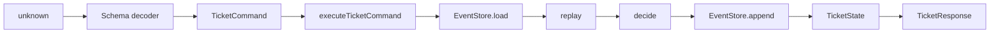

# Support Ticket Workflow на Effect v4

Этот guided project учит собирать знакомые части Effect в один backend workflow: декодировать внешний запрос, восстановить domain state из событий, принять или отклонить команду, сохранить новые события и вернуть transport response.

Проект использует профиль **`supported`**. Вы работаете с точными файлами и symbols, открываете подсказки по одной и при необходимости можете посмотреть полную реализацию только текущего этапа. Открытая полная реализация означает практику с поддержкой, а не самостоятельное выполнение. Независимый transfer решения не содержит.

<a id="toc"></a>
## Оглавление

- [Результат обучения](#learning-outcome)
- [Что проект намеренно не изучает](#non-goals)
- [Prerequisites и источники](#prerequisites)
- [Что уже делает starter](#baseline)
- [Архитектура и поток данных](#architecture)
- [Карта файлов и edit surfaces](#file-map)
- [Команды и рабочий цикл](#workflow)
- [Этап 1. Decider](#milestone-1)
- [Этап 2. Application orchestration](#milestone-2)
- [Этап 3. Request boundary](#milestone-3)
- [Независимый transfer. SLA signal](#transfer)
- [Финальная проверка](#final-check)
- [Источники](#sources)

<a id="learning-outcome"></a>
## Результат обучения

После основной части вы сможете реализовать и объяснить путь:

```text
unknown request
→ Schema decode
→ TicketCommand
→ EventStore.load
→ replay(events)
→ decide(state, command)
→ TicketEvent[] | InvalidTransition
→ EventStore.append
→ replay(history + new events)
→ TicketResponse
```

Завершённый проект должен демонстрировать наблюдаемое поведение:

- `OpenTicket` переводит `NotOpened → Open`;
- `AssignTicket` переводит только `Open → Assigned`;
- `ResolveTicket` переводит только `Assigned → Resolved`;
- недопустимая команда возвращает `InvalidTransition` и не дописывает event;
- malformed `unknown` останавливается на Schema boundary до обращения к `EventStore`;
- один и тот же application effect работает с in-memory и test implementations `EventStore`;
- independent SLA signal применяет тот же механизм к системному, а не пользовательскому input.

Evidence самостоятельности: основные checks и transfer проходят без pseudocode и полных spoilers, а вы можете своими словами объяснить, где находятся `A`, `E` и `R` у `decide`, `executeTicketCommand` и `handleTicketRequest`.

<a id="non-goals"></a>
## Что проект намеренно не изучает

Здесь нет HTTP server, PostgreSQL, `Queue`, `PubSub`, `Semaphore`, STM, `Stream`, retry или `Schedule`. Они создадут второй learning unit и снова скроют основной вопрос: как связаны boundary, domain decision, service и `Layer`.

`handleTicketRequest(input: unknown)` имеет форму backend handler без привязки к transport. После самостоятельного transfer его можно обернуть HTTP adapter, не меняя domain/application core.

<a id="prerequisites"></a>
## Prerequisites и источники

Нужно уметь читать:

- `Effect<A, E, R>`;
- `Effect.gen` и `yield*`;
- discriminated union по `_tag`;
- `Schema.Struct`, `Schema.TaggedStruct`, `Schema.Union`;
- базовый Vitest check.

Материалы ментора:

- `/home/vyacheslav/Documents/bat-effect/1` — `Effect<A, E, R>`, lazy effect и runtime;
- `/home/vyacheslav/Documents/bat-effect/2` — Schema и parse-don't-validate;
- `/home/vyacheslav/Documents/bat-effect/3` — typed errors;
- `/home/vyacheslav/Documents/bat-effect/4` — services и Layer;
- `/home/vyacheslav/Documents/bat-effect/14` — branded domain types;
- `/home/vyacheslav/Documents/bat-effect/15` — `initial`, `decide`, `evolve`, replay.

> [!warning] EffectPatterns использует Effect v3
> Репозиторий EffectPatterns фиксирует `effect@3.19.19`, а этот проект — `effect@4.0.0-beta.101`. Используйте паттерны как объяснение responsibilities, но не копируйте API механически. В частности, v3-примеры часто используют `Effect.Service` или `Context.Tag`; здесь service key объявлен через Effect v4 `Context.Service`.

<a id="baseline"></a>
## Что уже делает starter

Starter компилируется и проводит одну команду через весь узкий вертикальный slice:

```text
unknown OpenTicket
→ OpenTicketSchema
→ decide(NotOpened, OpenTicket)
→ TicketOpened
→ EventStore.append
→ Open state
→ accepted response
```

Запустите:

```bash
pnpm install --frozen-lockfile
pnpm run build
pnpm run lint
pnpm test
pnpm run smoke
```

Ожидания:

- `build` и `lint` проходят;
- `test` запускает два baseline checks;
- `smoke` печатает response со `status: "accepted"` и state `_tag: "Open"`;
- milestone checks пока падают на намеренно отсутствующем поведении.

Starter не содержит `TODO`, пустых handlers или искусственных exceptions. Его текущая policy уже полезна, но узка:

- `decide` разрешает только `OpenTicket`;
- `evolve` применяет только `TicketOpened`;
- application обрабатывает каждую команду от `initial` и потому корректен только для первой команды;
- request boundary декодирует только `OpenTicketSchema`;
- SLA adapter пока выполняет read-only inspection.

<a id="architecture"></a>
## Архитектура и поток данных



Responsibilities не смешиваются:

| Boundary | Отвечает за | Не отвечает за |
|---|---|---|
| `domain.ts` | формы данных, branded IDs, state, errors | порядок effectful шагов |
| `decider.ts` | допустимые переходы и события | persistence и transport response |
| `event-store.ts` | загрузку и append истории | domain policy |
| `application.ts` | load → replay → decide → append | декодирование `unknown` |
| `transport.ts` | decode и error-to-response mapping | изменение state напрямую |
| `main.ts` | предоставить `Layer` и запустить Effect | business rules |

<a id="file-map"></a>
## Карта файлов и edit surfaces

```text
src/
├── domain.ts       # готовые schemas, commands, events, state и errors
├── decider.ts      # Этап 1: decide, evolve, replay
├── event-store.ts  # готовые Context.Service и in-memory Layer
├── application.ts  # Этап 2: executeTicketCommand
├── transport.ts    # Этап 3: handleTicketRequest
├── sla.ts          # transfer: handleSlaSignal
└── main.ts         # готовый smoke entrypoint

checks/
├── support.ts
├── starter.test.ts
├── milestone-1.test.ts
├── milestone-2.test.ts
├── milestone-3.test.ts
└── transfer.test.ts
```

| Этап | Меняйте | Обычно не меняйте |
|---|---|---|
| 1 | `src/decider.ts`: `evolve`, `replay`, `decide` | `domain.ts`, `event-store.ts`, checks |
| 2 | `src/application.ts`: `executeTicketCommand` | public service contract, checks |
| 3 | `src/transport.ts`: `handleTicketRequest` | domain schemas, application, checks |
| Transfer | `src/decider.ts`: `EscalateTicket`; `src/sla.ts`: `handleSlaSignal` | user request boundary, checks |

`checks/**`, `package.json`, lockfile, `tsconfig.json`, `vitest.config.ts`, `eslint.config.js` и `src/main.ts` — supporting scaffold. Не меняйте их, чтобы подогнать check под реализацию.

<a id="workflow"></a>
## Команды и рабочий цикл

Для каждого этапа:

1. Прочитайте `Что уже есть` и назовите ожидаемый failure.
2. Запустите только cumulative check текущего этапа.
3. Измените указанные symbols.
4. Повторите check.
5. Ответьте на reasoning checkpoint.
6. Запустите `pnpm run build` и `pnpm run lint`.
7. Открывайте подсказки сверху вниз, только если новая попытка не появляется.

```bash
pnpm run check:1
pnpm run check:2
pnpm run check:3
pnpm run check:transfer
pnpm run check
pnpm run lint
```

`check:2` включает этап 1, а `check:3` — этапы 1 и 2. Если падает более ранний check, сначала восстановите предыдущий contract.

<a id="milestone-1"></a>
## Этап 1. Decider: решение отдельно от состояния

### Результат

`decide` выпускает события для трёх пользовательских команд, `evolve` применяет эти события, а `replay` восстанавливает `Resolved` из истории.

### Зачем

Команда — просьба, которую можно отклонить. Событие — уже произошедший факт. `decide` проверяет текущий state и выпускает факт; `evolve` не решает, допустим ли факт, а материализует его в state.

Если смешать эти responsibilities, persistence начнёт зависеть от mutable object, а повторное чтение истории перестанет гарантированно давать тот же результат.

### Где работать

Только `src/decider.ts`:

- `evolve(state, event)`;
- `replay(events)`;
- `decide(state, command)`.

### Что уже есть

- `initial` равен `{ _tag: "NotOpened" }`;
- `TicketOpened` уже превращается в `Open`;
- `OpenTicket` уже проверяет `NotOpened`, читает `Clock.currentTimeMillis` и выпускает event;
- остальные команды сейчас завершаются `InvalidTransition`;
- `replay` уже вызывает `events.reduce(evolve, initial)`, но текущий `evolve` игнорирует два события.

### Что изменить

Таблица пользовательских переходов:

| State до | Command | Event | State после |
|---|---|---|---|
| `NotOpened` | `OpenTicket` | `TicketOpened` | `Open` |
| `Open` | `AssignTicket` | `TicketAssigned` | `Assigned` |
| `Assigned` | `ResolveTicket` | `TicketResolved` | `Resolved` |

Любая другая пара `state + command` возвращает:

```typescript
new InvalidTransition({ command: command._tag, from: state._tag })
```

`AssignTicket` и `ResolveTicket` получают `occurredAt` через `Clock.currentTimeMillis`, не через `Date.now()`.

### Шаги реализации

1. В `evolve` добавьте ветку `TicketAssigned`.
2. Она создаёт `Assigned` только из данных текущего `Open` state и event: title/openedAt остаются из state, agentId/assignedAt приходят из event.
3. Добавьте ветку `TicketResolved`: title/agentId берутся из `Assigned`, resolution/resolvedAt — из event.
4. Не добавляйте Effect в `evolve`: replay должен оставаться чистым.
5. В `decide` добавьте отдельную ветку `AssignTicket`.
6. Сначала проверьте `state._tag === "Open"`; при другом state верните `InvalidTransition` через typed `E`.
7. Только после проверки прочитайте `Clock.currentTimeMillis` и соберите `TicketAssigned`.
8. Аналогично реализуйте `ResolveTicket`, разрешённый только из `Assigned`.
9. `EscalateTicket` пока оставьте на baseline policy: transfer реализует его позже.

### Проверка

```bash
pnpm run check:1
pnpm run build
```

Check подтверждает:

- replay трёх событий даёт `Resolved`;
- `AssignTicket` использует test clock;
- `decide` не мутирует переданный state;
- `ResolveTicket` принимается из `Assigned` и отклоняется из `Open`.

### Reasoning checkpoint

До повторного запуска ответьте:

1. Почему `decide` возвращает `TicketEvent[]`, а не новый `TicketState`?
2. Почему `evolve` не должен читать `Clock` или `EventStore`?
3. Какие `A`, `E`, `R` у `decide`? Почему `Clock` не появляется в `R` как обязательный пользовательский service?
4. Что произойдёт при replay одной и той же истории дважды с нуля?

### Источники и Effect v4

- [Use Effect.gen for Business Logic](https://github.com/PaulJPhilp/EffectPatterns/blob/main/content/published/patterns/domain-modeling/use-gen-for-business-logic.mdx)
- [Define Type-Safe Errors with Data.TaggedError](https://github.com/PaulJPhilp/EffectPatterns/blob/main/content/published/patterns/domain-modeling/define-tagged-errors.mdx)
- [Effect v4 Clock source](https://github.com/Effect-TS/effect/blob/main/packages/effect/src/Clock.ts)

В Effect v4 `Clock.currentTimeMillis` остаётся default service. Для детерминированного check используется `TestClock.layer()` из `effect/testing`.

> [!tip]- Подсказка 1: governing concept
> Сначала спросите: эта функция **принимает решение** или **применяет уже произошедший факт**? Проверка допустимости принадлежит `decide`; перенос полей из state/event в новый state принадлежит `evolve`.

> [!tip]- Подсказка 2: точные branches
> В `evolve` нужны branches `TicketAssigned` и `TicketResolved`. В `decide` нужны branches `AssignTicket` и `ResolveTicket`. Каждая command branch сначала сравнивает `state._tag`, затем читает Clock и создаёт ровно один event.

> [!tip]- Подсказка 3: pseudocode
> ```text
> decide(state, command):
>   if command is AssignTicket:
>     require state is Open
>     now <- Clock
>     return [TicketAssigned(command ids, now)]
>
> evolve(state, event):
>   if event is TicketAssigned and state is Open:
>     return Assigned(previous fields + event fields)
> ```
>
> `ResolveTicket` имеет ту же форму, но работает с `Assigned → TicketResolved → Resolved`.

> [!warning]- Полная реализация — открыть после попытки
> Замените содержимое `src/decider.ts`. Эта версия завершает только этап 1: `EscalateTicket` остаётся transfer behavior.
>
> ```typescript
> import { Clock, Effect } from "effect";
>
> import {
>   InvalidTransition,
>   type TicketDecisionCommand,
>   type TicketEvent,
>   type TicketState,
> } from "./domain.js";
>
> export const initial: TicketState = { _tag: "NotOpened" };
>
> export const evolve = (
>   state: TicketState,
>   event: TicketEvent,
> ): TicketState => {
>   switch (event._tag) {
>     case "TicketOpened":
>       return {
>         _tag: "Open",
>         ticketId: event.ticketId,
>         title: event.title,
>         openedAt: event.occurredAt,
>       };
>     case "TicketAssigned":
>       return state._tag === "Open"
>         ? {
>             _tag: "Assigned",
>             ticketId: state.ticketId,
>             title: state.title,
>             openedAt: state.openedAt,
>             agentId: event.agentId,
>             assignedAt: event.occurredAt,
>           }
>         : state;
>     case "TicketResolved":
>       return state._tag === "Assigned"
>         ? {
>             _tag: "Resolved",
>             ticketId: state.ticketId,
>             title: state.title,
>             agentId: state.agentId,
>             resolution: event.resolution,
>             resolvedAt: event.occurredAt,
>           }
>         : state;
>     case "TicketEscalated":
>       return state;
>   }
> };
>
> export const replay = (events: ReadonlyArray<TicketEvent>): TicketState =>
>   events.reduce(evolve, initial);
>
> export const decide = (
>   state: TicketState,
>   command: TicketDecisionCommand,
> ): Effect.Effect<ReadonlyArray<TicketEvent>, InvalidTransition> =>
>   Effect.gen(function* () {
>     switch (command._tag) {
>       case "OpenTicket": {
>         if (state._tag !== "NotOpened") break;
>         const occurredAt = yield* Clock.currentTimeMillis;
>         return [{
>           _tag: "TicketOpened",
>           ticketId: command.ticketId,
>           title: command.title,
>           occurredAt,
>         }];
>       }
>       case "AssignTicket": {
>         if (state._tag !== "Open") break;
>         const occurredAt = yield* Clock.currentTimeMillis;
>         return [{
>           _tag: "TicketAssigned",
>           ticketId: command.ticketId,
>           agentId: command.agentId,
>           occurredAt,
>         }];
>       }
>       case "ResolveTicket": {
>         if (state._tag !== "Assigned") break;
>         const occurredAt = yield* Clock.currentTimeMillis;
>         return [{
>           _tag: "TicketResolved",
>           ticketId: command.ticketId,
>           resolution: command.resolution,
>           occurredAt,
>         }];
>       }
>       case "EscalateTicket":
>         break;
>     }
>
>     return yield* Effect.fail(new InvalidTransition({
>       command: command._tag,
>       from: state._tag,
>     }));
>   });
> ```
>
> `evolve` сохраняет domain data из предыдущего state и добавляет данные нового event. `Clock` читается после проверки перехода, поэтому rejected command не выполняет лишнее effectful действие. Transfer branch намеренно не реализован.

<a id="milestone-2"></a>
## Этап 2. Application service: load → replay → decide → append

### Результат

`executeTicketCommand` принимает последовательные команды для одного ticket, каждый раз восстанавливает актуальный state из `EventStore` и дописывает события только после успешного `decide`.

### Зачем

Decider не знает, где хранится история. EventStore не знает business rules. Application service связывает их в правильном порядке. Эта функция — центральная часть backend use case.

### Где работать

Только `src/application.ts`, symbol `executeTicketCommand`.

`src/event-store.ts` нужно прочитать, но обычно не менять.

### Что уже есть

Starter уже:

- получает `EventStore` через `yield* EventStore`;
- вызывает `decide`;
- вызывает `append`;
- возвращает state через `replay`.

Проблема: `decide` всегда получает `initial`, а `replay` видит только новые events. Поэтому первая команда работает, но вторая забывает существующий `Open`.

### Что изменить

Обязательный порядок:

```text
store <- EventStore
history <- store.load(ticketId)
state <- replay(history)
newEvents <- decide(state, command)
store.append(ticketId, newEvents)
newState <- replay(history + newEvents)
return newState
```

Если `decide` завершился `InvalidTransition`, `append` не выполняется.

### Шаги реализации

1. После получения `store` вычислите `ticketId` через готовый `ticketIdOf(command)`.
2. Выполните `yield* store.load(ticketId)`.
3. Восстановите current state через `replay(history)`.
4. Передайте именно current state в `decide`.
5. Дождитесь успешных `newEvents`.
6. Только после этого выполните `store.append(ticketId, newEvents)`.
7. Верните `replay([...history, ...newEvents])`.
8. Не ловите `InvalidTransition` здесь: application caller должен видеть typed domain failure в `E`.

### Проверка

```bash
pnpm run check:2
pnpm run build
```

Check подтверждает:

- каждая из трёх команд вызывает `load`;
- три независимых вызова видят общую историю;
- возвращаемые states последовательно равны `Open`, `Assigned`, `Resolved`;
- rejected command не вызывает второй `append`.

### Reasoning checkpoint

1. Почему `EventStore` находится в `R`, а не передаётся обычным аргументом?
2. Какой тип имеет программа до `Effect.provide(store.layer)` и что меняется после `provide`?
3. Почему `append` расположен после `decide`, а не до него?
4. Почему `replay([...history, ...newEvents])` надёжнее ручной сборки response state?

### Источники и Effect v4

- [Model Dependencies as Services](https://github.com/PaulJPhilp/EffectPatterns/blob/main/content/published/patterns/making-http-requests/model-dependencies-as-services.mdx)
- [Test Effects with Services](https://github.com/PaulJPhilp/EffectPatterns/blob/main/content/published/patterns/testing/testing-with-services.mdx)
- [Effect v4 Context source](https://github.com/Effect-TS/effect/blob/main/packages/effect/src/Context.ts)
- [Effect v4 Layer source](https://github.com/Effect-TS/effect/blob/main/packages/effect/src/Layer.ts)

В v4 `EventStore` объявлен через `Context.Service`, а `EventStoreMemory` — через `Layer.sync`. Test check предоставляет другой `Layer`, не используя mocking library.

> [!tip]- Подсказка 1: governing concept
> `decide` может принять правильное решение только о current state. Current state не хранится отдельным mutable object: его нужно каждый раз получить свёрткой event history.

> [!tip]- Подсказка 2: точное место
> Ошибка starter находится между `const store = yield* EventStore` и `decide(initial, command)`. До `decide` должны появиться `ticketId`, `history` и `state`.

> [!tip]- Подсказка 3: pseudocode
> ```text
> store = require EventStore
> id = ticketIdOf(command)
> history = yield store.load(id)
> state = replay(history)
> events = yield decide(state, command)
> yield store.append(id, events)
> return replay(history concatenated with events)
> ```

> [!warning]- Полная реализация — открыть после попытки
> Замените `src/application.ts`. Код предполагает завершённый этап 1 и не реализует request boundary или SLA transfer.
>
> ```typescript
> import { Effect } from "effect";
>
> import { decide, replay } from "./decider.js";
> import {
>   ticketIdOf,
>   type InvalidTransition,
>   type TicketDecisionCommand,
>   type TicketState,
> } from "./domain.js";
> import { EventStore } from "./event-store.js";
>
> export const executeTicketCommand = (
>   command: TicketDecisionCommand,
> ): Effect.Effect<TicketState, InvalidTransition, EventStore> =>
>   Effect.gen(function* () {
>     const store = yield* EventStore;
>     const ticketId = ticketIdOf(command);
>     const history = yield* store.load(ticketId);
>     const state = replay(history);
>     const newEvents = yield* decide(state, command);
>     yield* store.append(ticketId, newEvents);
>     return replay([...history, ...newEvents]);
>   });
> ```
>
> `EventStore` остаётся видимым в `R`, пока composition root или check не предоставит `Layer`. Ошибка `decide` коротко замыкает generator, поэтому `append` после неё не выполняется.

<a id="milestone-3"></a>
## Этап 3. Request boundary: `unknown` → response

### Результат

Один `handleTicketRequest(input: unknown)` принимает `OpenTicket`, `AssignTicket` и `ResolveTicket`, отклоняет malformed input до EventStore и переводит только ожидаемые failures в `TicketResponse`.

### Зачем

TypeScript type исчезает в runtime. Значение из HTTP, CLI или message broker остаётся `unknown`, пока Schema decoder действительно не выполнен. Domain code не должен видеть непроверенную форму, а transport не должен скрывать defects общим `catchAll`.

### Где работать

Только `src/transport.ts`, symbol `handleTicketRequest`.

### Что уже есть

Starter boundary уже правильно:

- вызывает `Schema.decodeUnknownEffect`;
- преобразует schema failure в `InvalidRequest`;
- вызывает application service только после decode;
- через `catchTag` переводит `InvalidRequest` и `InvalidTransition` в response;
- оставляет defects вне typed recovery.

Но decoder использует только `OpenTicketSchema`. Поэтому валидные `AssignTicket` и `ResolveTicket` ошибочно становятся `invalid-request`.

### Что изменить

Замените узкую schema на уже готовую `TicketCommandSchema`. Остальной pipeline сохраните.

Наблюдаемый mapping:

| Effect result | `TicketResponse` |
|---|---|
| state | `{ status: "accepted", state }` |
| `InvalidRequest` | `{ status: "invalid-request", message }` |
| `InvalidTransition` | `{ status: "conflict", command, from }` |
| defect | не превращается в response; остаётся failure runtime |

### Шаги реализации

1. Замените import `OpenTicketSchema` на `TicketCommandSchema`.
2. Передайте `TicketCommandSchema` в `Schema.decodeUnknownEffect`.
3. Не добавляйте `as TicketCommand`: decoder уже возвращает decoded type.
4. Сохраните `Effect.mapError`, чтобы внутренний `SchemaError` не покидал boundary.
5. Сохраните оба точечных `catchTag`.
6. Не заменяйте их `catchAll`: он размоет различие ожидаемых failures и может скрыть будущие error variants.
7. Не ловите `Cause` или defects в этом handler.

### Проверка

```bash
pnpm run check:3
pnpm run build
```

Check подтверждает:

- полный lifecycle проходит через values, объявленные как `unknown`;
- invalid transition становится conflict и не добавляет event;
- malformed request не обращается к store;
- defect из store не превращается в `{ status: ... }`.

### Reasoning checkpoint

1. В какой строке заканчивается `unknown`?
2. Чем schema failure отличается от `InvalidTransition` с точки зрения владельца ошибки?
3. Почему `catchTag` безопаснее общего `catchAll` на transport boundary?
4. Какие `A`, `E`, `R` у handler после двух recoveries, но до `Effect.provide`?

### Источники и Effect v4

- [Define Contracts Upfront with Schema](https://github.com/PaulJPhilp/EffectPatterns/blob/main/content/published/patterns/domain-modeling/define-contracts-with-schema.mdx)
- [Validate Request Body](https://github.com/PaulJPhilp/EffectPatterns/blob/main/content/published/patterns/building-apis/validate-request-body.mdx)
- [Effect v4 Schema source](https://github.com/Effect-TS/effect/blob/main/packages/effect/src/Schema.ts)

EffectPatterns показывает v3 HTTP-specific APIs. Здесь используется v4 `Schema.decodeUnknownEffect`, а transport остаётся независимым от HTTP framework.

> [!tip]- Подсказка 1: governing concept
> Boundary уже устроен правильно; проблема не в error handling. Спросите: какую часть command union сейчас действительно умеет декодировать единственная строка со Schema?

> [!tip]- Подсказка 2: точный symbol
> Сравните `OpenTicketSchema` и `TicketCommandSchema` в `src/domain.ts`. Нужное изменение находится в imports и в аргументе `Schema.decodeUnknownEffect`.

> [!tip]- Подсказка 3: shape
> ```text
> decodeUnknownEffect(TicketCommandSchema)(input)
>   map schema error → InvalidRequest
>   flat sequence → executeTicketCommand(decoded command)
>   map state → accepted response
>   catch InvalidRequest
>   catch InvalidTransition
> ```

> [!warning]- Полная реализация — открыть после попытки
> Замените `src/transport.ts`. Код завершает только user request boundary и не реализует SLA transfer.
>
> ```typescript
> import { Effect, Schema } from "effect";
>
> import { executeTicketCommand } from "./application.js";
> import {
>   InvalidRequest,
>   TicketCommandSchema,
>   type TicketResponse,
> } from "./domain.js";
> import type { EventStore } from "./event-store.js";
>
> export const handleTicketRequest = (
>   input: unknown,
> ): Effect.Effect<TicketResponse, never, EventStore> =>
>   Effect.gen(function* () {
>     const command = yield* Schema.decodeUnknownEffect(TicketCommandSchema)(
>       input,
>     ).pipe(
>       Effect.mapError(
>         (cause) => new InvalidRequest({
>           message: "Request does not match the ticket command contract",
>           cause,
>         }),
>       ),
>     );
>     const state = yield* executeTicketCommand(command);
>     return { status: "accepted" as const, state };
>   }).pipe(
>     Effect.catchTag("InvalidRequest", (error) =>
>       Effect.succeed({
>         status: "invalid-request" as const,
>         message: error.message,
>       }),
>     ),
>     Effect.catchTag("InvalidTransition", (error) =>
>       Effect.succeed({
>         status: "conflict" as const,
>         command: error.command,
>         from: error.from,
>       }),
>     ),
>   );
> ```
>
> Decoder возвращает `TicketCommand` только после runtime-проверки. Два `catchTag` закрывают ожидаемый `E`, но `EventStore` остаётся в `R`, а defects не превращаются в обычный response.

<a id="transfer"></a>
## Независимый transfer. Системный SLA signal

### Результат

`handleSlaSignal(input: unknown)` использует тот же EventStore и Decider, но принимает другую representation: scheduler payload без `_tag`.

```text
{ ticketId, observedAt }
→ SlaSignalSchema
→ EscalateTicket
→ load/replay/decide/append
→ Escalated | unchanged terminal state
```

### Зачем

Основная часть обрабатывала пользовательские commands. Transfer проверяет, можете ли вы самостоятельно перенести pipeline на системный input и новую transition policy, а не повторить готовый transport handler с переименованными переменными.

### Где работать

- `src/decider.ts`: `TicketEscalated` в `evolve`, `EscalateTicket` в `decide`;
- `src/sla.ts`: `handleSlaSignal`.

Supporting contracts уже находятся в `src/domain.ts`:

- `SlaSignalSchema`;
- `EscalateTicket`;
- `TicketEscalated`;
- `Escalated` state.

### Что уже есть

`handleSlaSignal` уже:

- декодирует `unknown` через `SlaSignalSchema`;
- маппит schema failure в `InvalidRequest`;
- загружает историю;
- возвращает read-only current state.

`executeTicketCommand` уже принимает `TicketDecisionCommand`, куда входит `EscalateTicket`.

### Что изменить

Правила:

- `Open + EscalateTicket → TicketEscalated → Escalated` с `agentId: null`;
- `Assigned + EscalateTicket → TicketEscalated → Escalated` с сохранённым `agentId`;
- `Resolved + EscalateTicket` не выпускает событий и возвращает прежний state;
- повторный signal для `Escalated` не выпускает второй event;
- `TicketEscalated.occurredAt` равен `signal.observedAt`, а не текущему Clock;
- `NotOpened + EscalateTicket` остаётся `InvalidTransition`.

В `handleSlaSignal` после decode сформируйте `EscalateTicket` и передайте его в `executeTicketCommand`. Не повторяйте load/replay/append вручную: orchestration уже принадлежит application service.

### Проверка

```bash
pnpm run check:transfer
pnpm run check
pnpm run build
pnpm run lint
pnpm run smoke
```

Transfer check проверяет:

- open ticket эскалируется один раз;
- используется `observedAt`;
- повторный signal идемпотентен;
- resolved ticket остаётся resolved;
- event history terminal ticket не меняется.

### Reasoning checkpoint

После прохождения объясните:

1. Почему `observedAt` приходит из signal, тогда как пользовательские commands читают Clock?
2. Где находится idempotency rule и почему она не должна жить только в adapter?
3. Почему SLA adapter вызывает application service, а не напрямую `EventStore.append`?
4. Что в transfer осталось тем же механизмом, а что изменилось по сравнению с user request boundary?

Полной реализации и algorithm-level подсказок для transfer нет.

<a id="final-check"></a>
## Финальная проверка

Выполните из корня проекта:

```bash
pnpm run check
pnpm run build
pnpm run lint
pnpm run smoke
```

Ожидаемое evidence:

- все 12 checks проходят;
- TypeScript compilation и ESLint проходят;
- smoke по-прежнему открывает ticket через public boundary;
- в `src/` нет test-only branches;
- checks и supporting scaffold не изменены.

Самостоятельное владение не подтверждается, если основные этапы завершены копированием полных spoilers. В этом случае завершите transfer без подсказок, а затем повторите основной pipeline в другом небольшом домене без guide.

<a id="sources"></a>
## Источники

- [Effect v4 repository](https://github.com/Effect-TS/effect)
- [Effect v4 Context](https://github.com/Effect-TS/effect/blob/main/packages/effect/src/Context.ts)
- [Effect v4 Layer](https://github.com/Effect-TS/effect/blob/main/packages/effect/src/Layer.ts)
- [Effect v4 Schema](https://github.com/Effect-TS/effect/blob/main/packages/effect/src/Schema.ts)
- [Effect v4 Clock](https://github.com/Effect-TS/effect/blob/main/packages/effect/src/Clock.ts)
- [EffectPatterns](https://github.com/PaulJPhilp/EffectPatterns)
