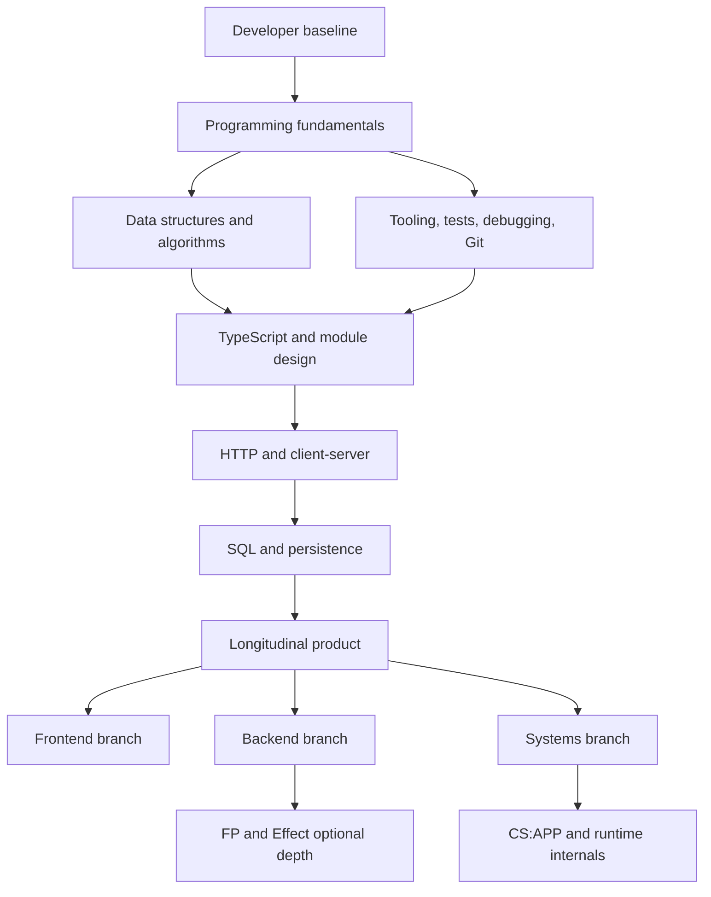

# Software Developer — roadmap

> [!info] Контекст
> Это основной маршрут от программирования к самостоятельной разработке программного продукта. Он задаёт зависимости и наблюдаемые результаты, а не порядок чтения всех заметок. Основной учебный стек — JavaScript и TypeScript; Go, FP, Effect, V8 и системные темы остаются последующими ветками углубления.

[[MOC|← Учебный цикл]]

## Цель

Научиться самостоятельно проводить изменение через полный инженерный цикл:

```text
неясный запрос
→ уточнённые требования
→ acceptance criteria
→ чтение существующего кода
→ реализация
→ собственные tests
→ debugging
→ code review
→ smoke и operation
→ последующее изменение без регрессии
```

Итоговая способность наблюдаема: для небольшой существующей системы можно уточнить требование, изменить поведение, спроектировать различающие тесты, найти причину сбоя, проверить реальный entrypoint и объяснить решение следующему разработчику.

## Как пользоваться roadmap

1. Держать активной одну capability, один project milestone и один ближайший check.
2. Начинать новую единицу с попытки без чтения.
3. Открывать материал только по конкретному пробелу, обнаруженному попыткой.
4. Не считать чтение, Anki, открытое решение или зелёный check после подсказки самостоятельным evidence.
5. Переходить дальше после независимого application и объяснения хотя бы одного failure mode.
6. Изучать одну ветку глубоко; остальные хранить как `parked`, а не проходить параллельно.

## Исходное evidence

В `src/00-learning/sessions` пока зафиксированы только сессии по Effect coordination. Они показывают поддержанную практику с `Queue`, `Deferred`, scoped workers, `Semaphore` и `PubSub`, но не устанавливают уровень общих developer capabilities.

Поэтому нельзя ни считать фундамент освоенным, ни предполагать его отсутствие. Первый шаг маршрута — практический baseline на plain JavaScript/TypeScript без framework-specific abstractions.

## Карта зависимостей



## Общий ствол

### 1. Programming fundamentals

**Зачем:** свободно выражать алгоритм базовыми конструкциями до изучения framework и архитектурных абстракций.

**Существующие материалы:**

- [[../01-javascript/MOC|JavaScript MOC]];
- [[../01-javascript/core/MOC|JavaScript Core]];
- [[../01-javascript/core/exercises|упражнения JavaScript Core и Async]].

**Нужно добавить или явно связать:**

- values, primitive types и expressions;
- variables, assignment и state transitions;
- conditions и loops;
- functions, parameters, return values и scope;
- arrays, objects, `Map`, `Set` и strings;
- references, mutation и copying;
- modules, console и file I/O;
- runtime errors и чтение stack trace.

**Наблюдаемый результат:** разработать небольшую программу, использующую функции, коллекции, файлы и обработку ошибок; вручную проследить control flow и объяснить каждое изменение state.

**Evidence:** working entrypoint, normal/boundary/error scenarios и независимое объяснение первого неверного state transition в сломанной версии.

### 2. Developer tooling, tests и debugging

Эти навыки изучаются одновременно с программированием, а не после завершения языка.

**Нужно добавить как канонический маршрут:**

- terminal, filesystem и processes;
- package manager и dependency boundary;
- Git: `status`, `diff`, commit, branch, merge, conflict и revert;
- IDE navigation, references и rename;
- breakpoint, step over/into, scopes и watches;
- build, lint, format и test runner;
- unit и integration tests;
- выбор normal, boundary и error cases;
- воспроизведение дефекта и проверка competing hypotheses.

**Debugging loop:**

```text
reproduce
→ expected vs actual
→ first divergence
→ hypotheses
→ decisive experiment
→ source fix
→ same reproduction
→ nearby regression
```

**Наблюдаемый результат:** получить небольшой failing scenario, локализовать первое расхождение, исправить причину и подтвердить тем же reproduction, не подменяя его несвязанным зелёным тестом.

**Evidence:** команда воспроизведения, наблюдаемый output, проверенная гипотеза, минимальный diff и regression scenario.

### 3. TypeScript и границы модулей

**Существующие материалы:**

- [[../02-typescript/MOC|TypeScript MOC]];
- [[../02-typescript/basics/exercises|упражнения по fundamentals]].

Путь: types as sets → assignability → narrowing → generics → variance → unsound boundaries.

**Наблюдаемый результат:** принять `unknown`, проверить runtime-форму, получить discriminated union, сохранить связь `T`/`K`/`T[K]` и спроектировать небольшой module API без `any` и необоснованных assertions.

**Evidence:** прогноз `tsc --strict`, executable runtime cases, отклоняемый compile-time случай и объяснение границы между доказательством compiler и runtime trust.

### 4. Data structures и algorithms

**Существующий материал:** [[../06-algorithms/MOC|Algorithms MOC]].

Этот трек проходит спирально вместе с проектами, а не отдельным многомесячным блоком.

**Основной минимум:**

- arrays, lists, stacks, queues, maps и sets;
- strings и string processing;
- Big O как язык сравнения;
- search, sorting и traversal;
- recursion;
- выбор структуры данных по требуемым операциям.

**Наблюдаемый результат:** выбрать структуру данных и алгоритм по свойствам задачи, сформулировать invariant, оценить cost и диагностировать первое нарушение по трассировке.

**Evidence:** реализация, boundary cases, trace table и перенос на задачу с другим предметным описанием.

### 5. Software construction и design

**Существующие материалы:**

- [[../07-craftsmanship/MOC|Craftsmanship]];
- [[../03-oop/MOC|OOP]];
- [[../04-architecture/MOC|Architecture]].

Порядок применения:

1. читаемый control flow и данные;
2. ответственность функции;
3. module contract;
4. invariants и error behavior;
5. composition и dependency direction;
6. только затем SOLID, patterns, DDD или Clean Architecture.

**Наблюдаемый результат:** изменить существующий модуль, сохранив observable contract, и обосновать границы через ожидаемые изменения, а не через название паттерна.

**Evidence:** before/after behavior, tests, dependency sketch, отвергнутая более сложная альтернатива и последующий change request без крупной переделки.

### 6. HTTP и client-server

**Существующий материал:** [[../04-architecture/MOC#Смежный маршрут: client-server взаимодействие|маршрут client-server]].

Путь: request lifecycle → DNS/TCP/TLS → HTTP semantics → browser state/security → caching → timeout/retry/idempotency.

**Нужно добавить:** plain TypeScript/Node service без Effect как первая серверная реализация.

**Наблюдаемый результат:** провести request через parsing, validation, application logic и response; по наблюдениям локализовать failure boundary.

**Evidence:** black-box HTTP scenarios, valid/invalid inputs, status/error contract, server logs и повторяемый smoke command.

### 7. SQL и persistence

Локального канонического маршрута пока нет.

**Минимальная последовательность:**

1. table, row, column и data types;
2. primary key, foreign key и constraints;
3. `SELECT`, filtering, sorting и aggregation;
4. `JOIN`;
5. insert/update/delete;
6. indexes и query-plan intuition;
7. transactions и isolation;
8. migrations;
9. lost update и rollback на наблюдаемом сценарии.

**Наблюдаемый результат:** спроектировать небольшую relational schema, реализовать запросы и сохранить invariant при конкурентном изменении.

**Evidence:** schema, migration, query results, transaction failure scenario и объяснение выбранного constraint/index.

### 8. Requirements, collaboration и maintenance

Проекты не должны всегда выдавать полностью готовые требования и checks.

**Нужно практиковать:**

- functional и non-functional requirements;
- ambiguity, contradiction и missing case;
- acceptance criteria;
- decomposition по зависимостям и рискам;
- issue, commit и PR description;
- code review;
- dependency upgrade;
- backward-compatible API и schema change;
- изменение существующего кода вместо постоянного greenfield.

**Наблюдаемый результат:** превратить неясный запрос в проверяемый contract, внести изменение в чужой или ранее написанный код и объяснить migration/compatibility consequences.

**Evidence:** issue, acceptance criteria, focused diff, собственные tests, review response и повторное изменение той же системы позднее.

### 9. Delivery, operations и security

**Нужно добавить:**

- runtime configuration и environment variables;
- secrets handling;
- CI как shared ground truth;
- reproducible build;
- process lifecycle и graceful shutdown;
- deployment одного приложения;
- logs, metrics и traces;
- authentication и authorization;
- injection, least privilege и dependency risk;
- rollback и incident diagnosis.

**Наблюдаемый результат:** запустить приложение вне IDE, диагностировать один operational failure и безопасно изменить конфигурацию или release.

**Evidence:** CI output, deploy/smoke command, correlation между request и log, controlled failure и rollback/recovery observation.

## Longitudinal product вместо множества несвязанных проектов

Основная практика должна развивать один plain TypeScript/Node продукт через несколько версий:

1. CLI и file persistence;
2. собственные tests и debugging;
3. HTTP API;
4. PostgreSQL, migrations и transactions;
5. React UI;
6. authentication и authorization;
7. CI и deployment;
8. logs и operational diagnosis;
9. изменившееся требование, compatibility и maintenance.

Каждый milestone добавляет один центральный механизм. Effect, complex architecture и distributed patterns не входят в первое прохождение.

> [!important]
> Roadmap только предлагает этот project. Перед созданием файлов нужно отдельно подтвердить scope, destination, stack, observable behavior, completion criteria и expected files.

## Ветки специализации

### Frontend

Перед [[../05-frontend/MOC|React и MobX]] нужны semantic HTML, forms, DOM events, browser DevTools, CSS layout, responsive design и accessibility.

Дальнейший путь: render/state → effects → forms/data fetching → testing → performance → state management. MobX используется после понимания React render и ownership state.

### Backend

Plain HTTP → SQL → transactions → authentication → cache → background jobs/queues → reliability → observability.

[[../02-typescript/fp/MOC|FP]] и Effect становятся дополнительной моделью после независимой реализации тех же границ обычными language/runtime primitives.

### Systems

[[../golang/MOC|Go]] → processes, files и networking → concurrency → operating systems → [[../cs/computer-system/MOC|CS:APP]]. [[../08-internals/MOC|V8 internals]] остаётся отдельным углублением для JavaScript runtime.

## Что держать parked

Пока общий ствол не подтверждён практикой, в active path не входят:

- Effect-specific projects;
- category theory, HKT и библиотечные FP-треки;
- V8 internals;
- assembly и углублённый CS:APP;
- DDD и Clean Architecture;
- Go как второй основной язык;
- AI-agent orchestration;
- продвинутый MobX.

Материалы не удаляются: они остаются optional depth и reference.

## Учебный цикл для каждого milestone

```text
1. Получить не полностью формализованный ticket.
2. Записать вопросы и acceptance criteria.
3. Прочитать только релевантный existing code.
4. Предсказать behavior и failure.
5. Спроектировать различающий test.
6. Реализовать минимальное изменение.
7. Запустить test и реальный entrypoint.
8. При сбое найти первое расхождение через hypotheses.
9. Провести self-review и получить code review.
10. Записать evidence и delayed review focus.
```

### Guidance fading

- Первая попытка выполняется без решения.
- Затем открывается concept hint.
- После новой попытки — structural hint.
- Pseudocode или локальный fragment появляются только при сохранении того же пробела.
- Passing check после algorithm-level hint означает `with-hint`.
- Independent evidence требует повторной попытки без подсказки и transfer либо maintenance change.

## Матрица evidence

| Capability | Наблюдаемое evidence |
|---|---|
| Requirements | Из неясного запроса получены непротиворечивые acceptance criteria и edge cases |
| Code reading | Прослежен data/control flow существующего behavior |
| Construction | Изменение работает через публичный contract |
| Testing | Test защищает behavior и падает на правдоподобном дефекте |
| Debugging | Root cause найден через reproduction и decisive experiment |
| Version control | Diff focused; commit/branch/merge history отражает изменение |
| Design | Граница и trade-off объяснены через ожидаемое изменение |
| Maintenance | Новое требование добавлено без регрессии и ненужного rewrite |
| Operations | Entry point запущен; failure локализован по runtime evidence |
| Communication | Issue, PR summary и review response позволяют продолжить работу другому разработчику |

Проценты mastery не используются. Для каждого факта отдельно отмечается `independent`, `with-hint`, `failed` или `not-observed`.

## Доступные режимы работы

- `/study <capability>` — одна evidence-based session;
- `/review` — due delayed reviews;
- `/quiz <topic>` — adaptive retrieval по одному вопросу;
- `/check <solution>` — review learner solution с progressive hints;
- `/plan <goal>` — пересмотр dependency graph под конкретную специализацию;
- debugging clinic — reproduction, hypotheses и decisive experiment;
- test-design session — cases до implementation;
- maintenance drill — изменение существующего contract;
- code-review session — поведение, риски и maintainability конкретного diff.

## Ближайший шаг: Software Developer Baseline

Baseline выполняется на plain TypeScript без Effect, React и architecture patterns.

Одна небольшая задача проверяет:

1. чтение существующего модуля;
2. control flow, collections и error behavior;
3. изменение одного observable contract;
4. самостоятельный normal/boundary/error test design;
5. диагностику одного failing scenario;
6. build/test/smoke workflow;
7. короткое PR-style объяснение.

Результат baseline выбирает старт:

| Наблюдение | Следующий узел |
|---|---|
| Трудно проследить state, loop, function или collection | Programming fundamentals |
| Реализация работает, но tests/debugging требуют помощи | Developer tooling, tests и debugging |
| JavaScript устойчив, но type relationships теряются | TypeScript fundamentals |
| Локальная программа выполнена независимо | HTTP и SQL vertical slice |
| Система изменена с tests, review и smoke | Longitudinal product и выбранная специализация |

Baseline не является экзаменом или оценкой способностей. Он предотвращает как повторение уже доступного навыка, так и переход через скрытый prerequisite.

## Изменения структуры vault

### Сохранить

- [[MOC|Learning System]] и delayed review;
- JavaScript/TypeScript fundamentals;
- progression `predict → explain → modify → implement → diagnose → transfer`;
- Algorithms, Craftsmanship и client-server route;
- checks, smoke entrypoints и independent transfer.

### Добавить

1. этот Software Developer roadmap как главную learner-facing последовательность;
2. JavaScript beginner on-ramp;
3. Git/tooling/testing/debugging;
4. SQL/PostgreSQL;
5. HTML/CSS/DOM/accessibility;
6. requirements/collaboration/maintenance;
7. CI/deployment/operations/security;
8. один longitudinal plain TypeScript product.

### Убрать из активной навигации

- одинаковый приоритет всех topic MOC;
- незавершённые editorial plans;
- broken или orphan navigation;
- advanced tracks до подтверждения prerequisites;
- новые карточки и source summaries без обнаруженного retrieval gap.

## Related Topics

- [[MOC|Learning System]]
- [[../01-javascript/MOC|JavaScript]]
- [[../02-typescript/MOC|TypeScript]]
- [[../06-algorithms/MOC|Algorithms]]
- [[../07-craftsmanship/MOC|Craftsmanship]]
- [[../03-oop/MOC|OOP]]
- [[../04-architecture/MOC|Architecture и client-server]]
- [[../05-frontend/MOC|Frontend]]
- [[../09-practice/MOC|Practice]]

## Sources

- [ACM/IEEE-CS/AAAI CS2023 — Software Development Fundamentals](https://csed.acm.org/software-development-fundamentals/)
- [ACM/IEEE-CS/AAAI CS2023 — Software Engineering](https://csed.acm.org/software-engineering/)
- [ACM/IEEE-CS/AAAI CS2023 — Knowledge Areas](https://csed.acm.org/knowledge-areas/)
- [IEEE Computer Society — SWEBOK Guide v4](https://www.computer.org/education/bodies-of-knowledge/software-engineering)
- [IEEE Computer Society — SWEBOK v4 Topics](https://www.computer.org/education/bodies-of-knowledge/software-engineering/topics)
- [IES — Organizing Instruction and Study to Improve Student Learning](https://ies.ed.gov/ncee/wwc/PracticeGuide/1)
- [Dunlosky et al. — Improving Students’ Learning With Effective Learning Techniques](https://doi.org/10.1177/1529100612453266)
- [Shute — Focus on Formative Feedback](https://doi.org/10.3102/0034654307313795)
