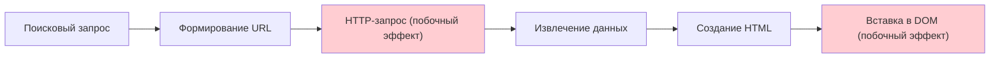
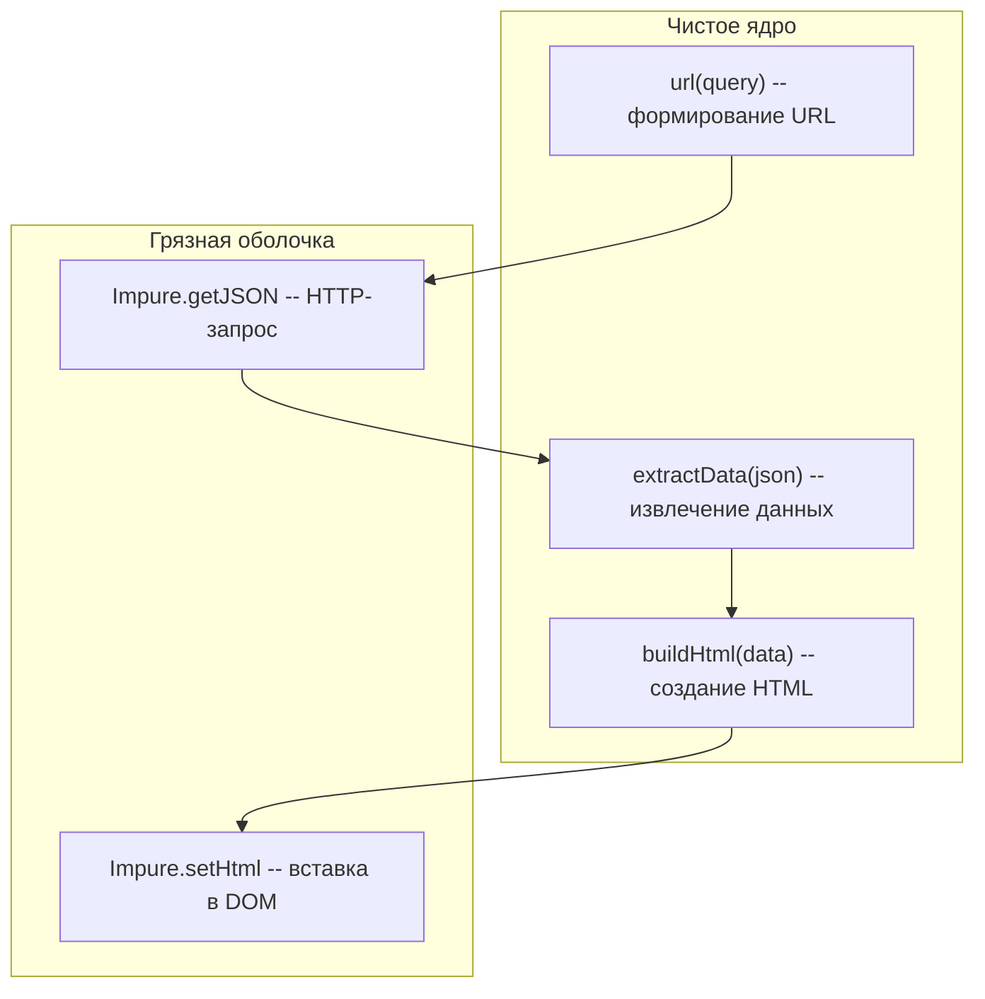
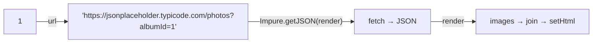

# Chapter: Пример функционального приложения

> [!info] Context
> Это практическая кульминация тем каррирования и композиции. Здесь мы собираем воедино `curry`, `compose` и pointfree-стиль, чтобы построить реальное приложение -- виджет, загружающий данные из API и отображающий их в DOM. Глава показывает, как функциональные приёмы работают **в связке**, а не по отдельности.
>
> **Пререквизиты:** [[pure-functions]], [[closure]], [[partial-application/readme]], [[function-composition/function-composition]]

## Overview

В предыдущих главах мы изучили каррирование, композицию и pointfree-стиль как отдельные инструменты. Теперь соберём из них работающее приложение -- небольшой виджет, который:

1. Принимает поисковый запрос
2. Формирует URL для API
3. Загружает данные
4. Извлекает нужные поля
5. Строит HTML-элементы
6. Вставляет их в DOM



Обрати внимание: красным выделены шаги с побочными эффектами. Всё остальное -- чистые функции, которые мы можем тестировать, переиспользовать и свободно комбинировать.

**Ключевые концепции главы:**

| Концепция | Зачем |
|---|---|
| Декларативный стиль | Описываем *что*, а не *как* |
| Паттерн `Impure` | Изолируем побочные эффекты в одном месте |
| Пайплайн через `compose` | Строим приложение как цепочку трансформаций |
| Map composition law | Оптимизируем пайплайн, сливая проходы по массиву |

---

## Deep Dive

### 1. Декларативный vs. императивный стиль

Прежде чем строить приложение, разберём фундаментальное различие в подходах к написанию кода.

**Императивный стиль** -- это пошаговая инструкция *как* что-то сделать. Мы управляем потоком выполнения вручную: циклы, переменные-аккумуляторы, условные переходы.

**Декларативный стиль** -- это описание *что* мы хотим получить. Детали реализации скрыты за абстракциями.

```javascript
// Императивно: пошаговая инструкция
const makes = [];
for (let i = 0; i < cars.length; i++) {
  makes.push(cars[i].make);
}

// Декларативно: описание результата
const makes = map(prop('make'), cars);
```

Ещё один пример -- аутентификация:

```javascript
// Императивно: промежуточная переменная, два шага
const authenticate = (form) => {
  const user = toUser(form);
  return logIn(user);
};

// Декларативно: композиция двух функций
const authenticate = compose(logIn, toUser);
```

Аналогия с SQL помогает понять суть. Когда пишешь `SELECT name FROM users WHERE age > 18`, ты не указываешь базе данных, как обходить индексы или в каком порядке фильтровать строки. Ты описываешь *что* хочешь получить, а СУБД сама решает *как*. Декларативный JavaScript работает по тому же принципу: `map`, `filter`, `compose` -- это наш "SQL" для трансформации данных.

> [!important] Key takeaway
> Декларативный код описывает *что* нужно получить, а не *как* это делать. Он короче, выразительнее и легче поддаётся рефакторингу. Композиция функций -- основной инструмент декларативного стиля в FP.

---

### 2. Структура приложения -- четыре задачи виджета

Наш виджет решает четыре задачи. Разобьём их явно:

1. **Сформировать URL** на основе входных параметров
2. **Выполнить HTTP-запрос** к API и получить JSON
3. **Извлечь и трансформировать данные** из ответа
4. **Отобразить результат** в DOM

Задачи 1 и 3 -- чистые функции. Задачи 2 и 4 -- побочные эффекты (сетевой запрос и мутация DOM). Архитектурная идея: чистые функции составляют ядро логики, а побочные эффекты изолированы на краях приложения.



> [!tip] Functional core, imperative shell
> Этот паттерн называется "функциональное ядро, императивная оболочка". Вся бизнес-логика живёт в чистых функциях, а побочные эффекты вытеснены на границы приложения. Это делает ядро тестируемым без моков.

---

### 3. Паттерн Impure -- изоляция побочных эффектов

В функциональном программировании побочные эффекты неизбежны -- программа, которая ничего не читает и ничего не пишет, бесполезна. Но можно собрать все эффекты в одном месте, чтобы чётко видеть, где код "грязный".

Паттерн `Impure` -- это объект-неймспейс, содержащий каррированные обёртки над побочными эффектами:

```javascript
const Impure = {
  getJSON: curry((callback, url) =>
    fetch(url)
      .then((res) => res.json())
      .then(callback)
  ),

  setHtml: curry((selector, html) => {
    document.querySelector(selector).innerHTML = html;
  }),

  trace: curry((tag, x) => {
    console.log(tag, x);
    return x;
  }),
};
```

Зачем каррирование здесь? Потому что эти функции будут участвовать в `compose`-пайплайне. Каррирование позволяет частично применить callback или selector заранее, а данные подставятся в конце:

```javascript
// Частичное применение: фиксируем callback, URL придёт позже
const fetchPhotos = Impure.getJSON(renderPhotos);
// fetchPhotos('https://...') -- вызовет fetch и передаст результат в renderPhotos

// Частичное применение: фиксируем селектор, HTML придёт позже
const renderToMain = Impure.setHtml('#js-main');
// renderToMain('<div>...</div>') -- вставит HTML в #js-main
```

> [!warning] Impure -- это не монада и не полная изоляция
> Паттерн `Impure` не делает побочные эффекты "чистыми". Он лишь явно маркирует и группирует грязный код, чтобы остальная программа оставалась чистой. В более продвинутом FP для этого используют монаду IO, но это тема будущих глав.

> [!important] Key takeaway
> Собери все побочные эффекты в один объект `Impure`. Каррируй их, чтобы они вписывались в `compose`-пайплайны. Остальной код пусть будет чистым.

---

### 4. Построение пайплайна пошагово

Теперь построим виджет шаг за шагом. Будем использовать публичный API JSONPlaceholder, который возвращает фотографии:

```
GET https://jsonplaceholder.typicode.com/photos?albumId=1
```

Ответ -- массив объектов:

```json
[
  {
    "albumId": 1,
    "id": 1,
    "title": "accusamus beatae ad facilis cum similique qui sunt",
    "url": "https://via.placeholder.com/600/92c952",
    "thumbnailUrl": "https://via.placeholder.com/150/92c952"
  }
]
```

#### Шаг 1. Утилиты

Нам понадобится набор каррированных утилит. Предполагаем, что `curry`, `compose`, `map`, `prop` уже определены (см. [[function-composition/function-composition]]):

```javascript
const curry = (fn) => {
  const arity = fn.length;
  return function curried(...args) {
    if (args.length >= arity) return fn(...args);
    return (...next) => curried(...args, ...next);
  };
};

const compose = (...fns) => (x) =>
  fns.reduceRight((acc, fn) => fn(acc), x);

const map = curry((f, xs) => xs.map(f));
const prop = curry((key, obj) => obj[key]);
const take = curry((n, xs) => xs.slice(0, n));
```

#### Шаг 2. Формирование URL

```javascript
const host = 'jsonplaceholder.typicode.com';
const path = '/photos';
const query = (albumId) => `?albumId=${albumId}`;
const url = (albumId) => `https://${host}${path}${query(albumId)}`;

url(1); // 'https://jsonplaceholder.typicode.com/photos?albumId=1'
```

Функция `url` чистая -- принимает albumId, возвращает строку. Никаких побочных эффектов.

#### Шаг 3. Извлечение данных из ответа

API возвращает массив объектов. Нам нужны `thumbnailUrl` и `title`:

```javascript
// Извлекаем thumbnailUrl из одного объекта
const thumbnailUrl = prop('thumbnailUrl');

// Извлекаем массив URL из массива объектов
const thumbnailUrls = map(thumbnailUrl);

// Проверяем
thumbnailUrls([
  { thumbnailUrl: 'https://via.placeholder.com/150/1' },
  { thumbnailUrl: 'https://via.placeholder.com/150/2' },
]);
// ['https://via.placeholder.com/150/1', 'https://via.placeholder.com/150/2']
```

#### Шаг 4. Создание HTML-элементов

```javascript
const img = (src) => ``;
const images = compose(map(img), thumbnailUrls);

// Проверяем
images([
  { thumbnailUrl: 'https://via.placeholder.com/150/1' },
]);
// ['']
```

Обрати внимание: `images` -- pointfree-функция, собранная из `compose`. Она не упоминает аргумент (массив данных) явно.

#### Шаг 5. Рендеринг

Нам нужно превратить массив строк в одну строку и вставить в DOM:

```javascript
const join = curry((sep, xs) => xs.join(sep));

const render = compose(Impure.setHtml('#js-main'), join(''), images);
```

#### Шаг 6. Собираем приложение

```javascript
const app = compose(Impure.getJSON(render), url);

// Запуск
app(1); // Загружает фото albumId=1 и отображает в #js-main
```

Вся программа -- одна строка. Разберём, что происходит при вызове `app(1)`:



1. `url(1)` формирует URL-строку
2. `Impure.getJSON(render)` отправляет запрос и передаёт ответ в `render`
3. `render` извлекает URL-ы картинок, создаёт HTML и вставляет в DOM

> [!important] Key takeaway
> Приложение строится как пайплайн: чистые трансформации данных соединяются через `compose`, а побочные эффекты находятся только на входе (fetch) и выходе (DOM). Каждую чистую функцию можно протестировать отдельно.

---

### 5. Закон map composition law

Это одно из важнейших свойств функтора (map), позволяющее оптимизировать пайплайны.

#### Формальная запись

```
compose(map(f), map(g)) === map(compose(f, g))
```

Словами: два последовательных `map` можно заменить одним `map` с композицией функций внутри.

#### Почему это работает

Каждый вызов `map` проходит по всему массиву. Два `map` -- два прохода. Но если объединить трансформации в одну функцию, хватит одного прохода:

```javascript
// До оптимизации: два прохода по массиву
const images = compose(map(img), map(thumbnailUrl));

// Применяем закон map composition:
// compose(map(img), map(thumbnailUrl)) === map(compose(img, thumbnailUrl))

// После оптимизации: один проход
const photoToImg = compose(img, thumbnailUrl);
const images = map(photoToImg);
```

#### Доказательство эквивалентности

```javascript
const data = [
  { thumbnailUrl: 'https://via.placeholder.com/150/1' },
  { thumbnailUrl: 'https://via.placeholder.com/150/2' },
  { thumbnailUrl: 'https://via.placeholder.com/150/3' },
];

// Версия 1: два map
const result1 = compose(map(img), map(thumbnailUrl))(data);

// Версия 2: один map с compose
const result2 = map(compose(img, thumbnailUrl))(data);

// Результаты идентичны
console.log(JSON.stringify(result1) === JSON.stringify(result2)); // true
```

#### Практическая ценность

В нашем виджете это даёт не только оптимизацию скорости (один проход вместо двух), но и более компактный код:

```javascript
// Было: map внутри map
const images = compose(map(img), map(thumbnailUrl));

// Стало: один map с объединённой трансформацией
const images = map(compose(img, thumbnailUrl));
```

> [!tip] Когда применять закон
> Каждый раз, когда видишь два подряд идущих `map`, подумай -- можно ли объединить их в один. Это не только быстрее, но и проще читается: вместо "сначала достань URL, потом сделай img" -- "преврати фото в img".

> [!important] Key takeaway
> Закон `map(f) . map(g) === map(f . g)` позволяет объединять последовательные трансформации в одну. Это и оптимизация (меньше проходов по массиву), и средство рефакторинга (более компактные пайплайны).

---

### 6. Итоговая версия приложения

Соберём всё вместе, применив закон map composition:

```javascript
// === Утилиты ===
const curry = (fn) => {
  const arity = fn.length;
  return function curried(...args) {
    if (args.length >= arity) return fn(...args);
    return (...next) => curried(...args, ...next);
  };
};

const compose = (...fns) => (x) =>
  fns.reduceRight((acc, fn) => fn(acc), x);

const map = curry((f, xs) => xs.map(f));
const prop = curry((key, obj) => obj[key]);
const join = curry((sep, xs) => xs.join(sep));

// === Побочные эффекты ===
const Impure = {
  getJSON: curry((callback, url) =>
    fetch(url)
      .then((res) => res.json())
      .then(callback)
  ),
  setHtml: curry((selector, html) => {
    document.querySelector(selector).innerHTML = html;
  }),
  trace: curry((tag, x) => {
    console.log(tag, x);
    return x;
  }),
};

// === Чистые функции ===
const host = 'jsonplaceholder.typicode.com';
const path = '/photos';
const query = (albumId) => `?albumId=${albumId}&_limit=10`;
const url = (albumId) => `https://${host}${path}${query(albumId)}`;

const thumbnailUrl = prop('thumbnailUrl');
const img = (src) => ``;

// Закон map composition: compose(map(img), map(thumbnailUrl)) → map(compose(img, thumbnailUrl))
const photoToImg = compose(img, thumbnailUrl);
const images = map(photoToImg);

// === Пайплайн ===
const render = compose(Impure.setHtml('#js-main'), join(''), images);
const app = compose(Impure.getJSON(render), url);

// === Запуск ===
app(1);
```

Обрати внимание на несколько деталей:

- **Ни одного `for`-цикла, ни одной промежуточной переменной** -- весь поток данных выражен через композицию
- **Побочные эффекты только в `Impure`** -- всё остальное можно тестировать без сети и без DOM
- **`photoToImg`** -- результат применения закона map composition, один проход вместо двух
- **Добавлен `_limit=10`** в query, чтобы не загружать 5000 фотографий

Для добавления отладки достаточно вставить `Impure.trace` в пайплайн:

```javascript
const render = compose(
  Impure.setHtml('#js-main'),
  join(''),
  Impure.trace('images'),  // Посмотреть массив HTML-строк
  images,
  Impure.trace('raw data')  // Посмотреть сырые данные из API
);
```

> [!important] Key takeaway
> Итоговое приложение -- это несколько строк чистых функций, соединённых через `compose`, плюс изолированные побочные эффекты в `Impure`. Закон map composition применён для оптимизации. Весь код декларативен: он описывает *что* делать, а не *как*.

---

## Exercises

> [!tip] Подсказка
> Для всех упражнений используй каррированные утилиты из предыдущих глав:
> ```javascript
> const curry = (fn) => {
>   const arity = fn.length;
>   return function curried(...args) {
>     if (args.length >= arity) return fn(...args);
>     return (...next) => curried(...args, ...next);
>   };
> };
>
> const compose = (...fns) => (x) =>
>   fns.reduceRight((acc, fn) => fn(acc), x);
>
> const map = curry((f, xs) => xs.map(f));
> const prop = curry((key, obj) => obj[key]);
> const filter = curry((f, xs) => xs.filter(f));
> const join = curry((sep, xs) => xs.join(sep));
> ```

### Упражнение 1. Императивный код в declarative compose-пайплайн

Дан императивный код, обрабатывающий массив товаров. Перепиши его в декларативный `compose`-пайплайн, используя `map`, `filter`, `prop` и `compose`:

```javascript
const products = [
  { name: 'Laptop', price: 1200, inStock: true },
  { name: 'Phone', price: 800, inStock: false },
  { name: 'Tablet', price: 500, inStock: true },
  { name: 'Monitor', price: 300, inStock: true },
];

// Императивная версия -- перепиши декларативно
function getAvailableProductNames(products) {
  const result = [];
  for (let i = 0; i < products.length; i++) {
    if (products[i].inStock) {
      result.push(products[i].name);
    }
  }
  return result;
}

// Ожидаемый результат:
// getAvailableProductNames(products) => ['Laptop', 'Tablet', 'Monitor']
```

### Упражнение 2. Пайплайн для API пользователей

Построй `compose`-пайплайн для API `https://jsonplaceholder.typicode.com/users`, который:

1. Формирует URL
2. Загружает данные через `Impure.getJSON`
3. Извлекает имя каждого пользователя (`name`)
4. Оборачивает каждое имя в `<li>...</li>`
5. Соединяет в строку и оборачивает в `<ul>...</ul>`
6. Вставляет в DOM через `Impure.setHtml('#js-main')`

Пиши в том же стиле, что и основной пример главы: `url`, `render`, `app` -- каждый через `compose`.

### Упражнение 3. Закон map composition -- доказательство

Дан пайплайн с двумя последовательными `map`:

```javascript
const toUpper = (s) => s.toUpperCase();
const exclaim = (s) => `${s}!`;

const shoutAll = compose(map(exclaim), map(toUpper));
```

1. Примени закон `map(f) . map(g) === map(f . g)` и напиши оптимизированную версию
2. Напиши тест, доказывающий эквивалентность обеих версий на массиве `['hello', 'world', 'foo']`
3. Замерь, сколько раз вызывается callback в каждой версии (подсказка: добавь счётчик вызовов)

### Упражнение 4. Impure для fetch

Паттерн `Impure` в примере главы использует `fetch`. Расширь его:

1. Добавь в `Impure` метод `getText` -- аналог `getJSON`, но использующий `res.text()` вместо `res.json()`
2. Добавь метод `logError` -- каррированная функция `(tag, error) => console.error(tag, error)`, возвращающая `error`
3. Построй пайплайн, который загружает `https://jsonplaceholder.typicode.com/posts/1` как текст и вставляет его в `<pre>` внутри `#js-main`

---

## Anki Cards

> [!tip] Flashcards

> Q: Чем декларативный стиль отличается от императивного?
> A: Императивный описывает *как* (пошаговые инструкции: циклы, переменные). Декларативный описывает *что* (результат: `map`, `filter`, `compose`). Аналогия: SQL описывает *что* выбрать, а не *как* обойти таблицу.

> Q: Какие четыре задачи решает FP-виджет из главы 6?
> A: 1) Сформировать URL. 2) Выполнить HTTP-запрос. 3) Извлечь и трансформировать данные. 4) Отобразить результат в DOM. Задачи 1 и 3 -- чистые, 2 и 4 -- побочные эффекты.

> Q: Что такое паттерн Impure и зачем он нужен?
> A: Объект-неймспейс, собирающий все побочные эффекты (fetch, DOM-мутации, console.log) в одном месте. Функции внутри каррированы для использования в compose-пайплайнах. Остальной код остаётся чистым.

> Q: Почему функции в объекте Impure каррированы?
> A: Чтобы можно было частично применить конфигурацию (callback, selector) и использовать результат в compose-пайплайне. Например, `Impure.getJSON(render)` возвращает функцию, ожидающую URL.

> Q: Как называется архитектурный паттерн "чистые функции внутри, побочные эффекты снаружи"?
> A: Functional core, imperative shell. Вся бизнес-логика живёт в чистых функциях (тестируемых без моков), а побочные эффекты вытеснены на границы приложения.

> Q: Запиши закон map composition law.
> A: `compose(map(f), map(g)) === map(compose(f, g))`. Два последовательных map можно объединить в один map с композицией функций внутри.

> Q: Какое практическое преимущество даёт map composition law?
> A: 1) Оптимизация: один проход по массиву вместо двух. 2) Компактность: вместо двух отдельных трансформаций -- одна объединённая. 3) Формально обоснованный рефакторинг.

> Q: Что делает функция trace в compose-пайплайне?
> A: `trace(tag, x)` логирует значение `x` с меткой `tag` и возвращает `x` без изменений. Вставляется между функциями в compose для просмотра промежуточных значений без нарушения пайплайна.

> Q: Как в compose-пайплайне отладить промежуточное значение между функциями f и g?
> A: Вставить `Impure.trace('label')` между ними: `compose(f, Impure.trace('after g'), g)`. В консоли появится значение, которое g вернула и которое f получит.

> Q: Почему compose(Impure.getJSON(render), url) работает как приложение?
> A: При вызове `app(albumId)`: 1) `url(albumId)` формирует URL-строку. 2) `Impure.getJSON(render)` -- частично применённая функция -- получает URL, делает fetch и передаёт JSON в `render`. Весь поток описан одной композицией.

> Q: Что произойдёт, если применить map composition law к `compose(map(img), map(prop('thumbnailUrl')))`?
> A: Получится `map(compose(img, prop('thumbnailUrl')))` -- один проход по массиву, который сразу извлекает URL и создаёт тег img.

> Q: Почему Impure -- это не полноценная изоляция побочных эффектов?
> A: Impure лишь группирует и маркирует грязный код, но не делает его чистым. Побочные эффекты всё равно выполняются немедленно. Для полной изоляции в FP используют монаду IO, которая откладывает выполнение.

---

## Related Topics

- [[pure-functions]] -- чистые функции как основа композиции
- [[closure]] -- замыкания -- механизм каррирования
- [[partial-application/readme]] -- частичное применение через curry
- [[function-composition/function-composition]] -- каррирование, compose, pipe, pointfree, теория категорий
- [[chaining/readme]] -- цепочки вызовов как альтернатива композиции

---

## Sources

- [Mostly Adequate Guide -- Chapter 6: Example Application](https://mostly-adequate.gitbook.io/mostly-adequate-guide/ch06)
- [Mostly Adequate Guide -- Глава 6 (RU)](https://github.com/MostlyAdequate/mostly-adequate-guide-ru/blob/master/ch06-ru.md)
- [Ramda.js -- документация](https://ramdajs.com/docs/)
- [JSONPlaceholder -- публичный тестовый API](https://jsonplaceholder.typicode.com/)
