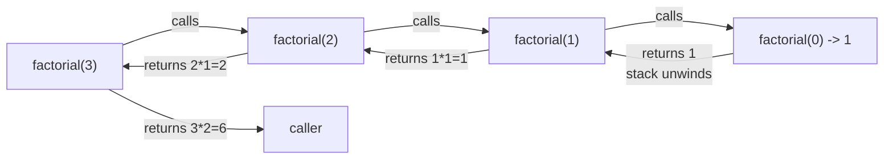
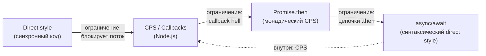

# Chapter: Continuation-Passing Style (CPS)

> [!info] Context
> CPS --- это трансформация программы, при которой функции никогда не возвращают результат вызывающему коду. Вместо этого они принимают дополнительный аргумент --- **continuation** --- функцию, описывающую "что делать с результатом". CPS превращает неявный поток управления (стек) в явные данные (замыкания на куче). Это не нишевый приём --- это теоретическая основа callback-асинхронности в Node.js, стандартная трансформация в компиляторах (Scheme, Haskell, OCaml) и фундамент для понимания `callCC`, эффектов и корутин.
>
> **Пререквизиты:** [[recursion]], [[2.call-stack]], [[closure]], базовое понимание [[3.asynchronous-code]]

---

## Overview

Глава проходит путь от ограничений обычной рекурсии до продвинутых абстракций управления потоком. Каждый этап строится на предыдущем.

| Этап | Что изучаем | Ключевой инсайт |
|------|-------------|-----------------|
| 1 | Direct style и стек | Рекурсия копит отложенную работу на стеке |
| 2 | Continuation как понятие | "Всё, что произойдёт после" можно сделать значением |
| 3 | CPS-трансформация | Передаём "что дальше" как аргумент-функцию |
| 4 | Tail calls и trampolining | CPS делает каждый вызов хвостовым; trampoline компенсирует отсутствие TCO |
| 5 | CPS и async | Callback, Promise, async/await --- три поколения одной идеи |
| 6 | callCC | Захват текущего continuation как first-class значения |

### Два потока управления: стек vs замыкания




Первая диаграмма --- direct style: вызовы углубляются, затем стек разматывается назад. Вторая --- CPS: вызовы идут только вперёд, результат протекает через цепочку замыканий. Стек не растёт --- вместо него работает куча.

---

## Deep Dive

### 1. Direct style и ограничение стека

Обычный рекурсивный factorial --- классический пример direct style. Функция вызывает себя, ждёт результат и домножает:

```typescript
function factorial(n: number): number {
  if (n === 0) return 1;
  return n * factorial(n - 1); // <-- отложенная работа: умножение ждёт возврата
}
```

Каждый рекурсивный вызов создаёт новый stack frame. Для `factorial(5)` на стеке одновременно живут 6 фреймов. Для `factorial(100_000)` --- stack overflow.

Проблема в том, что после рекурсивного вызова `factorial(n - 1)` остаётся **отложенная работа**: умножение на `n`. Пока внутренний вызов не вернётся, текущий фрейм не может быть освобождён. Стек растёт как O(n).

> [!important] Ключевой вопрос
> А если бы "что делать с результатом дальше" было не неявным состоянием стека, а обычным значением --- функцией, которую можно передать как аргумент?

> **Takeaway:** Direct style прост для чтения, но привязывает поток управления к call stack. Чем глубже рекурсия --- тем ближе к переполнению.

---

### 2. Continuation как понятие

Прежде чем переписывать код, определим ключевое понятие.

**Continuation** --- это снимок "всего, что произойдёт после текущего выражения". В direct style continuation неявен --- это адрес возврата и отложенные операции, хранящиеся на стеке. В CPS continuation становится явным --- это функция-аргумент.

Аналогия. Direct style: ты вызываешь такси, стоишь на тротуаре и ждёшь, садишься, едешь домой. CPS: ты вызываешь такси и говоришь "когда приедешь --- позвони мне по этому номеру, и я выйду". Номер телефона --- это continuation. Ты не блокируешься в ожидании.

Два ключевых различия:

| | Direct style | CPS |
|---|---|---|
| Continuation | Неявный (call stack) | Явный (функция-аргумент `k`) |
| Возврат | `return value` | `k(value)` --- вызов continuation |
| Стек | Растёт с глубиной | Не растёт (при наличии TCO) |
| Отложенная работа | На стеке | В замыканиях на куче |

> **Takeaway:** Continuation --- не новая сущность. Это то, что уже существует в каждой программе неявно. CPS делает его видимым и управляемым.

---

### 3. CPS-трансформация вручную

#### Шаг за шагом: factorial

Трансформация проста механически: функция получает дополнительный параметр `k` (continuation), вместо `return` вызывает `k(result)`, а вместо использования результата рекурсивного вызова --- передаёт новый continuation, который выполнит оставшуюся работу.

```typescript
// Direct style
function factorial(n: number): number {
  if (n === 0) return 1;
  return n * factorial(n - 1);
}

// CPS
function factorialCPS(n: number, k: (result: number) => void): void {
  if (n === 0) {
    k(1);                                    // базовый случай: передаём результат в continuation
    return;
  }
  factorialCPS(n - 1, (result: number) => {  // рекурсивный вызов
    k(n * result);                           // continuation делает оставшуюся работу
  });
}

// Вызов
factorialCPS(5, (result: number) => console.log(result)); // 120
```

Обратите внимание на типы. CPS-функция возвращает `void` --- она никогда не отдаёт значение вызывающему коду через `return`. Результат всегда уходит в continuation. Тип continuation: `(result: number) => void`.

#### Трассировка выполнения для n = 3

Разберём пошагово, как цепочка continuation строится и затем "схлопывается":

```
factorialCPS(3, k0)
  где k0 = (r) => console.log(r)

  -> factorialCPS(2, k1)
     где k1 = (r) => k0(3 * r)

     -> factorialCPS(1, k2)
        где k2 = (r) => k1(2 * r)

        -> factorialCPS(0, k3)
           где k3 = (r) => k2(1 * r)

           -> k3(1)                   // базовый случай, вызываем k3 с 1
              -> k2(1 * 1) = k2(1)    // k3 вычисляет 1 * 1, передаёт в k2
              -> k1(2 * 1) = k1(2)    // k2 вычисляет 2 * 1, передаёт в k1
              -> k0(3 * 2) = k0(6)    // k1 вычисляет 3 * 2, передаёт в k0
              -> console.log(6)       // k0 выводит результат
```

> [!tip] Замыкания как связный список
> Каждый continuation `k1`, `k2`, `k3` --- это замыкание, захватившее текущее `n` и ссылку на предыдущий continuation. По сути это linked list приостановленных вычислений, размещённый на куче вместо стека.

#### Дополнительный пример: сумма массива

Чтобы закрепить трансформацию, применим её к другой задаче --- рекурсивному суммированию массива:

```typescript
// Direct style
function sum(arr: number[]): number {
  if (arr.length === 0) return 0;
  const [head, ...tail] = arr;
  return head + sum(tail);
}

// CPS
function sumCPS(arr: number[], k: (result: number) => void): void {
  if (arr.length === 0) {
    k(0);
    return;
  }
  const [head, ...tail] = arr;
  sumCPS(tail, (result: number) => {
    k(head + result);
  });
}

sumCPS([1, 2, 3, 4], (result: number) => console.log(result)); // 10
```

Паттерн тот же: вместо `return head + sum(tail)` мы передаём continuation `(result) => k(head + result)`, который сделает сложение, когда рекурсивный вызов "ответит".

> **Takeaway:** CPS-трансформация --- механический процесс. Каждый `return expr` заменяется на `k(expr)`. Каждое использование результата рекурсивного вызова оборачивается в новый continuation. Функция всегда возвращает `void`.

---

### 4. Tail calls и trampolining

#### Почему CPS даёт хвостовые вызовы

Посмотрите на `factorialCPS`: после рекурсивного вызова `factorialCPS(n - 1, ...)` в теле функции нет никакой работы. Вызов стоит в **хвостовой позиции** (tail position). Это не случайность --- это свойство CPS. Вся "оставшаяся работа" ушла в continuation, поэтому текущему фрейму нечего ждать.

С proper tail calls (TCO) среда выполнения может переиспользовать текущий stack frame, и рекурсия работает в O(1) стека.

#### Проблема JavaScript

Спецификация ES2015 требует TCO. На практике его реализовал только Safari (JavaScriptCore). V8 и SpiderMonkey не поддерживают TCO. Это значит, что CPS-факториал для n = 100 000 всё равно переполнит стек --- не от отложенной работы, а от глубины вызовов.

Решение --- **trampolining**.

#### Thunk: отложенное вычисление

**Thunk** --- это функция без аргументов, которая представляет приостановленное вычисление. Вместо того чтобы рекурсивно вызвать себя, функция возвращает thunk --- "инструкцию" для следующего шага. А вызывающий код (trampoline) выполняет thunk-и в цикле.

#### Реализация trampoline

```typescript
type Thunk<T> = () => T | Thunk<T>;

function trampoline<T>(fn: T | Thunk<T>): T {
  let result: T | Thunk<T> = fn;
  while (typeof result === "function") {
    result = (result as Thunk<T>)();
  }
  return result;
}
```

Trampoline "прыгает" (bounce) между thunk-ами: выполняет один, получает следующий, выполняет --- пока не получит финальное значение. Стек всегда имеет глубину 1.

#### Factorial с trampoline

```typescript
function factorialTrampoline(n: number, acc: number = 1): number | Thunk<number> {
  if (n === 0) return acc;
  return () => factorialTrampoline(n - 1, n * acc); // возвращаем thunk, не вызываем
}

// Без trampoline --- stack overflow при больших n
// С trampoline --- O(1) стека
const result: number = trampoline(factorialTrampoline(100_000));
console.log(typeof result); // "number" (бесконечность, но без ошибки стека)
```

Проверка: `factorialTrampoline(100_000)` завершается без stack overflow. Результат --- `Infinity` (числовое переполнение), но стек цел.

> [!warning] Куча вместо стека
> CPS и trampolining не устраняют потребление памяти --- они переносят его со стека на кучу. Каждый continuation --- это замыкание, аллоцированное в heap. При достаточно глубокой рекурсии можно исчерпать оперативную память, но в отличие от stack overflow, в JavaScript нет явной ошибки heap overflow --- процесс просто замедляется и в пределе убивается ОС.

> **Takeaway:** CPS гарантирует хвостовые вызовы. Trampoline эмулирует TCO через цикл. Вместе они позволяют выполнять рекурсию произвольной глубины в JS.

---

### 5. CPS и async --- реальная связь

CPS --- не только теоретическая конструкция. Вся асинхронная модель JavaScript --- это три поколения одной идеи.

#### Поколение 1: Node.js callbacks = CPS

```typescript
// Direct style (гипотетический синхронный API)
const data: string = readFileSync("file.txt");
process(data);

// CPS (реальный Node.js callback API)
readFile("file.txt", (err: Error | null, data: string) => {
  if (err) {
    handleError(err);
    return;
  }
  process(data);
});
```

Callback --- это continuation. Функция `readFile` не возвращает результат, а передаёт его в callback. Это CPS в чистом виде, с одним дополнением: первый аргумент `err` --- это **error continuation** (вторая "ветка" продолжения).

Проблема callback-based CPS --- **callback hell** ([[5.asynchronous-flow]]): вложенность растёт с каждой асинхронной операцией. Это не недостаток CPS как концепции, а следствие его явной записи вручную.

#### Поколение 2: Promise.then = монадический CPS

```typescript
readFile("file.txt")
  .then((data: string) => process(data))   // .then() принимает continuation
  .catch((err: Error) => handleError(err)); // .catch() --- error continuation
```

`Promise.then()` --- это одновременно монадический `bind` (связывание вычислений) и CPS (передача continuation). Promise оборачивает continuation в структуру данных, что даёт:
- линейную цепочку вместо вложенности;
- единый канал для ошибок;
- возможность комбинировать (`Promise.all`, `Promise.race`).

> [!important] CPS vs Monads --- разные линзы
> `Promise.then` можно рассматривать и как CPS (передаём "что делать дальше"), и как монадический `bind` (связываем вычисления в контексте). Это не противоречие --- это два взгляда на одну конструкцию. CPS --- про поток управления, монады --- про структуру композиции. Подробнее: [[monads]].

#### Поколение 3: async/await = синтаксический сахар над CPS

```typescript
async function main(): Promise<void> {
  const data: string = await readFile("file.txt");
  process(data);
}
```

Код выглядит как direct style, но компилятор генерирует CPS: `await` разрезает функцию на части, каждая часть --- continuation, который передаётся в `.then()`. По сути async/await возвращает нас к прямому стилю на уровне синтаксиса, сохраняя CPS на уровне семантики.

#### Эволюция: от CPS к direct style



> **Takeaway:** Callback, Promise, async/await --- это не три разных механизма, а три синтаксических оболочки вокруг CPS. Понимание CPS делает все три прозрачными.

---

### 6. callCC --- call with current continuation (advanced)

> [!warning] Продвинутый раздел
> callCC --- мощный примитив из Scheme/Lisp. В JavaScript нет нативной поддержки полноценных continuations. Всё, что показано ниже --- концептуальная модель на TypeScript, не production-код.

#### Что такое callCC

`callCC` (call with current continuation) захватывает текущий continuation как first-class значение и передаёт его в пользовательскую функцию. Это позволяет "прыгать" в произвольную точку вычисления --- аналог `goto`, но типобезопасный и в функциональном стиле.

#### Концептуальная реализация

```typescript
type Cont<T, R> = (value: T) => R;

function callCC<T, R>(
  f: (exit: Cont<T, R>) => R
): (k: Cont<T, R>) => R {
  return (k: Cont<T, R>) => f(k);
}
```

`callCC` принимает функцию `f`, которая получает continuation `exit`. Вызов `exit(value)` немедленно "выходит" из вычисления, передавая `value` в continuation.

#### Пример: ранний выход из вычисления

```typescript
function findFirstNegative(
  numbers: number[],
  k: (result: number | null) => void
): void {
  callCC<number | null, void>((exit) => {
    for (const num of numbers) {
      if (num < 0) {
        exit(num); // немедленный выход --- как return, но через continuation
        return;    // TypeScript требует return для control flow, хотя exit уже сработал
      }
    }
    exit(null);    // ничего не нашли
  })(k);
}

findFirstNegative([3, 7, -2, 5], (result: number | null) => {
  console.log(result); // -2
});
```

#### Что моделирует callCC

callCC --- это примитив, из которого можно построить:

| Абстракция | Как моделируется через callCC |
|---|---|
| Exceptions | `exit` = `throw`, continuation = `catch` |
| Generators | Захват continuation при `yield`, возобновление при `next()` |
| Coroutines | Обмен continuations между двумя вычислениями |
| Early return | Прямое применение `exit(value)` |

#### Undelimited vs delimited continuations

- **Undelimited** continuation (callCC) --- захватывает "всё до конца программы". Мощный, но трудно управляемый.
- **Delimited** continuations (`shift`/`reset`) --- захватывают часть вычисления до ближайшей границы. Более компонуемы и безопасны. Используются в Scala (ZIO), OCaml 5, некоторых экспериментальных JS-библиотеках.

> [!important] Ограничение TypeScript
> JavaScript не поддерживает multi-shot continuations (вызов одного continuation несколько раз). Концептуальные примеры выше --- one-shot: каждый continuation можно вызвать ровно один раз. Для полноценной работы с continuations нужны Scheme, Haskell или OCaml 5.

> **Takeaway:** callCC превращает continuation в first-class значение. Это теоретический фундамент для exceptions, generators и coroutines. В JS доступен только концептуально, но понимание callCC проясняет, как работают эти абстракции "под капотом".

---

## Четыре концептуальных якоря CPS

В завершение --- четыре идеи, которые должны остаться после этой главы:

| # | Концепция | Ключевое утверждение |
|---|-----------|---------------------|
| 1 | Что такое continuation | "Всё, что произойдёт после этого выражения" |
| 2 | CPS-трансформация | Передача этого "всего" как явного аргумента-функции |
| 3 | Хвостовая позиция | В CPS все вызовы хвостовые --- ничего не ждёт |
| 4 | Стек vs куча | CPS переносит цепочку вызовов из stack frames в замыкания на куче |

---

## Распространённые заблуждения

- **"CPS --- это то же, что callbacks"** --- Callbacks --- одно из проявлений. CPS --- принцип трансформации программы.
- **"CPS нужен только для async"** --- CPS также решает stack overflow (через TCO), моделирует управление потоком (exceptions, coroutines) и используется как промежуточное представление в компиляторах.
- **"Нужно писать CPS вручную"** --- Компиляторы делают это за вас. Цель --- *понимать* CPS, а не писать его ежедневно.
- **"async/await заменил CPS"** --- async/await *является* CPS, скомпилированным. Continuation генерируется движком.

---

## Related Topics

- [[2.call-stack]] --- стек вызовов, implicit continuations
- [[recursion]] --- рекурсия и рост стека
- [[closure]] --- замыкания как основа для хранения continuations
- [[3.asynchronous-code]] --- асинхронный код в JavaScript
- [[5.asynchronous-flow]] --- callback hell как следствие ручного CPS
- [[9.promise]] --- Promise как монадическая обёртка над CPS
- [[monads]] --- монады и связь с CPS через `.then`/`bind`
- [[function-composition]] --- композиция функций
- [[pure-functions]] --- чистые функции

---

## Sources

- Matt Might --- [By example: Continuation-passing style in JavaScript](https://matt.might.net/articles/by-example-continuation-passing-style/)
- Eli Bendersky --- [On Recursion, Continuations and Trampolines](https://eli.thegreenplace.net/2017/on-recursion-continuations-and-trampolines/)
- Eric Lippert --- [CPS Revisited Part 5: CPS and Asynchrony](https://ericlippert.com/2015/02/05/cps-revisited-part-five-cps-and-asynchrony/)
- Axel Rauschmayer (2ality) --- [Async programming and CPS in JavaScript](https://2ality.com/2012/06/continuation-passing-style.html)
- jnkr.tech --- [CPS in TypeScript](https://jnkr.tech/blog/cps-in-typescript)
- Andrew Appel --- *Compiling with Continuations* (Cambridge University Press, 1992)
- Abelson, Sussman --- *Structure and Interpretation of Computer Programs*, Chapter 5
