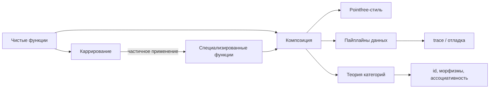
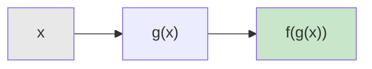
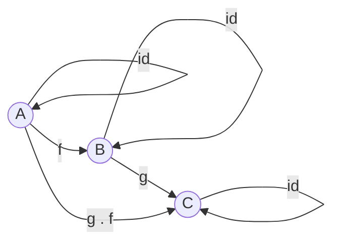

# Chapter: Каррирование и композиция функций

> [!info] Context
> Каррирование и композиция -- два фундаментальных приёма функционального программирования. Каррирование превращает функцию нескольких аргументов в цепочку функций одного аргумента, а композиция позволяет строить сложное поведение из простых функций-кирпичиков. Вместе они дают возможность писать декларативный, переиспользуемый и легко тестируемый код.
>
> **Пререквизиты:** [[closure]], [[pure-functions]], [[partial-application/readme]]

## Overview

Глава состоит из двух связанных блоков:

1. **Currying** -- механика каррирования, вспомогательная функция `curry`, правило "данные последними", связь с частичным применением.
2. **Composition** -- функция `compose`, порядок выполнения, ассоциативность, pointfree-стиль, отладка через `trace`, основы теории категорий.



**Ключевая идея:** каррирование подготавливает функции к композиции. Когда каждая функция принимает один аргумент и возвращает одно значение, их можно свободно соединять в цепочки -- как детали конструктора.

---

## Deep Dive

### 1. Каррирование (Currying)

#### 1.1 Что такое каррирование

Каррирование -- это преобразование функции, которая принимает несколько аргументов, в последовательность функций, каждая из которых принимает один аргумент.

```javascript
// Обычная функция двух аргументов
const add = (x, y) => x + y;
add(1, 2); // 3

// Каррированная версия
const addCurried = x => y => x + y;
const increment = addCurried(1);
increment(2); // 3
increment(10); // 11
```

Каждый вызов возвращает новую функцию, замкнутую на переданном аргументе. Это прямое следствие работы [[closure|замыканий]].

#### 1.2 Вспомогательная функция curry

Писать вложенные стрелочные функции вручную неудобно. Функция `curry` автоматизирует этот процесс:

```javascript
const curry = (fn) => {
  const arity = fn.length;

  return function curried(...args) {
    if (args.length >= arity) {
      return fn(...args);
    }
    return (...nextArgs) => curried(...args, ...nextArgs);
  };
};
```

Теперь можно каррировать любую функцию:

```javascript
const match = curry((what, s) => s.match(what));
const replace = curry((what, replacement, s) => s.replace(what, replacement));
const filter = curry((f, xs) => xs.filter(f));
const map = curry((f, xs) => xs.map(f));
```

> [!tip] Как работает curry
> Функция запоминает арность (количество параметров) оригинальной функции через `fn.length`. При каждом вызове она накапливает аргументы. Когда их набирается достаточно -- вызывает оригинал. Иначе возвращает функцию, ожидающую оставшиеся аргументы.

#### 1.3 Порядок аргументов: данные последними

Критически важное правило при каррировании -- **данные, которые обрабатываются, передаются последним аргументом**. Конфигурация и поведение идут первыми:

```javascript
// Правильно: данные (строка s) -- последний аргумент
const match = curry((what, s) => s.match(what));

// Теперь можно создать специализированную функцию
const hasLetterR = match(/r/g);
hasLetterR('hello world'); // ['r']
hasLetterR('just j and s'); // null

// Неправильно: данные первыми
const matchBad = curry((s, what) => s.match(what));
// matchBad('hello')(/r/g) -- бесполезная специализация
```

Когда данные идут последними, частичное применение создаёт осмысленные переиспользуемые функции:

```javascript
const filter = curry((f, xs) => xs.filter(f));
const reduce = curry((f, init, xs) => xs.reduce(f, init));

// Специализация -- "что делаем" фиксировано, "с чем" -- подставляется позже
const removeStringsWithoutRs = filter(hasLetterR);

removeStringsWithoutRs(['rock and roll', 'smooth jazz']);
// ['rock and roll']
```

#### 1.4 Частичное применение как следствие каррирования

Каррирование и [[partial-application/readme|частичное применение]] -- разные, но тесно связанные концепции:

| Свойство | Каррирование | Частичное применение |
|---|---|---|
| Что делает | Преобразует f(a, b, c) в f(a)(b)(c) | Фиксирует часть аргументов |
| Результат | Всегда унарная функция | Функция с меньшим числом аргументов |
| Автоматическое | Да, через `curry` | Ручное или через `bind` / `partial` |

Каррированная функция автоматически поддерживает частичное применение -- передача неполного числа аргументов возвращает новую функцию.

> [!important] Key takeaway
> Каррирование -- это не просто синтаксический трюк. Оно позволяет превращать общие функции в специализированные, создавая переиспользуемый словарь операций. Правило "данные последними" -- ключ к эффективному каррированию.

---

### 2. Композиция функций (Function Composition)

#### 2.1 Базовая compose для двух функций

Композиция -- это соединение двух функций в одну, где выход первой функции становится входом второй:

```javascript
const compose2 = (f, g) => (x) => f(g(x));
```



```javascript
const toUpperCase = (x) => x.toUpperCase();
const exclaim = (x) => `${x}!`;

const shout = compose2(exclaim, toUpperCase);
shout('send in the clowns'); // "SEND IN THE CLOWNS!"
```

> [!warning] Порядок выполнения: справа налево
> В `compose(f, g)` сначала выполняется `g`, потом `f`. Это математическая конвенция: f . g читается как "f после g". Данные текут справа налево.

#### 2.2 Variadic compose

На практике нужна композиция произвольного числа функций:

```javascript
const compose = (...fns) =>
  fns.reduceRight((prevFn, nextFn) =>
    (...args) => nextFn(prevFn(...args)),
    (x) => x
  );
```

Альтернативная запись через `reduce` с начальным значением:

```javascript
const compose = (...fns) => (x) =>
  fns.reduceRight((acc, fn) => fn(acc), x);
```

Пример -- получить последний элемент массива:

```javascript
const head = (x) => x[0];
const reverse = reduce((acc, x) => [x, ...acc], []);
const last = compose(head, reverse);

last(['jumpkick', 'hierarchies', 'hierarchical']);
// 'hierarchical'
```

#### 2.3 Ассоциативность композиции

Композиция обладает свойством ассоциативности -- не важно, как расставлены скобки:

```javascript
compose(f, compose(g, h)) === compose(compose(f, g), h);
```

Это означает свободу в группировке функций при рефакторинге:

```javascript
// Эквивалентные записи
const loudLastUpper = compose(exclaim, toUpperCase, head, reverse);

// Можно выделить подкомпозиции
const last = compose(head, reverse);
const angry = compose(exclaim, toUpperCase);
const loudLastUpper = compose(angry, last);
```

Ассоциативность позволяет извлекать и переиспользовать любую группу функций из пайплайна.

#### 2.4 Pointfree-стиль

Pointfree (бесточечный стиль) -- это написание функций без упоминания данных, над которыми они работают. "Points" здесь -- это аргументы функции.

```javascript
// Не pointfree: упоминается аргумент str
const snakeCase = (str) => str.toLowerCase().replace(/\s+/ig, '_');

// Pointfree: данные нигде не упоминаются
const snakeCase = compose(replace(/\s+/ig, '_'), toLowerCase);
```

Более сложный пример -- инициалы имени:

```javascript
const split = curry((sep, s) => s.split(sep));
const intercalate = curry((sep, xs) => xs.join(sep));

// Pointfree
const initials = compose(
  intercalate('. '),
  map(compose(toUpperCase, head)),
  split(' ')
);

initials('hunter stockton thompson');
// 'H. S. T'
```

> [!tip] Когда pointfree уместен
> Pointfree-стиль хорош для простых трансформаций данных. Если выражение становится нечитаемым -- лучше вернуться к явным аргументам. Читаемость важнее догматизма.

#### 2.5 Отладка через trace

Когда композиция даёт неожиданный результат, нужно "заглянуть" в промежуточные значения. Для этого используется функция `trace`:

```javascript
const trace = curry((tag, x) => {
  console.log(tag, x);
  return x;
});
```

`trace` -- чистая с точки зрения потока данных: она принимает значение и возвращает его без изменений. Побочный эффект (`console.log`) используется только для отладки.

Пример: пайплайн не работает как ожидается:

```javascript
const dasherize = compose(
  intercalate('-'),
  toLower,          // Ошибка: toLower работает со строкой, а не массивом
  split(' '),
  replace(/\s{2,}/ig, ' ')
);

dasherize('the world is a vampire');
// Не работает!
```

Вставляем `trace`, чтобы найти проблему:

```javascript
const dasherize = compose(
  intercalate('-'),
  toLower,
  trace('after split'),  // Смотрим, что приходит сюда
  split(' '),
  replace(/\s{2,}/ig, ' ')
);

// after split [ 'the', 'world', 'is', 'a', 'vampire' ]
```

Видим: `toLower` получает массив, а ожидает строку. Нужно применить `toLower` к каждому элементу через `map`:

```javascript
const dasherize = compose(
  intercalate('-'),
  map(toLower),      // Исправлено: применяем к каждому элементу
  split(' '),
  replace(/\s{2,}/ig, ' ')
);

dasherize('The world is a vampire');
// 'the-world-is-a-vampire'
```

#### 2.6 Pipe -- композиция слева направо

`pipe` -- это `compose` с обратным порядком: данные текут слева направо, что может быть более интуитивным:

```javascript
const pipe = (...fns) => (x) =>
  fns.reduce((acc, fn) => fn(acc), x);

// Эквивалентные записи
const loudLastUpper = compose(exclaim, toUpperCase, head, reverse);
const loudLastUpper = pipe(reverse, head, toUpperCase, exclaim);
```

`pipe` читается в порядке выполнения: "сначала reverse, потом head, потом toUpperCase, потом exclaim". Многие разработчики находят это более естественным.

#### 2.7 Введение в теорию категорий

Композиция функций -- это не просто удобный паттерн, а фундаментальная математическая операция из теории категорий.

**Категория** -- это коллекция объектов с морфизмами (стрелками) между ними, подчиняющаяся двум правилам:

1. **Ассоциативность композиции:** `compose(f, compose(g, h)) === compose(compose(f, g), h)`
2. **Тождественный морфизм (identity):** для каждого объекта существует морфизм `id`, такой что `compose(id, f) === compose(f, id) === f`

```javascript
const id = (x) => x;

// Тождественные законы
compose(id, toUpperCase)('hello') === toUpperCase('hello'); // true
compose(toUpperCase, id)('hello') === toUpperCase('hello'); // true
```



В контексте JavaScript:
- **Объекты** -- это типы (String, Number, Boolean и т.д.)
- **Морфизмы** -- это чистые функции между типами
- **Композиция** -- это оператор `.` (функция `compose`)
- **identity** -- это `id = x => x`

> [!important] Зачем нужна теория категорий
> Понимание категориальных законов позволяет делать формально обоснованный рефакторинг. Если функции подчиняются ассоциативности и тождественности -- можно свободно перегруппировывать пайплайны, извлекать подкомпозиции и быть уверенным в корректности.

> [!important] Key takeaway
> Композиция -- это способ построения программ из маленьких чистых функций. `compose` выполняет функции справа налево, `pipe` -- слева направо. Ассоциативность даёт свободу рефакторинга. `trace` помогает отладить промежуточные значения. Pointfree-стиль -- следствие каррирования и композиции, но не самоцель.

---

## Exercises

> [!tip] Подсказка
> Для упражнений используй каррированные версии стандартных функций:
> ```javascript
> const curry = (fn) => {
>   const arity = fn.length;
>   return function curried(...args) {
>     if (args.length >= arity) return fn(...args);
>     return (...next) => curried(...args, ...next);
>   };
> };
>
> const split = curry((sep, s) => s.split(sep));
> const map = curry((f, xs) => xs.map(f));
> const filter = curry((f, xs) => xs.filter(f));
> const reduce = curry((f, init, xs) => xs.reduce(f, init));
> const match = curry((what, s) => s.match(what));
> const replace = curry((what, rep, s) => s.replace(what, rep));
> const prop = curry((key, obj) => obj[key]);
> const compose = (...fns) => (x) =>
>   fns.reduceRight((acc, fn) => fn(acc), x);
> ```

### Упражнение 1. Pointfree: words

Перепиши функцию в pointfree-стиле, убрав явный аргумент `str`:

```javascript
const words = (str) => split(' ', str);
```

Тест:

```javascript
console.assert(
  JSON.stringify(words('hello functional world')) ===
  JSON.stringify(['hello', 'functional', 'world'])
);
```

### Упражнение 2. Pointfree: filterQs

Перепиши в pointfree-стиле:

```javascript
const filterQs = (xs) => filter((x) => match(/q/i, x), xs);
```

Тест:

```javascript
console.assert(
  JSON.stringify(filterQs(['quick', 'camber', 'query', 'test'])) ===
  JSON.stringify(['quick', 'query'])
);
```

### Упражнение 3. Pointfree: max

Перепиши с использованием вспомогательной функции `keepHighest`:

```javascript
const max = (xs) =>
  reduce((acc, x) => (x >= acc ? x : acc), -Infinity, xs);
```

Тест:

```javascript
console.assert(max([3, 1, 4, 1, 5, 9, 2, 6]) === 9);
console.assert(max([-10, -5, -1]) === -1);
```

### Упражнение 4. Compose: isLastInStock

Перепиши через `compose`, убрав явные обращения к свойствам:

```javascript
const isLastInStock = (cars) => {
  const lastCar = last(cars);
  return prop('in_stock', lastCar);
};
```

Тест:

```javascript
const cars = [
  { name: 'Aston Martin', in_stock: true },
  { name: 'Ferrari', in_stock: false },
];
console.assert(isLastInStock(cars) === false);
```

### Упражнение 5. Compose: averageDollarValue

Перепиши через `compose`:

```javascript
const averageDollarValue = (cars) => {
  const dollarValues = map((c) => c.dollar_value, cars);
  return average(dollarValues);
};
```

Вспомогательные функции:

```javascript
const add = curry((a, b) => a + b);
const sum = reduce(add, 0);
const length = (xs) => xs.length;
const average = (xs) => sum(xs) / length(xs);
```

Тест:

```javascript
const cars = [
  { dollar_value: 20000 },
  { dollar_value: 40000 },
  { dollar_value: 60000 },
];
console.assert(averageDollarValue(cars) === 40000);
```

### Упражнение 6. Реализуй curry с нуля

Напиши функцию `curry`, которая:
- Принимает функцию `fn`
- Возвращает каррированную версию
- Поддерживает передачу нескольких аргументов за раз: `f(1, 2)(3)` и `f(1)(2)(3)` -- эквивалентны

Тесты:

```javascript
const sum3 = (a, b, c) => a + b + c;
const curriedSum = curry(sum3);

console.assert(curriedSum(1)(2)(3) === 6);
console.assert(curriedSum(1, 2)(3) === 6);
console.assert(curriedSum(1)(2, 3) === 6);
console.assert(curriedSum(1, 2, 3) === 6);
```

### Упражнение 7. Реализуй variadic compose

Напиши функцию `compose`, которая принимает произвольное число функций и возвращает их композицию (справа налево).

Тесты:

```javascript
const toUpper = (s) => s.toUpperCase();
const exclaim = (s) => `${s}!`;
const head = (xs) => xs[0];

const shout = compose(exclaim, toUpper);
console.assert(shout('hello') === 'HELLO!');

const firstLoud = compose(exclaim, toUpper, head);
console.assert(firstLoud(['hi', 'bye']) === 'HI!');
```

### Упражнение 8. Реализуй pipe через compose

Напиши функцию `pipe`, используя уже готовую `compose`.

Тесты:

```javascript
const process = pipe(
  split(' '),
  map(toUpper),
  intercalate('-')
);
console.assert(process('hello world') === 'HELLO-WORLD');
```

### Упражнение 9. Отладка через trace

Дан сломанный пайплайн. Вставь `trace` в нужные места, найди ошибку и исправь:

```javascript
const toLower = (s) => s.toLowerCase();
const intercalate = curry((sep, xs) => xs.join(sep));

const dasherize = compose(
  intercalate('-'),
  toLower,
  split(' '),
  replace(/\s{2,}/ig, ' ')
);

// Ожидаемый результат:
// dasherize('The  World Is  A  Vampire') === 'the-world-is-a-vampire'
```

---

## Anki Cards

> [!tip] Flashcards

> Q: Что такое каррирование (currying)?
> A: Преобразование функции нескольких аргументов в цепочку функций, каждая из которых принимает один аргумент. `f(a, b, c)` становится `f(a)(b)(c)`.

> Q: Какой ключевой механизм JavaScript делает каррирование возможным?
> A: Замыкания (closures). Каждая возвращённая функция замыкается на ранее переданных аргументах.

> Q: Почему при каррировании данные передаются последним аргументом?
> A: Чтобы частичное применение создавало осмысленные специализированные функции. Например, `filter(predicate)` возвращает функцию, ожидающую массив -- это полезно. `filter(array)` вернёт функцию, ожидающую предикат -- это бесполезно.

> Q: Чем каррирование отличается от частичного применения (partial application)?
> A: Каррирование превращает f(a, b, c) в f(a)(b)(c) -- цепочку унарных функций. Частичное применение фиксирует часть аргументов и возвращает функцию с меньшей арностью. Каррированная функция автоматически поддерживает частичное применение.

> Q: Что делает `compose(f, g)(x)`?
> A: Вычисляет `f(g(x))`. Сначала применяется `g` к `x`, затем `f` к результату. Порядок выполнения -- справа налево.

> Q: В каком порядке выполняются функции в `compose(a, b, c)(x)`?
> A: Справа налево: сначала `c(x)`, потом `b(результат)`, потом `a(результат)`. Эквивалентно `a(b(c(x)))`.

> Q: Что такое ассоциативность композиции и почему она важна?
> A: `compose(f, compose(g, h)) === compose(compose(f, g), h)`. Это свойство позволяет свободно группировать функции в пайплайне, извлекать подкомпозиции и рефакторить без изменения поведения.

> Q: Что такое pointfree-стиль?
> A: Стиль написания функций без явного упоминания данных (аргументов). Вместо `const f = x => toUpper(x)` пишется `const f = toUpper`. Достигается через композицию и каррирование.

> Q: Как работает функция `trace` для отладки композиции?
> A: `const trace = curry((tag, x) => { console.log(tag, x); return x; })`. Она логирует промежуточное значение с меткой и возвращает его без изменений, не нарушая пайплайн.

> Q: Что такое identity-функция (`id`) и зачем она нужна?
> A: `const id = x => x` -- возвращает аргумент без изменений. Это тождественный морфизм: `compose(id, f) === compose(f, id) === f`. Используется для проверки законов категории и как нейтральный элемент композиции.

> Q: Чем `pipe` отличается от `compose`?
> A: Порядком выполнения. `compose(f, g)(x) = f(g(x))` -- справа налево. `pipe(g, f)(x) = f(g(x))` -- слева направо. `pipe` читается в порядке выполнения, что многим кажется интуитивнее.

> Q: Как реализовать variadic compose через reduceRight?
> A: `const compose = (...fns) => (x) => fns.reduceRight((acc, fn) => fn(acc), x)`. Начальное значение -- входные данные `x`, каждая функция применяется к накопленному результату справа налево.

> Q: Какие два закона должна соблюдать категория в теории категорий?
> A: 1) Ассоциативность композиции: `compose(f, compose(g, h)) === compose(compose(f, g), h)`. 2) Тождественный морфизм: `compose(id, f) === compose(f, id) === f`.

> Q: Как вставить trace в compose-пайплайн для отладки?
> A: Вставить `trace('label')` между функциями в compose: `compose(f, trace('after g'), g, h)`. Это покажет значение после выполнения `g` и перед выполнением `f`.

---

## Related Topics

- [[pure-functions]] -- композиция работает корректно только с чистыми функциями
- [[closure]] -- замыкания -- механизм, стоящий за каррированием
- [[partial-application/readme]] -- частичное применение через `bind` и вручную
- [[use-cases-curry]] -- практические примеры каррирования в React, MobX, tRPC
- [[chaining/readme]] -- цепочки вызовов как альтернатива композиции

---

## Sources

- [Mostly Adequate Guide -- Chapter 4: Currying (RU)](https://github.com/MostlyAdequate/mostly-adequate-guide-ru/blob/4f892f1f50e49a5827f89ec57c3085ef1e8f1a32/ch04.md)
- [Mostly Adequate Guide -- Chapter 5: Composition (RU)](https://github.com/MostlyAdequate/mostly-adequate-guide-ru/blob/4f892f1f50e49a5827f89ec57c3085ef1e8f1a32/ch05.md)
- [Ramda.js -- библиотека функционального программирования](https://ramdajs.com/)
