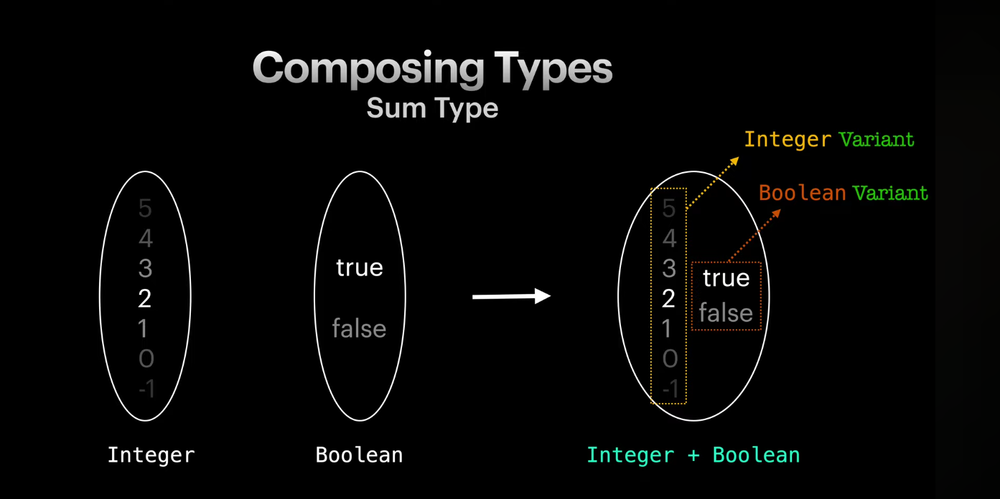
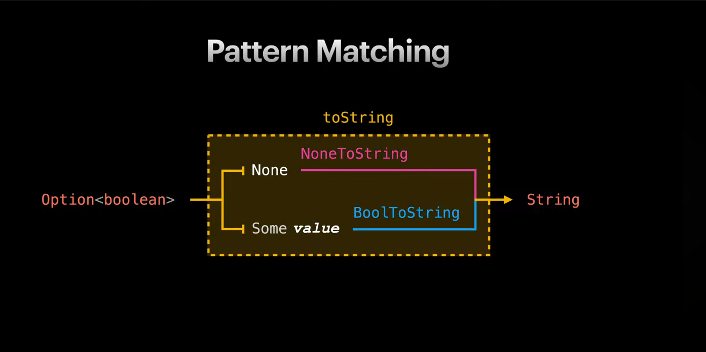

# ADT, Pattern Matching

## Composing Types

Как to compose `Integer` и `Boolean` ?

Результат композиции типов называется **Product Type** (Произведение)
Например:

```ts
type UserRecord = {
  name: string;
  age: number;
  address: {
    city: string;
    street: string;
  };
};

type UserTuple = [string, number, [string, string]];
```

Другой способ **composite type**

Composite type (на примере `Integer` + `Boolean`) будет содержать в себе все `Integer` значения и все `Boolean` значения.
Проблема в том, что мы пока обрабатываем все значения одинаково и не разделяем логику для number и boolean.
Когда мы получаем composite type мы не можем точно определить значение `Integer` или `Boolean`

Как это решить? С помощью группировки наших значений.

Такой тип называется **Sum Type (CoProduct, Tagged, Disjoint Union, сумма)** и возможные значения называются вариантами (Variant)

В тайпскрипте `Sum Type` можно создавать с помощью union type

```ts
type NumOrBool = number | boolean;

type Either<E, A> =
  | {
      _tag: "Left";
      left: E;
    }
  | { _tag: "Right"; right: A };
```

## ADT

ADT - Algebraic Data Type

Алгебраический тип данных (ADT) — это тип, который конструируется из более простых типов через `Product` и `Sum`.

Например, мы хотим конвертировать `Option<boolean>` ->(toString) `String`

Тип `Option<boolean>` может быть или `None` или `Some<boolean>

```ts
type Option<A> = Some<A> | None;
```

Мы можем сделать это с помощью ф-ций. Этот прием называется **Pattern Matching**



**Pattern matching должен покрывать все значения проверяемого типа**

## Demo

### Option

```ts
type Option<A> = Some<A> | None;

export interface Some<A> {
  _tag: "Some";
  value: A;
}

export interface None {
  _tag: "None";
}

export const some = <A>(x: A): Option<A> => ({ _tag: "Some", value: x });
export const none = <A>(x: A): Option<A> => ({ _tag: "Some", value: x });
export const isNone = <A>(x: Option<A>): x is None => x._tag === "None";

type Match = <A, B>(
  onNone: () => B,
  onSome: (a: A) => B,
) => (x: Option<A>) => B;

const match: Match = (onNone, onSome) => (x) =>
  isNone(x) ? onNone() : onSome(x.value);

const maybeNum: Option<number> = some(12);

const result = match(
  () => `num does not exist`,
  (a: number) => `num is ${a}`,
)(maybeNum);
```

Что если мы хотим чтобы возвращаемое значение могло быть с разными типами?

```ts
type Match = <A, B, C>(
  onNone: () => B,
  onSome: (a: A) => C,
) => (x: Option<A>) => B | C;
```

### Either

```ts
type Match = <Error, Allright, B>(
  onLeft: (e: Error) => B,
  onRight: (a: Allright) => B,
) => (x: Either<Error, Allright>) => B;

const match: Match = (onLeft, onRight) => (x) =>
  isLeft(x) ? onLeft(x.left) : onRight(x.right);

const errorOrNum: Either<string, number> = right(12);

const result = match(
  (e: string) => `Error happened: ${e}`,
  (a: number) => `num is ${a}`,
)(errOrNum);
```

### List

```ts
type Match = <A, B>(
  onNil: () => B,
  onConse: (head: A, tail: List<A>) => B,
) => (xs: List<A>) => B;

const match: Match = (onNil, onConse) => (xs) =>
  isNil(xs) ? onNil() : onConse(xs.head, xs.tail);

const myList: List<number> = cons(1, cons(2, cons(3, nil)));

const result = match(
  () => `list is empty`,
  (head: number, tail: List<number>) => `head is ${head}`,
)(myList);
```
