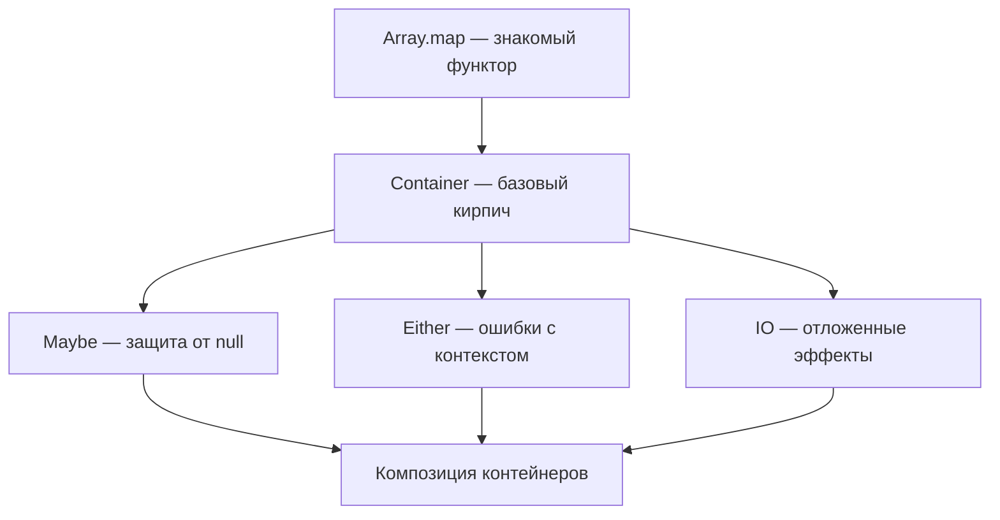
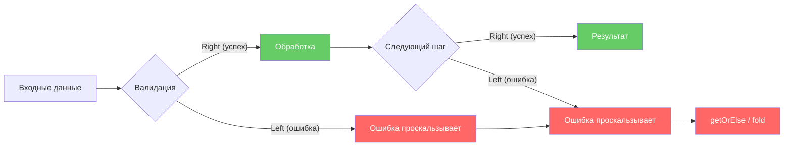
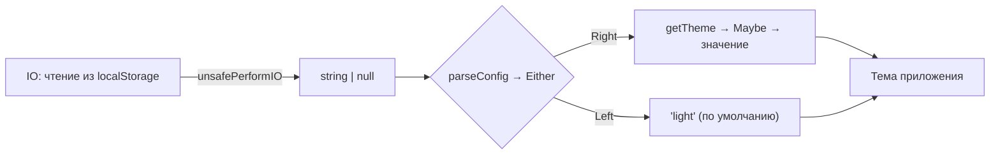
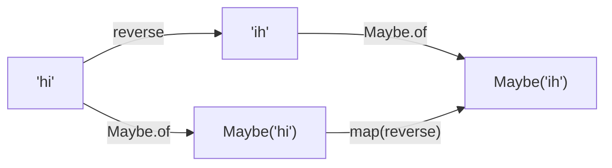

# Chapter: Функторы и контейнеры

> [!info] Context
> Функторы -- это обёртки (контейнеры) над значениями, которые поддерживают операцию `map`. Они позволяют безопасно трансформировать данные внутри контейнера, не извлекая их наружу. Maybe защищает от `null`, Either описывает ошибки с контекстом, IO откладывает побочные эффекты. Вместе они делают код декларативным, безопасным и композируемым.
>
> **Пререквизиты:** [[pure-functions]], [[function-composition/function-composition]], [[partial-application/readme]]

## Overview

Глава построена от знакомого к незнакомому:

1. **Array как функтор** -- ты уже используешь функторы, просто не знал об этом
2. **Мотивация** -- три боли, которые решают контейнеры
3. **Container** -- базовая обёртка, `of` и `map`
4. **Maybe** -- безопасная работа с `null` / `undefined`
5. **Either** -- обработка ошибок с информацией о причине
6. **IO** -- откладывание побочных эффектов
7. **Связываем всё вместе** -- комбинирование контейнеров



---

## 1. Array -- функтор, который ты уже знаешь

Прежде чем вводить новые термины, посмотрим на то, чем ты пользуешься каждый день:

```javascript
[1, 2, 3].map(x => x * 2); // [2, 4, 6]
```

Что здесь происходит?

1. Есть **контейнер** -- массив `[1, 2, 3]`
2. Есть **функция** -- `x => x * 2`
3. `map` применяет функцию к каждому элементу **внутри** контейнера
4. Результат -- **новый контейнер того же типа** -- `[2, 4, 6]`

Массив не раскрывается, функция не знает про массив, `map` соединяет их. Это и есть паттерн функтора:

```
контейнер.map(fn) → новый контейнер того же типа
```

А теперь представь, что вместо массива -- любая другая обёртка. Обёртка над значением, которое может быть `null`. Обёртка над результатом, который может быть ошибкой. Обёртка над побочным эффектом. Все они работают по одному и тому же принципу: `.map(fn)` трансформирует содержимое, не раскрывая контейнер.

> [!tip] Ключевая идея
> **Functor** -- это любой тип данных, у которого есть `map`, соблюдающий два простых закона. Array -- самый известный функтор в JavaScript. Но не единственный.

---

## 2. Зачем нужны другие контейнеры? Мотивация через боль

### Боль 1: лестница null-проверок

```javascript
// Нужно достать имя первого пользователя
const getFirstName = (users) => {
  if (!users) return null;
  if (!users[0]) return null;
  if (!users[0].name) return null;
  return users[0].name.toUpperCase();
};
```

Каждый `if` -- это прерывание потока данных. Код растёт вширь, а не вглубь. Сложно читать, легко забыть одну проверку.

### Боль 2: try/catch ломает композицию

```javascript
// Хотим: compose(extractData, parseJSON, readFile)
// Но parseJSON может бросить ошибку — и вся цепочка рушится

const parseJSON = (str) => {
  try {
    return JSON.parse(str);
  } catch (e) {
    return null; // Потеряли информацию об ошибке!
  }
};
```

`try/catch` -- императивная конструкция. Она не возвращает значение в поток, а перехватывает управление. Это делает функцию нечистой и некомпозируемой.

### Боль 3: побочные эффекты разрушают тестируемость

```javascript
// Эта функция зависит от DOM — нельзя тестировать без браузера
const getUserName = () => {
  const el = document.querySelector('#user-name');
  return el.textContent.toUpperCase();
};
```

Функция делает побочный эффект (обращение к DOM) сразу при вызове. Мы не можем ни отложить его, ни подменить.

> [!important] Три контейнера для трёх болей
> - **Maybe** -- решает проблему `null` / `undefined`
> - **Either** -- решает проблему ошибок с сохранением контекста
> - **IO** -- решает проблему побочных эффектов

---

## 3. Container -- базовый кирпич

Начнём с самой простой обёртки. Container -- это коробка, в которую можно положить любое значение:

```javascript
class Container {
  constructor(value) {
    this._value = value;
  }

  // Статический метод для создания — избавляет от new
  static of(value) {
    return new Container(value);
  }

  // Применяет функцию к значению внутри, возвращает новый Container
  map(fn) {
    return Container.of(fn(this._value));
  }

  // Для удобного вывода в консоль
  inspect() {
    return `Container(${this._value})`;
  }
}
```

Та же реализация на TypeScript -- с дженериками для типобезопасности:

```typescript
class Container<A> {
  private constructor(private readonly _value: A) {}

  static of<A>(value: A): Container<A> {
    return new Container(value);
  }

  map<B>(fn: (a: A) => B): Container<B> {
    return Container.of(fn(this._value));
  }

  inspect(): string {
    return `Container(${this._value})`;
  }
}
```

Использование:

```javascript
Container.of(3);                          // Container(3)
Container.of(3).map(x => x + 1);         // Container(4)
Container.of(3).map(x => x * 2).map(x => x + 1); // Container(7)

// Сравни с Array:
// [3].map(x => x + 1)  →  [4]
// Та же структура!
```

### Почему `of`, а не `new`?

`Container.of(value)` -- это соглашение из функционального программирования. Оно позволяет создать контейнер без ключевого слова `new`, что лучше сочетается с композицией:

```javascript
// Можно передать of как функцию
const wrap = Container.of;
wrap(42); // Container(42)
```

### Законы функтора

Container -- это функтор, потому что его `map` подчиняется двум законам.

> [!info] Законы функтора (Functor Laws)
> **1. Закон идентичности (Identity):**
> ```javascript
> // map с функцией-тождеством не меняет контейнер
> const id = x => x;
>
> Container.of(42).map(id);
> // Container(42) — то же самое, что и исходный контейнер
> ```
>
> **2. Закон композиции (Composition):**
> ```javascript
> // map(f).map(g) === map(x => g(f(x)))
> const f = x => x + 1;
> const g = x => x * 2;
>
> // Два вызова map подряд...
> Container.of(3).map(f).map(g);         // Container(8)
>
> // ...дают тот же результат, что один map с композицией
> Container.of(3).map(x => g(f(x)));     // Container(8)
> ```
>
> Эти законы гарантируют, что `map` ведёт себя **предсказуемо**. Их не нужно заучивать -- достаточно понимать: контейнер не добавляет скрытого поведения, он только хранит и трансформирует.

**Итог:** Container -- простейший функтор. Он оборачивает значение и позволяет трансформировать его через `map`, не извлекая наружу. Но сам по себе Container бесполезен -- он не решает ни одну из трёх болей. Для этого нужны его специализированные потомки.

---

## 4. Maybe -- безопасная работа с null

### Проблема: что вернуть для пустого массива?

```javascript
const head = (arr) => arr[0]; // Что если arr пуст?

head([]);      // undefined
head([1, 2]);  // 1
```

Если `head` возвращает `undefined`, следующий `map` в цепочке упадёт с ошибкой. Нам нужен контейнер, который **знает**, что внутри может быть пусто.

### Реализация

```javascript
class Maybe {
  constructor(value) {
    this._value = value;
  }

  static of(value) {
    return new Maybe(value);
  }

  // Проверка: пусто ли внутри?
  get isNothing() {
    return this._value === null || this._value === undefined;
  }

  // Если пусто — не вызываем fn, возвращаем Maybe(null)
  map(fn) {
    return this.isNothing ? this : Maybe.of(fn(this._value));
  }

  // Безопасный выход из контейнера
  getOrElse(defaultValue) {
    return this.isNothing ? defaultValue : this._value;
  }

  inspect() {
    return this.isNothing ? 'Maybe(null)' : `Maybe(${this._value})`;
  }
}
```

Та же реализация на TypeScript -- с дженериками для типобезопасности:

```typescript
class Maybe<A> {
  private constructor(private readonly _value: A | null | undefined) {}

  static of<A>(value: A | null | undefined): Maybe<A> {
    return new Maybe(value);
  }

  get isNothing(): boolean {
    return this._value === null || this._value === undefined;
  }

  map<B>(fn: (a: A) => B): Maybe<B> {
    return this.isNothing ? Maybe.of<B>(null) : Maybe.of(fn(this._value as A));
  }

  getOrElse(defaultValue: A): A {
    return this.isNothing ? defaultValue : (this._value as A);
  }

  inspect(): string {
    return this.isNothing ? 'Maybe(null)' : `Maybe(${this._value})`;
  }
}
```

### Использование: цепочка без единого `if`

```javascript
// Было: лестница проверок
const getFirstName = (users) => {
  if (!users) return null;
  if (!users[0]) return null;
  if (!users[0].name) return null;
  return users[0].name.toUpperCase();
};

// Стало: чистая цепочка
const getFirstName = (users) =>
  Maybe.of(users)
    .map(us => us[0])          // Maybe(user) или Maybe(null)
    .map(u => u.name)          // Maybe('Иван') или Maybe(null)
    .map(n => n.toUpperCase()) // Maybe('ИВАН') или Maybe(null)
    .getOrElse('Неизвестно');  // 'ИВАН' или 'Неизвестно'
```

Каждый `.map()` проверяет: если внутри `null` -- цепочка просто "проскальзывает", не вызывая функцию. Никаких ошибок, никаких `if`.

### Практический пример: безопасный доступ к свойствам

```javascript
// Вспомогательная функция
const prop = (key) => (obj) => obj[key];

const getStreetName = (user) =>
  Maybe.of(user)
    .map(prop('address'))
    .map(prop('street'))
    .map(prop('name'))
    .getOrElse('Адрес не указан');

getStreetName({ address: { street: { name: 'Ленина' } } });
// 'Ленина'

getStreetName({ address: null });
// 'Адрес не указан'

getStreetName({});
// 'Адрес не указан'
```

> [!tip] Когда использовать Maybe
> - Доступ к вложенным свойствам объекта
> - Поиск элемента в массиве (`find`, `head`)
> - Чтение из localStorage, cookies
> - Любая ситуация, где значение **может отсутствовать** и это **нормально**

**Итог:** Maybe -- контейнер, который "знает" про `null`. Он пропускает трансформации, если внутри пусто, и позволяет задать значение по умолчанию через `getOrElse`. Ни одного `if` в прикладном коде.

---

## 5. Either -- обработка ошибок с информацией

### Проблема: Maybe говорит "нет", но не говорит "почему"

```javascript
Maybe.of(null).map(x => x + 1).getOrElse('что-то пошло не так');
// 'что-то пошло не так' — но ЧТО именно?
```

Когда нужно знать **причину** ошибки, Maybe недостаточно. Нужен контейнер с двумя путями: успех и ошибка.

### Метафора железной дороги (Railway)



- **Right** -- "правильный" путь. Значение проходит через все `map`.
- **Left** -- путь ошибки. Значение "замораживается", все `map` пропускаются.

### Реализация

```javascript
class Right {
  constructor(value) {
    this._value = value;
  }

  static of(value) {
    return new Right(value);
  }

  map(fn) {
    return Right.of(fn(this._value));  // Применяем функцию
  }

  getOrElse(_defaultValue) {
    return this._value;                // Возвращаем значение
  }

  fold(fnLeft, fnRight) {
    return fnRight(this._value);       // Вызываем правую функцию
  }

  inspect() {
    return `Right(${this._value})`;
  }
}

class Left {
  constructor(value) {
    this._value = value;
  }

  static of(value) {
    return new Left(value);
  }

  map(_fn) {
    return this;                       // Игнорируем функцию!
  }

  getOrElse(defaultValue) {
    return defaultValue;               // Возвращаем значение по умолчанию
  }

  fold(fnLeft, _fnRight) {
    return fnLeft(this._value);        // Вызываем левую функцию
  }

  inspect() {
    return `Left(${this._value})`;
  }
}
```

Та же реализация на TypeScript -- с дженериками для типобезопасности:

```typescript
class Right<A> {
  private constructor(private readonly _value: A) {}

  static of<A>(value: A): Right<A> {
    return new Right(value);
  }

  map<B>(fn: (a: A) => B): Right<B> {
    return Right.of(fn(this._value));
  }

  getOrElse(_defaultValue: A): A {
    return this._value;
  }

  fold<B>(fnLeft: (a: A) => B, fnRight: (a: A) => B): B {
    return fnRight(this._value);
  }
}

class Left<A> {
  private constructor(private readonly _value: A) {}

  static of<A>(value: A): Left<A> {
    return new Left(value);
  }

  map<B>(_fn: (a: A) => B): Left<A> {
    return this; // Игнорируем функцию
  }

  getOrElse(defaultValue: A): A {
    return defaultValue;
  }

  fold<B>(fnLeft: (a: A) => B, _fnRight: (a: A) => B): B {
    return fnLeft(this._value);
  }
}

type Either<L, R> = Left<L> | Right<R>;
```

### Использование: два пути

```javascript
// Right идёт по "счастливому пути"
Right.of(100)
  .map(n => n - 20)   // Right(80)
  .map(n => n * 2);   // Right(160)

// Left "сходит с рельсов" — map игнорируется
Left.of('Недостаточно средств')
  .map(n => n - 20)   // Left('Недостаточно средств')
  .map(n => n * 2);   // Left('Недостаточно средств')
```

### Практический пример: парсинг JSON

```javascript
// Обёртка над JSON.parse, возвращающая Either
const parseJSON = (str) => {
  try {
    return Right.of(JSON.parse(str));
  } catch (e) {
    return Left.of(`Ошибка парсинга: ${e.message}`);
  }
};

// Успешный путь
parseJSON('{"name": "Иван"}')
  .map(obj => obj.name)
  .map(name => name.toUpperCase())
  .getOrElse('Ошибка');
// 'ИВАН'

// Путь ошибки
parseJSON('не json вовсе')
  .map(obj => obj.name)          // пропущено
  .map(name => name.toUpperCase()) // пропущено
  .getOrElse('Ошибка');
// 'Ошибка'

// Или через fold — обрабатываем оба пути явно
parseJSON('не json вовсе').fold(
  err => `Произошла ошибка: ${err}`,
  data => `Данные: ${JSON.stringify(data)}`
);
// 'Произошла ошибка: Ошибка парсинга: ...'
```

### Практический пример: валидация формы

```javascript
const validateAge = (age) => {
  if (typeof age !== 'number') return Left.of('Возраст должен быть числом');
  if (age < 0) return Left.of('Возраст не может быть отрицательным');
  if (age > 150) return Left.of('Некорректный возраст');
  return Right.of(age);
};

validateAge(25)
  .map(age => `Возраст: ${age} лет`)
  .getOrElse('Ошибка валидации');
// 'Возраст: 25 лет'

validateAge(-5)
  .map(age => `Возраст: ${age} лет`)
  .getOrElse('Ошибка валидации');
// 'Ошибка валидации'

// С fold получаем конкретную ошибку
validateAge(-5).fold(
  err => err,
  age => `Возраст: ${age} лет`
);
// 'Возраст не может быть отрицательным'
```

> [!tip] Maybe vs Either -- когда что использовать
> - **Maybe** -- когда отсутствие значения **нормально** и причина не важна (поиск, optional-поля)
> - **Either** -- когда нужно знать **причину** ошибки (валидация, парсинг, бизнес-логика)

**Итог:** Either даёт два явных пути: Right для успеха, Left для ошибки. Left хранит описание проблемы и "проскальзывает" через все `map`. Метод `fold` позволяет обработать оба случая в одном месте.

---

## 6. IO -- откладывание побочных эффектов

### Проблема: как композировать нечистые функции?

```javascript
// Эта функция обращается к DOM — она нечистая
const getUser = () => document.querySelector('#user');

// Как включить её в compose-цепочку с чистыми функциями?
// compose(toUpperCase, getText, getUser) -- getUser сломает чистоту всей цепочки
```

Чистые функции не зависят от внешнего мира ([[pure-functions]]). Но реальные программы обязаны читать DOM, делать HTTP-запросы, писать в консоль. Как совместить?

### Идея: обернуть побочный эффект в функцию

Побочный эффект опасен только когда он **выполняется**. Если мы **не вызываем** нечистую функцию, а только **храним** её -- всё остаётся чистым:

```javascript
// Нечистая функция:
document.querySelector('#user');  // выполняется прямо сейчас

// Чистое описание нечистой функции:
() => document.querySelector('#user');  // просто значение, ничего не делает
```

IO -- это контейнер, который хранит функцию (побочный эффект) и **не выполняет** её до явного запроса.

### Реализация

```javascript
class IO {
  constructor(fn) {
    this._value = fn; // Всегда функция!
  }

  static of(value) {
    return new IO(() => value);
  }

  // Создаём новый IO с композицией функций
  map(fn) {
    return new IO(() => fn(this._value()));
  }

  // Явный запуск — "я знаю, что делаю"
  unsafePerformIO() {
    return this._value();
  }

  inspect() {
    return `IO(?)`;  // Не можем показать значение без выполнения
  }
}
```

Та же реализация на TypeScript -- с дженериками для типобезопасности:

```typescript
class IO<A> {
  constructor(private readonly _value: () => A) {}

  static of<A>(value: A): IO<A> {
    return new IO(() => value);
  }

  map<B>(fn: (a: A) => B): IO<B> {
    return new IO(() => fn(this._value()));
  }

  unsafePerformIO(): A {
    return this._value();
  }
}
```

### Использование

```javascript
// Создаём IO — ничего не выполняется
const userIO = new IO(() => document.querySelector('#user'));

// Добавляем трансформации — всё ещё ничего не выполняется
const userNameIO = userIO
  .map(el => el.textContent)     // IO — не выполнено
  .map(name => name.toUpperCase()); // IO — не выполнено

// Только здесь происходит реальный побочный эффект
userNameIO.unsafePerformIO();
// 'ИВАН' (или что там в DOM)
```

### Зачем это нужно?

1. **Тестируемость.** Можно проверить, что цепочка трансформаций правильная, не запуская побочный эффект.
2. **Контролируемость.** Все побочные эффекты собраны на "краю" программы, в одном месте.
3. **Композируемость.** IO можно включать в `compose`-цепочки:

```javascript
const compose = (...fns) => x => fns.reduceRight((acc, fn) => fn(acc), x);

// Чтение из window
const windowProp = (key) => new IO(() => window[key]);

// Цепочка трансформаций
const getScreenWidth = windowProp('innerWidth')
  .map(w => `Ширина: ${w}px`);

// Запускаем когда нужно
getScreenWidth.unsafePerformIO(); // 'Ширина: 1920px'
```

> [!warning] unsafePerformIO -- не просто название
> Метод `unsafePerformIO` специально назван "unsafe", чтобы подчеркнуть: здесь происходит побочный эффект. В хорошо спроектированном приложении вызовы `unsafePerformIO` собраны в одном месте -- на "краю" программы (точка входа, обработчик событий), а не разбросаны по бизнес-логике.

**Итог:** IO оборачивает побочный эффект в функцию и откладывает его выполнение. Внутри IO можно строить цепочки `.map()`, не выполняя эффект. `unsafePerformIO()` -- осознанный момент запуска, собранный на краю программы.

---

## 7. Связываем всё вместе

В реальных приложениях контейнеры часто комбинируются. Вот пример: читаем конфигурацию (IO), парсим JSON (Either), достаём необязательное поле (Maybe):

```javascript
// Допустим, есть функция чтения из localStorage — побочный эффект
const readConfig = new IO(() => localStorage.getItem('appConfig'));

// Парсим результат
const parseConfig = (str) => {
  if (str === null) return Left.of('Конфигурация не найдена');
  try {
    return Right.of(JSON.parse(str));
  } catch (e) {
    return Left.of(`Невалидный JSON: ${e.message}`);
  }
};

// Достаём опциональное поле
const getTheme = (config) =>
  Maybe.of(config)
    .map(c => c.theme)
    .getOrElse('light');

// Собираем пайплайн
const configStr = readConfig.unsafePerformIO(); // IO → строка (побочный эффект)
const theme = parseConfig(configStr)            // Either
  .map(getTheme)                                // Either(Maybe → значение)
  .getOrElse('light');                          // выход из Either
```



> [!tip] Следующий шаг -- Monad
> В примере выше мы вручную "разворачиваем" контейнеры. Monads (монады) решают эту проблему через метод `chain` (он же `flatMap`, `bind`), который позволяет вкладывать контейнеры друг в друга без ручного "разворачивания". Это тема следующей главы.

---

## 8. Функтор и теория категорий -- без паники

В книге "Mostly Adequate Guide" есть секция "Немного теории", которая может сбить с толку. Разберём её идеи на пальцах, без формализма.

### Что такое категория?

Забудь слово "категория" на секунду. Представь **карту**:

- **Города** -- это типы данных: `number`, `string`, `boolean`
- **Дороги** между городами -- это функции: `toString` ведёт из `number` в `string`, `toUpperCase` ведёт из `string` в `string`

```
number ---toString---> string ---toUpperCase---> string
  42        →           "42"        →             "42"
```

Вот и всё. Категория -- это **типы + функции между ними**. Ты работаешь в этой категории каждый день, просто не называешь её так.

### Что делает функтор с этой картой?

Функтор берёт эту карту и **копирует** её в новый мир. В мире `Maybe`:

- Каждый город (тип) получает приставку `Maybe`: `number` → `Maybe<number>`, `string` → `Maybe<string>`
- Каждая дорога (функция) оборачивается в `map`: `toString` → `map(toString)`

```
Обычный мир:                    Мир Maybe:
number ---toString---> string   Maybe<number> ---map(toString)---> Maybe<string>
  42        →           "42"    Maybe(42)           →               Maybe("42")
```

Главное: **все дороги сохранились**. Если в обычном мире можно было пройти из `number` в `string` через `toString`, то в мире `Maybe` можно пройти тот же путь через `map(toString)`. Ничего не потерялось, ничего не сломалось.

Но `Maybe` добавил кое-что новое: теперь в каждом городе значение **может отсутствовать**. Дорога `map(toString)` сама проверяет: если на входе `Maybe(null)`, она не упадёт, а просто вернёт `Maybe(null)`.

### Зачем нужны законы? Чтобы карта не врала

Два закона функтора -- это гарантия того, что "копия карты" не исказила маршруты:

**Закон идентичности** -- "стоять на месте = стоять на месте":
```javascript
// В обычном мире: id(42) === 42 -- ничего не изменилось
// В мире Maybe: Maybe(42).map(id) === Maybe(42) -- тоже ничего не изменилось
// Если бы map(id) вдруг изменил значение -- карта врёт!
```

**Закон композиции** -- "два перехода = один прямой путь":
```javascript
// В обычном мире: toUpperCase(toString(42)) === "42"
// В мире Maybe: Maybe(42).map(toString).map(toUpperCase) === Maybe(42).map(x => toUpperCase(toString(x)))
// Неважно, идёшь ли ты через промежуточный город или напрямую -- конечная точка одна
```

Если оба закона выполняются -- функтор **честно** скопировал карту. Можно безопасно рефакторить: менять порядок `map` и `of`, разбивать цепочки, объединять их -- результат не изменится.

### Коммутативная диаграмма -- два маршрута, один пункт назначения

Это просто визуальный способ сказать: "неважно, в какой момент ты оборачиваешь значение в контейнер":

```javascript
// Маршрут 1: сначала перевернуть строку, потом обернуть в Maybe
const route1 = (s) => Maybe.of(reverse(s));

// Маршрут 2: сначала обернуть в Maybe, потом перевернуть через map
const route2 = (s) => Maybe.of(s).map(reverse);

route1('hi'); // Maybe('ih')
route2('hi'); // Maybe('ih')
// Один и тот же результат!
```



Оба пути ведут в одну точку. Это следствие законов функтора. На практике это значит: если тебе удобнее сначала трансформировать данные, а потом обернуть -- пожалуйста. Если удобнее сначала обернуть, а потом трансформировать через `map` -- тоже пожалуйста. Результат гарантированно одинаковый.

### Вложенные функторы -- матрёшка

Иногда контейнеры оказываются внутри контейнеров:

```javascript
// Массив внутри Maybe: Maybe([ Right('ok'), Left('ошибка') ])
// Чтобы добраться до строки, нужно три map:
// 1. map -- пробиться через Maybe
// 2. map -- пробиться через Array
// 3. map -- пробиться через Either

Maybe.of([Right.of('привет'), Left.of('ошибка')])
  .map(arr => arr.map(either => either.map(s => s.toUpperCase())));
// Maybe([ Right('ПРИВЕТ'), Left('ошибка') ])
```

Это `map(map(map(f)))` -- три слоя. Выглядит некрасиво, но работает, потому что **композиция функторов -- тоже функтор**. Два вложенных функтора можно рассматривать как один, и он тоже будет подчиняться законам.

### Container = Identity -- самый скучный функтор

`Container`, который мы написали в начале главы, в теории категорий называется **Identity**. Он ничего не добавляет: не проверяет `null` (как Maybe), не разделяет на ветки (как Either), не откладывает эффекты (как IO). Он просто оборачивает значение. Как функция `id = x => x` ничего не делает с аргументом, так и `Container` ничего не делает с контейнером.

Зачем он нужен? Как учебный инструмент -- чтобы увидеть паттерн `of` + `map` в чистом виде, без дополнительного поведения.

> [!tip] Итог по теории
> - **Категория** = типы + функции. Ты в ней живёшь.
> - **Функтор** = копирует мир типов в новый мир (Maybe, Either, IO), сохраняя все связи.
> - **Законы** = гарантия, что копия не исказила маршруты. Можно безопасно рефакторить.
> - **Коммутативная диаграмма** = два пути, один результат. Неважно, когда обернуть в контейнер.
> - **Вложенные функторы** = композиция функторов тоже функтор.
> - **Container = Identity** = функтор, который ничего не добавляет.

---

## 9. TypeScript: типизированные интерфейсы функторов

Все контейнеры выше реализуют один и тот же паттерн -- `map`. В TypeScript это можно выразить через общий интерфейс:

```typescript
// Базовый интерфейс функтора
interface Functor<A> {
  map<B>(fn: (a: A) => B): Functor<B>;
}

// Интерфейс для безопасного извлечения значения
interface Foldable<A> {
  getOrElse(defaultValue: A): A;
}
```

Каждый контейнер реализует `Functor` и добавляет свою специфику:

```typescript
// Container — простейший функтор
interface IContainer<A> extends Functor<A> {
  map<B>(fn: (a: A) => B): IContainer<B>;
}

// Maybe — функтор с проверкой на null
interface IMaybe<A> extends Functor<A>, Foldable<A> {
  readonly isNothing: boolean;
  map<B>(fn: (a: A) => B): IMaybe<B>;
}

// Either — функтор с двумя путями
interface IEither<L, R> extends Functor<R>, Foldable<R> {
  map<B>(fn: (a: R) => B): IEither<L, B>;
  fold<B>(fnLeft: (a: L) => B, fnRight: (a: R) => B): B;
}

// IO — функтор с отложенным побочным эффектом
interface IIO<A> extends Functor<A> {
  map<B>(fn: (a: A) => B): IIO<B>;
  unsafePerformIO(): A;
}
```

> [!important] Зачем типизировать функторы
> TypeScript-дженерики делают трансформации внутри контейнера **отслеживаемыми на этапе компиляции**. Если `Container<number>` проходит через `map(n => String(n))`, результат автоматически выводится как `Container<string>`. Ошибки типов ловятся до запуска кода.

Пример использования с выводом типов:

```typescript
// TypeScript автоматически выводит типы на каждом шаге
const result = Container.of(42)        // Container<number>
  .map(n => n * 2)                     // Container<number>
  .map(n => `Результат: ${n}`)         // Container<string>
  .map(s => s.length);                 // Container<number>

const userName = Maybe.of<string>('Иван')  // Maybe<string>
  .map(s => s.toUpperCase())               // Maybe<string>
  .map(s => s.length)                      // Maybe<number>
  .getOrElse(0);                           // number
```

**Итог:** TypeScript добавляет контейнерам типобезопасность: дженерики отслеживают тип значения через цепочки `map`, а интерфейсы формализуют контракт функтора. Это особенно ценно в больших кодовых базах, где цепочки трансформаций могут быть длинными и сложными.

---

## Exercises

### Упражнение 1: Разминка с Container

Реализуй функцию `doubleInContainer`, которая принимает число, оборачивает в `Container` и удваивает:

```javascript
const doubleInContainer = (n) => Container.of(n).map(/* ??? */);

// Должно вернуть:
doubleInContainer(5);  // Container(10)
doubleInContainer(0);  // Container(0)
```

Дополнительно: проверь закон идентичности и закон композиции для своего Container.

### Упражнение 2: safeHead с Maybe

Напиши функцию `safeHead`, которая безопасно возвращает первый элемент массива, обёрнутый в Maybe:

```javascript
const safeHead = (arr) => /* ??? */;

safeHead([1, 2, 3]).getOrElse('пусто');  // 1
safeHead([]).getOrElse('пусто');          // 'пусто'
safeHead(null).getOrElse('пусто');        // 'пусто'
```

Затем используй `safeHead` в цепочке: из массива объектов `[{name: 'Иван'}, {name: 'Мария'}]` достань имя первого элемента в верхнем регистре. Если массив пуст -- верни `'Аноним'`.

### Упражнение 3: Валидация с Either

Реализуй функцию `validateEmail`, которая проверяет email и возвращает Either:

```javascript
const validateEmail = (email) => /* ??? */;

// Правила:
// - Должен быть строкой        → Left('Email должен быть строкой')
// - Не должен быть пустым      → Left('Email не может быть пустым')
// - Должен содержать @          → Left('Email должен содержать @')
// - Иначе                      → Right(email)

validateEmail('user@mail.com').fold(
  err => `Ошибка: ${err}`,
  val => `OK: ${val}`
);
// 'OK: user@mail.com'

validateEmail('invalid').fold(
  err => `Ошибка: ${err}`,
  val => `OK: ${val}`
);
// 'Ошибка: Email должен содержать @'
```

### Упражнение 4: Реализуй Maybe с нуля

Реализуй свой Maybe полностью, включая:
- `of(value)` -- статический метод создания
- `map(fn)` -- трансформация содержимого
- `getOrElse(defaultValue)` -- безопасный выход
- `filter(predicate)` -- возвращает Maybe(null), если предикат ложен
- `inspect()` -- строковое представление

Проверь, что выполняются оба закона функтора (напиши тесты с `console.assert`).

---

## Anki Cards

> [!tip] Flashcards

> Q: Что такое функтор (Functor) простыми словами?
> A: Функтор -- это контейнер (обёртка над значением), у которого есть метод `map`, соблюдающий два закона: идентичности и композиции. Array -- самый известный функтор в JavaScript.

> Q: Какие два закона должен соблюдать функтор?
> A: 1) Закон идентичности: `f.map(x => x)` эквивалентен `f`. 2) Закон композиции: `f.map(g).map(h)` эквивалентен `f.map(x => h(g(x)))`.

> Q: Для чего нужен контейнер Maybe?
> A: Maybe оборачивает значение, которое может быть null/undefined. Метод `map` пропускает трансформацию, если внутри null, позволяя строить цепочки без if-проверок.

> Q: Как безопасно извлечь значение из Maybe?
> A: Через метод `getOrElse(defaultValue)`, который возвращает значение из контейнера или указанное значение по умолчанию, если внутри null.

> Q: В чём разница между Maybe и Either?
> A: Maybe говорит "есть значение или нет", но не объясняет причину отсутствия. Either хранит причину ошибки в Left и успешное значение в Right.

> Q: Что происходит с Left при вызове map?
> A: Ничего -- `map` на Left игнорирует переданную функцию и возвращает тот же Left. Ошибка "проскальзывает" через всю цепочку.

> Q: Что делает метод `fold` у Either?
> A: `fold(fnLeft, fnRight)` принимает две функции: первую вызывает для Left, вторую -- для Right. Позволяет обработать оба случая в одном месте.

> Q: Что хранит внутри контейнер IO?
> A: IO хранит функцию (описание побочного эффекта), а не значение. Эффект не выполняется до явного вызова `unsafePerformIO()`.

> Q: Зачем метод unsafePerformIO назван "unsafe"?
> A: Чтобы подчеркнуть, что в этом месте происходит побочный эффект. В хорошо спроектированном приложении вызовы unsafePerformIO собраны на "краю" программы.

> Q: Какой общий паттерн у всех функторов (Container, Maybe, Either, IO)?
> A: `контейнер.map(fn) → новый контейнер того же типа`. map применяет функцию к содержимому, не извлекая его и не меняя тип контейнера.

> Q: Приведи пример, когда Maybe предпочтительнее Either.
> A: При поиске элемента в массиве (`find`), доступе к необязательному полю объекта -- когда отсутствие значения нормально и причина очевидна.

> Q: Что общего между Array.map и Container.map?
> A: Оба реализуют паттерн функтора: применяют функцию к содержимому контейнера и возвращают новый контейнер того же типа, не мутируя оригинал.

> Q: Какое преимущество дают TypeScript-дженерики при работе с функторами?
> A: Дженерики отслеживают тип значения через цепочки `map` на этапе компиляции. Например, `Container<number>.map(n => String(n))` автоматически выводится как `Container<string>`, и ошибки типов ловятся до запуска кода.

---

## Related Topics

- [[pure-functions]] -- чистые функции как основа функционального программирования
- [[function-composition/function-composition]] -- compose/pipe для построения пайплайнов
- [[partial-application/readme]] -- каррирование и частичное применение
- [[hindley-milner/hindley-milner]] -- нотация типов Hindley-Milner
- [[fp-example-app/fp-example-app]] -- практическое FP-приложение

---

## Sources

- [Mostly Adequate Guide -- Chapter 8 (RU)](https://github.com/MostlyAdequate/mostly-adequate-guide-ru/blob/master/ch08-ru.md)
- [Functors from First Principles -- DEV Community](https://dev.to/snird/functors-from-first-principle-37lh)
- [Elegant Error Handling with the Either Monad -- jrsinclair.com](https://jrsinclair.com/articles/2019/elegant-error-handling-with-the-js-either-monad/)
- [Functional JavaScript -- Functors, Monads, and Promises -- DEV](https://dev.to/joelnet/functional-javascript---functors-monads-and-promises-1pol)
- [Manning -- JavaScript Functors Explained](https://freecontent.manning.com/javascript-functors-explained/)
