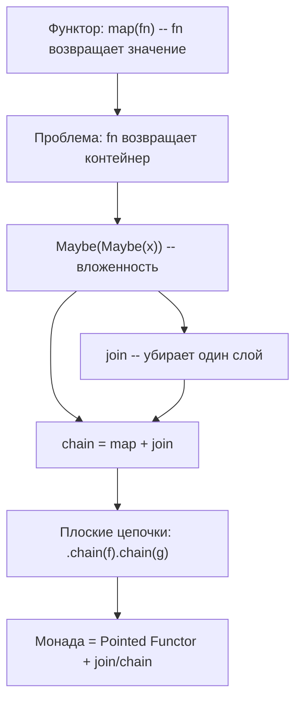
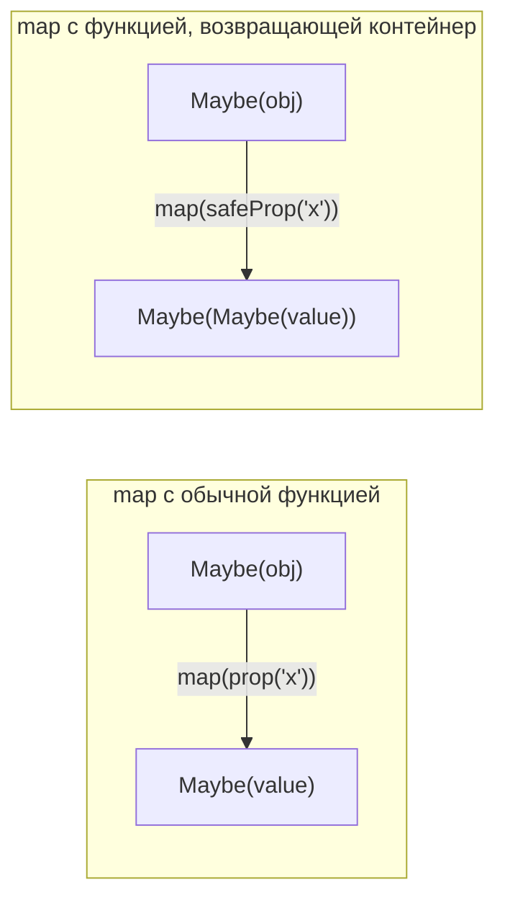
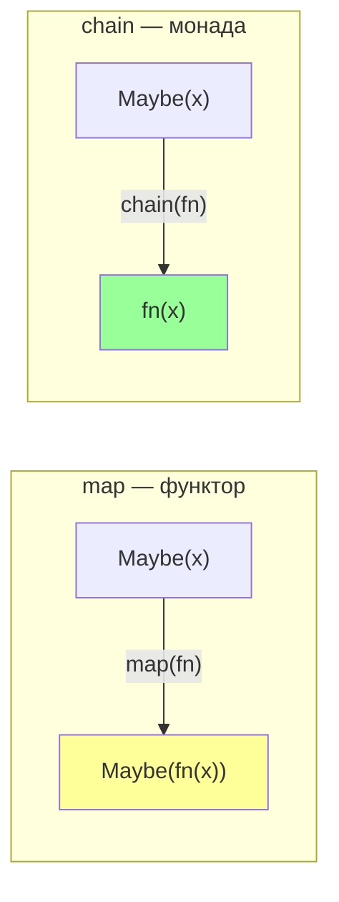
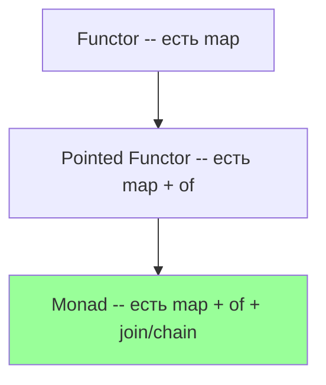

# Chapter: Монады

> [!info] Context
> Монады решают проблему вложенных функторов: когда функция внутри `map` возвращает контейнер, мы получаем контейнер-в-контейнере. Метод `chain` (он же `flatMap`, `bind`) убирает лишний слой, позволяя строить плоские цепочки из функций, возвращающих контейнеры.
>
> **Пререквизиты:** [[ch08-functors-and-containers/functors-and-containers]], [[pure-functions]], [[function-composition/function-composition]]

## Overview

В [[functors-and-containers/functors-and-containers|предыдущей главе]] мы научились оборачивать значения в контейнеры и трансформировать их через `map`. Но что происходит, когда функция, переданная в `map`, сама возвращает контейнер? Мы получаем матрёшку: `Maybe(Maybe(x))`. Монады -- это ответ на вопрос "как избавиться от лишней вложенности".

Структура главы:

1. **Проблема** -- функтор внутри функтора
2. **join** -- снятие одного слоя вложенности
3. **chain** = `map` + `join`
4. **chain в действии** -- три сценария (Maybe, Either, IO)
5. **Ты уже используешь монады** -- Promise.then и Array.flatMap
6. **Определение монады** -- после практики, а не до
7. **Законы монад** -- гарантии предсказуемости
8. **map через chain** -- бонус



---

## 1. Проблема -- функтор внутри функтора

В прошлой главе мы использовали `prop` для безопасного доступа к свойствам:

```javascript
const prop = (key) => (obj) => obj[key];

Maybe.of({ address: { city: 'Москва' } })
  .map(prop('address'))  // Maybe({city: 'Москва'})
  .map(prop('city'))     // Maybe('Москва')
```

Функция `prop` возвращает **обычное значение**. Но что если нам нужна **безопасная** версия, которая сама оборачивает результат в Maybe?

```javascript
// safeProp — возвращает Maybe, а не голое значение
const safeProp = (key) => (obj) => Maybe.of(obj[key]);

Maybe.of({ address: { city: 'Москва' } })
  .map(safeProp('address'));
// Maybe(Maybe({city: 'Москва'}))  -- вложенный контейнер!
```

Мы хотели `Maybe({city: 'Москва'})`, а получили `Maybe(Maybe({city: 'Москва'}))`. Это как чистить лук и обнаружить под шелухой ещё одну луковицу.

Теперь попробуем продолжить цепочку:

```javascript
Maybe.of({ address: { city: 'Москва' } })
  .map(safeProp('address'))   // Maybe(Maybe({city: 'Москва'}))
  .map(safeProp('city'));     // Maybe(Maybe(Maybe('Москва'))) -- ещё хуже!
```

С каждым шагом вложенность растёт. Чтобы добраться до значения, нужно вручную "разворачивать" каждый слой. Код становится нечитаемым, а вся элегантность цепочек теряется.

> [!warning] Корень проблемы
> `map` оборачивает результат функции в контейнер. Если функция **сама** возвращает контейнер, `map` оборачивает его **ещё раз**. Отсюда и вложенность.



**Итог:** когда функция внутри `map` возвращает контейнер, мы получаем матрёшку из вложенных контейнеров. Это делает дальнейшую работу с данными неудобной.

---

## 2. `join` -- снятие одного слоя

Идея проста: если внутри контейнера лежит другой контейнер того же типа, можно "снять" один слой обёртки.

### Реализация для Maybe

```javascript
Maybe.prototype.join = function() {
  return this.isNothing ? this : this._value;
};
```

`join` делает ровно одно: если внутри не пусто -- возвращает то, что лежит внутри. Если значение внутри -- это контейнер, мы получаем этот контейнер без лишней обёртки.

```javascript
Maybe.of(Maybe.of(42)).join();    // Maybe(42) -- снят один слой
Maybe.of(null).join();            // Maybe(null) -- пустота остаётся пустотой
Maybe.of(Maybe.of(null)).join();  // Maybe(null) -- снят слой, внутри пусто
Maybe.of(42).join();              // 42 -- внутри не контейнер, вернулось значение
```

### Реализация для Either (Right и Left)

```javascript
Right.prototype.join = function() {
  return this._value;
};

Left.prototype.join = function() {
  return this; // Left не разворачивается — ошибка остаётся
};
```

```javascript
Right.of(Right.of('данные')).join();      // Right('данные')
Right.of(Left.of('ошибка')).join();       // Left('ошибка')
Left.of('первая ошибка').join();          // Left('первая ошибка')
```

### Реализация для IO

```javascript
IO.prototype.join = function() {
  return new IO(() => this._value().unsafePerformIO());
};
```

IO чуть сложнее: `_value` -- это функция, которая при вызове возвращает другой IO. `join` создаёт новый IO, который при запуске выполняет внешний IO и сразу запускает внутренний.

### Та же логика на TypeScript с дженериками:

```typescript
// join для Maybe<A>
class Maybe<A> {
  // ... (map, of, isNothing из ch08)

  join<B>(this: Maybe<Maybe<B>>): Maybe<B> {
    return this.isNothing ? Maybe.of<B>(null) : (this._value as unknown as Maybe<B>);
  }
}
```

> [!tip] Аналогия
> `join` -- это как открыть посылку и обнаружить внутри ещё одну коробку. Вы просто выбрасываете внешнюю коробку и работаете с внутренней.

**Итог:** `join` убирает один слой вложенности. Для Maybe -- возвращает внутреннее значение, для Left -- остаётся Left, для IO -- объединяет два уровня отложенных вычислений.

---

## 3. `chain` = `map` + `join`

Посмотрим на типичный паттерн: мы вызываем `map` с функцией, возвращающей контейнер, и сразу `join`, чтобы убрать вложенность:

```javascript
Maybe.of({ address: { city: 'Москва' } })
  .map(safeProp('address'))  // Maybe(Maybe({city: 'Москва'}))
  .join()                    // Maybe({city: 'Москва'})
  .map(safeProp('city'))     // Maybe(Maybe('Москва'))
  .join();                   // Maybe('Москва')
```

`map` + `join`, `map` + `join`... Каждый раз одно и то же. Объединим их в один метод:

```javascript
// chain = map, а потом join
Maybe.prototype.chain = function(fn) {
  return this.map(fn).join();
};
```

Теперь цепочка становится чистой и плоской:

```javascript
Maybe.of({ address: { city: 'Москва' } })
  .chain(safeProp('address'))  // Maybe({city: 'Москва'})
  .chain(safeProp('city'));    // Maybe('Москва')
```

### Реализация chain для всех контейнеров

```javascript
// Maybe
Maybe.prototype.chain = function(fn) {
  return this.map(fn).join();
};

// Right
Right.prototype.chain = function(fn) {
  return this.map(fn).join();
};

// Left — chain, как и map, игнорирует функцию
Left.prototype.chain = function(_fn) {
  return this;
};

// IO
IO.prototype.chain = function(fn) {
  return this.map(fn).join();
};
```

На TypeScript с дженериками:

```typescript
// chain для Maybe<A>
class Maybe<A> {
  // ...
  chain<B>(fn: (a: A) => Maybe<B>): Maybe<B> {
    return this.map(fn).join();
  }
}

// chain для Right<A>
class Right<A> {
  chain<B>(fn: (a: A) => Right<B>): Right<B> {
    return this.map(fn).join();
  }
}

// chain для IO<A>  
class IO<A> {
  join<B>(this: IO<IO<B>>): IO<B> {
    return new IO(() => (this._value() as unknown as IO<B>).unsafePerformIO());
  }

  chain<B>(fn: (a: A) => IO<B>): IO<B> {
    return this.map(fn).join();
  }
}
```



> [!important] map vs chain -- ключевое отличие
> - `map(fn)` -- `fn` возвращает **значение**, контейнер оборачивает его сам
> - `chain(fn)` -- `fn` возвращает **контейнер**, дополнительная обёртка не нужна
>
> Используй `map`, когда функция возвращает обычное значение.
> Используй `chain`, когда функция возвращает контейнер (Maybe, Either, IO).

**Итог:** `chain` -- это `map` + `join` в одном вызове. Он позволяет передавать в цепочку функции, которые сами возвращают контейнеры, без вложенности.

---

## 4. chain в действии -- три сценария

### 4.1 Maybe chain -- безопасная навигация по объекту

Самый частый случай: цепочка обращений к вложенным свойствам, каждое из которых может быть `null`.

```javascript
const safeProp = (key) => (obj) => Maybe.of(obj[key]);

const getCity = (user) =>
  Maybe.of(user)
    .chain(safeProp('address'))
    .chain(safeProp('city'))
    .getOrElse('Город не указан');

// Все поля на месте
getCity({ address: { city: 'Москва' } });
// 'Москва'

// Нет address
getCity({ name: 'Иван' });
// 'Город не указан'

// null на входе
getCity(null);
// 'Город не указан'
```

Та же логика на TypeScript:

```typescript
const safeProp = <T, K extends keyof T>(key: K) => (obj: T): Maybe<T[K]> =>
  Maybe.of(obj[key] ?? null);

const getCity = (user: { address?: { city?: string } | null } | null): string =>
  Maybe.of(user)
    .chain(safeProp('address'))
    .chain(safeProp('city'))
    .getOrElse('Город не указан');
```

Сравним с тем, что было бы без `chain`:

```javascript
// Без chain — вложенный map + ручное разворачивание
Maybe.of(user)
  .map(safeProp('address'))   // Maybe(Maybe(address))
  .map(map(safeProp('city'))) // Maybe(Maybe(Maybe(city))) — кошмар
  // ... и как теперь достать значение?

// С chain — плоская цепочка
Maybe.of(user)
  .chain(safeProp('address'))  // Maybe(address)
  .chain(safeProp('city'));    // Maybe(city)
```

### 4.2 Either chain -- валидационный пайплайн

Когда каждый шаг валидации может вернуть ошибку (Left) или передать данные дальше (Right):

```javascript
const validateAge = (data) =>
  data.age < 18
    ? Left.of('Слишком молод')
    : Right.of(data);

const validateEmail = (data) =>
  !data.email || !data.email.includes('@')
    ? Left.of('Некорректный email')
    : Right.of(data);

const validateName = (data) =>
  !data.name || data.name.trim() === ''
    ? Left.of('Имя обязательно')
    : Right.of(data);

// Пайплайн: первая ошибка останавливает цепочку
const validateUser = (data) =>
  Right.of(data)
    .chain(validateName)
    .chain(validateAge)
    .chain(validateEmail);

validateUser({ name: 'Иван', age: 25, email: 'ivan@mail.ru' })
  .fold(
    err => `Ошибка: ${err}`,
    ok => `Пользователь ${ok.name} валиден`
  );
// 'Пользователь Иван валиден'

validateUser({ name: 'Иван', age: 15, email: 'ivan@mail.ru' })
  .fold(
    err => `Ошибка: ${err}`,
    ok => `Пользователь ${ok.name} валиден`
  );
// 'Ошибка: Слишком молод'
```

На TypeScript с дженериками:

```typescript
interface UserData {
  name: string;
  age: number;
  email: string;
}

const validateAge = (data: UserData): Either<string, UserData> =>
  data.age < 18
    ? Left.of('Слишком молод')
    : Right.of(data);

const validateEmail = (data: UserData): Either<string, UserData> =>
  !data.email.includes('@')
    ? Left.of('Некорректный email')
    : Right.of(data);
```

Обрати внимание: каждая функция валидации возвращает Either (Left или Right). Именно поэтому нужен `chain`, а не `map`. Если бы мы использовали `map`, получили бы `Right(Right(Right(data)))` или `Right(Right(Left('ошибка')))`.

### 4.3 IO chain -- последовательность эффектов

Когда один побочный эффект зависит от результата другого:

```javascript
const readLocalStorage = (key) =>
  new IO(() => localStorage.getItem(key));

const parseJSON = (str) =>
  new IO(() => str ? JSON.parse(str) : null);

// chain соединяет два IO в один, без вложенности
const getConfig = readLocalStorage('config')
  .chain(parseJSON);  // IO, а не IO(IO)

// Запускаем один раз — оба эффекта выполняются последовательно
getConfig.unsafePerformIO();
```

Без `chain`:

```javascript
readLocalStorage('config')
  .map(parseJSON);
// IO(IO(value)) — вложенный IO, нужно дважды вызывать unsafePerformIO
```

С `chain` мы получаем один "плоский" IO, который при запуске выполняет всю цепочку эффектов.

**Итог:** `chain` работает одинаково для всех контейнеров -- убирает вложенность и делает цепочки плоскими. Maybe chain для безопасной навигации, Either chain для валидации, IO chain для последовательных эффектов.

---

## 5. Ты уже используешь монады!

Монады -- не абстрактная математика. Ты работаешь с ними каждый день, просто под другими именами.

### Promise.then -- это chain

```javascript
// fetch возвращает Promise
// res.json() тоже возвращает Promise
// Но then НЕ создаёт Promise(Promise(data))!

fetch('/api/user')
  .then(res => res.json())   // fn возвращает Promise — then разворачивает
  .then(user => user.name);  // fn возвращает значение — then оборачивает

// then = map + chain в одном методе
// Если fn возвращает Promise — ведёт себя как chain
// Если fn возвращает значение — ведёт себя как map
```

Promise.then автоматически "разворачивает" вложенные Promise. Это делает его монадическим методом, хотя он и не следует всем законам монад строго.

### Array.flatMap -- это chain

```javascript
// map с функцией, возвращающей массив — вложенность
[1, 2, 3].map(x => [x, x * 2]);
// [[1, 2], [2, 4], [3, 6]] — массив массивов

// flatMap = map + flatten (join) — плоский результат
[1, 2, 3].flatMap(x => [x, x * 2]);
// [1, 2, 2, 4, 3, 6] — один плоский массив
```

Параллель прямая:

| Контейнер | map | chain / flatMap |
|-----------|-----|-----------------|
| Maybe | `map(fn)` -- fn возвращает значение | `chain(fn)` -- fn возвращает Maybe |
| Either | `map(fn)` | `chain(fn)` -- fn возвращает Either |
| IO | `map(fn)` | `chain(fn)` -- fn возвращает IO |
| Array | `map(fn)` -- получаем `[[a,b],[c]]` | `flatMap(fn)` -- получаем `[a,b,c]` |
| Promise | `then(fn)` -- fn возвращает значение | `then(fn)` -- fn возвращает Promise |

> [!tip] Запомни
> Если ты использовал `Promise.then` с функцией, возвращающей Promise, или `Array.flatMap` -- ты уже работал с монадами. `chain` -- это тот же паттерн, обобщённый для любого контейнера.

**Итог:** Promise.then и Array.flatMap -- монадические операции из стандартной библиотеки JavaScript. Паттерн один и тот же: "применить функцию, которая возвращает контейнер, и развернуть результат".

---

## 6. Что такое монада? (определение после практики)

Теперь, когда ты видел `chain` в действии, можно дать определение.

**Pointed Functor** -- это функтор с методом `of`:
- `of(value)` -- помещает значение в контейнер
- `map(fn)` -- трансформирует значение внутри

Все наши контейнеры (Container, Maybe, Right, IO) -- pointed functor'ы.

**Monad** -- это pointed functor с методом `join` (или, что эквивалентно, с методом `chain`):
- `join()` -- убирает один слой вложенности
- `chain(fn)` = `map(fn).join()` -- применяет функцию и убирает вложенность



> [!important] Простое определение
> **Монада -- это контейнер с тремя операциями:**
> 1. `of(x)` -- положить значение в контейнер
> 2. `map(fn)` -- трансформировать значение внутри
> 3. `chain(fn)` -- применить функцию, возвращающую контейнер, без вложенности
>
> Все наши контейнеры (Maybe, Either, IO) -- монады.

Зачем нужно формальное определение? Оно даёт гарантию: если тип реализует `of`, `map` и `chain` (и подчиняется законам) -- с ним можно работать по одним и тем же правилам. Можно писать обобщённые функции, которые работают с любой монадой.

**Итог:** монада = pointed functor + chain. Определение простое, суть практическая: возможность строить плоские цепочки из функций, возвращающих контейнеры.

---

## 7. Законы монад

> [!info] Три закона монад
> Как и у функторов, у монад есть законы. Они гарантируют, что `chain` ведёт себя предсказуемо и что цепочки можно безопасно рефакторить.
>
> **1. Левая идентичность (Left Identity):**
> ```javascript
> // of(x).chain(f) === f(x)
> // "Обернуть и сразу развернуть — то же самое, что просто вызвать f"
>
> const f = x => Maybe.of(x * 2);
>
> Maybe.of(5).chain(f);  // Maybe(10)
> f(5);                  // Maybe(10)
> // Результат одинаковый
> ```
>
> **2. Правая идентичность (Right Identity):**
> ```javascript
> // m.chain(M.of) === m
> // "chain с of ничего не меняет"
>
> const m = Maybe.of(42);
>
> m.chain(Maybe.of);  // Maybe(42)
> m;                  // Maybe(42)
> // Результат одинаковый
> ```
>
> **3. Ассоциативность (Associativity):**
> ```javascript
> // m.chain(f).chain(g) === m.chain(x => f(x).chain(g))
> // "Порядок группировки chain не влияет на результат"
>
> const f = x => Maybe.of(x + 1);
> const g = x => Maybe.of(x * 2);
> const m = Maybe.of(5);
>
> m.chain(f).chain(g);                 // Maybe(12)
> m.chain(x => f(x).chain(g));         // Maybe(12)
> // Результат одинаковый
> ```
>
> Эти законы аналогичны свойствам обычной композиции функций. Они означают, что `chain`-цепочки можно безопасно разбивать и объединять, не меняя результат.

**Итог:** три закона монад (левая идентичность, правая идентичность, ассоциативность) гарантируют предсказуемость `chain`. Их не нужно заучивать -- достаточно понимать, что `chain` ведёт себя как композиция.

---

## 8. map через chain (бонус)

Раз `chain` умеет и разворачивать вложенность, и передавать значение дальше, может ли он заменить `map`? Да:

```javascript
// map можно выразить через chain и of
Maybe.prototype.mapViaChain = function(fn) {
  return this.chain(x => Maybe.of(fn(x)));
};

Maybe.of(3).mapViaChain(x => x * 2);  // Maybe(6)
Maybe.of(null).mapViaChain(x => x * 2); // Maybe(null)
```

На TypeScript с дженериками:

```typescript
// map выражается через chain и of — на TypeScript
class Maybe<A> {
  mapViaChain<B>(fn: (a: A) => B): Maybe<B> {
    return this.chain((x: A) => Maybe.of(fn(x)));
  }
}
```

Как это работает:
1. `fn(x)` -- применяем функцию, получаем обычное значение
2. `Maybe.of(fn(x))` -- оборачиваем в контейнер
3. `chain` разворачивает один слой -- получаем `Maybe(fn(x))`

Это значит, что `chain` **мощнее** `map`: он может делать всё то же самое, что `map`, плюс разворачивать вложенность. Если у контейнера есть `chain` и `of`, `map` можно вывести из них.

> [!tip] Иерархия мощности
> `of` < `map` < `chain`
>
> - `of` -- только помещает значение в контейнер
> - `map` -- трансформирует, но не умеет разворачивать
> - `chain` -- трансформирует и разворачивает (может выразить `map`)

**Итог:** `map` выражается через `chain` + `of`. Это демонстрирует, что монада -- более мощная абстракция, чем функтор: всё, что умеет `map`, умеет и `chain`.

---

## Exercises

### Упражнение 1: Разминка -- join для Maybe

Реализуй метод `join` для класса Maybe. Проверь его работу:

```javascript
// Твоя задача: реализуй join
Maybe.prototype.join = function() {
  // ???
};

// Тесты
console.assert(
  Maybe.of(Maybe.of(42)).join().getOrElse(0) === 42,
  'join должен снять один слой'
);

console.assert(
  Maybe.of(null).join() === Maybe.of(null).join(), // isNothing
  'join на Maybe(null) возвращает тот же Maybe(null)'
);

console.assert(
  Maybe.of(Maybe.of(Maybe.of(7))).join().join().getOrElse(0) === 7,
  'Двойной join снимает два слоя'
);

console.log('Все тесты join пройдены');
```

### Упражнение 2: chain для безопасной навигации

Перепиши функцию `getStreetName` из прошлой главы, используя `safeProp` и `chain` вместо `prop` и `map`:

```javascript
const safeProp = (key) => (obj) => Maybe.of(obj[key]);

// Твоя задача: реализуй через chain
const getStreetName = (user) => {
  // ???
};

// Тесты
console.assert(
  getStreetName({ address: { street: { name: 'Ленина' } } }) === 'Ленина',
  'Должен вернуть название улицы'
);

console.assert(
  getStreetName({ address: { street: {} } }) === 'Улица не указана',
  'Должен вернуть значение по умолчанию при отсутствии name'
);

console.assert(
  getStreetName({ address: null }) === 'Улица не указана',
  'Должен вернуть значение по умолчанию при null'
);

console.assert(
  getStreetName(null) === 'Улица не указана',
  'Должен вернуть значение по умолчанию при null на входе'
);

console.log('Все тесты getStreetName пройдены');
```

### Упражнение 3: Валидационный пайплайн с Either

Создай валидационный пайплайн для регистрации пользователя. Каждая функция валидации принимает объект данных и возвращает `Right(data)` при успехе или `Left('сообщение об ошибке')` при провале:

```javascript
// Реализуй три функции валидации и собери их в пайплайн:
// 1. validateName — имя должно быть строкой длиной >= 2
// 2. validateAge — возраст должен быть числом от 18 до 120
// 3. validateEmail — email должен содержать '@' и '.'

const registerUser = (data) =>
  Right.of(data)
    .chain(validateName)
    .chain(validateAge)
    .chain(validateEmail)
    .fold(
      err => ({ success: false, error: err }),
      user => ({ success: true, user })
    );

// Тесты
const valid = registerUser({ name: 'Иван', age: 25, email: 'ivan@mail.ru' });
console.assert(valid.success === true, 'Валидные данные должны пройти');

const noName = registerUser({ name: '', age: 25, email: 'ivan@mail.ru' });
console.assert(noName.error === 'Имя должно содержать минимум 2 символа',
  'Пустое имя');

const young = registerUser({ name: 'Иван', age: 15, email: 'ivan@mail.ru' });
console.assert(young.error === 'Возраст должен быть от 18 до 120',
  'Слишком молодой');

const badEmail = registerUser({ name: 'Иван', age: 25, email: 'invalid' });
console.assert(badEmail.error === 'Email должен содержать @ и .',
  'Некорректный email');

console.log('Все тесты валидации пройдены');
```

### Упражнение 4: Реализуй chain для IO

Добавь методы `join` и `chain` к классу IO. Затем построй пайплайн из двух IO-операций:

```javascript
// Твоя задача:
// 1. Реализуй join и chain для IO
// 2. Создай пайплайн: прочитать значение из "хранилища", распарсить JSON

// Имитация localStorage для Node.js
const storage = {
  config: '{"theme":"dark","lang":"ru"}',
  user: null,
};

const readStorage = (key) =>
  new IO(() => storage[key]);

const parseJSON = (str) =>
  new IO(() => str ? JSON.parse(str) : null);

// Собери пайплайн через chain
const getConfigTheme = readStorage('config')
  .chain(parseJSON)
  .map(config => config ? config.theme : 'light');

// Тесты
console.assert(
  getConfigTheme.unsafePerformIO() === 'dark',
  'Должен прочитать тему из конфигурации'
);

const getMissingValue = readStorage('user')
  .chain(parseJSON)
  .map(user => user ? user.name : 'Гость');

console.assert(
  getMissingValue.unsafePerformIO() === 'Гость',
  'Должен вернуть значение по умолчанию для отсутствующего ключа'
);

console.log('Все тесты IO chain пройдены');
```

---

## Anki Cards

> [!tip] Flashcards

> Q: Какую проблему решают монады?
> A: Вложенность контейнеров. Когда функция внутри `map` возвращает контейнер, получается контейнер-в-контейнере (например, `Maybe(Maybe(x))`). Монады убирают лишний слой через `chain`.

> Q: Что делает метод `join`?
> A: `join` снимает один слой вложенности контейнера. `Maybe(Maybe(42)).join()` возвращает `Maybe(42)`. Если внутри не контейнер, возвращает внутреннее значение как есть.

> Q: Как связаны `chain`, `map` и `join`?
> A: `chain(fn)` = `map(fn).join()`. chain применяет функцию через map (получая вложенный контейнер), а затем join убирает лишний слой.

> Q: Когда использовать `map`, а когда `chain`?
> A: `map` -- когда функция возвращает обычное значение. `chain` -- когда функция возвращает контейнер (Maybe, Either, IO). chain не допускает вложенности.

> Q: Что такое монада простыми словами?
> A: Монада -- это pointed functor (контейнер с `of` и `map`) плюс метод `chain` (или `join`), который позволяет строить плоские цепочки из функций, возвращающих контейнеры.

> Q: Как `Promise.then` связан с монадами?
> A: `then` работает как `chain`: если колбэк возвращает Promise, `then` автоматически разворачивает его, не создавая `Promise(Promise(x))`. Это монадическое поведение.

> Q: Как `Array.flatMap` связан с монадами?
> A: `flatMap` = `map` + `flat` (join). Если функция в map возвращает массив, получается массив массивов. `flatMap` разворачивает один уровень вложенности -- аналогично `chain`.

> Q: Назови три закона монад.
> A: 1) Левая идентичность: `M.of(x).chain(f) === f(x)`. 2) Правая идентичность: `m.chain(M.of) === m`. 3) Ассоциативность: `m.chain(f).chain(g) === m.chain(x => f(x).chain(g))`.

> Q: Можно ли выразить `map` через `chain`?
> A: Да: `m.map(fn)` эквивалентен `m.chain(x => M.of(fn(x)))`. chain мощнее map -- он может делать всё то же самое плюс разворачивать вложенность.

> Q: Что происходит при вызове `chain` на `Left`?
> A: Ничего -- `chain` на Left, как и `map`, игнорирует переданную функцию и возвращает тот же Left. Ошибка проскальзывает через всю цепочку.

> Q: Чем отличается Pointed Functor от обычного Functor?
> A: Pointed Functor имеет метод `of` для помещения значения в контейнер. Обычный Functor имеет только `map`. Монада = Pointed Functor + `join`/`chain`.

> Q: Почему `safeProp` требует `chain`, а не `map`?
> A: Потому что `safeProp` возвращает Maybe: `safeProp('x')(obj)` дает `Maybe(value)`. Если использовать `map`, получим `Maybe(Maybe(value))`. `chain` разворачивает вложенность.

---

## Related Topics

- [[ch08-functors-and-containers/functors-and-containers]] -- функторы, Container, Maybe, Either, IO -- основа для монад
- [[pure-functions]] -- чистые функции как основа функционального программирования
- [[function-composition/function-composition]] -- compose/pipe -- chain обобщает композицию для контейнеров
- [[partial-application/readme]] -- каррирование и частичное применение
- [[hindley-milner/hindley-milner]] -- нотация типов Hindley-Milner
- [[fp-example-app/fp-example-app]] -- практическое FP-приложение

---

## Sources

- [Mostly Adequate Guide -- Chapter 9: Monadic Onions (EN)](https://mostly-adequate.gitbook.io/mostly-adequate-guide/ch09)
- [Mostly Adequate Guide -- Chapter 9 (RU)](https://github.com/MostlyAdequate/mostly-adequate-guide-ru/blob/master/ch09-ru.md)
- [Functional JavaScript -- Functors, Monads, and Promises](https://dev.to/joelnet/functional-javascript---functors-monads-and-promises-1pol)
- [MDN -- Array.prototype.flatMap](https://developer.mozilla.org/en-US/docs/Web/JavaScript/Reference/Global_Objects/Array/flatMap)
- [Fantas, Eel, and Specification -- Chain](http://www.tomharding.me/2017/05/15/fantas-eel-and-specification-15/)
