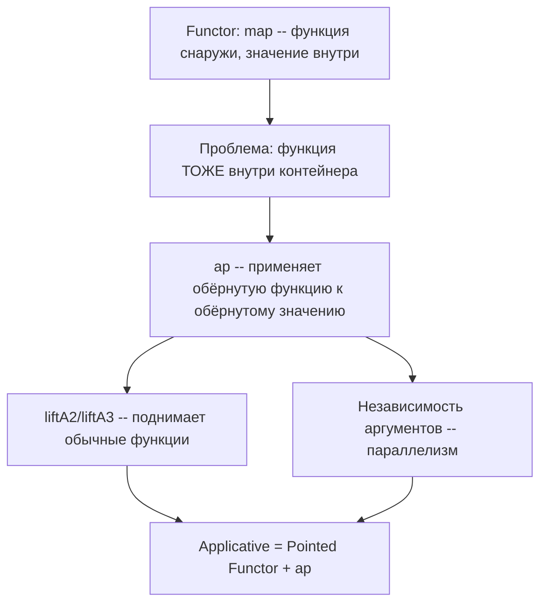
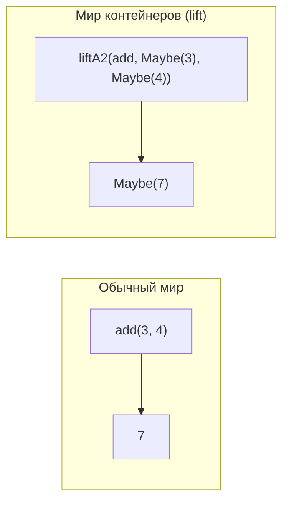
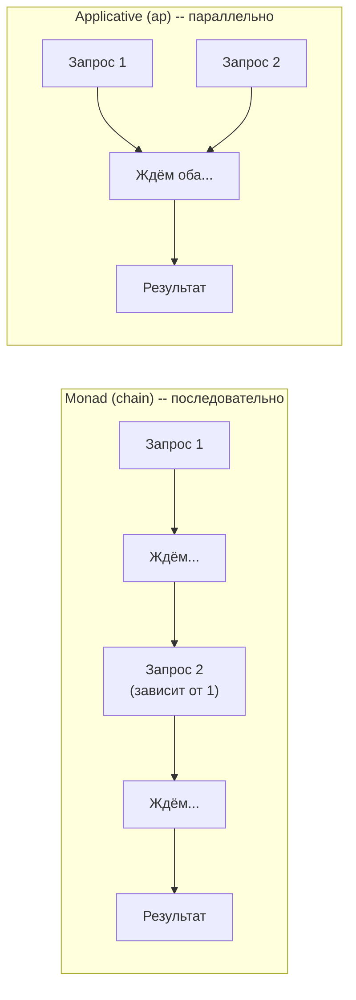
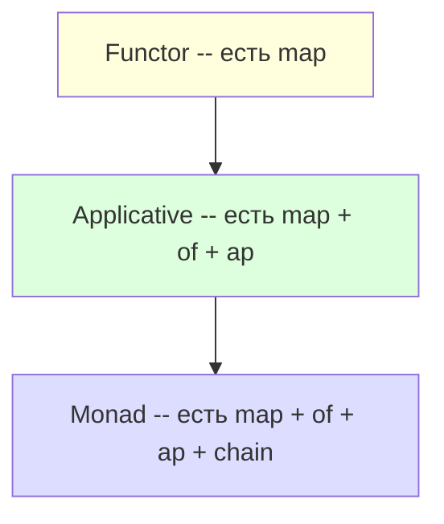

# Chapter: Аппликативные функторы

> [!info] Context
> Аппликативные функторы решают проблему, с которой не справляется `map`: как применить **функцию внутри контейнера** к **значению внутри другого контейнера**? Метод `ap` позволяет комбинировать несколько независимых контейнеров, а `liftA2`/`liftA3` поднимают обычные функции в мир контейнеров. Главная суперсила аппликативов -- **независимость аргументов**, в отличие от монад, где каждый шаг зависит от предыдущего.
>
> **Пререквизиты:** [[ch08-functors-and-containers/functors-and-containers]], [[ch09-monads/monads]], [[partial-application/readme]]

## Overview

В [[ch08-functors-and-containers/functors-and-containers|главе о функторах]] мы научились применять обычную функцию к значению внутри контейнера через `map`. В [[ch09-monads/monads|главе о монадах]] -- строить цепочки из функций, возвращающих контейнеры, через `chain`. Но оба инструмента требуют, чтобы функция была **снаружи** контейнера.

А что если функция тоже оказалась **внутри** контейнера? Это случается чаще, чем кажется -- и именно здесь вступает в дело `ap`.

Структура главы:

1. **Мотивация** -- где заканчивается `map`
2. **Метод `ap`** -- механика работы
3. **`ap` для Maybe и Either** -- практические сценарии
4. **`liftA2` и `liftA3`** -- поднимаем функции в мир контейнеров
5. **Главная суперсила** -- конкуренция vs последовательность
6. **Functor vs Applicative vs Monad** -- сводная таблица
7. **Законы Applicative** -- формальные гарантии
8. **TypeScript** -- полная типизация



---

## 1. Мотивация -- где заканчивается map

Допустим, у нас есть два значения, каждое внутри Maybe:

```javascript
const a = Maybe.of(3);
const b = Maybe.of(4);
```

Мы хотим их сложить. Есть каррированная функция сложения:

```javascript
const add = a => b => a + b;
```

Попробуем использовать `map`:

```javascript
Maybe.of(3).map(add);
// Maybe(b => 3 + b) -- функция ВНУТРИ контейнера!
```

`map(add)` применил `add` к числу 3. Но `add` каррированная -- она приняла первый аргумент и вернула новую функцию `b => 3 + b`. И эта функция теперь **внутри Maybe**.

Теперь у нас `Maybe(b => 3 + b)` и `Maybe(4)`. Как их соединить?

```javascript
// map не поможет -- он ожидает ОБЫЧНУЮ функцию снаружи
Maybe.of(3).map(add).map(/* ??? */)(Maybe.of(4));
// Бессмысленно -- map принимает функцию, а не контейнер
```

Мы застряли. `map` умеет применять **обычную функцию** к значению внутри контейнера, но не умеет применять **обёрнутую функцию** к обёрнутому значению.

> [!warning] Суть проблемы
> `map` работает с сигнатурой `(a -> b) -> F(a) -> F(b)` -- функция снаружи, значение внутри.
> Нам нужно: `F(a -> b) -> F(a) -> F(b)` -- и функция, и значение внутри контейнеров.

**Итог:** когда каррированная функция применяется через `map` частично, результат -- функция внутри контейнера. `map` не может применить такую обёрнутую функцию к другому контейнеру. Для этого нужен новый метод -- `ap`.

---

## 2. Метод `ap` -- механика

### Реализация для Container

`ap` берёт контейнер с функцией внутри и применяет эту функцию к значению внутри другого контейнера:

```javascript
Container.prototype.ap = function(otherContainer) {
  return otherContainer.map(this._value);
};
```

Логика предельно простая: внутри `this` лежит функция (`this._value`). Мы берём другой контейнер и делаем `map` с этой функцией. `map` умеет применять обычную функцию к значению внутри контейнера -- а `this._value` и есть обычная функция.

На TypeScript:

```typescript
class Container<A> {
  private _value: A;

  constructor(value: A) {
    this._value = value;
  }

  static of<T>(value: T): Container<T> {
    return new Container(value);
  }

  map<B>(fn: (a: A) => B): Container<B> {
    return Container.of(fn(this._value));
  }

  // this содержит функцию (a -> b), otherContainer содержит значение (a)
  ap<B>(this: Container<(a: A) => B>, otherContainer: Container<A>): Container<B> {
    return otherContainer.map(this._value);
  }
}
```

### Пошаговый разбор

Проследим выполнение по шагам:

```javascript
Container.of(add).ap(Container.of(2)).ap(Container.of(3));
```

**Шаг 1:** `Container.of(add)` -- помещаем функцию в контейнер:
```
Container(a => b => a + b)
```

**Шаг 2:** `.ap(Container.of(2))` -- вызываем `Container.of(2).map(add)`:
```
Container.of(2).map(a => b => a + b)
→ Container(b => 2 + b)    // add получил первый аргумент
```

**Шаг 3:** `.ap(Container.of(3))` -- вызываем `Container.of(3).map(b => 2 + b)`:
```
Container.of(3).map(b => 2 + b)
→ Container(5)              // готовый результат
```


Обрати внимание на паттерн: `F.of(fn).ap(x).ap(y).ap(z)` -- это аппликативный стиль. Каррированная функция последовательно получает аргументы из контейнеров.

> [!tip] Интуиция
> `ap` -- это как вызов функции, но в мире контейнеров:
> - Обычный вызов: `add(2)(3)` -- результат `5`
> - Аппликативный: `Container.of(add).ap(Container.of(2)).ap(Container.of(3))` -- результат `Container(5)`
>
> Та же семантика, только всё обёрнуто.

**Итог:** `ap` извлекает функцию из `this` и применяет её через `map` к другому контейнеру. Это позволяет строить цепочки `F.of(fn).ap(x).ap(y)`, где каррированная функция последовательно получает аргументы из контейнеров.

---

## 3. `ap` для Maybe и Either

### Maybe.ap

Maybe добавляет одну проверку: если внутри `this` нет функции (isNothing), цепочка прерывается:

```javascript
Maybe.prototype.ap = function(otherMaybe) {
  return this.isNothing ? this : otherMaybe.map(this._value);
};
```

На TypeScript:

```typescript
class Maybe<A> {
  private _value: A | null | undefined;

  constructor(value: A | null | undefined) {
    this._value = value;
  }

  static of<T>(value: T | null | undefined): Maybe<T> {
    return new Maybe(value);
  }

  get isNothing(): boolean {
    return this._value === null || this._value === undefined;
  }

  map<B>(fn: (a: A) => B): Maybe<B> {
    return this.isNothing ? Maybe.of(null) as Maybe<B> : Maybe.of(fn(this._value!));
  }

  ap<B>(this: Maybe<(a: A) => B>, otherMaybe: Maybe<A>): Maybe<B> {
    return this.isNothing ? Maybe.of(null) as Maybe<B> : otherMaybe.map(this._value!);
  }

  getOrElse(defaultValue: A): A {
    return this.isNothing ? defaultValue : this._value!;
  }
}
```

Примеры:

```javascript
const add = a => b => a + b;

// Оба значения есть -- всё работает
Maybe.of(add).ap(Maybe.of(2)).ap(Maybe.of(3));
// Maybe(5)

// Второй аргумент null -- цепочка прерывается
Maybe.of(add).ap(Maybe.of(null)).ap(Maybe.of(3));
// Maybe(null)
// Разбор: Maybe.of(null).map(add) → Maybe(null), потом Maybe(null).ap(Maybe.of(3)) → Maybe(null)

// Функция null -- цепочка прерывается сразу
Maybe.of(null).ap(Maybe.of(2)).ap(Maybe.of(3));
// Maybe(null)
```

### Практический пример: комбинирование двух Maybe

```javascript
const fullName = first => last => `${first} ${last}`;

Maybe.of(fullName)
  .ap(Maybe.of('Иван'))
  .ap(Maybe.of('Иванов'))
  .getOrElse('Аноним');
// 'Иван Иванов'

Maybe.of(fullName)
  .ap(Maybe.of('Иван'))
  .ap(Maybe.of(null))
  .getOrElse('Аноним');
// 'Аноним'

Maybe.of(fullName)
  .ap(Maybe.of(null))
  .ap(Maybe.of('Иванов'))
  .getOrElse('Аноним');
// 'Аноним'
```

Если хотя бы одно из значений отсутствует -- результат `Maybe(null)`, и `getOrElse` вернёт значение по умолчанию. Никаких `if`-проверок.

### Either.ap

Для Either логика аналогична: Right применяет функцию, Left прерывает цепочку:

```javascript
Right.prototype.ap = function(otherEither) {
  return otherEither.map(this._value);
};

Left.prototype.ap = function(_otherEither) {
  return this; // Ошибка проскальзывает
};
```

На TypeScript:

```typescript
class Right<A> {
  private _value: A;

  constructor(value: A) {
    this._value = value;
  }

  static of<T>(value: T): Right<T> {
    return new Right(value);
  }

  map<B>(fn: (a: A) => B): Right<B> {
    return Right.of(fn(this._value));
  }

  ap<B>(this: Right<(a: A) => B>, otherEither: Right<A> | Left<A>): Right<B> | Left<A> {
    return otherEither.map(this._value);
  }
}

class Left<A> {
  private _value: A;

  constructor(value: A) {
    this._value = value;
  }

  map<B>(_fn: (a: A) => B): Left<A> {
    return this;
  }

  ap<B>(_otherEither: any): Left<A> {
    return this;
  }
}
```

Пример с валидацией:

```javascript
const createOrder = customer => product => amount =>
  `Заказ: ${customer} — ${product} x${amount}`;

Right.of(createOrder)
  .ap(Right.of('Иван'))
  .ap(Right.of('Клавиатура'))
  .ap(Right.of(2))
  .getOrElse('Ошибка заказа');
// 'Заказ: Иван — Клавиатура x2'

Right.of(createOrder)
  .ap(Left.of('Клиент не найден'))
  .ap(Right.of('Клавиатура'))
  .ap(Right.of(2))
  .getOrElse('Ошибка заказа');
// 'Ошибка заказа'
```

**Итог:** `ap` для Maybe и Either добавляет short-circuit: если контейнер "пуст" (Maybe(null)) или содержит ошибку (Left), цепочка прерывается. Это позволяет безопасно комбинировать несколько контейнеров без ручных проверок.

---

## 4. `liftA2` и `liftA3` -- поднимаем функции

### Паттерн, который повторяется

Посмотрим на два способа записать одно и то же:

```javascript
// Способ 1: of + ap + ap
Maybe.of(add).ap(Maybe.of(3)).ap(Maybe.of(4));

// Способ 2: map + ap
Maybe.of(3).map(add).ap(Maybe.of(4));
```

Оба дают `Maybe(7)`. Второй способ интересен: первый `map` помещает частично применённую функцию в контейнер, а `ap` "докармливает" её вторым аргументом.

Этот паттерн -- `f1.map(fn).ap(f2)` -- настолько частый, что его стоит обернуть в функцию:

```javascript
const liftA2 = (fn, f1, f2) => f1.map(fn).ap(f2);
const liftA3 = (fn, f1, f2, f3) => f1.map(fn).ap(f2).ap(f3);
```

На TypeScript:

```typescript
function liftA2<A, B, C>(
  fn: (a: A) => (b: B) => C,
  f1: Maybe<A>,
  f2: Maybe<B>
): Maybe<C> {
  return f1.map(fn).ap(f2);
}

function liftA3<A, B, C, D>(
  fn: (a: A) => (b: B) => (c: C) => D,
  f1: Maybe<A>,
  f2: Maybe<B>,
  f3: Maybe<C>
): Maybe<D> {
  return f1.map(fn).ap(f2).ap(f3);
}
```

### Использование

```javascript
const add = a => b => a + b;
const multiply = a => b => a * b;

liftA2(add, Maybe.of(3), Maybe.of(4));       // Maybe(7)
liftA2(add, Maybe.of(null), Maybe.of(4));     // Maybe(null)
liftA2(multiply, Maybe.of(5), Maybe.of(6));   // Maybe(30)

const fullName = first => last => `${first} ${last}`;

liftA2(fullName, Maybe.of('Иван'), Maybe.of('Иванов'));
// Maybe('Иван Иванов')

liftA2(fullName, Maybe.of('Иван'), Maybe.of(null));
// Maybe(null)
```

### Что значит "lift"?

"lift" (поднять) -- значит **поднять обычную функцию в мир контейнеров**. Обычный `add` работает с голыми числами: `add(3)(4) === 7`. После "поднятия" через `liftA2` он работает с Maybe, Either, IO -- с любым аппликативным функтором.

"A2" -- от "Applicative, 2 аргумента". Соответственно `liftA3` -- для трёх аргументов.



> [!tip] Когда использовать liftA2
> Когда нужно применить обычную функцию к двум (или трём) значениям, каждое из которых внутри контейнера. Это читабельнее, чем цепочка `.of(fn).ap(x).ap(y)`.

**Итог:** `liftA2` и `liftA3` -- утилиты, которые поднимают обычные каррированные функции в мир контейнеров. Вместо `F.of(fn).ap(a).ap(b)` пишем `liftA2(fn, a, b)` -- короче и выразительнее.

---

## 5. Главная суперсила -- конкуренция vs последовательность

Это ключевое отличие аппликативов от монад, и оно имеет практические последствия.

### Монада -- последовательность

В `chain`-цепочке каждый следующий шаг **зависит от результата предыдущего**:

```javascript
// Каждый шаг использует результат предыдущего
fetchUser(id)                           // шаг 1: получить пользователя
  .chain(user => fetchOrders(user.id))  // шаг 2: нужен user.id из шага 1
  .chain(orders => formatPage(orders)); // шаг 3: нужны orders из шага 2
```

Нельзя выполнить шаг 2 до завершения шага 1 -- `user.id` ещё неизвестен. Это **последовательное** выполнение.

### Аппликатив -- независимость

В `ap`-выражении аргументы **не зависят друг от друга**:

```javascript
// Аргументы независимы друг от друга
const renderPage = dest => events => `${dest.length} направлений, ${events.length} событий`;

liftA2(renderPage, fetchDestinations(), fetchEvents());
// fetchDestinations() и fetchEvents() можно запустить ОДНОВРЕМЕННО
```

Ни `fetchDestinations`, ни `fetchEvents` не используют результат другого запроса. Они **независимы** -- значит, их можно запускать параллельно.



### Promise.all -- аппликатив в JavaScript

Ты уже используешь этот паттерн:

```javascript
// МОНАДА -- последовательно (каждый шаг зависит от предыдущего)
fetchUser(id)
  .then(user => fetchOrders(user.id))    // нужен user для запроса
  .then(orders => formatOrders(orders));

// APPLICATIVE -- параллельно (аргументы независимы)
Promise.all([fetchDestinations(), fetchEvents()])
  .then(([dest, events]) => renderPage(dest, events));
// Оба запроса стартуют одновременно!
```

`Promise.all` -- это, по сути, аппликативный паттерн: мы комбинируем **независимые** контейнеры (Promise) в один, а потом применяем функцию к результатам.

### Правило выбора

> [!important] Когда что использовать
> - Аргументы **независимы** друг от друга? Используй **ap** (applicative)
> - Каждый шаг **зависит от результата предыдущего**? Используй **chain** (monad)
>
> Applicative слабее Monad, но именно поэтому даёт больше свободы оптимизации (параллелизм, переупорядочивание).

**Итог:** монады -- последовательные (каждый шаг зависит от предыдущего). Аппликативы -- параллельные (аргументы независимы). Это не просто теория: `Promise.all` vs `.then`-цепочка -- тот же выбор.

---

## 6. Functor vs Applicative vs Monad -- сводная таблица

| | Functor | Applicative | Monad |
|---|---|---|---|
| **Метод** | `map` | `ap` + `of` | `chain` |
| **Функция** | обычная `a -> b` | внутри контейнера `F(a -> b)` | возвращает контейнер `a -> F(b)` |
| **Мощность** | минимальная | средняя | максимальная |
| **Зависимость** | -- | аргументы независимы | каждый шаг зависит от предыдущего |
| **Аналог Promise** | `.then(x => x + 1)` | `Promise.all` | `.then(x => fetch(x))` |



> [!important] Принцип минимальной силы
> Используй самую слабую абстракцию, которая решает задачу:
> - Достаточно `map`? Используй `map` (Functor).
> - Нужно комбинировать **независимые** контейнеры? Используй `ap` (Applicative).
> - Каждый шаг **зависит от предыдущего**? Используй `chain` (Monad).
>
> Чем слабее абстракция, тем больше свободы для оптимизации и тем проще код для понимания.

**Итог:** Functor < Applicative < Monad по мощности. Каждый следующий уровень может делать всё то же, что предыдущий, плюс что-то новое. Но более мощная абстракция означает более строгий порядок выполнения. Выбирай минимально достаточную.

---

## 7. Законы Applicative

> [!info] Четыре закона аппликативных функторов
> Как у функторов (2 закона) и монад (3 закона), у аппликативов есть свои формальные гарантии. Они обеспечивают предсказуемое поведение `ap`.
>
> **1. Identity (Идентичность):**
> ```javascript
> const id = x => x;
>
> // Применение id через ap ничего не меняет
> Maybe.of(id).ap(Maybe.of(42));  // Maybe(42)
> // Эквивалентно:
> Maybe.of(42);                   // Maybe(42)
> ```
> `A.of(id).ap(v)` === `v`
>
> **2. Homomorphism (Гомоморфизм):**
> ```javascript
> const double = x => x * 2;
>
> // Обернуть и применить = применить и обернуть
> Maybe.of(double).ap(Maybe.of(5));  // Maybe(10)
> // Эквивалентно:
> Maybe.of(double(5));               // Maybe(10)
> ```
> `A.of(f).ap(A.of(x))` === `A.of(f(x))`
>
> Если и функция, и значение уже чистые, оборачивание в контейнер не меняет результат.
>
> **3. Interchange (Обмен):**
> `u.ap(A.of(y))` === `A.of(f => f(y)).ap(u)`
>
> Порядок "что обёрнуто, а что нет" не важен для чистых значений.
>
> **4. Composition (Композиция):**
> `A.of(compose).ap(u).ap(v).ap(w)` === `u.ap(v.ap(w))`
>
> Аппликативное применение ассоциативно относительно композиции.
>
> Первые два закона самые важные для практического понимания. Interchange и Composition встречаются реже, но гарантируют, что `ap` можно безопасно рефакторить.

**Итог:** законы аппликативов обеспечивают предсказуемость `ap`. Identity и Homomorphism -- ключевые: обёртка не добавляет скрытого поведения.

---

## 8. TypeScript -- полная типизация

### Полная реализация Maybe с ap

```typescript
class Maybe<A> {
  private _value: A | null | undefined;

  constructor(value: A | null | undefined) {
    this._value = value;
  }

  static of<T>(value: T | null | undefined): Maybe<T> {
    return new Maybe(value);
  }

  get isNothing(): boolean {
    return this._value === null || this._value === undefined;
  }

  map<B>(fn: (a: A) => B): Maybe<B> {
    return this.isNothing
      ? (Maybe.of(null) as unknown as Maybe<B>)
      : Maybe.of(fn(this._value!));
  }

  // Ключевая типизация: this содержит функцию
  ap<B>(this: Maybe<(a: A) => B>, otherMaybe: Maybe<A>): Maybe<B> {
    return this.isNothing
      ? (Maybe.of(null) as unknown as Maybe<B>)
      : otherMaybe.map(this._value!);
  }

  chain<B>(fn: (a: A) => Maybe<B>): Maybe<B> {
    return this.isNothing
      ? (Maybe.of(null) as unknown as Maybe<B>)
      : fn(this._value!);
  }

  getOrElse(defaultValue: A): A {
    return this.isNothing ? defaultValue : this._value!;
  }

  inspect(): string {
    return this.isNothing ? 'Maybe(null)' : `Maybe(${this._value})`;
  }
}

// Типизированный liftA2
function liftA2<A, B, C>(
  fn: (a: A) => (b: B) => C,
  fa: Maybe<A>,
  fb: Maybe<B>
): Maybe<C> {
  return fa.map(fn).ap(fb);
}

// Типизированный liftA3
function liftA3<A, B, C, D>(
  fn: (a: A) => (b: B) => (c: C) => D,
  fa: Maybe<A>,
  fb: Maybe<B>,
  fc: Maybe<C>
): Maybe<D> {
  return fa.map(fn).ap(fb).ap(fc);
}
```

### Использование

```typescript
const add = (a: number) => (b: number): number => a + b;
const fullName = (first: string) => (last: string): string => `${first} ${last}`;

// TypeScript выведет типы автоматически
const result: Maybe<number> = liftA2(add, Maybe.of(3), Maybe.of(4));
// Maybe(7)

const name: Maybe<string> = liftA2(fullName, Maybe.of('Иван'), Maybe.of('Иванов'));
// Maybe('Иван Иванов')
```

### Ограничения TypeScript и путь дальше

> [!warning] HKT -- Higher-Kinded Types
> TypeScript не поддерживает Higher-Kinded Types (типы высшего порядка). Это значит, что нельзя написать **обобщённый** интерфейс `Applicative`, который работал бы и для Maybe, и для Either, и для IO одновременно:
>
> ```typescript
> // Это НЕВОЗМОЖНО в TypeScript:
> interface Applicative<F> {  // F -- это "тип контейнера" (Maybe, Either, ...)
>   of<A>(a: A): F<A>;       // F<A> -- нельзя, TS не понимает
>   ap<A, B>(fa: F<A>): F<B>;
> }
> ```
>
> Библиотека **fp-ts** обходит это ограничение через паттерн "Type Classes as dictionaries". Если тебе нужна полная типобезопасность для FP в TypeScript -- это следующий шаг.

**Итог:** TypeScript позволяет типизировать `ap` и `liftA2` для конкретных контейнеров (Maybe, Either). Но обобщённый интерфейс Applicative требует HKT, которых в TypeScript нет. Для полной типизации есть fp-ts.

---

## Exercises

### Упражнение 1: ap для Container

Реализуй метод `ap` для класса Container. Протестируй его с `add` и `multiply`:

```javascript
class Container {
  constructor(value) {
    this._value = value;
  }

  static of(value) {
    return new Container(value);
  }

  map(fn) {
    return Container.of(fn(this._value));
  }

  // Реализуй ap
  ap(otherContainer) {
    // ???
  }

  inspect() {
    return `Container(${this._value})`;
  }
}

const add = a => b => a + b;
const multiply = a => b => a * b;

// Тесты
console.assert(
  Container.of(add).ap(Container.of(2)).ap(Container.of(3))._value === 5,
  'add через ap: 2 + 3 = 5'
);

console.assert(
  Container.of(multiply).ap(Container.of(4)).ap(Container.of(5))._value === 20,
  'multiply через ap: 4 * 5 = 20'
);

console.assert(
  Container.of(add)
    .ap(Container.of(10))
    .ap(Container.of(20))._value === 30,
  'add через ap: 10 + 20 = 30'
);

console.log('Все тесты ap для Container пройдены');
```

### Упражнение 2: Maybe ap -- безопасное комбинирование

Реализуй `ap` для Maybe и используй его, чтобы безопасно комбинировать `firstName` и `lastName`:

```javascript
// Твоя задача: реализуй ap для Maybe
Maybe.prototype.ap = function(otherMaybe) {
  // ???
};

const fullName = first => last => `${first} ${last}`;

// Тесты
console.assert(
  Maybe.of(fullName)
    .ap(Maybe.of('Иван'))
    .ap(Maybe.of('Петров'))
    .getOrElse('Аноним') === 'Иван Петров',
  'Оба имени есть'
);

console.assert(
  Maybe.of(fullName)
    .ap(Maybe.of(null))
    .ap(Maybe.of('Петров'))
    .getOrElse('Аноним') === 'Аноним',
  'Имя null'
);

console.assert(
  Maybe.of(fullName)
    .ap(Maybe.of('Иван'))
    .ap(Maybe.of(null))
    .getOrElse('Аноним') === 'Аноним',
  'Фамилия null'
);

console.assert(
  Maybe.of(null)
    .ap(Maybe.of('Иван'))
    .ap(Maybe.of('Петров'))
    .getOrElse('Аноним') === 'Аноним',
  'Функция null'
);

console.log('Все тесты Maybe ap пройдены');
```

### Упражнение 3: liftA2 для валидации

Реализуй `liftA2` и используй его для комбинирования двух Either-валидаций:

```javascript
const liftA2 = (fn, f1, f2) => {
  // ???
};

// Валидаторы
const validateName = name =>
  name && name.length >= 2
    ? Right.of(name)
    : Left.of('Имя должно содержать минимум 2 символа');

const validateAge = age =>
  typeof age === 'number' && age >= 18 && age <= 120
    ? Right.of(age)
    : Left.of('Возраст должен быть числом от 18 до 120');

const createProfile = name => age => `${name}, ${age} лет`;

// Тесты
console.assert(
  liftA2(createProfile, validateName('Иван'), validateAge(25))
    .getOrElse('Ошибка') === 'Иван, 25 лет',
  'Оба поля валидны'
);

console.assert(
  liftA2(createProfile, validateName(''), validateAge(25))
    .getOrElse('Ошибка') === 'Ошибка',
  'Имя невалидно'
);

console.assert(
  liftA2(createProfile, validateName('Иван'), validateAge(15))
    .getOrElse('Ошибка') === 'Ошибка',
  'Возраст невалиден'
);

console.log('Все тесты liftA2 пройдены');
```

### Упражнение 4: Applicative vs Monad -- выбор подхода

Для каждого из трёх сценариев ниже определи: нужен ли `ap` (applicative) или `chain` (monad)? Реализуй решение.

```javascript
// Сценарий 1: Получить имя и фамилию из двух Maybe, склеить их.
// Подсказка: зависит ли фамилия от имени?

// Сценарий 2: Получить пользователя по id, затем получить его заказы по user.orderId.
// Подсказка: зависит ли второй запрос от результата первого?

// Сценарий 3: Проверить email и пароль (два независимых поля формы),
// собрать объект credentials.
// Подсказка: зависит ли валидация пароля от результата валидации email?

// Реализуй каждый сценарий и объясни свой выбор в комментарии.
```

---

## Anki Cards

> [!tip] Flashcards

> Q: Какую проблему решает метод `ap` (Applicative Functor)?
> A: `ap` решает проблему применения **функции внутри контейнера** к **значению внутри другого контейнера**. `map` не справляется с этим, потому что ожидает обычную функцию снаружи.

> Q: Как реализован `ap` для Maybe?
> A: `Maybe.prototype.ap = function(otherMaybe) { return this.isNothing ? this : otherMaybe.map(this._value); }`. Если функции нет (isNothing) -- short-circuit. Иначе -- применяем функцию к другому контейнеру через `map`.

> Q: Что произойдёт при вызове `Maybe.of(add).ap(Maybe.of(null)).ap(Maybe.of(3))`?
> A: Результат -- `Maybe(null)`. На втором шаге `Maybe.of(null).map(add)` даст `Maybe(null)`, и дальше цепочка "проскальзывает".

> Q: Что такое `liftA2` и зачем он нужен?
> A: `liftA2(fn, f1, f2) = f1.map(fn).ap(f2)` -- это утилита, которая "поднимает" обычную каррированную функцию двух аргументов в мир контейнеров. Вместо `F.of(fn).ap(a).ap(b)` пишем `liftA2(fn, a, b)`.

> Q: Что означает "lift" в liftA2?
> A: "Lift" (поднять) -- значит поднять обычную функцию из мира голых значений в мир контейнеров. "A2" -- Applicative, 2 аргумента. `liftA3` -- для трёх аргументов.

> Q: В чём ключевое отличие Applicative от Monad?
> A: Applicative (`ap`) -- аргументы **независимы** друг от друга, можно вычислять параллельно. Monad (`chain`) -- каждый шаг **зависит** от результата предыдущего, только последовательно.

> Q: Какой аналог аппликативного паттерна есть у Promise?
> A: `Promise.all([p1, p2]).then(([a, b]) => fn(a, b))` -- аппликативный паттерн. Промисы в массиве независимы и выполняются параллельно. В отличие от `.then(x => fetch(x))`, где каждый шаг зависит от предыдущего (монадический паттерн).

> Q: Что такое "принцип минимальной силы" в контексте Functor/Applicative/Monad?
> A: Используй самую слабую абстракцию, которая решает задачу: `map` если достаточно, `ap` для независимых контейнеров, `chain` только если шаги зависят друг от друга. Слабее = проще + больше возможностей для оптимизации.

> Q: Сформулируй закон Identity для Applicative.
> A: `A.of(id).ap(v) === v`. Применение функции-тождества через `ap` не меняет контейнер.

> Q: Сформулируй закон Homomorphism для Applicative.
> A: `A.of(f).ap(A.of(x)) === A.of(f(x))`. Если и функция, и значение чистые, оборачивание в контейнер не меняет результат.

> Q: Чем отличаются сигнатуры map, ap и chain?
> A: `map`: `(a -> b) -> F(a) -> F(b)` -- функция снаружи. `ap`: `F(a -> b) -> F(a) -> F(b)` -- функция внутри. `chain`: `(a -> F(b)) -> F(a) -> F(b)` -- функция возвращает контейнер.

> Q: Почему TypeScript не может выразить обобщённый интерфейс Applicative?
> A: Потому что TypeScript не поддерживает Higher-Kinded Types (HKT). Нельзя написать `interface Applicative<F> { of<A>(a: A): F<A> }` -- `F<A>` невалидно. Библиотека fp-ts обходит это через паттерн "type classes as dictionaries".

---

## Related Topics

- [[ch08-functors-and-containers/functors-and-containers]] -- функторы, Container, Maybe, Either, IO -- основа для аппликативов
- [[ch09-monads/monads]] -- монады, chain, join -- следующий уровень мощности после аппликативов
- [[pure-functions]] -- чистые функции как основа ФП
- [[function-composition/function-composition]] -- compose/pipe для построения пайплайнов
- [[partial-application/readme]] -- каррирование -- ключевая техника для аппликативного стиля
- [[hindley-milner/hindley-milner]] -- нотация типов Hindley-Milner

---

## Sources

- [Mostly Adequate Guide -- Chapter 10 (RU)](https://github.com/MostlyAdequate/mostly-adequate-guide-ru/blob/master/ch10-ru.md)
- [Mostly Adequate Guide -- Chapter 10 (EN)](https://mostly-adequate.gitbook.io/mostly-adequate-guide/ch10)
- [Functors, Applicatives, and Monads in Pictures](https://www.adit.io/posts/2013-04-17-functors,_applicatives,_and_monads_in_pictures.html)
- [Getting started with fp-ts: Applicative](https://dev.to/gcanti/getting-started-with-fp-ts-applicative-1kb3)
