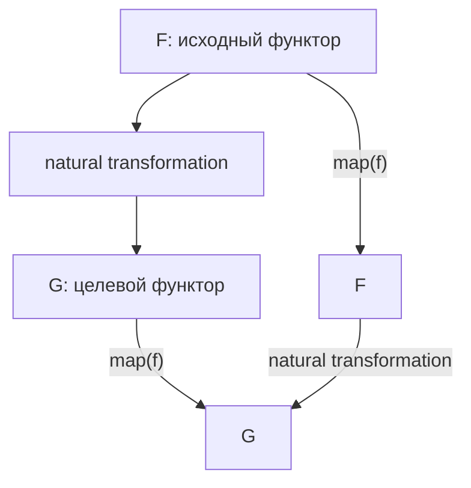
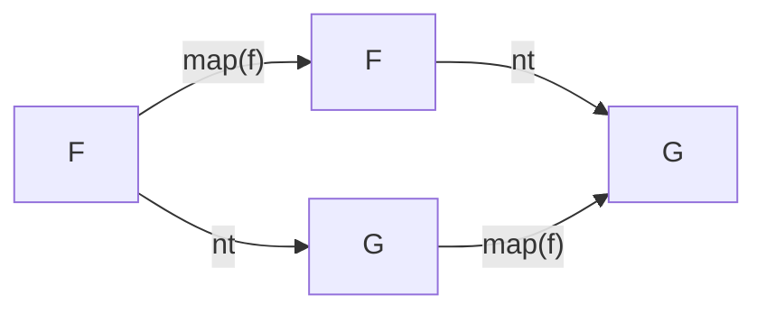

# Chapter: Естественные преобразования

> [!info] Context
> Глава 11 Mostly Adequate Guide вводит natural transformations: функции, которые переводят один функтор в другой, сохраняя возможность безопасно применять `map`. Практическая польза: приводить вложенные контейнеры к одному виду, чтобы уменьшить вложенность и продолжить композицию через `chain`.
>
> **Пререквизиты:** [[ch08-functors-and-containers/functors-and-containers]], [[ch09-monads/monads]], [[ch10-applicative-functors/applicative-functors]], [[17.category-theory]]

## Overview

До этой главы мы работали с разными контейнерами по отдельности: `Maybe`, `Either`, `Task`, `IO`, `Array`. На практике они часто смешиваются:

```text
Task<Error, Maybe<Either<ValidationError, string>>>
```

Сама по себе вложенность не ошибка. Проблема начинается, когда каждый следующий шаг требует всё больше `map(map(map(...)))`, а тип результата становится трудно читать.

Natural transformation помогает ответить на вопрос: "как перевести контейнер `F<A>` в контейнер `G<A>`, не меняя само значение `A`?"

Структура главы:

1. **Проблема вложенных контейнеров** -- почему `map(map(map(...)))` быстро ломает читаемость
2. **Определение natural transformation** -- функция `F<A> -> G<A>`
3. **Закон naturality** -- почему `map` должен сохраняться
4. **Практические преобразования** -- `Maybe -> Task`, `Either -> Task`, `Array -> Maybe`
5. **Гомогенизация эффектов** -- приводим разные контейнеры к одному типу
6. **Изоморфизмы** -- когда преобразование можно обратить без потери информации
7. **TypeScript-ограничения** -- почему HKT не выражаются напрямую
8. **Упражнения и Anki** -- закрепление через TypeScript



**Итог:** глава о том, как менять контейнер вокруг значения, не превращая композицию в ручную распаковку типов.

## Deep Dive

### 1. Проблема вложенных контейнеров

Представь поток сохранения комментария:

```typescript
type Selector = string;
type Comment = { id: string; body: string };
type ValidationError = { message: string };

// getValue :: Selector -> Task<Error, Maybe<string>>
// validate :: string -> Either<ValidationError, string>
// postComment :: string -> Task<Error, Comment>
```

Если просто применять `map`, результат быстро становится вложенным:

```text
Task<Error, Maybe<Either<ValidationError, Task<Error, Comment>>>>
```

Это симптом: мы смешали эффекты "асинхронность", "возможное отсутствие значения" и "валидационная ошибка", но не договорились, к какому контейнеру приводить промежуточные результаты.

Наивная композиция выглядит так:

```typescript
// Псевдокод: тип показывает проблему, а не рекомендуемый стиль.
const saveComment = getValue('#comment')
  .map((maybeText) => maybeText.map(validate))
  .map((maybeEitherText) => maybeEitherText.map((eitherText) => eitherText.map(postComment)));
```

Такой код всё ещё функциональный, но читается тяжело. Каждый слой требует отдельного `map`, а результат всё глубже закапывается в контейнеры.

> [!warning] Главная боль
> `map` сохраняет внешний контейнер. Если внутри появляется другой контейнер, `map` не обязан его выравнивать. Для выравнивания нужен `chain`, но перед `chain` часто приходится привести разные типы к одному общему контейнеру.

**Итог:** natural transformation нужен не вместо `map` и `chain`, а как мост между контейнерами, чтобы потом продолжить плоскую композицию.

### 2. Что такое natural transformation

В программировании natural transformation можно понимать так:

```text
nt :: F<A> -> G<A>
```

Она меняет оболочку `F` на оболочку `G`, но не меняет тип значения `A`.

Примеры:

```text
Maybe<A>  -> Task<E, A>
Either<E, A> -> Task<E, A>
Array<A> -> Maybe<A>
Promise<A> -> Task<E, A>
```

На TypeScript мы не можем написать полностью обобщённый тип `F<A> -> G<A>` без HKT, поэтому чаще пишем конкретные функции:

```typescript
const maybeToArray = <A>(value: Maybe<A>): A[] =>
  value.fold(() => [], (a) => [a]);

const arrayToMaybe = <A>(items: readonly A[]): Maybe<A> =>
  items.length === 0 ? Maybe.nothing<A>() : Maybe.just(items[0]);
```

`maybeToArray` не трогает `A`. Она только говорит: "если значения нет, будет пустой массив; если значение есть, будет массив из одного элемента".

`arrayToMaybe` может потерять информацию, потому что берёт только первый элемент. Это не мешает ей быть natural transformation: закон требует сохранять совместимость с `map`, а не сохранять всю структуру без потерь.

> [!important] Точное различие
> Natural transformation не обязана быть обратимой. Она обязана быть структурной: преобразование контейнера должно согласовываться с `map`.

**Итог:** natural transformation меняет функтор, но оставляет значение параметрически неизвестным: функция не должна зависеть от конкретного типа `A`.

### 3. Закон naturality

Ключевой закон:

```text
nt(fa.map(f)) === nt(fa).map(f)
```

То есть порядок не важен:

1. Сначала применить `map(f)` внутри старого контейнера, потом перевести `F` в `G`
2. Сначала перевести `F` в `G`, потом применить `map(f)` внутри нового контейнера

Обе дороги должны прийти к одному результату.



Для `arrayToMaybe`:

```typescript
const double = (n: number): number => n * 2;
const xs = [10, 20, 30];

const left = arrayToMaybe(xs.map(double));
const right = arrayToMaybe(xs).map(double);

left.inspect() === right.inspect(); // true, Maybe(20)
```

Сначала можно удвоить весь массив и взять первый элемент. Или сначала взять первый элемент и удвоить его внутри `Maybe`. Результат одинаковый.

**Итог:** naturality закон защищает композицию: преобразование контейнера не должно ломать смысл `map`.

### 4. Практические преобразования типов

Ниже минимальные типы, чтобы примеры были понятны без внешних библиотек.

```typescript
type Maybe<A> = {
  map<B>(fn: (value: A) => B): Maybe<B>;
  fold<B>(onNothing: () => B, onJust: (value: A) => B): B;
};

declare const Maybe: {
  just<A>(value: A): Maybe<A>;
  nothing<A>(): Maybe<A>;
};

type Either<E, A> = {
  map<B>(fn: (value: A) => B): Either<E, B>;
  fold<B>(onLeft: (error: E) => B, onRight: (value: A) => B): B;
};

type Task<E, A> = {
  map<B>(fn: (value: A) => B): Task<E, B>;
  chain<E2, B>(fn: (value: A) => Task<E2, B>): Task<E | E2, B>;
};

declare const Task: {
  of<A>(value: A): Task<never, A>;
  rejected<E>(error: E): Task<E, never>;
};
```

#### Maybe -> Task

```typescript
const maybeToTask = <E, A>(onNothing: E) =>
  (value: Maybe<A>): Task<E, A> =>
    value.fold(
      () => Task.rejected(onNothing),
      (a) => Task.of(a)
    );
```

Смысл: отсутствие значения превращаем в ошибочный `Task`, наличие значения превращаем в успешный `Task`.

#### Either -> Task

```typescript
const eitherToTask = <E, A>(value: Either<E, A>): Task<E, A> =>
  value.fold(
    (error) => Task.rejected(error),
    (a) => Task.of(a)
  );
```

Смысл: `Left` становится rejected task, `Right` становится resolved task.

#### Array -> Maybe

```typescript
const arrayToMaybe = <A>(items: readonly A[]): Maybe<A> =>
  items.length === 0 ? Maybe.nothing<A>() : Maybe.just(items[0]);
```

Смысл: недетерминированный контейнер "много значений" приводим к контейнеру "ноль или одно значение".

> [!warning] Потеря информации
> `arrayToMaybe(['a', 'b'])` теряет `'b'`. Это natural transformation, но не изоморфизм.

**Итог:** в прикладном TypeScript natural transformations чаще выглядят как маленькие адаптеры между конкретными контейнерами.

### 5. Гомогенизация эффектов

Вернёмся к сохранению комментария. Нам нужно привести внутренние контейнеры к `Task`, потому что финальное действие асинхронное:

```typescript
type Selector = string;
type Comment = { id: string; body: string };
type ValidationError = { message: string };

declare const getValue: (selector: Selector) => Task<Error, Maybe<string>>;
declare const validate: (text: string) => Either<ValidationError, string>;
declare const postComment: (text: string) => Task<Error | ValidationError, Comment>;
```

С natural transformations цепочка становится плоской:

```typescript
const missingComment = new Error('Comment is empty');

const saveComment = (): Task<Error | ValidationError, Comment> =>
  getValue('#comment')
    .chain(maybeToTask(missingComment))
    .map(validate)
    .chain(eitherToTask)
    .chain(postComment);
```

Идея важнее конкретной реализации `Task`: сначала `Maybe<string>` превращаем в `Task<Error, string>`, затем `Either<ValidationError, string>` превращаем в `Task<ValidationError, string>`, и после этого `chain(postComment)` работает без лишней вложенности.

> [!tip] Практическое правило
> Если финальный процесс асинхронный, часто удобно приводить остальные эффекты к `Task`: отсутствие значения становится failed task, ошибка валидации становится failed task, успешное значение идёт дальше.

**Итог:** natural transformations помогают выбрать общий "эффект-носитель" и не накапливать `Task<Maybe<Either<...>>>`.

### 6. Изоморфизмы

Изоморфизм возникает, когда есть два преобразования:

```text
to :: A -> B
from :: B -> A
```

и при движении туда-обратно данные не теряются:

```text
from(to(a)) === a
to(from(b)) === b
```

Простой пример:

```typescript
const strToList = (value: string): string[] => value.split('');
const listToStr = (chars: readonly string[]): string => chars.join('');

listToStr(strToList('fp')) === 'fp'; // true
```

А `Array<A> -> Maybe<A>` не изоморфизм:

```typescript
const xs = ['elvis costello', 'the attractions'];

const roundTrip = maybeToArray(arrayToMaybe(xs));

roundTrip; // ['elvis costello']
```

Здесь второй элемент потерян, поэтому обратно к исходному массиву мы не вернулись.

> [!important] Изоморфизм сильнее natural transformation
> Natural transformation требует совместимости с `map`. Изоморфизм требует ещё и обратимости без потери информации.

**Итог:** не путай "можно преобразовать" и "можно преобразовать туда-обратно без потерь".

### 7. TypeScript-ограничения

В математической записи удобно писать:

```text
nt :: (Functor F, Functor G) => F<A> -> G<A>
```

В TypeScript напрямую так не выразить:

```typescript
// Так нельзя: F не является type constructor уровня * -> *.
// type NaturalTransformation<F, G> = <A>(fa: F<A>) => G<A>;
```

Причина: TypeScript не поддерживает Higher-Kinded Types на уровне языка. Поэтому есть два практичных пути:

1. Писать конкретные преобразования: `Maybe<A> -> Task<E, A>`, `Either<E, A> -> Task<E, A>`
2. Использовать библиотечные кодировки HKT, например подход fp-ts

Для обучения лучше начинать с конкретных преобразований. Так легче видеть, какой эффект сохраняется, какой теряется и почему `map` остаётся корректным.

**Итог:** TypeScript не мешает использовать идею natural transformations, но заставляет писать их менее обобщённо.

## Exercises

Файл для практики: [[exercises/natural-transformations]]

### Exercise A: `Either<E, A> -> Maybe<A>`

Реализуй:

```typescript
const eitherToMaybe = <E, A>(value: Either<E, A>): Maybe<A> => {
  // TODO
};
```

Ожидаемое поведение:

```text
Right(42) -> Just(42)
Left('error') -> Nothing
```

Проверка понимания: какую информацию мы теряем при таком преобразовании?

### Exercise B: `Either<E, A> -> Task<E, A>`

Используя `eitherToTask`, упрости функцию:

```typescript
// findUserById :: number -> Task<string, Either<string, User>>
// findNameById :: number -> Task<string, string>
```

Подсказка: после `findUserById(id)` у тебя есть `Task<string, Either<string, User>>`. Сначала можно сделать `map` по `Task`, чтобы достать `name` внутри `Either`, а затем `chain(eitherToTask)`.

### Exercise C: изоморфизм `string <-> string[]`

Реализуй:

```typescript
const strToList = (value: string): string[] => {
  // TODO
};

const listToStr = (chars: readonly string[]): string => {
  // TODO
};
```

Проверь:

```text
listToStr(strToList('natural')) === 'natural'
strToList(listToStr(['f', 'p'])) === ['f', 'p']
```

### Exercise D: закон naturality

Проверь для `arrayToMaybe`:

```typescript
arrayToMaybe(xs.map(f)) === arrayToMaybe(xs).map(f)
```

Подсказка: сравни результат через `.inspect()` или `.fold(...)`.

**Итог:** упражнения тренируют не синтаксис, а навык видеть, какой контейнер во что превращается и где теряется информация.

## Anki Cards

> [!tip] Flashcards
> Q: Что такое natural transformation в программировании?
> A: Функция вида `F<A> -> G<A>`, которая меняет функтор-контейнер вокруг значения, но сохраняет совместимость с `map`.

> [!tip] Flashcards
> Q: Какой закон должен выполнять natural transformation?
> A: `nt(fa.map(f)) === nt(fa).map(f)`: неважно, сначала применить `map`, а потом преобразовать контейнер, или наоборот.

> [!tip] Flashcards
> Q: Почему `arrayToMaybe` может быть natural transformation, но не изоморфизмом?
> A: Она совместима с `map`, но может потерять элементы массива, поэтому обратного преобразования без потерь нет.

> [!tip] Flashcards
> Q: Зачем приводить `Maybe` и `Either` к `Task` в асинхронной цепочке?
> A: Чтобы гомогенизировать эффекты: отсутствие значения и ошибки становятся failed task, а успешное значение продолжает плоскую цепочку через `chain`.

> [!tip] Flashcards
> Q: Почему TypeScript не выражает `F<A> -> G<A>` полностью обобщённо?
> A: В языке нет встроенной поддержки Higher-Kinded Types, поэтому generic-параметр `F` нельзя применить как type constructor `F<A>`.

## Anki Export File

Смотри файл [[anki-cards.txt]] рядом с этой главой.

## Related Topics

- [[ch08-functors-and-containers/functors-and-containers]]
- [[ch09-monads/monads]]
- [[ch10-applicative-functors/applicative-functors]]
- [[17.category-theory]]

## Sources

- [Mostly Adequate Guide, глава 11: Опять преобразования, естественно](https://github.com/MostlyAdequate/mostly-adequate-guide-ru/blob/master/ch11-ru.md)
- [Mostly Adequate Guide, original repository](https://github.com/MostlyAdequate/mostly-adequate-guide)
