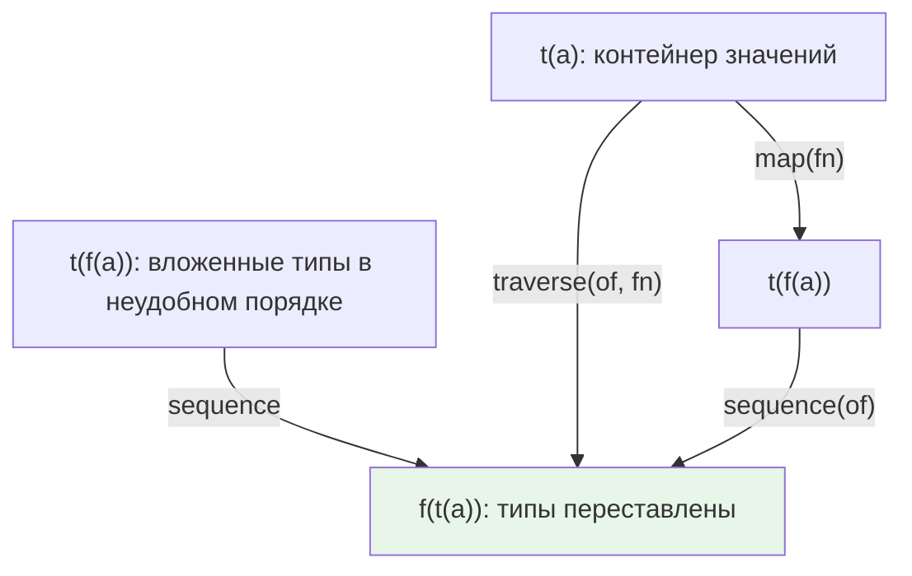

# Chapter: Traversable — проходя сквозь препятствия

> [!info] Context
> Traversable решает конкретную задачу: когда типы вложены в неудобном порядке (`Array<Task<Error, string>>` вместо `Task<Error, Array<string>>`), нужен способ «перевернуть» вложенность. Метод `sequence` меняет порядок двух функторов, а `traverse` совмещает `map` и `sequence` в одном шаге. Это обобщение идеи `Promise.all` на любые контейнеры.
>
> **Пререквизиты:** [[ch08-functors-and-containers/functors-and-containers]], [[ch09-monads/monads]], [[ch10-applicative-functors/applicative-functors]], [[ch11-natural-transformations/natural-transformations]]

## Overview

В предыдущих главах мы научились работать с отдельными контейнерами: `map` для функторов, `chain` для монад, `ap` для аппликативов, natural transformations для смены типа контейнера. Но все эти инструменты работают с одним уровнем вложенности за раз.

Проблема появляется, когда структура данных содержит контейнеры внутри: массив задач, словарь с `Maybe`-значениями, `Either` с `IO` внутри. Нам нужно не просто достать значения, а поменять порядок вложенности: вытащить внешний эффект наружу.

Структура главы:

1. **Проблема: типы застряли друг в друге** — почему `map` и `chain` не помогают
2. **`sequence` — переворачиваем типы** — базовая операция Traversable
3. **Как работает `sequence` изнутри** — реализация для `Either`
4. **Порядок эффектов имеет значение** — `Array<Maybe<A>>` vs `Maybe<Array<A>>`
5. **`traverse` — map + sequence в одном шаге** — основной рабочий инструмент
6. **Практические примеры** — чтение файлов, работа с DOM
7. **Законы Traversable** — Identity, Composition, Naturality



**Итог:** Traversable — интерфейс, который позволяет «пройти» через структуру данных, собирая эффекты наружу. `sequence` переворачивает вложенность, `traverse` делает `map` + `sequence` за один шаг.

> [!important] Контракт Traversable
> Тип `T` является Traversable, если для него реализованы:
> - `traverse(of, fn)` — применить `fn` к каждому элементу и собрать эффекты
> - `sequence(of)` — перевернуть вложенность `T<F<A>>` → `F<T<A>>`
>
> При этом `T` должен быть функтором (иметь `map`), а внутренний тип `F` — аппликативным функтором (иметь `of`, `map`, `ap`).

## Deep Dive

### 1. Проблема: типы застряли друг в друге

Допустим, мы читаем несколько файлов, и каждое чтение возвращает `Task`:

```typescript
declare const readFile: (path: string) => Task<Error, string>;

const files = ['config.json', 'data.json', 'schema.json'];
const results = files.map(readFile);
// results :: Array<Task<Error, string>>
```

Тип `Array<Task<Error, string>>` — массив отдельных задач. Но нам нужен один `Task`, который завершится, когда все файлы прочитаны: `Task<Error, Array<string>>`. Знакомая ситуация — это именно то, что делает `Promise.all`.

Другой пример. У нас есть вложенная структура `IO<Maybe<IO<Node>>>`, которую `chain` не выровняет, потому что `IO` и `Maybe` — разные типы. Нужен способ протолкнуть внутренний `IO` наружу, получив `IO<Maybe<Node>>`.

`map` не поможет — он работает с содержимым контейнера, но не меняет порядок вложенности. `chain` выравнивает, но только когда внешний и внутренний контейнер совпадают (`Task<Task<...>>` → `Task<...>`). Для случая «разные контейнеры в неправильном порядке» нужен отдельный инструмент.

> [!important] Ключевая интуиция
> `sequence` можно понимать как «вывернуть наизнанку» — внутренний эффект становится внешним, а внешняя структура оказывается внутри.

**Итог:** когда типы вложены в неудобном порядке и это разные функторы, `map` и `chain` не справляются. Нужен `sequence`.

### 2. sequence — переворачиваем типы

Сигнатура `sequence` на языке Hindley-Milner:

```text
sequence :: (Traversable t, Applicative f) => (a -> f a) -> t (f a) -> f (t a)
```

Первый аргумент — функция `of` (конструктор аппликатива). В типизированных языках его можно было бы вывести из типа, но здесь он передаётся явно как подсказка: «какой именно аппликатив мы вытаскиваем наружу».

Несколько примеров, чтобы увидеть паттерн:

```typescript
// Array<Maybe<A>> -> Maybe<Array<A>>
sequence(Maybe.of, [Maybe.of('the'), Maybe.of('facts')]);
// => Maybe.of(['the', 'facts'])  — Just(['the', 'facts'])

// Array<Maybe<A>> -> Maybe<Array<A>> (с Nothing внутри)
sequence(Maybe.of, [Maybe.of('the'), Maybe.nothing()]);
// => Maybe.nothing()  — одно отсутствие убивает весь массив

// Map<string, Task<E, A>> -> Task<E, Map<string, A>>
sequence(Task.of, new Map([['a', Task.of(1)], ['b', Task.of(2)]]));
// => Task.of(Map([['a', 1], ['b', 2]]))

// Either<E, IO<A>> -> IO<Either<E, A>>
sequence(IO.of, Either.of(IO.of('buckle my shoe')));
// => IO(() => Right('buckle my shoe'))
```

Обрати внимание на паттерн: тип аргумента `t(f(a))`, тип результата `f(t(a))`. Внешний и внутренний контейнеры меняются местами.

> [!tip] Аналогия с Promise.all
> `Promise.all` делает ровно одну конкретную версию `sequence`: `Array<Promise<A>> → Promise<Array<A>>`. Traversable обобщает эту идею на любые комбинации контейнеров.

**Итог:** `sequence` берёт структуру, полную эффектов, и выворачивает её — эффект оказывается снаружи, структура внутри. Первый аргумент `of` нужен как конструктор целевого аппликатива.

### 3. Как работает sequence изнутри

Рассмотрим реализацию для `Either`. Это два отдельных случая — `Right` и `Left`, и они принципиально разные.

```typescript
class Right<E, A> {
  constructor(private readonly $value: A) {}

  map<B>(fn: (a: A) => B): Either<E, B> {
    return new Right(fn(this.$value));
  }

  // sequence предполагает, что A — это функтор с методом map
  sequence<F>(of: <T>(x: T) => Functor<T>): Functor<Either<E, A>> {
    // this.$value — это f(a), то есть внутренний функтор
    // Оборачиваем содержимое внутреннего функтора в Right
    return (this.$value as any).map((x: any) => new Right(x));
  }
}
```

Что здесь происходит: `this.$value` — это внутренний функтор (например, `IO('buckle my shoe')`). Мы делаем `map` по этому внутреннему функтору, оборачивая каждое значение в `Right`. Результат: `IO(Right('buckle my shoe'))`. Контейнеры поменялись местами.

```typescript
class Left<E, A> {
  constructor(private readonly $value: E) {}

  map<B>(_fn: (a: A) => B): Either<E, B> {
    return this as any;
  }

  sequence<F>(of: <T>(x: T) => Functor<T>): Functor<Either<E, A>> {
    // У Left нет внутреннего функтора — this.$value это ошибка
    // Оборачиваем весь Left во внешний контейнер через of
    return of(this);
  }
}
```

Для `Left` ситуация другая. Внутри `Left` лежит ошибка, а не функтор. Внутреннего контейнера нет, но результат всё равно должен быть обёрнут во внешний тип. Поэтому нужен `of` — конструктор внешнего аппликатива. `of(this)` создаёт, например, `IO(Left('error'))`.

> [!warning] Зачем нужен параметр of
> Для `Right` мы получаем внешний контейнер «бесплатно» — он уже лежит внутри `$value`. Для `Left` внутреннего контейнера нет, и без `of` мы не знаем, какой тип обёртки создать. Это единственная причина, почему `sequence` принимает `of` как аргумент.

Проследим выполнение на конкретном примере:

```typescript
// Вход: Right(IO(() => 'hello'))
const input = new Right(IO.of('hello'));

// sequence вызывает: this.$value.map(x => new Right(x))
// IO(() => 'hello').map(x => new Right(x))
// = IO(() => new Right('hello'))
// = IO(Right('hello'))

const result = input.sequence(IO.of);
// result :: IO<Either<never, string>>
```

```typescript
// Вход: Left('oops')
const input = new Left('oops');

// sequence вызывает: of(this) = IO.of(Left('oops'))
// = IO(() => Left('oops'))
// = IO(Left('oops'))

const result = input.sequence(IO.of);
// result :: IO<Either<string, never>>
```

В обоих случаях результат — `IO<Either<...>>`. Контейнеры поменялись местами.

**Итог:** `Right.sequence` использует `map` внутреннего функтора, чтобы обернуть значение в `Right`. `Left.sequence` использует `of`, чтобы поднять `Left` во внешний контейнер. Именно из-за `Left` (и аналогичных «пустых» случаев) `of` передаётся как параметр.

### 4. Порядок эффектов имеет значение

Переворачивание типов — не просто техническая операция. Оно меняет семантику программы.

```typescript
// Тип 1: массив, где каждый элемент может отсутствовать
type Tolerant = Array<Maybe<string>>;
// [Just('a'), Nothing, Just('c')]
// Можно обработать каждый элемент отдельно

// Тип 2: возможно отсутствующий массив
type Strict = Maybe<Array<string>>;
// Just(['a', 'c']) или Nothing
// Либо всё есть, либо ничего нет
```

`sequence` превращает первый тип во второй:

```typescript
sequence(Maybe.of, [Maybe.of('a'), Maybe.nothing(), Maybe.of('c')]);
// => Nothing — одно отсутствие убило весь массив

sequence(Maybe.of, [Maybe.of('a'), Maybe.of('b'), Maybe.of('c')]);
// => Just(['a', 'b', 'c']) — все на месте
```

Это различие определяет два разных подхода к обработке ошибок:

```typescript
// partition: сохраняем отдельные результаты
const partition = (xs: string[]): Array<Either<Error, number>> =>
  xs.map(parseFloat);
// [Right(1), Left(NaN), Right(3)]

// validate: всё или ничего
const validate = (xs: string[]): Either<Error, number[]> =>
  sequence(Either.of, xs.map(parseFloat));
// Left(NaN) — если хотя бы одна ошибка
```

> [!tip] Практическое правило
> Если тебе нужно «всё или ничего» (валидация формы, загрузка набора файлов) — `sequence` переводит массив результатов в один результат-массив. Если нужно обработать каждый элемент отдельно — не переворачивай.

**Итог:** `Array<F<A>>` → `F<Array<A>>` через `sequence` меняет семантику с «каждый по отдельности» на «все вместе или никто». Выбор порядка типов — это выбор стратегии обработки ошибок.

### 5. traverse — map + sequence в одном шаге

На практике `sequence` почти всегда идёт после `map`:

```typescript
// Шаг 1: применяем функцию к каждому элементу
const tasks = files.map(readFile);
// Array<Task<Error, string>>

// Шаг 2: переворачиваем
const result = sequence(Task.of, tasks);
// Task<Error, Array<string>>
```

`traverse` объединяет оба шага:

```typescript
// Эквивалент двух шагов выше
const result = traverse(Task.of, readFile, files);
// Task<Error, Array<string>>
```

Сигнатура:

```text
traverse :: (Traversable t, Applicative f) => (a -> f a) -> (a -> f b) -> t a -> f (t b)
```

Три аргумента: конструктор `of`, функция преобразования, и traversable-структура.

#### Реализация для List

Это ключевой момент главы. Реализация `traverse` для списка использует `reduce`, `map` и `ap`:

```typescript
class List<A> {
  constructor(private readonly $value: A[]) {}

  traverse<F, B>(
    of: (x: List<B>) => Applicative<List<B>>,
    fn: (a: A) => Applicative<B>
  ): Applicative<List<B>> {
    return this.$value.reduce(
      (acc, a) =>
        fn(a)
          .map((b: B) => (bs: B[]) => bs.concat(b))
          .ap(acc),
      of(new List<B>([]))
    );
  }
}
```

Разберём по шагам на примере `traverse(Task.of, readFile, ['a.txt', 'b.txt'])`:

**Начальное значение аккумулятора:**
```typescript
of(new List([])) // => Task.of(List([]))
// Тип: Task<never, List<string>>
```

**Итерация 1** (a = `'a.txt'`):
```typescript
fn('a.txt')                          // Task<Error, string> — содержит 'aaa'
  .map((b) => (bs) => bs.concat(b))  // Task<Error, (bs: string[]) => string[]>
                                     // внутри: fn = bs => bs.concat('aaa')
  .ap(acc)                           // ap применяет обёрнутую функцию к обёрнутому значению
                                     // Task<Error, List<string>>
                                     // внутри: List(['aaa'])
```

**Итерация 2** (a = `'b.txt'`):
```typescript
fn('b.txt')                          // Task<Error, string> — содержит 'bbb'
  .map((b) => (bs) => bs.concat(b))  // Task<Error, (bs: string[]) => string[]>
  .ap(acc)                           // Task<Error, List<string>>
                                     // внутри: List(['aaa', 'bbb'])
```

Ключевая идея: `map` превращает значение в функцию-конкатенацию, а `ap` применяет эту функцию к накопленному результату внутри аппликатива. Аппликатив обеспечивает комбинирование эффектов (все задачи должны завершиться).

> [!important] Почему ap, а не chain
> `ap` комбинирует независимые эффекты: все задачи запускаются параллельно (концептуально). `chain` требует последовательности. Для `traverse` важна именно независимость — мы обходим структуру, собирая эффекты, а не строим цепочку зависимостей.

**Итог:** `traverse` = `map` + `sequence`, но в одном проходе. Реализация для списка использует `reduce` с `ap` для накопления результатов внутри аппликатива.

### 6. Практические примеры

#### Чтение нескольких файлов (аналог Promise.all)

```typescript
declare const readFile: (path: string) => Task<Error, string>;
declare const firstWords: (text: string) => string;

// traverse применяет readFile к каждому пути и собирает результаты в один Task
const readFirstWords = traverse(
  Task.of,
  (path: string) => readFile(path).map(firstWords),
  ['file1.txt', 'file2.txt']
);
// readFirstWords :: Task<Error, Array<string>>

// При fork:
// Task(['hail the monarchy', 'smash the patriarchy'])
```

Без `traverse` пришлось бы вручную координировать задачи. `traverse` делает это декларативно: «примени функцию к каждому элементу, собери все эффекты в один».

#### Выравнивание вложенных IO через chain + traverse

Бывает ситуация, когда `getAttribute` возвращает `IO`, а значение атрибута нужно подставить в другую `IO`-операцию:

```typescript
declare const $: (selector: string) => IO<Element>;
declare const getAttribute: (attr: string) => (el: Element) => Maybe<string>;

// Без traverse — нарастающая вложенность:
// $('sel')                                → IO<Element>
// .map(getAttribute('aria-controls'))     → IO<Maybe<string>>
// .map(map($))                            → IO<Maybe<IO<Element>>>  — вложенный IO!
// .map(map(map(getAttribute('href'))))    → IO<Maybe<IO<Maybe<string>>>>

// С traverse: протаскиваем внутренний IO наружу
// $('sel')                                → IO<Element>
// .map(getAttribute('aria-controls'))     → IO<Maybe<string>>
// .chain(traverse(IO.of, $))              → IO<Maybe<Element>>
//   traverse работает с Maybe<string>:
//     Nothing  → IO.of(Nothing)
//     Just(s)  → $(s).map(Just)  → IO<Maybe<Element>>
//   chain выравнивает IO<IO<...>> → IO<...>
// .map(map(getAttribute('href')))         → IO<Maybe<Maybe<string>>>

const getControlNode = compose(
  chain(traverse(IO.of, $)),
  map(getAttribute('aria-controls')),
  $
);
```

`traverse(IO.of, getAttribute('href'))` работает с `Maybe<Element>` — для `Just(element)` вызывает `getAttribute('href')(element)` и получает `IO<string>`, затем переворачивает `Maybe<IO<string>>` в `IO<Maybe<string>>`. Для `Nothing` возвращает `IO.of(Nothing)`.

Внешний `chain` выравнивает `IO<IO<Maybe<string>>>` в `IO<Maybe<string>>`.

> [!tip] Когда использовать traverse
> Если после `map` ты получаешь тип вида `F<G<H<...>>>`, где `G` и `H` хочется поменять местами — это сигнал для `traverse`. Особенно когда `F` — коллекция (Array, List, Map), а `G` — эффект (Task, IO, Maybe, Either).

**Итог:** `traverse` — рабочая лошадка для сбора эффектов из коллекций. Аналог `Promise.all`, но для любых аппликативов.

### 7. Законы Traversable

Traversable подчиняется трём законам. Они гарантируют, что `sequence` и `traverse` ведут себя предсказуемо.

#### Identity

```text
compose(sequence(Identity.of), map(Identity.of)) ≡ Identity.of
```

Если обернуть каждый элемент в `Identity` (контейнер, который ничего не делает) и затем сделать `sequence`, результат тот же, что и просто обернуть всю структуру в `Identity`.

`Identity` — тривиальный функтор: `Identity<A>` просто хранит `A` без какого-либо эффекта. Закон говорит: «если эффект пустой, `sequence` не меняет структуру».

```typescript
class Identity<A> {
  constructor(readonly value: A) {}
  map<B>(fn: (a: A) => B): Identity<B> { return new Identity(fn(this.value)); }
  static of<A>(x: A): Identity<A> { return new Identity(x); }
}

// Для массива [1, 2, 3]:
const lhs = sequence(Identity.of, [1, 2, 3].map(Identity.of));
// Identity([1, 2, 3])

const rhs = Identity.of([1, 2, 3]);
// Identity([1, 2, 3])

// lhs ≡ rhs
```

#### Composition

```text
compose(sequence(Compose.of), map(Compose.of))
  ≡ compose(Compose.of, map(sequence(G.of)), sequence(F.of))
```

Этот закон говорит: если внутри структуры лежат два вложенных эффекта `F<G<A>>`, то `sequence` через композицию `F` и `G` равносильно двум последовательным `sequence` — сначала для `F`, потом для `G`.

`Compose` — обёртка, которая объединяет два функтора в один:

```typescript
class Compose<F, G> {
  constructor(readonly value: F) {} // F содержит G внутри
  static of(x: any) { return new Compose(x); }
}
```

На практике этот закон редко проверяют вручную, но он важен для библиотек: если закон выполняется, можно безопасно оптимизировать вложенные `sequence`.

#### Naturality

```text
compose(nt, sequence(F.of)) ≡ compose(sequence(G.of), map(nt))
```

Для любого natural transformation `nt :: F<A> -> G<A>`:

- Можно сначала сделать `sequence` (получив `F<t(A)>`), а потом применить `nt` (получив `G<t(A)>`)
- Или сначала применить `nt` к каждому элементу внутри структуры (заменив `F` на `G`), а потом сделать `sequence`

Результат одинаковый. Это расширение [[ch11-natural-transformations/natural-transformations|закона naturality]] на traversable-контексты.

```typescript
// Пример:
// nt :: Maybe<A> -> Array<A>
const maybeToArray = <A>(m: Maybe<A>): A[] =>
  m.fold(() => [], (a) => [a]);

// Для структуры типа List<Maybe<number>>:
// maybeToArray(sequence(Maybe.of, list)) ≡ sequence(Array.of, list.map(maybeToArray))
```

> [!tip] Зачем знать законы
> Identity гарантирует, что traverse не искажает данные без причины. Composition позволяет разбивать сложные traverse на простые. Naturality говорит, что порядок «переворачивания» и «преобразования контейнера» не важен. Вместе они обеспечивают предсказуемость рефакторинга.

**Итог:** три закона Traversable — Identity, Composition, Naturality — обеспечивают, что `sequence` и `traverse` ведут себя как математически корректная операция «переворачивания», а не как произвольная перестановка.

## Related Topics

- [[ch08-functors-and-containers/functors-and-containers]] — функторы как основа для map
- [[ch09-monads/monads]] — chain для выравнивания одинаковых контейнеров
- [[ch10-applicative-functors/applicative-functors]] — ap, который используется внутри traverse
- [[ch11-natural-transformations/natural-transformations]] — смена контейнера, закон naturality
- [[17.category-theory]] — теоретико-категорный контекст

## Sources

- [Mostly Adequate Guide, Chapter 12: Traversing the Stone](https://mostly-adequate.gitbook.io/mostly-adequate-guide/ch12)
- [Mostly Adequate Guide — GitHub](https://github.com/MostlyAdequate/mostly-adequate-guide)
- [Fantasy Land Specification — Traversable](https://github.com/fantasyland/fantasy-land#traversable)

---

*Написано моделью: Claude Opus 4.6 (claude-opus-4-6)*
