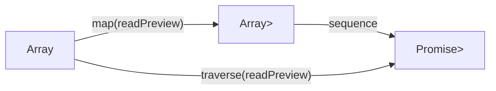

# Chapter: Traversable, sequence и traverse

> [!info] Context
> Глава 12 Mostly Adequate Guide посвящена интерфейсу `Traversable`. Он нужен в тот момент, когда эффекты "запутались" друг в друге: `Array<Promise<A>>`, `Maybe<Task<A>>`, `Task<Maybe<A>>`, `Array<Either<E, A>>`.
>
> `sequence` и `traverse` позволяют переставлять контейнеры местами и тем самым менять смысл программы: "собрать все результаты", "остановиться на первой ошибке", "разрешить пропуски", "получить одно асинхронное значение вместо массива асинхронных значений".
>
> **Пререквизиты:** [[ch08-functors-and-containers/functors-and-containers]], [[ch09-monads/monads]], [[ch10-applicative-functors/applicative-functors]], [[ch11-natural-transformations/natural-transformations]]

## Overview

До этой главы у нас уже были:

1. `Functor`: умеет делать `map`
2. `Applicative`: умеет комбинировать независимые вычисления
3. `Monad`: умеет выравнивать вложенность через `chain`
4. Natural transformation: умеет переводить один контейнер в другой

`Traversable` отвечает на другой вопрос:

> [!important] Главный вопрос главы
> Что делать, если контейнеры стоят "не в том порядке"?

Простой пример:

```typescript
const files = ['intro.md', 'summary.md'];

const readPreview = async (fileName: string): Promise<string> => {
  const content = await fakeReadFile(fileName);
  return content.split(' ').slice(0, 3).join(' ');
};

const broken: Promise<string>[] = files.map(readPreview);
const fixed: Promise<string[]> = Promise.all(files.map(readPreview));
```

`Promise.all()` здесь делает знакомую вещь:

```text
Array<Promise<string>> -> Promise<Array<string>>
```

Именно это и есть идея `sequence`: "перевернуть" контейнеры местами.

А `traverse` делает две операции сразу:

1. сначала `map`
2. потом `sequence`

То есть:

```text
traverse(fn) = map(fn) + sequence
```



**Итог:** `Traversable` нужен не для "ещё одной абстракции", а для очень практичной задачи: упорядочить вложенные эффекты и получить нужную семантику.

## Deep Dive

### 1. Откуда вообще берётся проблема

Проблема появляется, когда ты делаешь `map`, а функция внутри возвращает не обычное значение, а новый контейнер:

```typescript
type User = {
  id: number;
  name: string;
};

declare const findUserById: (id: number) => Promise<User>;

const ids = [1, 2, 3];

const result = ids.map(findUserById);
// Promise<User>[]
```

С формальной точки зрения всё хорошо. С практической нет:

1. у тебя не одно асинхронное вычисление, а массив отдельных вычислений
2. их неудобно ждать вместе
3. следующий код почти всегда хочет получить `Promise<User[]>`, а не `Promise<User>[]`

Точно такая же проблема возникает не только с `Promise`, но и с `Maybe`, `Either`, `Task`, `IO`.

> [!tip] Ментальная модель
> Если после `map` у тебя получилось `Container<OtherContainer<A>>`, почти всегда стоит спросить себя: мне нужно сохранить эту вложенность или переставить контейнеры местами?

**Итог:** `map` честно сохраняет внешний контейнер. Если этого уже недостаточно, нужен либо `chain`, либо `sequence`/`traverse`.

### 2. Что делает `sequence`

Самая короткая интуиция:

```text
sequence переставляет контейнеры местами
```

Общая сигнатура выглядит так:

```text
sequence :: t (f a) -> f (t a)
```

В TypeScript мы обычно пишем не настолько общую сигнатуру, а конкретные версии под нужные контейнеры.

Например, для массива `Maybe`:

```typescript
type Maybe<A> =
  | { tag: 'Nothing' }
  | { tag: 'Just'; value: A };

const sequenceMaybeArray = <A>(items: readonly Maybe<A>[]): Maybe<A[]> => {
  const values: A[] = [];

  for (const item of items) {
    if (item.tag === 'Nothing') {
      return { tag: 'Nothing' };
    }

    values.push(item.value);
  }

  return { tag: 'Just', value: values };
};
```

Поведение:

```typescript
sequenceMaybeArray([
  { tag: 'Just', value: 1 },
  { tag: 'Just', value: 2 },
]);
// Just([1, 2])

sequenceMaybeArray([
  { tag: 'Just', value: 1 },
  { tag: 'Nothing' },
]);
// Nothing
```

Это не просто "перестановка ради красоты". Меняется смысл:

```text
Array<Maybe<A>>  -> "у каждого элемента может не быть значения"
Maybe<Array<A>>  -> "либо вся коллекция есть, либо её нет целиком"
```

> [!important] Важная мысль
> Порядок контейнеров определяет поведение программы. Один и тот же набор типов, переставленный местами, часто означает другой бизнес-смысл.

**Итог:** `sequence` не меняет сами значения. Он меняет организацию эффектов вокруг значений.

### 3. Что делает `traverse`

`traverse` удобнее `sequence`, потому что в реальном коде сначала почти всегда нужно применить функцию.

Общая идея:

```text
traverse(fn) = sequence(map(fn))
```

На практике:

```typescript
type Player = {
  id: number;
  name: string;
};

type Either<E, A> =
  | { tag: 'Left'; error: E }
  | { tag: 'Right'; value: A };

const validatePlayer = (player: Player): Either<string, Player> =>
  player.name.trim().length > 0
    ? { tag: 'Right', value: player }
    : { tag: 'Left', error: `Player ${player.id} must have name` };
```

Если использовать обычный `map`:

```typescript
const broken = players.map(validatePlayer);
// Either<string, Player>[]
```

Если использовать `traverse`, получаем "всё или ничего":

```typescript
const traverseEitherArray = <E, A, B>(
  items: readonly A[],
  fn: (item: A) => Either<E, B>
): Either<E, B[]> => {
  const values: B[] = [];

  for (const item of items) {
    const checked = fn(item);

    if (checked.tag === 'Left') {
      return checked;
    }

    values.push(checked.value);
  }

  return { tag: 'Right', value: values };
};

const validatedPlayers = traverseEitherArray(players, validatePlayer);
// Either<string, Player[]>
```

Теперь поведение другое:

1. `players.map(validatePlayer)` сохраняет результат проверки для каждого элемента отдельно
2. `traverseEitherArray(players, validatePlayer)` говорит: либо все игроки валидны, либо игра не стартует

> [!tip] Самая полезная эвристика
> Если знакомая запись выглядит как `Promise.all(items.map(fn))`, то ты уже мыслишь в терминах `traverse`.

**Итог:** `traverse` нужен, когда функция возвращает эффект, а ты хочешь собрать результаты в один общий эффект.

### 4. Разный порядок типов даёт разный смысл

Это центральная идея всей главы.

#### `Array<Maybe<A>>` против `Maybe<Array<A>>`

```text
Array<Maybe<A>>  -> некоторые элементы могут отсутствовать
Maybe<Array<A>>  -> либо есть весь массив, либо нет ничего
```

Пример:

```typescript
const tolerant: Array<Maybe<number>> = [
  { tag: 'Just', value: 10 },
  { tag: 'Nothing' },
  { tag: 'Just', value: 30 },
];

const strict: Maybe<number[]> = sequenceMaybeArray(tolerant);
// Nothing
```

Исходная структура была "толерантной": отдельные элементы могли отсутствовать.
После `sequence` семантика стала "строгой": одного `Nothing` достаточно, чтобы провалить всю операцию.

#### `Either<Error, Promise<A>>` против `Promise<Either<Error, A>>`

```text
Either<Error, Promise<A>>
```

означает: сначала синхронно решаем, можно ли вообще запускать асинхронную работу.

```text
Promise<Either<Error, A>>
```

означает: асинхронная работа уже идёт, а ошибка может прийти позже как её результат.

Это похоже на разницу между:

1. клиентской валидацией до запроса
2. серверной ошибкой после запроса

> [!warning] Типы здесь несут смысл, а не просто форму
> Если читать типы только как синтаксис, глава кажется "математической". Если читать их как описание поведения, всё становится прикладным.

**Итог:** `Traversable` ценен именно тем, что помогает выбрать нужный смысл, а не просто "сделать код короче".

### 5. Как `traverse` работает без страшной математики

В оригинале книги показана обобщённая реализация через `reduce`, `map` и `ap`. Это важно, но сначала полезно увидеть простую, конкретную версию.

Вот читаемая реализация для массива и `Either`:

```typescript
const traverseEitherArray = <E, A, B>(
  items: readonly A[],
  fn: (item: A) => Either<E, B>
): Either<E, B[]> => {
  const values: B[] = [];

  for (const item of items) {
    const result = fn(item);

    if (result.tag === 'Left') {
      return result;
    }

    values.push(result.value);
  }

  return { tag: 'Right', value: values };
};
```

Алгоритм очень приземлённый:

1. создаём пустой аккумулятор
2. идём по элементам массива
3. применяем функцию `fn`
4. если получили ошибку, останавливаемся
5. если получили успешное значение, добавляем его в накопленный массив
6. в конце возвращаем весь массив внутри `Right`

Теперь сопоставь это с общей идеей:

```text
Array<A> + (A -> Either<E, B>) -> Either<E, Array<B>>
```

Именно этот шаблон затем абстрагируется до более общей версии через `Applicative`.

> [!important] Если термин `Applicative` пока мешает
> Думай о нём как о "контейнере, внутри которого можно аккуратно собирать несколько значений". Для понимания этой главы этого достаточно.

**Итог:** сначала пойми конкретный алгоритм на `Array` и `Either`, а уже потом обобщай его до `Traversable`.

### 6. `sequence` и `traverse` в повседневном TypeScript

В языках вроде Haskell можно писать очень общие сигнатуры. В TypeScript чаще приходится писать специальные версии:

```typescript
const sequenceMaybeArray = <A>(items: readonly Maybe<A>[]): Maybe<A[]> => {
  // ...
};

const traverseEitherArray = <E, A, B>(
  items: readonly A[],
  fn: (item: A) => Either<E, B>
): Either<E, B[]> => {
  // ...
};

const traverseTaskArray = <E, A, B>(
  items: readonly A[],
  fn: (item: A) => Task<E, B>
): Task<E, B[]> => {
  // ...
};
```

Это не "неправильный FP". Это нормальная адаптация идеи под ограничения языка.

Почему нельзя удобно написать совсем общую версию?

```typescript
// Такую запись TypeScript не умеет выражать напрямую.
// type Traverse<F, G> = <A, B>(fa: F<A>, fn: (a: A) => G<B>) => G<F<B>>;
```

Причина та же, что и в прошлой главе: в TypeScript нет встроенных Higher-Kinded Types.

Поэтому практическое правило такое:

1. сначала пойми абстракцию на конкретных контейнерах
2. потом пиши специализированные helper-функции под свой код
3. если нужен общий FP-стиль, используй библиотеку вроде `fp-ts`

**Итог:** в TypeScript полезно думать категориями `Traversable`, но реализовывать их обычно приходится конкретными helper-функциями.

### 7. Законы без математической боли

Слово "закон" в FP означает не "академическую формальность", а проверку того, что абстракции не ведут себя неожиданно после рефакторинга.

#### Закон идентичности

Идея:

```text
Если обернуть каждый элемент в нейтральный контейнер и пройтись traverse, поведение не должно измениться.
```

Практический смысл:

1. `traverse` не должен ломать структуру просто потому, что мы временно добавили обёртку
2. "пустая" обёртка вроде `Identity` не должна менять результат

#### Закон композиции

Идея:

```text
Если два способа комбинировать совместимые обходы эквивалентны, результат тоже должен быть эквивалентен.
```

Практический смысл:

1. можно объединять несколько проходов в один
2. это полезно и для читаемости, и для производительности

#### Закон naturality

Это место обычно звучит страшнее, чем есть на самом деле.

Если отбросить категориальные термины, смысл такой:

> [!important] Простая формулировка naturality
> Если у тебя есть честный способ превратить один контейнер в другой, то не должно быть разницы, делать это до `sequence` или после него.

Например, если у тебя есть преобразование:

```text
Maybe<A> -> Either<E, A>
```

то "сначала перевернуть типы, потом поменять контейнер" и "сначала поменять контейнер, потом перевернуть типы" должны давать одинаковый результат.

Зачем это знать без математического бэкграунда:

1. такие законы делают рефакторинг безопаснее
2. библиотекам можно доверять больше
3. одинаковые интерфейсы действительно начинают заменять друг друга

> [!tip] Как относиться к теории категорий в этой главе
> Не пытайся запомнить терминологию раньше времени. Достаточно понимать, что "natural transformation" здесь означает структурно честное преобразование контейнера, а "laws" означают проверяемые гарантии поведения.

**Итог:** законы нужны не для экзамена по математике, а для предсказуемости кода и уверенного рефакторинга.

### 8. Практические эвристики

Когда в коде всплывают вложенные контейнеры, можно быстро спросить себя:

1. У меня уже есть `F<G<A>>`, и я просто хочу поменять порядок? Тогда думай про `sequence`.
2. У меня есть `F<A>` и функция `A -> G<B>`? Тогда думай про `traverse`.
3. Я работаю с `Promise` и пишу `Promise.all(items.map(fn))`? Это частный случай `traverse`.
4. Мне нужен режим "всё или ничего"? Обычно это `Maybe<Array<A>>` или `Either<E, Array<A>>`.
5. Мне важно сохранить результат по каждому элементу отдельно? Тогда, возможно, переставлять контейнеры вообще не надо.

**Итог:** хорошее понимание `Traversable` начинается не с формул, а с вопроса: какую семантику я хочу получить на выходе?

## Exercises

Файл для практики: [[exercises/traversable]]

### Exercise A: `sequenceMaybeArray`

Реализуй:

```typescript
const sequenceMaybeArray = <A>(items: readonly Maybe<A>[]): Maybe<A[]> => {
  // TODO
};
```

Проверь поведение:

```text
[Just(1), Just(2), Just(3)] -> Just([1, 2, 3])
[Just(1), Nothing, Just(3)] -> Nothing
```

### Exercise B: `traverseEitherArray`

Есть валидатор:

```typescript
const validatePlayer = (player: Player): Either<string, Player> => {
  // ...
};
```

Нужно получить:

```text
Player[] -> Either<string, Player[]>
```

То есть игра стартует только если валидны все игроки.

### Exercise C: `traverseTaskArray`

Реализуй helper:

```typescript
const traverseTaskArray = <E, A, B>(
  items: readonly A[],
  fn: (item: A) => Task<E, B>
): Task<E, B[]> => {
  // TODO
};
```

А затем используй его для `getJsons(routes)`, чтобы превратить:

```text
Route[] -> Task<string, Json[]>
```

### Exercise D: `traverseMaybeTask`

Нужно реализовать:

```typescript
const traverseMaybeTask = <E, A, B>(
  value: Maybe<A>,
  fn: (item: A) => Task<E, B>
): Task<E, Maybe<B>> => {
  // TODO
};
```

Это маленькая версия идеи из главы: у тебя уже есть `Maybe`, а функция возвращает `Task`. Нужно получить один `Task`, внутри которого будет `Maybe`.

### Exercise E: `readFirst`

Используя `readdir`, `safeHead`, `readFile` и `traverseMaybeTask`, собери:

```text
readFirst :: string -> Task<string, Maybe<string>>
```

Поведение:

1. если директория пуста, результат должен быть `Task(Right(Nothing))`
2. если директория есть и в ней есть хотя бы один файл, результат должен быть `Task(Right(Just(content)))`
3. если директории нет, результат должен быть `Task(Left(error))`

**Итог:** упражнения в этой главе тренируют не синтаксис, а умение читать смысл типов и осознанно выбирать порядок контейнеров.

## Anki Cards

> [!tip] Flashcards
> Q: Какую практическую проблему решает `Traversable`?
> A: Он помогает переставлять вложенные контейнеры местами, чтобы получить нужную семантику вроде `Array<Promise<A>> -> Promise<Array<A>>` или `Array<Either<E, A>> -> Either<E, Array<A>>`.

> [!tip] Flashcards
> Q: Что делает `sequence` в одном предложении?
> A: `sequence` переворачивает вложенные контейнеры местами: из `t (f a)` делает `f (t a)`.

> [!tip] Flashcards
> Q: Что делает `traverse`?
> A: Это `map`, за которым сразу следует `sequence`: сначала функция `A -> F<B>`, потом сборка результата в один общий `F`.

> [!tip] Flashcards
> Q: Почему `Promise.all(items.map(fn))` полезно помнить при изучении `traverse`?
> A: Это знакомый частный случай той же идеи: сначала `map`, потом объединение многих эффектов в один.

> [!tip] Flashcards
> Q: В чём разница между `Array<Maybe<A>>` и `Maybe<Array<A>>`?
> A: Первое означает, что некоторые элементы могут отсутствовать, второе означает режим "всё или ничего" для всей коллекции.

> [!tip] Flashcards
> Q: Когда стоит думать о `sequence`, а когда о `traverse`?
> A: `sequence` нужен, когда у тебя уже есть `F<G<A>>`; `traverse` нужен, когда у тебя есть `F<A>` и функция `A -> G<B>`.

> [!tip] Flashcards
> Q: Почему порядок контейнеров меняет поведение программы?
> A: Потому что внешний контейнер определяет, как интерпретируется весь результат целиком: поэлементно, строго, асинхронно, с ошибкой и так далее.

> [!tip] Flashcards
> Q: Как `traverseEitherArray` обычно ведёт себя на первой ошибке?
> A: Останавливает обход и возвращает `Left`, вместо того чтобы собирать успешные значения дальше.

> [!tip] Flashcards
> Q: Почему в TypeScript `Traversable` часто реализуют специализированными helper-функциями?
> A: Потому что язык не поддерживает Higher-Kinded Types напрямую, и полностью обобщённые сигнатуры неудобно выразить.

> [!tip] Flashcards
> Q: Какой практический смысл законов `Traversable`?
> A: Они гарантируют предсказуемость поведения и делают рефакторинг безопаснее, потому что одинаковые абстракции ведут себя согласованно.

## Anki Export File

Смотри файл [[anki-cards.txt]] рядом с этой главой.

## Related Topics

- [[ch08-functors-and-containers/functors-and-containers]]
- [[ch09-monads/monads]]
- [[ch10-applicative-functors/applicative-functors]]
- [[ch11-natural-transformations/natural-transformations]]
- [[17.category-theory]]

## Sources

- [Mostly Adequate Guide, глава 12: Проходя сквозь препятствия](https://github.com/MostlyAdequate/mostly-adequate-guide-ru/blob/master/ch12-ru.md)
- [Mostly Adequate Guide, Chapter 12: Traversing the Stone](https://mostly-adequate.gitbook.io/mostly-adequate-guide/ch12)
