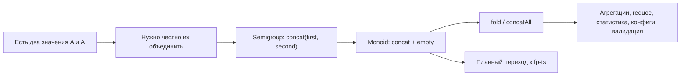

# Chapter: Semigroup и Monoid

> [!info] Context
> Глава 13 Mostly Adequate Guide показывает, что многие прикладные задачи на самом деле сводятся к одному вопросу: **как безопасно и предсказуемо комбинировать значения одного типа**.  
> В TypeScript это особенно полезно для `reduce`, агрегаций, объединения конфигов, статистики, флагов, списков и объектных структур.  
> Для тебя здесь важнее всего не теория категорий, а три практические идеи: `concat`, `empty` и безопасный `fold`.
>
> **Пререквизиты:** [[ch10-applicative-functors/applicative-functors]], [[ch11-natural-transformations/natural-transformations]], [[ch12-traversing-the-stone/traversing-the-stone]], [[pure-functions]]

## Overview

В предыдущих главах мы в основном обсуждали, как **преобразовывать** и **переставлять** контейнеры. Здесь фокус другой: как **объединять** значения.

Это звучит слишком общо, пока не посмотреть на знакомые случаи:

1. числа можно складывать
2. строки можно склеивать
3. массивы можно конкатенировать
4. булевы флаги можно объединять через `||` или `&&`
5. объектную статистику можно собирать поле-за-полем

Из этой главы тебе нужно вынести такую лестницу:

1. `Semigroup` отвечает за правило комбинации
2. `Monoid` добавляет нейтральное стартовое значение
3. `fold` позволяет безопасно свернуть коллекцию в одно значение
4. те же идеи позже почти без изменений перейдут в `fp-ts`



> [!important] Главная мысль главы
> Моноид не про математику ради математики. Это способ заранее договориться, **как именно** комбинируются данные и какое значение считается безопасной отправной точкой.

**Итог:** сначала понимаем комбинацию на конкретных типах, потом замечаем общий интерфейс, и только после этого связываем его с `fp-ts`.

## Deep Dive

### 1. Что вообще значит "комбинировать"

Слово "объединить" само по себе слишком расплывчатое. Для каждого типа нужен свой смысл:

```typescript
const totalPoints = 10 + 15;
const title = 'Monoid' + ' chapter';
const routes = ['/intro'].concat(['/summary']);
const hasAnyError = false || true;
```

Во всех примерах операция разная, но форма одинакова:

```text
A + A -> A
```

То есть:

1. берём два значения одного типа
2. получаем одно значение того же типа
3. можем продолжать комбинировать дальше

На практике это значит, что комбинация становится частью бизнес-логики:

- как суммировать баллы
- как собирать посещённые страницы
- как объединять предупреждения
- как склеивать результаты нескольких шагов

> [!tip] Ментальная модель
> Не спрашивай "что такое Monoid?" слишком рано. Сначала спроси: "если у меня есть два значения этого типа, по какому правилу я их объединяю?"

**Итог:** абстракция начинается не с терминов, а с честного ответа на вопрос "что здесь считается комбинацией?".

### 2. `Semigroup`: есть правило комбинации

Самый полезный TypeScript-вид для первого чтения такой:

```typescript
interface Semigroup<A> {
  concat: (first: A, second: A) => A;
}
```

Это уже ближе к тому, как ты потом увидишь идею в `fp-ts`.

Примеры:

```typescript
const SemigroupSum: Semigroup<number> = {
  concat: (first, second) => first + second,
};

const SemigroupString: Semigroup<string> = {
  concat: (first, second) => first + second,
};

const SemigroupAll: Semigroup<boolean> = {
  concat: (first, second) => first && second,
};

const SemigroupAny: Semigroup<boolean> = {
  concat: (first, second) => first || second,
};

const SemigroupArray = <A>(): Semigroup<readonly A[]> => ({
  concat: (first, second) => [...first, ...second],
});
```

Ключевое свойство `Semigroup`:

```text
concat(x, concat(y, z)) = concat(concat(x, y), z)
```

Это и есть **ассоциативность**. Она говорит не про перестановку мест, а только про то, что можно по-разному ставить скобки.

Пример:

```typescript
SemigroupSum.concat(10, SemigroupSum.concat(20, 30)); // 60
SemigroupSum.concat(SemigroupSum.concat(10, 20), 30); // 60
```

> [!warning] Не путай ассоциативность и коммутативность
> Ассоциативность разрешает менять **группировку**.  
> Коммутативность разрешает менять **порядок**.  
> Для `Semigroup` нам нужна именно ассоциативность.

Почему это важно на практике:

1. можно безопасно делать `reduce`
2. можно разбивать вычисление на части
3. можно агрегировать поток данных кусками

**Итог:** `Semigroup` это "тип + честное ассоциативное правило комбинации".

### 3. `Monoid`: есть правило комбинации и безопасный старт

`Semigroup` отвечает на вопрос "как объединять?".  
`Monoid` добавляет ответ на вопрос "с чего безопасно начать?".

```typescript
interface Monoid<A> extends Semigroup<A> {
  empty: A;
}
```

`empty` должен быть нейтральным элементом:

```text
concat(x, empty) = x
concat(empty, x) = x
```

Примеры:

```typescript
const MonoidSum: Monoid<number> = {
  concat: (first, second) => first + second,
  empty: 0,
};

const MonoidProduct: Monoid<number> = {
  concat: (first, second) => first * second,
  empty: 1,
};

const MonoidString: Monoid<string> = {
  concat: (first, second) => first + second,
  empty: '',
};

const MonoidAll: Monoid<boolean> = {
  concat: (first, second) => first && second,
  empty: true,
};

const MonoidAny: Monoid<boolean> = {
  concat: (first, second) => first || second,
  empty: false,
};

const MonoidArray = <A>(): Monoid<readonly A[]> => ({
  concat: (first, second) => [...first, ...second],
  empty: [],
});
```

Почему `empty` так важен:

1. он даёт разумное значение по умолчанию
2. он спасает `reduce` на пустых массивах
3. он делает агрегацию тотальной функцией, а не "функцией, которая иногда падает"

```typescript
MonoidString.concat('fp', MonoidString.empty); // 'fp'
MonoidArray<number>().concat(MonoidArray<number>().empty, [1, 2]); // [1, 2]
```

> [!important] Практическая формулировка
> `Monoid` = `Semigroup` + "что вернуть, если данных нет".

**Итог:** как только появляется нейтральное стартовое значение, комбинация становится удобной для пустых коллекций и дефолтов.

### 4. Безопасный `fold` вместо хрупкого `reduce`

Обычный `reduce` в JavaScript опасен, если не передать initial value:

```typescript
[1, 2, 3].reduce((acc, value) => acc + value); // 6
[].reduce((acc, value) => acc + value); // TypeError
```

Суть проблемы не в `reduce`, а в том, что движок не знает, какой нейтральный элемент выбрать.

Это как раз и решает `Monoid`:

```typescript
const concatAll = <A>(monoid: Monoid<A>) =>
  (items: readonly A[]): A =>
    items.reduce((acc, item) => monoid.concat(acc, item), monoid.empty);
```

Примеры:

```typescript
const sumAll = concatAll(MonoidSum);
const joinAll = concatAll(MonoidString);
const andAll = concatAll(MonoidAll);

sumAll([1, 2, 3]); // 6
sumAll([]); // 0

joinAll(['fp', '-ts']); // 'fp-ts'
joinAll([]); // ''

andAll([true, true, false]); // false
andAll([]); // true
```

Это и есть тот самый "безопасный `fold`":

```text
fold = reduce с явно переданным empty
```

> [!tip] Связь с оригинальной главой
> В книге идея показывается через `Sum.empty()` и `fold`.  
> В TypeScript полезнее сразу мыслить через `Monoid<A>` и helper вроде `concatAll`, потому что это почти прямой мост к `fp-ts`.

**Итог:** `Monoid` превращает агрегацию из "может упасть" в "всегда возвращает значение нужного типа".

### 5. Product monoid: когда объект целиком тоже умеет комбинироваться

Самая полезная прикладная идея главы: если каждое поле умеет комбинироваться, то часто и весь объект можно комбинировать поле-за-полю.

Пример из учебной предметной области:

```typescript
type StudyStats = {
  solvedTasks: number;
  visitedTopics: readonly string[];
  hadConfusion: boolean;
};

const MonoidStudyStats: Monoid<StudyStats> = {
  empty: {
    solvedTasks: 0,
    visitedTopics: [],
    hadConfusion: false,
  },
  concat: (first, second) => ({
    solvedTasks: first.solvedTasks + second.solvedTasks,
    visitedTopics: [...first.visitedTopics, ...second.visitedTopics],
    hadConfusion: first.hadConfusion || second.hadConfusion,
  }),
};
```

Теперь можно складывать статистику по учебным сессиям:

```typescript
const dayStats = concatAll(MonoidStudyStats)([
  {
    solvedTasks: 3,
    visitedTopics: ['Semigroup'],
    hadConfusion: false,
  },
  {
    solvedTasks: 2,
    visitedTopics: ['Monoid', 'fold'],
    hadConfusion: true,
  },
]);

// {
//   solvedTasks: 5,
//   visitedTopics: ['Semigroup', 'Monoid', 'fold'],
//   hadConfusion: true
// }
```

Эта идея всплывает постоянно:

1. аналитика страницы
2. агрегированное состояние формы
3. feature flags
4. объединённые настройки
5. накопленные предупреждения

> [!important] Почему это мощно
> Ты один раз описываешь правило комбинации для доменной структуры, а потом можешь безопасно сворачивать массив таких структур, комбинировать частичные результаты и строить агрегации без ручного `if` на каждом шаге.

**Итог:** моноиды особенно полезны там, где данные естественно накапливаются по полям.

### 6. Не каждый `Semigroup` можно честно превратить в `Monoid`

Иногда правило комбинации есть, а хорошего `empty` нет.

Классический пример: "возьми первый элемент".

```typescript
const SemigroupFirst = <A>(): Semigroup<A> => ({
  concat: (first, _second) => first,
});

SemigroupFirst<number>().concat(10, 999); // 10
```

Это полезное правило, но что здесь должно быть `empty`?

```text
???
```

Чтобы получить нейтральный элемент, пришлось бы **выдумать** значение типа `A`, а это нечестно.

Именно поэтому полезно различать:

1. `Semigroup` — правило комбинации есть
2. `Monoid` — правило комбинации есть и есть нейтральный старт

> [!warning] Важный инженерный вывод
> Не пытайся насильно сделать `Monoid` там, где для `empty` приходится придумывать фейковое значение. Это обычно сигнал, что нужен либо только `Semigroup`, либо обёртка вроде `Maybe<A>` / `Option<A>`.

**Итог:** отсутствие `empty` не делает структуру плохой. Это просто значит, что перед тобой `Semigroup`, а не `Monoid`.

### 7. Что брать из главы в `fp-ts`, а что пока отложить

Если ты планируешь переходить на `fp-ts`, то из этой главы полезно запомнить именно такой мост:

```typescript
interface Semigroup<A> {
  readonly concat: (x: A, y: A) => A;
}

interface Monoid<A> extends Semigroup<A> {
  readonly empty: A;
}
```

Позже это почти в таком же виде встретится в библиотеке.

Например, идея безопасного сворачивания уже есть готовой:

```typescript
import * as M from 'fp-ts/Monoid';
import * as N from 'fp-ts/number';

const sumAll = M.concatAll(N.MonoidSum);

sumAll([1, 2, 3]); // 6
sumAll([]); // 0
```

А для структур есть фабрики, которые собирают `Monoid` из полей:

```text
Monoid.struct(...)
Semigroup.struct(...)
```

Но прямо сейчас тебе не нужно пытаться держать в голове всё сразу.

> [!tip] План перехода на fp-ts
> Сначала уверенно пойми `concat`, `empty`, `concatAll` и product monoid на обычном TypeScript.  
> Потом смотри, как эти же идеи оформлены в `fp-ts`.  
> Только после этого стоит идти в accumulated validation, `These`, `ReadonlyNonEmptyArray`, `ReaderTaskEither` и прочие более тяжёлые конструкции.

Что можно спокойно отложить на потом:

1. `Endo` как моноид функций
2. "Monad is a monoid in the category of endofunctors"
3. lax monoidal functor
4. категориальные формулировки через morphism и category

Что уже нужно понимать сейчас:

1. почему `empty` спасает `reduce`
2. почему одно и то же значение можно комбинировать разными способами
3. почему структура из моноидальных полей тоже часто становится моноидом
4. почему это напрямую связано с будущим стилем `fp-ts`

**Итог:** для первого прохода по теме тебе нужен не категориальный формализм, а практическая уверенность в `concat` + `empty` + `fold`.

### 8. Минимальный набор, который стоит уметь объяснить своими словами

Если после главы ты можешь без шпаргалки объяснить следующее, значит фундамент уже на месте:

1. `Semigroup` — это способ ассоциативно объединять два значения одного типа
2. `Monoid` — это `Semigroup` плюс нейтральное значение `empty`
3. `fold` безопасно сворачивает массив, потому что начинает с `empty`
4. разные `Monoid` для одного и того же типа дают разный смысл программы

Попробуй сам сформулировать:

- почему у `number` может быть и `Sum`, и `Product`
- почему у `boolean` могут быть и `Any`, и `All`
- почему у "взять первый элемент" нет честного `empty`
- почему `concatAll(MonoidSum)([])` лучше, чем `[].reduce(...)`

> [!important] Comprehension check
> Объясни себе в одном-двух предложениях:  
> "Почему `Monoid` — это не просто способ склеить значения, а способ сделать агрегацию безопасной и предсказуемой?"

**Итог:** если можешь словами восстановить смысл `concat`, `empty` и `fold`, дальше `fp-ts` будет заходить заметно легче.

## Exercises

Файл для практики: [[exercises/monoids]]

Порядок лучше такой:

1. сначала реализуй общий `concatAll`
2. потом задай конкретные `Monoid` для `number`, `string` и `boolean`
3. затем собери доменную статистику по нескольким учебным сессиям
4. в конце попробуй `foldMap` как мягкий мост к `fp-ts`

### Exercise A: `concatAll`

Реализуй helper:

```typescript
const concatAll = <A>(monoid: Monoid<A>) =>
  (items: readonly A[]): A =>
    // TODO
```

Проверь, что он:

1. не падает на пустом массиве
2. возвращает `empty`, если данных нет
3. работает одинаково для чисел, строк и массивов

### Exercise B: три разных смысла комбинации

Задай:

```typescript
MonoidSum
MonoidString
MonoidAny
```

А затем сравни, как одно и то же `concatAll` ведёт себя на разных типах.

### Exercise C: предметная область

Есть статистика учебной сессии:

```typescript
type StudyStats = {
  solvedTasks: number;
  visitedTopics: readonly string[];
  hadConfusion: boolean;
};
```

Нужно реализовать `MonoidStudyStats` и собрать сводку дня из массива сессий.

### Exercise D: `Semigroup`, который не дотягивает до `Monoid`

Реализуй `SemigroupFirst<A>` и попробуй словами объяснить, почему у него нет хорошего `empty`.

### Exercise E: `foldMap`

Реализуй:

```typescript
const foldMap = <A, B>(monoid: Monoid<B>, map: (value: A) => B) =>
  (items: readonly A[]): B =>
    // TODO
```

Это хорошая ступенька перед `fp-ts`, потому что здесь уже видна идея: сначала превратить каждый элемент в моноидальное значение, потом всё свернуть.

**Итог:** практикуй не термины, а выбор правильного смысла комбинации для конкретного типа.

## Anki Cards

> [!tip] Flashcards
> Q: Что такое `Semigroup` в практическом TypeScript?  
> A: Это тип с ассоциативной операцией `concat`, которая объединяет два значения одного типа в одно значение того же типа.

> [!tip] Flashcards
> Q: Что добавляет `Monoid` поверх `Semigroup`?  
> A: Нейтральное значение `empty`, которое не меняет результат при `concat`.

> [!tip] Flashcards
> Q: Почему `empty` так важен для `reduce`?  
> A: Он даёт безопасное начальное значение и позволяет сворачивать даже пустые массивы без runtime error.

> [!tip] Flashcards
> Q: В чём разница между ассоциативностью и коммутативностью?  
> A: Ассоциативность разрешает менять группировку, а коммутативность разрешает менять порядок аргументов.

> [!tip] Flashcards
> Q: Почему у `number` может быть несколько моноидов?  
> A: Потому что один и тот же тип можно комбинировать разными способами: например, как `Sum` с `0` или как `Product` с `1`.

> [!tip] Flashcards
> Q: Почему `First<A>` обычно не `Monoid`?  
> A: У него есть правило комбинации "всегда бери первый", но нет честного универсального `empty` для любого `A`.

## Related Topics

- [[ch10-applicative-functors/applicative-functors]]
- [[ch11-natural-transformations/natural-transformations]]
- [[ch12-traversing-the-stone/traversing-the-stone]]
- [[function-composition/function-composition]]

## Sources

- https://github.com/MostlyAdequate/mostly-adequate-guide-ru/blob/master/ch13-ru.md
- https://mostly-adequate.gitbook.io/mostly-adequate-guide/ch13
- https://gcanti.github.io/fp-ts/modules/Semigroup.ts.html
- https://gcanti.github.io/fp-ts/modules/Monoid.ts.html
- https://developer.mozilla.org/en-US/docs/Web/JavaScript/Reference/Errors/Reduce_of_empty_array_with_no_initial_value
