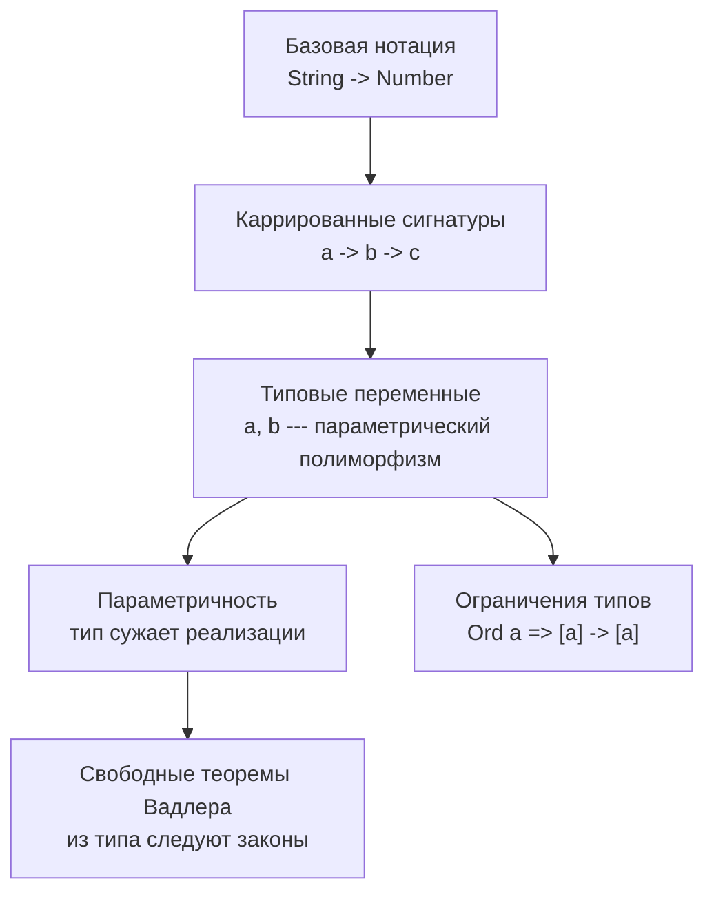
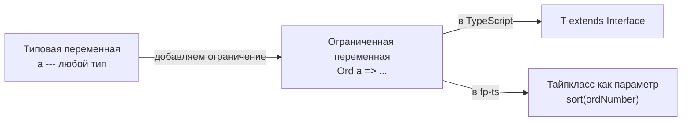

# Chapter: Система типов Hindley-Milner и сигнатуры типов

> [!info] Context
> Hindley-Milner (HM) --- это система типов, лежащая в основе языков Haskell, ML, PureScript и многих функциональных библиотек. Даже если вы пишете на JavaScript, понимание HM-нотации позволяет читать документацию Ramda, fp-ts, Sanctuary и рассуждать о коде на уровне типов. Пререквизиты: [[pure-functions]], [[partial-application/readme|каррирование]], [[function-composition/function-composition|композиция функций]].

## Overview

Сигнатура типа --- это компактная запись, которая описывает, что функция принимает и что возвращает. В HM-нотации она записывается через стрелку `->`:

```
functionName :: InputType -> OutputType
```

Ключевые идеи, которые мы разберём:



**Зачем это нужно:**

1. **Документация** --- сигнатура заменяет абзац текста. `map :: (a -> b) -> [a] -> [b]` говорит всё о функции.
2. **Рассуждение о коде** --- по типу можно вывести, что функция может и чего не может делать.
3. **Свободные теоремы** --- из одного лишь типа автоматически следуют математические законы, которые можно использовать как тесты.

**Где встречается HM-нотация:**
- Haskell, PureScript, Elm --- нативно
- Ramda --- в JSDoc-комментариях к каждой функции
- fp-ts --- через TypeScript generics (но нотация та же в документации)
- Mostly Adequate Guide --- учебник FP на JavaScript

---

## Deep Dive

### 1. Базовая нотация: читаем сигнатуры

Самая простая сигнатура --- функция принимает один аргумент и возвращает результат:

```javascript
// capitalize :: String -> String
const capitalize = s => toUpperCase(head(s)) + toLowerCase(tail(s));

// strLength :: String -> Number
const strLength = s => s.length;
```

Читается буквально: `capitalize` принимает `String` и возвращает `String`. Никакой магии.

**Многопараметровые функции** записываются цепочкой стрелок:

```javascript
// join :: String -> [String] -> String
const join = curry((what, xs) => xs.join(what));
```

Квадратные скобки `[String]` означают "массив строк". Запись `String -> [String] -> String` читается: "принимает строку, затем массив строк, возвращает строку".

```javascript
// replace :: Regex -> String -> String -> String
const replace = curry((reg, sub, s) => s.replace(reg, sub));
```

Здесь три входных параметра и один выход. Последний тип в цепочке --- всегда возвращаемое значение.

> [!tip] Правило чтения
> В сигнатуре `A -> B -> C -> D` последний тип `D` --- результат. Всё остальное --- входные параметры (слева направо).

**Краткое резюме:** сигнатура типа --- это контракт функции. Типы слева от последней стрелки --- входы, тип справа --- выход. Квадратные скобки означают массив.

---

### 2. Каррированные сигнатуры

Почему между параметрами стоят стрелки, а не запятые? Потому что каждая стрелка --- это отдельная функция. Сигнатура:

```
match :: Regex -> String -> [String]
```

На самом деле означает:

```
match :: Regex -> (String -> [String])
```

То есть `match` --- это функция, которая принимает `Regex` и возвращает **новую функцию** `String -> [String]`.

```javascript
// match :: Regex -> String -> [String]
const match = curry((reg, s) => s.match(reg));

// Частичное применение "откусывает" тип слева:
// hasSpaces :: String -> [String]
const hasSpaces = match(/\s+/g);

hasSpaces('hello world'); // [' ']
hasSpaces('spaceless');   // null
```

Когда мы передали `Regex`, тип `Regex ->` "откусился" слева, и осталась функция `String -> [String]`.

```javascript
// replace :: Regex -> String -> String -> String
const replace = curry((reg, sub, s) => s.replace(reg, sub));

// replaceVowels :: String -> String -> String
const replaceVowels = replace(/[aeiou]/ig);

// censor :: String -> String
const censor = replaceVowels('*');

censor('hello world'); // 'h*ll* w*rld'
```

Каждое частичное применение убирает один тип слева. Это прямое следствие каррирования --- подробнее в [[partial-application/readme]].

> [!important] Ключевой инсайт
> Стрелка `->` в HM --- это не разделитель параметров, а оператор "возвращает функцию". Все функции в HM концептуально принимают ровно один аргумент.

**Краткое резюме:** каждая стрелка в сигнатуре --- это граница между "принять аргумент" и "вернуть функцию". Частичное применение "откусывает" типы слева направо.

---

### 3. Типовые переменные и параметрический полиморфизм

До сих пор мы использовали конкретные типы: `String`, `Number`, `Regex`. Но многие функции работают с **любым** типом. Для этого используются строчные буквы --- типовые переменные:

```javascript
// id :: a -> a
const id = x => x;
```

Здесь `a` --- это placeholder, означающий "любой тип". Но важно: **одна и та же буква --- один и тот же тип**. `a -> a` значит: "что получил, то и вернул". Не `String -> Number`, а `String -> String` или `Number -> Number`.

```javascript
// head :: [a] -> a
const head = xs => xs[0];
```

`head` берёт массив чего угодно и возвращает один элемент того же типа.

```javascript
// map :: (a -> b) -> [a] -> [b]
const map = curry((f, xs) => xs.map(f));
```

Здесь `a` и `b` --- **разные** типовые переменные. `map` принимает функцию, которая превращает `a` в `b`, массив `a` и возвращает массив `b`. При этом `a` и `b` могут совпадать (например, `Number -> Number`), но не обязаны.

```javascript
// filter :: (a -> Bool) -> [a] -> [a]
const filter = curry((f, xs) => xs.filter(f));

// reduce :: ((b, a) -> b) -> b -> [a] -> b
const reduce = curry((f, x, xs) => xs.reduce(f, x));
```

> [!tip] Связь с TypeScript
> Типовые переменные `a`, `b` --- это прямой аналог generics в TypeScript. `a -> a` --- то же самое, что `<T>(x: T) => T`.

```typescript
// HM:   id :: a -> a
// TS:
function identity<T>(x: T): T {
  return x;
}

// HM:   map :: (a -> b) -> [a] -> [b]
// TS:
function map<A, B>(f: (a: A) => B, xs: A[]): B[] {
  return xs.map(f);
}
```

Подробнее о параметрическом полиморфизме --- [[1.parametric-polymorphism]]. О generics в TypeScript --- [[effective-ts/8.generics-overload]].

**Краткое резюме:** строчные буквы в сигнатурах --- типовые переменные. Одна буква = один тип. Разные буквы = возможно разные типы. Это прямой аналог generics.

---

### 4. Параметричность --- тип сужает реализации

Это одна из самых мощных идей в системе типов. Суть: чем абстрактнее тип, тем меньше функция может сделать с данными.

Рассмотрим сигнатуру:

```javascript
// id :: a -> a
const id = x => x;
```

Функция получает значение типа `a` --- и она **ничего не знает** о том, что это за тип. Она не может:
- умножить на 2 (а вдруг это строка?)
- вызвать `.toUpperCase()` (а вдруг это число?)
- проверить `typeof` (в чистом HM нет reflection)
- вернуть что-то другое (тип возврата тоже `a`)

Единственное, что она может --- **вернуть то, что получила**. Сигнатура `a -> a` допускает ровно одну реализацию: `identity`.

```javascript
// Параметричность --- единственная возможная реализация:
// id :: a -> a
const id = x => x; // нельзя ни умножить, ни проверить тип --- только вернуть
```

Рассмотрим более интересный случай:

```
// mystery :: [a] -> [a]
```

Функция получает массив и возвращает массив того же типа. Она **не может** менять элементы (не знает их тип). Что она может?
- Вернуть массив как есть
- Перетасовать элементы
- Убрать некоторые элементы (фильтрация по позиции)
- Повторить элементы
- Вернуть пустой массив

Но она **не может** добавить новый элемент, потому что не знает, как создать значение типа `a`.

> [!warning] Ограничение в JavaScript
> Параметричность работает в полной мере только в языках без reflection и type casting. В JavaScript можно нарушить контракт через `typeof`, `instanceof` или приведение типов. HM-нотация в JS --- это **соглашение**, а не гарантия компилятора.

**"Детективный" подход:** когда вы видите сигнатуру, спрашивайте себя: "что эта функция НЕ может сделать?"

| Сигнатура | Не может |
|---|---|
| `a -> a` | Менять значение, возвращать другой тип |
| `[a] -> [a]` | Создавать новые элементы, менять существующие |
| `(a -> b) -> [a] -> [b]` | Игнорировать функцию, менять порядок (по конвенции) |
| `a -> b` | Ничего не гарантирует --- `a` и `b` не связаны |

**Краткое резюме:** параметричность --- принцип, по которому абстрактный тип ограничивает реализацию. Чем меньше функция знает о типе, тем меньше она может сделать --- и тем больше мы знаем о ней из одной сигнатуры.

---

### 5. Свободные теоремы Вадлера

В 1989 году Филип Вадлер доказал: из одной лишь сигнатуры типа автоматически следуют математические законы. Это называется **"theorems for free"** --- теоремы, которые мы получаем бесплатно, не зная реализации.

#### Теорема для head и map

Из сигнатур `head :: [a] -> a` и `map :: (a -> b) -> [a] -> [b]` следует:

```javascript
// Для любой функции f и непустого массива:
compose(f, head) === compose(head, map(f));
```

Это значит: "применить `f` к первому элементу" --- то же самое, что "применить `f` ко всем, а потом взять первый". Проверим:

```javascript
const f = x => x * 2;
const arr = [1, 2, 3];

// Путь 1: сначала head, потом f
compose(f, head)(arr);           // f(head([1,2,3])) = f(1) = 2

// Путь 2: сначала map, потом head
compose(head, map(f))(arr);      // head(map(f)([1,2,3])) = head([2,4,6]) = 2
```

Оба пути дают одинаковый результат. Но путь 1 эффективнее --- не нужно обрабатывать весь массив.

#### Теорема для filter и map

```javascript
compose(map(f), filter(compose(p, f))) === compose(filter(p), map(f));
```

Читается: "сначала отфильтровать по `p(f(x))`, потом применить `f`" --- то же самое, что "сначала применить `f`, потом отфильтровать по `p`".

#### Практическая польза

Свободные теоремы --- это не абстрактная математика. Это **проверяемые тест-кейсы**:

```javascript
// Тест на основе свободной теоремы
const f = x => x * 2;
const p = x => x > 4;
const arr = [1, 2, 3, 4, 5];

const left  = compose(map(f), filter(compose(p, f)))(arr);
const right = compose(filter(p), map(f))(arr);

console.log(left);  // [6, 8, 10]
console.log(right); // [6, 8, 10]
// left и right всегда равны --- это гарантия из типов
```

Также свободные теоремы помогают **оптимизировать код**: если два выражения эквивалентны, можно выбрать более производительное.

> [!tip] Практический вывод
> Когда вы видите цепочку `map` и `filter`, свободная теорема гарантирует, что порядок можно менять (с соответствующей адаптацией предиката). Это полезно для оптимизации: фильтрация до `map` обрабатывает меньше элементов.

Подробнее о композиции --- [[function-composition/function-composition]].

**Краткое резюме:** свободные теоремы --- законы, которые автоматически следуют из сигнатуры типа. Они дают бесплатные тесты и возможности для оптимизации.

---

### 6. Ограничения типов и тайпклассы

Иногда полный полиморфизм --- это слишком. Функция сортировки не может работать с **любым** типом --- элементы должны быть сравнимы. Для этого существуют ограничения типов (type constraints):

```javascript
// sort :: Ord a => [a] -> [a]
```

Запись `Ord a =>` читается: "при условии, что `a` принадлежит тайпклассу `Ord`" (то есть поддерживает сравнение). Часть до `=>` --- это ограничение, после --- обычная сигнатура.

```javascript
// assertEqual :: (Eq a, Show a) => a -> a -> Assertion
```

Здесь два ограничения: `a` должен поддерживать проверку равенства (`Eq`) и преобразование в строку (`Show`). Несколько ограничений перечисляются в скобках через запятую.

#### Аналог в TypeScript

В TypeScript ограничения типов выражаются через `extends`:

```typescript
// HM:   sort :: Ord a => [a] -> [a]
// TS:
interface Comparable {
  compareTo(other: this): number;
}

function sort<T extends Comparable>(xs: T[]): T[] {
  return [...xs].sort((a, b) => a.compareTo(b));
}
```

`Ord a =>` в HM соответствует `<T extends Comparable>` в TypeScript. Идея одна: мы сужаем множество допустимых типов, требуя определённых возможностей.

#### Связь с fp-ts

В библиотеке fp-ts тайпклассы реализованы как интерфейсы TypeScript:

```typescript
// fp-ts тайпкласс Ord
import { Ord } from 'fp-ts/Ord';
import { sort } from 'fp-ts/Array';

const ordNumber: Ord<number> = {
  equals: (a, b) => a === b,
  compare: (a, b) => (a < b ? -1 : a > b ? 1 : 0),
};

const sorted = sort(ordNumber)([3, 1, 2]); // [1, 2, 3]
```

Подробнее о тайпклассах fp-ts --- [[fp-ts/fp-ts-phase-1-2]].



**Краткое резюме:** ограничения типов (`Ord a =>`) сужают полиморфизм, требуя от типа определённых возможностей. В TypeScript аналог --- `extends`, в fp-ts --- тайпклассы как явные параметры.

---

## Exercises

### Упражнение 1: Прочитай сигнатуру

Для каждой сигнатуры опиши словами, что делает функция:

```
1. append :: a -> [a] -> [a]
2. flip :: (a -> b -> c) -> b -> a -> c
3. take :: Number -> [a] -> [a]
4. zipWith :: (a -> b -> c) -> [a] -> [b] -> [c]
```

### Упражнение 2: Напиши сигнатуру

Дана реализация --- напиши HM-сигнатуру:

```javascript
const last = xs => xs[xs.length - 1];
// ???

const prop = curry((key, obj) => obj[key]);
// ???

const constant = x => () => x;
// ???
```

### Упражнение 3: Параметричность --- что невозможно?

Для сигнатуры `(a, b) -> a` перечисли:
- Что функция **может** сделать?
- Что **не может**?
- Сколько возможных реализаций?

### Упражнение 4: Проверь свободную теорему

Реализуй и проверь в консоли:

```javascript
const { curry, compose, head, map, filter } = require('ramda');
// Или используй собственные реализации

// Проверь: compose(f, head) === compose(head, map(f))
const f = x => x + '!';
const arr = ['hello', 'world'];

console.log(compose(f, head)(arr));
console.log(compose(head, map(f))(arr));
// Должны быть равны

// Проверь для другой f и другого массива
```

### Упражнение 5: Напиши ограничение типа

Функция `max` находит максимальный элемент массива. Напиши её HM-сигнатуру с ограничением типа. Затем реализуй аналог в TypeScript с `extends`.

---

## Anki Cards

> [!tip] Flashcards

> Q: Как читается сигнатура `String -> Number` в HM-нотации?
> A: Функция принимает String и возвращает Number.

> Q: Что означает запись `[a]` в HM-сигнатуре?
> A: Массив элементов типа `a` (где `a` --- типовая переменная, любой тип).

> Q: Как в HM-нотации записывается каррированная функция двух аргументов?
> A: `a -> b -> c`, что эквивалентно `a -> (b -> c)` --- функция принимает `a` и возвращает функцию `b -> c`.

> Q: Что происходит с сигнатурой при частичном применении `match :: Regex -> String -> [String]` с одним аргументом?
> A: "Откусывается" тип слева: результат имеет сигнатуру `String -> [String]`.

> Q: Чем отличается `a -> a` от `a -> b` в HM?
> A: `a -> a` --- вход и выход одного типа (одна буква = один тип). `a -> b` --- вход и выход могут быть разных типов.

> Q: Что такое параметричность (parametricity)?
> A: Принцип, по которому функция с полиморфным типом не может инспектировать или менять значения абстрактного типа. Чем абстрактнее тип, тем меньше возможных реализаций.

> Q: Почему `a -> a` допускает только одну реализацию (identity)?
> A: Функция не знает, что такое `a`, поэтому не может создать новое значение, преобразовать или проверить тип. Остаётся только вернуть аргумент как есть.

> Q: Что может делать функция с сигнатурой `[a] -> [a]`?
> A: Переставлять, удалять, повторять элементы --- но не может создавать новые или менять существующие, потому что не знает тип `a`.

> Q: Что такое свободные теоремы Вадлера (theorems for free)?
> A: Математические законы, которые автоматически следуют из сигнатуры типа без знания реализации. Например, `compose(f, head) === compose(head, map(f))`.

> Q: Какую практическую пользу дают свободные теоремы?
> A: Бесплатные тест-кейсы (два эквивалентных выражения должны давать одинаковый результат) и возможности оптимизации (можно выбрать более производительный вариант).

> Q: Как читается ограничение `Ord a => [a] -> [a]`?
> A: "При условии, что тип `a` поддерживает сравнение (тайпкласс Ord), функция принимает массив `a` и возвращает массив `a`."

> Q: Какой аналог `Ord a =>` в TypeScript?
> A: `<T extends Comparable>` --- ограничение generic-типа через `extends`.

> Q: Что является аналогом HM типовых переменных `a`, `b` в TypeScript?
> A: Generics: `<T>`, `<A, B>`. Например, `a -> a` соответствует `<T>(x: T) => T`.

> Q: Почему параметричность в JavaScript работает не полностью?
> A: В JavaScript есть `typeof`, `instanceof` и приведение типов, которые позволяют "заглянуть" в абстрактный тип. В чистом HM это невозможно.

> Q: Как записывается HM-сигнатура функции `map`?
> A: `map :: (a -> b) -> [a] -> [b]` --- принимает функцию преобразования и массив, возвращает массив преобразованных элементов.

## Anki Export File

Файл `anki-cards.txt` создан в этой же папке.

## Related Topics

- [[pure-functions]] --- почему сигнатура описывает чистую функцию
- [[partial-application/readme]] --- каррирование и частичное применение
- [[function-composition/function-composition]] --- compose и pipe
- [[1.parametric-polymorphism]] --- параметрический полиморфизм в ООП
- [[effective-ts/8.generics-overload]] --- TypeScript generics
- [[fp-ts/fp-ts-phase-1-2]] --- тайпклассы fp-ts

## Sources

- [Mostly Adequate Guide, Chapter 7 --- Hindley-Milner and Me](https://mostly-adequate.gitbook.io/mostly-adequate-guide/ch07)
- [Wadler, "Theorems for Free!" (1989)](https://users.cs.utah.edu/~mflatt/past-courses/cs7520/public_html/s06/wadler89.pdf)
- [Bartosz Milewski: Parametricity --- Money for Nothing and Theorems for Free](https://bartoszmilewski.com/2014/09/22/parametricity-money-for-nothing-and-theorems-for-free/)
- [Ramda Wiki: Type Signatures](https://github.com/ramda/ramda/wiki/Type-Signatures)
- [TypeScript Handbook: Generics](https://www.typescriptlang.org/docs/handbook/2/generics.html)
- [Wikipedia: Hindley-Milner type system](https://en.wikipedia.org/wiki/Hindley%E2%80%93Milner_type_system)
