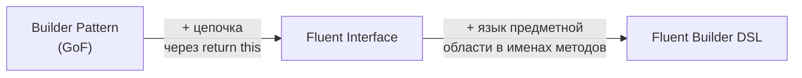
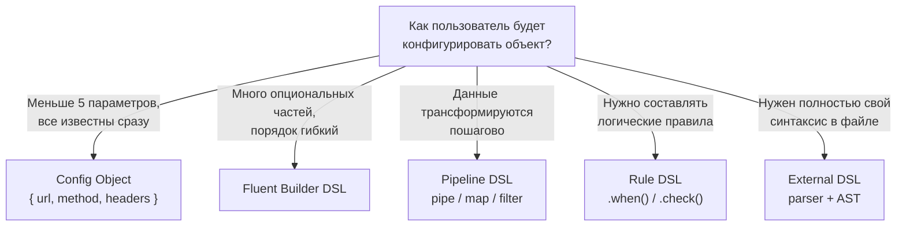

# Глава: Fluent Builder DSL

> [!info] Context
> Fluent Builder DSL — это паттерн проектирования API, при котором вызовы методов выстраиваются в цепочку, читающуюся как предложение на языке предметной области. Это самый распространённый вид internal DSL в TypeScript/JavaScript: его используют Knex.js для SQL-запросов, Zod для валидации схем, Express для маршрутизации, jQuery для работы с DOM.
>
> Глава учит проектировать Fluent Builder снаружи внутрь: сначала — желаемый синтаксис вызова, потом — реализация. Это ключевой принцип любого DSL: язык определяется тем, как его _используют_, а не тем, как он устроен внутри.
>
> **Предварительные знания:** TypeScript на уровне классов, generics, union types. Понимание паттерна Builder (GoF) полезно, но не обязательно.

## Overview

Три концепции, которые часто путают, образуют лестницу абстракции:



**Builder** — паттерн пошаговой сборки сложного объекта. Методы могут вызываться отдельно, по одному.

**Fluent Interface** — Builder, у которого каждый метод возвращает `this`, что позволяет выстраивать вызовы в цепочку.

**Fluent Builder DSL** — Fluent Interface, в котором имена методов и порядок вызовов образуют мини-язык предметной области. Код читается почти как английская фраза: `query.from("users").where("age", ">", 18).select("id", "name").limit(10)`.

### Когда использовать Fluent Builder, а когда нет



> [!tip] Главное правило
> Fluent Builder оправдан, когда объект собирается из многих опциональных частей и цепочка вызовов делает код читабельнее, чем конфигурационный объект. Если у объекта 3 поля и все обязательные — обычный конструктор или литерал объекта будут проще.

## Deep Dive

### 1. Боль без DSL

Рассмотрим задачу: нужно построить SQL-запрос. Без builder'а код быстро превращается в клубок конкатенаций:

```typescript
function getActiveUsers(minAge: number, limit: number): string {
  let sql = "SELECT id, name, email FROM users";
  sql += " WHERE active = true";
  if (minAge > 0) {
    sql += ` AND age >= ${minAge}`;    // SQL injection, но сейчас не о том
  }
  sql += " ORDER BY name ASC";
  sql += ` LIMIT ${limit}`;
  return sql;
}
```

Проблемы очевидны:

- **Хрупкость** — забыл пробел перед `AND` — сломалась строка. Перепутал порядок `WHERE` и `ORDER BY` — невалидный SQL.
- **Нечитаемость** — логика запроса утонула в деталях конкатенации. Чтобы понять, _что_ запрашивается, надо мысленно собрать строку.
- **Дублирование** — каждый новый запрос повторяет ту же механику склейки.
- **Нет подсказок от IDE** — строки не дают автокомплита, не проверяют опечатки.

Тот же код для HTTP-запроса выглядит не лучше:

```typescript
const headers: Record<string, string> = {};
headers["Content-Type"] = "application/json";
headers["Authorization"] = `Bearer ${token}`;
headers["X-Request-Id"] = requestId;

const response = await fetch("https://api.example.com/users", {
  method: "POST",
  headers,
  body: JSON.stringify({ name: "Alice", role: "admin" }),
  signal: AbortSignal.timeout(3000),
});
```

Это работает, но связь между `headers`, `body` и `method` — чисто текстовая. Ничто в коде не говорит, что `bearer` — это разновидность `header`.

> [!important] Ключевая мысль
> Проблема не в том, что код неправильный. Проблема в том, что он выражает _как_ строить запрос, а не _что_ мы хотим получить. DSL переворачивает это: пользователь описывает намерение, а реализация заботится о деталях.

---

### 2. Ядро механизма: return this

Весь Fluent Builder стоит на одном приёме: каждый метод, который модифицирует состояние, возвращает `this`.

Простейший пример — builder для сообщения:

```typescript
class MessageBuilder {
  private _to = "";
  private _subject = "";
  private _body = "";

  to(recipient: string): this {      // ← возвращает this, не void
    this._to = recipient;
    return this;
  }

  subject(text: string): this {
    this._subject = text;
    return this;
  }

  body(text: string): this {
    this._body = text;
    return this;
  }

  build(): { to: string; subject: string; body: string } {
    if (!this._to) throw new Error("Recipient is required");
    return { to: this._to, subject: this._subject, body: this._body };
  }
}

// Без return this — каждый вызов на отдельной строке:
const builder = new MessageBuilder();
builder.to("alice@example.com");
builder.subject("Hello");
builder.body("World");
const msg = builder.build();

// С return this — одна цепочка:
const msg2 = new MessageBuilder()
  .to("alice@example.com")
  .subject("Hello")
  .body("World")
  .build();
```

Разница — не только в количестве строк. Цепочка визуально группирует все шаги сборки в один блок. Читатель видит, что это единая операция, а не разрозненные мутации.

#### Почему `this`, а не имя класса

TypeScript позволяет указать return type как `this` — и это критически важно для наследования:

```typescript
class BaseBuilder {
  protected _debug = false;

  debug(enabled = true): this {     // ← polymorphic this type
    this._debug = enabled;
    return this;
  }
}

class QueryBuilder extends BaseBuilder {
  private _table = "";

  from(table: string): this {
    this._table = table;
    return this;
  }

  build(): string {
    const prefix = this._debug ? "/* DEBUG */ " : "";
    return `${prefix}SELECT * FROM ${this._table}`;
  }
}

// Без polymorphic this:
// .debug() вернул бы BaseBuilder, и .from() был бы недоступен
const q = new QueryBuilder()
  .debug()        // возвращает QueryBuilder, не BaseBuilder
  .from("users")  // работает, потому что тип — this (QueryBuilder)
  .build();
```

Если вместо `this` указать `BaseBuilder`, метод `.debug()` вернёт тип `BaseBuilder`, и `.from()` будет недоступен в цепочке. Polymorphic `this` решает эту проблему: возвращаемый тип автоматически сужается до конкретного подкласса.

> [!tip] Правило
> В Fluent Builder всегда используйте return type `this`, а не имя класса. Это единственный способ, при котором наследование и цепочка методов работают вместе.

---

### 3. Полный пример: Query Builder

Начнём с того, _как_ должен выглядеть код для пользователя. Это принцип outside-in: сначала дизайним вызов, потом реализуем.

#### Желаемый синтаксис (call site)

```typescript
// Вот так должен выглядеть пользовательский код
const sql = new QueryBuilder()
  .from("users")
  .select("id", "name", "email")
  .where("active", "=", true)
  .where("age", ">=", 18)
  .orderBy("name", "asc")
  .limit(20)
  .offset(40)
  .build();

// Результат:
// SELECT id, name, email FROM users
//   WHERE active = true AND age >= 18
//   ORDER BY name ASC
//   LIMIT 20 OFFSET 40
```

Обратите внимание: вызов читается почти как SQL. Имена методов — это слова из предметной области (SQL), а не слова реализации (`setField`, `addCondition`).

#### Реализация

```typescript
type OrderDirection = "asc" | "desc";

interface WhereClause {
  field: string;
  op: string;
  value: unknown;
}

interface OrderClause {
  field: string;
  direction: OrderDirection;
}

class QueryBuilder {
  private _table = "";
  private _fields: string[] = ["*"];
  private _conditions: WhereClause[] = [];
  private _orderClauses: OrderClause[] = [];
  private _limit?: number;
  private _offset?: number;

  from(table: string): this {
    this._table = table;
    return this;
  }

  select(...fields: string[]): this {
    this._fields = fields;                    // ← заменяет дефолтный ["*"]
    return this;
  }

  where(field: string, op: string, value: unknown): this {
    this._conditions.push({ field, op, value });
    return this;
  }

  orderBy(field: string, direction: OrderDirection = "asc"): this {
    this._orderClauses.push({ field, direction });
    return this;
  }

  limit(n: number): this {
    this._limit = n;
    return this;
  }

  offset(n: number): this {
    this._offset = n;
    return this;
  }

  build(): string {
    if (!this._table) throw new Error("Table is required — call .from()");

    let sql = `SELECT ${this._fields.join(", ")} FROM ${this._table}`;

    if (this._conditions.length > 0) {
      const clauses = this._conditions
        .map(c => `${c.field} ${c.op} ${this.formatValue(c.value)}`)
        .join(" AND ");
      sql += ` WHERE ${clauses}`;
    }

    if (this._orderClauses.length > 0) {
      const orders = this._orderClauses
        .map(o => `${o.field} ${o.direction.toUpperCase()}`)
        .join(", ");
      sql += ` ORDER BY ${orders}`;
    }

    if (this._limit !== undefined) sql += ` LIMIT ${this._limit}`;
    if (this._offset !== undefined) sql += ` OFFSET ${this._offset}`;

    return sql;
  }

  private formatValue(v: unknown): string {
    if (typeof v === "string") return `'${v}'`;
    if (typeof v === "boolean") return v ? "true" : "false";
    return String(v);
  }
}
```

#### Что тут важно

- **Имена методов — доменные слова.** `.from()`, `.where()`, `.select()` — это словарь SQL, а не `addTable()`, `pushCondition()`.
- **Порядок вызова гибкий.** Можно вызвать `.select()` до `.from()` или после — builder накапливает состояние и собирает строку только в `.build()`.
- **Terminal operation** — `.build()` — чётко отделяет фазу конфигурации от фазы генерации.
- **Множественные `.where()`** объединяются через `AND`. Это соглашение, знакомое пользователям Knex.

> [!tip] Инсайт из Knex.js
> В Knex `.where()` перегружен — принимает разные формы: `.where(column, value)`, `.where(column, op, value)`, `.where(object)`, `.where(callback)`. Это мощный приём: один метод, несколько shape'ов. TypeScript моделирует это через union типы в параметрах или function overloads.

---

### 4. Полный пример: HTTP Request Builder

#### Желаемый синтаксис

```typescript
const response = await new HttpRequest()
  .post("https://api.example.com/users")
  .bearer(token)
  .header("Content-Type", "application/json")
  .body({ name: "Alice", role: "admin" })
  .timeout(3000)
  .send();
```

Сравните с «сырым» `fetch` из секции 1 — здесь видно _намерение_, а не механику.

#### Реализация

```typescript
class HttpRequest {
  private _method = "GET";
  private _url = "";
  private _headers: Record<string, string> = {};
  private _body?: unknown;
  private _timeout = 5000;

  // --- HTTP-методы задают и verb, и URL одним вызовом ---

  get(url: string): this {
    this._method = "GET";
    this._url = url;
    return this;
  }

  post(url: string): this {
    this._method = "POST";
    this._url = url;
    return this;
  }

  put(url: string): this {
    this._method = "PUT";
    this._url = url;
    return this;
  }

  delete(url: string): this {
    this._method = "DELETE";
    this._url = url;
    return this;
  }

  // --- Конфигурация ---

  header(key: string, value: string): this {
    this._headers[key] = value;
    return this;
  }

  bearer(token: string): this {
    return this.header("Authorization", `Bearer ${token}`);  // ← композиция через this
  }

  body(data: unknown): this {
    this._body = data;
    return this;
  }

  timeout(ms: number): this {
    this._timeout = ms;
    return this;
  }

  // --- Terminal operation ---

  async send(): Promise<Response> {
    if (!this._url) throw new Error("URL is required");

    return fetch(this._url, {
      method: this._method,
      headers: this._headers,
      body: this._body ? JSON.stringify(this._body) : undefined,
      signal: AbortSignal.timeout(this._timeout),
    });
  }
}
```

#### Ключевой приём: композиция методов

Метод `.bearer(token)` не содержит собственной логики — он вызывает `.header()` с правильными аргументами. Это важная идея: высокоуровневые доменные методы строятся поверх низкоуровневых. Пользователь может использовать и `.bearer()`, и `.header()` напрямую — API работает на обоих уровнях абстракции.

---

### 5. Полный пример: Schema DSL (Zod-style)

Zod — одна из самых успешных Fluent Builder DSL в экосистеме TypeScript. Его API читается почти как объявление типа:

```typescript
const UserSchema = z.object({
  id:    z.string().uuid(),
  name:  z.string().min(2).max(100),
  email: z.string().email(),
  age:   z.number().int().min(0).optional(),
  role:  z.enum(["admin", "editor", "viewer"]).default("viewer"),
});

type User = z.infer<typeof UserSchema>;  // TypeScript тип, выведенный из DSL
```

Построим упрощённую версию, чтобы понять механику.

#### Желаемый синтаксис

```typescript
const schema = {
  name:  field.string().required().minLength(2),
  email: field.string().required().matches(/@/),
  age:   field.number().min(0).max(150),
  role:  field.enum(["admin", "user"]).default("user"),
};

// Валидация
const result = validate(schema, { name: "A", email: "bad", age: 200 });
// → { ok: false, errors: ["name must be at least 2 chars", "email has invalid format", "age must be at most 150"] }
```

#### Реализация: базовый класс Field

```typescript
interface ValidationResult {
  ok: boolean;
  errors: string[];
}

abstract class Field<T> {
  protected _required = false;
  protected _default?: T;
  protected _label = "field";

  required(): this {
    this._required = true;
    return this;
  }

  default(value: T): this {
    this._default = value;
    return this;
  }

  abstract validate(raw: unknown): ValidationResult;

  // Для вывода типов — аналог z.infer
  declare readonly _output: T;        // ← phantom type, не существует в рантайме
}
```

#### Реализация: StringField

```typescript
class StringField extends Field<string> {
  private _min = 0;
  private _max = Infinity;
  private _pattern?: RegExp;

  minLength(n: number): this {
    this._min = n;
    return this;
  }

  maxLength(n: number): this {
    this._max = n;
    return this;
  }

  matches(re: RegExp): this {
    this._pattern = re;
    return this;
  }

  email(): this {
    return this.matches(/^[^\s@]+@[^\s@]+\.[^\s@]+$/);  // ← композиция, как bearer()
  }

  validate(raw: unknown): ValidationResult {
    const errors: string[] = [];

    if (raw === undefined || raw === null) {
      if (this._required) errors.push(`${this._label} is required`);
      return { ok: errors.length === 0, errors };
    }

    if (typeof raw !== "string") {
      return { ok: false, errors: [`${this._label} must be a string`] };
    }

    if (raw.length < this._min) {
      errors.push(`${this._label} must be at least ${this._min} chars`);
    }
    if (raw.length > this._max) {
      errors.push(`${this._label} must be at most ${this._max} chars`);
    }
    if (this._pattern && !this._pattern.test(raw)) {
      errors.push(`${this._label} has invalid format`);
    }

    return { ok: errors.length === 0, errors };
  }
}
```

#### Реализация: NumberField и фабрика

```typescript
class NumberField extends Field<number> {
  private _min = -Infinity;
  private _max = Infinity;
  private _int = false;

  min(n: number): this { this._min = n; return this; }
  max(n: number): this { this._max = n; return this; }
  int(): this { this._int = true; return this; }

  validate(raw: unknown): ValidationResult {
    const errors: string[] = [];
    if (raw === undefined || raw === null) {
      if (this._required) errors.push(`${this._label} is required`);
      return { ok: errors.length === 0, errors };
    }
    if (typeof raw !== "number" || Number.isNaN(raw)) {
      return { ok: false, errors: [`${this._label} must be a number`] };
    }
    if (this._int && !Number.isInteger(raw)) errors.push(`${this._label} must be integer`);
    if (raw < this._min) errors.push(`${this._label} must be at least ${this._min}`);
    if (raw > this._max) errors.push(`${this._label} must be at most ${this._max}`);
    return { ok: errors.length === 0, errors };
  }
}

// Фабрика — точка входа в DSL
const field = {
  string: () => new StringField(),
  number: () => new NumberField(),
};

// Функция валидации
type Schema = Record<string, Field<unknown>>;

function validate(schema: Schema, data: Record<string, unknown>): ValidationResult {
  const errors: string[] = [];
  for (const [key, fieldDef] of Object.entries(schema)) {
    const result = fieldDef.validate(data[key]);
    errors.push(...result.errors);
  }
  return { ok: errors.length === 0, errors };
}
```

#### Как Zod выводит типы: z.infer

Главная магия Zod — вывод TypeScript-типа из значения схемы. Упрощённая идея:

```typescript
// Тип, который извлекает output type из каждого поля схемы
type Infer<S extends Record<string, Field<any>>> = {
  [K in keyof S]: S[K]["_output"];   // ← читает phantom type
};

// Использование
const UserSchema = {
  name: field.string().required(),
  age: field.number(),
};

type User = Infer<typeof UserSchema>;
// → { name: string; age: number }
```

`_output` — это phantom type: свойство, объявленное через `declare`, которое не существует в рантайме, но участвует в выводе типов. Схема и тип остаются синхронизированными автоматически.

> [!important] Итого по Schema DSL
> Schema DSL — это Fluent Builder, в котором каждый field class накапливает правила валидации через цепочку. Фабрика (`field.string()`) создаёт начальный builder, методы (`.minLength()`, `.matches()`) добавляют ограничения, а `.validate()` — terminal operation.

---

### 6. Продвинутые паттерны

#### Immutable Builders

В примерах выше builder мутабельный: каждый вызов изменяет внутреннее состояние. Это работает, но порождает ловушку:

```typescript
const base = new QueryBuilder().from("users").select("id", "name");

const activeUsers = base.where("active", "=", true).build();
const allUsers = base.build();
// Ожидание: allUsers — без WHERE
// Реальность: allUsers тоже содержит WHERE active = true
// Потому что base уже мутирован вызовом .where()
```

Immutable builder решает это — каждый метод возвращает новый экземпляр:

```typescript
class ImmutableQueryBuilder {
  private constructor(
    private readonly _table: string = "",
    private readonly _fields: readonly string[] = ["*"],
    private readonly _conditions: readonly WhereClause[] = [],
    private readonly _limit?: number,
  ) {}

  static create(): ImmutableQueryBuilder {
    return new ImmutableQueryBuilder();
  }

  from(table: string): ImmutableQueryBuilder {
    return new ImmutableQueryBuilder(table, this._fields, this._conditions, this._limit);
  }

  select(...fields: string[]): ImmutableQueryBuilder {
    return new ImmutableQueryBuilder(this._table, fields, this._conditions, this._limit);
  }

  where(field: string, op: string, value: unknown): ImmutableQueryBuilder {
    const newConditions = [...this._conditions, { field, op, value }];
    return new ImmutableQueryBuilder(this._table, this._fields, newConditions, this._limit);
  }

  limit(n: number): ImmutableQueryBuilder {
    return new ImmutableQueryBuilder(this._table, this._fields, this._conditions, n);
  }

  build(): string {
    // ... та же логика сборки строки
    let sql = `SELECT ${this._fields.join(", ")} FROM ${this._table}`;
    if (this._conditions.length > 0) {
      sql += ` WHERE ${this._conditions.map(c => `${c.field} ${c.op} ${c.value}`).join(" AND ")}`;
    }
    if (this._limit !== undefined) sql += ` LIMIT ${this._limit}`;
    return sql;
  }
}

// Теперь безопасно ветвить
const base = ImmutableQueryBuilder.create().from("users").select("id", "name");
const active = base.where("active", "=", true).build();   // с WHERE
const all = base.build();                                   // без WHERE — base не мутирован
```

> [!warning] Компромисс
> Immutable builders создают больше объектов и требуют более громоздкий конструктор. Используйте их, когда builder'ы реально ветвятся (как базовые запросы с вариациями). Для одноразовой сборки мутабельный builder проще и достаточен.

#### Type-safe Builder с phantom types

Можно на уровне типов запретить вызов `.build()`, пока не заданы обязательные поля:

```typescript
// Phantom-тип для отслеживания заполненных полей
type HasTable = { readonly _hasTable: true };
type HasFields = { readonly _hasFields: true };
type Empty = {};

class TypedQueryBuilder<State = Empty> {
  private _table = "";
  private _fields: string[] = [];

  from(table: string): TypedQueryBuilder<State & HasTable> {
    this._table = table;
    return this as any;             // ← приведение типа неизбежно
  }

  select(...fields: string[]): TypedQueryBuilder<State & HasFields> {
    this._fields = fields;
    return this as any;
  }

  // build доступен ТОЛЬКО когда State содержит и HasTable, и HasFields
  build(this: TypedQueryBuilder<HasTable & HasFields>): string {
    return `SELECT ${this._fields.join(", ")} FROM ${this._table}`;
  }
}

const q = new TypedQueryBuilder()
  .from("users")
  .select("id", "name")
  .build();                       // OK — оба поля заданы

// new TypedQueryBuilder()
//   .from("users")
//   .build();                    // Ошибка компиляции: Property 'build' does not exist
```

Это продвинутый приём. Он полезен, когда неправильный порядок вызовов — не просто ошибка, а потенциальная уязвимость (например, запрос без `FROM` не должен компилироваться).

#### Method overloading

Knex позволяет вызывать `.where()` с разными наборами аргументов. В TypeScript это моделируется через перегрузки:

```typescript
class QueryBuilder {
  // Перегрузки — видны пользователю и IDE
  where(field: string, value: unknown): this;
  where(field: string, op: string, value: unknown): this;
  where(conditions: Record<string, unknown>): this;

  // Реализация — скрыта за перегрузками
  where(
    fieldOrConditions: string | Record<string, unknown>,
    opOrValue?: unknown,
    value?: unknown,
  ): this {
    if (typeof fieldOrConditions === "object") {
      // .where({ active: true, role: "admin" })
      for (const [key, val] of Object.entries(fieldOrConditions)) {
        this._conditions.push({ field: key, op: "=", value: val });
      }
    } else if (value !== undefined) {
      // .where("age", ">=", 18)
      this._conditions.push({ field: fieldOrConditions, op: opOrValue as string, value });
    } else {
      // .where("active", true)
      this._conditions.push({ field: fieldOrConditions, op: "=", value: opOrValue });
    }
    return this;
  }
}
```

Пользователь получает три разных способа вызова одного метода — IDE подсказывает все три варианта.

#### Terminal operations

Terminal operation — метод, который завершает цепочку и возвращает результат. Это граница между «конфигурацией» и «выполнением»:

| Builder | Terminal operation | Возвращает |
|---|---|---|
| QueryBuilder | `.build()` | `string` (SQL) |
| HttpRequest | `.send()` | `Promise<Response>` |
| Schema Field | `.validate(input)` | `ValidationResult` |
| Zod Schema | `.parse(input)` | Типизированные данные или throw |
| RxJS Observable | `.subscribe()` | `Subscription` |

> [!important] Правило именования
> Terminal operation должна называться доменным глаголом: `.build()`, `.execute()`, `.send()`, `.parse()`. Название `.run()` или `.do()` слишком абстрактно — оно не сообщает, _что_ произойдёт.

---

### 7. Компромиссы и антипаттерны

#### Когда Fluent Builder — правильный выбор

- Объект собирается из многих (5+) опциональных частей
- Порядок вызовов может варьироваться
- Код вызова читается как описание намерения
- IDE-подсказки на каждом шаге реально помогают

#### Когда Fluent Builder — избыточен

- У объекта 2-4 поля, все обязательные — обычный объект проще:
  ```typescript
  // Не нужен builder
  const point = { x: 10, y: 20 };

  // Тем более не нужен builder
  const point2 = new PointBuilder().x(10).y(20).build();
  ```
- Данные трансформируются последовательно — Pipeline DSL (pipe / map / filter) выразительнее
- Нужно составлять логические условия — Rule DSL (`.when()` / `.check()`) чище

#### Таблица компромиссов

| Паттерн | Мутабельность | Сложность | Лучше всего для |
|---|---|---|---|
| Fluent Builder | Мутабельный (каждый вызов меняет state) | Низкая | SQL, HTTP, конфигурации |
| Immutable Pipeline | Иммутабельный (новый экземпляр на шаг) | Средняя | Трансформация данных |
| Rule DSL | Иммутабельный (замыкания) | Низкая | Авторизация, валидация политик |
| Schema DSL | Иммутабельный | Средняя | Валидация ввода, кодогенерация |
| Tagged Template | N/A | Низкая | SQL, HTML, GraphQL |

#### Антипаттерны

**God Builder** — builder с 50+ методами, который пытается покрыть все случаи. Решение: разбить на несколько специализированных builder'ов.

**Скрытые зависимости между методами** — когда `.timeout()` работает только после `.post()`, но это нигде не задокументировано. Решение: phantom types или чёткая документация.

**Builder без terminal operation** — когда builder мутирует состояние, но нет чёткой точки «готово». Пользователь не знает, когда объект собран.

---

### 8. Реальные примеры: чему учиться

#### Knex.js — Query Builder

```typescript
const users = await knex("users")
  .select("id", "name", "email")
  .where("active", true)
  .where("age", ">=", 18)
  .orderBy("name", "asc")
  .limit(20);
```

**Чему учиться:** перегрузка `.where()` — один метод принимает разные формы. Пользователь выбирает удобную, не задумываясь о реализации.

#### Zod — Schema Validation

```typescript
const UserSchema = z.object({
  name:  z.string().min(2).max(100),
  email: z.string().email(),
  role:  z.enum(["admin", "viewer"]).default("viewer"),
});

type User = z.infer<typeof UserSchema>;
```

**Чему учиться:** `z.infer<typeof Schema>` — DSL порождает TypeScript-тип. Схема и тип синхронизированы навсегда. Это возможно благодаря phantom types и conditional types.

#### Express — Routing DSL

```typescript
app.get("/users/:id", authenticate, authorize("admin"), getUser);
```

**Чему учиться:** variadic middleware — маршрут принимает цепочку функций-обработчиков. Каждый шаг — именованная операция. TypeScript типизирует это через `...handlers: Handler[]`.

#### jQuery (исторически)

```typescript
$(".item")
  .filter(":visible")
  .css("color", "red")
  .slideUp(300)
  .addClass("processed");
```

**Чему учиться:** jQuery — один из первых массовых Fluent API в JavaScript. Именно jQuery популяризировал идею цепочки вызовов во фронтенде. Ключевой принцип: каждый метод работает со всей коллекцией разом — «implicit iteration».

---

## Related Topics

- [[02-typescript/dsl/exercises|Упражнения: Fluent Builder DSL]]
- [[03-oop-solid/builder-pattern|Builder Pattern (GoF)]]
- [[02-typescript/fp-course/01-pure-functions-and-pipe/pure-functions-and-pipe|Pipe и композиция функций]]
- [[02-typescript/effective-ts/method-chaining|Method Chaining в TypeScript]]
- [[09-practice/zod-validator|Zod-like валидатор]]

## Sources

- [Martin Fowler — Domain-Specific Languages](https://martinfowler.com/bliki/DomainSpecificLanguage.html) — определение и классификация DSL
- [Martin Fowler — FluentInterface](https://martinfowler.com/bliki/FluentInterface.html) — оригинальная статья о Fluent API
- [Knex.js Documentation](https://knexjs.org/guide/query-builder.html) — эталонный Query Builder
- [Zod Documentation](https://zod.dev/) — Schema DSL с выводом типов
- [TypeScript Handbook — `this` Types](https://www.typescriptlang.org/docs/handbook/2/classes.html#this-types) — polymorphic this
- [Hexlet — Бесконечная лестница абстракции](https://ru.hexlet.io/blog/posts/infinite-ladder-of-abstraction) — уровни абстракции в программировании
