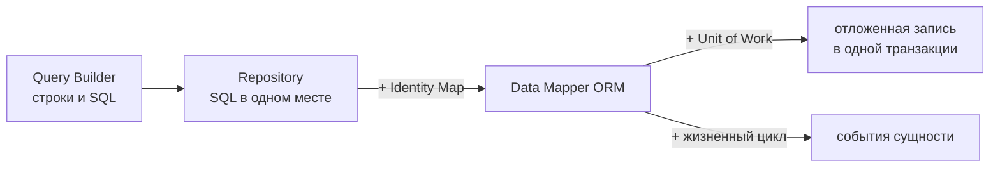

# Effect: от Query Builder к ORM — Identity Map, Unit of Work и транзакции

> [!info] Context
> **Способность, которую даёт глава.** Имея работающий Query Builder и репозиторий поверх него, вы можете назвать признаки, которые превращают репозиторий в ORM, реализовать Identity Map и Unit of Work как явные Effect-сервисы со временем жизни одного запроса и доказать результат наблюдаемыми признаками: два `findById` с одним id дают **один** `SELECT` и **одну и ту же ссылку**, а серия `insert`/`update` уходит в базу одним `BEGIN … COMMIT` только после явного `commit`.
>
> **Предпосылки.** [[../4.services-and-layers/readme|Context.Service и Layer]], [[../5.resources|Scope, finalizers и acquireRelease]], [[../3.errors/readme|типизированные ошибки]], транзакции SQL на уровне `BEGIN` / `COMMIT` / `ROLLBACK`.
>
> **Не входит в главу.** Dirty checking, каскадные удаления, стратегии загрузки, миграции, оконные функции и CTE. Они названы как границы реализации, но не реализуются здесь.
>
> **Версии.** Примеры проверены на `effect@4.0.0-beta.101` и TypeScript 5.9 в `strict`-режиме. В Effect 4 убран `FiberRef`; fiber-локальное состояние выражается через `Context.Reference`.

## Пять языков вместо одного

Query Builder кажется универсальным инструментом работы с базой, но описание таблицы и запрос к ней — разные задачи. Это видно уже по синтаксису: `CREATE TABLE` и `SELECT` почти не имеют общих правил.

Распространённая классификация делит команды SQL на пять групп. Это не нормативное деление стандарта, а рабочая карта задач:

| Группа | Расшифровка | Примеры | Задача |
|---|---|---|---|
| DDL | Data Definition Language | `CREATE TABLE`, `ALTER TABLE`, `TRUNCATE` | описать форму данных |
| DQL | Data Query Language | `SELECT` | получить данные |
| DML | Data Modification Language | `INSERT`, `UPDATE`, `DELETE` | изменить данные |
| DCL | Data Control Language | `GRANT`, `REVOKE` | раздать привилегии |
| TCL | Transaction Control Language | `BEGIN`, `COMMIT`, `ROLLBACK`, `SAVEPOINT` | управлять транзакцией |

Практический вывод: у каждой группы своя задача, поэтому под каждую можно спроектировать **свой** DSL, и они не обязаны быть похожими. Это не теоретическая возможность:

- инфраструктуру описывают на HCL (`resource "aws_instance" "web" { … }`), на YAML или — в Pulumi — прямо на TypeScript; все три описывают одно и то же, но выглядят по-разному;
- MongoDB вообще не использует SQL: и запросы, и модификации выражаются объектами JSON, а служебные операторы начинаются с `$` (`$match`, `$group`, `$set`).

Типичный самодельный Query Builder закрывает DQL и часть DML, а схему описывает отдельным мини-DSL на функциях-конструкторах, который к Query Builder отношения не имеет. Это нормально — важно лишь не считать, что «Query Builder покрывает работу с данными».

> [!question] Предсказание
> К какой из пяти групп относится `SAVEPOINT`? А `ROLLBACK TO SAVEPOINT`? Ответьте до того, как читать дальше — в разделе про вложенные транзакции это станет существенным.

> [!success]- Ответ
> Обе команды относятся к TCL. Именно поэтому вложенные транзакции — не расширение Query Builder, а отдельный слой управления, который в главе реализуется поверх `Db`, а не внутри построителя запросов.

Смежные материалы про проектирование самих языков: [[../../dsl/fluent-builder-dsl|Fluent Builder DSL]] и [[../../../08-internals/dsl/external-dsl|External DSL: парсер и AST]].

## Где заканчивается репозиторий

Первый шаг от «сырого» Query Builder — репозиторий. Вместо `db.select().from("users").where(…)` прямо в сервисе появляется `userRepo.findById(id)`.

Что это даёт:

- SQL собран в одном месте, у каждой таблицы один источник правды;
- сервис перестаёт знать, какие у таблицы поля и как строится условие;
- замена Postgres на другое хранилище меняет один файл, а не каждый вызывающий модуль.

Чего это **не** даёт. Возьмём наивную реализацию:

```typescript
findById: (id: string) =>
  Effect.gen(function* () {
    const rows = yield* db.query<UserRow>(
      "SELECT id, email FROM users WHERE id = $1",
      [id],
    );
    const row = rows[0];
    return row === undefined
      ? Option.none<User>()
      : Option.some({ id: row.id, email: row.email });
  }),
```

Каждый вызов идёт в базу и создаёт **новый** объект. Отсюда три следствия, которые разработчик обнаруживает позже:

1. `u1 === u2` возвращает `false` для одного и того же пользователя, поэтому сравнение по ссылке молча ломается;
2. изменение, внесённое в `u1`, не видно через `u2` — состояние расходится внутри одного запроса;
3. `insert` и `update`, вызванные подряд, выполняются двумя отдельными транзакциями: между ними возможен сбой, оставляющий половину работы.

## Три признака ORM

ORM — это не «Query Builder побольше». Разница в том, от чего вы отказываетесь думать.



Признаки, по которым репозиторий становится ORM:

1. **Persistence Ignorance.** Код выше репозитория не думает ни о типах колонок, ни о том, что под капотом вообще SQL, а не JSON MongoDB.
2. **Identity Map.** В границах одной единицы работы одному идентификатору соответствует один объект в памяти.
3. **Жизненный цикл сущности.** Сущность знает, что с ней происходит: создана, взята под управление, сохранена, удалена.

**Unit of Work** — не обязательный признак, но весомый: он убирает ручное управление транзакциями и позволяет собрать несколько операций в одну целостную единицу работы.

> [!warning] Это рабочее определение, а не общепринятое
> Разделение выше — способ провести границу для учебной реализации. В каталоге Мартина Фаулера Identity Map, Unit of Work, Data Mapper и Active Record — самостоятельные паттерны, а не критерий «ORM-ности»; промышленные ORM добавляют к ним метаданные о связях, dirty checking, каскады и стратегии загрузки. Если кто-то не согласится, что описанного минимума достаточно для слова «ORM» — спор терминологический, важны наблюдаемые свойства, а не ярлык.

## Учебный стенд

Чтобы поведение было наблюдаемым без настоящей базы, `Db` — фальшивая реализация: она пишет каждый оператор SQL в лог и хранит строки в `Map`. Контракт сервиса при этом настоящий: «строки на входе, строки на выходе», никакого знания о сущностях.

```typescript
import { Context, Data, Effect, Layer } from "effect";

export class DbError extends Data.TaggedError("DbError")<{
  readonly sql: string;
  readonly message: string;
}> {}

export interface DbShape {
  readonly query: <A>(
    sql: string,
    params?: ReadonlyArray<unknown>,
  ) => Effect.Effect<ReadonlyArray<A>, DbError>;
  readonly execute: (
    sql: string,
    params?: ReadonlyArray<unknown>,
  ) => Effect.Effect<void, DbError>;
}

export class Db extends Context.Service<Db, DbShape>()("orm/Db") {}
```

Фальшивая реализация разбирает только те операторы, которые встречаются в главе: `SELECT` по id, `INSERT`, `UPDATE`, `DELETE`. Каждый вызов сначала добавляет SQL в массив `log` — именно этот лог будет доказательством в проверках ниже.

## Identity Map

### Проблема

Два `findById("1")` дают два разных объекта JavaScript, и `первый === второй` — `false`. Для ORM это неприемлемо: сущность в пределах одной единицы работы должна быть одна.

### Реализация

Identity Map — сервис, живущий **ровно один запрос**. Ключ составной: таблица плюс идентификатор, иначе id из разных таблиц столкнутся.

```typescript
import { Context, Effect, Layer, Option } from "effect";

export interface IdentityMapShape {
  readonly get: <A>(table: string, id: string) => Effect.Effect<Option.Option<A>>;
  readonly put: <A>(table: string, id: string, entity: A) => Effect.Effect<A>;
  readonly invalidate: (table: string, id: string) => Effect.Effect<void>;
}

export class IdentityMap extends Context.Service<
  IdentityMap,
  IdentityMapShape
>()("orm/IdentityMap") {}

export const IdentityMapLive: Layer.Layer<IdentityMap> = Layer.sync(
  IdentityMap,
  () => {
    const cache = new Map<string, unknown>();
    const key = (table: string, id: string) => `${table}#${id}`;

    return {
      get: <A>(table: string, id: string) =>
        Effect.sync(() =>
          Option.fromUndefinedOr(cache.get(key(table, id)) as A | undefined),
        ),
      put: <A>(table: string, id: string, entity: A) =>
        Effect.sync(() => {
          cache.set(key(table, id), entity);
          return entity;
        }),
      invalidate: (table: string, id: string) =>
        Effect.sync(() => {
          cache.delete(key(table, id));
        }),
    };
  },
);
```

Отдельного DI-фреймворка не нужно: Identity Map — обычная зависимость репозитория, а `Layer` строит её ровно один раз на запрос. Каждый новый `Effect.provide` с этим слоем даёт свежую карту.

> [!note] Про `unknown` в карте
> `get` возвращает `Option<A>` за счёт непроверяемого приведения — карта хранит `unknown`. Это честная граница учебной реализации: чтобы приведение стало проверяемым, сущность должна декодироваться через [[../2.schema/readme|Schema]], а тег схемы — служить ключом типа. Это следующий шаг развития, а не мелочь стиля.

### Репозиторий с картой

```typescript
findById: (id) =>
  Effect.gen(function* () {
    const cached = yield* identity.get<User>(table, id);
    if (Option.isSome(cached)) return cached;

    const rows = yield* db.query<UserRow>(
      "SELECT id, email FROM users WHERE id = $1",
      [id],
    );
    const row = rows[0];
    if (row === undefined) return Option.none<User>();

    const user: User = { id: row.id, email: row.email };
    return Option.some(yield* identity.put(table, id, user));
  }),
```

> [!question] Предсказание
> Программа вызывает `findById("1")` дважды подряд. Сколько строк окажется в логе SQL и что вернёт сравнение двух результатов по ссылке?

Наблюдаемый результат:

```text
same reference: true
--- identity map ---
  SELECT id, email FROM users WHERE id = $1
```

Один `SELECT` на два вызова и одна и та же ссылка. Это тот самый момент, когда репозиторий перестаёт быть просто репозиторием.

### Инвалидация

Репозиторий — единственное место, которое знает, что именно изменилось, поэтому обновлять карту обязан он: после `update` — положить новое состояние, после `delete` — удалить конкретный ключ.

```typescript
update: (user) =>
  Effect.gen(function* () {
    yield* uow.register({
      kind: "update",
      sql: "UPDATE users SET email = $2 WHERE id = $1",
      params: [user.id, user.email],
    });
    yield* identity.put(table, user.id, user);
  }),

remove: (id) =>
  Effect.gen(function* () {
    yield* uow.register({
      kind: "delete",
      sql: "DELETE FROM users WHERE id = $1",
      params: [id],
    });
    yield* identity.invalidate(table, id);
  }),
```

Здесь спрятано реальное противоречие. `put` с новым объектом обновляет **состояние**, но ломает **ссылочную стабильность**: тот, кто держал прежний объект, не увидит изменения. Промышленные ORM решают это иначе — мутируют отслеживаемый экземпляр, а не заменяют его. Выбор зависит от того, что вы обещаете пользователю: неизменяемые снимки или живые объекты.

### Границы Identity Map

- **Это не кэш между запросами.** Карта живёт один запрос и умирает вместе с ним. Кэш на весь процесс — другая задача с другими рисками.
- **Инвалидации извне нет.** Если строку изменила другая реплика, карта об этом не узнает. В пределах одного запроса это приемлемо, за его пределами — нет.
- **Вытеснения нет намеренно.** Любая вытесняющая стратегия ломает главную гарантию — «одна ссылка на идентификатор». Гарантия ценнее экономии памяти, поэтому ограничивать размер карты обычно бессмысленно.
- **Идентификатора мало.** Как только сущности начинают сравниваться по значению, а не по ссылке, нужен явный контракт равенства — в Effect это модуль `Equal`.

## Unit of Work

### Проблема

Даже с Identity Map `insert` и `update` подряд — две независимые записи. Unit of Work накапливает операции в памяти и отправляет их в базу одной транзакцией в момент явного `commit`.

```typescript
import { Context, Effect, Layer } from "effect";

import { Db, type DbError } from "./db.js";
import { transactional } from "./tx.js";

export interface PendingOp {
  readonly kind: "insert" | "update" | "delete";
  readonly sql: string;
  readonly params: ReadonlyArray<unknown>;
}

export interface UnitOfWorkShape {
  readonly register: (op: PendingOp) => Effect.Effect<void>;
  readonly pending: Effect.Effect<ReadonlyArray<PendingOp>>;
  readonly commit: Effect.Effect<void, DbError>;
  readonly rollback: Effect.Effect<void>;
}

export class UnitOfWork extends Context.Service<
  UnitOfWork,
  UnitOfWorkShape
>()("orm/UnitOfWork") {}

export const UnitOfWorkLive: Layer.Layer<UnitOfWork, never, Db> = Layer.effect(
  UnitOfWork,
  Effect.gen(function* () {
    const db = yield* Db;
    const pending: Array<PendingOp> = [];

    return {
      register: (op) =>
        Effect.sync(() => {
          pending.push(op);
        }),
      pending: Effect.sync(() => [...pending]),
      commit: Effect.suspend(() =>
        transactional(
          Effect.forEach(pending, (op) => db.execute(op.sql, op.params), {
            discard: true,
          }),
        ).pipe(
          Effect.provideService(Db, db),
          Effect.tap(() =>
            Effect.sync(() => {
              pending.length = 0;
            }),
          ),
        ),
      ),
      rollback: Effect.sync(() => {
        pending.length = 0;
      }),
    };
  }),
);
```

`rollback` не обращается к базе: до `commit` в базе ничего не происходило, откат — это очистка накопленного состояния.

> [!question] Предсказание
> Программа делает `repo.insert(...)`, затем `repo.update(...)`, затем `uow.commit`. Сколько строк попадёт в лог SQL **до** `commit`?

Наблюдаемый результат:

```text
pending before commit: 2
--- unit of work ---
  BEGIN
  INSERT INTO users (id, email) VALUES ($1, $2)
  UPDATE users SET email = $2 WHERE id = $1
  COMMIT
```

До `commit` в базу не ушло ничего; после — все операции внутри одной транзакции.

### Почему `commit` вызывается руками

Identity Map и Unit of Work — «магические» фичи: они меняют поведение кода, который их не упоминает. Здесь они сделаны намеренно явными и на уровне пользовательского кода тоже: нужна транзакция — оборачиваете участок в Unit of Work и вызываете `commit`. Это тот же принцип, по которому построен сам Effect: сложность живёт глубоко в runtime, но лишней неявной индирекции на поверхности нет.

### Чего в этом Unit of Work нет

- **Dirty checking.** Ни явного, ни «умного»: изменения нужно регистрировать вручную, автоматического диффа состояния нет.
- **Каскадов.** Для них нужны метаданные о связях и решение, что делать на `delete` со связанными сущностями. Полезная развилка — дать это пользователю как параметр метода `delete`.
- **Порядка вставок.** Сейчас порядок целиком на пользователе. Это рабочее решение, но по метаданным о связях порядок можно вычислить самим: построить граф зависимостей и отсортировать топологически.

## Транзакция как ресурс: `BEGIN`, `COMMIT` и `SAVEPOINT`

Транзакция — ресурс с гарантированным завершением, значит ей подходит `acquireUseRelease`: он выполняет release при любом исходе, включая прерывание, и не требует ручного `try/finally` на колбэках (см. [[../5.resources|Scope, finalizers и acquireRelease]]).

Вложенность разрешается через глубину, известную всему fiber. В Effect 4 для этого используется `Context.Reference` — сервис со значением по умолчанию:

```typescript
import { Context, Effect, Exit } from "effect";

import { Db, type DbError } from "./db.js";

export const TxDepth = Context.Reference<number>("orm/TxDepth", {
  defaultValue: () => 0,
});

export const transactional = <A, E, R>(
  body: Effect.Effect<A, E, R>,
): Effect.Effect<A, E | DbError, R | Db> =>
  Effect.gen(function* () {
    const db = yield* Db;
    const depth = yield* TxDepth;
    const savepoint = `sp_${depth}`;

    const begin = depth === 0 ? "BEGIN" : `SAVEPOINT ${savepoint}`;
    const commit = depth === 0 ? "COMMIT" : `RELEASE SAVEPOINT ${savepoint}`;
    const rollback =
      depth === 0 ? "ROLLBACK" : `ROLLBACK TO SAVEPOINT ${savepoint}`;

    return yield* Effect.acquireUseRelease(
      db.execute(begin),
      () => Effect.provideService(body, TxDepth, depth + 1),
      (_, exit) =>
        Effect.orDie(db.execute(Exit.isSuccess(exit) ? commit : rollback)),
    );
  });
```

Три решения, которые стоит проговорить:

1. **`Context.Reference` вместо `FiberRef`.** В Effect 4 `FiberRef` убран; значение задаётся через `Effect.provideService` и действует на переданный эффект. Именно это делает строка `Effect.provideService(body, TxDepth, depth + 1)` — вложенное тело видит глубину на единицу больше.
2. **Release решает по `Exit`.** Успех — `COMMIT` или `RELEASE SAVEPOINT`, провал или прерывание — `ROLLBACK` или `ROLLBACK TO SAVEPOINT`.
3. **Вложенность требует точек сохранения.** Транзакция внутри транзакции — это Unit of Work внутри Unit of Work. На нулевом уровне это `BEGIN`/`COMMIT`, глубже — `SAVEPOINT`, `RELEASE SAVEPOINT` и `ROLLBACK TO SAVEPOINT`.

Наблюдаемый результат для внешней транзакции с падающей внутренней:

```text
--- nested transaction ---
  BEGIN
  INSERT INTO users (id, email) VALUES ($1, $2)
  SAVEPOINT sp_1
  ROLLBACK TO SAVEPOINT sp_1
  COMMIT
```

Внутренняя часть откатилась до точки сохранения, внешняя зафиксировалась. Без `SAVEPOINT` весь запрос пришлось бы держать в одной плоской транзакции — распространённое решение, которое исправно порождает баги в сценариях с частичным откатом.

> [!tip] Повтор на конфликте сериализации
> PostgreSQL сообщает о неудачной сериализации SQLSTATE `40001` (`serialization_failure`), о взаимной блокировке — `40P01` (`deadlock_detected`). Оба случая имеет смысл повторять: `Effect.retry` со `Schedule.exponential` даёт экспоненциальную задержку без ручного цикла. Повторять нужно всю транзакцию целиком, а не отдельный оператор.

## Чего в этой ORM нет

Список границ — не признание неудачи, а карта того, куда двигаться. Многое из этого отсутствует и в промышленных ORM.

| Чего нет | Что это значит на практике | Куда смотреть |
|---|---|---|
| Dirty checking | изменения регистрируются вручную | метаданные сущности + сравнение снимков |
| Каскады | связанные сущности удаляет пользователь | метаданные о связях, параметр `delete` |
| Стратегии загрузки | нельзя выбрать `JOIN` или отдельный запрос | опции репозитория, конфигурация связи |
| Dataloader и решение N+1 | батчинг только там, где он написан руками | `Request` и `RequestResolver` в Effect |
| Streaming и курсорная пагинация | `findMany` возвращает всё сразу | `Stream` поверх курсора |
| Отмена на стороне БД | Effect прерывает fiber, но база продолжает работу | `pg_cancel_backend()` в PostgreSQL, `KILL QUERY` в MariaDB |
| Оконные функции и CTE | нет `OVER`, нет `WITH` | вложенный Query Builder внутри функции-аргумента |
| Миграции | нет `up`/`down` и контроля применённого | файлы миграций плюс контрольная сумма |
| Схема вместо самодельного DDL | описание таблиц живёт в функциях-конструкторах | [[../2.schema/readme|Effect Schema]] как единый источник |

Два пункта заслуживают комментария.

**Миграции.** Минимальный мигратор — это файлы с блоками `up` и `down` плюс таблица применённых миграций. Ключевая деталь, которую легко забыть: хранить контрольную сумму применённой миграции и сверять её при запуске. Иначе изменённый задним числом файл тихо разойдётся с тем, что реально применено к базе.

**Схема как источник правды.** Самодельный DDL на функциях-конструкторах работает, но описание сущности дублируется: отдельно схема таблицы, отдельно тип в TypeScript, отдельно валидация на границе. Правильное направление развития — описывать сущность схемой, из неё выводить и тип, и DDL, и валидацию, и тег сущности. Оконные функции и CTE, кстати, реализуются в DSL одинаково: оба принимают функцию, внутри которой работает свой Query Builder, и склеивают результат с внешним запросом.

## Active Record или Data Mapper

Разделение проходит по одному вопросу: где живут методы работы с данными.

**Active Record** — «умная модель». Сущность одновременно описывает поля и умеет себя сохранять; отдельных репозиториев обычно нет. Отсюда его свойства: удобно, можно спрятать много магии, естественно ложится жизненный цикл — `beforeCreate`, `afterUpdate`, подписчики на изменения конкретных сущностей. Отсюда же его проблемы: хуки хорошо работают, только когда сервер идейно един. Как только приложение распределено, набор безопасных сценариев для `before*`/`after*` становится очень узким.

**Data Mapper** — сущность остаётся простым объектом или тегированной структурой без методов работы с базой, а преобразование строк в объекты и обратно живёт в репозитории. Магии меньше, явности больше; Identity Map, Unit of Work и Persistence Ignorance при этом никуда не деваются. Функциональные кодовые базы почти всегда приходят к Data Mapper или к чистому репозиторию — либо обходятся фабрикой репозиториев, как в этой главе.

> [!note] Active Record без классов
> Формально Active Record опознаётся по методам на классе сущности. Те же методы можно вынести в функции, явно принимающие экземпляр — но это не превращает подход в Data Mapper, а лишь маскирует его. Определитесь заранее: либо репозиторий, и тогда в нём нет ничего похожего на Active Record, либо Active Record, и тогда он явный.

### «Модель» или «сущность»

Слово «модель» слишком широкое: им называют и схему данных, и объект предметной области, и слой приложения. В контексте ORM точнее **сущность** (entity): описание того, какие данные есть, какие у них поля и какие операции над ними осмысленны — «положить книгу на полку», «вернуть», «забрать домой» для домена библиотеки.

Название «модель» имеет основание: это попытка смоделировать предметную область, и здесь ORM смыкается с онтологией — дисциплиной описания сущностей и их отношений. Но для повседневной работы «сущность» точнее. См. также [[../../../04-architecture/ddd/entity-vs-value-object|Entity и Value Object]].

### Состояние внутри сущности

Как только у сущности появляются методы переходов между состояниями, она становится Active Record — независимо от того, классом это оформлено или функциями. Здесь есть отдельное искусство проектирования:

- набор булевых флагов (`isPaid`, `isShipped`, `isCancelled`) почти всегда скрывает конечный автомат и допускает невозможные комбинации;
- явный автомат с типизированными переходами делает недопустимые состояния непредставимыми и позволяет подписываться на переходы;
- в одной сущности может быть несколько независимых состояний — прежде чем разносить их по полям, проверьте, не придётся ли их синхронизировать. Если придётся, лучше вложенное состояние, а не два параллельных поля.

## Как проверить, что глава усвоена

Не «прочитал», а наблюдаемые результаты:

1. Для каждой из пяти групп команд SQL назвать задачу и пример, а `SAVEPOINT` отнести к TCL без подсказки.
2. Собрать стенд, вызвать `findById` дважды и предъявить лог с одним `SELECT` и `true` на сравнении по ссылке.
3. Убрать `IdentityMapLive` из графа слоёв, предсказать оба изменения в выводе (две строки лога, `false`) и подтвердить прогноз запуском.
4. Зарегистрировать `insert` и `update`, показать, что до `commit` лог пуст, а после — содержит ровно один `BEGIN … COMMIT` с обеими операциями.
5. Вложить одну `transactional` в другую с падением внутренней и объяснить каждую строку лога, включая `sp_1`.
6. Назвать по одному сценарию, в котором ломается Identity Map как кэш и в котором ломается плоская транзакция без `SAVEPOINT`.
7. По незнакомому куску кода репозитория определить, Active Record это или Data Mapper, и обосновать ответ расположением методов, а не наличием класса.

Если пункт 3 или 5 не воспроизводится по памяти — вернитесь к соответствующему разделу: остальное построено на них.

## Связанные темы

- [[../4.services-and-layers/readme|Context, Service и Layer]] — механика зависимостей, на которой построены Identity Map и Unit of Work.
- [[../5.resources|Scope, finalizers и acquireRelease]] — почему транзакция моделируется как ресурс.
- [[../2.schema/readme|Effect Schema]] — направление развития: схема как единый источник типа, DDL и валидации.
- [[../3.errors/readme|Типизированные ошибки, Cause и Exit]] — `Exit` в release-части транзакции.
- [[../../dsl/fluent-builder-dsl|Fluent Builder DSL]] — проектирование самого Query Builder.
- [[../../../08-internals/dsl/external-dsl|External DSL]] — когда описание данных выносится в отдельный язык.
- [[../../../04-architecture/ddd/entity-vs-value-object|Entity и Value Object]] — что считать сущностью.
- [[../../../03-oop/concepts/dependencyInjection/dependencyInjection|Dependency Injection]] — сравнение с подходом, который здесь заменён на `Layer`.

## Sources

### Паттерны

- [Martin Fowler — Identity Map](https://martinfowler.com/eaaCatalog/identityMap.html)
- [Martin Fowler — Unit of Work](https://martinfowler.com/eaaCatalog/unitOfWork.html)
- [Martin Fowler — Data Mapper](https://martinfowler.com/eaaCatalog/dataMapper.html)
- [Martin Fowler — Active Record](https://martinfowler.com/eaaCatalog/activeRecord.html)
- [Martin Fowler — Repository](https://martinfowler.com/eaaCatalog/repository.html)

### Базы данных

- [PostgreSQL — SAVEPOINT](https://www.postgresql.org/docs/current/sql-savepoint.html)
- [PostgreSQL — коды ошибок (класс 40)](https://www.postgresql.org/docs/current/errcodes-appendix.html)
- [PostgreSQL — server signaling functions (`pg_cancel_backend`)](https://www.postgresql.org/docs/current/functions-admin.html)
- [MariaDB — KILL](https://mariadb.com/kb/en/kill/)
- [MongoDB — Aggregation Pipeline](https://www.mongodb.com/docs/manual/core/aggregation-pipeline/)

### Effect

- [Effect — документация](https://effect.website/)
- [Effect 4 — миграция `FiberRef` на `Context.Reference`](https://github.com/Effect-TS/effect-smol/blob/main/migration/fiberref.md)

### Библиотеки для сравнения

- [MikroORM — defineEntity](https://mikro-orm.io/docs/defining-entities)
- [Kysely](https://kysely.dev/)
- [Drizzle ORM](https://orm.drizzle.team/)
- [HashiCorp Configuration Language](https://github.com/hashicorp/hcl)
- [Pulumi](https://www.pulumi.com/docs/)
