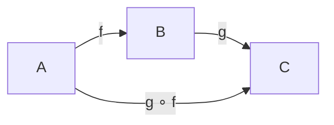

# Глава: Чистые функции, композиция и pipe

> [!info] Context
> Первая глава курса по функциональному программированию в TypeScript. Показывает, почему императивный код с мутациями и побочными эффектами трудно тестировать и переиспользовать, и как чистые функции + композиция решают эту проблему. Библиотека fp-ts появляется в конце — как инструмент, а не как цель.
>
> **Предварительные знания:** TypeScript на уровне функций, типов, массивов. Опыт в FP не требуется.

## Overview

Глава строится по цепочке: **боль → чистые функции → композиция → pipe → fp-ts**.

Каждый шаг вводит ровно одну идею, которая решает конкретную проблему предыдущего шага:

1. Грязный код с мутациями и side effects — что с ним не так?
2. Чистые функции — предсказуемые кирпичики без сюрпризов
3. Referential transparency — формальное свойство, которое делает код подставляемым
4. Композиция — способ склеивать чистые функции в цепочки
5. `pipe` — композиция в порядке чтения (слева направо)
6. fp-ts `pipe` и `flow` — готовые инструменты с типобезопасностью

## Deep Dive

### 1. Боль: что не так с этим кодом?

Посмотрите на функцию, которая обрабатывает список пользователей:

```typescript
let activeUsers: string[] = [];

function processUsers(users: { name: string; age: number; active: boolean }[]) {
  for (let i = 0; i < users.length; i++) {
    if (users[i].active) {
      users[i].name = users[i].name.toUpperCase(); // мутация входных данных
      activeUsers.push(users[i].name);              // запись в глобальную переменную
    }
  }
  console.log(`Processed ${activeUsers.length} users`); // side effect
  return activeUsers;
}
```

Проблемы:

- **Мутация входных данных** — вызывающий код не ожидает, что его массив изменится.
- **Зависимость от глобального состояния** — результат зависит от того, сколько раз функцию уже вызывали.
- **Side effect** (`console.log`) — функцию нельзя вызвать "молча", даже в тестах.
- **Нетестируемость** — чтобы протестировать, нужно сбрасывать `activeUsers`, мокать `console.log`, следить за мутациями.

А теперь посмотрите на другую боль — вложенные вызовы:

```typescript
const result = toString(multiply2(add1(parse(trim(input)))));
```

Читать приходится изнутри наружу. Порядок выполнения противоположен порядку чтения. При пяти функциях это ещё терпимо, при десяти — нет.

Обе проблемы решаются одними и теми же инструментами: чистые функции + композиция.

---

### 2. Чистые функции

Чистая функция обладает двумя свойствами:

**Детерминированность** — при одинаковых аргументах всегда возвращает одинаковый результат.

**Отсутствие побочных эффектов** — не изменяет ничего за пределами своей области: не мутирует входные данные, не пишет в консоль, не обращается к сети, не меняет глобальные переменные.

Примеры чистых функций:

```typescript
const add = (a: number, b: number): number => a + b;
const toUpper = (s: string): string => s.toUpperCase();
const head = <A>(xs: readonly A[]): A | undefined => xs[0];
```

Примеры **нечистых** функций:

```typescript
// Недетерминированная — разный результат при одинаковых аргументах
const randomBetween = (min: number, max: number): number =>
  Math.floor(Math.random() * (max - min + 1)) + min;

// Зависит от внешнего состояния
const now = (): number => Date.now();

// Мутирует входные данные
const removeFirst = (arr: number[]): number | undefined => arr.splice(0, 1)[0];

// Side effect — запись в консоль
const greet = (name: string): void => {
  console.log(`Hello, ${name}`);
};
```

> [!important] splice vs slice
> `splice` мутирует массив — это нечистая операция. `slice` возвращает новый массив, оставляя оригинал нетронутым — чистая.
>
> ```typescript
> const xs = [1, 2, 3];
> xs.splice(0, 1); // xs теперь [2, 3] — мутация!
>
> const ys = [1, 2, 3];
> ys.slice(0, 1);   // [1], ys по-прежнему [1, 2, 3]
> ```

---

### 3. Referential transparency

Чистая функция обладает свойством **ссылочной прозрачности** (referential transparency): любой вызов можно заменить его результатом, и поведение программы не изменится.

```typescript
const double = (x: number): number => x * 2;

// Эти два фрагмента эквивалентны:
const a = double(5) + double(5);   // 10 + 10 = 20
const b = 10 + 10;                 // 20
```

Подстановка работает, потому что `double(5)` всегда возвращает `10` и ничего не меняет в окружении.

Теперь попробуем с нечистой функцией:

```typescript
let counter = 0;
const increment = (): number => ++counter;

const x = increment() + increment(); // 1 + 2 = 3
const y = 1 + 1;                     // 2 — не то же самое!
```

Подстановка сломалась: `increment()` возвращает разные значения при каждом вызове. Выражение нельзя заменить результатом — значит, функция **не** referentially transparent.

> [!tip] Практический смысл
> Referential transparency — это не абстрактное свойство. Это гарантия того, что код можно рефакторить механически: выносить выражения в переменные, инлайнить обратно, менять порядок — и ничего не сломается.

---

### 4. Почему чистые функции безопасно композировать

Когда функция чистая, вы знаете о ней **всё**, глядя на сигнатуру:

```typescript
const trim = (s: string): string => s.trim();
const len = (s: string): number => s.length;
```

`trim` берёт строку и возвращает строку. `len` берёт строку и возвращает число. Нет скрытых зависимостей, нет мутаций, нет сюрпризов.

Это значит, что их можно безопасно соединить: результат `trim` передать в `len`:

```typescript
const trimmedLength = (s: string): number => len(trim(s));
```

Если бы `trim` мутировал какое-то глобальное состояние, от которого зависит `len`, композиция была бы хрупкой. Чистота устраняет этот класс багов.

**Тестируемость.** Чистые функции тестируются без моков:

```typescript
// Не нужно мокать console, Date, базу данных
expect(trim("  hello  ")).toBe("hello");
expect(len("hello")).toBe(5);
expect(trimmedLength("  hello  ")).toBe(5);
```

---

### 5. Функциональная композиция

В математике композиция функций записывается как `g ∘ f` и означает: "сначала примени `f`, потом `g`".

Если `f: A → B` и `g: B → C`, то `g ∘ f: A → C`.



Напишем `compose` на TypeScript:

```typescript
const compose = <A, B, C>(
  g: (b: B) => C,
  f: (a: A) => B
) => (a: A): C => g(f(a));
```

Использование:

```typescript
const add1 = (x: number): number => x + 1;
const multiply2 = (x: number): number => x * 2;
const toString = (x: number): string => `${x}`;

const transform = compose(compose(toString, multiply2), add1);
transform(3); // "8" — add1(3)=4, multiply2(4)=8, toString(8)="8"
```

Порядок аргументов в `compose` — **справа налево**: последняя функция в списке выполняется первой. Это соответствует математической нотации, но противоречит тому, как мы читаем код — слева направо.

---

### 6. pipe — композиция в порядке чтения

`pipe` — это `compose` наоборот. Значение проходит через функции **слева направо**, как по конвейеру.

Напишем простую версию:

```typescript
const pipe = <A, B, C>(
  a: A,
  f: (a: A) => B,
  g: (b: B) => C
): C => g(f(a));
```

> [!important] Ключевое отличие от compose
> `pipe` принимает **значение первым аргументом** и сразу вычисляет результат. `compose` принимает только функции и возвращает новую функцию.

Сравните читаемость:

```typescript
// Вложенные вызовы — читаем изнутри наружу
toString(multiply2(add1(1)));

// pipe — читаем сверху вниз, как шаги рецепта
pipe(
  1,          // начальное значение
  add1,       // 1 → 2
  multiply2,  // 2 → 4
  toString    // 4 → "4"
);
```

Во втором варианте порядок чтения совпадает с порядком выполнения. Каждая строка — один шаг трансформации.

Версия с произвольным количеством шагов потребовала бы перегрузок:

```typescript
function pipe<A>(a: A): A;
function pipe<A, B>(a: A, ab: (a: A) => B): B;
function pipe<A, B, C>(a: A, ab: (a: A) => B, bc: (b: B) => C): C;
function pipe<A, B, C, D>(a: A, ab: (a: A) => B, bc: (b: B) => C, cd: (c: C) => D): D;
// ... и так далее
function pipe(a: unknown, ...fns: Function[]): unknown {
  return fns.reduce((acc, fn) => fn(acc), a);
}
```

Именно так устроен `pipe` в fp-ts — через десятки перегрузок для сохранения типобезопасности.

---

### 7. fp-ts: pipe и flow

Библиотека fp-ts предоставляет типобезопасные `pipe` и `flow` из модуля `'fp-ts/function'`.

```typescript
import { pipe, flow } from 'fp-ts/function';
```

#### pipe — немедленное вычисление

`pipe` принимает значение первым аргументом, пропускает его через цепочку функций и возвращает результат:

```typescript
const result = pipe(
  "  Hello World  ",
  (s) => s.trim(),            // "Hello World"
  (s) => s.toLowerCase(),     // "hello world"
  (s) => s.split(" "),        // ["hello", "world"]
  (arr) => arr.length         // 2
); // result === 2
```

#### flow — создание новой функции

`flow` принимает **только функции** (без начального значения) и возвращает их композицию:

```typescript
const wordCount = flow(
  (s: string) => s.trim(),
  (s) => s.toLowerCase(),
  (s) => s.split(" "),
  (arr) => arr.length
);

wordCount("  Hello World  "); // 2
wordCount("One Two Three");   // 3
```

`flow` — это point-free стиль: мы описываем трансформацию, не упоминая конкретное значение.

#### Сравнение

| Свойство | `pipe` | `flow` |
|---|---|---|
| Первый аргумент | значение | функция |
| Возвращает | результат вычисления | новую функцию |
| Когда вычисляется | сразу | при вызове результата |
| Использование | одноразовое преобразование | создание переиспользуемой функции |

> [!tip] Когда что использовать
> Используйте `pipe`, когда значение уже есть и нужно его трансформировать. Используйте `flow`, когда нужно создать функцию для повторного применения — например, как аргумент `map` или для экспорта из модуля.

```typescript
// pipe — значение есть прямо сейчас
const trimmed = pipe(userInput, trim, toLowerCase);

// flow — создаём функцию для будущего использования
const normalize = flow(trim, toLowerCase);
const results = inputs.map(normalize);
```

---

### 8. Практический пример: нормализация username

Задача: пользователь вводит имя. Нужно убрать пробелы, привести к нижнему регистру, заменить пробелы на дефисы и проверить длину.

#### Императивный подход

```typescript
function normalizeUsername(input: string): string | null {
  let trimmed = input.trim();
  let lower = trimmed.toLowerCase();
  let slug = lower.replace(/\s+/g, "-");
  if (slug.length < 3 || slug.length > 20) {
    return null;
  }
  return slug;
}
```

Работает, но каждый шаг зависит от переменной из предыдущей строки. Промежуточные переменные (`trimmed`, `lower`, `slug`) нужны только для передачи значений — это шум.

#### Чистые функции + pipe

Сначала определяем маленькие чистые функции:

```typescript
const trim = (s: string): string => s.trim();
const toLower = (s: string): string => s.toLowerCase();
const replaceSpaces = (s: string): string => s.replace(/\s+/g, "-");
const validateLength = (min: number, max: number) =>
  (s: string): string | null =>
    s.length >= min && s.length <= max ? s : null;
```

Теперь собираем pipeline:

```typescript
import { pipe } from 'fp-ts/function';

const normalizeUsername = (input: string): string | null =>
  pipe(
    input,
    trim,
    toLower,
    replaceSpaces,
    validateLength(3, 20)
  );
```

Каждый шаг — одна строка. Порядок чтения = порядок выполнения. Каждую функцию можно протестировать отдельно.

Вариант с `flow` для переиспользования:

```typescript
import { flow } from 'fp-ts/function';

const normalizeUsername = flow(
  trim,
  toLower,
  replaceSpaces,
  validateLength(3, 20)
);

// Можно использовать как обычную функцию
normalizeUsername("  John Doe  ");  // "john-doe"
normalizeUsername("Ab");            // null
```

---

### 9. Типичные заблуждения

**"Нечистая функция = плохая функция"**

Нет. Программа, которая не делает ничего наблюдаемого (не пишет в файл, не отправляет запрос, не рисует UI), бесполезна. Side effects неизбежны. Суть в том, чтобы **изолировать** их: чистое ядро бизнес-логики + тонкая оболочка с эффектами. В следующих главах fp-ts даст инструменты для этого (`IO`, `Task`, `TaskEither`).

**"FP — это всегда сложнее"**

`pipe(value, trim, toLower, validate)` проще, чем цепочка промежуточных переменных или вложенные вызовы. Сложность FP появляется в абстракциях (функторы, монады), но базовые инструменты — чистые функции и pipe — упрощают код.

**"pipe и compose — одно и то же"**

Не одно. `compose` выполняет функции справа налево и возвращает новую функцию. `pipe` выполняет слева направо и принимает значение. В fp-ts `compose` нет — вместо него используется `flow`, который работает слева направо, но, как и `compose`, возвращает функцию, а не результат.

---

### 10. Что дальше

Чистые функции и pipe — это фундамент. Но в реальном коде есть значения, которые могут отсутствовать (`null`/`undefined`), операции, которые могут упасть с ошибкой, и асинхронные вызовы. Работать с этим через `string | null` и `try/catch` быстро становится хрупко.

В следующих главах курса появятся контейнерные типы:

- **Option** — безопасная работа с отсутствующими значениями (замена `null`)
- **Either** — обработка ошибок без `try/catch`
- **TaskEither** — асинхронные операции с ошибками

Все они работают через тот же `pipe`, который вы уже знаете. Чистота функций, которую мы обсудили, — это предусловие для того, чтобы `map`, `chain` и другие операции на этих типах были предсказуемыми.

## Related Topics

- [[01-javascript/patterns/fp/mostly-adequate-guide-to-fp/ch03-pure-functions/ch03-pure-functions|Чистые функции — Mostly Adequate Guide]]
- [[02-typescript/fp-ts/fp-ts-turorial/1.pipe-and-flow|pipe и flow — fp-ts Tutorial]]
- [[02-typescript/fp-course/02-types-adt-option/types-adt-option|Следующая глава: Типы, ADT и Option]]
- [[02-typescript/fp-ts/mostly-adequate/ch04-currying/ch04-currying|Каррирование]]

## Sources

- [fp-ts documentation — Getting Started](https://gcanti.github.io/fp-ts/getting-started/)
- [fp-ts/function module](https://gcanti.github.io/fp-ts/modules/function.ts.html)
- Professor Frisby's Mostly Adequate Guide to FP — Chapter 3: Pure Happiness with Pure Functions
- [Introduction to fp-ts — pipe and flow (YouTube)](https://www.youtube.com/watch?v=WsKEIFirdVc)

---

*Глава написана моделью claude-opus-4-6 (Opus 4.6)*
