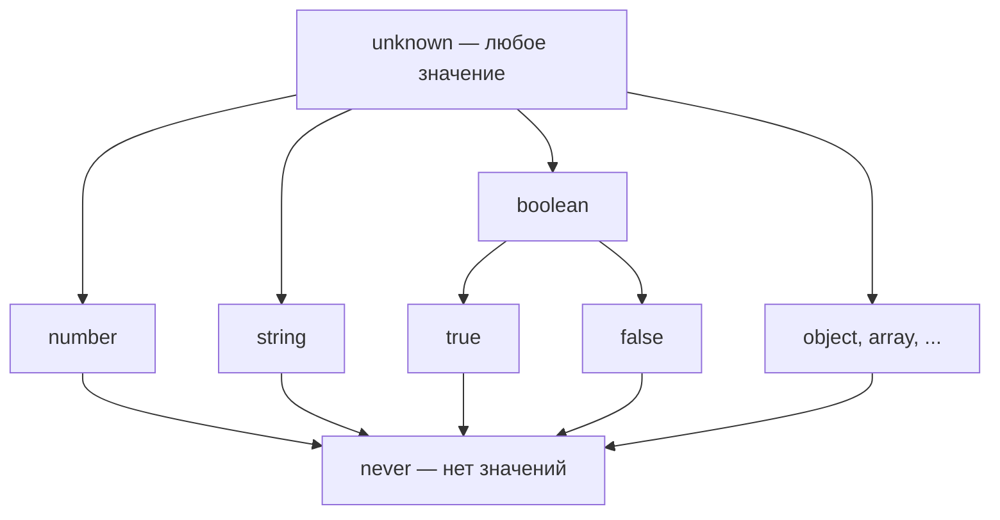

# Глава: Типы как множества, ADT и Option

> [!info] Context
> Вторая глава курса по функциональному программированию в TypeScript. Показывает, почему `null`/`undefined` — источник багов, вводит взгляд на типы как на множества значений, строит интуицию о Product и Sum types, и приводит к Option — первому "умному контейнеру" из fp-ts.
>
> **Пререквизиты:** [[pure-functions-and-pipe]]

## Overview

Глава строится по цепочке: **боль null → типы как множества → Product types → Sum types → ADT → самописный Option → fp-ts Option**.

Каждый шаг решает конкретную проблему предыдущего:

1. `null`/`undefined` ломают код в runtime — нужен способ сделать отсутствие значения явным
2. Типы — это множества значений, и эта идея позволяет конструировать новые типы из существующих
3. Product types комбинируют типы через "И" — мощность перемножается
4. Sum types комбинируют через "ИЛИ" — мощность складывается
5. ADT = Product + Sum — инструмент для точного моделирования предметной области
6. Option — конкретный ADT, который делает отсутствие значения видимым в системе типов

## Deep Dive

### 1. Боль: null и undefined

Этот код знаком каждому:

```typescript
function getUserEmail(user: { profile?: { email?: string } }): string {
  return user.profile.email.toLowerCase();
  //     ^^^^^^^^^^^^ TypeError: Cannot read properties of undefined
}
```

Runtime-ошибка, которую компилятор не поймал. В JavaScript `null` и `undefined` — легальные значения для любого объекта, и они молча пробираются через код, пока не взорвутся в самом неожиданном месте.

Типичная защита — пирамида проверок:

```typescript
function getUserEmail(user: { profile?: { email?: string } }): string | null {
  if (user != null && user.profile != null && user.profile.email != null) {
    return user.profile.email.toLowerCase();
  }
  return null;
}
```

TypeScript добавил optional chaining, который упрощает синтаксис:

```typescript
function getUserEmail(user: { profile?: { email?: string } }): string | undefined {
  return user.profile?.email?.toLowerCase();
}
```

Стало чище, но проблема осталась: возвращаемый тип `string | undefined`, и **вызывающий код может забыть обработать `undefined`**. Компилятор не заставит — `undefined` молча пролезет дальше по цепочке.

> [!important] Billion Dollar Mistake
> Tony Hoare, изобретатель `null` в языке ALGOL W (1965), позже назвал это своей "ошибкой на миллиард долларов":
>
> *"I call it my billion-dollar mistake. It was the invention of the null reference in 1965... This has led to innumerable errors, vulnerabilities, and system crashes."*
>
> Проблема не в самом значении "ничего", а в том, что `null` — невидимый обитатель каждого типа. Вы ожидаете `string`, а получаете `null`, и узнаёте об этом только в runtime.

Optional chaining (`?.`) решает **синтаксическую** проблему — убирает вложенные `if`. Но он не решает **семантическую** проблему: тип `string | undefined` не заставляет программиста обработать случай отсутствия. Нужен механизм, который делает это на уровне системы типов.

---

### 2. Тип = множество значений

Чтобы понять, как построить такой механизм, посмотрим на типы под другим углом.

**Тип — это множество допустимых значений.** Когда вы пишете `const x: boolean`, вы говорите: "x может быть одним из элементов множества {true, false}". Мощность этого множества — 2.

```typescript
// Мощность 2: {true, false}
type Bool = boolean;

// Мощность 3: {'red', 'yellow', 'green'}
type TrafficLight = 'red' | 'yellow' | 'green';

// Мощность 1: {undefined}
type Unit = undefined;

// Мощность 0: пустое множество — значений не существует
type Empty = never;
```

Особые случаи на границах:

- `never` — пустое множество. Нет значений, которые имеют тип `never`. Функция, возвращающая `never`, не может завершиться нормально (бросает исключение или зацикливается).
- `unknown` — универсальное множество. Любое значение имеет тип `unknown`, но с ним нельзя ничего делать без сужения типа.



Эта модель — не метафора. TypeScript буквально так работает: оператор `|` создаёт объединение множеств, `&` — пересечение. `never` — нейтральный элемент для `|` (как 0 для сложения), `unknown` — нейтральный для `&` (как 1 для умножения).

```typescript
type A = string | never;    // string — объединение с пустым множеством
type B = string & unknown;  // string — пересечение с универсальным множеством
```

> [!tip] Зачем думать о мощности?
> Мощность типа показывает, сколько состояний может принимать значение. Чем точнее тип описывает реальные состояния, тем меньше невозможных состояний нужно обрабатывать в коде. "Make illegal states unrepresentable" — один из центральных принципов типобезопасного проектирования.

---

### 3. Product types (И)

Product type комбинирует несколько типов через "И" — значение содержит **все** поля одновременно.

```typescript
interface User {
  name: string;
  active: boolean;
}
```

Сколько разных значений `User` существует? Для каждого значения `name` (множество `string`) можно выбрать любое значение `active` (true или false). Мощность = |string| * 2. Отсюда название — **произведение** типов.

С конечными типами это нагляднее:

```typescript
type Cell = [boolean, boolean];
// Все возможные значения:
// [false, false]
// [false, true]
// [true, false]
// [true, true]
// Мощность = 2 × 2 = 4
```

```typescript
type Config = {
  mode: 'dev' | 'prod';
  verbose: boolean;
  level: 1 | 2 | 3;
};
// Мощность = 2 × 2 × 3 = 12
```

Формы product types в TypeScript:

| Форма | Пример | Мощность |
|---|---|---|
| interface / type с полями | `{ a: A; b: B }` | \|A\| * \|B\| |
| tuple | `[A, B]` | \|A\| * \|B\| |
| class | `class C { a: A; b: B }` | \|A\| * \|B\| |

**Аналогия:** анкета, в которой нужно заполнить **все** поля. Каждое поле — независимый выбор, итого комбинаций = произведение вариантов по каждому полю.

---

### 4. Sum types (ИЛИ)

Sum type комбинирует типы через "ИЛИ" — значение является **одним из** вариантов.

```typescript
type Shape =
  | { _tag: 'Circle'; radius: number }
  | { _tag: 'Rectangle'; width: number; height: number };
```

Сколько значений? Все возможные `Circle` **плюс** все возможные `Rectangle`. Мощность = |Circle| + |Rectangle|. Отсюда название — **сумма** типов.

Поле `_tag` — **дискриминант**. Оно позволяет TypeScript (и программисту) определить, с каким вариантом мы имеем дело:

```typescript
function area(shape: Shape): number {
  switch (shape._tag) {
    case 'Circle':
      return Math.PI * shape.radius ** 2;
    case 'Rectangle':
      return shape.width * shape.height;
  }
}
```

TypeScript сужает тип в каждой ветке `switch`: внутри `case 'Circle'` доступен `radius`, внутри `case 'Rectangle'` — `width` и `height`.

#### Exhaustive checking

Что если мы добавим новый вариант, но забудем обработать его?

```typescript
type Shape =
  | { _tag: 'Circle'; radius: number }
  | { _tag: 'Rectangle'; width: number; height: number }
  | { _tag: 'Triangle'; base: number; height: number };

function area(shape: Shape): number {
  switch (shape._tag) {
    case 'Circle':
      return Math.PI * shape.radius ** 2;
    case 'Rectangle':
      return shape.width * shape.height;
    default: {
      // Если все варианты обработаны, shape здесь имеет тип never.
      // Если какой-то вариант пропущен — ошибка компиляции.
      const _exhaustive: never = shape;
      return _exhaustive;
    }
  }
}
// Ошибка: Type '{ _tag: "Triangle"; ... }' is not assignable to type 'never'
```

Присвоение в `never` работает как проверка полноты: компилятор гарантирует, что все ветки обработаны. Это и есть практическое применение типа `never`.

**Аналогия:** меню в ресторане — вы выбираете **одно** блюдо из списка.

---

### 5. ADT = Product + Sum

Теперь можно дать определение.

**Algebraic Data Type (ADT)** — тип, сконструированный из других типов через операции произведения (Product) и суммы (Sum).

Название "алгебраический" — потому что типы подчиняются тем же правилам, что и числа в алгебре:

| Алгебра чисел | Алгебра типов |
|---|---|
| 0 | `never` |
| 1 | `undefined` (unit) |
| a + b | `A \| B` (sum type) |
| a × b | `{ a: A; b: B }` (product type) |
| a × 0 = 0 | `{ a: A } & never = never` |
| a + 0 = a | `A \| never = A` |

Зачем это нужно на практике? ADT позволяют точно моделировать предметную область:

```typescript
// Состояния заказа — sum type
type Order =
  | { _tag: 'Draft'; items: Item[] }
  | { _tag: 'Placed'; items: Item[]; placedAt: Date }
  | { _tag: 'Shipped'; items: Item[]; trackingId: string }
  | { _tag: 'Delivered'; items: Item[]; deliveredAt: Date }
  | { _tag: 'Cancelled'; reason: string };

// Каждый вариант — product type (конкретные поля для этого состояния)
// Невозможно создать заказ со статусом "Shipped" без trackingId
```

Это заставляет обработать каждое состояние явно и делает невозможными некорректные комбинации.

---

### 6. Самописный Option

Теперь применим ADT к проблеме из раздела 1. Нам нужен тип, который явно говорит: "здесь может быть значение, а может не быть".

```typescript
interface Some<A> {
  readonly _tag: 'Some';
  readonly value: A;
}

interface None {
  readonly _tag: 'None';
}

type Option<A> = Some<A> | None;
```

`Option<A>` — это sum type с двумя вариантами: `Some<A>` (значение есть) и `None` (значения нет). Дискриминант `_tag` позволяет различать варианты.

Конструкторы:

```typescript
const some = <A>(value: A): Option<A> => ({ _tag: 'Some', value });
const none: Option<never> = { _tag: 'None' };
```

Теперь реализуем три базовые операции.

#### map — трансформировать значение внутри

Если внутри `Some` — применить функцию. Если `None` — вернуть `None`.

```typescript
const map = <A, B>(f: (a: A) => B) =>
  (option: Option<A>): Option<B> => {
    switch (option._tag) {
      case 'None': return none;
      case 'Some': return some(f(option.value));
    }
  };
```

```typescript
const double = (n: number): number => n * 2;

map(double)(some(5));  // some(10)
map(double)(none);     // none
```

`map` позволяет трансформировать значение, не "доставая" его из контейнера и не проверяя, есть ли оно. Если значения нет — функция просто не вызывается.

#### getOrElse — извлечь значение или подставить default

```typescript
const getOrElse = <A>(defaultValue: () => A) =>
  (option: Option<A>): A => {
    switch (option._tag) {
      case 'None': return defaultValue();
      case 'Some': return option.value;
    }
  };
```

```typescript
getOrElse(() => 0)(some(42));  // 42
getOrElse(() => 0)(none);      // 0
```

`defaultValue` — функция (а не значение), чтобы default вычислялся лениво, только когда он действительно нужен.

#### match — обработать оба случая

```typescript
const match = <A, B>(onNone: () => B, onSome: (a: A) => B) =>
  (option: Option<A>): B => {
    switch (option._tag) {
      case 'None': return onNone();
      case 'Some': return onSome(option.value);
    }
  };
```

```typescript
const describe = match(
  () => 'значение отсутствует',
  (n: number) => `значение: ${n}`
);

describe(some(42));  // "значение: 42"
describe(none);      // "значение отсутствует"
```

`match` — это pattern matching: вы обязаны обработать оба варианта, иначе код не скомпилируется.

> [!tip] Ключевое отличие от `| null`
> Тип `string | null` позволяет забыть проверку — TypeScript не заставит. `Option<string>` с `match` или `map` заставляет обработать оба случая: значение есть и значения нет. Ошибка ловится при компиляции, а не в runtime.

---

### 7. fp-ts Option

Библиотека fp-ts предоставляет готовый `Option` с теми же идеями, но богатым набором утилит.

```typescript
import * as O from 'fp-ts/Option';
import { pipe } from 'fp-ts/function';
```

#### Создание

```typescript
O.some(5);          // { _tag: 'Some', value: 5 }
O.none;             // { _tag: 'None' }
```

#### fromNullable — мост из nullable мира

Реальный код полон nullable значений: ответы API, DOM-элементы, опциональные конфиги. `fromNullable` конвертирует `null | undefined` в `Option`:

```typescript
O.fromNullable(42);        // O.some(42)
O.fromNullable(null);      // O.none
O.fromNullable(undefined); // O.none
```

Это точка входа из "обычного" TypeScript в мир `Option`.

#### map — трансформация внутри

```typescript
pipe(
  O.some(5),
  O.map(n => n * 2)    // O.some(10)
);

pipe(
  O.none,
  O.map(n => n * 2)    // O.none — функция не вызывается
);
```

`O.map` принимает функцию и возвращает функцию `Option<A> → Option<B>` — идеально для `pipe`.

#### getOrElse — извлечение с default

```typescript
pipe(
  O.some(42),
  O.getOrElse(() => 0)   // 42
);

pipe(
  O.none,
  O.getOrElse(() => 0)   // 0
);
```

#### match — pattern matching

```typescript
pipe(
  O.some(42),
  O.match(
    () => 'пусто',
    (n) => `число: ${n}`
  )
); // "число: 42"
```

`O.match` (в старых версиях fp-ts — `O.fold`) принимает два обработчика: для `None` и для `Some`. Оба обязательны.

#### fromPredicate — создание из условия

```typescript
const isPositive = (n: number): boolean => n > 0;

const getPositive = O.fromPredicate(isPositive);

getPositive(5);   // O.some(5)
getPositive(-3);  // O.none
```

`fromPredicate` создаёт "умный конструктор": значение попадает в `Some`, только если удовлетворяет предикату. Удобно для валидации в pipe-цепочках:

```typescript
pipe(
  someNumber,
  O.fromPredicate(n => n > 0),
  O.map(n => n * 100),
  O.getOrElse(() => 0)
);
```

---

### 8. Практический пример

Задача: получить email пользователя из вложенного объекта, привести к нижнему регистру, обрезать пробелы.

```typescript
interface Address {
  email?: string;
}

interface Profile {
  address?: Address;
}

interface User {
  name: string;
  profile?: Profile;
}
```

#### (а) Императивная версия с null-checks

```typescript
function getNormalizedEmail(user: User): string {
  if (user.profile != null) {
    if (user.profile.address != null) {
      if (user.profile.address.email != null) {
        return user.profile.address.email.trim().toLowerCase();
      }
    }
  }
  return 'no email';
}
```

Три уровня вложенности ради одного значения. Каждый `if` — ручная проверка, которую легко забыть.

#### (б) Optional chaining

```typescript
function getNormalizedEmail(user: User): string {
  return user.profile?.address?.email?.trim().toLowerCase() ?? 'no email';
}
```

Гораздо короче. Но возвращаемый тип скрывает возможное отсутствие — если убрать `?? 'no email'`, получим `string | undefined`, и вызывающий код может проигнорировать `undefined`.

#### (в) fp-ts Option через pipe

```typescript
import * as O from 'fp-ts/Option';
import { pipe } from 'fp-ts/function';

const getNormalizedEmail = (user: User): string =>
  pipe(
    O.fromNullable(user.profile),
    O.map(profile => profile.address),
    O.chain(O.fromNullable),                // Option<Option<Address>> → Option<Address>
    O.map(address => address.email),
    O.chain(O.fromNullable),                // Option<Option<string>> → Option<string>
    O.map(email => email.trim().toLowerCase()),
    O.getOrElse(() => 'no email')
  );
```

> [!warning] О chain
> Здесь используется `O.chain`, который мы ещё не изучали формально — это тема следующих глав. Пока достаточно понимать: если `map` даёт `Option<Option<A>>` (вложенный Option), то `chain` "схлопывает" два уровня в один. Без `chain` этот пример можно переписать через `O.flatten`:
>
> ```typescript
> O.map(profile => profile.address),    // Option<Address | undefined>
> O.map(O.fromNullable),               // Option<Option<Address>>
> O.flatten,                           // Option<Address>
> ```

Почему версия (в) лучше:

- **Тип обязывает**: `O.getOrElse` в конце — единственная точка, где мы решаем, что делать при отсутствии значения. Нельзя случайно пропустить обработку.
- **Линейная читаемость**: каждый шаг — одна строка в `pipe`. Нет вложенности.
- **Композируемость**: каждый шаг можно заменить, убрать или добавить новый, не трогая остальные.

---

### 9. Типичные заблуждения

**"Option — это просто обёртка над null"**

Нет. `string | null` — это plain union, который не заставляет вас обработать случай `null`. Вы можете передать `string | null` в функцию, принимающую `string`, и TypeScript не всегда это поймает (особенно без `strictNullChecks`). `Option<string>` — другой тип. Его нельзя передать туда, где ожидается `string`. Чтобы извлечь значение, нужно явно вызвать `match`, `getOrElse` или `map` — и обработать случай `None`.

**"Optional chaining заменяет Option"**

`?.` решает синтаксическую проблему — убирает пирамиду `if`. Но результат `user?.profile?.email` имеет тип `string | undefined`, и TypeScript **не заставит** вызывающий код обработать `undefined`. С `Option` отсутствие значения — часть типа, которую нельзя проигнорировать без явного действия.

**"never бесполезен"**

`never` необходим для exhaustive checking (раздел 4). Присвоение в `never` в default-ветке `switch` гарантирует, что все варианты sum type обработаны. При добавлении нового варианта компилятор покажет ошибку — до того, как код попадёт в runtime.

---

### 10. Что дальше

В этой главе `O.map` применяет функцию к значению внутри `Option`. Но `map` — это не уникальная операция для `Option`. Точно такой же `map` есть у `Array`, `Either`, `Task` и многих других типов.

Что между ними общего? Почему `map` для `Array` и `map` для `Option` выглядят одинаково? В следующей главе ответим на этот вопрос — и узнаем, что у этого паттерна есть имя.

## Related Topics

- [[pure-functions-and-pipe]]
- [[15.ADT,Pattern-Matching]]
- [[22.functor]]
- [[2.Option]]

## Sources

- [fp-ts documentation — Option](https://gcanti.github.io/fp-ts/modules/Option.ts.html)
- [fp-ts Tutorial — Option (YouTube)](https://www.youtube.com/watch?v=Xh05ynb-DAo)
- [Tony Hoare — Null References: The Billion Dollar Mistake](https://www.infoq.com/presentations/Null-References-The-Billion-Dollar-Mistake-Tony-Hoare/)
- Introduction to Functional Programming using TypeScript — Giulio Canti

---

*Глава написана моделью claude-opus-4-6 (Opus 4.6)*
