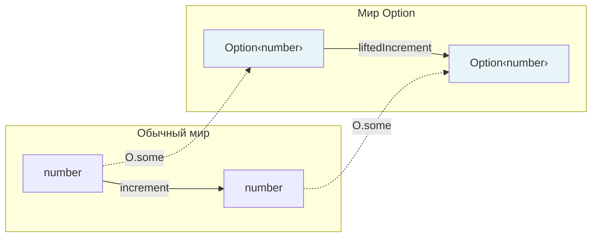

# Глава: Функтор — обобщение map

> [!info] Context
> Третья глава курса по функциональному программированию в TypeScript. Показывает, что `map` — это не уникальная операция для массивов или Option, а универсальный паттерн, у которого есть имя — **функтор**. Вводит Either, формулирует два закона функтора и показывает единый интерфейс `map` в fp-ts.
>
> **Пререквизиты:** [[pure-functions-and-pipe]], [[types-adt-option]]

## Overview

Глава строится по цепочке: **дублирование map → наблюдение паттерна → Either как ещё один пример → обобщение → имя и определение → законы → fp-ts → lifting**.

К концу главы вы будете знать:

- Почему `Array.map`, `Option.map` и `Either.map` — это одна и та же идея
- Что такое функтор и какие два закона он должен соблюдать
- Зачем нужны законы и что ломается без них
- Как fp-ts предоставляет единый интерфейс `map` для разных контейнеров
- Что такое lifting и как читать `map` двумя способами

## Deep Dive

### 1. Боль: дублирование map

В главе 2 мы написали `map` для Option:

```typescript
const mapOption = <A, B>(f: (a: A) => B) =>
  (option: Option<A>): Option<B> => {
    switch (option._tag) {
      case 'None': return none;
      case 'Some': return some(f(option.value));
    }
  };
```

А `Array.map` вы знаете с JavaScript:

```typescript
const mapArray = <A, B>(f: (a: A) => B) =>
  (arr: readonly A[]): readonly B[] => arr.map(f);
```

Поставьте эти две функции рядом. Обе принимают функцию `(A) => B`. Обе применяют её к значениям "внутри" контейнера. Обе возвращают контейнер того же типа, но с трансформированным содержимым. Структурное сходство очевидно — но мы написали две отдельные реализации. Если завтра появится третий контейнер, придётся писать третью.

Что между ними общего? И можно ли дать этому общему имя?

---

### 2. Array.map как отправная точка

`Array.map` — знакомая операция. Разложим её на составные части:

- **Контейнер**: `Array<A>` — хранит ноль или более значений типа `A`
- **Функция**: `(a: A) => B` — трансформирует каждое значение
- **Результат**: `Array<B>` — новый массив того же размера, с трансформированными значениями

Ключевое свойство: мы не "достаём" элементы, обрабатываем и "кладём обратно". Мы работаем с ними **внутри** контейнера. Структура контейнера (количество элементов, их порядок) сохраняется.

```typescript
[1, 2, 3].map(x => x * 2);   // [2, 4, 6]  — три элемента → три элемента
[].map(x => x * 2);            // []          — пустой → пустой
```

Пустой массив — особый случай: функция ни разу не вызывается, результат — пустой массив.

---

### 3. Option.map — тот же паттерн

Из главы 2 мы знаем: `Option<A>` — это контейнер, который хранит ноль или одно значение. `map` работает так: если значение есть (`Some`) — применить функцию, если нет (`None`) — вернуть `None`.

Параллель с массивом:

| Array | Option | Что происходит |
|---|---|---|
| `[].map(f)` → `[]` | `none` → `none` через `map(f)` | Пусто — функция не вызвалась |
| `[5].map(f)` → `[f(5)]` | `some(5)` → `some(f(5))` через `map(f)` | Есть значение — функция применилась |
| `[1,2,3].map(f)` → `[f(1),f(2),f(3)]` | — | Несколько значений (Option так не умеет) |

`None` — аналог пустого массива. `Some(x)` — аналог массива из одного элемента. В обоих случаях `map` сохраняет структуру контейнера и трансформирует только содержимое.

```typescript
const double = (n: number): number => n * 2;

mapOption(double)(some(5));   // some(10)
mapOption(double)(none);      // none

mapArray(double)([5]);        // [10]
mapArray(double)([]);         // []
```

---

### 4. Either — ещё один контейнер

Option говорит: "значение есть или его нет". Но **почему** его нет — Option не объясняет. `None` — это молчание.

Either добавляет причину:

```typescript
interface Left<E> {
  readonly _tag: 'Left';
  readonly left: E;
}

interface Right<A> {
  readonly _tag: 'Right';
  readonly right: A;
}

type Either<E, A> = Left<E> | Right<A>;
```

- `Right<A>` — успешное значение (аналог `Some`)
- `Left<E>` — ошибка с описанием (аналог `None`, но с информацией)

Конструкторы:

```typescript
const left = <E>(e: E): Either<E, never> => ({ _tag: 'Left', left: e });
const right = <A>(a: A): Either<never, A> => ({ _tag: 'Right', right: a });
```

> [!tip] Мнемоника: Right = правильный
> `Right` по-английски — "правый" и "правильный". Успешное значение живёт в `Right`. Ошибка — в `Left`.

Напишем `map` для Either:

```typescript
const mapEither = <A, B>(f: (a: A) => B) =>
  <E>(fa: Either<E, A>): Either<E, B> => {
    switch (fa._tag) {
      case 'Left': return fa;           // ошибку не трогаем
      case 'Right': return right(f(fa.right));  // трансформируем значение
    }
  };
```

`map` работает только по `Right`. `Left` проходит нетронутым — точно как `None` в Option.

```typescript
mapEither((x: number) => x + 1)(right(5));
// right(6)

mapEither((x: number) => x + 1)(left('деление на ноль'));
// left('деление на ноль') — функция не вызвалась
```

Аналогия:

| Option | Either | Смысл |
|---|---|---|
| `None` | `Left<E>` | "Нет значения" (Either ещё и объясняет почему) |
| `Some<A>` | `Right<A>` | "Есть значение" |
| `map` по `Some`, пропуск `None` | `map` по `Right`, пропуск `Left` | Одинаковое поведение |

---

### 5. Наблюдение: паттерн один и тот же

Три контейнера. Три реализации `map`. Одна структура:

```typescript
// Array
map: <A, B>(f: (a: A) => B) => (fa: Array<A>)     => Array<B>

// Option
map: <A, B>(f: (a: A) => B) => (fa: Option<A>)    => Option<B>

// Either (зафиксировав E)
map: <A, B>(f: (a: A) => B) => (fa: Either<E, A>) => Either<E, B>
```

Если обозначить контейнер как `F`, получаем общую сигнатуру:

```typescript
map: <A, B>(f: (a: A) => B) => (fa: F<A>) => F<B>
```

Поведение тоже одинаковое:

| Контейнер | "Пустой" случай | "Полный" случай |
|---|---|---|
| `Array` | `[]` → `[]` | Применить `f` к каждому элементу |
| `Option` | `None` → `None` | Применить `f` к значению внутри `Some` |
| `Either` | `Left(e)` → `Left(e)` | Применить `f` к значению внутри `Right` |

Во всех случаях `map` **сохраняет структуру контейнера** и трансформирует только содержимое.

---

### 6. Имя паттерна: Functor

Теперь можно дать определение.

> [!important] Определение
> **Функтор** — это тип-конструктор `F`, для которого определена операция `map`:
>
> ```typescript
> map: <A, B>(f: (a: A) => B) => (fa: F<A>) => F<B>
> ```
>
> Любой тип, для которого можно написать корректный `map`, — это функтор.

"Корректный" — ключевое слово. Не любая функция с подходящей сигнатурой является `map`. Корректный `map` должен подчиняться двум законам.

---

### 7. Два закона функтора

#### Закон identity

`map` с функцией-тождеством не должен ничего менять:

```typescript
map(x => x) === identity
```

Проверим для Option:

```typescript
const identity = <A>(x: A): A => x;

// Some
mapOption(identity)(some(42));  // some(42) ✓
// None
mapOption(identity)(none);      // none     ✓
```

Проверим для Either:

```typescript
mapEither(identity)(right(42));           // right(42)           ✓
mapEither(identity)(left('ошибка'));      // left('ошибка')      ✓
```

Интуиция: если функция ничего не делает с содержимым, контейнер не должен измениться. `map` не добавляет побочных эффектов, не меняет структуру, не теряет данные.

#### Закон composition

Два последовательных `map` можно заменить одним `map` со скомпонованной функцией:

```typescript
pipe(fa, map(f), map(g))  ===  pipe(fa, map(x => g(f(x))))
```

Проверим для Option:

```typescript
import { pipe, flow } from 'fp-ts/function';

const double = (n: number): number => n * 2;
const toString = (n: number): string => `${n}`;

// Два прохода
const result1 = pipe(
  some(5),
  mapOption(double),
  mapOption(toString)
);
// some('10')

// Один проход с составной функцией
const result2 = pipe(
  some(5),
  mapOption(x => toString(double(x)))
);
// some('10')

// Результаты одинаковы ✓
```

Проверим для Either:

```typescript
const result3 = pipe(
  right(5) as Either<string, number>,
  mapEither(double),
  mapEither(toString)
);
// right('10')

const result4 = pipe(
  right(5) as Either<string, number>,
  mapEither(x => toString(double(x)))
);
// right('10') ✓

// Для Left тоже работает:
const result5 = pipe(
  left('ошибка') as Either<string, number>,
  mapEither(double),
  mapEither(toString)
);
// left('ошибка')

const result6 = pipe(
  left('ошибка') as Either<string, number>,
  mapEither(x => toString(double(x)))
);
// left('ошибка') ✓
```

#### Зачем нужны законы

Без законов нельзя безопасно рефакторить. Представьте, что у вас в коде:

```typescript
pipe(data, map(parseInput), map(validate), map(format))
```

Вы хотите объединить три шага в один для производительности:

```typescript
pipe(data, map(flow(parseInput, validate, format)))
```

Закон composition гарантирует, что результат будет тем же. Без закона эта оптимизация могла бы сломать программу.

Закон identity гарантирует, что `map(x => x)` можно безопасно удалить — он ничего не делает.

#### Контрпример: Promise

`Promise.then` выглядит как `map`, но нарушает закон composition:

```typescript
// Обычная функция, возвращающая Promise
const f = (x: number): Promise<number> => Promise.resolve(x + 1);

// Если бы Promise был честным функтором:
// map(f)(Promise.resolve(1))  должен дать  Promise<Promise<number>>
// Но .then автоматически "разворачивает" вложенный Promise:
Promise.resolve(1).then(f);  // Promise<number>, не Promise<Promise<number>>
```

Это auto-flattening: `.then` объединяет `map` и `flatten` в одну операцию. Из-за этого `Promise.then(f).then(g)` и `Promise.then(x => g(f(x)))` могут давать разные типы, когда `f` возвращает `Promise`. Promise — **не** корректный функтор.

> [!warning] Promise !== Functor
> `Promise.then` — одновременно и `map`, и `chain` (flatMap). Это удобно на практике, но делает `Promise` неподходящим для строгой функциональной композиции. В fp-ts для асинхронных операций используется `Task`, который разделяет `map` и `chain`.

---

### 8. fp-ts: единый интерфейс

fp-ts предоставляет `map` для каждого функтора через отдельные модули:

```typescript
import * as O from 'fp-ts/Option';
import * as E from 'fp-ts/Either';
import * as A from 'fp-ts/ReadonlyArray';
import { pipe } from 'fp-ts/function';
```

Все работают одинаково через `pipe`:

```typescript
// Option
pipe(O.some(5), O.map(x => x + 1));        // O.some(6)
pipe(O.none, O.map(x => x + 1));            // O.none

// Either
pipe(E.right(5), E.map(x => x + 1));        // E.right(6)
pipe(E.left('err'), E.map(x => x + 1));     // E.left('err')

// ReadonlyArray
pipe([1, 2, 3], A.map(x => x + 1));         // [2, 3, 4]
pipe([], A.map(x => x + 1));                 // []
```

Один паттерн, три контейнера, единообразный синтаксис. Можно менять контейнер — и `pipe`-цепочка остаётся читаемой.

> [!tip] Как fp-ts обобщает map
> Под капотом fp-ts использует type class и кодировку Higher-Kinded Types (HKT), чтобы определить единый интерфейс `Functor` для любого типа-конструктора. Детали этого механизма — в [[17.category-theory|главе 4]].

Для Either в fp-ts `map` трансформирует `Right`, а `Left` пропускает — как мы и реализовали вручную:

```typescript
pipe(
  E.right('hello'),
  E.map(s => s.toUpperCase()),
  E.map(s => s.length)
);
// E.right(5)

pipe(
  E.left('не удалось загрузить' as string),
  E.map((s: string) => s.toUpperCase()),
  E.map((s: string) => s.length)
);
// E.left('не удалось загрузить')
```

---

### 9. Lifting — другой взгляд на map

`map` можно читать двояко:

**Привычный взгляд** — "применить функцию внутри контейнера":

```typescript
// У меня есть Option<number> и функция number => string
// map даёт Option<string>
pipe(O.some(5), O.map(n => `${n}`));  // O.some('5')
```

**Взгляд через lifting** — "поднять функцию в мир контейнеров":

```typescript
// У меня есть функция number => number
const increment = (n: number): number => n + 1;

// map "поднимает" её до Option<number> => Option<number>
const liftedIncrement = O.map(increment);

liftedIncrement(O.some(5));   // O.some(6)
liftedIncrement(O.none);      // O.none
```



В curried форме сигнатура `map` раскрывает этот взгляд:

```typescript
map: (A => B) => (F<A> => F<B>)
//   ^^^^^^^^    ^^^^^^^^^^^^^^^^
//   обычная      "поднятая" функция
//   функция      в мире контейнеров
```

`map` — это мост между двумя мирами. Обычная функция не знает ничего о контейнерах. Через `map` она начинает работать с ними, не теряя своей простоты.

---

### 10. Типичные заблуждения

**"Функтор = контейнер с данными"**

Не обязательно. `IO<A>` (из fp-ts) хранит не значение, а *функцию*, которая при вызове произведёт значение. Тем не менее у `IO` есть корректный `map`. Для начала можно думать о функторе как о контейнере — это полезная интуиция, — но помните, что она не полна.

**"map = forEach / итерация"**

Нет. `forEach` выполняет side effect для каждого элемента и возвращает `void`. `map` **возвращает новый контейнер** с трансформированными значениями. `map` — чистая операция, `forEach` — нет.

```typescript
// map: трансформация, возвращает новый массив
[1, 2, 3].map(x => x * 2);     // [2, 4, 6]

// forEach: side effect, возвращает undefined
[1, 2, 3].forEach(x => console.log(x));  // undefined
```

**"Promise — это функтор"**

Нет. `.then` автоматически разворачивает вложенные Promise (auto-flattening), нарушая закон composition. Подробности — в разделе 7.

**"Законы — формальность, на практике не важны"**

Без закона composition рефакторинг `pipe(fa, map(f), map(g))` → `pipe(fa, map(flow(f, g)))` был бы небезопасен. Без закона identity нельзя было бы удалить `map(x => x)` из цепочки. Законы — это контракт, который позволяет механически преобразовывать код.

---

### 11. Что дальше

`map` применяет функцию `A => B` внутри контейнера. Но что если функция сама возвращает контейнер — `A => Option<B>`? Тогда `map` даст вложенный контейнер:

```typescript
const findUser = (id: number): Option<User> => /* ... */;
const getEmail = (user: User): Option<string> => /* ... */;

pipe(
  findUser(1),
  O.map(getEmail)
);
// Тип: Option<Option<string>> — вложенный контейнер!
```

`Option<Option<string>>` — не то, что нужно. Как "схлопнуть" два уровня в один? Эта операция называется `chain` (или `flatMap`), и она определяет **монаду** — тему главы 5.

Перед этим — глава 4 о теории категорий, которая объяснит *почему* законы функтора именно такие, а не произвольные правила.

> [!tip] За рамками этой главы
> Существуют и другие виды функторов: **Bifunctor** (`bimap` для типов с двумя параметрами, например `Either`), **Contravariant** (`contramap` для "потребителей" значений, например `Predicate`). Их мы рассмотрим позже.

## Related Topics

- [[pure-functions-and-pipe]]
- [[types-adt-option]]
- [[17.category-theory]]
- [[functors-in-fp-ts]]
- [[11.Either]]

## Sources

- [Getting started with fp-ts: Functor](https://dev.to/gcanti/getting-started-with-fp-ts-functor-36ek)
- [fp-ts Option module](https://gcanti.github.io/fp-ts/modules/Option.ts.html)
- [fp-ts Either module](https://gcanti.github.io/fp-ts/modules/Either.ts.html)
- Introduction to Functional Programming using TypeScript — Giulio Canti
- Professor Frisby's Mostly Adequate Guide to FP — Chapter 8: Tupperware

---

*Глава написана моделью claude-opus-4-6 (Opus 4.6)*
