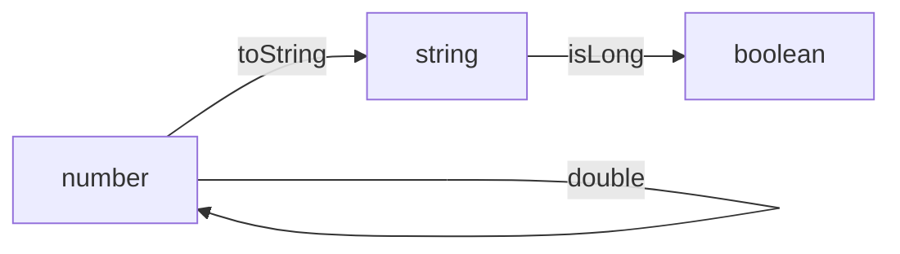
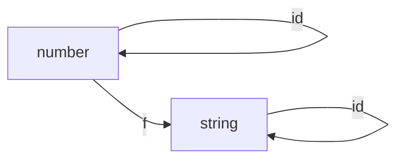
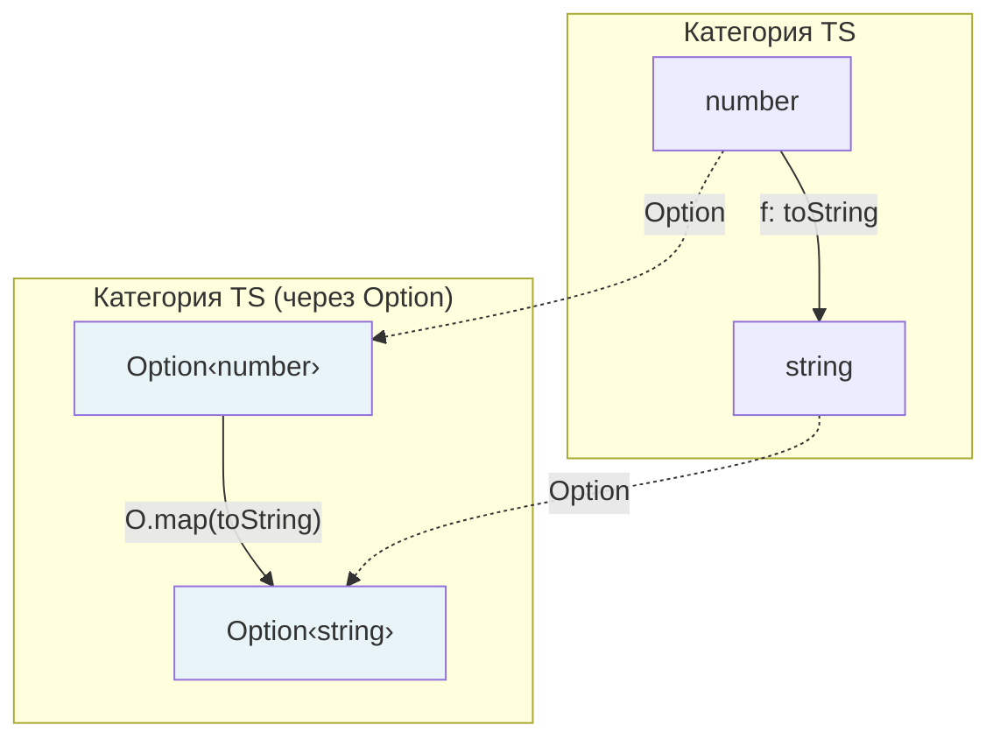
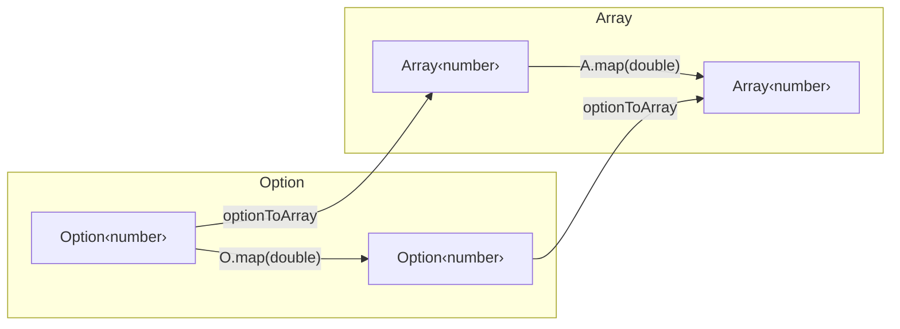
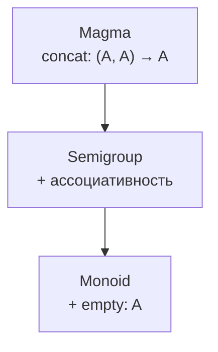
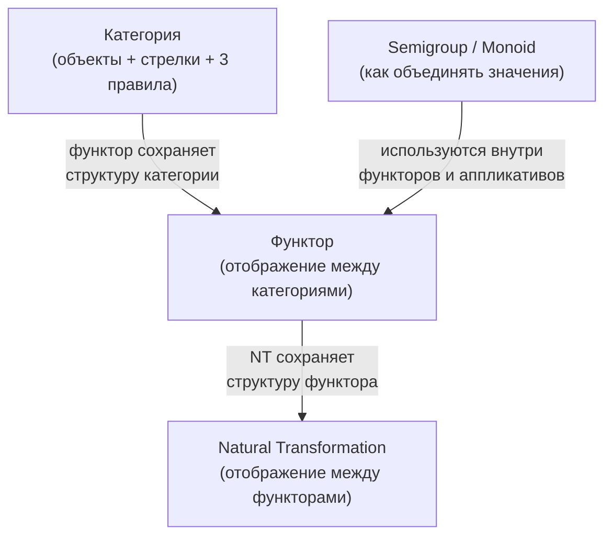

# Глава: Теория категорий через код

> [!info] Context
> Четвёртая глава курса по функциональному программированию в TypeScript. Объясняет теорию категорий ПОСЛЕ того, как студент уже знает функторы. Идём от кода к теории: показываем, что законы функтора — не произвольные правила, а следствие более глубокой структуры. Вводим алгебраические структуры (Semigroup, Monoid) как строительные блоки fp-ts.
>
> **Пререквизиты:** [[pure-functions-and-pipe]], [[types-adt-option]], [[functor]]

## Overview

Вы уже написали `map` для Array, Option и Either. Вы знаете два закона функтора. Но откуда взялись именно эти законы? Почему их два, а не три? Теория категорий отвечает на этот вопрос.

Глава строится по цепочке: **зачем → категория → три правила → функтор как отображение → natural transformation → алгебраические структуры → fp-ts**.

К концу главы вы будете знать:

- Что такое категория и почему TypeScript — это категория
- Откуда берутся законы функтора (из определения функтора в теории категорий)
- Что такое natural transformation и почему вы уже их используете
- Что такое Semigroup и Monoid и зачем они в fp-ts
- Как все эти абстракции связаны между собой

## Deep Dive

### 1. Зачем это нужно

В главе 3 мы сказали: функтор подчиняется двум законам — identity и composition. Но почему именно этим? Почему не закон "map не должен менять длину массива"? Или "map должен быть быстрым"?

Ответ: законы функтора — это не эмпирические наблюдения. Они следуют из определения функтора в теории категорий. Теория категорий объясняет **почему**, а не просто **что**.

> [!tip] Аналогия
> Закон Ньютона F = ma — это не просьба. Это следствие устройства физического мира. Законы функтора — это следствие устройства категорий. Если вы нарушите закон, ваша структура просто не будет функтором — как объект, не подчиняющийся F = ma, не является ньютоновским телом.

---

### 2. Категория: объекты и стрелки

Категория — это коллекция **объектов** и **морфизмов** (стрелок) между ними.

В мире TypeScript:

- **Объекты** — типы (`number`, `string`, `boolean`, `User`, ...)
- **Морфизмы** — функции между типами (`number => string`, `User => boolean`, ...)

```typescript
// Морфизм из number в string
const toString = (n: number): string => `${n}`;

// Морфизм из string в boolean
const isLong = (s: string): boolean => s.length > 5;

// Морфизм из number в number (стрелка из объекта в себя)
const double = (n: number): number => n * 2;
```



Каждая стрелка начинается в одном типе и заканчивается в другом (или в том же самом). Это всё, что нужно знать об объектах и морфизмах.

---

### 3. Три правила категории

Чтобы набор объектов и стрелок стал **категорией**, должны выполняться три правила. Вы их уже знаете — просто под другими именами.

#### Правило 1: Композиция определена

Если есть стрелка `f: A → B` и стрелка `g: B → C`, то существует стрелка `g ∘ f: A → C`.

```typescript
const f = (n: number): string => `${n}`;
const g = (s: string): boolean => s.length > 1;

// Композиция: g ∘ f
const composed = (n: number): boolean => g(f(n));
// Или через flow:
// const composed = flow(f, g);
```

> [!important] Условие
> Композиция возможна только если конец одной стрелки совпадает с началом другой. `f` возвращает `string`, `g` принимает `string` — композиция определена.

#### Правило 2: Ассоциативность

Если есть три стрелки `f: A → B`, `g: B → C`, `h: C → D`, то:

```text
h ∘ (g ∘ f) = (h ∘ g) ∘ f
```

Порядок группировки не важен — результат один и тот же.

```typescript
const f = (n: number): string => `${n}`;
const g = (s: string): string => s + '!';
const h = (s: string): number => s.length;

// Оба варианта дают одинаковый результат:
h(g(f(42)));          // 3
// (h ∘ g) ∘ f  и  h ∘ (g ∘ f) — одно и то же
```

Вы уже знаете это: `pipe(x, f, g, h)` работает одинаково, как бы вы ни расставляли скобки внутри.

#### Правило 3: Тождественный морфизм (identity)

У каждого объекта (типа) есть стрелка "из себя в себя", которая ничего не меняет:

```typescript
const identity = <A>(a: A): A => a;
```

И она нейтральна для композиции:

```typescript
const f = (n: number): string => `${n}`;

// f ∘ identity = f
f(identity(42));     // '42', то же что f(42)

// identity ∘ f = f
identity(f(42));     // '42', то же что f(42)
```



> [!tip] Три правила — одной фразой
> Стрелки можно соединять (композиция), группировка не важна (ассоциативность), у каждого объекта есть "ничего не делающая" стрелка (identity).

---

### 4. TypeScript как категория

Назовём категорию, в которой живёт TypeScript, условно **TS**:

| Категория | Объекты | Морфизмы |
|---|---|---|
| **TS** | Типы (`number`, `string`, `Array<number>`, `Option<string>`, ...) | Чистые функции между типами |

Проверим три правила:

1. **Композиция**: если `f: A => B` и `g: B => C`, то `flow(f, g): A => C` — определена
2. **Ассоциативность**: `flow(f, g, h)` работает одинаково при любой группировке
3. **Identity**: `(x) => x` существует для любого типа

TypeScript — категория. Каждый раз, когда вы пишете `pipe(x, f, g, h)`, вы выполняете последовательность морфизмов в этой категории.

---

### 5. Функтор — отображение между категориями

Теперь самое интересное. Функтор в теории категорий — это **отображение из одной категории в другую**, которое **сохраняет структуру**.

Для наших целей обе категории — это **TS**. Функтор `Option` отображает категорию **TS** в **TS**, но "оборачивает" всё в Option:

| Что отображается | Обычный мир (TS) | Мир Option (TS) |
|---|---|---|
| Объекты (типы) | `number` | `Option<number>` |
| Объекты (типы) | `string` | `Option<string>` |
| Морфизмы (функции) | `f: number => string` | `O.map(f): Option<number> => Option<string>` |

Функтор делает две вещи:

1. **Отображает объекты**: `A` → `F<A>` (тип-конструктор: `number` → `Option<number>`)
2. **Отображает морфизмы**: `f: A => B` → `map(f): F<A> => F<B>` (lifting!)



#### Откуда берутся законы

Функтор **сохраняет структуру**. Что значит "сохранять структуру" категории?

**Сохранить identity**: тождественный морфизм `id: A → A` должен отображаться в тождественный морфизм `map(id): F<A> → F<A>`:

```text
map(identity) = identity
```

Это **закон identity** функтора.

**Сохранить композицию**: если `h = g ∘ f`, то `map(h) = map(g) ∘ map(f)`:

```text
map(g ∘ f) = map(g) ∘ map(f)
```

Это **закон composition** функтора.

Вот и всё. Два закона — не произвольные правила. Это **определение** того, что значит "сохранять структуру категории". Если отображение не сохраняет identity или композицию, оно не является функтором — оно ломает структуру.

> [!important] Ключевое понимание
> Законы функтора — это не дополнительные требования к `map`. Это **само определение** функтора. Функтор = тип-конструктор + map, который сохраняет identity и композицию. Если он этого не делает, это не "плохой функтор", а "не функтор вообще".

---

### 6. Natural Transformation — отображение между функторами

Если функтор — это отображение между категориями, то **natural transformation** — это отображение между функторами.

Звучит абстрактно? Вы уже это делали:

```typescript
import * as O from 'fp-ts/Option';
import * as A from 'fp-ts/ReadonlyArray';
import * as E from 'fp-ts/Either';

// Option → Array
const optionToArray = <A>(o: O.Option<A>): readonly A[] =>
  O.isNone(o) ? [] : [o.value];

// Option → Either
const optionToEither = <E>(onNone: () => E) =>
  <A>(o: O.Option<A>): E.Either<E, A> =>
    O.isNone(o) ? E.left(onNone()) : E.right(o.value);
```

`optionToArray` превращает `Option<A>` в `Array<A>` для **любого** `A`. Это natural transformation из функтора `Option` в функтор `Array`.

Важное свойство (закон natural transformation):

```text
map_Array(f) ∘ optionToArray = optionToArray ∘ map_Option(f)
```

Не важно, когда вы конвертируете: до `map` или после — результат одинаковый.

```typescript
import { pipe } from 'fp-ts/function';

const double = (n: number): number => n * 2;

// Путь 1: сначала map в Option, потом конвертировать в Array
const path1 = pipe(O.some(5), O.map(double), optionToArray);
// [10]

// Путь 2: сначала конвертировать в Array, потом map
const path2 = pipe(O.some(5), optionToArray, A.map(double));
// [10]

// Результат одинаковый — это и есть закон natural transformation
```



Диаграмма **коммутирует**: оба пути от верхнего левого угла к нижнему правому дают один результат.

#### Примеры из fp-ts

fp-ts полон natural transformations:

```typescript
// Option → Either (с указанием ошибки)
O.toEither(() => 'not found');

// Either → Option (отбрасывая информацию об ошибке)
E.toOption;

// Array → Option (взять первый элемент)
A.head;
```

> [!tip] Зачем знать название
> Когда вы видите функцию вида `F<A> → G<A>` (полиморфную по A), это natural transformation. Узнавание этого паттерна помогает предсказывать поведение: natural transformation не смотрит на содержимое, она работает только со структурой контейнера.

---

### 7. Алгебраические структуры: Magma, Semigroup, Monoid

Помимо функторов, в теории категорий есть более простые структуры. Они описывают, как **объединять** значения одного типа.

#### Magma: замкнутая бинарная операция

Самая базовая структура. Единственное требование: из двух значений типа `A` получается ещё одно значение типа `A`.

```typescript
interface Magma<A> {
  readonly concat: (x: A, y: A) => A;
}
```

Примеры:

```typescript
const add: Magma<number> = { concat: (x, y) => x + y };
const subtract: Magma<number> = { concat: (x, y) => x - y };
const strConcat: Magma<string> = { concat: (x, y) => x + y };
```

Все три — Magma. Замкнутость есть: `number + number → number`, `string + string → string`.

#### Semigroup: Magma + ассоциативность

Semigroup — это Magma, у которой операция **ассоциативна**:

```text
concat(x, concat(y, z)) === concat(concat(x, y), z)
```

Скобки можно переставлять — результат не изменится.

```typescript
interface Semigroup<A> extends Magma<A> {}
```

> [!warning] TypeScript не проверит закон
> Интерфейс `Semigroup` такой же, как `Magma` — TypeScript не умеет проверять ассоциативность на уровне типов. Это контракт, который вы держите в голове и проверяете тестами.

Проверяем: сложение ассоциативно?

```typescript
// (1 + 2) + 3 === 1 + (2 + 3)
// 3 + 3 === 1 + 5
// 6 === 6  ✓
```

А вычитание?

```typescript
// (10 - 5) - 1 = 4
// 10 - (5 - 1) = 6
// 4 !== 6  ✗ — не ассоциативно!
```

Сложение — Semigroup. Вычитание — только Magma.

> [!important] Операция важна не меньше, чем тип
> `number` с `+` — Monoid. `number` с `-` — только Magma. Нельзя говорить "числа — это Semigroup" без указания операции. Структура определяется парой "тип + операция".

#### Monoid: Semigroup + нейтральный элемент

Monoid добавляет к Semigroup **нейтральный элемент** `empty`:

```typescript
interface Monoid<A> extends Semigroup<A> {
  readonly empty: A;
}
```

Закон:

```text
concat(x, empty) === x
concat(empty, x) === x
```

Примеры:

```typescript
const sumMonoid: Monoid<number> = {
  concat: (x, y) => x + y,
  empty: 0,                     // 5 + 0 = 5, 0 + 5 = 5
};

const productMonoid: Monoid<number> = {
  concat: (x, y) => x * y,
  empty: 1,                     // 5 * 1 = 5, 1 * 5 = 5
};

const stringMonoid: Monoid<string> = {
  concat: (x, y) => x + y,
  empty: '',                    // 'hello' + '' = 'hello'
};

const arrayMonoid: Monoid<readonly number[]> = {
  concat: (x, y) => [...x, ...y],
  empty: [],                    // [1,2] ++ [] = [1,2]
};

const allMonoid: Monoid<boolean> = {
  concat: (x, y) => x && y,
  empty: true,                  // true && x = x
};

const anyMonoid: Monoid<boolean> = {
  concat: (x, y) => x || y,
  empty: false,                 // false || x = x
};
```

#### Зачем Monoid на практике: безопасный fold

Monoid делает `reduce` безопасным — можно сворачивать даже пустой массив:

```typescript
const concatAll = <A>(monoid: Monoid<A>) =>
  (items: readonly A[]): A =>
    items.reduce(monoid.concat, monoid.empty);

concatAll(sumMonoid)([10, 20, 30]);   // 60
concatAll(sumMonoid)([]);              // 0 (а не ошибка!)

concatAll(stringMonoid)(['fp', ' ', 'rocks']);  // 'fp rocks'
concatAll(stringMonoid)([]);                     // ''
```

Без `empty` (то есть при Semigroup) `reduce` на пустом массиве кинет ошибку. Monoid решает эту проблему элегантно.

#### Сводная таблица

| Вопрос | Если да | Структура |
|---|---|---|
| Из двух `A` получается `A`? | Есть замкнутость | Magma |
| + Скобки можно переставлять? | Есть ассоциативность | Semigroup |
| + Есть нейтральный элемент? | Есть identity | Monoid |



---

### 8. Связь с категориями и функторами

Вернёмся к большой картине. Как все эти понятия связаны?

**Категория** описывает структуру: объекты и стрелки с тремя правилами. TypeScript — категория.

**Функтор** — отображение между категориями, сохраняющее структуру. `Option`, `Either`, `Array` — функторы из **TS** в **TS**.

**Natural transformation** — отображение между функторами, сохраняющее структуру. `optionToArray`, `E.toOption` — natural transformations.

**Semigroup/Monoid** — алгебраические структуры, описывающие как объединять значения. Они появляются внутри функторов: например, `Either` использует `Semigroup` для накопления ошибок (в `Applicative` — глава 6).



Три правила категории (композиция, ассоциативность, identity) проявляются снова и снова:

| Концепция | Композиция | Ассоциативность | Identity |
|---|---|---|---|
| Категория | `g ∘ f` определена | `h ∘ (g ∘ f) = (h ∘ g) ∘ f` | `f ∘ id = id ∘ f = f` |
| Функтор | `map` сохраняет композицию | (следует из категории) | `map(id) = id` |
| Semigroup | `concat(x, y)` определён | `concat(x, concat(y, z)) = concat(concat(x, y), z)` | — |
| Monoid | `concat(x, y)` определён | ассоциативность | `concat(x, empty) = x` |

Одни и те же паттерны на разных уровнях абстракции.

---

### 9. fp-ts: type classes на практике

fp-ts использует все эти абстракции через type classes. Вот как они выглядят в реальном коде:

```typescript
import * as S from 'fp-ts/Semigroup';
import * as M from 'fp-ts/Monoid';
import * as N from 'fp-ts/number';
import * as Str from 'fp-ts/string';

// fp-ts предоставляет готовые инстансы
N.SemigroupSum;    // Semigroup<number> с операцией +
N.SemigroupProduct; // Semigroup<number> с операцией *
N.MonoidSum;       // Monoid<number> с операцией + и empty = 0
N.MonoidProduct;   // Monoid<number> с операцией * и empty = 1
Str.Monoid;        // Monoid<string> с конкатенацией и empty = ''
```

Комбинирование Monoid-ов для сложных структур:

```typescript
import { struct } from 'fp-ts/Monoid';

interface Stats {
  readonly total: number;
  readonly count: number;
  readonly label: string;
}

// Monoid для объекта — комбинирует поля независимо
const statsMonoid: M.Monoid<Stats> = struct({
  total: N.MonoidSum,
  count: N.MonoidSum,
  label: Str.Monoid,
});

const batch1: Stats = { total: 100, count: 3, label: 'batch1' };
const batch2: Stats = { total: 200, count: 5, label: ' batch2' };

statsMonoid.concat(batch1, batch2);
// { total: 300, count: 8, label: 'batch1 batch2' }

M.concatAll(statsMonoid)([batch1, batch2]);
// то же самое, но для массива
```

> [!tip] Практическая ценность
> Monoid особенно полезен для: `reduce`/`fold` операций, агрегации логов, сбора ошибок, объединения конфигов, конкатенации результатов.

---

### 10. Типичные заблуждения

**"Теория категорий — это математика, программисту она не нужна"**

Не нужна в полном объёме — да. Но базовые понятия (категория, функтор, natural transformation) объясняют, почему библиотеки вроде fp-ts устроены именно так. Без этого API выглядит произвольным набором функций.

**"Категории — это только про типы и функции"**

В TypeScript — да, это основной пример. Но категории могут описывать и другие вещи: базы данных (объекты — таблицы, морфизмы — запросы), системы типов, логические утверждения. Мы ограничимся программированием.

**"Monoid = число с нулём"**

Monoid — это не конкретный тип. Это **пара** "тип + операция + нейтральный элемент". `(number, +, 0)` — Monoid. `(number, *, 1)` — тоже Monoid. `(boolean, &&, true)` — тоже. Один тип может быть Monoid многими способами.

**"Semigroup бесполезен, если есть Monoid"**

Не всегда есть нейтральный элемент. Непустые строки с конкатенацией — Semigroup, но не Monoid (нет пустой непустой строки). Semigroup полезен сам по себе, например для накопления ошибок в Either.

---

### 11. Что дальше

Мы познакомились с категорией, увидели функтор как отображение, которое сохраняет структуру, и узнали про алгебраические структуры. В следующей главе — **монада**: что происходит, когда функция внутри `map` сама возвращает контейнер (`A => F<B>`) и как `chain`/`flatMap` решает проблему вложенности `F<F<A>>`.

## Related Topics

- [[pure-functions-and-pipe]]
- [[types-adt-option]]
- [[functor]]
- [[17.category-theory]]
- [[18.magma,semigroup,monoid]]

## Sources

- [Category Theory for Programmers](https://github.com/hmemcpy/milewski-ctfp-pdf) — Bartosz Milewski
- Introduction to Functional Programming using TypeScript — Giulio Canti
- [fp-ts Semigroup](https://gcanti.github.io/fp-ts/modules/Semigroup.ts.html)
- [fp-ts Monoid](https://gcanti.github.io/fp-ts/modules/Monoid.ts.html)

---

*Глава написана моделью claude-opus-4-6 (Opus 4.6)*
