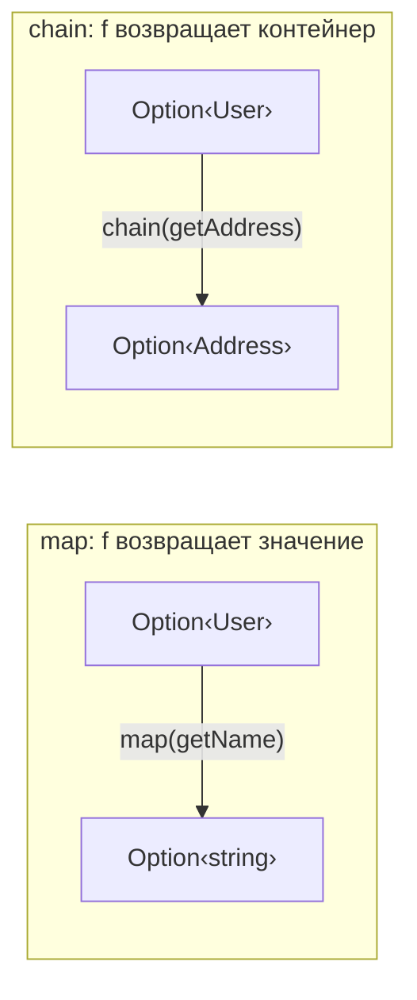
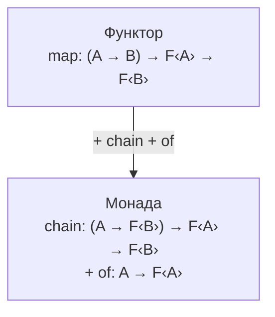

# Глава: Монада — flatMap и цепочки эффектов

> [!info] Context
> Пятая глава курса по функциональному программированию в TypeScript. Показывает, что `map` недостаточно, когда функция сама возвращает контейнер — получается вложенность `F<F<A>>`. Монада решает эту проблему через `chain` (flatMap). Объясняет монаду как естественное расширение функтора, а не как загадочную абстракцию.
>
> **Пререквизиты:** [[pure-functions-and-pipe]], [[types-adt-option]], [[functor]], [[category-theory]]

## Overview

В главе 3 мы увидели, что `map` применяет функцию `A => B` внутри контейнера. Но что если функция сама возвращает контейнер — `A => F<B>`? Тогда `map` даёт `F<F<B>>` — вложенный контейнер. Монада — это ответ на вопрос "как избавиться от лишней вложенности".

К концу главы вы будете знать:

- Почему `map` создаёт вложенность, когда функция возвращает контейнер
- Что такое `join` (flatten) и как он снимает один слой
- Что такое `chain` = `map` + `join` и зачем он нужен
- Что `Promise.then` и `Array.flatMap` — это монадические операции
- Как Either-монада заменяет вложенные `if/try-catch` на плоские цепочки
- Три закона монады и зачем они нужны
- Как использовать `O.chain`, `E.chain`, `TE.chain` в fp-ts

## Deep Dive

### 1. Боль: вложенный контейнер

В главе 2 мы написали функции, возвращающие `Option`:

```typescript
interface User {
  name: string;
  address?: { city?: string; zip?: string };
}

const findUser = (id: number): Option<User> => {
  const users: Record<number, User> = {
    1: { name: 'Иван', address: { city: 'Москва', zip: '101000' } },
    2: { name: 'Анна' },
  };
  return id in users ? some(users[id]) : none;
};

const getAddress = (user: User): Option<{ city?: string; zip?: string }> =>
  user.address ? some(user.address) : none;
```

Обе функции возвращают `Option`. Попробуем составить цепочку через `map`:

```typescript
import { pipe } from 'fp-ts/function';
import * as O from 'fp-ts/Option';

const result = pipe(
  findUser(1),         // Option<User>
  O.map(getAddress)    // Option<Option<{ city?: string }>>  — вложенность!
);
```

Мы хотели `Option<{ city?: string }>`, а получили `Option<Option<{ city?: string }>>`. Два слоя `Option`. Чтобы продолжить цепочку, нужно как-то "снять" внешний слой.

Проблема нарастает с каждым шагом:

```typescript
const getCity = (address: { city?: string }): Option<string> =>
  address.city ? some(address.city) : none;

// Если продолжим с map:
pipe(
  findUser(1),           // Option<User>
  O.map(getAddress),     // Option<Option<Address>>
  O.map(O.map(getCity))  // Option<Option<Option<string>>>  — матрёшка!
);
```

> [!warning] Корень проблемы
> `map` оборачивает результат функции в контейнер. Если функция **сама** возвращает контейнер, `map` оборачивает его **ещё раз**. Отсюда и вложенность.

---

### 2. join/flatten: снятие одного слоя

Идея проста: если внутри контейнера лежит другой контейнер того же типа, можно снять один слой обёртки.

```typescript
// Самописный join для Option
const joinOption = <A>(option: Option<Option<A>>): Option<A> => {
  switch (option._tag) {
    case 'None': return none;
    case 'Some': return option.value;  // value — это уже Option<A>
  }
};
```

```typescript
joinOption(some(some(42)));   // some(42) — снят один слой
joinOption(some(none));       // none     — внутри было пусто
joinOption(none);             // none     — снаружи пусто
```

Теперь можно исправить нашу цепочку:

```typescript
pipe(
  findUser(1),           // Option<User>
  O.map(getAddress),     // Option<Option<Address>>
  joinOption,            // Option<Address>  — один слой снят!
  O.map(getCity),        // Option<Option<string>>
  joinOption             // Option<string>  — снова снят
);
```

Работает, но `map` + `join`, `map` + `join`... Каждый раз одно и то же.

> [!tip] Аналогия
> `join` — это как открыть посылку и обнаружить внутри ещё одну коробку. Вы просто выбрасываете внешнюю коробку и работаете с внутренней.

---

### 3. chain = map + join

Объединим `map` и `join` в одну операцию:

```typescript
// Самописный chain для Option
const chainOption = <A, B>(f: (a: A) => Option<B>) =>
  (option: Option<A>): Option<B> => {
    switch (option._tag) {
      case 'None': return none;
      case 'Some': return f(option.value);  // f уже возвращает Option<B>
    }
  };
```

Обратите внимание: в `Some` мы просто вызываем `f(option.value)` и возвращаем результат **как есть**. Не оборачиваем в `some()` — потому что `f` уже возвращает `Option`. Это и есть разница с `map`.

Теперь цепочка становится плоской:

```typescript
pipe(
  findUser(1),              // Option<User>
  chainOption(getAddress),  // Option<Address>
  chainOption(getCity)      // Option<string>
);
// some('Москва')

pipe(
  findUser(2),              // Option<User>  (Анна, без адреса)
  chainOption(getAddress),  // none  — цепочка остановилась
  chainOption(getCity)      // none  — пропущено
);
// none
```

Сравнение сигнатур:

```typescript
// map: функция возвращает ЗНАЧЕНИЕ — контейнер оборачивает его
map:   (f: A => B)    => (fa: F<A>) => F<B>

// chain: функция возвращает КОНТЕЙНЕР — лишняя обёртка не нужна
chain: (f: A => F<B>) => (fa: F<A>) => F<B>
```



> [!important] Когда что использовать
> - `map` — когда `f` возвращает обычное значение: `A => B`
> - `chain` — когда `f` возвращает контейнер: `A => F<B>`
>
> Если перепутать и передать в `map` функцию, возвращающую контейнер — получите вложенность. TypeScript подскажет типом: `Option<Option<B>>` вместо `Option<B>`.

---

### 4. Вы уже используете монады!

Монады — не абстрактная математика. Вы работаете с ними каждый день.

#### Promise.then — это chain

```typescript
// fetch возвращает Promise
// res.json() тоже возвращает Promise
fetch('/api/user')
  .then(res => res.json())   // fn возвращает Promise — then разворачивает
  .then(user => user.name);  // fn возвращает значение — then оборачивает
```

`Promise.then` — одновременно и `map`, и `chain`. Если колбэк возвращает `Promise`, `.then` автоматически разворачивает его. Если возвращает обычное значение — оборачивает в `Promise`. Это удобно, но нарушает строгие законы (мы видели это в главе 3).

#### Array.flatMap — это chain

```typescript
// map с функцией, возвращающей массив — вложенность
[1, 2, 3].map(x => [x, x * 10]);
// [[1, 10], [2, 20], [3, 30]]  — массив массивов

// flatMap = map + flatten — плоский результат
[1, 2, 3].flatMap(x => [x, x * 10]);
// [1, 10, 2, 20, 3, 30]  — один плоский массив
```

| Контейнер | map (f возвращает значение) | chain (f возвращает контейнер) |
|---|---|---|
| Array | `[1,2].map(f)` → `[f(1), f(2)]` | `[1,2].flatMap(f)` → `[...f(1), ...f(2)]` |
| Option | `O.map(f)` → `Option<B>` | `O.chain(f)` → `Option<B>` (без вложенности) |
| Either | `E.map(f)` → `Either<E, B>` | `E.chain(f)` → `Either<E, B>` (без вложенности) |
| Promise | `.then(f)` — оборачивает | `.then(f)` — разворачивает (если Promise) |

> [!tip] Если вы использовали `Promise.then` с функцией, возвращающей Promise, или `Array.flatMap` — вы уже работали с монадами.

---

### 5. Either как монада: обработка ошибок без try/catch

Either-монада — одно из самых практичных применений `chain`. Каждый шаг валидации может вернуть ошибку (`Left`) или передать данные дальше (`Right`). При первой ошибке цепочка останавливается.

```typescript
// На голом TypeScript:
type Either<E, A> = { _tag: 'Left'; left: E } | { _tag: 'Right'; right: A };

const left = <E>(e: E): Either<E, never> => ({ _tag: 'Left', left: e });
const right = <A>(a: A): Either<never, A> => ({ _tag: 'Right', right: a });

const chainEither = <E, A, B>(f: (a: A) => Either<E, B>) =>
  (either: Either<E, A>): Either<E, B> => {
    switch (either._tag) {
      case 'Left': return either;       // ошибка проскакивает
      case 'Right': return f(either.right);  // f возвращает Either
    }
  };
```

Валидационный пайплайн:

```typescript
interface RegistrationData {
  name: string;
  age: number;
  email: string;
}

const validateName = (data: RegistrationData): Either<string, RegistrationData> =>
  data.name.trim().length >= 2
    ? right(data)
    : left('Имя должно содержать минимум 2 символа');

const validateAge = (data: RegistrationData): Either<string, RegistrationData> =>
  data.age >= 18 && data.age <= 120
    ? right(data)
    : left('Возраст должен быть от 18 до 120');

const validateEmail = (data: RegistrationData): Either<string, RegistrationData> =>
  data.email.includes('@') && data.email.includes('.')
    ? right(data)
    : left('Email должен содержать @ и .');

const validate = (data: RegistrationData): Either<string, RegistrationData> =>
  pipe(
    right(data) as Either<string, RegistrationData>,
    chainEither(validateName),
    chainEither(validateAge),
    chainEither(validateEmail)
  );

validate({ name: 'Иван', age: 25, email: 'ivan@mail.ru' });
// right({ name: 'Иван', age: 25, email: 'ivan@mail.ru' })

validate({ name: 'Иван', age: 15, email: 'ivan@mail.ru' });
// left('Возраст должен быть от 18 до 120')
// ↑ validateEmail даже не вызвалась — цепочка остановилась на validateAge
```

Сравните с императивным кодом:

```typescript
// Императивный подход — вложенные if или try/catch
function validateImperative(data: RegistrationData): string | RegistrationData {
  if (data.name.trim().length < 2) return 'Имя должно содержать минимум 2 символа';
  if (data.age < 18 || data.age > 120) return 'Возраст должен быть от 18 до 120';
  if (!data.email.includes('@') || !data.email.includes('.')) return 'Email должен содержать @ и .';
  return data;
}

// Функциональный подход — плоская цепочка chain
// Каждый шаг — отдельная функция, легко переиспользовать и тестировать
```

---

### 6. Определение монады

Теперь, когда вы видели `chain` в действии, можно дать определение.

> [!important] Определение
> **Монада** — это тип-конструктор `M`, для которого определены три операции:
>
> 1. `of(x)` — поместить значение в контейнер (он же `return`, `pure`, `some`, `right`)
> 2. `map(f)` — применить функцию к значению внутри (из функтора)
> 3. `chain(f)` — применить функцию, возвращающую контейнер, без вложенности (он же `flatMap`, `bind`, `>>=`)
>
> `chain` = `map` + `join` (flatten)

Иерархия абстракций:



`map` можно выразить через `chain` и `of`:

```typescript
// map через chain: обернуть результат f в контейнер
const mapViaChain = <A, B>(f: (a: A) => B) =>
  chainOption((a: A) => some(f(a)));

mapViaChain((x: number) => x * 2)(some(5));   // some(10)
mapViaChain((x: number) => x * 2)(none);       // none
```

Это значит, что монада **мощнее** функтора: `chain` может делать всё, что `map`, плюс разворачивать вложенность.

---

### 7. Три закона монады

Как и у функтора, у монады есть законы. Они гарантируют, что `chain` ведёт себя предсказуемо.

#### Закон 1: Левая идентичность (Left Identity)

Обернуть значение в контейнер и сразу применить `chain(f)` — то же самое, что просто вызвать `f`:

```typescript
// of(x) |> chain(f)  ===  f(x)

const f = (x: number): Option<number> => x > 0 ? some(x * 2) : none;

pipe(some(5), chainOption(f));   // some(10)
f(5);                             // some(10)
// Результат одинаковый ✓
```

Интуиция: `of` — это "нейтральная обёртка". Если вы обернули и сразу развернули — ничего не изменилось. Как `0 + x = x` для сложения.

#### Закон 2: Правая идентичность (Right Identity)

`chain` с `of` ничего не меняет:

```typescript
// m |> chain(of)  ===  m

const m = some(42);
pipe(m, chainOption(some));   // some(42)
// То же, что m ✓

pipe(none as Option<number>, chainOption(some));   // none
// То же, что none ✓
```

Интуиция: обернуть значение в контейнер и тут же "снять обёртку" через chain — бессмысленная операция, результат не меняется. Как `x + 0 = x`.

#### Закон 3: Ассоциативность

Порядок группировки `chain` не влияет на результат:

```typescript
// m |> chain(f) |> chain(g)  ===  m |> chain(x => f(x) |> chain(g))

const f = (x: number): Option<number> => x > 0 ? some(x + 1) : none;
const g = (x: number): Option<string> => some(`result: ${x}`);
const m = some(5);

// Вариант 1: два последовательных chain
const result1 = pipe(m, chainOption(f), chainOption(g));
// some('result: 6')

// Вариант 2: вложенный chain
const result2 = pipe(m, chainOption(x => pipe(f(x), chainOption(g))));
// some('result: 6')
// Результаты одинаковы ✓
```

Интуиция: ассоциативность позволяет безопасно разбивать и объединять шаги цепочки. Можно извлечь `chain(f) |> chain(g)` в отдельную функцию — результат не изменится.

#### Аналогия с числом 0 в сложении

| Свойство | Сложение чисел | chain монады |
|---|---|---|
| Левая идентичность | `0 + x = x` | `of(x) \|> chain(f) = f(x)` |
| Правая идентичность | `x + 0 = x` | `m \|> chain(of) = m` |
| Ассоциативность | `(a + b) + c = a + (b + c)` | `chain(f) \|> chain(g) = chain(x => f(x) \|> chain(g))` |

> [!tip] Монада — моноид
> Эта аналогия не случайна. Знаменитая фраза "монада — это просто моноид в категории эндофункторов" говорит именно об этом: `chain` ведёт себя как ассоциативная операция (`concat`), а `of` — как нейтральный элемент (`empty`). Мы видели Monoid в главе 4 — здесь та же структура, но на уровне контейнеров.

---

### 8. fp-ts: chain на практике

fp-ts предоставляет `chain` (и его алиас `flatMap`) для каждой монады:

```typescript
import * as O from 'fp-ts/Option';
import * as E from 'fp-ts/Either';
import { pipe } from 'fp-ts/function';
```

#### Option chain

```typescript
const parseNumber = (s: string): O.Option<number> => {
  const n = Number(s);
  return isNaN(n) ? O.none : O.some(n);
};

const inverse = (n: number): O.Option<number> =>
  n === 0 ? O.none : O.some(1 / n);

pipe(
  O.some('4'),
  O.chain(parseNumber),   // O.some(4)
  O.chain(inverse)        // O.some(0.25)
);

pipe(
  O.some('0'),
  O.chain(parseNumber),   // O.some(0)
  O.chain(inverse)        // O.none — деление на ноль предотвращено
);

pipe(
  O.some('abc'),
  O.chain(parseNumber),   // O.none — не число
  O.chain(inverse)        // O.none — пропущено
);
```

#### Either chain

```typescript
const parseJSON = (s: string): E.Either<string, unknown> =>
  E.tryCatch(
    () => JSON.parse(s),
    () => `Невалидный JSON: "${s}"`
  );

const extractField = (field: string) =>
  (obj: unknown): E.Either<string, string> => {
    const val = (obj as Record<string, unknown>)[field];
    return typeof val === 'string'
      ? E.right(val)
      : E.left(`Поле "${field}" не найдено или не строка`);
  };

pipe(
  '{"name": "Иван"}',
  parseJSON,                    // E.right({ name: 'Иван' })
  E.chain(extractField('name')) // E.right('Иван')
);

pipe(
  'not json',
  parseJSON,                    // E.left('Невалидный JSON: "not json"')
  E.chain(extractField('name')) // E.left('Невалидный JSON: "not json"') — пропущено
);

pipe(
  '{"age": 25}',
  parseJSON,                    // E.right({ age: 25 })
  E.chain(extractField('name')) // E.left('Поле "name" не найдено или не строка')
);
```

#### TaskEither: async + ошибки

`TaskEither<E, A>` — это `() => Promise<Either<E, A>>`. Монада, которая объединяет асинхронность и обработку ошибок:

```typescript
import * as TE from 'fp-ts/TaskEither';

const fetchUser = (id: number): TE.TaskEither<string, { name: string; age: number }> =>
  TE.tryCatch(
    () => fetch(`/api/users/${id}`).then(r => r.json()),
    () => `Не удалось загрузить пользователя ${id}`
  );

const validateAdult = (user: { name: string; age: number }): TE.TaskEither<string, { name: string; age: number }> =>
  user.age >= 18
    ? TE.right(user)
    : TE.left(`${user.name} младше 18`);

const greet = (user: { name: string }): string =>
  `Привет, ${user.name}!`;

// Цепочка: загрузить → валидировать → приветствовать
const greetAdultUser = (id: number) =>
  pipe(
    fetchUser(id),           // TaskEither<string, User>
    TE.chain(validateAdult), // TaskEither<string, User> — ошибка если < 18
    TE.map(greet)            // TaskEither<string, string>
  );

// Запуск:
// greetAdultUser(1)()  →  Promise<Either<string, string>>
```

> [!tip] map vs chain — быстрая проверка
> Посмотрите на возвращаемый тип вашей функции `f`:
> - `f` возвращает `string`, `number`, `User` → используйте `map`
> - `f` возвращает `Option<...>`, `Either<...>`, `TaskEither<...>` → используйте `chain`

---

### 9. Типичные заблуждения

**"Монада — это что-то сложное и математическое"**

Монада — это тип с `chain`. Вы уже пользовались монадами через `Promise.then` и `Array.flatMap`. Формальное определение просто даёт имя паттерну, который вы и так знаете.

**"chain и map — это одно и то же"**

Нет. `map` оборачивает результат в контейнер. `chain` — нет (потому что функция уже возвращает контейнер). Если перепутать — получите вложенность (`Option<Option<A>>`) или ошибку типов.

**"Можно везде использовать chain вместо map"**

Технически да (`map(f) = chain(x => of(f(x)))`), но это ухудшает читаемость и производительность. Используйте `map`, когда функция возвращает обычное значение — это проще и понятнее.

**"Either chain накапливает все ошибки"**

Нет. `chain` останавливается на **первой** ошибке (Left). Для накопления нескольких ошибок нужен `Applicative` — тема главы 6.

**"Promise — это правильная монада"**

Не совсем. `Promise.then` объединяет `map` и `chain` в одну операцию и автоматически разворачивает вложенные Promise. Это удобно, но нарушает закон composition (глава 3). В fp-ts для корректной работы с async используется `Task` и `TaskEither`.

---

### 10. Что дальше

`chain` строит **последовательные** цепочки: результат каждого шага зависит от предыдущего. Но что если два шага **независимы**? Например, нужно валидировать имя и email параллельно и собрать **все** ошибки, а не остановиться на первой?

Для этого нужен `Applicative` — тема главы 6. Аппликативный функтор позволяет комбинировать независимые эффекты, а Either в аппликативном стиле собирает все ошибки, а не падает на первой.

## Related Topics

- [[pure-functions-and-pipe]]
- [[types-adt-option]]
- [[functor]]
- [[category-theory]]
- [[monads]] (Mostly Adequate Guide)

## Sources

- [Mostly Adequate Guide — Chapter 9: Monadic Onions](https://mostly-adequate.gitbook.io/mostly-adequate-guide/ch09)
- [Getting started with fp-ts: Either vs Validation](https://dev.to/gcanti/getting-started-with-fp-ts-either-vs-validation-5eja)
- [fp-ts Option module](https://gcanti.github.io/fp-ts/modules/Option.ts.html)
- [fp-ts Either module](https://gcanti.github.io/fp-ts/modules/Either.ts.html)
- [fp-ts TaskEither module](https://gcanti.github.io/fp-ts/modules/TaskEither.ts.html)
- Introduction to Functional Programming using TypeScript — Giulio Canti

---

*Глава написана моделью claude-opus-4-6 (Opus 4.6)*
