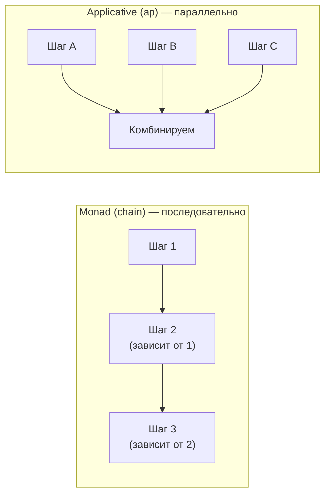
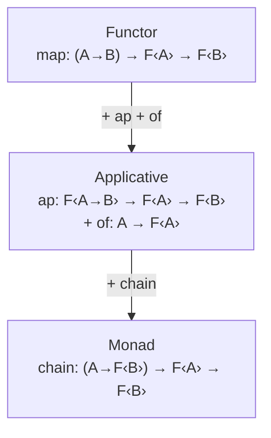

# Глава: Аппликативный функтор — независимые эффекты

> [!info] Context
> Шестая глава курса по функциональному программированию в TypeScript. Показывает, что `chain` (монада) создаёт последовательную зависимость между шагами — но не все задачи требуют зависимости. Аппликативный функтор решает другую проблему: как применить функцию нескольких аргументов к значениям, каждое из которых внутри своего контейнера, **независимо** друг от друга. Главное применение — валидация с накоплением **всех** ошибок.
>
> **Пререквизиты:** [[pure-functions-and-pipe]], [[types-adt-option]], [[functor]], [[category-theory]], [[monad]]

## Overview

В главе 5 мы увидели, что `chain` строит последовательные цепочки: каждый шаг зависит от предыдущего. При первой ошибке (`Left`) вся цепочка останавливается. Это хорошо для зависимых операций, но плохо для валидации — мы хотим показать пользователю **все** ошибки формы, а не только первую.

К концу главы вы будете знать:

- Почему `map` не справляется с функцией нескольких аргументов в контейнерах
- Что такое `ap` и как он применяет обёрнутую функцию к обёрнутому значению
- Разницу между зависимостью (monad) и независимостью (applicative)
- Как собирать **все** ошибки валидации через Either в аппликативном стиле
- Как использовать `sequenceS`, `sequenceT` и `Do`-нотацию в fp-ts
- Сводную таблицу: Functor vs Applicative vs Monad — когда что использовать

## Deep Dive

### 1. Боль: два независимых контейнера

Есть два результата валидации и функция, которая их комбинирует:

```typescript
import * as E from 'fp-ts/Either';
import { pipe } from 'fp-ts/function';

const validateName = (name: string): E.Either<string, string> =>
  name.trim().length >= 2
    ? E.right(name)
    : E.left('Имя слишком короткое');

const validateAge = (age: number): E.Either<string, number> =>
  age >= 18 && age <= 120
    ? E.right(age)
    : E.left('Возраст вне диапазона 18–120');

const createProfile = (name: string) => (age: number): string =>
  `${name}, ${age} лет`;
```

Оба поля **независимы**: валидация возраста не зависит от имени. Мы хотим применить `createProfile` к обоим результатам.

Попробуем `map`:

```typescript
const nameResult = validateName('Иван');   // E.right('Иван')
const ageResult = validateAge(25);          // E.right(25)

pipe(nameResult, E.map(createProfile));
// E.right((age: number) => 'Иван, age лет')
// Функция ВНУТРИ контейнера! Как применить её к ageResult?
```

`map` с каррированной функцией дал нам `Either<string, (age: number) => string>` — функция внутри контейнера. `map` не умеет применять обёрнутую функцию к обёрнутому значению.

А `chain`? Он останавливается на **первой** ошибке:

```typescript
pipe(
  validateName(''),       // E.left('Имя слишком короткое')
  E.chain(() => validateAge(15)),  // ← не выполнится!
  E.map(age => `?, ${age} лет`)
);
// E.left('Имя слишком короткое')
// Пользователь не узнает, что возраст тоже невалиден
```

> [!warning] Проблема chain для валидации
> `chain` создаёт **зависимость**: каждый шаг зависит от предыдущего. При первой ошибке цепочка останавливается. Для валидации формы это плохо — мы хотим показать **все** ошибки, а не только первую.

---

### 2. ap: применение обёрнутой функции

`ap` решает именно эту проблему:

```typescript
// Сигнатура ap:
// F<(A) => B>  →  F<A>  →  F<B>
// контейнер      контейнер    контейнер
// с функцией   + с значением = с результатом
```

Реализация для Option (на голом TypeScript):

```typescript
const apOption = <A, B>(fab: Option<(a: A) => B>) =>
  (fa: Option<A>): Option<B> => {
    if (fab._tag === 'None' || fa._tag === 'None') return none;
    return some(fab.value(fa.value));
  };
```

Использование:

```typescript
const add = (a: number) => (b: number): number => a + b;

pipe(
  some(add),           // Option<(a: number) => (b: number) => number>
  apOption(some(3)),   // Option<(b: number) => number>  — add получил первый аргумент
  apOption(some(4))    // Option<number>  — add получил второй аргумент
);
// some(7)

pipe(
  some(add),
  apOption(none as Option<number>),   // none — нет первого аргумента
  apOption(some(4))                    // none — пропущено
);
// none
```

Паттерн `of(fn).ap(x).ap(y)` — это **аппликативный стиль**: каррированная функция последовательно получает аргументы из контейнеров.

> [!tip] Интуиция
> `ap` — это вызов функции в мире контейнеров:
> - Обычный вызов: `add(3)(4)` → `7`
> - Аппликативный: `of(add).ap(some(3)).ap(some(4))` → `some(7)`

---

### 3. Разница: зависимость vs независимость

Это **ключевое** отличие между монадой и аппликативом.

#### Монада (chain) — последовательность

Каждый шаг **зависит** от результата предыдущего:

```typescript
// Второй запрос использует результат первого
pipe(
  fetchUser(id),                              // шаг 1
  TE.chain(user => fetchOrders(user.orderId)) // шаг 2: нужен user.orderId
);
```

#### Аппликатив (ap) — независимость

Аргументы **не зависят** друг от друга:

```typescript
// Оба запроса независимы
const nameResult = validateName(form.name);   // не зависит от age
const ageResult = validateAge(form.age);       // не зависит от name

// Комбинируем результаты
pipe(
  E.of(createProfile),
  E.ap(nameResult),
  E.ap(ageResult)
);
```



Практическое следствие: для async-операций аппликатив позволяет **параллельное** выполнение (как `Promise.all`), а монада — только последовательное.

---

### 4. Валидация с накоплением ошибок

Главная суперсила аппликатива — собирать **все** ошибки, а не останавливаться на первой.

Для этого нужен специальный `Either`, который при ошибке **объединяет** Left-значения через Semigroup (из главы 4):

```typescript
import * as E from 'fp-ts/Either';
import * as A from 'fp-ts/Apply';
import { pipe } from 'fp-ts/function';
import { getSemigroup } from 'fp-ts/NonEmptyArray';

// Тип для накопления ошибок: массив строк
type ValidationResult<A> = E.Either<readonly string[], A>;

const validateName = (name: string): ValidationResult<string> =>
  name.trim().length >= 2
    ? E.right(name.trim())
    : E.left(['Имя должно содержать минимум 2 символа']);

const validateAge = (age: number): ValidationResult<number> =>
  age >= 18 && age <= 120
    ? E.right(age)
    : E.left(['Возраст должен быть от 18 до 120']);

const validateEmail = (email: string): ValidationResult<string> =>
  email.includes('@') && email.includes('.')
    ? E.right(email)
    : E.left(['Email должен содержать @ и .']);
```

Теперь собираем через аппликатив fp-ts:

```typescript
// getApplicativeValidation создаёт ap, который объединяет ошибки
// через Semigroup массивов (конкатенация)
const applicativeValidation = E.getApplicativeValidation(
  getSemigroup<string>()
);

interface UserProfile {
  name: string;
  age: number;
  email: string;
}

const createProfile = (name: string) => (age: number) => (email: string): UserProfile =>
  ({ name, age, email });

const validateUser = (input: { name: string; age: number; email: string }) =>
  pipe(
    E.of<readonly string[], typeof createProfile>(createProfile),
    applicativeValidation.ap(validateName(input.name)),
    applicativeValidation.ap(validateAge(input.age)),
    applicativeValidation.ap(validateEmail(input.email))
  );
```

Результат при нескольких ошибках:

```typescript
validateUser({ name: '', age: 15, email: 'invalid' });
// E.left([
//   'Имя должно содержать минимум 2 символа',
//   'Возраст должен быть от 18 до 120',
//   'Email должен содержать @ и .'
// ])
// ↑ ВСЕ три ошибки собраны!

validateUser({ name: 'Иван', age: 25, email: 'ivan@mail.ru' });
// E.right({ name: 'Иван', age: 25, email: 'ivan@mail.ru' })
```

Сравните с `chain`, который остановился бы на первой ошибке.

---

### 5. fp-ts: sequenceS, sequenceT и Do-нотация

В реальном коде аппликативный стиль через `of(fn).ap(x).ap(y)` бывает неудобным — каррированные функции с многими аргументами трудно читать. fp-ts предоставляет удобные альтернативы.

#### sequenceS — объект независимых полей

```typescript
import { sequenceS } from 'fp-ts/Apply';

const validateUserS = (input: { name: string; age: number; email: string }) =>
  pipe(
    sequenceS(E.Applicative)({
      name: validateName(input.name),
      age: validateAge(input.age),
      email: validateEmail(input.email),
    })
  );

validateUserS({ name: 'Иван', age: 25, email: 'ivan@mail.ru' });
// E.right({ name: 'Иван', age: 25, email: 'ivan@mail.ru' })

validateUserS({ name: '', age: 25, email: 'ivan@mail.ru' });
// E.left(['Имя должно содержать минимум 2 символа'])
```

> [!warning] sequenceS vs getApplicativeValidation
> `sequenceS(E.Applicative)` использует обычный `Either` — останавливается на **первой** ошибке (как chain). Для накопления **всех** ошибок используйте `sequenceS(E.getApplicativeValidation(getSemigroup<string>()))`.

#### sequenceS с накоплением ошибок

```typescript
const validateUserAll = (input: { name: string; age: number; email: string }) =>
  sequenceS(E.getApplicativeValidation(getSemigroup<string>()))({
    name: validateName(input.name),
    age: validateAge(input.age),
    email: validateEmail(input.email),
  });

validateUserAll({ name: '', age: 15, email: 'bad' });
// E.left([
//   'Имя должно содержать минимум 2 символа',
//   'Возраст должен быть от 18 до 120',
//   'Email должен содержать @ и .'
// ])
```

#### sequenceT — кортеж (массив)

```typescript
import { sequenceT } from 'fp-ts/Apply';

const result = sequenceT(E.Applicative)(
  validateName('Иван'),
  validateAge(25),
  validateEmail('ivan@mail.ru')
);
// E.right(['Иван', 25, 'ivan@mail.ru'] as const)
```

#### Do-нотация (удобный стиль)

```typescript
const validateUserDo = (input: { name: string; age: number; email: string }) =>
  pipe(
    E.Do,
    E.apS('name', validateName(input.name)),
    E.apS('age', validateAge(input.age)),
    E.apS('email', validateEmail(input.email))
  );

validateUserDo({ name: 'Иван', age: 25, email: 'ivan@mail.ru' });
// E.right({ name: 'Иван', age: 25, email: 'ivan@mail.ru' })
```

> [!tip] Что выбрать
> - `sequenceS` — когда поля уже готовы как объект, и вы хотите "перевернуть" `{ a: Either, b: Either }` → `Either<{ a, b }>`
> - `sequenceT` — то же, но для кортежа (массива)
> - `Do` + `apS` — когда строите объект пошагово, удобно для pipe
> - `of(fn).ap(x).ap(y)` — для простых случаев с каррированными функциями

---

### 6. Реализация ap на голом TypeScript

Напишем ap для Either, чтобы понять механику:

```typescript
type Either<E, A> = { _tag: 'Left'; left: E } | { _tag: 'Right'; right: A };

// Обычный ap: останавливается на первой ошибке
const apEither = <E, A, B>(fab: Either<E, (a: A) => B>) =>
  (fa: Either<E, A>): Either<E, B> => {
    if (fab._tag === 'Left') return fab;
    if (fa._tag === 'Left') return fa;
    return { _tag: 'Right', right: fab.right(fa.right) };
  };

// ap с накоплением ошибок (нужен Semigroup для E)
const apValidation = <E>(combine: (x: E, y: E) => E) =>
  <A, B>(fab: Either<E, (a: A) => B>) =>
  (fa: Either<E, A>): Either<E, B> => {
    if (fab._tag === 'Left' && fa._tag === 'Left') {
      return { _tag: 'Left', left: combine(fab.left, fa.left) };
    }
    if (fab._tag === 'Left') return fab;
    if (fa._tag === 'Left') return fa;
    return { _tag: 'Right', right: fab.right(fa.right) };
  };
```

Ключевое отличие: `apValidation` при двух `Left` **объединяет** ошибки через `combine`, а не отбрасывает вторую. Именно так fp-ts `getApplicativeValidation` работает под капотом.

```typescript
const combineErrors = (a: string[], b: string[]): string[] => [...a, ...b];
const apV = apValidation(combineErrors);

const createUser = (name: string) => (age: number) => ({ name, age });

pipe(
  right(createUser) as Either<string[], typeof createUser>,
  apV(left(['Имя пустое'])),
  apV(left(['Возраст < 18']))
);
// left(['Имя пустое', 'Возраст < 18']) — обе ошибки собраны
```

---

### 7. Сводная таблица: Functor vs Applicative vs Monad

| | Functor | Applicative | Monad |
|---|---|---|---|
| **Операция** | `map` | `ap` + `of` | `chain` (flatMap) |
| **Сигнатура** | `(A → B) → F<A> → F<B>` | `F<A → B> → F<A> → F<B>` | `(A → F<B>) → F<A> → F<B>` |
| **Функция** | снаружи контейнера | внутри контейнера | возвращает контейнер |
| **Зависимость** | — | аргументы независимы | каждый шаг зависит от предыдущего |
| **Ошибки (Either)** | — | можно собрать **все** | останавливается на **первой** |
| **Async** | — | параллельно (Promise.all) | последовательно (.then) |
| **Когда** | Трансформация значения | Комбинирование независимых | Цепочка зависимых шагов |



> [!important] Принцип минимальной силы
> Используйте самую слабую абстракцию, достаточную для задачи:
> - Просто трансформировать значение? → `map` (Functor)
> - Комбинировать **независимые** контейнеры? → `ap` (Applicative)
> - Каждый шаг **зависит** от предыдущего? → `chain` (Monad)

---

### 8. Типичные заблуждения

**"ap и chain делают одно и то же"**

Нет. `chain` создаёт зависимость: результат шага N доступен шагу N+1. `ap` комбинирует независимые контейнеры. Из-за этого `chain` останавливается на первой ошибке, а `ap` (в режиме validation) может собрать все.

**"Applicative нужен только для валидации"**

Валидация — самый наглядный пример, но не единственный. `ap` полезен везде, где аргументы независимы: параллельные HTTP-запросы, комбинирование конфигов, построение объектов из нескольких Option-полей.

**"sequenceS всегда собирает все ошибки"**

Нет. `sequenceS(E.Applicative)` останавливается на первой ошибке (обычный Either). Для накопления ошибок нужен `sequenceS(E.getApplicativeValidation(...))`.

**"Можно просто использовать chain везде"**

Технически да (монада сильнее аппликатива), но вы теряете преимущества: параллелизм и накопление ошибок. Принцип минимальной силы — не педантизм, а практическая оптимизация.

---

### 9. Что дальше

Мы изучили три уровня абстракций (Functor → Applicative → Monad) и знаем, когда применять каждый. В следующей главе — **fp-ts на практике**: реальные паттерны с pipe, Option, Either, TaskEither. Мы соберём всё вместе и увидим, как писать реальный продуктовый код в функциональном стиле.

## Related Topics

- [[pure-functions-and-pipe]]
- [[types-adt-option]]
- [[functor]]
- [[category-theory]]
- [[monad]]
- [[applicative-functors]] (Mostly Adequate Guide)

## Sources

- [Mostly Adequate Guide — Chapter 10: Applicative Functors](https://mostly-adequate.gitbook.io/mostly-adequate-guide/ch10)
- [Getting started with fp-ts: Either vs Validation](https://dev.to/gcanti/getting-started-with-fp-ts-either-vs-validation-5eja)
- [Getting started with fp-ts: Applicative](https://dev.to/gcanti/getting-started-with-fp-ts-applicative-1kb3)
- [fp-ts Apply module](https://gcanti.github.io/fp-ts/modules/Apply.ts.html)
- Introduction to Functional Programming using TypeScript — Giulio Canti

---

*Глава написана моделью claude-opus-4-6 (Opus 4.6)*
