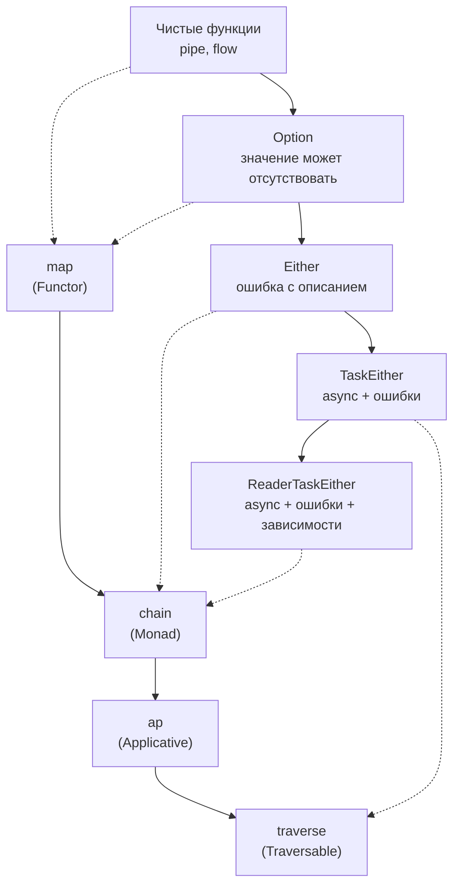

# Глава: Traversable и ReaderTaskEither

> [!info] Context
> Финальная глава курса по функциональному программированию в TypeScript. Две продвинутые темы: **Traversable** — как "перевернуть" массив контейнеров в контейнер массива (аналог Promise.all), и **ReaderTaskEither** — как передавать зависимости в fp-ts пайп без глобального состояния.
>
> **Пререквизиты:** все предыдущие главы курса, особенно [[monad]], [[applicative]], [[fp-ts-practice]]

## Overview

Две проблемы, которые часто возникают в реальном fp-ts коде:

1. **Массив контейнеров**: у вас `Array<Option<A>>` или `Array<TaskEither<E, A>>`, а нужен `Option<Array<A>>` или `TaskEither<E, Array<A>>`. Как "перевернуть" вложенность?

2. **Зависимости**: функции в pipe-цепочке нуждаются в доступе к БД, логгеру, конфигу. Как передать их без глобального состояния и без прокидывания через каждый аргумент?

К концу главы вы будете знать:

- Что такое `sequence` и `traverse` и чем они отличаются
- Как выполнять массив TaskEither параллельно и последовательно
- Что такое Reader и как он решает проблему зависимостей
- Что такое ReaderTaskEither и как он объединяет три проблемы в один тип
- Когда RTE — overkill

## Deep Dive

### 1. Боль: массив контейнеров

У вас массив ID пользователей. Для каждого нужно загрузить данные. Каждая загрузка возвращает `TaskEither`:

```typescript
import * as TE from 'fp-ts/TaskEither';
import * as A from 'fp-ts/ReadonlyArray';
import { pipe } from 'fp-ts/function';

const fetchUser = (id: number): TE.TaskEither<string, User> =>
  TE.tryCatch(
    () => fetch(`/api/users/${id}`).then(r => r.json()),
    () => `Ошибка загрузки пользователя ${id}`
  );

const ids = [1, 2, 3];
const results = ids.map(fetchUser);
// Тип: TaskEither<string, User>[]
// Это Array<TaskEither> — массив отдельных операций
// А нужен: TaskEither<string, User[]> — одна операция, возвращающая массив
```

Знакомая ситуация? С Promise вы решаете это через `Promise.all`:

```typescript
// Promise-мир:
const users = await Promise.all(ids.map(id => fetch(`/api/users/${id}`)));
```

В fp-ts для этого есть `sequence` и `traverse`.

---

### 2. sequence: переворачиваем вложенность

`sequence` берёт `Array<F<A>>` и превращает в `F<Array<A>>`:

```typescript
import * as O from 'fp-ts/Option';

// Array<Option<number>> → Option<Array<number>>
const values: readonly O.Option<number>[] = [O.some(1), O.some(2), O.some(3)];

pipe(values, A.sequence(O.Applicative));
// O.some([1, 2, 3]) — все Some → собраны в один Some

const withNone: readonly O.Option<number>[] = [O.some(1), O.none, O.some(3)];

pipe(withNone, A.sequence(O.Applicative));
// O.none — хотя бы один None → весь результат None
```

Аналогия с `Promise.all`:

| fp-ts | Promise |
|---|---|
| `A.sequence(TE.ApplicativePar)(tasks)` | `Promise.all(promises)` |
| `Array<TaskEither<E, A>>` → `TaskEither<E, Array<A>>` | `Promise<A>[]` → `Promise<A[]>` |
| Если один Left → весь результат Left | Если один reject → весь результат reject |

Для Either:

```typescript
import * as E from 'fp-ts/Either';

const results: readonly E.Either<string, number>[] = [
  E.right(1), E.right(2), E.right(3)
];
pipe(results, A.sequence(E.Applicative));
// E.right([1, 2, 3])

const withError: readonly E.Either<string, number>[] = [
  E.right(1), E.left('ошибка'), E.right(3)
];
pipe(withError, A.sequence(E.Applicative));
// E.left('ошибка')
```

---

### 3. traverse: map + sequence в одном шаге

Часто вы хотите и трансформировать элементы, и собрать результаты. `traverse` = `map` + `sequence`:

```typescript
// Вместо:
pipe(ids, A.map(fetchUser), A.sequence(TE.ApplicativePar));

// Пишем:
pipe(ids, A.traverse(TE.ApplicativePar)(fetchUser));
// TaskEither<string, readonly User[]>
```

`traverse` принимает Applicative и функцию `A → F<B>`, применяет функцию к каждому элементу и собирает результаты.

#### Параллельное vs последовательное выполнение

```typescript
// Параллельно (все запросы стартуют одновременно):
pipe(ids, A.traverse(TE.ApplicativePar)(fetchUser));

// Последовательно (каждый запрос ждёт предыдущего):
pipe(ids, A.traverse(TE.ApplicativeSeq)(fetchUser));
```

Когда что использовать:

| Режим | Когда |
|---|---|
| `ApplicativePar` | Запросы независимы, хотим скорость |
| `ApplicativeSeq` | Есть rate limit, или порядок важен, или не хотим перегрузить сервер |

> [!tip] Правило большого пальца
> По умолчанию используйте `ApplicativePar`. Переключайтесь на `ApplicativeSeq` только если есть конкретная причина (rate limiting, ограничение соединений, побочные эффекты с порядком).

---

### 4. Практические примеры traverse

#### Валидация массива с накоплением ошибок

```typescript
import { getSemigroup } from 'fp-ts/NonEmptyArray';

const validateAge = (age: number): E.Either<readonly string[], number> =>
  age >= 0 && age <= 150
    ? E.right(age)
    : E.left([`Невалидный возраст: ${age}`]);

const ages = [25, -5, 200, 30];

// С обычным Applicative — остановится на первой ошибке:
pipe(ages, A.traverse(E.Applicative)(validateAge));
// E.left(['Невалидный возраст: -5'])

// С accumulating validation — соберёт все ошибки:
pipe(ages, A.traverse(E.getApplicativeValidation(getSemigroup<string>()))(validateAge));
// E.left(['Невалидный возраст: -5', 'Невалидный возраст: 200'])
```

#### Массив Option → Option массива

```typescript
const parseNumber = (s: string): O.Option<number> => {
  const n = Number(s);
  return isNaN(n) ? O.none : O.some(n);
};

pipe(['1', '2', '3'], A.traverse(O.Applicative)(parseNumber));
// O.some([1, 2, 3])

pipe(['1', 'abc', '3'], A.traverse(O.Applicative)(parseNumber));
// O.none — один не распарсился → весь результат none
```

---

### 5. Reader: функция от окружения

Перед RTE нужно понять Reader. **Reader** — это обёртка над функцией, которая принимает "окружение" (зависимости) и возвращает результат.

```typescript
import * as R from 'fp-ts/Reader';

// Reader<Env, A> = (env: Env) => A
// "Вычисление, которому нужно окружение типа Env, чтобы произвести A"

interface Env {
  apiUrl: string;
  logger: (msg: string) => void;
}

// Функция, которая "читает" из окружения
const getApiUrl: R.Reader<Env, string> = (env) => env.apiUrl;

const buildUrl = (path: string): R.Reader<Env, string> =>
  pipe(
    getApiUrl,
    R.map(base => `${base}${path}`)
  );

// Пока не запустим — ничего не произойдёт (ленивый)
const url = buildUrl('/users');

// Запуск — передаём окружение:
url({ apiUrl: 'https://api.example.com', logger: console.log });
// 'https://api.example.com/users'
```

Зачем это нужно? Зависимости (БД, логгер, конфиг) передаются **неявно** через окружение, а не через каждый аргумент функции.

---

### 6. ReaderTaskEither: три проблемы → один тип

`ReaderTaskEither<R, E, A>` объединяет три монады:

- **Reader** — доступ к зависимостям (R)
- **Task** — асинхронность
- **Either** — обработка ошибок (E)

```typescript
// ReaderTaskEither<R, E, A> = (env: R) => () => Promise<Either<E, A>>
//                              ^^^^^^^^   ^^^^^^^^^^^^^^^^^^^^^^^^^^^
//                              Reader      TaskEither
```

```typescript
import * as RTE from 'fp-ts/ReaderTaskEither';

interface AppEnv {
  db: { query: (sql: string) => Promise<unknown[]> };
  logger: { info: (msg: string) => void };
  config: { maxResults: number };
}

// Каждая функция "читает" нужные зависимости из окружения
const findUsers = (namePattern: string): RTE.ReaderTaskEither<AppEnv, string, User[]> =>
  (env) =>
    TE.tryCatch(
      async () => {
        env.logger.info(`Ищем пользователей: ${namePattern}`);
        const rows = await env.db.query(
          `SELECT * FROM users WHERE name LIKE '${namePattern}' LIMIT ${env.config.maxResults}`
        );
        return rows as User[];
      },
      () => 'Ошибка запроса к БД'
    );

const validateResults = (users: User[]): RTE.ReaderTaskEither<AppEnv, string, User[]> =>
  users.length > 0
    ? RTE.right(users)
    : RTE.left('Пользователи не найдены');
```

#### Сборка пайплайна

```typescript
const searchUsers = (pattern: string): RTE.ReaderTaskEither<AppEnv, string, string> =>
  pipe(
    findUsers(pattern),
    RTE.chain(validateResults),
    RTE.map(users => users.map(u => u.name).join(', ')),
    RTE.chainFirst(names =>
      // chainFirst: выполнить side effect, но вернуть предыдущее значение
      RTE.fromReader((env: AppEnv) => {
        env.logger.info(`Найдено: ${names}`);
      })
    )
  );
```

#### Запуск — передаём зависимости

```typescript
// В реальном приложении — на верхнем уровне:
const env: AppEnv = {
  db: realDatabase,
  logger: realLogger,
  config: { maxResults: 100 },
};

const result = await searchUsers('%Иван%')(env)();
// Either<string, string>
```

#### Тестирование — подменяем зависимости

```typescript
const testEnv: AppEnv = {
  db: { query: async () => [{ id: 1, name: 'Тест-Иван' }] },
  logger: { info: () => {} },  // молчаливый логгер
  config: { maxResults: 10 },
};

const result = await searchUsers('%Иван%')(testEnv)();
// E.right('Тест-Иван')
```

> [!tip] DI без фреймворков
> ReaderTaskEither — это **dependency injection без фреймворков**. Зависимости описаны в типе (`AppEnv`), передаются на верхнем уровне, каждая функция берёт только то, что ей нужно. Для тестов подменяете `env` на мок.

---

### 7. RTE: полезные операции

```typescript
// Создание
RTE.right(42);                           // успех
RTE.left('ошибка');                      // ошибка
RTE.ask<AppEnv>();                       // получить всё окружение
RTE.asks<AppEnv>()(env => env.config);   // получить часть окружения

// Из других типов
RTE.fromEither(E.right(42));             // Either → RTE
RTE.fromTaskEither(TE.right(42));        // TaskEither → RTE
RTE.fromReader(R.of(42));               // Reader → RTE
RTE.fromOption(() => 'not found')(O.some(42));  // Option → RTE

// Трансформация (те же, что у TaskEither)
RTE.map(f);        // трансформировать значение
RTE.chain(f);      // f возвращает RTE
RTE.chainFirst(f); // выполнить f, но вернуть предыдущее значение

// local: сузить окружение
const needsOnlyDb: RTE.ReaderTaskEither<{ db: Db }, string, User[]> = /* ... */;

// Если у нас AppEnv, а функции нужен только { db: Db }:
pipe(
  needsOnlyDb,
  RTE.local((env: AppEnv) => ({ db: env.db }))
);
```

---

### 8. Когда RTE — overkill

RTE мощный, но не всегда нужен:

**Используйте RTE когда:**
- Есть 3+ функции, разделяющие одни зависимости
- Нужна тестируемость через подмену окружения
- Пайплайн длинный и зависимости прокидываются через много слоёв

**Не используйте RTE когда:**
- Зависимость одна и передаётся напрямую (просто параметр функции)
- Проект маленький, 2-3 функции
- Команда не знакома с fp-ts (порог входа высокий)

> [!important] Прагматичный подход
> Начните с `TaskEither` + простая передача зависимостей через аргументы. Переходите на RTE, когда прокидывание зависимостей через каждый аргумент становится болезненным. Преждевременная абстракция хуже, чем немного дублирования.

---

### 9. Итоги курса

Мы прошли путь от чистых функций до ReaderTaskEither. Вот карта всех абстракций:



Принцип выбора остаётся неизменным: **используйте минимально достаточную абстракцию**. Простой `?.` лучше Option для тривиальных случаев. `try/catch` лучше Either для одиночных операций. fp-ts раскрывается на **цепочках трансформаций** с несколькими точками отказа.

## Related Topics

- [[functor]]
- [[monad]]
- [[applicative]]
- [[fp-ts-practice]]
- [[traversable]] (Mostly Adequate Guide)

## Sources

- [fp-ts Traversable](https://gcanti.github.io/fp-ts/modules/Traversable.ts.html)
- [fp-ts ReaderTaskEither](https://gcanti.github.io/fp-ts/modules/ReaderTaskEither.ts.html)
- [Practical Guide to fp-ts — ReaderTaskEither](https://rlee.dev/practical-guide-to-fp-ts-part-3)
- [Getting started with fp-ts: Traversable](https://dev.to/gcanti/getting-started-with-fp-ts-traversable-1nh7)
- Introduction to Functional Programming using TypeScript — Giulio Canti

---

*Глава написана моделью claude-opus-4-6 (Opus 4.6)*
