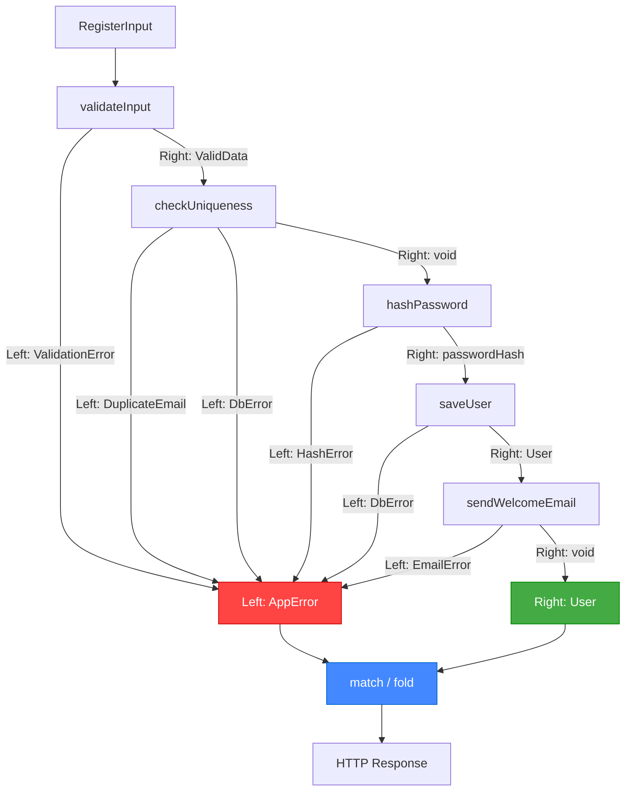

# Глава: TaskEither — глубокое погружение

> [!info] Context
> Девятая глава курса по функциональному программированию в TypeScript. Полное руководство по `TaskEither` — центральному типу fp-ts для работы с асинхронными операциями, которые могут завершиться ошибкой. Глава не вводная: предполагается, что вы уже знакомы с базовым использованием `tryCatch`, `map`, `chain`, `fromEither`, `fromOption`, `sequenceS` и `traverse` из предыдущих глав.
>
> **Пререквизиты:** [[pure-functions-and-pipe]], [[types-adt-option]], [[functor]], [[monad]], [[applicative]], [[fp-ts-practice]], [[traversable-rte]]

## Overview

В [[fp-ts-practice]] мы познакомились с `TaskEither` как инструментом для async + ошибки, а в [[traversable-rte]] — научились комбинировать массивы `TaskEither` через `traverse` и `sequence`. Эта глава разбирает `TaskEither` **полностью**: все конструкторы, все операции трансформации, семейство `W`-функций, Do notation, `bracket`, обработку ошибок и практические паттерны.

К концу главы вы будете знать:

- Полную карту создания `TaskEither` из любого исходного типа
- Все операции трансформации и их сигнатуры
- Когда и зачем использовать `W`-суффикс (widening)
- Полное семейство обработки ошибок: `orElse`, `alt`, `match`, `matchE`, `fold`, `getOrElse`
- Do notation как альтернативу длинным `chain`-цепочкам
- `bracket` для управления ресурсами
- Антипаттерны и типичные ошибки

## Deep Dive

### 1. Зачем нужен TaskEither — проблема

Асинхронный код в TypeScript живёт на `Promise`. У `Promise` есть фундаментальная проблема: ошибки не типизированы.

```typescript
// Что может пойти не так в этом коде?
async function registerUser(input: RegisterInput): Promise<User> {
  const validated = validateInput(input);           // может бросить ValidationError
  const existing = await db.findByEmail(input.email); // может бросить DbError
  if (existing) throw new DuplicateEmailError();    // бизнес-ошибка
  const hashed = await hashPassword(input.password); // может бросить HashError
  const user = await db.save({ ...validated, password: hashed }); // DbError
  await sendWelcomeEmail(user.email);               // EmailError
  return user;
}
```

Проблемы:

1. **Типы ошибок не видны.** Сигнатура `Promise<User>` ничего не говорит о пяти разных видах ошибок. Вызывающий код не знает, что ловить.
2. **`try/catch` ловит всё подряд.** Тип в `catch` — `unknown`. Каждый `try/catch` превращается в цепочку `instanceof`-проверок.
3. **Контекст теряется.** Если `db.save` бросает ошибку, вы не знаете, случилось это при сохранении пользователя или при другом вызове `db`.
4. **Контроль потока неявный.** `throw` — это goto. Он прерывает выполнение в непредсказуемом месте.

```typescript
// Типичный try/catch — "сpaghetti ошибок":
try {
  const user = await registerUser(input);
  res.json({ data: user });
} catch (err) {
  if (err instanceof ValidationError) {
    res.status(400).json({ error: err.message });
  } else if (err instanceof DuplicateEmailError) {
    res.status(409).json({ error: 'Email уже занят' });
  } else if (err instanceof DbError) {
    logger.error('DB failed', err);
    res.status(500).json({ error: 'Internal error' });
  } else {
    // А это что? unknown. Удачи.
    res.status(500).json({ error: 'Something went wrong' });
  }
}
```

`TaskEither<E, A>` решает все четыре проблемы структурно:

```typescript
type TaskEither<E, A> = () => Promise<Either<E, A>>
```

- **E типизирован.** Сигнатура `TaskEither<AppError, User>` явно говорит: "может вернуть `AppError` или `User`".
- **Ошибки — значения**, а не исключения. Они передаются через `Left`, не через `throw`.
- **Контроль потока явный.** Каждый шаг pipe-цепочки работает только с `Right`. Если любой шаг вернул `Left` — остальные пропускаются.
- **Контекст сохраняется.** Каждый конструктор (`tryCatch`, `left`) сам решает, как описать свою ошибку.

> [!important] Ключевое отличие
> `Promise<T>` — это "значение или бросок". `TaskEither<E, A>` — это "значение типа A или ошибка типа E", и оба варианта — **обычные значения**, которые можно трансформировать, комбинировать и передавать.

---

### 2. Сигнатура типа — полный разбор

```typescript
type TaskEither<E, A> = () => Promise<Either<E, A>>
```

Разберём послойно:

- **`Either<E, A>`** — результат: `Left<E>` (ошибка) или `Right<A>` (успех).
- **`Promise<Either<E, A>>`** — асинхронный результат: Promise, который всегда резолвится (никогда не реджектится), возвращая Either.
- **`() => Promise<...>`** — ленивый thunk: вычисление не начнётся, пока вы не вызовете функцию.

Это `Task` (ленивый `Promise`), внутри которого лежит `Either`. Два слоя абстракции, каждый со своей ответственностью.

#### Почему ленивость важна

`Promise` — нетерпеливый (eager). Как только вы создали Promise, он уже выполняется:

```typescript
// Promise начал выполняться СРАЗУ при создании:
const p = new Promise((resolve) => {
  console.log('Я уже работаю!');
  resolve(42);
});
// В консоли: "Я уже работаю!" — даже если мы ещё не вызвали .then()
```

`TaskEither` — ленивый (lazy). Это **описание** вычисления, а не само вычисление:

```typescript
import * as TE from 'fp-ts/TaskEither';

// Ничего не происходит — это просто функция:
const te = TE.tryCatch(
  () => {
    console.log('Я работаю!');
    return fetch('/api/data');
  },
  (err) => `Fetch failed: ${err}`
);
// Консоль пуста. Запрос не отправлен.

// Вычисление начинается ТОЛЬКО при вызове:
const result = await te();
// Теперь в консоли: "Я работаю!"
```

Ленивость даёт три практических преимущества:

**1. Referential transparency** — один и тот же `TaskEither` можно вызвать несколько раз, и каждый вызов создаёт независимое вычисление:

```typescript
const fetchData: TE.TaskEither<string, Data> = TE.tryCatch(
  () => fetch('/api/data').then(r => r.json()),
  () => 'Network error'
);

// Два независимых запроса:
const result1 = await fetchData();
const result2 = await fetchData();
// result1 и result2 — результаты двух РАЗНЫХ HTTP-запросов
```

**2. Retry** — повторный вызов создаёт новую попытку, а не возвращает закэшированный результат:

```typescript
import { pipe } from 'fp-ts/function';

const retry = <E, A>(
  te: TE.TaskEither<E, A>,
  attempts: number
): TE.TaskEither<E, A> =>
  pipe(
    te,
    TE.orElse((err) =>
      attempts > 1 ? retry(te, attempts - 1) : TE.left(err)
    )
  );
```

**3. Безопасная композиция** — `pipe` строит описание цепочки, не запуская её. Запуск — отдельное решение:

```typescript
// Описываем, но не запускаем:
const pipeline = pipe(
  fetchUser(1),
  TE.chain(validateAge),
  TE.map(formatGreeting)
);

// Запускаем когда готовы:
const result = await pipeline();
```

> [!tip] Сравнение с Promise
> Если `Promise` — это письмо, которое уже отправлено, то `TaskEither` — это **конверт с инструкцией**. Вы можете передать его, скопировать, положить в очередь — и отправить, когда решите.

---

### 3. Полная карта создания TaskEither

У `TaskEither` много конструкторов. Каждый из них — мост из определённого типа в `TaskEither`. Ниже — все основные с сигнатурами и примерами.

#### Базовые конструкторы

```typescript
// right: A → TaskEither<never, A>
// Оборачивает значение в Right
TE.right(42)  // TaskEither<never, number>

// left: E → TaskEither<E, never>
// Оборачивает ошибку в Left
TE.left('не найден')  // TaskEither<string, never>

// of: A → TaskEither<never, A>
// Синоним right (для совместимости с Pointed интерфейсом)
TE.of(42)  // TaskEither<never, number>
```

#### tryCatch — мост из Promise

```typescript
// tryCatch: (f: () => Promise<A>, onRejected: (reason: unknown) => E) => TaskEither<E, A>

// Базовое использование:
const fetchUser = (id: number): TE.TaskEither<string, User> =>
  TE.tryCatch(
    () => fetch(`/api/users/${id}`).then(r => r.json()),
    (err) => `Ошибка загрузки: ${String(err)}`
  );

// Продвинутое: структурированные ошибки
interface FetchError {
  readonly _tag: 'FetchError';
  readonly url: string;
  readonly cause: unknown;
}

const fetchJson = (url: string): TE.TaskEither<FetchError, unknown> =>
  TE.tryCatch(
    () => fetch(url).then(r => {
      if (!r.ok) throw new Error(`HTTP ${r.status}`);
      return r.json();
    }),
    (cause) => ({ _tag: 'FetchError' as const, url, cause })
  );
```

#### Из Either, Option, предикатов

```typescript
// fromEither: Either<E, A> → TaskEither<E, A>
pipe(
  validateInput(data),       // Either<ValidationError, ValidData>
  TE.fromEither              // TaskEither<ValidationError, ValidData>
)

// fromOption: (onNone: () => E) => (option: Option<A>) => TaskEither<E, A>
pipe(
  O.fromNullable(user.address),   // Option<Address>
  TE.fromOption(() => 'Адрес не указан')  // TaskEither<string, Address>
)

// fromPredicate: (predicate: (a: A) => boolean, onFalse: (a: A) => E) => (a: A) => TaskEither<E, A>
pipe(
  user,
  TE.fromPredicate(
    (u) => u.age >= 18,
    (u) => `${u.name} младше 18 лет`
  )
)

// fromNullable: (e: E) => (a: A | null | undefined) => TaskEither<E, NonNullable<A>>
pipe(
  config.apiKey,
  TE.fromNullable('API key не настроен')
)
```

#### Из IO, IOEither, Task, TaskOption

```typescript
import * as IO from 'fp-ts/IO';
import * as IOE from 'fp-ts/IOEither';
import * as T from 'fp-ts/Task';

// fromIO: IO<A> → TaskEither<never, A>
// IO = () => A (синхронное side-effect вычисление)
TE.fromIO(() => Date.now())  // TaskEither<never, number>

// fromIOEither: IOEither<E, A> → TaskEither<E, A>
const readEnvVar = (key: string): IOE.IOEither<string, string> =>
  IOE.fromNullable(`Переменная ${key} не найдена`)(process.env[key]);

pipe(
  readEnvVar('DATABASE_URL'),
  TE.fromIOEither
)  // TaskEither<string, string>

// fromTask: Task<A> → TaskEither<never, A>
// Task = () => Promise<A> (async без ошибок)
const delay = (ms: number): T.Task<void> => () =>
  new Promise(resolve => setTimeout(resolve, ms));

TE.fromTask(delay(1000))  // TaskEither<never, void>

// fromTaskOption: (onNone: () => E) => TaskOption<A> => TaskEither<E, A>
import * as TO from 'fp-ts/TaskOption';

const findInCache = (key: string): TO.TaskOption<Data> => /* ... */;

pipe(
  findInCache('user:1'),
  TE.fromTaskOption(() => 'Cache miss')
)
```

#### right/left варианты для IO и Task

```typescript
// rightIO: IO<A> → TaskEither<never, A>
// leftIO:  IO<E> → TaskEither<E, never>
TE.rightIO(() => Date.now())     // TaskEither<never, number>
TE.leftIO(() => new Error('!'))  // TaskEither<Error, never>

// rightTask: Task<A> → TaskEither<never, A>
// leftTask:  Task<E> → TaskEither<E, never>
TE.rightTask(() => Promise.resolve(42))           // TaskEither<never, number>
TE.leftTask(() => Promise.resolve('async error')) // TaskEither<string, never>
```

#### Таблица выбора конструктора

| У вас есть | Используйте | Результат |
|---|---|---|
| Значение `A` | `TE.right(a)` / `TE.of(a)` | `TaskEither<never, A>` |
| Ошибка `E` | `TE.left(e)` | `TaskEither<E, never>` |
| `Promise<A>` | `TE.tryCatch(f, onError)` | `TaskEither<E, A>` |
| `Either<E, A>` | `TE.fromEither` | `TaskEither<E, A>` |
| `Option<A>` | `TE.fromOption(onNone)` | `TaskEither<E, A>` |
| Значение `A \| null \| undefined` | `TE.fromNullable(e)` | `TaskEither<E, A>` |
| Предикат `A => boolean` | `TE.fromPredicate(pred, onFalse)` | `TaskEither<E, A>` |
| `IO<A>` | `TE.fromIO` / `TE.rightIO` | `TaskEither<never, A>` |
| `IOEither<E, A>` | `TE.fromIOEither` | `TaskEither<E, A>` |
| `Task<A>` | `TE.fromTask` / `TE.rightTask` | `TaskEither<never, A>` |
| `TaskOption<A>` | `TE.fromTaskOption(onNone)` | `TaskEither<E, A>` |

> [!tip] Мнемоника
> `from*` — когда исходный тип уже содержит ошибку или вы предоставляете обработчик для случая "нет значения". `right*` / `left*` — когда вы явно решаете, в какой канал попадёт значение.

---

### 4. Трансформация значений (core operations)

Операции трансформации — это функции, которые работают **внутри** `TaskEither`, не разворачивая его. Если текущее значение — `Left`, все операции пропускаются (short-circuit).

#### map — трансформация Right-значения

```typescript
// map: <A, B>(f: (a: A) => B) => (fa: TaskEither<E, A>) => TaskEither<E, B>

pipe(
  TE.right({ name: 'Alice', age: 30 }),
  TE.map(user => user.name.toUpperCase())
)
// TaskEither<never, string> → Right('ALICE')

pipe(
  TE.left('not found'),
  TE.map(user => user.name.toUpperCase())
)
// TaskEither<string, string> → Left('not found') — map не вызвалась
```

#### mapLeft — трансформация Left-значения (ошибки)

```typescript
// mapLeft: <E, G>(f: (e: E) => G) => (fa: TaskEither<E, A>) => TaskEither<G, A>

pipe(
  fetchUser(1),
  TE.mapLeft(err => ({ _tag: 'UserFetchError' as const, message: err }))
)
// Оборачиваем строковую ошибку в структурированную
```

#### bimap — трансформация обоих каналов одновременно

```typescript
// bimap: <E, G, A, B>(f: (e: E) => G, g: (a: A) => B) => (fa: TaskEither<E, A>) => TaskEither<G, B>

pipe(
  fetchUser(1),
  TE.bimap(
    err => `[UserService] ${err}`,           // Left-канал: добавляем префикс
    user => ({ ...user, greeting: `Hi, ${user.name}` })  // Right-канал: обогащаем
  )
)
```

#### chain — последовательная композиция

```typescript
// chain: <E, A, B>(f: (a: A) => TaskEither<E, B>) => (fa: TaskEither<E, A>) => TaskEither<E, B>

const fetchUser = (id: number): TE.TaskEither<string, User> => /* ... */;
const fetchOrders = (userId: number): TE.TaskEither<string, Order[]> => /* ... */;

pipe(
  fetchUser(1),                               // TaskEither<string, User>
  TE.chain(user => fetchOrders(user.id))       // TaskEither<string, Order[]>
)
// user из первого шага передаётся в fetchOrders
// Если fetchUser вернул Left — fetchOrders не вызывается
```

#### chainW — chain с расширением типа ошибки

```typescript
// chainW: <E2, A, B>(f: (a: A) => TaskEither<E2, B>) => (fa: TaskEither<E1, A>) => TaskEither<E1 | E2, B>

// Подробно разбирается в секции 5 (W-суффикс)
```

#### chainFirst (tap) — побочный эффект без изменения значения

```typescript
// chainFirst: <E, A, B>(f: (a: A) => TaskEither<E, B>) => (fa: TaskEither<E, A>) => TaskEither<E, A>

pipe(
  fetchUser(1),
  TE.chainFirst(user =>
    TE.fromIO(() => console.log(`Loaded user: ${user.name}`))
  ),
  // Значение всё ещё User, а не void
  TE.map(user => user.name)
)
```

`chainFirst` выполняет побочный эффект (логирование, метрики, кэширование), но **возвращает оригинальное значение**. Если эффект вернул `Left` — весь pipeline прерывается.

#### chainEitherK / chainEitherKW — встраивание Either в TE-pipeline

```typescript
// chainEitherK: <E, A, B>(f: (a: A) => Either<E, B>) => (fa: TaskEither<E, A>) => TaskEither<E, B>
// chainEitherKW: <E2, A, B>(f: (a: A) => Either<E2, B>) => (fa: TaskEither<E1, A>) => TaskEither<E1 | E2, B>

const validateAge = (user: User): E.Either<string, User> =>
  user.age >= 18 ? E.right(user) : E.left('Пользователь младше 18');

pipe(
  fetchUser(1),                  // TaskEither<string, User>
  TE.chainEitherK(validateAge)   // TaskEither<string, User>
)
// Эквивалентно: TE.chain(user => TE.fromEither(validateAge(user)))
// Но короче и идиоматичнее
```

#### chainOptionK / chainOptionKW — встраивание Option в TE-pipeline

```typescript
// chainOptionK: <E>(onNone: () => E) => <A, B>(f: (a: A) => Option<B>) => (fa: TaskEither<E, A>) => TaskEither<E, B>

const findDiscount = (user: User): O.Option<number> =>
  user.isPremium ? O.some(0.2) : O.none;

pipe(
  fetchUser(1),
  TE.chainOptionK(() => 'Скидка недоступна')(findDiscount)
)
// Если findDiscount вернул none → Left('Скидка недоступна')
```

#### chainIOK / chainTaskK — встраивание IO и Task

```typescript
// chainIOK: <A, B>(f: (a: A) => IO<B>) => (fa: TaskEither<E, A>) => TaskEither<E, B>
// chainTaskK: <A, B>(f: (a: A) => Task<B>) => (fa: TaskEither<E, A>) => TaskEither<E, B>

pipe(
  fetchUser(1),
  TE.chainIOK(user => () => console.log(user.name)),
  // IO не может вернуть ошибку → Left невозможен от этого шага
)

pipe(
  fetchUser(1),
  TE.chainTaskK(user => () => sendAnalytics(user)),
  // Task не может вернуть ошибку → Left невозможен от этого шага
)
```

#### Семейство tap — современные альтернативы chainFirst

fp-ts v2 в поздних релизах добавил семейство `tap`-функций. Они делают то же, что `chainFirst*`, но с более единообразным API:

```typescript
// tap: <E, A, _>(f: (a: A) => TaskEither<E, _>) => (fa: TaskEither<E, A>) => TaskEither<E, A>
// Эквивалент chainFirst

// tapError: <E, _>(f: (e: E) => TaskEither<_, _>) => (fa: TaskEither<E, A>) => TaskEither<E, A>
// Побочный эффект при ошибке (логирование, метрики), не меняет значение
pipe(
  fetchUser(1),
  TE.tapError(err =>
    TE.fromIO(() => console.error(`User fetch failed: ${err}`))
  )
)

// tapEither: <E, A, _>(f: (a: A) => Either<E, _>) => (fa: TaskEither<E, A>) => TaskEither<E, A>
// tapIO: <A, _>(f: (a: A) => IO<_>) => (fa: TaskEither<E, A>) => TaskEither<E, A>
// tapTask: <A, _>(f: (a: A) => Task<_>) => (fa: TaskEither<E, A>) => TaskEither<E, A>

pipe(
  fetchUser(1),
  TE.tapIO(user => () => console.log(`Got user: ${user.name}`)),
  TE.tapEither(user =>
    user.age >= 0 ? E.right(undefined) : E.left('Invalid age')
  )
)
```

#### ap / apW — аппликативное применение

```typescript
// ap: <E, A>(fa: TaskEither<E, A>) => (fab: TaskEither<E, (a: A) => B>) => TaskEither<E, B>

// ap полезен, когда нужно применить функцию к нескольким независимым TaskEither.
// На практике чаще используют sequenceS/Do. Но ap — основа, на которой они построены.

const getName: TE.TaskEither<string, string> = TE.right('Alice');
const getAge: TE.TaskEither<string, number> = TE.right(30);

pipe(
  TE.right((name: string) => (age: number) => ({ name, age })),
  TE.ap(getName),
  TE.ap(getAge)
)
// TaskEither<string, { name: string; age: number }>
```

```typescript
// apFirst: выполнить второй эффект, но вернуть результат первого
// apSecond: выполнить второй эффект и вернуть его результат

pipe(
  fetchUser(1),
  TE.apFirst(logAccess(1))   // логируем, но возвращаем User
)

pipe(
  fetchUser(1),
  TE.apSecond(fetchOrders(1)) // загружаем оба, но возвращаем Orders
)
```

> [!important] chain vs ap: когда что
> - **chain** — второе вычисление **зависит** от результата первого (последовательное).
> - **ap** / **sequenceS** — вычисления **независимы** друг от друга (можно параллелить).
>
> С `TE.ApplyPar` операции `ap` / `sequenceS` запускаются параллельно. `chain` всегда последователен.

---

### 5. W-суффикс (Widening) — расширение типов ошибок

#### Проблема

Рассмотрим pipeline, где каждый шаг возвращает свой тип ошибки:

```typescript
interface ValidationError { readonly _tag: 'ValidationError'; message: string }
interface DbError { readonly _tag: 'DbError'; cause: Error }
interface EmailError { readonly _tag: 'EmailError'; cause: Error }

const validate = (input: unknown): TE.TaskEither<ValidationError, ValidData> => /* ... */;
const save = (data: ValidData): TE.TaskEither<DbError, User> => /* ... */;
const notify = (user: User): TE.TaskEither<EmailError, void> => /* ... */;
```

Если попробовать использовать обычный `chain`:

```typescript
pipe(
  validate(input),
  TE.chain(save),     // ОШИБКА ТИПОВ!
  TE.chain(notify)    // ОШИБКА ТИПОВ!
)
```

TypeScript не может автоматически расширить `ValidationError` до `ValidationError | DbError`. Типы E в `chain` должны совпадать.

#### Решение: W-функции

`W` означает "widening" — расширение типа ошибки до объединения (union):

```typescript
// chain:  (fa: TE<E, A>) => ... => TE<E, B>        — E должен совпадать
// chainW: (fa: TE<E1, A>) => ... => TE<E1 | E2, B> — E расширяется автоматически

pipe(
  validate(input),          // TE<ValidationError, ValidData>
  TE.chainW(save),          // TE<ValidationError | DbError, User>
  TE.chainW(notify)         // TE<ValidationError | DbError | EmailError, void>
)
// Итоговый тип: TaskEither<ValidationError | DbError | EmailError, void>
```

Каждый `chainW` добавляет свой тип ошибки в union. TypeScript автоматически выводит результирующий тип.

#### Где ещё нужен W

`W`-варианты есть у большинства операций, работающих с ошибками:

```typescript
// chainEitherKW — встроить Either с другим типом ошибки
pipe(
  fetchUser(1),                          // TE<FetchError, User>
  TE.chainEitherKW(validateAge)          // TE<FetchError | string, User>
)

// chainOptionKW — встроить Option с другим типом ошибки
pipe(
  fetchUser(1),                          // TE<FetchError, User>
  TE.chainOptionKW(() => 'no discount' as const)(findDiscount)
  // TE<FetchError | 'no discount', number>
)

// orElseW — восстановление с другим типом ошибки
pipe(
  fetchFromPrimary(id),                  // TE<PrimaryError, Data>
  TE.orElseW(() => fetchFromFallback(id)) // TE<FallbackError, Data>
)

// getOrElseW — извлечение с другим типом результата
pipe(
  fetchUser(1),                          // TE<string, User>
  TE.getOrElseW(err => T.of({ guest: true, error: err }))
  // Task<User | { guest: true; error: string }>
)

// matchW / foldW — обработчики возвращают разные типы
pipe(
  fetchUser(1),
  TE.matchW(
    (err) => ({ _tag: 'error' as const, err }),        // { _tag: 'error'; err: string }
    (user) => ({ _tag: 'success' as const, user })     // { _tag: 'success'; user: User }
  )
)
// Task<{ _tag: 'error'; err: string } | { _tag: 'success'; user: User }>
```

> [!tip] Правило
> Используйте `W`-варианты, когда pipeline состоит из операций с **разными типами ошибок**. Это основной сценарий в реальных приложениях, где ошибки моделируются как discriminated union (`_tag`). Если весь pipeline использует один тип `E` (например, `string`) — обычных версий достаточно.

---

### 6. Обработка ошибок — полное семейство

`TaskEither` предлагает несколько способов обработки ошибок. Каждый подходит для своей ситуации.

#### orElse / orElseW — восстановление из ошибки

```typescript
// orElse: <E, A, M>(onLeft: (e: E) => TaskEither<M, A>) => (fa: TaskEither<E, A>) => TaskEither<M, A>

// Попробовать загрузить из кэша, при неудаче — из БД:
pipe(
  fetchFromCache(key),                 // TE<CacheError, Data>
  TE.orElse(() => fetchFromDb(key))    // TE<CacheError, Data> → TE<DbError, Data>
)

// Условное восстановление:
pipe(
  fetchUser(1),
  TE.orElse(err =>
    err === 'not_found'
      ? TE.right(defaultUser)    // восстановились
      : TE.left(err)            // пробрасываем дальше
  )
)

// orElseW — когда fallback возвращает другой тип ошибки:
pipe(
  fetchFromPrimary(id),                   // TE<PrimaryError, Data>
  TE.orElseW(() => fetchFromFallback(id)) // TE<PrimaryError | FallbackError, Data>
)
```

#### alt / altW — fallback без доступа к ошибке

```typescript
// alt: <E, A>(that: () => TaskEither<E, A>) => (fa: TaskEither<E, A>) => TaskEither<E, A>

// Проще, чем orElse — не получаем ошибку, просто подставляем альтернативу:
pipe(
  fetchFromCache(key),
  TE.alt(() => fetchFromDb(key))
)
// Если первый — Right, второй не вызывается
// Если первый — Left, пробуем второй
```

#### match vs matchE (fold) — развёртка TaskEither

Это место, где многие путаются. Разберём по порядку:

```typescript
// match: <E, A, B>(onLeft: (e: E) => B, onRight: (a: A) => B) => (fa: TaskEither<E, A>) => Task<B>
// Обработчики СИНХРОННЫЕ — возвращают B, а не Task<B>

pipe(
  fetchUser(1),
  TE.match(
    (err) => `Ошибка: ${err}`,        // string
    (user) => `Привет, ${user.name}`   // string
  )
)
// Task<string> — просто Task, не TaskEither
// Чтобы получить результат: await pipeline()
```

```typescript
// matchE: <E, A, B>(onLeft: (e: E) => Task<B>, onRight: (a: A) => Task<B>) => (fa: TaskEither<E, A>) => Task<B>
// Обработчики АСИНХРОННЫЕ — возвращают Task<B>
// (устаревшее название: fold)

pipe(
  fetchUser(1),
  TE.matchE(
    (err) => T.of(`Ошибка: ${err}`),                  // Task<string>
    (user) => () => sendAnalytics(user).then(() =>     // Task<string>
      `Привет, ${user.name}`
    )
  )
)
// Task<string>
```

> [!warning] fold — устаревший alias
> `TE.fold` — это **устаревшее имя** для `TE.matchE`. Они идентичны по поведению. В новом коде используйте `match` или `matchE`.

Разница в таблице:

| Функция | Обработчики возвращают | Результат | Когда использовать |
|---|---|---|---|
| `match` | `B` (синхронно) | `Task<B>` | Когда обработка не требует async |
| `matchE` (= `fold`) | `Task<B>` (async) | `Task<B>` | Когда обработка ошибки/успеха — async |
| `matchW` | `B1` / `B2` (разные) | `Task<B1 \| B2>` | Синхронные обработчики с разными типами |
| `matchEW` (= `foldW`) | `Task<B1>` / `Task<B2>` | `Task<B1 \| B2>` | Async обработчики с разными типами |

#### getOrElse / getOrElseW — извлечение значения с fallback

```typescript
// getOrElse: <E, A>(onLeft: (e: E) => Task<A>) => (fa: TaskEither<E, A>) => Task<A>

pipe(
  fetchUser(1),
  TE.getOrElse(() => T.of(defaultUser))
)
// Task<User> — всегда User, ошибка заменена на default

// getOrElseW — когда fallback возвращает другой тип:
pipe(
  fetchUser(1),                                // TE<string, User>
  TE.getOrElseW((err) => T.of(null as null))   // Task<User | null>
)
```

#### tapError — побочный эффект при ошибке

```typescript
// tapError: <E, _>(f: (e: E) => TaskEither<_, _>) => (fa: TaskEither<E, A>) => TaskEither<E, A>

pipe(
  fetchUser(1),
  TE.tapError(err =>
    TE.fromIO(() => logger.error(`User fetch failed: ${err}`))
  )
)
// Если Left — логируем ошибку, но Left и его значение не меняются
// Если Right — tapError не вызывается
```

> [!important] Итог по обработке ошибок
> - **Хотите остаться в TaskEither (восстановиться)?** `orElse` / `orElseW`
> - **Хотите fallback без деталей ошибки?** `alt`
> - **Хотите развернуть в Task (конец pipeline)?** `match` (sync) / `matchE` (async)
> - **Хотите извлечь значение или подставить default?** `getOrElse`
> - **Хотите side-effect на ошибку?** `tapError`

---

### 7. Do notation

#### Проблема: вложенные chain

Когда pipeline длинный и каждый следующий шаг зависит от результатов **нескольких** предыдущих, `chain` становится неудобен:

```typescript
// 5 шагов, каждый зависит от предыдущих — "пирамида chain":
pipe(
  validate(input),
  TE.chainW(validData =>
    pipe(
      checkUniqueness(validData.email),
      TE.chainW((_) =>
        pipe(
          hashPassword(validData.password),
          TE.chainW(hashedPassword =>
            pipe(
              saveUser({ ...validData, password: hashedPassword }),
              TE.chainW(user =>
                pipe(
                  sendEmail(user.email),
                  TE.map(() => user)
                )
              )
            )
          )
        )
      )
    )
  )
)
```

Проблема — каждый `chain` создаёт новый scope. Чтобы `saveUser` имел доступ и к `validData`, и к `hashedPassword`, приходится вкладывать функции друг в друга.

#### Решение: Do notation

Do notation создаёт **контекст** (объект), к которому каждый шаг добавляет свой результат:

```typescript
pipe(
  TE.Do,                                               // TE<never, {}>
  TE.bindW('validData', () => validate(input)),         // TE<ValidationError, { validData: ValidData }>
  TE.bindW('_unique', ({ validData }) =>                // TE<VE | DupError, { validData; _unique }>
    checkUniqueness(validData.email)
  ),
  TE.bindW('hashedPassword', ({ validData }) =>         // TE<VE | DupError | HashError, { validData; _unique; hashedPassword }>
    hashPassword(validData.password)
  ),
  TE.bindW('user', ({ validData, hashedPassword }) =>   // TE<... | DbError, { ...; user }>
    saveUser({ ...validData, password: hashedPassword })
  ),
  TE.chainFirstW(({ user }) => sendEmail(user.email)),  // side effect, не добавляем в контекст
  TE.map(({ user }) => user)                            // извлекаем только user
)
```

Каждый `bind` добавляет поле в объект-контекст. Все предыдущие поля доступны в следующих шагах. Нет вложенности.

#### Операции Do notation

```typescript
// TE.Do: TaskEither<never, {}>
// Точка входа — пустой контекст

// bind: <N, E, A, B>(
//   name: N,
//   f: (a: A) => TaskEither<E, B>
// ) => (fa: TaskEither<E, A>) => TaskEither<E, A & { [K in N]: B }>
// Добавляет поле в контекст. E должен совпадать.

// bindW: то же, что bind, но с widening ошибки (E1 | E2)
// Используйте bindW, когда шаги возвращают разные типы ошибок.

// apS: <N, E, A, B>(
//   name: N,
//   fb: TaskEither<E, B>
// ) => (fa: TaskEither<E, A>) => TaskEither<E, A & { [K in N]: B }>
// Добавляет НЕЗАВИСИМОЕ значение в контекст.
// Отличие от bind: apS не получает текущий контекст — эффект не зависит от предыдущих шагов.

// apSW: apS с widening ошибки

// let: <N, A, B>(
//   name: N,
//   f: (a: A) => B
// ) => (fa: TaskEither<E, A>) => TaskEither<E, A & { [K in N]: B }>
// ЧИСТАЯ трансформация (не эффект). Добавляет вычисленное поле.

// bindTo: <N>(name: N) => <E, A>(fa: TaskEither<E, A>) => TaskEither<E, { [K in N]: A }>
// Стартовать Do из существующего TaskEither (вместо TE.Do + bind).
```

Пример с `apS` и `let`:

```typescript
pipe(
  TE.Do,
  TE.apS('config', loadConfig()),                    // независимый эффект
  TE.apSW('dbPool', createDbPool()),                 // ещё один независимый эффект
  TE.let('maxRetries', ({ config }) => config.maxRetries),  // чистое вычисление
  TE.bindW('user', ({ dbPool }) => findUser(dbPool, userId))
)
```

Пример с `bindTo`:

```typescript
// Вместо:
pipe(
  TE.Do,
  TE.bind('user', () => fetchUser(1))
)

// Можно:
pipe(
  fetchUser(1),
  TE.bindTo('user'),  // TE<string, { user: User }>
  TE.bindW('orders', ({ user }) => fetchOrders(user.id))
)
```

#### Когда что использовать

| Инструмент | Ситуация |
|---|---|
| `chain` / `chainW` | Простой линейный pipeline (2-3 шага), каждый зависит только от предыдущего |
| `Do` + `bind` / `bindW` | Шаги зависят от результатов **нескольких** предыдущих шагов |
| `sequenceS` | Несколько **независимых** эффектов, собираемых в объект |
| `apS` в Do | Добавить независимый эффект в контекст Do |

> [!tip] Совет
> Do notation — это не замена chain, а расширение. Используйте chain для линейных pipeline, Do — когда появляются перекрёстные зависимости между шагами.

---

### 8. Комбинирование нескольких TaskEither

#### sequenceS / sequenceT — краткое напоминание

В [[fp-ts-practice]] мы разобрали `sequenceS` и `sequenceT` для параллельного выполнения независимых `TaskEither`:

```typescript
import { sequenceS } from 'fp-ts/Apply';

pipe(
  sequenceS(TE.ApplyPar)({
    user: fetchUser(1),
    orders: fetchOrders(1),
    notifications: fetchNotifications(1),
  }),
  TE.map(({ user, orders, notifications }) => /* ... */)
)
```

#### Прямые функции traverse / sequence для массивов

Помимо `A.traverse(TE.Applicative*)`, у `TaskEither` есть **встроенные** функции для работы с массивами. Они оптимизированы и не требуют импорта `ReadonlyArray`:

```typescript
// TE.traverseArray: <E, A, B>(f: (a: A) => TaskEither<E, B>) => (as: readonly A[]) => TaskEither<E, readonly B[]>
// Параллельное выполнение (аналог A.traverse(TE.ApplicativePar))

const userIds = [1, 2, 3, 4, 5];

pipe(
  userIds,
  TE.traverseArray(fetchUser)
)
// TaskEither<string, readonly User[]>
// Все запросы стартуют параллельно

// TE.traverseSeqArray: то же, но последовательно
pipe(
  userIds,
  TE.traverseSeqArray(fetchUser)
)
// Запросы выполняются один за другим

// TE.traverseArrayWithIndex: <E, A, B>(f: (i: number, a: A) => TaskEither<E, B>) => (as: readonly A[]) => TaskEither<E, readonly B[]>
pipe(
  userIds,
  TE.traverseArrayWithIndex((index, id) =>
    pipe(
      fetchUser(id),
      TE.mapLeft(err => `Ошибка в элементе ${index}: ${err}`)
    )
  )
)

// TE.traverseSeqArrayWithIndex: то же с индексом, но последовательно
```

Для массива уже готовых `TaskEither`:

```typescript
// TE.sequenceArray: <E, A>(as: readonly TaskEither<E, A>[]) => TaskEither<E, readonly A[]>
const tasks: readonly TE.TaskEither<string, User>[] = userIds.map(fetchUser);

pipe(tasks, TE.sequenceArray)     // параллельно
pipe(tasks, TE.sequenceSeqArray)  // последовательно
```

#### Семантика fail-fast

Все `sequence` и `traverse` для `TaskEither` работают по принципу **fail-fast**: первый `Left` прерывает выполнение (точнее — результат будет `Left`, даже если остальные задачи завершились успешно).

```typescript
const tasks = [
  TE.right(1),
  TE.left('ошибка на втором'),
  TE.right(3),
];

const result = await pipe(tasks, TE.sequenceArray)();
// Left('ошибка на втором') — третий результат потерян
```

> [!warning] Параллельность и fail-fast
> При `TE.traverseArray` (параллельном) все задачи **запускаются** одновременно. Но результат будет `Left`, если хотя бы одна вернула `Left`. Остальные задачи продолжат выполняться (Promise нельзя отменить), но их результаты будут проигнорированы.

#### Когда что

| Задача | Функция |
|---|---|
| Независимые именованные эффекты | `sequenceS(TE.ApplyPar)` |
| Массив → map → собрать (параллельно) | `TE.traverseArray(f)` |
| Массив → map → собрать (последовательно) | `TE.traverseSeqArray(f)` |
| Готовый массив `TaskEither[]` | `TE.sequenceArray` / `TE.sequenceSeqArray` |
| Нужен индекс при маппинге | `TE.traverseArrayWithIndex(f)` |

---

### 9. Запуск TaskEither

`TaskEither` — ленивый. Пока вы не вызовете его как функцию, ничего не произойдёт. Это **принципиально важно**.

#### Базовый запуск

```typescript
const pipeline: TE.TaskEither<AppError, User> = pipe(
  validate(input),
  TE.chainW(save),
  TE.chainW(notify)
);

// Вызываем — получаем Promise<Either<AppError, User>>
const result: E.Either<AppError, User> = await pipeline();
```

#### Типичные точки запуска

На практике TaskEither запускается на "краю" приложения — там, где FP-ядро встречается с императивным миром:

```typescript
// Express route handler:
app.post('/users', async (req, res) => {
  const result = await pipe(
    registerUser(req.body),
    TE.match(
      (err) => {
        switch (err._tag) {
          case 'ValidationError': return res.status(400).json({ error: err.message });
          case 'DuplicateEmail':  return res.status(409).json({ error: 'Email taken' });
          default:                return res.status(500).json({ error: 'Internal error' });
        }
      },
      (user) => res.status(201).json({ data: user })
    )
  )();
});

// main() в CLI-приложении:
const main = async () => {
  const result = await pipe(
    loadConfig(),
    TE.chainW(initApp),
    TE.chainW(runMigrations),
    TE.chainW(startServer),
    TE.match(
      (err) => { console.error('Startup failed:', err); process.exit(1); },
      (server) => { console.log(`Listening on ${server.port}`); }
    )
  )();
};

main();
```

#### Паттерн: FP core -> imperative edge

```
┌─────────────────────────────────────────┐
│         FP Core (чистый код)            │
│  validate → save → notify → ...         │
│  Тип: TaskEither<AppError, Result>      │
│  Всё ленивое, всё composable           │
├─────────────────────────────────────────┤
│         Edge (императивный код)         │
│  match/fold → HTTP response / console   │
│  Вызов: await pipeline()               │
│  Здесь TaskEither "разворачивается"     │
└─────────────────────────────────────────┘
```

Весь бизнес-код остаётся в `TaskEither`. Развёртка (`match`, `getOrElse`, `fold`) происходит только на границе — в route handler, main, или use case entry point.

> [!important] Итог
> Не разворачивайте `TaskEither` в середине pipeline. Оставайтесь в `TaskEither` как можно дольше — это сохраняет типобезопасность ошибок и возможность композиции. Разворачивайте только на "краю".

---

### 10. Практический пример: User Registration Pipeline

Соберём реалистичный end-to-end пример с типизированными доменными ошибками.

#### Определение ошибок

```typescript
type AppError =
  | { readonly _tag: 'ValidationError'; message: string }
  | { readonly _tag: 'DuplicateEmail'; email: string }
  | { readonly _tag: 'HashError'; cause: Error }
  | { readonly _tag: 'DbError'; cause: Error }
  | { readonly _tag: 'EmailError'; cause: Error };

// Smart constructors для ошибок:
const validationError = (message: string): AppError =>
  ({ _tag: 'ValidationError', message });

const duplicateEmail = (email: string): AppError =>
  ({ _tag: 'DuplicateEmail', email });

const hashError = (cause: Error): AppError =>
  ({ _tag: 'HashError', cause });

const dbError = (cause: Error): AppError =>
  ({ _tag: 'DbError', cause });

const emailError = (cause: Error): AppError =>
  ({ _tag: 'EmailError', cause });
```

#### Типы и интерфейсы

```typescript
interface RegisterInput {
  readonly name: string;
  readonly email: string;
  readonly password: string;
}

interface User {
  readonly id: string;
  readonly name: string;
  readonly email: string;
  readonly passwordHash: string;
}

// Имитация зависимостей:
interface Db {
  findByEmail: (email: string) => Promise<User | null>;
  save: (data: Omit<User, 'id'>) => Promise<User>;
}

interface Hasher {
  hash: (password: string) => Promise<string>;
}

interface Mailer {
  sendWelcome: (email: string, name: string) => Promise<void>;
}
```

#### Каждый шаг pipeline — отдельная функция

```typescript
import * as TE from 'fp-ts/TaskEither';
import * as E from 'fp-ts/Either';
import { pipe } from 'fp-ts/function';

// 1. Валидация (синхронная → Either → TaskEither)
const validateInput = (input: RegisterInput): E.Either<AppError, RegisterInput> => {
  if (input.name.trim().length < 2)
    return E.left(validationError('Имя должно содержать минимум 2 символа'));
  if (!input.email.includes('@'))
    return E.left(validationError('Некорректный email'));
  if (input.password.length < 8)
    return E.left(validationError('Пароль должен быть минимум 8 символов'));
  return E.right(input);
};

// 2. Проверка уникальности email
const checkUniqueness = (db: Db) => (email: string): TE.TaskEither<AppError, void> =>
  pipe(
    TE.tryCatch(
      () => db.findByEmail(email),
      (err) => dbError(err as Error)
    ),
    TE.chainW(existing =>
      existing ? TE.left(duplicateEmail(email)) : TE.right(undefined)
    )
  );

// 3. Хэширование пароля
const hashPassword = (hasher: Hasher) => (password: string): TE.TaskEither<AppError, string> =>
  TE.tryCatch(
    () => hasher.hash(password),
    (err) => hashError(err as Error)
  );

// 4. Сохранение в БД
const saveUser = (db: Db) => (data: Omit<User, 'id'>): TE.TaskEither<AppError, User> =>
  TE.tryCatch(
    () => db.save(data),
    (err) => dbError(err as Error)
  );

// 5. Отправка email
const sendWelcomeEmail = (mailer: Mailer) => (user: User): TE.TaskEither<AppError, void> =>
  TE.tryCatch(
    () => mailer.sendWelcome(user.email, user.name),
    (err) => emailError(err as Error)
  );
```

#### Вариант 1: chain pipeline

```typescript
const registerUser = (
  db: Db,
  hasher: Hasher,
  mailer: Mailer
) => (input: RegisterInput): TE.TaskEither<AppError, User> =>
  pipe(
    // Валидация (синхронная Either → TaskEither)
    TE.fromEither(validateInput(input)),

    // Проверяем уникальность email, возвращаем input дальше
    TE.chainFirst(({ email }) => checkUniqueness(db)(email)),

    // Хэшируем пароль
    TE.chain(({ name, email, password }) =>
      pipe(
        hashPassword(hasher)(password),
        TE.map(passwordHash => ({ name, email, passwordHash }))
      )
    ),

    // Сохраняем пользователя
    TE.chain(saveUser(db)),

    // Отправляем welcome email (side effect, не меняем результат)
    TE.chainFirst(user => sendWelcomeEmail(mailer)(user))
  );
```

#### Вариант 2: Do notation

```typescript
const registerUserDo = (
  db: Db,
  hasher: Hasher,
  mailer: Mailer
) => (input: RegisterInput): TE.TaskEither<AppError, User> =>
  pipe(
    TE.fromEither(validateInput(input)),
    TE.bindTo('input'),

    // Проверяем уникальность
    TE.chainFirstW(({ input: { email } }) => checkUniqueness(db)(email)),

    // Хэшируем пароль
    TE.bindW('passwordHash', ({ input: { password } }) =>
      hashPassword(hasher)(password)
    ),

    // Сохраняем в БД — используем и input, и passwordHash
    TE.bindW('user', ({ input: { name, email }, passwordHash }) =>
      saveUser(db)({ name, email, passwordHash })
    ),

    // Отправляем email
    TE.chainFirstW(({ user }) => sendWelcomeEmail(mailer)(user)),

    // Извлекаем только user
    TE.map(({ user }) => user)
  );
```

#### Обработка ошибок на "краю"

```typescript
const handleRegistration = async (
  input: RegisterInput,
  db: Db,
  hasher: Hasher,
  mailer: Mailer
): Promise<{ status: number; body: unknown }> =>
  pipe(
    registerUser(db, hasher, mailer)(input),
    TE.match(
      (err): { status: number; body: unknown } => {
        switch (err._tag) {
          case 'ValidationError':
            return { status: 400, body: { error: err.message } };
          case 'DuplicateEmail':
            return { status: 409, body: { error: `Email ${err.email} уже зарегистрирован` } };
          case 'HashError':
          case 'DbError':
            return { status: 500, body: { error: 'Внутренняя ошибка сервера' } };
          case 'EmailError':
            // Email не отправился — не фатально, пользователь создан
            // Но тут мы в Left, значит chainFirst прервал pipeline...
            // В реальности можно обернуть sendEmail в orElse, чтобы не прерывать
            return { status: 500, body: { error: 'Ошибка отправки email' } };
        }
      },
      (user) => ({ status: 201, body: { data: user } })
    )
  )();
```

> [!tip] О критичности ошибок
> В примере выше `sendWelcomeEmail` через `chainFirst` прерывает весь pipeline при неудаче. Если отправка email некритична, оберните её в `TE.orElse(() => TE.right(undefined))` — тогда ошибка email будет проглочена, а пользователь всё равно создан.

---

### 11. Визуализация pipeline



Каждый шаг pipeline — развилка. Right-путь идёт дальше по цепочке, Left-путь сразу уходит в обработку ошибок. Это и есть short-circuit семантика монады Either/TaskEither.

---

### 12. Антипаттерны

#### 1. Смешивание async/await с TaskEither внутри chain

```typescript
// НЕПРАВИЛЬНО: await внутри chain ломает ленивость и типобезопасность
pipe(
  fetchUser(1),
  TE.chain(async (user) => {          // async => возвращает Promise, НЕ TaskEither!
    const orders = await fetchOrders(user.id)();
    return E.right(orders);           // TypeScript не поймёт, что это TaskEither
  })
)

// ПРАВИЛЬНО: оставайтесь в TaskEither
pipe(
  fetchUser(1),
  TE.chain(user => fetchOrders(user.id))
)
```

#### 2. throw внутри tryCatch callback

```typescript
// ОПАСНО: throw внутри tryCatch будет перехвачен, но неожиданно
TE.tryCatch(
  async () => {
    const res = await fetch('/api');
    if (!res.ok) throw new Error('Bad status');  // перехвачен onRejected
    const data = await res.json();
    if (!data.id) throw new Error('No id');      // тоже перехвачен — но обе ошибки неразличимы
    return data;
  },
  (err) => `Ошибка: ${err}`  // Какая именно? Сеть? Парсинг? Валидация?
)

// ЛУЧШЕ: разделить на шаги с разными типами ошибок
pipe(
  TE.tryCatch(() => fetch('/api'), () => 'Network error'),
  TE.chain(res => res.ok ? TE.right(res) : TE.left(`HTTP ${res.status}`)),
  TE.chain(res => TE.tryCatch(() => res.json(), () => 'Parse error')),
  TE.chain(data => data.id ? TE.right(data) : TE.left('Missing id'))
)
```

#### 3. Забыть, что TaskEither ленивый

```typescript
// НЕПРАВИЛЬНО: вызвали дважды — выполнили дважды
const createUser = TE.tryCatch(
  () => db.insert({ name: 'Alice' }),
  () => 'DB error'
);

await createUser();  // Создали Alice
await createUser();  // Создали Alice ЕЩЁ РАЗ! Два пользователя.

// ПРАВИЛЬНО: осознайте, что каждый вызов — новое выполнение.
// Если нужно закэшировать — сохраните результат:
const result = await createUser();
// Используйте result дальше
```

#### 4. Использование `any` для типа ошибки

```typescript
// НЕПРАВИЛЬНО: потеряли весь смысл типизации ошибок
const fetchData = (): TE.TaskEither<any, Data> => /* ... */;

// ПРАВИЛЬНО: типизируйте ошибки
const fetchData = (): TE.TaskEither<FetchError, Data> => /* ... */;

// Или хотя бы unknown, если тип ещё не определён:
const fetchData = (): TE.TaskEither<unknown, Data> => /* ... */;
```

#### 5. Вложенные TaskEither вместо chain

```typescript
// НЕПРАВИЛЬНО: TaskEither<E, TaskEither<E, A>> — двойная обёртка
pipe(
  fetchUser(1),
  TE.map(user => fetchOrders(user.id))
)
// Результат: TaskEither<string, TaskEither<string, Order[]>>
// Два слоя! Чтобы запустить внутренний, нужен ещё один await.

// ПРАВИЛЬНО: chain "сплющивает" вложенность
pipe(
  fetchUser(1),
  TE.chain(user => fetchOrders(user.id))
)
// Результат: TaskEither<string, Order[]>
```

Мнемоника: `map` — когда функция возвращает обычное значение (`A => B`). `chain` — когда функция возвращает контейнер (`A => TaskEither<E, B>`).

#### 6. Путаница Promise\<Either\<E, A\>\> и TaskEither\<E, A\>

```typescript
// Это НЕ одно и то же:
const eager: Promise<E.Either<string, number>> = Promise.resolve(E.right(42));
// ^ Уже выполняется!

const lazy: TE.TaskEither<string, number> = () => Promise.resolve(E.right(42));
// ^ Ждёт вызова.

// Конвертация:
// Promise<Either<E, A>> → TaskEither<E, A>:
const te: TE.TaskEither<string, number> = () => eager;

// TaskEither<E, A> → Promise<Either<E, A>>:
const promise: Promise<E.Either<string, number>> = lazy();
```

> [!important] Итог по антипаттернам
> Большинство ошибок связаны с пересечением границы между императивным (async/await, throw) и функциональным (TaskEither, chain, pipe) мирами. Правило простое: **внутри pipeline оставайтесь в TaskEither**. Переход в императивный мир — только на "краю".

---

### 13. bracket — управление ресурсами

`bracket` реализует паттерн **acquire / use / release** — безопасное управление ресурсами, гарантирующее освобождение ресурса даже при ошибке.

```typescript
// bracket: <E, A, B>(
//   acquire: TaskEither<E, A>,
//   use: (a: A) => TaskEither<E, B>,
//   release: (a: A, e: Either<E, B>) => TaskEither<E, void>
// ) => TaskEither<E, B>
```

Три фазы:

1. **acquire** — получить ресурс (открыть соединение, файл, транзакцию).
2. **use** — использовать ресурс. Может завершиться успехом или ошибкой.
3. **release** — освободить ресурс. Вызывается **всегда**, независимо от результата use.

#### Пример: транзакция БД

```typescript
interface DbConnection {
  query: (sql: string) => Promise<unknown[]>;
  beginTransaction: () => Promise<void>;
  commit: () => Promise<void>;
  rollback: () => Promise<void>;
  release: () => Promise<void>;
}

const acquireConnection = (pool: DbPool): TE.TaskEither<AppError, DbConnection> =>
  TE.tryCatch(
    () => pool.getConnection(),
    (err) => dbError(err as Error)
  );

const useConnection = (conn: DbConnection): TE.TaskEither<AppError, User> =>
  pipe(
    TE.tryCatch(() => conn.beginTransaction(), (e) => dbError(e as Error)),
    TE.chain(() => TE.tryCatch(
      () => conn.query('INSERT INTO users ...').then(rows => rows[0] as User),
      (e) => dbError(e as Error)
    )),
    TE.chainFirst(() => TE.tryCatch(
      () => conn.commit(),
      (e) => dbError(e as Error)
    ))
  );

const releaseConnection = (
  conn: DbConnection,
  result: E.Either<AppError, User>
): TE.TaskEither<AppError, void> =>
  pipe(
    E.isLeft(result)
      ? TE.tryCatch(() => conn.rollback(), (e) => dbError(e as Error))
      : TE.right<AppError, void>(undefined),
    TE.chain(() => TE.tryCatch(
      () => conn.release(),
      (e) => dbError(e as Error)
    ))
  );

// Сборка:
const createUserInTransaction = (pool: DbPool): TE.TaskEither<AppError, User> =>
  TE.bracket(
    acquireConnection(pool),
    useConnection,
    releaseConnection
  );
```

#### Пример: файловый дескриптор

```typescript
import * as fs from 'fs/promises';

const withFile = <A>(
  path: string,
  use: (handle: fs.FileHandle) => TE.TaskEither<string, A>
): TE.TaskEither<string, A> =>
  TE.bracket(
    TE.tryCatch(() => fs.open(path, 'r'), () => `Не удалось открыть ${path}`),
    use,
    (handle) => TE.tryCatch(() => handle.close(), () => `Не удалось закрыть ${path}`)
  );

// Использование:
const readFirstLine = (path: string): TE.TaskEither<string, string> =>
  withFile(path, (handle) =>
    TE.tryCatch(
      async () => {
        const buf = Buffer.alloc(1024);
        await handle.read(buf, 0, 1024, 0);
        return buf.toString('utf-8').split('\n')[0];
      },
      () => 'Ошибка чтения файла'
    )
  );
```

> [!important] Итог
> `bracket` гарантирует: если ресурс получен (acquire success), release **обязательно** вызовется. Это функциональный аналог `try/finally`. Используйте его для DB-соединений, файлов, транзакций, блокировок.

---

### 14. Куда двигаться дальше

#### Effect-TS как духовный наследник

fp-ts v2 заложил фундамент функционального программирования в TypeScript, но у него есть ограничения: ручное управление стеком монад (TaskEither, ReaderTaskEither, StateReaderTaskEither...), отсутствие встроенной concurrency, трассировки ошибок и управления ресурсами "из коробки".

[Effect-TS](https://effect.website/) — следующее поколение, которое решает эти проблемы. Единый тип `Effect<A, E, R>` заменяет всю иерархию fp-ts: Task, Either, TaskEither, Reader, ReaderTaskEither. Встроенные fiber-based concurrency, structured logging, resource management (аналог bracket, но мощнее), dependency injection через layers.

Если fp-ts — это "изучи основы ФП в TypeScript", то Effect — это "используй ФП в production". Но знание fp-ts не пропадает: паттерны (pipe, chain, map, Either, discriminated unions для ошибок) — те же.

#### fp-ts v2 в production

fp-ts v2 стабилен и активно используется в production. Библиотека не развивается активно (Giulio Canti работает над Effect), но это не проблема: API зафиксирован, багов практически нет, экосистема (io-ts, monocle-ts, fp-ts-contrib) покрывает большинство задач.

Если вы начинаете новый проект и хотите ФП — рассмотрите Effect. Если работаете с существующей fp-ts-кодовой базой — fp-ts v2 полностью достаточен.

Для более продвинутых паттернов работы с зависимостями смотрите [[traversable-rte]] — там разобран ReaderTaskEither.

## Related Topics

- [[pure-functions-and-pipe]]
- [[types-adt-option]]
- [[functor]]
- [[monad]]
- [[applicative]]
- [[fp-ts-practice]]
- [[traversable-rte]]

## Sources

- [fp-ts TaskEither module — API reference](https://gcanti.github.io/fp-ts/modules/TaskEither.ts.html)
- [fp-ts Getting started](https://gcanti.github.io/fp-ts/learning-resources/)
- [Practical Guide to fp-ts — Part 1-4](https://rlee.dev/practical-guide-to-fp-ts-part-1)
- Introduction to Functional Programming using TypeScript — Giulio Canti
- [Effect-TS documentation](https://effect.website/docs/introduction)
- [fp-ts recipes: Do notation](https://gcanti.github.io/fp-ts/recipes/do-notation.html)

---

*Глава написана моделью claude-opus-4-6 (Opus 4.6)*
