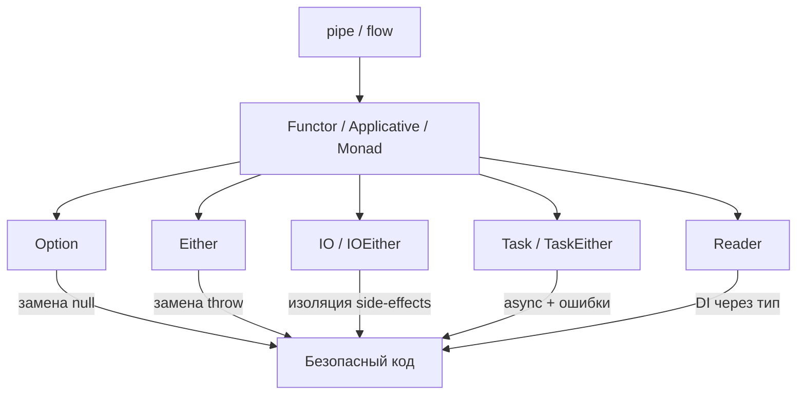

# Chapter: fp-ts -- Теория и Core Types (Phase 1 + 2)

> [!info] Context
> Эта глава охватывает библиотеку `fp-ts` для функционального программирования на TypeScript. Мы разберём инструменты композиции (`pipe`, `flow`), теорию (Functor, Applicative, Monad) и основные типы данных (`Option`, `Either`, `IO`, `IOEither`, `Task`, `TaskEither`, `Reader`). Предполагается знание generics, discriminated unions, каррирования и композиции функций. Паттерн Either уже знаком из `[[unsound]]`.

## Overview

fp-ts -- это библиотека, которая переносит абстракции из теории категорий в TypeScript. Вместо того чтобы бросать исключения, возвращать `null` или работать с `Promise` без типа ошибки, fp-ts делает все эти случаи **явными в системе типов**.



Ключевая идея: все эти типы -- контейнеры, которые поддерживают одинаковый набор операций (`map`, `chain`, `match`). Изучив паттерн на `Option`, ты применишь его к `Either`, `Task` и далее.

> [!important] Статус fp-ts
> Автор fp-ts (Giulio Canti) присоединился к команде Effect-TS в 2023 году. Активная разработка fp-ts остановилась. Новые проекты рекомендуется начинать на Effect. Однако fp-ts остаётся в production во множестве кодовых баз, а изученные здесь концепции **напрямую переносятся** на Effect.

---

## Deep Dive

### 1. Контекст и мотивация

TypeScript -- мощная система типов, но три проблемы остаются на уровне runtime:

**Проблема 1: `null` и `undefined`**

```typescript
function findUser(id: number): User | undefined {
  return users.get(id)
}

// Каждый вызов требует проверки
const user = findUser(1)
if (user) {
  console.log(user.name) // а если забыл проверку?
}
```

**Проблема 2: `throw` не отражён в типах**

```typescript
function parseJSON(s: string): unknown {
  return JSON.parse(s) // может бросить SyntaxError, но тип этого не показывает
}
```

Как уже разобрано в `[[unsound]]`, `throw` делает функцию **нечестной** -- сигнатура обещает вернуть значение, а на деле может бросить исключение. Тип ошибки нигде не фиксируется.

**Проблема 3: `Promise` без типа ошибки**

```typescript
// Promise<User> -- а какая ошибка? NetworkError? ValidationError? unknown?
async function fetchUser(id: number): Promise<User> {
  const res = await fetch(`/api/users/${id}`)
  if (!res.ok) throw new Error('Not found')
  return res.json()
}
```

fp-ts решает все три проблемы, делая побочные эффекты и ошибки **частью типа возвращаемого значения**.

> [!tip] Ключевой вывод
> fp-ts не добавляет магии -- он делает неявное явным. `Option` вместо `null`, `Either` вместо `throw`, `TaskEither` вместо `Promise` + неизвестная ошибка.

---

### 2. Инструменты композиции: pipe и flow

Прежде чем перейти к типам, нужно освоить два инструмента -- они используются **в каждом** примере fp-ts.

```typescript
import { pipe, flow } from 'fp-ts/function'
```

#### pipe -- значение первым

`pipe` принимает начальное значение и последовательно применяет функции:

```typescript
const add1 = (n: number): number => n + 1
const multiply2 = (n: number): number => n * 2
const toString = (n: number): string => `Result: ${n}`

// Без pipe -- вложенные вызовы, читаем справа налево
toString(multiply2(add1(1))) // "Result: 4"

// С pipe -- читаем сверху вниз
pipe(
  1,
  add1,      // 2
  multiply2, // 4
  toString   // "Result: 4"
)
```

`pipe` **вычисляется немедленно** и возвращает результат. TypeScript хорошо выводит типы внутри `pipe`.

#### flow -- point-free стиль

`flow` принимает **только функции** и возвращает новую функцию:

```typescript
// flow создаёт переиспользуемую трансформацию
const transform = flow(add1, multiply2, toString)

transform(1) // "Result: 4"
transform(5) // "Result: 12"
```

`flow` полезен, когда нужно передать трансформацию как аргумент или сохранить для повторного использования.

#### Когда что использовать

| | `pipe` | `flow` |
|---|---|---|
| Первый аргумент | Значение | Функция |
| Возвращает | Результат | Новую функцию |
| Вывод типов | Отличный | Иногда требует аннотаций |
| Применение | Основной инструмент | Создание переиспользуемых трансформаций |

> [!warning] v1 vs v2
> В fp-ts v1 использовался method chaining: `O.some(1).map(f).chain(g)`. В v2 это **полностью заменено** на pipe-стиль: `pipe(O.some(1), O.map(f), O.chain(g))`. Старые туториалы с method chaining не работают в v2 -- проверяй дату статьи.

**Итог:** `pipe` -- основной инструмент, используй его по умолчанию. `flow` -- для создания переиспользуемых функций-трансформаций.

---

### 3. Теория: Functor, Applicative, Monad

Эти три понятия -- не абстрактная математика, а **паттерны**, которые ты уже используешь в JavaScript. Разберём каждый через знакомые аналогии.

#### Functor -- контейнер с map

Functor -- это любой "контейнер", который умеет применять функцию к своему содержимому через `map`, не распаковывая контейнер.

Знакомые примеры из JS:

```typescript
// Array -- Functor
[1, 2, 3].map(n => n * 2) // [2, 4, 6]

// Promise -- (почти) Functor
Promise.resolve(1).then(n => n * 2) // Promise<2>
```

В fp-ts все основные типы -- Functor'ы:

```typescript
import * as O from 'fp-ts/Option'
import { pipe } from 'fp-ts/function'

pipe(
  O.some(5),
  O.map(n => n * 2) // Option<number> -- some(10)
)
```

**Законы Functor** (для понимания, не для зубрёжки):

1. **Identity:** `map(x => x)` не меняет контейнер -- `map(id) === id`
2. **Composition:** два `map` подряд эквивалентны одному `map` с композицией -- `map(f) . map(g) === map(f . g)`

Эти законы гарантируют **предсказуемость**: `map` не делает ничего "магического" с контейнером, только трансформирует содержимое.

#### Applicative -- независимые вычисления

Functor решает задачу "применить функцию к значению внутри контейнера". Но что, если **функция тоже внутри контейнера**?

Задача: применить функцию `(a: number, b: number) => number` к двум **независимым** значениям `Option<number>`.

```typescript
import * as O from 'fp-ts/Option'
import * as A from 'fp-ts/Apply'
import { pipe } from 'fp-ts/function'

const add = (a: number) => (b: number): number => a + b

// Applicative-стиль: оба значения независимы
pipe(
  O.some(add),            // Option<(a: number) => (b: number) => number>
  O.ap(O.some(2)),        // Option<(b: number) => number>
  O.ap(O.some(3))         // Option<number> -- some(5)
)

// Если хотя бы одно -- none, результат none
pipe(
  O.some(add),
  O.ap(O.none),           // Option<(b: number) => number> -- none
  O.ap(O.some(3))         // Option<number> -- none
)
```

Аналогия из JS: `Promise.all` -- запускает промисы **параллельно** (независимо друг от друга), а потом комбинирует результаты.

#### Monad -- последовательные вычисления и вложенность

Проблема, которую Functor не решает: что делать, если функция внутри `map` **сама возвращает контейнер**?

```typescript
const findUser = (id: number): O.Option<User> => /* ... */
const getEmail = (user: User): O.Option<string> => /* ... */

// map даёт вложенность:
pipe(
  findUser(1),
  O.map(getEmail) // Option<Option<string>> -- вложенный контейнер!
)

// chain (flatMap) убирает уровень:
pipe(
  findUser(1),
  O.chain(getEmail) // Option<string> -- плоско!
)
```

`chain` = `map` + "разворачивание" (flatten/join). Это и есть суть Monad.

> [!important] Ключевое отличие
> - **Functor (`map`):** `A => B` -- простая трансформация содержимого
> - **Applicative (`ap`):** **независимые** вычисления, комбинирование результатов
> - **Monad (`chain`):** **последовательные** вычисления, где следующий шаг зависит от предыдущего

**Законы Monad** (для справки):

1. **Left identity:** `chain(f)(of(a)) === f(a)`
2. **Right identity:** `chain(of)(m) === m`
3. **Associativity:** порядок группировки `chain` не влияет на результат

**Итог:** Functor, Applicative и Monad -- это не что-то новое. `Array.map` -- Functor, `Promise.all` -- Applicative, `Promise.then` с возвратом Promise -- Monad. fp-ts просто формализует эти паттерны для всех типов единообразно.

---

### 4. Option\<A\> -- замена null/undefined

`Option<A>` -- это тип, который представляет значение, которого может не быть. Вместо `A | null | undefined` мы получаем **контейнер**, к которому можно безопасно применять трансформации.

```typescript
import * as O from 'fp-ts/Option'
import { pipe } from 'fp-ts/function'

type Option<A> = { _tag: 'None' } | { _tag: 'Some'; value: A }
```

#### Конструкторы

```typescript
O.some(42)                    // Option<number> -- есть значение
O.none                        // Option<never> -- значения нет

O.fromNullable(null)          // Option<never> -- none
O.fromNullable('hello')       // Option<string> -- some('hello')
O.fromNullable(undefined)     // Option<never> -- none

O.fromPredicate(
  (n: number) => n > 0
)(5)                          // Option<number> -- some(5)

O.fromPredicate(
  (n: number) => n > 0
)(-1)                         // Option<number> -- none
```

#### Основные операции

```typescript
// map -- трансформация содержимого
pipe(
  O.some(5),
  O.map(n => n * 2)     // some(10)
)

// chain -- когда функция тоже возвращает Option
const safeHead = <A>(arr: A[]): O.Option<A> =>
  arr.length > 0 ? O.some(arr[0]) : O.none

pipe(
  O.some([1, 2, 3]),
  O.chain(safeHead)     // some(1)
)

pipe(
  O.some([] as number[]),
  O.chain(safeHead)     // none
)

// filter -- оставить значение, если удовлетворяет предикату
pipe(
  O.some(5),
  O.filter(n => n > 3)  // some(5)
)

pipe(
  O.some(1),
  O.filter(n => n > 3)  // none
)
```

#### Извлечение значения

```typescript
// match -- обработать оба случая
pipe(
  O.some(42),
  O.match(
    () => 'Значения нет',
    (n) => `Значение: ${n}`
  )
) // "Значение: 42"

// getOrElse -- значение по умолчанию
pipe(
  O.none,
  O.getOrElse(() => 0)
) // 0

// toNullable / toUndefined -- обратно в nullable-мир
pipe(O.some(42), O.toNullable)    // 42
pipe(O.none, O.toNullable)        // null
```

#### Практический пример: безопасный поиск

```typescript
import * as O from 'fp-ts/Option'
import { pipe } from 'fp-ts/function'

interface User {
  name: string
  email: string | null
}

const users = new Map<number, User>([
  [1, { name: 'Alice', email: 'alice@example.com' }],
  [2, { name: 'Bob', email: null }],
])

const findUser = (id: number): O.Option<User> =>
  O.fromNullable(users.get(id))

const getEmail = (user: User): O.Option<string> =>
  O.fromNullable(user.email)

const getUpperEmail = (userId: number): string =>
  pipe(
    findUser(userId),
    O.chain(getEmail),
    O.map(email => email.toUpperCase()),
    O.getOrElse(() => 'No email')
  )

getUpperEmail(1) // "ALICE@EXAMPLE.COM"
getUpperEmail(2) // "No email" (email === null)
getUpperEmail(3) // "No email" (пользователь не найден)
```

Ни одного `if`, ни одной проверки на `null` -- всё обрабатывается через цепочку.

> [!warning] map vs chain
> Если функция возвращает `Option` (как `getEmail` выше), используй `chain`, а не `map`. Иначе получишь `Option<Option<string>>` -- вложенный контейнер, который бесполезен.

**Итог:** `Option` заменяет `null`/`undefined`, позволяя строить цепочки трансформаций без проверок. Если значения нет на любом этапе, вся цепочка безопасно возвращает `none`.

---

### 5. Either\<E, A\> -- type-safe обработка ошибок

`Either<E, A>` -- тип с двумя вариантами: `Left<E>` (ошибка) или `Right<A>` (успех). В отличие от `try/catch`, тип ошибки **явно зафиксирован** в сигнатуре.

```typescript
import * as E from 'fp-ts/Either'
import { pipe } from 'fp-ts/function'

type Either<E, A> = { _tag: 'Left'; left: E } | { _tag: 'Right'; right: A }
```

Связь с `[[unsound]]`: паттерн Either, описанный там, -- это ровно то, что fp-ts реализует production-ready.

#### Конструкторы

```typescript
E.right(42)                        // Either<never, number> -- успех
E.left('Error occurred')           // Either<string, never> -- ошибка

E.fromNullable('Value is null')(null)    // Either<string, never> -- left
E.fromNullable('Value is null')(42)      // Either<string, number> -- right

// tryCatch -- обернуть бросающую функцию
E.tryCatch(
  () => JSON.parse('{"a": 1}'),
  (error) => `Parse error: ${String(error)}`
) // Either<string, unknown> -- right({ a: 1 })

E.tryCatch(
  () => JSON.parse('invalid'),
  (error) => `Parse error: ${String(error)}`
) // Either<string, unknown> -- left("Parse error: SyntaxError: ...")
```

#### Основные операции

```typescript
// map -- трансформация правой (успешной) стороны
pipe(
  E.right(5),
  E.map(n => n * 2)          // right(10)
)

pipe(
  E.left('error') as E.Either<string, number>,
  E.map(n => n * 2)          // left('error') -- map не трогает Left
)

// mapLeft -- трансформация левой (ошибочной) стороны
pipe(
  E.left('not found'),
  E.mapLeft(msg => new Error(msg))  // left(Error('not found'))
)

// bimap -- трансформация обеих сторон одновременно
pipe(
  E.right(5),
  E.bimap(
    (err: string) => err.toUpperCase(),
    (n) => n * 2
  )
) // right(10)

// chain -- последовательные вычисления
const parseNumber = (s: string): E.Either<string, number> => {
  const n = Number(s)
  return isNaN(n) ? E.left(`"${s}" is not a number`) : E.right(n)
}

const validatePositive = (n: number): E.Either<string, number> =>
  n > 0 ? E.right(n) : E.left(`${n} is not positive`)

pipe(
  parseNumber('42'),
  E.chain(validatePositive)   // right(42)
)

pipe(
  parseNumber('-5'),
  E.chain(validatePositive)   // left("-5 is not positive")
)

pipe(
  parseNumber('abc'),
  E.chain(validatePositive)   // left('"abc" is not a number')
)
```

#### Извлечение и восстановление

```typescript
// match -- обработать оба случая
pipe(
  E.right(42),
  E.match(
    (err) => `Error: ${err}`,
    (value) => `Success: ${value}`
  )
) // "Success: 42"

// getOrElse -- значение по умолчанию
pipe(
  E.left('error'),
  E.getOrElse(() => 0)
) // 0

// orElse -- попробовать альтернативу при ошибке
pipe(
  E.left('primary failed'),
  E.orElse((err) => E.right(`recovered from: ${err}`))
) // right("recovered from: primary failed")
```

#### Практический пример: переписать try/catch

До (небезопасно):

```typescript
interface Config {
  port: number
  host: string
}

function loadConfig(raw: string): Config {
  const parsed = JSON.parse(raw) // может бросить
  if (typeof parsed.port !== 'number') throw new Error('Invalid port')
  if (typeof parsed.host !== 'string') throw new Error('Invalid host')
  return parsed as Config
}
```

После (type-safe):

```typescript
import * as E from 'fp-ts/Either'
import { pipe } from 'fp-ts/function'

interface Config {
  port: number
  host: string
}

const parseJSON = (raw: string): E.Either<string, unknown> =>
  E.tryCatch(
    () => JSON.parse(raw),
    () => 'Invalid JSON'
  )

const validateConfig = (data: unknown): E.Either<string, Config> => {
  const obj = data as Record<string, unknown>
  if (typeof obj.port !== 'number') return E.left('Invalid port')
  if (typeof obj.host !== 'string') return E.left('Invalid host')
  return E.right({ port: obj.port, host: obj.host })
}

const loadConfig = (raw: string): E.Either<string, Config> =>
  pipe(
    parseJSON(raw),
    E.chain(validateConfig)
  )

// Использование:
loadConfig('{"port": 3000, "host": "localhost"}')
// right({ port: 3000, host: "localhost" })

loadConfig('invalid json')
// left("Invalid JSON")

loadConfig('{"port": "abc"}')
// left("Invalid port")
```

> [!warning] Either -- fail-fast
> Either останавливается на **первой** ошибке. Если нужно **собрать все ошибки** (например, при валидации формы), используется `Validation` -- это тема Phase 3 из `[[fp-ts-roadmap]]`.

**Итог:** `Either` делает ошибку частью типа. `tryCatch` оборачивает бросающие функции, `chain` строит цепочки, `match` обрабатывает результат. Больше никаких `catch(e: unknown)`.

---

### 6. IO\<A\> и IOEither\<E, A\> -- изоляция синхронных side-effects

#### IO\<A\>

`IO<A>` -- это просто `() => A`. Он не делает ничего магического, но даёт **сигнал в типах**: эта функция имеет побочный эффект.

```typescript
import * as IO from 'fp-ts/IO'
import { pipe } from 'fp-ts/function'

// Чистая функция: pure-functions -- нет IO
const add = (a: number) => (b: number): number => a + b

// Побочный эффект: обёрнут в IO
const now: IO.IO<number> = () => Date.now()
const random: IO.IO<number> = () => Math.random()
const log = (message: string): IO.IO<void> => () => console.log(message)
```

Зачем оборачивать? Чтобы сохранить свойства `[[pure-functions]]` для остального кода. Функция, которая возвращает `IO`, сама по себе **чистая** -- она лишь описывает эффект, не выполняя его.

```typescript
// Композиция IO через pipe
const logCurrentTime: IO.IO<void> = pipe(
  now,
  IO.map(t => `Current time: ${t}`),
  IO.chain(log)
)

// Ничего не произошло! IO -- ленивый.
// Запускаем:
logCurrentTime() // печатает "Current time: 1711324800000"
```

#### IOEither\<E, A\>

`IOEither<E, A>` = `() => Either<E, A>` -- синхронный эффект, который может завершиться ошибкой.

```typescript
import * as IOE from 'fp-ts/IOEither'
import * as E from 'fp-ts/Either'
import { pipe } from 'fp-ts/function'

// Чтение из localStorage (может вернуть null)
const getItem = (key: string): IOE.IOEither<string, string> =>
  pipe(
    IOE.tryCatch(
      () => {
        const value = localStorage.getItem(key)
        if (value === null) throw new Error('Not found')
        return value
      },
      () => `Key "${key}" not found in localStorage`
    )
  )

// Разбор JSON из localStorage
const getConfig = pipe(
  getItem('config'),
  IOE.chain((raw) =>
    IOE.tryCatch(
      () => JSON.parse(raw) as Record<string, unknown>,
      () => 'Invalid JSON in config'
    )
  )
)

// Вызов:
const result: E.Either<string, Record<string, unknown>> = getConfig()
```

> [!tip] Когда использовать IO
> `IO` нужен для синхронных побочных эффектов: `Date.now()`, `Math.random()`, `localStorage`, `console.log`, синхронное чтение файлов. Для асинхронных эффектов -- `Task` / `TaskEither`.

**Итог:** `IO` и `IOEither` -- лёгкие обёртки для синхронных побочных эффектов. Они делают нечистоту **явной в типах** и сохраняют ленивость (эффект не выполняется, пока не вызвана функция).

---

### 7. Task\<A\> и TaskEither\<E, A\> -- ленивая асинхронность

#### Task\<A\>

`Task<A>` -- это `() => Promise<A>`. Ключевое отличие от `Promise`: Task **ленив** -- он не запускается при создании.

```typescript
import * as T from 'fp-ts/Task'
import { pipe } from 'fp-ts/function'

// Promise -- eager (запускается сразу):
const eager = fetch('/api/users') // запрос уже ушёл!

// Task -- lazy (не запускается):
const lazy: T.Task<Response> = () => fetch('/api/users') // ничего не произошло

// Запуск:
lazy() // теперь запрос ушёл, возвращает Promise<Response>
```

```typescript
// Композиция Task
const fetchData: T.Task<string> = () => fetch('/api/data').then(r => r.text())

const processedData: T.Task<string> = pipe(
  fetchData,
  T.map(text => text.toUpperCase())
)

// Ничего не запущено! Запускаем:
processedData().then(console.log) // "SOME DATA..."
```

#### TaskEither\<E, A\> -- главный production-тип

`TaskEither<E, A>` = `() => Promise<Either<E, A>>` -- ленивая асинхронная операция с типизированной ошибкой. Это **самый часто используемый** тип в production fp-ts коде.

```typescript
import * as TE from 'fp-ts/TaskEither'
import * as E from 'fp-ts/Either'
import { pipe } from 'fp-ts/function'

// Обёртка HTTP-запроса
interface ApiError {
  type: 'NetworkError' | 'ParseError' | 'NotFound'
  message: string
}

interface User {
  id: number
  name: string
  email: string
}

const fetchUser = (id: number): TE.TaskEither<ApiError, User> =>
  TE.tryCatch(
    async () => {
      const res = await fetch(`/api/users/${id}`)
      if (!res.ok) {
        throw new Error(`HTTP ${res.status}`)
      }
      return res.json() as Promise<User>
    },
    (error): ApiError => ({
      type: 'NetworkError',
      message: String(error),
    })
  )
```

#### Построение pipeline с TaskEither

```typescript
const validateAge = (user: User): E.Either<ApiError, User> =>
  user.id > 0
    ? E.right(user)
    : E.left({ type: 'NotFound' as const, message: 'Invalid user id' })

const formatGreeting = (user: User): string =>
  `Hello, ${user.name}! Your email is ${user.email}.`

const getUserGreeting = (id: number): TE.TaskEither<ApiError, string> =>
  pipe(
    fetchUser(id),                           // TaskEither<ApiError, User>
    TE.chainEitherK(validateAge),            // TaskEither<ApiError, User>
    TE.map(formatGreeting)                   // TaskEither<ApiError, string>
  )

// Запуск и обработка результата
const main = pipe(
  getUserGreeting(1),
  TE.match(
    (err) => `Error [${err.type}]: ${err.message}`,
    (greeting) => greeting
  )
)

// main -- это Task<string>, нужно вызвать:
main().then(console.log)
```

#### Полезные конструкторы и утилиты

```typescript
// Из значения:
TE.right(42)                    // TaskEither<never, number>
TE.left('error')                // TaskEither<string, never>

// Из Either:
TE.fromEither(E.right(42))      // TaskEither<never, number>

// Из Promise (без типа ошибки -- добавляем через tryCatch):
TE.tryCatch(
  () => fetch('/api/data'),
  (err) => `Network error: ${String(err)}`
)

// Восстановление после ошибки:
pipe(
  fetchUser(999),
  TE.orElse((err) =>
    err.type === 'NotFound'
      ? TE.right({ id: 0, name: 'Guest', email: 'guest@example.com' })
      : TE.left(err)
  )
)
```

> [!warning] Task ленив -- не забудь вызвать
> `TaskEither<E, A>` является **функцией** `() => Promise<Either<E, A>>`. Без `()` в конце pipeline ничего не выполнится. Это частая ошибка новичков.

**Итог:** `TaskEither` -- рабочая лошадка fp-ts. Он комбинирует ленивость, асинхронность и типизированные ошибки. Все HTTP-запросы, обращения к БД и внешние сервисы в fp-ts оборачиваются в `TaskEither`.

---

### 8. Reader\<R, A\> -- dependency injection через тип

`Reader<R, A>` -- это `(r: R) => A`. Он решает проблему "пробрасывания зависимостей через все функции".

#### Проблема

```typescript
interface Deps {
  logger: (msg: string) => void
  apiUrl: string
}

// Без Reader: deps протаскивается через каждую функцию
function getUser(id: number, deps: Deps): string {
  deps.logger(`Fetching user ${id}`)
  return `${deps.apiUrl}/users/${id}`
}

function processUser(id: number, deps: Deps): string {
  const url = getUser(id, deps)
  deps.logger(`Processing ${url}`)
  return url.toUpperCase()
}
```

#### Решение с Reader

```typescript
import * as R from 'fp-ts/Reader'
import { pipe } from 'fp-ts/function'

interface Deps {
  logger: (msg: string) => void
  apiUrl: string
}

// Каждая функция возвращает Reader -- "обещание вычислить при наличии deps"
const getUser = (id: number): R.Reader<Deps, string> =>
  (deps) => {
    deps.logger(`Fetching user ${id}`)
    return `${deps.apiUrl}/users/${id}`
  }

const processUser = (id: number): R.Reader<Deps, string> =>
  pipe(
    getUser(id),
    R.map(url => url.toUpperCase())
  )

// Зависимости подаются ОДИН РАЗ, в точке вызова:
const deps: Deps = {
  logger: console.log,
  apiUrl: 'https://api.example.com',
}

processUser(1)(deps)
// Печатает: "Fetching user 1"
// Возвращает: "HTTPS://API.EXAMPLE.COM/USERS/1"
```

#### chain для зависимых вычислений

```typescript
const getFullInfo = (id: number): R.Reader<Deps, string> =>
  pipe(
    getUser(id),
    R.chain((url) => (deps) => {
      deps.logger(`Got URL: ${url}`)
      return `User #${id} at ${url}`
    })
  )

getFullInfo(1)(deps)
// Печатает: "Fetching user 1"
// Печатает: "Got URL: https://api.example.com/users/1"
// Возвращает: "User #1 at https://api.example.com/users/1"
```

> [!tip] Reader на практике
> `Reader` чаще всего встречается в связке: `ReaderTaskEither<R, E, A>` -- это "асинхронная операция с ошибкой, которая зависит от окружения". Это продвинутая тема, но полезно знать, что такой тип существует.

**Итог:** `Reader` делает зависимости **явной частью типа**. Вместо пробрасывания `deps` через все слои, каждая функция "запрашивает" окружение, а оно подаётся один раз в точке запуска.

---

## Exercises

### Упражнение 1: Переписать функцию с null на Option

Перепиши функцию, убрав все проверки на `null`/`undefined`:

```typescript
// До:
function getDiscountMessage(
  prices: Map<string, number>,
  productId: string
): string {
  const price = prices.get(productId)
  if (price === undefined) return 'Product not found'
  if (price <= 0) return 'Invalid price'
  const discounted = price * 0.9
  return `Discounted price: ${discounted}`
}
```

Реализуй через `pipe`, `O.fromNullable`, `O.filter`, `O.map`, `O.getOrElse`.

<details>
<summary>Подсказка</summary>

Начни с `O.fromNullable(prices.get(productId))`, затем `O.filter` для проверки `> 0`, `O.map` для расчёта скидки и форматирования, `O.getOrElse` для дефолтного сообщения.

Обрати внимание: `O.getOrElse` не различает "не найден" и "невалидная цена". Если это важно, нужен `Either`.
</details>

---

### Упражнение 2: Переписать try/catch на Either

Перепиши эту функцию без `try/catch` и `throw`:

```typescript
// До:
function processInput(raw: string): number {
  const parsed = JSON.parse(raw)
  if (typeof parsed.value !== 'number') {
    throw new Error('Missing numeric value')
  }
  if (parsed.value < 0) {
    throw new Error('Value must be non-negative')
  }
  return parsed.value * 2
}
```

Используй `E.tryCatch`, `E.chain`, `E.map`. Тип результата должен быть `Either<string, number>`.

<details>
<summary>Подсказка</summary>

Разбей на три шага: `parseJSON` (tryCatch), `extractValue` (проверка типа, возвращает Either), `validateNonNegative` (проверка `>= 0`, возвращает Either). Соедини через `pipe` + `chain`.
</details>

---

### Упражнение 3: HTTP-запрос через TaskEither

Реализуй функцию `fetchTodo`, которая:
1. Загружает TODO по id с `https://jsonplaceholder.typicode.com/todos/{id}`
2. Парсит JSON
3. Проверяет, что `title` -- строка
4. Возвращает `TaskEither<string, { id: number; title: string; completed: boolean }>`

```typescript
// Шаблон:
import * as TE from 'fp-ts/TaskEither'
import { pipe } from 'fp-ts/function'

interface Todo {
  id: number
  title: string
  completed: boolean
}

const fetchTodo = (id: number): TE.TaskEither<string, Todo> =>
  // твой код
```

<details>
<summary>Подсказка</summary>

Используй `TE.tryCatch` для fetch + json, затем `TE.chainEitherK` для валидации (функция, возвращающая `Either`).
</details>

---

### Упражнение 4: Мини-pipeline валидация + трансформация

Напиши pipeline, который:
1. Принимает `unknown` (данные из внешнего источника)
2. Проверяет, что это объект с полями `name: string` и `age: number`
3. Проверяет, что `age >= 18`
4. Возвращает строку `"Welcome, {name}!"` или описание ошибки

Тип: `(input: unknown) => Either<string, string>`. Без единого `if/throw`.

<details>
<summary>Подсказка</summary>

Создай отдельные функции-валидаторы, каждая возвращает `Either<string, ...>`. Соедини их через `pipe` + `E.chain`. Финальный `E.map` форматирует приветствие.
</details>

---

## Anki Cards

> [!tip] Flashcards

> Q: Чем `pipe` отличается от `flow` в fp-ts?
> A: `pipe(value, f, g)` принимает значение первым аргументом и вычисляется немедленно. `flow(f, g)` принимает только функции и возвращает новую функцию (point-free стиль).

> Q: Что такое Functor простыми словами?
> A: Контейнер, который реализует `map` -- позволяет применить функцию к содержимому, не распаковывая контейнер. Пример из JS: `Array.map`.

> Q: Чем Monad (`chain`) отличается от Functor (`map`)?
> A: `map` применяет `A => B` и получает `F<B>`. `chain` применяет `A => F<B>` и "разворачивает" результат, избегая вложенности `F<F<B>>`. chain = map + flatten.

> Q: Что произойдёт, если использовать `O.map` вместо `O.chain`, когда функция возвращает `Option`?
> A: Получится вложенный тип `Option<Option<A>>` вместо плоского `Option<A>`. Нужно использовать `chain` для функций, возвращающих контейнер.

> Q: Чем `Either` отличается от `Option`?
> A: `Option` -- есть значение или нет (`Some | None`). `Either` -- успех или **типизированная ошибка** (`Right<A> | Left<E>`). Either несёт информацию о причине неудачи.

> Q: Что делает `E.tryCatch`?
> A: Оборачивает функцию, которая может бросить исключение, в `Either`. Первый аргумент -- функция, второй -- обработчик ошибки. Возвращает `Right` при успехе, `Left` при исключении.

> Q: Чем `Task` отличается от `Promise`?
> A: `Task<A>` -- это `() => Promise<A>`, он **ленив** (не запускается при создании). `Promise` -- eager (запускается сразу при вызове конструктора). Task нужно вызвать явно: `task()`.

> Q: Что такое `TaskEither<E, A>` и почему это главный production-тип?
> A: `TaskEither<E, A>` = `() => Promise<Either<E, A>>` -- ленивая асинхронная операция с типизированной ошибкой. Покрывает основной сценарий: HTTP-запросы, обращения к БД, внешние сервисы.

> Q: Зачем нужен `IO<A>`, если это просто `() => A`?
> A: `IO` делает побочные эффекты (Date.now, Math.random, console.log) **явными в типе**. Функция, возвращающая `IO`, сама остаётся чистой -- она описывает эффект, но не выполняет его.

> Q: Что такое `Reader<R, A>` и какую проблему он решает?
> A: `Reader<R, A>` = `(r: R) => A`. Решает проблему пробрасывания зависимостей (DI). Вместо передачи deps через все функции, каждая возвращает Reader, а зависимости подаются один раз в точке запуска.

> Q: Почему в fp-ts v2 используется `match` вместо `fold`?
> A: `fold` переименован в `match` в v2. `fold` остался как deprecated alias. Следует использовать `match` как актуальное имя.

> Q: Either -- fail-fast или accumulating? Что использовать для сбора всех ошибок?
> A: Either -- **fail-fast**: останавливается на первой ошибке. Для сбора всех ошибок (например, валидация формы) используется `Validation` / `These` (это отдельная тема).

---

## Related Topics

- `[[unsound]]` -- паттерн Either для обработки ошибок, реализованный вручную
- `[[pure-functions]]` -- чистые функции, отсутствие побочных эффектов
- `[[partial-application]]` -- каррирование и частичное применение
- `[[function-composition]]` -- композиция функций, pipe и compose
- `[[fp-ts-roadmap]]` -- полный roadmap изучения fp-ts (Phase 1-4)

---

## Sources

- [fp-ts official docs](https://gcanti.github.io/fp-ts/) -- точка входа, API reference
- [Option.ts module](https://gcanti.github.io/fp-ts/modules/Option.ts.html) -- полный API Option
- [Either.ts module](https://gcanti.github.io/fp-ts/modules/Either.ts.html) -- полный API Either
- [TaskEither.ts module](https://gcanti.github.io/fp-ts/modules/TaskEither.ts.html) -- полный API TaskEither
- [Mostly Adequate Guide ch08: Functors](https://mostly-adequate.gitbook.io/mostly-adequate-guide/ch08) -- введение в Functor
- [Mostly Adequate Guide ch09: Monads](https://mostly-adequate.gitbook.io/mostly-adequate-guide/ch09) -- Monad, chain, join
- [Mostly Adequate Guide ch10: Applicative](https://mostly-adequate.gitbook.io/mostly-adequate-guide/ch10) -- ap, liftA2
- [Getting started: IO (gcanti)](https://dev.to/gcanti/getting-started-with-fp-ts-io-36p6) -- IO как `() => A`
- [Getting started: Reader (gcanti)](https://dev.to/gcanti/getting-started-with-fp-ts-reader-1ie5) -- Reader для DI
- [Practical Guide: Pipe and Flow (rlee.dev)](https://rlee.dev/practical-guide-to-fp-ts-part-1) -- pipe vs flow
- [Practical Guide: Task, Either, TaskEither (rlee.dev)](https://rlee.dev/practical-guide-to-fp-ts-part-3) -- HTTP через TaskEither
- [fp-ts Cheatsheet (inato)](https://github.com/inato/fp-ts-cheatsheet) -- справочник операций
- [Effect vs fp-ts](https://effect.website/docs/additional-resources/effect-vs-fp-ts/) -- куда движется экосистема
