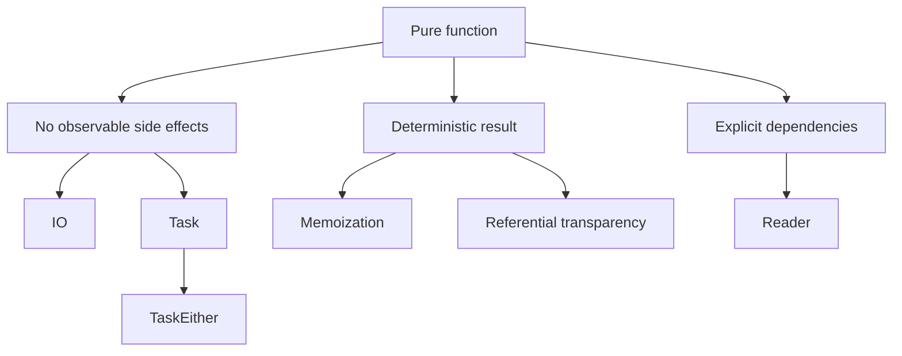

# Chapter: Pure Functions через призму fp-ts

> [!info] Context
> Эта глава переосмысляет `Mostly Adequate Guide`, chapter 03, через `fp-ts`. Центральная идея не меняется: чистая функция всегда ведёт себя предсказуемо и не производит наблюдаемых побочных эффектов. Но теперь мы смотрим на это не как на абстрактную "хорошую практику", а как на фундамент для `IO`, `Task`, `Reader` и `TaskEither`.
>
> **Пререквизиты:** [[pure-functions]], [[function-composition/function-composition|композиция функций]], базовый TypeScript, желательны [[unsound]] и [[fp-ts-phase-1-2]].

## Overview

В оригинале глава доказывает, что pure functions делают программу понятнее, переносимее и тестируемее. В `fp-ts` эта мысль становится ещё практичнее: всё, что не является чистым вычислением, мы стараемся **не выполнять сразу**, а **описывать как значение**.



Отсюда и рабочее правило `fp-ts`:

- если у тебя просто вычисление, верни обычное значение
- если есть синхронный эффект, опиши его через `IO`
- если есть асинхронный эффект, опиши его через `Task`
- если есть async + ошибка, используй `TaskEither`
- если есть внешние зависимости, делай их явными через `Reader`

> [!important] Ключевая мысль
> `fp-ts` не "добавляет чистоту" в программу магически. Он заставляет тебя честно разделить: где вычисление, где эффект, где зависимость, где ошибка.

**Краткое резюме:** pure functions в `fp-ts` важны не сами по себе, а потому что без них невозможно аккуратно строить композицию и контролировать эффекты.

## Deep Dive

### 1. Что такое pure function в `fp-ts`

Чистая функция обладает двумя свойствами:

1. при одинаковых входах она всегда возвращает одинаковый результат
2. она не производит observable side effects

Сначала посмотрим на классический контраст mutation vs pure transformation.

```typescript
import * as RA from 'fp-ts/ReadonlyArray'
import { pipe } from 'fp-ts/function'

const xs = [1, 2, 3, 4, 5]

// pure: не меняет исходный массив
const firstThree = pipe(xs, RA.takeLeft(3))
// [1, 2, 3]

// impure: мутирует исходный массив
const ys = [1, 2, 3, 4, 5]
const removed = ys.splice(0, 3)
// removed = [1, 2, 3]
// ys = [4, 5]
```

`RA.takeLeft` возвращает новый `ReadonlyArray`, а `splice` меняет уже существующее значение. Для функционального стиля это огромная разница: в первом случае мы можем рассуждать о коде локально, во втором обязаны помнить, кто и когда ещё держит ссылку на тот же массив.

Теперь пример с неявной зависимостью:

```typescript
// impure: скрытая зависимость от внешнего состояния
let minimumAge = 21

const canDrinkImpure = (age: number): boolean => age >= minimumAge

// pure: зависимость передаётся явно
const canDrink = (minimum: number) => (age: number): boolean =>
  age >= minimum

canDrink(21)(18) // false
canDrink(21)(30) // true
```

Во втором случае функция честно признаётся, от чего она зависит. Это уже шаг в сторону `Reader`: зависимость перестаёт быть "чем-то в воздухе" и становится обычным входом.

> [!tip] Практический критерий
> Если функция читает время, случайность, сеть, `localStorage`, DOM, глобальную переменную или mutable state, то почти наверняка это уже не pure computation.

**Краткое резюме:** pure function зависит только от аргументов. Как только поведение начинает определяться внешней средой, чистота теряется.

---

### 2. Что считается side effect

В этой главе важно не демонизировать side effects. Эффект сам по себе не плох; проблема в том, что неконтролируемый эффект ломает предсказуемость.

Под side effect обычно попадает:

- запись в файл или базу
- HTTP-запрос
- чтение `Date.now()` или `Math.random()`
- обращение к DOM
- работа с `localStorage`
- мутация объектов и массивов
- логирование
- чтение process/env/config из скрытого окружения

В `fp-ts` на это смотрят так: эффект лучше **представить как значение**, а не запускать немедленно.

```typescript
import * as IO from 'fp-ts/IO'
import * as T from 'fp-ts/Task'

const now: IO.IO<number> = () => Date.now()

const loadUserNames: T.Task<ReadonlyArray<string>> = () =>
  fetch('/api/users')
    .then((response) => response.json() as Promise<ReadonlyArray<{ name: string }>>)
    .then((users) => users.map((user) => user.name))
```

Обрати внимание на разницу:

- `number` уже вычислен
- `IO<number>` только **описывает**, как его получить
- `Task<ReadonlyArray<string>>` только **описывает**, как выполнить async computation

Именно это позволяет держать чистое ядро отдельно от "края программы", где мир уже начинает шуметь.

> [!important] Неожиданный, но важный момент
> Даже чтение состояния системы является эффектом. `Date.now()` не меняет мир, но взаимодействует с внешним источником правды, который не контролируется аргументами функции.

**Краткое резюме:** `fp-ts` не запрещает эффекты. Он учит откладывать их, изолировать и явно обозначать в типах.

---

### 3. Pure functions как математические функции

В математике функция сопоставляет каждому допустимому входу ровно один результат. Для программирования это полезно не из-за школьной ностальгии, а потому что такое мышление делает код прозрачным.

Простейшая таблица отображения:

| Input | Output |
|---|---|
| `1` | `false` |
| `18` | `false` |
| `21` | `true` |
| `42` | `true` |

Эту таблицу реализует функция:

```typescript
const isAdult = (age: number): boolean => age >= 21
```

Если вход полностью определяет выход, мы можем рассуждать о функции как об отображении `A -> B`. В `fp-ts` это особенно важно, потому что композиция живёт именно на честных отображениях:

```typescript
import { flow } from 'fp-ts/function'

const trim = (s: string): string => s.trim()
const toLower = (s: string): string => s.toLowerCase()
const exclaim = (s: string): string => `${s}!`

const normalize = flow(trim, toLower, exclaim)

normalize('  FP-TS  ') // "fp-ts!"
```

Если одна из этих функций внезапно зависела бы от скрытого mutable state, композиция уже стала бы заметно менее надёжной.

> [!tip] Почему это важно для следующих глав
> Functor, Monad, `map`, `chain`, `pipe` и `flow` имеют смысл только тогда, когда шаги в пайплайне не ведут себя хаотично.

**Краткое резюме:** thinking in functions means thinking in mappings. Если вход не диктует выход, композиция становится хрупкой.

---

### 4. Доводы в пользу чистоты

#### 4.1 Memoization

Pure functions можно кэшировать по аргументу, потому что для одного и того же входа ответ всегда один и тот же.

```typescript
const memoize = <A extends string | number, B>(f: (a: A) => B) => {
  const cache = new Map<A, B>()

  return (a: A): B => {
    if (cache.has(a)) {
      return cache.get(a) as B
    }

    const result = f(a)
    cache.set(a, result)
    return result
  }
}

const square = memoize((n: number): number => n * n)

square(4) // 16
square(4) // 16, результат из cache
```

А вот для impure function memoization уже подозрительна:

```typescript
const randomPlus = (n: number): number => n + Math.random()
```

Кэширование такой функции меняет её смысл, а не просто ускоряет вычисление.

В духе оригинальной главы полезно заметить: delayed evaluation иногда помогает сохранить чистоту на границе эффекта.

```typescript
import * as T from 'fp-ts/Task'

const memoizeTask = <A extends string | number, B>(f: (a: A) => T.Task<B>) => {
  const cache = new Map<A, T.Task<B>>()

  return (a: A): T.Task<B> => {
    if (cache.has(a)) {
      return cache.get(a) as T.Task<B>
    }

    const task = f(a)
    cache.set(a, task)
    return task
  }
}
```

Здесь кэшируется не результат network call, а **описание эффекта**. Это всё ещё честнее, чем смешивать вычисление и исполнение в одном месте.

#### 4.2 Portable / self-documenting code

Чистая функция вынуждает быть честным насчёт зависимостей.

```typescript
import * as R from 'fp-ts/Reader'

type Env = Readonly<{
  minimumAge: number
}>

const canDrinkWithEnv = (age: number): R.Reader<Env, boolean> =>
  ({ minimumAge }) => age >= minimumAge

const result = canDrinkWithEnv(20)({ minimumAge: 21 })
// false
```

`Reader<Env, A>` в буквальном смысле кодирует идею: "дай мне окружение `Env`, и я вычислю `A`". Это ровно та же мысль, что в оригинале про explicit dependencies, только доведённая до типовой формы.

#### 4.3 Testability

Pure functions тестируются проще всего:

```typescript
const decrement = (n: number): number => n - 1

decrement(3) // 2
decrement(0) // -1
```

Никаких моков, никакой подготовки среды, никакого скрытого состояния. Просто вход и выход.

В `fp-ts` это особенно важно, потому что можно тестировать отдельно:

- pure transformation
- описание эффекта
- границу исполнения

То есть сначала ты проверяешь "что должно быть сделано", а потом отдельно "как именно это исполняется на краю программы".

> [!tip] Хороший ментальный сдвиг
> Чем больше логики живёт в pure functions, тем меньше тебе нужно мокать инфраструктуру.

**Краткое резюме:** чистота даёт не только красивую теорию, но и конкретные инженерные бонусы: кэширование, переносимость и более дешёвые тесты.

---

### 5. Referential transparency и equational reasoning

Фрагмент кода referentially transparent, если его можно заменить вычисленным значением без изменения поведения программы.

Рассмотрим чистый пример:

```typescript
type Team = 'red' | 'green'

type Player = Readonly<{
  name: string
  hp: number
  team: Team
}>

const decrementHP = (player: Player): Player => ({
  ...player,
  hp: player.hp - 1,
})

const isSameTeam = (left: Player, right: Player): boolean =>
  left.team === right.team

const punch = (attacker: Player, target: Player): Player =>
  isSameTeam(attacker, target) ? target : decrementHP(target)

const jobe: Player = { name: 'Jobe', hp: 20, team: 'red' }
const michael: Player = { name: 'Michael', hp: 20, team: 'green' }

punch(jobe, michael)
// { name: 'Michael', hp: 19, team: 'green' }
```

Теперь можно рассуждать подстановками:

1. `isSameTeam(jobe, michael)` равно `false`
2. значит `punch(jobe, michael)` эквивалентно `decrementHP(michael)`
3. значит результатом будет новый `Player` c `hp: 19`

Это и есть equational reasoning: заменяем equals на equals и шаг за шагом упрощаем программу.

Как только в эту историю попадает mutation, внешний state или неявный эффект, такой способ рассуждения начинает ломаться.

> [!warning] Где новичок обычно ошибается
> "Функция ничего не мутирует, значит она pure". Необязательно. Если она читает `Date.now()`, `process.env`, `window.location` или hidden singleton, ссылочная прозрачность уже нарушена.

**Краткое резюме:** referential transparency ценна тем, что позволяет рефакторить и понимать код через подстановку, а не через мысленную симуляцию всей программы.

---

### 6. Мост к `IO`, `Task`, `Reader` и `TaskEither`

Теперь можно собрать главную идею главы в терминах `fp-ts`.

#### `IO<A>`: "у меня есть синхронный эффект"

```typescript
import * as IO from 'fp-ts/IO'
import { pipe } from 'fp-ts/function'

const readNow: IO.IO<number> = () => Date.now()

const program = pipe(
  readNow,
  IO.map((timestamp) => new Date(timestamp).toISOString())
)
```

`program` пока ничего не исполняет. Он только описывает pipeline над эффектом.

#### `Task<A>`: "у меня есть async effect"

```typescript
import * as T from 'fp-ts/Task'
import { pipe } from 'fp-ts/function'

const loadUsers: T.Task<ReadonlyArray<{ name: string }>> = () =>
  fetch('/api/users').then((response) =>
    response.json() as Promise<ReadonlyArray<{ name: string }>>
  )

const loadUserNames = pipe(
  loadUsers,
  T.map((users) => users.map((user) => user.name))
)
```

#### `TaskEither<E, A>`: "у меня есть async + возможная ошибка"

```typescript
import * as TE from 'fp-ts/TaskEither'
import { pipe } from 'fp-ts/function'

const toError = (reason: unknown): Error =>
  reason instanceof Error ? reason : new Error(String(reason))

const fetchJson = (url: string): TE.TaskEither<Error, unknown> =>
  TE.tryCatch(
    async () => {
      const response = await fetch(url)

      if (!response.ok) {
        throw new Error(`HTTP ${response.status}`)
      }

      return response.json()
    },
    toError
  )

const fetchUserName = (id: string): TE.TaskEither<Error, string> =>
  pipe(
    fetchJson(`/api/users/${id}`),
    TE.map((data) => (data as { name: string }).name)
  )
```

> [!tip] Упрощение ради фокуса главы
> Здесь cast из `unknown` к `{ name: string }` сделан намеренно, чтобы не уводить главу в runtime validation. В production-коде такое место лучше закрывать через `io-ts`, `zod` или другой явный decoder.

#### `Reader<R, A>`: "мои зависимости больше не скрыты"

```typescript
import * as R from 'fp-ts/Reader'

type Dependencies = Readonly<{
  baseUrl: string
}>

const userUrl = (id: string): R.Reader<Dependencies, string> =>
  ({ baseUrl }) => `${baseUrl}/users/${id}`
```

На практике всё это часто собирается вместе в `ReaderTaskEither`, но для текущей главы важнее другое: у каждой проблемы появляется **своя форма честного описания**.

> [!important] Итоговый словарь главы
> - pure computation: `A -> B`
> - sync effect: `IO<A>`
> - async effect: `Task<A>`
> - async effect with error: `TaskEither<E, A>`
> - explicit dependency: `Reader<R, A>`

**Краткое резюме:** оригинальная глава учит отделять чистое вычисление от грязного мира. `fp-ts` даёт для этого конкретные типы и единый стиль композиции.

## Exercises

## Exercise 1: Pure или impure?

**Difficulty:** beginner

**Task:** Для каждой функции определи, является ли она pure. Если нет, объясни, что именно ломает чистоту.

**Requirements:**
- определить purity для каждой функции
- назвать причину impurity, если она есть
- не путать "не мутирует" и "pure"
- оформить ответ в виде функции `classifyPurity`

```typescript
const add = (a: number, b: number): number => a + b

const now = (): number => Date.now()

const setTheme = (theme: string): void => {
  localStorage.setItem('theme', theme)
}

const isAdult = (minimum: number) => (age: number): boolean =>
  age >= minimum
```

**Test cases:**

```typescript
import { expect, test } from 'vitest'

type FunctionName = 'add' | 'now' | 'setTheme' | 'isAdult'
type Classification = Readonly<{
  pure: boolean
  reason: string
}>

const classifyPurity = (_name: FunctionName): Classification => {
  throw new Error('implement me')
}

test('classifyPurity distinguishes pure and impure functions', () => {
  expect(classifyPurity('add').pure).toBe(true)
  expect(classifyPurity('now').pure).toBe(false)
  expect(classifyPurity('setTheme').pure).toBe(false)
  expect(classifyPurity('isAdult').pure).toBe(true)
  expect(classifyPurity('now').reason).toMatch(/внеш|time|состояни/i)
})
```

> [!tip]- Hint
> Смотри на два признака: одинаковые входы и отсутствие observable side effects.

> [!warning]- Solution
> `add` и `isAdult` - pure. `now` impure, потому что читает внешнее время. `setTheme` impure, потому что пишет во внешнюю среду.

## Exercise 2: Выбери правильный контейнер

**Difficulty:** beginner

**Task:** Соотнеси сценарий и подходящий тип: `IO`, `Task`, `Reader`, `TaskEither`.

**Requirements:**
- выбрать один тип для каждого сценария
- не объяснять все детали fp-ts, только распознать форму эффекта
- помнить разницу между зависимостью, sync effect, async effect и async + error
- оформить ответ в виде функции `pickContainer`

- чтение `Date.now()`
- построение URL из `baseUrl`
- HTTP-запрос с возможной ошибкой
- асинхронная загрузка данных без явной модели ошибки

**Test cases:**

```typescript
import { expect, test } from 'vitest'

type Answer = 'IO' | 'Task' | 'Reader' | 'TaskEither'
type Scenario =
  | 'read-current-time'
  | 'build-url-from-base-url'
  | 'http-request-with-error'
  | 'async-load-without-error'

const pickContainer = (_scenario: Scenario): Answer => {
  throw new Error('implement me')
}

test('pickContainer chooses the correct fp-ts type', () => {
  expect(pickContainer('read-current-time')).toBe('IO')
  expect(pickContainer('build-url-from-base-url')).toBe('Reader')
  expect(pickContainer('http-request-with-error')).toBe('TaskEither')
  expect(pickContainer('async-load-without-error')).toBe('Task')
})
```

> [!tip]- Hint
> Сначала спроси себя: это dependency, sync effect, async effect или async + error?

> [!warning]- Solution
> `Date.now()` -> `IO`, URL из `baseUrl` -> `Reader`, HTTP с ошибкой -> `TaskEither`, async без ошибки -> `Task`.

## Exercise 3: Убери скрытую зависимость

**Difficulty:** intermediate

**Task:** Перепиши функцию так, чтобы она больше не зависела от глобальной переменной.

**Requirements:**
- не читать глобальное состояние внутри функции
- сделать зависимость явной
- показать вариант через обычное каррирование или через `Reader`

```typescript
let minimumAge = 21

const canEnter = (age: number): boolean => age >= minimumAge
```

**Test cases:**

```typescript
import { expect, test } from 'vitest'
import * as R from 'fp-ts/Reader'

type Env = Readonly<{ minimumAge: number }>

const canEnter = (_minimumAge: number) => (_age: number): boolean => {
  throw new Error('implement me')
}

const canEnterReader = (_age: number): R.Reader<Env, boolean> => {
  throw new Error('implement me')
}

test('canEnter makes the dependency explicit', () => {
  expect(canEnter(21)(18)).toBe(false)
  expect(canEnter(21)(21)).toBe(true)
  expect(canEnterReader(18)({ minimumAge: 21 })).toBe(false)
  expect(canEnterReader(21)({ minimumAge: 21 })).toBe(true)
})
```

> [!tip]- Hint
> Начни с вопроса: "От чего зависит результат кроме `age`?"

> [!warning]- Solution
> Чистый вариант: `const canEnter = (minimumAge: number) => (age: number) => age >= minimumAge`.  
> `Reader`-вариант: `const canEnterReader = (age: number): Reader<Env, boolean> => ({ minimumAge }) => age >= minimumAge`.

## Exercise 4: Refactor в `TaskEither`

**Difficulty:** intermediate

**Task:** Представь, что у тебя есть `async`-функция, которая бросает исключения. Перепиши её в стиле `TaskEither`.

**Requirements:**
- не использовать `throw` за пределами boundary `TE.tryCatch`
- вернуть `TaskEither<Error, User>`
- сделать ошибку частью типа, а не исключением

```typescript
async function loadUser(id: string): Promise<{ name: string }> {
  const response = await fetch(`/api/users/${id}`)

  if (!response.ok) {
    throw new Error('User not found')
  }

  return response.json()
}
```

**Test cases:**

```typescript
import { expect, test } from 'vitest'
import * as TE from 'fp-ts/TaskEither'
import { pipe } from 'fp-ts/function'

type User = Readonly<{ name: string }>
type HttpResponse<T> = Readonly<{
  ok: boolean
  json: () => Promise<T>
}>
type FetchFn = (url: string) => Promise<HttpResponse<User>>
const loadUser = (_fetchFn: FetchFn, _id: string): TE.TaskEither<Error, User> =>
  TE.left(new Error('implement me'))

test('loadUser returns the user in Right on success', async () => {
  await pipe(
    loadUser(async () => ({
      ok: true,
      json: async () => ({ name: 'Ada' }),
    }), '1'),
    TE.match(
      (error) => {
        throw error
      },
      (user) => {
        expect(user.name).toBe('Ada')
      }
    )
  )()
})
```

> [!tip]- Hint
> Тебе нужен `TE.tryCatch`, а ошибка должна стать частью типа.

> [!tip]- Hint 2
> `throw` допустим внутри `TE.tryCatch`: там он сразу перехватывается и превращается в `Left`.

> [!warning]- Solution
> Используй `TE.tryCatch` и возвращай `TaskEither<Error, User>`. Внутри `tryCatch` можно бросить исключение, но наружу оно должно выйти как `Left`, а не как runtime crash.

## Exercise 5: Challenge — отдели описание от исполнения

**Difficulty:** advanced

**Task:** Спроектируй маленький pipeline:

- `Reader` получает `baseUrl`
- `TaskEither` загружает пользователя
- чистая функция извлекает `name`
- на краю программы выполняется только финальный запуск

**Requirements:**

- не использовать `throw` за пределами boundary `TE.tryCatch`
- не читать `baseUrl` из глобального состояния
- все преобразования имени оставить pure

**Test cases:**

```typescript
import { expect, test } from 'vitest'
import * as R from 'fp-ts/Reader'
import * as TE from 'fp-ts/TaskEither'
import { pipe } from 'fp-ts/function'

type User = Readonly<{ name: string }>
type HttpResponse<T> = Readonly<{
  ok: boolean
  json: () => Promise<T>
}>
type FetchFn = (url: string) => Promise<HttpResponse<User>>
type Env = Readonly<{
  baseUrl: string
  fetchFn: FetchFn
}>
const getUser = (_id: string): R.Reader<Env, TE.TaskEither<Error, User>> =>
  () => TE.left(new Error('implement me'))

const extractName = (_user: User): string => {
  throw new Error('implement me')
}

const env: Env = {
  baseUrl: 'https://example.com/api',
  fetchFn: async () =>
    ({
      ok: true,
      json: async () => ({ name: '  Ada  ' }),
    }) as HttpResponse<User>,
}

test('pipeline keeps dependency, effect, and transformation separate', async () => {
  await pipe(
    getUser('1')(env),
    TE.map(extractName),
    TE.match(
      (error) => {
        throw error
      },
      (name) => {
        expect(name).toBe('Ada')
      }
    )
  )()
})
```

> [!tip]- Hint
> Думай слоями: dependency -> effect -> transformation -> execution.

> [!tip]- Hint 2
> Если чувствуешь, что хочешь "просто вызвать fetch", остановись и сначала опиши это как `TaskEither`.

> [!warning]- Solution
> `Reader` принимает окружение и даёт доступ к `baseUrl` и `fetchFn`. `TaskEither` описывает HTTP-операцию с ошибкой. `extractName` остаётся pure и применяется уже после загрузки пользователя.

## Anki Cards

> [!tip] Flashcards
> Q: Какие два признака есть у pure function?
> A: Для одинаковых входов она возвращает одинаковый результат и не производит observable side effects.

> [!tip] Flashcards
> Q: Почему `Date.now()` считается эффектом?
> A: Потому что функция читает внешнее состояние системы, которое не определяется её аргументами.

> [!tip] Flashcards
> Q: Что даёт referential transparency на практике?
> A: Возможность заменять выражение его значением без изменения поведения программы и рассуждать о коде через подстановку.

> [!tip] Flashcards
> Q: Когда нужен `Reader<R, A>`?
> A: Когда нужно сделать зависимости явными и передавать окружение как вход, а не читать его скрыто.

> [!tip] Flashcards
> Q: В чём разница между `IO`, `Task` и `TaskEither`?
> A: `IO` описывает sync effect, `Task` — lazy async effect, `TaskEither` — lazy async effect с явной ошибкой.

> [!tip] Flashcards
> Q: Почему memoization корректна только для pure functions?
> A: Потому что кэширование предполагает стабильное соответствие "один и тот же вход -> один и тот же результат"; impure function может нарушить это соответствие.

> [!tip] Flashcards
> Q: Что значит "отделить описание эффекта от исполнения"?
> A: Сначала представить effect как значение (`IO`, `Task`, `TaskEither`), а запускать его только на краю программы.

> [!tip] Flashcards
> Q: Как hidden dependencies ломают чистоту функции?
> A: Результат начинает зависеть не только от аргументов, но и от внешнего окружения, поэтому поведение нельзя понять по сигнатуре и входам.

## Related Topics

- [[pure-functions]]
- [[function-composition/function-composition|композиция функций]]
- [[unsound]]
- [[fp-ts-phase-1-2]]
- [[fp-ts-roadmap]]

## Sources

- [Mostly Adequate Guide, chapter 03](https://mostly-adequate.gitbook.io/mostly-adequate-guide/ch03)
- [Mostly Adequate Guide, Russian translation, ch03](https://github.com/MostlyAdequate/mostly-adequate-guide-ru/blob/master/ch03-ru.md)
- [fp-ts documentation](https://gcanti.github.io/fp-ts/)
- [fp-ts IO module](https://gcanti.github.io/fp-ts/modules/IO.ts.html)
- [fp-ts Task module](https://gcanti.github.io/fp-ts/modules/Task.ts.html)
- [fp-ts TaskEither module](https://gcanti.github.io/fp-ts/modules/TaskEither.ts.html)
- [fp-ts Reader module](https://gcanti.github.io/fp-ts/modules/Reader.ts.html)
- [Getting started with fp-ts: IO](https://dev.to/gcanti/getting-started-with-fp-ts-io-36p6)
- [Getting started with fp-ts: Reader](https://dev.to/gcanti/getting-started-with-fp-ts-reader-1ie5)
- [Practical Guide to fp-ts, part 3](https://rlee.dev/practical-guide-to-fp-ts-part-3)
- [Getting started with fp-ts: IO](https://dev.to/gcanti/getting-started-with-fp-ts-io-36p6)
- [Getting started with fp-ts: Reader](https://dev.to/gcanti/getting-started-with-fp-ts-reader-1ie5)
- [Practical Guide to fp-ts, part 3](https://rlee.dev/practical-guide-to-fp-ts-part-3)
