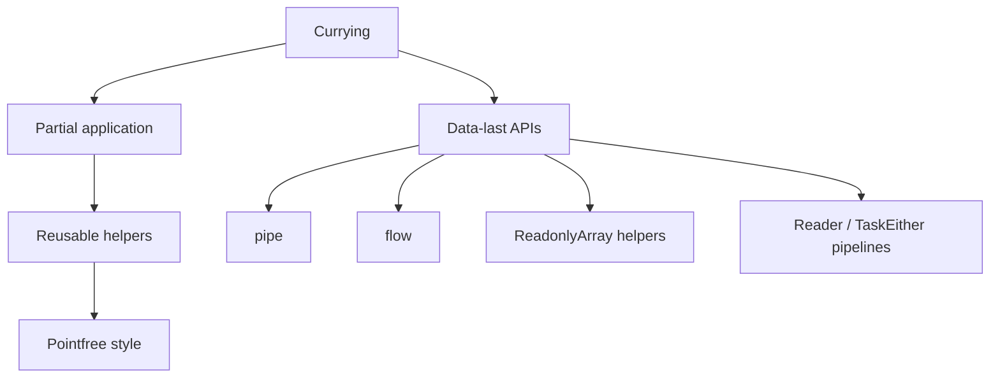

# Chapter: Currying через призму fp-ts

> [!info] Context
> Эта глава переосмысляет `Mostly Adequate Guide`, chapter 04, через `fp-ts`. В оригинале currying подаётся как удобная техника для частичного применения. В `fp-ts` это ещё важнее: currying и `data-last` делают API предсказуемыми, дружелюбными к `pipe` и `flow`, и подготавливают код к композиции поверх `Reader`, `Task`, `TaskEither` и других типов.
>
> **Пререквизиты:** [[pure-functions]], [[partial-application/readme|Частичное применение и каррирование в JavaScript]], [[function-composition/function-composition|Каррирование и композиция функций]], базовый TypeScript; желательно [[fp-ts-phase-1-2]] и [[ch03-pure-functions|Pure Functions через призму fp-ts]].

## Overview

В этой главе currying рассматривается не как “трюк со скобками”, а как форма проектирования функций.



План главы:

1. Разобрать, что такое currying и чем он отличается от обычной функции нескольких аргументов.
2. Отделить currying от partial application.
3. Показать, почему `fp-ts` почти везде использует `data-last`.
4. Связать currying с `pipe`, `flow` и pointfree-style.
5. Показать, как curried helpers упрощают код вокруг `ReadonlyArray`, `Reader` и `TaskEither`.

> [!important] Ключевая мысль
> В `fp-ts` currying важен не ради “красоты”, а потому что он делает функции удобными для композиции. Если API построен как `config -> data`, его можно естественно встраивать в `pipe`.

**Краткое резюме:** currying в `fp-ts` — это не отдельная тема рядом с библиотекой, а один из принципов, на котором библиотека держится.

## Deep Dive

### 1. Что такое currying

Currying — это преобразование функции нескольких аргументов в цепочку функций по одному аргументу.

```typescript
const add = (x: number) => (y: number): number => x + y

const increment = add(1)
const addTen = add(10)

increment(2) // 3
addTen(2) // 12
```

Обычная функция двух аргументов выглядит так:

```typescript
const addPlain = (x: number, y: number): number => x + y

addPlain(1, 2) // 3
```

Внешне результат одинаковый, но форма у функций разная:

- `addPlain` ожидает оба аргумента сразу
- `add` позволяет передать аргументы поэтапно

Currying полезен не потому, что “так математичнее”, а потому, что ты получаешь новые специализированные функции почти бесплатно.

> [!tip] Полезный ментальный образ
> Currying превращает функцию в фабрику более конкретных функций. Сначала ты фиксируешь поведение, потом даёшь данные.

**Краткое резюме:** currying меняет не результат вычисления, а форму API. Именно эта форма и делает функцию удобной для дальнейшей композиции.

---

### 2. Currying и partial application — не одно и то же

Эти понятия близки, но не идентичны.

| Понятие | Что означает |
|---|---|
| Currying | Преобразование `f(a, b, c)` в `f(a)(b)(c)` |
| Partial application | Передача части аргументов и получение новой функции |

Currying делает partial application естественным:

```typescript
const startsWith =
  (prefix: string) =>
  (value: string): boolean =>
    value.startsWith(prefix)

const startsWithHttp = startsWith('http')

startsWithHttp('https://gcanti.github.io/fp-ts/') // true
startsWithHttp('mailto:test@example.com') // false
```

Здесь:

- currying — это форма `prefix -> value -> boolean`
- partial application — это шаг `startsWith('http')`

В `fp-ts` ты очень часто не пишешь `curry` руками, потому что функции уже спроектированы в curried/data-last стиле.

```typescript
import * as RA from 'fp-ts/ReadonlyArray'
import { pipe } from 'fp-ts/function'

const isLongWord = (word: string): boolean => word.length >= 5

pipe(
  ['fp-ts', 'io', 'reader', 'task'],
  RA.filter(isLongWord)
)
// ['fp-ts', 'reader']
```

`RA.filter(isLongWord)` — это и есть частично применённая функция, готовая для `pipe`.

> [!warning] Частая ошибка
> “Если я один раз зафиксировал аргумент, значит у меня currying”. Нет. Currying — это форма функции. Partial application — это то, что ты делаешь с функцией такой формы.

**Краткое резюме:** currying создаёт структуру, partial application использует эту структуру на практике.

---

### 3. Почему `data-last` так важен в fp-ts

Если currying — это форма функции, то `data-last` — это соглашение о порядке аргументов.

Правило простое:

- сначала передаём конфигурацию, предикат или функцию
- данные, над которыми работаем, оставляем последними

Это делает функцию удобной для частичного применения.

```typescript
const match =
  (pattern: RegExp) =>
  (value: string): boolean =>
    pattern.test(value)

const hasLetterR = match(/r/i)

hasLetterR('reader') // true
hasLetterR('task') // false
```

Теперь посмотрим на `ReadonlyArray.filter`:

```typescript
import * as RA from 'fp-ts/ReadonlyArray'
import { pipe } from 'fp-ts/function'

const hasLetterR = (value: string): boolean => /r/i.test(value)

pipe(
  ['reader', 'task', 'io', 'either'],
  RA.filter(hasLetterR)
)
// ['reader', 'either']
```

Если бы API было data-first, пришлось бы писать дополнительную обёртку:

```typescript
const filterDataFirst = <A>(
  items: ReadonlyArray<A>,
  predicate: (item: A) => boolean
): ReadonlyArray<A> => items.filter(predicate)

pipe(
  ['reader', 'task', 'io', 'either'],
  (items) => filterDataFirst(items, hasLetterR)
)
```

Разница кажется маленькой, пока не начинаются длинные pipeline. Тогда `data-last` резко уменьшает шум.

> [!important] Почему это инженерно важно
> `data-last` делает API библиотеки предсказуемым. Ты почти всегда знаешь: если функция принимает “настройку” и “данные”, то в `fp-ts` данные, скорее всего, будут последними.

**Краткое резюме:** `data-last` — это не вкусовщина, а соглашение, которое делает partial application дешёвым, а `pipe` — естественным.

---

### 4. Currying как подготовка к `pipe`, `flow` и pointfree-style

Currying особенно полезен там, где ты строишь цепочки преобразований.

```typescript
import * as RA from 'fp-ts/ReadonlyArray'
import { flow, pipe } from 'fp-ts/function'

const split =
  (separator: string) =>
  (value: string): ReadonlyArray<string> =>
    value.split(separator)

const trim = (value: string): string => value.trim()
const toLower = (value: string): string => value.toLowerCase()
const nonEmpty = (value: string): boolean => value.length > 0
const join =
  (separator: string) =>
  (parts: ReadonlyArray<string>): string =>
    parts.join(separator)

const slugify = flow(
  trim,
  toLower,
  split(' '),
  RA.filter(nonEmpty),
  join('-')
)

slugify('  Learning FP TS  ') // 'learning-fp-ts'
```

Здесь currying помогает в двух местах:

- `split(' ')` создаёт готовую unary function
- `join('-')` делает то же самое на выходе

Без currying пришлось бы постоянно вставлять “технические” лямбды:

```typescript
const splitPlain = (separator: string, value: string): ReadonlyArray<string> =>
  value.split(separator)

const joinPlain = (separator: string, parts: ReadonlyArray<string>): string =>
  parts.join(separator)

const slugifyPlain = flow(
  trim,
  toLower,
  (value) => splitPlain(' ', value),
  RA.filter(nonEmpty),
  (parts) => joinPlain('-', parts)
)
```

Pointfree-style не самоцель, но currying делает его возможным там, где он реально уменьшает шум.

> [!tip] Практический критерий
> Если currying убирает технические аргументы и делает pipeline короче, это хороший pointfree. Если начинает прятать смысл, лучше остановиться.

**Краткое резюме:** currying подготавливает функции к роли “кирпичиков” в `pipe` и `flow`, потому что они становятся ближе к форме `A -> B`.

---

### 5. Почему `map`, `filter` и `reduce` выигрывают от currying

В `fp-ts` многие функции работы с коллекциями спроектированы именно так, чтобы ты сначала задавал поведение, а потом передавал данные.

```typescript
import * as RA from 'fp-ts/ReadonlyArray'
import { pipe } from 'fp-ts/function'

type User = Readonly<{
  id: number
  name: string
  active: boolean
}>

const users: ReadonlyArray<User> = [
  { id: 1, name: 'Ada', active: true },
  { id: 2, name: 'Alan', active: false },
  { id: 3, name: 'Grace', active: true },
]

const isActive = (user: User): boolean => user.active
const getName = (user: User): string => user.name

const activeNames = pipe(
  users,
  RA.filter(isActive),
  RA.map(getName)
)
// ['Ada', 'Grace']
```

`RA.filter(isActive)` и `RA.map(getName)` — это не просто “вызовы библиотеки”. Это уже подготовленные unary steps, которые идеально встраиваются в `pipe`.

То же касается `reduce`:

```typescript
import * as RA from 'fp-ts/ReadonlyArray'
import { pipe } from 'fp-ts/function'

const sum = (left: number, right: number): number => left + right

pipe(
  [1, 2, 3, 4],
  RA.reduce(0, sum)
)
// 10
```

В curried/data-last API ты сначала описываешь стратегию (`0`, `sum`), а затем подаёшь данные.

> [!important] Что здесь действительно выигрывает
> Currying уменьшает количество анонимных функций-переходников. Ты пишешь логику предметной области (`isActive`, `getName`, `sum`), а не технические оболочки вокруг неё.

**Краткое резюме:** curried helpers делают код над коллекциями декларативнее, потому что focus смещается с “как прокинуть аргументы” на “какое преобразование нужно”.

---

### 6. Currying в коде с `Reader` и `TaskEither`

Currying полезен не только для массивов. Он помогает и там, где появляются зависимости и эффекты.

#### `Reader`

`Reader<R, A>` уже сам по себе похож на curried thinking: “дай окружение, и я верну результат”.

```typescript
import * as R from 'fp-ts/Reader'
import { pipe } from 'fp-ts/function'

type Env = Readonly<{
  baseUrl: string
}>

const appendPath =
  (path: string) =>
  (baseUrl: string): string =>
    `${baseUrl}${path}`

const userUrl = (id: string): R.Reader<Env, string> =>
  pipe(
    (env: Env) => env.baseUrl,
    R.map(appendPath(`/users/${id}`))
  )
```

Curried helper `appendPath(\`/users/\${id}\`)` удобно встраивается внутрь `Reader`, потому что он уже готов к частичному применению.

#### `TaskEither`

Вокруг `TaskEither` currying особенно полезен для мелких pure helpers.

```typescript
import * as TE from 'fp-ts/TaskEither'
import { flow, pipe } from 'fp-ts/function'

type User = Readonly<{
  name: string
}>

const trim = (value: string): string => value.trim()
const toUpper = (value: string): string => value.toUpperCase()

const prop =
  <K extends keyof User>(key: K) =>
  (value: User): User[K] =>
    value[key]

const normalizeName = flow(prop('name'), trim, toUpper)

const fetchUserName = (
  taskEitherUser: TE.TaskEither<Error, User>
): TE.TaskEither<Error, string> =>
  pipe(taskEitherUser, TE.map(normalizeName))
```

Смысл не в том, что `TaskEither` “требует currying”, а в том, что curried pure functions легче поднимать внутрь контекста через `map`.

> [!tip] Связь с предыдущей главой
> В `[[ch03-pure-functions|Pure Functions через призму fp-ts]]` мы отделяли effect от execution. Здесь мы делаем следующий шаг: подготавливаем pure helpers так, чтобы их было легко встраивать в effectful pipelines.

**Краткое резюме:** currying особенно силён на границе между pure helpers и effectful контекстами: `Reader`, `Task`, `TaskEither` выигрывают от маленьких частично применяемых функций.

---

### 7. Почему default params и ad-hoc арность не заменяют currying

Иногда кажется, что currying можно заменить “удобными” сигнатурами:

```typescript
const replace = (
  pattern: RegExp,
  replacement = '*',
  value?: string
): string | ((input: string) => string) => {
  if (value === undefined) {
    return (input: string) => input.replace(pattern, replacement)
  }

  return value.replace(pattern, replacement)
}
```

Это выглядит гибко, но API становится менее предсказуемым:

- функция возвращает разные формы значения
- арность зависит от сценария
- сложнее выводить типы
- труднее использовать в `pipe`

Currying, наоборот, даёт стабильную форму:

```typescript
const replace =
  (pattern: RegExp) =>
  (replacement: string) =>
  (value: string): string =>
    value.replace(pattern, replacement)

const censorVowels = replace(/[aeiou]/gi)('*')

censorVowels('Chocolate Rain') // 'Ch*c*l*t* R**n'
```

Теперь поведение ясно по самой форме функции.

> [!warning] Что ломает default params
> Default params полезны для обычного прикладного кода, но они не заменяют currying как форму API. Currying проектируется ради композиции; default params проектируются ради удобства одиночного вызова.

**Краткое резюме:** currying ценен не тем, что позволяет “не писать лишние скобки”, а тем, что делает форму функции стабильной и композиционно пригодной.

## Exercises

## Exercise 1: Currying или partial application?

**Difficulty:** beginner

**Task:** Для каждого случая определи, что именно происходит: currying, partial application или обычный вызов функции.

**Requirements:**
- оформить ответ в виде функции `classifyCase`
- вернуть одно из значений: `'currying' | 'partial-application' | 'plain-call'`

```typescript
const add = (x: number) => (y: number): number => x + y
const increment = add(1)
const result = increment(2)
```

**Test cases:**

```typescript
import { expect, test } from 'vitest'

type Step = 'add-definition' | 'increment-creation' | 'increment-call'
type Classification = 'currying' | 'partial-application' | 'plain-call'

const classifyCase = (_step: Step): Classification => {
  throw new Error('implement me')
}

test('classifyCase distinguishes the three steps', () => {
  expect(classifyCase('add-definition')).toBe('currying')
  expect(classifyCase('increment-creation')).toBe('partial-application')
  expect(classifyCase('increment-call')).toBe('plain-call')
})
```

> [!tip]- Hint
> Смотри не на результат, а на форму действия. Currying — это форма функции. Partial application — это момент, когда ты фиксируешь часть аргументов.

> [!warning]- Solution
> `add-definition` — currying, `increment-creation` — partial application, `increment-call` — обычный вызов уже специализированной функции.

## Exercise 2: Сделай helper data-last

**Difficulty:** beginner

**Task:** Перепиши helper так, чтобы он стал дружелюбным к `pipe`.

```typescript
const endsWith = (value: string, suffix: string): boolean =>
  value.endsWith(suffix)
```

**Requirements:**
- итоговая функция должна принимать `suffix` раньше `value`
- её должно быть удобно частично применить

**Test cases:**

```typescript
import { expect, test } from 'vitest'
import { pipe } from 'fp-ts/function'

const endsWith = (_suffix: string) => (_value: string): boolean => {
  throw new Error('implement me')
}

test('endsWith becomes pipe-friendly', () => {
  const isTsFile = endsWith('.ts')

  expect(isTsFile('index.ts')).toBe(true)
  expect(pipe('notes.md', isTsFile)).toBe(false)
})
```

> [!tip]- Hint
> Сначала зафиксируй конфигурацию, а данные оставь последними.

> [!warning]- Solution
> ```typescript
> const endsWith =
>   (suffix: string) =>
>   (value: string): boolean =>
>     value.endsWith(suffix)
> ```

## Exercise 3: Refactor к curried `ReadonlyArray` pipeline

**Difficulty:** intermediate

**Task:** Построй pipeline, который:

- оставляет только активных пользователей
- берёт их `name`
- переводит имена в верхний регистр

**Requirements:**
- использовать `pipe`
- не писать data-first helpers
- не заворачивать каждый шаг в лишнюю лямбду

**Test cases:**

```typescript
import { expect, test } from 'vitest'
import * as RA from 'fp-ts/ReadonlyArray'
import { pipe } from 'fp-ts/function'

type User = Readonly<{
  name: string
  active: boolean
}>

const users: ReadonlyArray<User> = [
  { name: 'Ada', active: true },
  { name: 'Alan', active: false },
  { name: 'Grace', active: true },
]

const getActiveUppercaseNames = (_users: ReadonlyArray<User>): ReadonlyArray<string> => {
  throw new Error('implement me')
}

test('getActiveUppercaseNames builds a clean curried pipeline', () => {
  expect(getActiveUppercaseNames(users)).toEqual(['ADA', 'GRACE'])
  expect(
    pipe(
      users,
      RA.filter((user) => user.active),
      RA.map((user) => user.name.toUpperCase())
    )
  ).toEqual(['ADA', 'GRACE'])
})
```

> [!tip]- Hint
> Сами `RA.filter` и `RA.map` уже curried/data-last. Используй это вместо собственных переходников.

> [!warning]- Solution
> ```typescript
> const getActiveUppercaseNames = (users: ReadonlyArray<User>): ReadonlyArray<string> =>
>   pipe(
>     users,
>     RA.filter((user) => user.active),
>     RA.map((user) => user.name.toUpperCase())
>   )
> ```

## Exercise 4: Убери default params из композиционного API

**Difficulty:** intermediate

**Task:** Перепиши функцию так, чтобы она имела стабильную curried форму.

```typescript
const replace = (
  pattern: RegExp,
  replacement = '*',
  value?: string
): string | ((input: string) => string) => {
  if (value === undefined) {
    return (input: string) => input.replace(pattern, replacement)
  }

  return value.replace(pattern, replacement)
}
```

**Requirements:**
- убрать ad-hoc арность
- получить предсказуемую форму `pattern -> replacement -> value -> result`

**Test cases:**

```typescript
import { expect, test } from 'vitest'

const replace =
  (_pattern: RegExp) =>
  (_replacement: string) =>
  (_value: string): string => {
    throw new Error('implement me')
  }

test('replace has a stable curried API', () => {
  const censorVowels = replace(/[aeiou]/gi)('*')

  expect(censorVowels('Chocolate Rain')).toBe('Ch*c*l*t* R**n')
})
```

> [!tip]- Hint
> Не думай о “самом коротком вызове”. Думай о форме, которую будет удобно передавать дальше.

> [!warning]- Solution
> ```typescript
> const replace =
>   (pattern: RegExp) =>
>   (replacement: string) =>
>   (value: string): string =>
>     value.replace(pattern, replacement)
> ```

## Exercise 5: Challenge — curried helpers для `TaskEither`

**Difficulty:** advanced

**Task:** Собери helper `fetchUserName`, который:

- принимает `TaskEither<Error, User>`
- извлекает `name`
- нормализует его через `trim` и `toUpperCase`

**Requirements:**
- pure helper для доступа к полю должен быть curried
- трансформация имени должна быть вынесена в отдельную функцию
- использовать `TE.map`

**Test cases:**

```typescript
import { expect, test } from 'vitest'
import * as TE from 'fp-ts/TaskEither'
import { pipe } from 'fp-ts/function'

type User = Readonly<{
  name: string
}>

const fetchUserName = (
  _taskEitherUser: TE.TaskEither<Error, User>
): TE.TaskEither<Error, string> => TE.left(new Error('implement me'))

test('fetchUserName composes curried pure helpers inside TaskEither', async () => {
  await pipe(
    fetchUserName(TE.right({ name: '  Ada  ' })),
    TE.match(
      (error) => {
        throw error
      },
      (name) => {
        expect(name).toBe('ADA')
      }
    )
  )()
})
```

> [!tip]- Hint
> Попробуй вынести `prop('name')` в curried helper, а потом собрать `normalizeName` через `flow`.

> [!warning]- Solution
> ```typescript
> const trim = (value: string): string => value.trim()
> const toUpper = (value: string): string => value.toUpperCase()
>
> const prop =
>   <K extends keyof User>(key: K) =>
>   (value: User): User[K] =>
>     value[key]
>
> const normalizeName = flow(prop('name'), trim, toUpper)
>
> const fetchUserName = (
>   taskEitherUser: TE.TaskEither<Error, User>
> ): TE.TaskEither<Error, string> =>
>   pipe(taskEitherUser, TE.map(normalizeName))
> ```

## Anki Cards

> [!tip] Flashcards
> Q: Что такое currying?
> A: Это преобразование функции нескольких аргументов в цепочку функций по одному аргументу.

> [!tip] Flashcards
> Q: Чем partial application отличается от currying?
> A: Currying — это форма функции, partial application — это применение части аргументов к функции такой формы.

> [!tip] Flashcards
> Q: Почему `data-last` важен в `fp-ts`?
> A: Он делает функции удобными для частичного применения и естественно встраивает их в `pipe`.

> [!tip] Flashcards
> Q: Почему currying помогает `pipe` и `flow`?
> A: Потому что после частичного применения функции становятся ближе к форме `A -> B` и их проще соединять в pipeline.

> [!tip] Flashcards
> Q: Почему default params не заменяют currying?
> A: Потому что default params не дают стабильной композиционной формы API и не создают предсказуемую цепочку частичных применений.

> [!tip] Flashcards
> Q: Как currying помогает в коде с `TaskEither`?
> A: Он позволяет строить маленькие pure helpers, которые потом легко поднимать внутрь эффекта через `map`.

## Related Topics

- [[pure-functions]]
- [[partial-application/readme|Частичное применение и каррирование в JavaScript]]
- [[function-composition/function-composition|Каррирование и композиция функций]]
- [[fp-ts-phase-1-2]]
- [[fp-ts-roadmap]]
- [[ch03-pure-functions|Pure Functions через призму fp-ts]]

## Sources

- [Mostly Adequate Guide, chapter 04](https://mostly-adequate.gitbook.io/mostly-adequate-guide/ch04)
- [Mostly Adequate Guide, Russian translation, ch04](https://github.com/MostlyAdequate/mostly-adequate-guide-ru/blob/master/ch04-ru.md)
- [fp-ts function.ts module](https://gcanti.github.io/fp-ts/modules/function.ts.html)
- [fp-ts Array.ts module](https://gcanti.github.io/fp-ts/modules/Array.ts.html)
- [fp-ts Reader.ts module](https://gcanti.github.io/fp-ts/modules/Reader.ts.html)
- [fp-ts TaskEither.ts module](https://gcanti.github.io/fp-ts/modules/TaskEither.ts.html)
- [Practical Guide to fp-ts, part 1](https://rlee.dev/practical-guide-to-fp-ts-part-1)
- [Practical Guide to fp-ts, part 3](https://rlee.dev/practical-guide-to-fp-ts-part-3)
