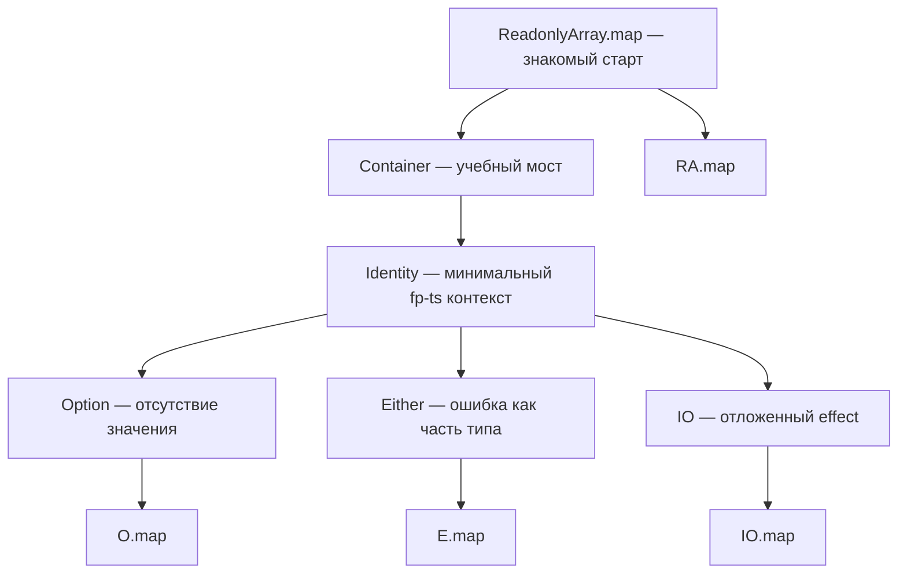

# Chapter: Функторы и контейнеры через призму fp-ts

> [!info] Context
> Эта глава переосмысляет `Mostly Adequate Guide`, chapter 08, через `fp-ts`. В оригинале история начинается с самодельного `Container`, затем переходит к `Maybe`, `Either` и `IO`. Здесь мы сохраняем тот же ход мысли, но приземляем его на реальные типы `fp-ts`: `ReadonlyArray`, `Identity`, `Option`, `Either` и `IO`.
>
> **Пререквизиты:** [[ch03-pure-functions|Pure Functions через призму fp-ts]], [[ch04-currying/ch04-currying|Currying через призму fp-ts]], [[function-composition/function-composition|Каррирование и композиция функций]], базовый TypeScript. Желательна глава [[fp-ts-phase-1-2]].

## Overview

Главная идея этой главы проста: `map` важнее конкретного контейнера. Если у тебя есть контекст, внутри которого лежит значение, и этот контекст умеет применять к содержимому функцию, не распаковывая его наружу, ты уже мыслишь в сторону Functor.



План главы:

1. Начать со знакомого `ReadonlyArray.map`.
2. Использовать `Container` как педагогический мост и быстро перейти к `Identity`.
3. Показать `Option` как типовую замену `null`.
4. Показать `Either` как чистую обработку ошибок.
5. Показать `IO` как способ отложить effect.
6. Связать всё одной общей формой `map`.

> [!important] Ключевая мысль
> В `fp-ts` контейнеры важны не сами по себе. Важна единая форма работы с контекстом: `map` не вытаскивает значение из коробки, а трансформирует его внутри коробки.

**Краткое резюме:** эта глава не про “ещё несколько типов”, а про один повторяющийся паттерн, который потом встречается во всём `fp-ts`.

## Deep Dive

### 1. Самый знакомый функтор: `ReadonlyArray`

Прежде чем говорить слова `Functor`, `Option` или `Either`, стоит посмотреть на то, чем ты уже пользуешься постоянно.

```typescript
import * as RA from 'fp-ts/ReadonlyArray'
import { pipe } from 'fp-ts/function'

pipe(
  [1, 2, 3],
  RA.map((n) => n * 2)
)
// [2, 4, 6]
```

Что здесь произошло:

1. Есть контекст: `ReadonlyArray<number>`.
2. Есть функция: `(n: number) => number`.
3. `RA.map` применяет функцию к значениям **внутри** контекста.
4. На выходе мы снова получаем тот же вид контекста: `ReadonlyArray<number>`.

Именно эта повторяющаяся форма и делает `ReadonlyArray` хорошим warm-up для функторов.

> [!tip] Ментальная модель
> `map` не говорит “дай мне значение из контейнера”. `map` говорит “вот функция; примени её внутри контейнера по своим правилам”.

**Краткое резюме:** если `ReadonlyArray.map` уже кажется тебе естественным, значит половина интуиции про Functor у тебя уже есть.

---

### 2. `Container` как мост и `Identity` как реальный fp-ts-аналог

В оригинале сначала строится самодельный `Container`, чтобы показать базовую идею “значение лежит внутри контекста”.

```typescript
class Container<A> {
  private constructor(private readonly value: A) {}

  static of<A>(value: A): Container<A> {
    return new Container(value)
  }

  map<B>(f: (value: A) => B): Container<B> {
    return Container.of(f(this.value))
  }
}

Container.of(2).map((n) => n + 2)
// Container(4) conceptually
```

Этого достаточно как учебного моста. Но в `fp-ts` чаще полезно думать не о самодельном контейнере, а о минимальном контексте `Identity`.

```typescript
import * as Id from 'fp-ts/Identity'
import { pipe } from 'fp-ts/function'

pipe(
  2,
  Id.of,
  Id.map((n) => n + 2),
  Id.map((n) => n * 3)
)
// 12
```

`Identity<A>` почти ничего не “добавляет” к значению. Его задача не в дополнительном поведении, а в том, чтобы показать: даже самый простой контекст уже поддерживает ту же форму `map`.

> [!warning] Важное ограничение
> На практике ты редко будешь писать код на `Identity` напрямую. Здесь он нужен как мост: от учебного `Container` к реальным типам `fp-ts`.

**Краткое резюме:** `Container` нужен для интуиции, `Identity` — для связи с реальным `fp-ts`.

---

### 3. `Option<A>` как честная модель отсутствия значения

Одна из самых частых проблем обычного JS-кода — `null` и `undefined`.

```typescript
type User = Readonly<{
  name: string
  age?: number
}>

const getAgeLabel = (user: User): string => {
  if (user.age === undefined) {
    return 'Age is unknown'
  }

  return `Age: ${user.age}`
}
```

В `fp-ts` отсутствие значения лучше моделировать явно через `Option`.

```typescript
import * as O from 'fp-ts/Option'
import { pipe } from 'fp-ts/function'

type User = Readonly<{
  name: string
  age?: number
}>

const getAgeLabel = (user: User): string =>
  pipe(
    user.age,
    O.fromNullable,
    O.map((age) => `Age: ${age}`),
    O.getOrElse(() => 'Age is unknown')
  )
```

Если значение есть, `O.map` применяет функцию. Если значения нет, контекст сам удерживает это отсутствие и не даёт тебе “забыть” о нём.

Можно читать это так:

- `Option<A>` = “значение `A` может быть, а может не быть”
- `O.map` = “если значение есть, трансформируй его”
- `O.match` / `O.getOrElse` = “в конце явно опиши, что делать в обоих случаях”

```typescript
import * as O from 'fp-ts/Option'
import { pipe } from 'fp-ts/function'

const streetName = (
  streets: ReadonlyArray<Readonly<{ street: string }>>
): string =>
  pipe(
    streets[0],
    O.fromNullable,
    O.map((address) => address.street),
    O.getOrElse(() => 'Street is unknown')
  )
```

> [!important] Почему это лучше обычного `if`
> `Option` делает отсутствие значения частью типа. Код становится честнее: ты не просто “надеешься”, что значение есть, а работаешь с этим явно.

**Краткое резюме:** `Option` — это production-версия идеи `Maybe`: отсутствие значения больше не прячется в `undefined`.

---

### 4. `Either<E, A>` как чистая обработка ошибок

Если `Option` отвечает на вопрос “значение есть или нет?”, то `Either` отвечает на вопрос “успех или ошибка, и какая именно?”.

```typescript
import * as E from 'fp-ts/Either'
import { pipe } from 'fp-ts/function'

const toError = (reason: unknown): Error =>
  reason instanceof Error ? reason : new Error(String(reason))

const parseJson = (value: string): E.Either<Error, unknown> =>
  E.tryCatch(() => JSON.parse(value), toError)

const getUserName = (value: string): string =>
  pipe(
    parseJson(value),
    E.map((data) => (data as { name: string }).name),
    E.match(
      () => 'Invalid JSON',
      (name) => name
    )
  )
```

> [!tip] Упрощение ради фокуса главы
> Здесь cast из `unknown` к `{ name: string }` сделан намеренно, чтобы не уводить главу в runtime validation. В production-коде такое место лучше закрывать через `io-ts`, `zod` или другой явный decoder.

Важный сдвиг по сравнению с `throw/catch`:

- ошибка больше не выстреливает наружу как исключение
- ошибка становится частью возвращаемого типа
- ты продолжаешь работать через `map`, пока находишься в правой ветке (`Right`)

```typescript
import * as E from 'fp-ts/Either'
import { pipe } from 'fp-ts/function'

const divide = (dividend: number, divisor: number): E.Either<string, number> =>
  divisor === 0 ? E.left('Division by zero') : E.right(dividend / divisor)

pipe(
  divide(10, 2),
  E.map((n) => n * 3)
)
// Right(15)

pipe(
  divide(10, 0),
  E.map((n) => n * 3)
)
// Left('Division by zero')
```

> [!tip] Что делает `E.map`
> `E.map` трансформирует только `Right`. `Left` “проскальзывает” через pipeline неизменным, пока ты явно не обработаешь его через `E.match` или `E.mapLeft`.

**Краткое резюме:** `Either` сохраняет compositional flow там, где `throw/catch` обычно ломает его.

---

### 5. `IO<A>` как отложенный effect

В оригинале `IO` появляется как контейнер для эффектов. В `fp-ts` эта идея формализована просто:

```typescript
type IO<A> = () => A
```

То есть `IO<A>` не убирает effect. Он делает effect **явным** и **отложенным**.

```typescript
import * as IO from 'fp-ts/IO'
import { pipe } from 'fp-ts/function'

const readNow: IO.IO<number> = () => Date.now()

const readIsoDate: IO.IO<string> = pipe(
  readNow,
  IO.map((timestamp) => new Date(timestamp).toISOString())
)
```

Здесь `readIsoDate` пока ничего не выполняет. Это только описание computation поверх effectful source.

Точно так же можно оборачивать доступ к `localStorage`, `Math.random()` или синхронное логирование.

```typescript
import * as IO from 'fp-ts/IO'

const readTheme: IO.IO<string | null> = () => localStorage.getItem('theme')
```

> [!warning] Важный нюанс
> `IO` не делает effect “чистым” в магическом смысле. Он делает границу эффекта явной: теперь видно, где именно программа читает внешний мир.

**Краткое резюме:** `IO` — это контейнер не для значения, а для описания синхронного действия, которое даст значение при запуске.

---

### 6. Один `map`, разные контексты

Теперь можно собрать главную мысль главы в одну таблицу:

| Контекст | Что внутри | Как выглядит `map` |
|---|---|---|
| `ReadonlyArray<A>` | много значений | `RA.map` |
| `Identity<A>` | минимальный контекст | `Id.map` |
| `Option<A>` | значение, которого может не быть | `O.map` |
| `Either<E, A>` | успех или ошибка | `E.map` |
| `IO<A>` | отложенный effect | `IO.map` |

Везде форма одинаковая: “есть функция `A -> B`; примени её внутри контекста”.

```typescript
import { pipe } from 'fp-ts/function'
import * as RA from 'fp-ts/ReadonlyArray'
import * as O from 'fp-ts/Option'
import * as E from 'fp-ts/Either'
import * as IO from 'fp-ts/IO'

const double = (n: number): number => n * 2

pipe([1, 2, 3], RA.map(double))
pipe(O.some(2), O.map(double))
pipe(E.right<never, number>(2), E.map(double))
pipe(IO.of(2), IO.map(double))
```

Контексты разные. Поведение вокруг отсутствия значения, ошибки или эффекта разное. Но интуиция `map` остаётся одной и той же.

> [!important] Именно это и есть bridge главы
> Когда ты видишь `O.map`, `E.map`, `IO.map`, `RA.map`, ты учишься замечать не разные API, а один повторяющийся паттерн.

**Краткое резюме:** в `fp-ts` типы меняются, но способ думать о `map` остаётся удивительно стабильным.

---

### 7. Извлечение результата: не ломай контекст слишком рано

Одна из самых частых ошибок новичка — попытаться “достать значение из коробки” слишком рано.

Если ты уже внутри `Option`, `Either` или `IO`, лучше продолжать computation через `map`, а извлечение оставить на край программы.

```typescript
import * as O from 'fp-ts/Option'
import { pipe } from 'fp-ts/function'

const greeting = (name: string | null): string =>
  pipe(
    name,
    O.fromNullable,
    O.map((value) => value.toUpperCase()),
    O.match(
      () => 'HELLO, STRANGER',
      (value) => `HELLO, ${value}`
    )
  )
```

То же касается `Either`:

```typescript
import * as E from 'fp-ts/Either'
import { pipe } from 'fp-ts/function'

const renderPort = (value: string): string =>
  pipe(
    Number.parseInt(value, 10),
    E.fromPredicate(
      (port) => !Number.isNaN(port),
      () => 'Port is invalid'
    ),
    E.match(
      (error) => error,
      (port) => `Listening on ${port}`
    )
  )
```

> [!tip] Практическое правило
> `map` и friends используются внутри pipeline. `match`, `getOrElse` и явный запуск `IO` — на границе, где программа уже должна предъявить результат миру.

**Краткое резюме:** не рви контейнер раньше времени. Чем дольше computation остаётся внутри контекста, тем линейнее и честнее выглядит код.

## Exercises

## Exercise 1: Где здесь functor mindset?

**Difficulty:** beginner

**Task:** Для каждого случая определи, работает ли код в стиле “применить функцию внутри контекста”.

**Requirements:**
- оформить ответ в виде функции `isFunctorStyle`
- вернуть `true` или `false`

```typescript
type CaseName = 'readonly-array-map' | 'manual-null-check' | 'option-map'
```

**Test cases:**

```typescript
import { expect, test } from 'vitest'

type CaseName = 'readonly-array-map' | 'manual-null-check' | 'option-map'

const isFunctorStyle = (_name: CaseName): boolean => {
  throw new Error('implement me')
}

test('isFunctorStyle detects functor-shaped code', () => {
  expect(isFunctorStyle('readonly-array-map')).toBe(true)
  expect(isFunctorStyle('manual-null-check')).toBe(false)
  expect(isFunctorStyle('option-map')).toBe(true)
})
```

> [!tip]- Hint
> Ищи pattern “есть контекст, есть функция, `map` применяет её внутри контекста”.

> [!warning]- Solution
> `readonly-array-map` и `option-map` — это functor mindset. `manual-null-check` — нет, потому что там нет общего контекста и `map`.

## Exercise 2: Перепиши `null`-проверку в `Option`

**Difficulty:** beginner

**Task:** Перепиши функцию так, чтобы она использовала `O.fromNullable`, `O.map` и `O.getOrElse`.

```typescript
const getName = (user: { name?: string }): string => {
  if (user.name === undefined) {
    return 'Anonymous'
  }

  return user.name.toUpperCase()
}
```

**Test cases:**

```typescript
import { expect, test } from 'vitest'
import * as O from 'fp-ts/Option'
import { pipe } from 'fp-ts/function'

const getName = (_user: { name?: string }): string => {
  throw new Error('implement me')
}

test('getName uses Option to model missing value', () => {
  expect(getName({ name: 'Ada' })).toBe('ADA')
  expect(getName({})).toBe('Anonymous')

  expect(
    pipe(
      'Ada',
      O.fromNullable,
      O.map((name) => name.toUpperCase()),
      O.getOrElse(() => 'Anonymous')
    )
  ).toBe('ADA')
})
```

> [!tip]- Hint
> Отсутствие имени должно стать частью контекста, а не отдельной веткой `if`.

> [!warning]- Solution
> ```typescript
> const getName = (user: { name?: string }): string =>
>   pipe(
>     user.name,
>     O.fromNullable,
>     O.map((name) => name.toUpperCase()),
>     O.getOrElse(() => 'Anonymous')
>   )
> ```

## Exercise 3: Перепиши `throw` в `Either`

**Difficulty:** intermediate

**Task:** Перепиши парсинг так, чтобы ошибка стала частью типа.

```typescript
const parsePort = (value: string): number => {
  const port = Number.parseInt(value, 10)

  if (Number.isNaN(port)) {
    throw new Error('Port is invalid')
  }

  return port
}
```

**Test cases:**

```typescript
import { expect, test } from 'vitest'
import * as E from 'fp-ts/Either'
import { pipe } from 'fp-ts/function'

const parsePort = (_value: string): E.Either<string, number> => {
  throw new Error('implement me')
}

test('parsePort returns Either instead of throwing', () => {
  expect(parsePort('3000')).toEqual(E.right(3000))
  expect(parsePort('abc')).toEqual(E.left('Port is invalid'))

  expect(
    pipe(
      parsePort('3000'),
      E.match(
        () => 'error',
        (port) => `Listening on ${port}`
      )
    )
  ).toBe('Listening on 3000')
})
```

> [!tip]- Hint
> `Either` позволяет сохранить compositional flow там, где `throw` обычно его ломает.

> [!warning]- Solution
> ```typescript
> const parsePort = (value: string): E.Either<string, number> => {
>   const port = Number.parseInt(value, 10)
>
>   return Number.isNaN(port) ? E.left('Port is invalid') : E.right(port)
> }
> ```

## Exercise 4: Отложи effect через `IO`

**Difficulty:** intermediate

**Task:** Опиши чтение текущего времени через `IO`, а затем преобразуй его в ISO-строку через `IO.map`.

**Test cases:**

```typescript
import { expect, test, vi } from 'vitest'
import * as IO from 'fp-ts/IO'
import { pipe } from 'fp-ts/function'

const readIsoDate = (): IO.IO<string> => {
  throw new Error('implement me')
}

test('readIsoDate delays the effect and maps inside IO', () => {
  vi.useFakeTimers()
  vi.setSystemTime(new Date('2024-01-01T00:00:00.000Z'))

  const io = readIsoDate()

  expect(typeof io).toBe('function')
  expect(io()).toBe('2024-01-01T00:00:00.000Z')

  vi.useRealTimers()
})
```

> [!tip]- Hint
> Сначала опиши `IO<number>`, затем через `IO.map` преврати его в `IO<string>`.

> [!warning]- Solution
> ```typescript
> const readIsoDate = (): IO.IO<string> =>
>   pipe(
>     (() => Date.now()) as IO.IO<number>,
>     IO.map((timestamp) => new Date(timestamp).toISOString())
>   )
> ```

## Exercise 5: Challenge — один `map`, разные контексты

**Difficulty:** advanced

**Task:** Собери helper `doubleEverywhere`, который покажет один и тот же `map` pattern на `ReadonlyArray`, `Identity`, `Option`, `Either` и `IO`.

**Requirements:**
- использовать namespace-style API
- одну и ту же функцию `double`
- не распаковывать контексты вручную

**Test cases:**

```typescript
import { expect, test } from 'vitest'
import * as RA from 'fp-ts/ReadonlyArray'
import * as Id from 'fp-ts/Identity'
import * as O from 'fp-ts/Option'
import * as E from 'fp-ts/Either'
import * as IO from 'fp-ts/IO'
import { pipe } from 'fp-ts/function'

type Result = Readonly<{
  array: ReadonlyArray<number>
  identity: number
  option: O.Option<number>
  either: E.Either<string, number>
  io: number
}>

const doubleEverywhere = (): Result => {
  throw new Error('implement me')
}

test('doubleEverywhere uses the same map idea in different contexts', () => {
  expect(doubleEverywhere()).toEqual({
    array: [2, 4, 6],
    identity: 10,
    option: O.some(4),
    either: E.right(6),
    io: 8,
  })
})
```

> [!tip]- Hint
> Не ищи “общую супер-функцию”. Покажи общий pattern через `RA.map`, `O.map`, `E.map`, `IO.map`.

> [!warning]- Solution
> ```typescript
> const doubleEverywhere = (): Result => {
>   const double = (n: number): number => n * 2
>
>   return {
>     array: pipe([1, 2, 3], RA.map(double)),
>     identity: pipe(5, Id.of, Id.map(double)),
>     option: pipe(O.some(2), O.map(double)),
>     either: pipe(E.right<string, number>(3), E.map(double)),
>     io: pipe(IO.of(4), IO.map(double))(),
>   }
> }
> ```

## Anki Cards

> [!tip] Flashcards
> Q: Что такое functor простыми словами?
> A: Это контекст, который умеет применять функцию к своему содержимому через `map`, не распаковывая его наружу.

> [!tip] Flashcards
> Q: Почему `ReadonlyArray` полезен как warm-up для Functor?
> A: Потому что `RA.map` уже показывает знакомый pattern “преобразуй значение внутри контекста и верни тот же вид контекста”.

> [!tip] Flashcards
> Q: Зачем в этой главе нужен `Container`, если есть `fp-ts`?
> A: Только как педагогический мост к идее контекста; в реальном `fp-ts` эту роль лучше связывать с `Identity`.

> [!tip] Flashcards
> Q: Чем `Option` отличается от обычного `null`?
> A: `Option` делает отсутствие значения явной частью типа и заставляет работать с ним через `map`, `match`, `getOrElse`.

> [!tip] Flashcards
> Q: Что даёт `Either<E, A>` по сравнению с `throw`?
> A: Ошибка становится частью возвращаемого типа и не ломает compositional flow как скрытое исключение.

> [!tip] Flashcards
> Q: Что такое `IO<A>` в `fp-ts`?
> A: Это описание синхронного effect как функции `() => A`, которое откладывает выполнение и делает границу эффекта явной.

> [!tip] Flashcards
> Q: Почему нельзя слишком рано “доставать значение из коробки”?
> A: Потому что тогда ты теряешь преимущества контекста; лучше дольше оставаться внутри `map`, а извлечение делать на границе через `match` или `getOrElse`.

## Related Topics

- [[ch03-pure-functions]]
- [[ch04-currying/ch04-currying]]
- [[function-composition/function-composition]]
- [[partial-application/readme|Частичное применение и каррирование в JavaScript]]
- [[fp-ts-phase-1-2]]
- [[fp-ts-roadmap]]

## Sources

- [Mostly Adequate Guide, chapter 08](https://mostly-adequate.gitbook.io/mostly-adequate-guide/ch08)
- [Mostly Adequate Guide, Russian translation, ch08](https://github.com/MostlyAdequate/mostly-adequate-guide-ru/blob/master/ch08-ru.md)
- [fp-ts Functor.ts module](https://gcanti.github.io/fp-ts/modules/Functor.ts.html)
- [fp-ts Identity.ts module](https://gcanti.github.io/fp-ts/modules/Identity.ts.html)
- [fp-ts Option.ts module](https://gcanti.github.io/fp-ts/modules/Option.ts.html)
- [fp-ts Either.ts module](https://gcanti.github.io/fp-ts/modules/Either.ts.html)
- [fp-ts IO.ts module](https://gcanti.github.io/fp-ts/modules/IO.ts.html)
- [fp-ts ReadonlyArray.ts module](https://gcanti.github.io/fp-ts/modules/ReadonlyArray.ts.html)
- [fp-ts function.ts module](https://gcanti.github.io/fp-ts/modules/function.ts.html)
- [fp-ts Learning Resources](https://gcanti.github.io/fp-ts/learning-resources/)
