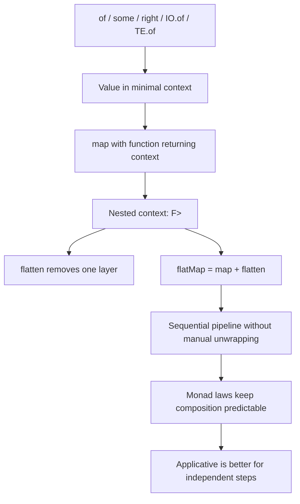

# Chapter: Монадические луковицы через призму fp-ts

> [!info] Context
> Эта глава переосмысляет `Mostly Adequate Guide`, chapter 09, через `fp-ts`. Центральная идея не меняется: `of` помещает значение в минимальный контекст, вложенные контексты создают лишние слои, `flatten` снимает один слой, а `flatMap` строит последовательные вычисления без ручной распаковки.
>
> **Пререквизиты:** [[ch03-pure-functions|Pure Functions через призму fp-ts]], [[ch04-currying/ch04-currying|Currying через призму fp-ts]], [[ch08-functors-and-containers/ch08-functors-and-containers|Функторы и контейнеры через призму fp-ts]], [[fp-ts-phase-1-2]]. Желательно уже уверенно читать `pipe(...)` и namespace imports.

## Overview

Если прошлые главы учили тебя держать данные в чистом и предсказуемом виде, то эта глава отвечает на следующий вопрос: что делать, когда функция внутри контекста сама возвращает контекст?

Так появляется знакомая проблема `F<F<A>>`. Для `Option` это `Option<Option<A>>`, для `IO` это `IO<IO<A>>`, для `TaskEither` это `TaskEither<E, TaskEither<E, A>>`. В этот момент `map` уже не хватает: он честно применяет функцию, но в результате добавляет ещё один слой.



План главы:

1. `of` как минимальный контекст в `fp-ts`.
2. Почему `map` начинает создавать вложенность.
3. Как `flatten` снимает один слой.
4. Почему `flatMap` стал основным рабочим API.
5. Как это выглядит на `Option`, `Either`, `IO` и `TaskEither`.
6. Почему законы монады важны не как формальность, а как гарантия композиции.
7. Почему следующая остановка после Monad — это Applicative, а не ещё одна монада.

> [!important] Ключевая мысль
> Monad нужен там, где следующий шаг зависит от результата предыдущего, и этот следующий шаг уже возвращает тот же тип контекста.

**Краткое резюме:** эта глава не про термин “Monad” сам по себе. Она про снятие лишней вложенности и про последовательные шаги, которые остаются чисто описанными в типах.

## Deep Dive

### 1. `of` и минимальный контекст

В оригинальной главе `of` объясняется через идею минимального контекста. В `fp-ts` это удобно показывать на нескольких типах сразу: `Identity`, `Option`, `Either`, `IO`, `TaskEither`.

```typescript
import * as Id from 'fp-ts/Identity'
import * as O from 'fp-ts/Option'
import * as E from 'fp-ts/Either'
import * as IO from 'fp-ts/IO'
import * as TE from 'fp-ts/TaskEither'
import { pipe } from 'fp-ts/function'

pipe(
  2,
  Id.of,
  Id.map((n) => n + 1)
)

pipe(
  1336,
  O.of,
  O.map((n) => n + 1)
)

pipe(
  'ready',
  E.of,
  E.map((s) => `${s}!`)
)

pipe(
  'tetris',
  IO.of,
  IO.map((s) => `${s} master`)
)

pipe(
  'network payload',
  TE.of,
  TE.map((s) => s.length)
)
```

У всех этих типов разная семантика, но одна и та же идея: значение можно положить в контекст и продолжить работать с ним, не разрушая форму программы.

`Identity` здесь полезен как мост. Он почти ничего не добавляет к значению, но именно поэтому помогает увидеть общую форму: контекст есть, а поведение у `map` уже такое же, как и у более “содержательных” типов.

> [!tip] Что важно запомнить
> `of` не существует ради того, чтобы “избавить от `new`”. Он нужен, чтобы у каждого контекста был единый способ положить значение внутрь и продолжить композицию.

**Краткое резюме:** `of` даёт общий вход в контекст. Дальше уже не важно, `Identity` это, `Option`, `Either`, `IO` или `TaskEither` - форма применения одна и та же.

### 2. Где `map` начинает создавать вложенность

Проблема появляется в тот момент, когда функция внутри `map` уже возвращает контекст.

```typescript
import * as O from 'fp-ts/Option'
import { pipe } from 'fp-ts/function'

const safeHead = <A>(values: ReadonlyArray<A>): O.Option<A> =>
  values.length === 0 ? O.none : O.some(values[0])

const safeProp =
  (key: string) =>
  (obj: Record<string, unknown>): O.Option<unknown> =>
    O.fromNullable(obj[key])

const user = {
  addresses: [{ street: { name: 'Walnut St', number: 22 } }],
}

pipe(
  O.of(user),
  O.map(safeProp('addresses'))
)
// Option<Option<unknown>>
```

`map` отработал честно: он применил функцию к значению и сохранил контекст. Но поскольку функция вернула `Option`, мы получили `Option<Option<...>>`.

Если продолжить так и дальше, матрёшка будет расти. Это не баг `map`; это просто не тот инструмент для этой задачи.

> [!warning] Сигнал к смене инструмента
> Если функция внутри `map` уже возвращает `Option`, `Either`, `IO` или `TaskEither`, скорее всего тебе нужен не `map`, а `flatMap` или хотя бы `flatten`.

**Краткое резюме:** вложенность появляется не потому, что `map` плохой. Она появляется потому, что `map` предназначен для обычных значений, а не для уже обёрнутых результатов.

### 3. `flatten` снимает один слой

Когда у нас уже есть `F<F<A>>`, самый прямой вопрос звучит так: как убрать один лишний слой?

```typescript
import * as O from 'fp-ts/Option'
import * as IO from 'fp-ts/IO'
import * as TE from 'fp-ts/TaskEither'
import { pipe } from 'fp-ts/function'

pipe(
  O.some(O.some('nunchucks')),
  O.flatten
)
// Option<string>

pipe(
  IO.of(IO.of('pizza')),
  IO.flatten
)
// IO<string>

pipe(
  TE.of(TE.of('sewers')),
  TE.flatten
)
// TaskEither<unknown, string>
```

`flatten` делает ровно одно: снимает один слой одинакового контекста. Это полезно, когда вложенность уже есть, а тебе нужен плоский результат.

В терминологии старых туториалов и оригинальной главы тот же смысл назывался `join`. В `fp-ts` для читателя обычно полезнее слово `flatten`, потому что оно прямо говорит, что происходит: один слой исчезает, форма остаётся той же.

> [!tip] Как читать `flatten`
> Если у тебя есть `F<F<A>>`, `flatten` превращает это в `F<A>`. Ничего не извлекается “в сырое значение”; просто исчезает лишняя обёртка.

**Краткое резюме:** `flatten` нужен, когда вложенность уже появилась. Он не добавляет новую логику, а только убирает один слой одного и того же контекста.

### 4. `flatMap` как `map + flatten`

Снимать слой вручную после каждого `map` неудобно. Поэтому `flatMap` объединяет два шага: применить функцию, которая возвращает контекст, и тут же свернуть вложенность.

```typescript
import * as O from 'fp-ts/Option'
import * as IO from 'fp-ts/IO'
import * as TE from 'fp-ts/TaskEither'
import { pipe } from 'fp-ts/function'

const safeProp =
  (key: string) =>
  (obj: Record<string, unknown>): O.Option<unknown> =>
    O.fromNullable(obj[key])

pipe(
  O.of({ address: { street: 'Walnut St' } }),
  O.flatMap(safeProp('address')),
  O.flatMap(safeProp('street'))
)
// Option<unknown>

pipe(
  IO.of('hello'),
  IO.flatMap((value) => IO.of(`${value}!`))
)
// IO<string>

type User = { id: string; orgId: string }
type Org = { name: string }

const fetchUser = (id: string): TE.TaskEither<Error, User> =>
  TE.of({ id, orgId: 'org-1' })

const fetchOrg = (orgId: string): TE.TaskEither<Error, Org> =>
  TE.of({ name: `org:${orgId}` })

pipe(
  fetchUser('user-1'),
  TE.flatMap((user) => fetchOrg(user.orgId)),
  TE.map((org) => org.name)
)
// TaskEither<Error, string>
```

Если представить это в терминах старой книги, `flatMap` делает то же, что там называли `chain`. Разница только в языке API: в `fp-ts v2` безопаснее и понятнее думать через `flatMap`, а `chain` воспринимать как историческое имя из других источников.

> [!important] Практическое правило
> `map` для функции, которая возвращает обычное значение. `flatMap` для функции, которая возвращает тот же тип контекста.

**Краткое резюме:** `flatMap` и есть рабочая форма монады в `fp-ts`. Он экономит тебя от ручного `flatten` после каждого шага и делает цепочку читаемой.

### 5. `Option` как безопасная навигация

Одна из самых частых monadic задач в прикладном коде - добраться до вложенного значения, не устроив аварийный доступ к `undefined`.

```typescript
import * as O from 'fp-ts/Option'
import { pipe } from 'fp-ts/function'

type User = Readonly<{
  address?: Readonly<{
    street?: Readonly<{
      name?: string
    }>
  }>
}>

const getStreetName = (user: User): O.Option<string> =>
  pipe(
    O.fromNullable(user.address),
    O.flatMap((address) => O.fromNullable(address.street)),
    O.flatMap((street) => O.fromNullable(street.name))
  )

const formatStreetName = (user: User): string =>
  pipe(
    getStreetName(user),
    O.getOrElse(() => 'Street is unknown')
  )
```

Эта форма очень близка к тому, что делал `Maybe` в оригинале, но здесь она выражена через реальный `fp-ts` API.

Важно то, что `Option` не заставляет тебя вытаскивать значение на каждом шаге. Ты продолжаешь работать внутри контекста до тех пор, пока не решишь, что делать с `None`.

**Краткое резюме:** `Option` решает проблему безопасной навигации без `if`-лесенок и без аварийных `null`-разыменований.

### 6. `Either` как типизированная ошибка

`Either` полезен там, где шаг может завершиться ошибкой, но ты хочешь продолжить работать в чистом pipeline. В отличие от `throw`, ошибка становится частью типа и остаётся видимой на каждом шаге.

```typescript
import * as E from 'fp-ts/Either'
import { pipe } from 'fp-ts/function'

type User = Readonly<{
  name: string
  age: number
}>

const parseJson = (raw: string): E.Either<Error, unknown> =>
  E.tryCatch(
    () => JSON.parse(raw),
    (reason) => new Error(String(reason))
  )

const toUser = (value: unknown): E.Either<Error, User> =>
  typeof value === 'object' &&
  value !== null &&
  'name' in value &&
  'age' in value &&
  typeof (value as { name?: unknown }).name === 'string' &&
  typeof (value as { age?: unknown }).age === 'number'
    ? E.of({
        name: (value as { name: string }).name,
        age: (value as { age: number }).age,
      })
    : E.left(new Error('Invalid user shape'))

const renderUserName = (raw: string): string =>
  pipe(
    parseJson(raw),
    E.flatMap(toUser),
    E.map((user) => `${user.name} (${user.age})`),
    E.match(
      () => 'Invalid input',
      (label) => label
    )
  )
```

Здесь `flatMap` нужен потому, что следующий шаг тоже возвращает `Either`. Если бы мы использовали `map`, получили бы вложенный `Either<Either<...>>`.

> [!tip] Чем `Either` полезен в реальном коде
> Он делает ошибки явными, читаемыми и composable. Это особенно полезно там, где `throw/catch` ломает нормальную линейность программы.

**Краткое резюме:** `Either` - это sync-версия typed error handling. Он особенно хорош для последовательных проверок и преобразований, где ошибка должна остаться в типе.

### 7. `IO` как последовательность отложенных effect-ов

`IO` полезен там, где ты хочешь описать effect, но не выполнить его немедленно. Это даёт предсказуемость и удобную композицию.

```typescript
import * as IO from 'fp-ts/IO'
import { pipe } from 'fp-ts/function'

const readPreference = (key: string): IO.IO<string> =>
  IO.of(`value-for:${key}`)

const logValue = (value: string): IO.IO<string> =>
  () => {
    console.log(value)
    return value
  }

const applyPreferences = (key: string): IO.IO<string> =>
  pipe(
    readPreference(key),
    IO.flatMap((value) => logValue(value)),
    IO.map((value) => value.toUpperCase())
  )
```

Здесь важен не сам `console.log`. Важна форма: каждый шаг возвращает новый `IO`, который можно передать дальше, не выполняя ничего раньше времени.

Если внутри цепочки появляется ещё один `IO`, `flatMap` снимает лишнюю вложенность и сохраняет pipeline плоским.

> [!tip] Почему `IO` нужен вообще
> Он позволяет описывать эффект как значение. Это не делает программу “чистой магией”; это просто переносит запуск на границу программы, где его легче контролировать.

**Краткое резюме:** `IO` удобен там, где важна отложенность и последовательность. Он делает эффект явным, а не скрытым в теле функции.

### 8. `TaskEither` как зависимый async-пайплайн

`TaskEither` - один из самых практичных типов `fp-ts`. Он показывает монаду в реальном production-сценарии: есть async, есть ошибка, и второй шаг зависит от результата первого.

```typescript
import * as TE from 'fp-ts/TaskEither'
import { pipe } from 'fp-ts/function'

type User = Readonly<{
  id: string
  orgId: string
}>

type Org = Readonly<{
  id: string
  plan: string
}>

const fetchUser = (id: string): TE.TaskEither<Error, User> =>
  TE.tryCatch(
    async () => ({ id, orgId: 'org-1' }),
    (reason) => new Error(String(reason))
  )

const fetchOrg = (orgId: string): TE.TaskEither<Error, Org> =>
  TE.tryCatch(
    async () => ({ id: orgId, plan: 'pro' }),
    (reason) => new Error(String(reason))
  )

const loadOrgPlan = (id: string): TE.TaskEither<Error, string> =>
  pipe(
    fetchUser(id),
    TE.flatMap((user) => fetchOrg(user.orgId)),
    TE.map((org) => org.plan)
  )
```

Здесь второй async-шаг невозможен без результата первого. Мы не можем вызвать `fetchOrg` заранее, потому что `orgId` появляется только после `fetchUser`.

Именно поэтому монада здесь уместна: она выражает зависимость шагов. Если `fetchUser` вернёт ошибку, цепочка остановится сама, а `fetchOrg` даже не будет запущен.

> [!important] Что делает `TaskEither` сильным
> Он объединяет две вещи, которые в обычном коде часто рвут композицию: асинхронность и явную ошибку. В итоге программа остаётся читаемой слева направо.

**Краткое резюме:** `TaskEither` показывает монаду в её самом полезном прикладном виде: сначала один запрос, потом второй запрос, и оба шага честно описаны в типах.

### 9. Законы монады как проверка композиции

Обычно laws звучат сухо, но в практике они означают очень простую вещь: если ты переставляешь куски monadic pipeline, результат не должен становиться непредсказуемым.

На `fp-ts`-языке это можно прочитать так:

```typescript
import * as O from 'fp-ts/Option'
import { pipe } from 'fp-ts/function'

const f = (n: number): O.Option<number> => O.some(n + 1)
const g = (n: number): O.Option<number> => O.some(n * 2)

// Left identity
pipe(
  O.of(10),
  O.flatMap(f)
)
// то же поведение, что и f(10)

// Right identity
pipe(
  O.some(10),
  O.flatMap(O.of)
)
// то же поведение, что и исходное O.some(10)

// Associativity
pipe(
  O.some(10),
  O.flatMap(f),
  O.flatMap(g)
)

pipe(
  O.some(10),
  O.flatMap((n) => pipe(f(n), O.flatMap(g)))
)
```

Если laws нарушаются, pipeline начинает вести себя по-разному в зависимости от того, как ты сгруппировал шаги. Тогда refactoring становится рискованным, а композиция - не надёжной.

Не нужно здесь уходить в доказательства. Важно понимать практический смысл: laws нужны, чтобы `flatMap` оставался предсказуемым, а не “работал как-нибудь”.

**Краткое резюме:** законы монады - это не математическое украшение. Это гарантия того, что последовательная композиция не развалится при рефакторинге.

### 10. Почему дальше нужен Applicative

Monad очень хорош, когда следующий шаг зависит от предыдущего. Но не все задачи устроены так.

Если шаги независимы, `flatMap` становится излишне последовательным. В таких случаях Applicative обычно лучше выражает намерение: “эти действия можно собирать без зависимости друг от друга”.

```typescript
import * as O from 'fp-ts/Option'
import { pipe } from 'fp-ts/function'

const combine = (a: number, b: number): number => a + b

pipe(
  O.some((a: number) => (b: number) => combine(a, b)),
  O.ap(O.some(2)),
  O.ap(O.some(3))
)
```

Смысл здесь не в том, чтобы уже сейчас полностью разбирать Applicative. Смысл в том, чтобы увидеть границу:

- зависимые шаги -> Monad / `flatMap`
- независимые шаги -> Applicative

Именно это делает монаду честным инструментом, а не универсальным ответом на любую композицию.

**Краткое резюме:** Monad не заменяет Applicative. Он нужен для зависимых шагов, а для независимых следующий chapter должен показать другой, более точный инструмент.

## Exercises

Ниже задачи не на “синтаксис ради синтаксиса”, а на выбор правильной формы композиции. Смотри на тип контекста и на то, возвращает ли следующий шаг обычное значение или новый контекст.

## Exercise 1: Найди `flatten`

**Difficulty:** beginner

**Task:** Реализуй три helper-функции, которые снимают один слой вложенности через `flatten`.

**Requirements:**
- использовать `fp-ts` типы `Option`, `IO`, `TaskEither`
- не распаковывать значения вручную
- вернуть плоский контекст, а не сырое значение

```typescript
import * as O from 'fp-ts/Option'
import * as IO from 'fp-ts/IO'
import * as TE from 'fp-ts/TaskEither'

const unwrapOption = <A>(_value: O.Option<O.Option<A>>): O.Option<A> => {
  throw new Error('implement me')
}

const unwrapIO = <A>(_value: IO.IO<IO.IO<A>>): IO.IO<A> => {
  throw new Error('implement me')
}

const unwrapTaskEither = <E, A>(
  _value: TE.TaskEither<E, TE.TaskEither<E, A>>
): TE.TaskEither<E, A> => {
  throw new Error('implement me')
}
```

**Test cases:**

```typescript
import { expect, test } from 'vitest'
import * as O from 'fp-ts/Option'
import * as IO from 'fp-ts/IO'
import * as TE from 'fp-ts/TaskEither'
import * as E from 'fp-ts/Either'

test('flatten removes exactly one layer', async () => {
  expect(unwrapOption(O.some(O.some(42)))).toEqual(O.some(42))
  expect(unwrapOption(O.some(O.none))).toEqual(O.none)

  expect(unwrapIO(IO.of(IO.of('pizza')))()).toBe('pizza')

  await expect(unwrapTaskEither(TE.right(TE.right('ok')))()).resolves.toEqual(
    E.right('ok')
  )
})
```

> [!tip]- Hint
> Если у тебя уже есть `F<F<A>>`, `flatten` убирает только внешний слой. Ничего больше делать не нужно.

> [!warning]- Solution
> ```typescript
> const unwrapOption = <A>(value: O.Option<O.Option<A>>): O.Option<A> =>
>   O.flatten(value)
>
> const unwrapIO = <A>(value: IO.IO<IO.IO<A>>): IO.IO<A> => IO.flatten(value)
>
> const unwrapTaskEither = <E, A>(
>   value: TE.TaskEither<E, TE.TaskEither<E, A>>
> ): TE.TaskEither<E, A> => TE.flatten(value)
> ```

## Exercise 2: Безопасный доступ через `Option`

**Difficulty:** beginner

**Task:** Извлеки имя улицы из глубоко вложенного объекта через `O.fromNullable` и `O.flatMap`.

**Requirements:**
- не использовать `if` для каждого уровня
- вернуть `Option<string>`
- идти сверху вниз через `pipe`

```typescript
import * as O from 'fp-ts/Option'

type User = Readonly<{
  address?: Readonly<{
    street?: Readonly<{
      name?: string
    }>
  }>
}>

const getStreetName = (_user: User): O.Option<string> => {
  throw new Error('implement me')
}
```

**Test cases:**

```typescript
import { expect, test } from 'vitest'
import * as O from 'fp-ts/Option'

test('getStreetName returns Some when the path exists', () => {
  expect(
    getStreetName({
      address: { street: { name: 'Walnut St' } },
    })
  ).toEqual(O.some('Walnut St'))
})

test('getStreetName returns None when a part is missing', () => {
  expect(getStreetName({})).toEqual(O.none)
  expect(getStreetName({ address: {} })).toEqual(O.none)
  expect(getStreetName({ address: { street: {} } })).toEqual(O.none)
})
```

> [!tip]- Hint
> Каждый уровень может отсутствовать. Значит каждый шаг должен оставаться внутри `Option`.

> [!warning]- Solution
> ```typescript
> import { pipe } from 'fp-ts/function'
>
> const getStreetName = (user: User): O.Option<string> =>
>   pipe(
>     O.fromNullable(user.address),
>     O.flatMap((address) => O.fromNullable(address.street)),
>     O.flatMap((street) => O.fromNullable(street.name))
>   )
> ```

## Exercise 3: `IO` как отложенная последовательность

**Difficulty:** intermediate

**Task:** Собери `IO` pipeline, который читает значение, преобразует его и записывает эффект только при запуске.

**Requirements:**
- эффект не должен происходить до вызова `()`
- использовать `IO.flatMap`
- сохранить порядок: read -> transform -> write

```typescript
import * as IO from 'fp-ts/IO'
import { pipe } from 'fp-ts/function'

const buildPipeline = (
  _read: IO.IO<string>,
  _transform: (value: string) => string,
  _write: (value: string) => IO.IO<string>
): IO.IO<string> => {
  throw new Error('implement me')
}
```

**Test cases:**

```typescript
import { expect, test } from 'vitest'
import * as IO from 'fp-ts/IO'

test('buildPipeline does not run effects early', () => {
  const events: string[] = []
  const read = (): string => {
    events.push('read')
    return 'hello'
  }
  const transform = (value: string): string => {
    events.push(`transform:${value}`)
    return value.toUpperCase()
  }
  const write = (value: string): IO.IO<string> => () => {
    events.push(`write:${value}`)
    return value
  }

  const io = buildPipeline(read, transform, write)

  expect(events).toEqual([])
  expect(io()).toBe('HELLO')
  expect(events).toEqual(['read', 'transform:hello', 'write:HELLO'])
})
```

> [!tip]- Hint
> Если `write` возвращает `IO`, значит тебе нужен `flatMap`, а не `map`.

> [!warning]- Solution
> ```typescript
> const buildPipeline = (
>   read: IO.IO<string>,
>   transform: (value: string) => string,
>   write: (value: string) => IO.IO<string>
> ): IO.IO<string> =>
>   pipe(
>     read,
>     IO.map(transform),
>     IO.flatMap((value) => write(value))
>   )
> ```

## Exercise 4: Последовательный `TaskEither`

**Difficulty:** intermediate

**Task:** Реализуй загрузку организации через два зависимых async-шагa: сначала пользователь, потом организация по `orgId`.

**Requirements:**
- второй запрос должен зависеть от результата первого
- использовать `TE.flatMap`
- ошибки должны оставаться в `Left`

```typescript
import * as TE from 'fp-ts/TaskEither'

type User = Readonly<{ id: string; orgId: string }>
type Org = Readonly<{ id: string; plan: string }>

const loadOrgPlan = (
  _fetchUser: (id: string) => TE.TaskEither<Error, User>,
  _fetchOrg: (orgId: string) => TE.TaskEither<Error, Org>,
  _id: string
): TE.TaskEither<Error, string> => {
  throw new Error('implement me')
}
```

**Test cases:**

```typescript
import { expect, test, vi } from 'vitest'
import * as TE from 'fp-ts/TaskEither'
import * as E from 'fp-ts/Either'

test('loadOrgPlan runs the second step only after the first succeeds', async () => {
  const fetchUser = vi.fn((id: string) =>
    TE.right<Error, User>({ id, orgId: 'org-1' })
  )
  const fetchOrg = vi.fn((orgId: string) =>
    TE.right<Error, Org>({ id: orgId, plan: 'pro' })
  )

  await expect(loadOrgPlan(fetchUser, fetchOrg, 'user-1')()).resolves.toEqual(
    E.right('pro')
  )
  expect(fetchUser).toHaveBeenCalledWith('user-1')
  expect(fetchOrg).toHaveBeenCalledWith('org-1')
})

test('loadOrgPlan short-circuits on the first error', async () => {
  const fetchUser = vi.fn(() => TE.left<Error, User>(new Error('no user')))
  const fetchOrg = vi.fn(() => TE.right<Error, Org>({ id: 'org-1', plan: 'pro' }))

  await expect(loadOrgPlan(fetchUser, fetchOrg, 'user-1')()).resolves.toEqual(
    E.left(new Error('no user'))
  )
  expect(fetchOrg).not.toHaveBeenCalled()
})
```

> [!tip]- Hint
> Второй `TaskEither` появляется только внутри `flatMap`, когда у тебя уже есть `orgId`.

> [!warning]- Solution
> ```typescript
> import { pipe } from 'fp-ts/function'
>
> const loadOrgPlan = (
>   fetchUser: (id: string) => TE.TaskEither<Error, User>,
>   fetchOrg: (orgId: string) => TE.TaskEither<Error, Org>,
>   id: string
> ): TE.TaskEither<Error, string> =>
>   pipe(
>     fetchUser(id),
>     TE.flatMap((user) => fetchOrg(user.orgId)),
>     TE.map((org) => org.plan)
>   )
> ```

## Exercise 5: Monad vs Applicative

**Difficulty:** advanced

**Task:** Покажи разницу между независимыми и зависимыми шагами. Для независимых значений используй Applicative-стиль, для зависимых - `flatMap`.

**Requirements:**
- не использовать `Do` notation
- для независимых шагов показать `O.ap`
- для зависимого шага показать `O.flatMap`
- не вытаскивать значение наружу раньше времени

```typescript
import * as O from 'fp-ts/Option'
import { pipe } from 'fp-ts/function'

const sumIfBothPresent = (_a: O.Option<number>, _b: O.Option<number>): O.Option<number> => {
  throw new Error('implement me')
}

const buildLabelFromAge = (_age: O.Option<number>): O.Option<string> => {
  throw new Error('implement me')
}
```

**Test cases:**

```typescript
import { expect, test } from 'vitest'
import * as O from 'fp-ts/Option'

test('sumIfBothPresent combines independent values applicatively', () => {
  expect(sumIfBothPresent(O.some(2), O.some(3))).toEqual(O.some(5))
  expect(sumIfBothPresent(O.some(2), O.none)).toEqual(O.none)
})

test('buildLabelFromAge uses flatMap when the next step depends on the current value', () => {
  expect(buildLabelFromAge(O.some(18))).toEqual(O.some('Adult: 18'))
  expect(buildLabelFromAge(O.some(16))).toEqual(O.none)
  expect(buildLabelFromAge(O.none)).toEqual(O.none)
})
```

> [!tip]- Hint
> Если шаги независимы, думай об Applicative. Если следующий шаг зависит от результата предыдущего, думай о Monad.

> [!warning]- Solution
> ```typescript
> const sumIfBothPresent = (
>   a: O.Option<number>,
>   b: O.Option<number>
> ): O.Option<number> =>
>   pipe(
>     O.some((x: number) => (y: number) => x + y),
>     O.ap(a),
>     O.ap(b)
>   )
>
> const toAdultLabel = (value: number): O.Option<string> =>
>   value >= 18 ? O.some(`Adult: ${value}`) : O.none
>
> const buildLabelFromAge = (age: O.Option<number>): O.Option<string> =>
>   pipe(
>     age,
>     O.flatMap(toAdultLabel)
>   )
> ```

**Краткое резюме:** в этих задачах нужно не просто “написать код”, а выбрать форму композиции. `flatten` убирает слой, `flatMap` связывает зависимые шаги, а Applicative остаётся для независимых данных.

## Anki Cards

> [!tip] Flashcards
> Q: Зачем монаде нужен `of`?
> A: Чтобы поместить значение в минимальный контекст и начать композицию внутри этого контекста.

> [!tip] Flashcards
> Q: Когда `map` начинает создавать вложенность?
> A: Когда функция внутри `map` уже возвращает тот же контекст, например `Option` или `TaskEither`.

> [!tip] Flashcards
> Q: Что делает `flatten`?
> A: Он снимает ровно один слой из `F<F<A>>` и превращает его в `F<A>`.

> [!tip] Flashcards
> Q: Чем `flatMap` отличается от `flatten`?
> A: `flatten` только убирает уже существующий слой, а `flatMap` сначала применяет функцию `A -> F<B>`, а затем сразу выравнивает результат.

> [!tip] Flashcards
> Q: Почему `flatMap` исторически связывают со словом `chain`?
> A: Потому что в старых материалах и в книге та же операция называлась `chain`; в современном `fp-ts` удобнее думать через `flatMap`.

> [!tip] Flashcards
> Q: Почему `TaskEither` хорошо показывает силу монады?
> A: Потому что позволяет связать несколько зависимых async-шагов, сохранив ошибку в типе и не создавая вложенный `TaskEither`.

> [!tip] Flashcards
> Q: Когда лучше выбрать Applicative, а не Monad?
> A: Когда вычисления независимы друг от друга и их не нужно строить последовательно через результат предыдущего шага.

## Related Topics

- [[ch08-functors-and-containers/ch08-functors-and-containers|Функторы и контейнеры через призму fp-ts]]
- [[ch03-pure-functions|Pure Functions через призму fp-ts]]
- [[ch04-currying/ch04-currying|Currying через призму fp-ts]]
- [[function-composition/function-composition]]
- [[fp-ts-phase-1-2]]
- [[fp-ts-roadmap]]

## Sources

- [Mostly Adequate Guide, chapter 09: Monads](https://mostly-adequate.gitbook.io/mostly-adequate-guide/ch09)
- [Mostly Adequate Guide, Russian translation, ch09](https://github.com/MostlyAdequate/mostly-adequate-guide-ru/blob/master/ch09-ru.md)
- [fp-ts Identity module](https://gcanti.github.io/fp-ts/modules/Identity.ts.html)
- [fp-ts Option module](https://gcanti.github.io/fp-ts/modules/Option.ts.html)
- [fp-ts Either module](https://gcanti.github.io/fp-ts/modules/Either.ts.html)
- [fp-ts IO module](https://gcanti.github.io/fp-ts/modules/IO.ts.html)
- [fp-ts TaskEither module](https://gcanti.github.io/fp-ts/modules/TaskEither.ts.html)
- [fp-ts Function module](https://gcanti.github.io/fp-ts/modules/Function.ts.html)
