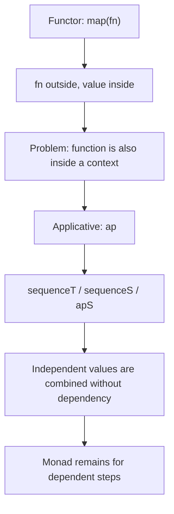

# Chapter: Аппликативные функторы через призму fp-ts

> [!info] Context
> Эта глава переосмысляет `Mostly Adequate Guide`, chapter 10, через `fp-ts`. Центральная идея не меняется: `map` уже не хватает, когда функция тоже живёт в контексте. Но теперь мы смотрим на это через реальные `fp-ts`-инструменты: `ap`, `apFirst`, `apSecond`, `sequenceT`, `sequenceS`, `apS`, `Task`, `TaskEither`, `Option` и `Either`.
>
> **Пререквизиты:** [[ch09-monads/ch09-monads|Монадические луковицы через призму fp-ts]], [[ch08-functors-and-containers/ch08-functors-and-containers|Функторы и контейнеры через призму fp-ts]], [[fp-ts-phase-1-2]]. Желательно уверенно читать `pipe(...)` и namespace imports.

## Overview

`Monad` и `Applicative` решают разные задачи. В `ch09` мы разбирали зависимые шаги: следующий шаг может начаться только после результата предыдущего. Здесь задача другая: есть несколько независимых значений, и мы хотим собрать их в один результат, не заставляя программу идти по монadic-цепочке только ради формы.

Если у тебя есть `map`, ты можешь применить обычную функцию к значению внутри контекста. Но если сама функция тоже находится в контексте, `map` уже не справляется. Именно здесь и начинается `ap`.



План главы:

1. Почему `map` заканчивается раньше, чем хочется.
2. Что делает `ap` и почему функция тоже может жить в контексте.
3. Как `Option` и `Either` используют `ap` для независимых значений.
4. Как `sequenceT`, `sequenceS` и `apS` делают applicative-composition удобнее.
5. Почему `Task` и `TaskEither` особенно хорошо показывают разницу между независимым и последовательным комбинированием.
6. Откуда берутся `liftA2` / `liftA3`, и почему в `fp-ts` это скорее историческая интуиция, чем основной стиль.
7. Законы Applicative как гарантии предсказуемой композиции.
8. Почему Applicative слабее Monad, но часто лучше выражает независимые данные.

> [!important] Ключевая мысль
> Если следующий шаг зависит от результата предыдущего, нужен `Monad` / `flatMap`. Если шаги независимы, Applicative обычно точнее выражает намерение.

**Краткое резюме:** эта глава не про “ещё один combinator”. Она про более точный способ собирать независимые значения без искусственной последовательности.

## Deep Dive

### 1. Почему `map` уже не хватает

`map` отлично работает, когда функция находится **снаружи** контекста, а значение — **внутри**.

```typescript
import * as O from 'fp-ts/Option'
import { pipe } from 'fp-ts/function'

const double = (n: number): number => n * 2

pipe(
  O.some(2),
  O.map(double)
)
// Option<number>
```

Теперь смотри на другую форму: сама функция тоже может жить в контексте.

```typescript
O.some((n: number) => n * 3)
// Option<(n: number) => number>
```

Это не `Option<Option<number>>` из `ch09`. Здесь другая форма: `F<(a) => b>` плюс `F<a>`. `map` не умеет соединить эти две формы, потому что он ждёт обычную функцию снаружи. Для этого нужен `ap`.

> [!tip] Практический сигнал
> Если у тебя есть `F<(a) => b>` и `F<a>`, `map` уже не решает задачу. Это зона Applicative.

**Краткое резюме:** `map` применяет обычную функцию, которая находится снаружи контекста. Когда функция сама живёт в контексте, нужен `ap`.

### 2. Что такое `ap`

`ap` применяет функцию внутри одного контекста к значению внутри другого контекста. Это прямой ответ на ситуацию `F<(a) => b>` + `F<a>`.

```typescript
import * as O from 'fp-ts/Option'
import { pipe } from 'fp-ts/function'

const add = (a: number) => (b: number): number => a + b

pipe(
  O.some(add),
  O.ap(O.some(2)),
  O.ap(O.some(3))
)
// Option<number>
```

Читать это удобно так:

1. Функция уже поднята в контекст.
2. Первый `ap` передаёт ей первый аргумент.
3. Второй `ap` передаёт ей второй аргумент.
4. Результат остаётся внутри того же контекста.

`ap` не требует зависимости между шагами. Он просто сочетает независимые аргументы в одной форме.

Если сравнить это с `ch09`, там была другая проблема: функция возвращала новый контекст, и появлялось `F<F<A>>`. Здесь мы не разворачиваем вложенность, а применяем обёрнутую функцию к обёрнутому значению. Это важно держать отдельно: `ch10` не про nested-return case, а про applicative application.

> [!info] С чем это не надо путать
> `ap` не извлекает значения из контейнеров. Он не “разворачивает” их в сырые значения. Он применяет обёрнутую функцию к обёрнутому значению и сохраняет форму контекста.

**Краткое резюме:** `ap` — это applicative-версия обычного вызова функции. В этой главе ключевой случай — `F<(a) => b>` плюс `F<a>`, а не `F<F<A>>`.

### 3. `Option` и `Either` как applicative-сценарии

`Option` хорошо показывает, как applicative-композиция коротко замыкается, если чего-то не хватает.

```typescript
import * as O from 'fp-ts/Option'
import { pipe } from 'fp-ts/function'

const makeFullName = (first: string) => (last: string): string => `${first} ${last}`

pipe(
  O.some(makeFullName),
  O.ap(O.some('Ada')),
  O.ap(O.some('Lovelace'))
)
// Option<string>
```

Если хотя бы один аргумент `None`, весь результат становится `None`. Это честное поведение: независимое комбинирование не должно выдумывать отсутствующее значение.

```typescript
pipe(
  O.some(makeFullName),
  O.ap(O.some('Ada')),
  O.ap(O.none)
)
// Option<string>
```

`Either` работает так же, но вместо отсутствия значения у нас есть явная ошибка.

```typescript
import * as E from 'fp-ts/Either'
import { pipe } from 'fp-ts/function'

type User = Readonly<{
  name: string
  email: string
}>

const buildUserLabel = (name: string) => (email: string): string => `${name} <${email}>`

const validName = E.of('Ada')
const validEmail = E.of('ada@example.com')

pipe(
  E.of(buildUserLabel),
  E.ap(validName),
  E.ap(validEmail)
)
// Either<never, string>
```

Если одна сторона `Left`, комбинирование останавливается. Здесь важно не потерять смысл: Applicative не пытается “умнее” Monad, он просто подходит к задаче с другим намерением. Нам нужны независимые части, а не последовательная зависимость.

> [!tip] Почему `Either` здесь полезен
> `Either` показывает, что Applicative не привязан к “отсутствию” как `Option`. Он одинаково хорошо работает и с явной ошибкой, если независимые части можно собирать без зависимости друг от друга.

**Краткое резюме:** `Option` и `Either` показывают одну и ту же форму applicative-композиции: независимые аргументы можно собирать в один результат, сохраняя семантику отсутствия или ошибки.

### 4. `sequenceT`, `sequenceS` и `apS`

Если `ap` объясняет механику, то `sequenceT`, `sequenceS` и `apS` объясняют ergonomics.

`sequenceT` удобно использовать, когда тебе нужен tuple из независимых эффектов.

```typescript
import * as O from 'fp-ts/Option'
import { sequenceT } from 'fp-ts/Apply'

const result = sequenceT(O.Applicative)(
  O.some('Ada'),
  O.some('Lovelace')
)
// Option<readonly [string, string]>
```

`sequenceS` удобен, когда ты собираешь record.

```typescript
import * as O from 'fp-ts/Option'
import { sequenceS } from 'fp-ts/Apply'

const user = sequenceS(O.Applicative)({
  firstName: O.some('Ada'),
  lastName: O.some('Lovelace'),
})
// Option<{ firstName: string; lastName: string }>
```

`apS` даёт do-like стиль без зависимой monadic цепочки. Он особенно полезен, когда значения независимы, но хочется собирать их пошагово и читабельно.

```typescript
import * as O from 'fp-ts/Option'
import { pipe } from 'fp-ts/function'

pipe(
  O.Do,
  O.apS('firstName', O.some('Ada')),
  O.apS('lastName', O.some('Lovelace'))
)
// Option<{ firstName: string; lastName: string }>
```

Эти helpers важны не потому, что они “красивее” `ap`. Они важны потому, что они выражают intent: мы собираем независимые куски в одну структуру.

> [!important] Главное различие
> `sequenceT` и `sequenceS` говорят: “у меня есть набор независимых эффектов, собери их вместе”. `apS` говорит почти то же самое, но в стиле пошаговой сборки record.

**Краткое резюме:** `sequenceT`, `sequenceS` и `apS` делают applicative-код короче и понятнее, когда тебе нужно собрать tuple или record из независимых значений.

### 4.1 `apFirst` и `apSecond`

Иногда результат одного из независимых шагов нужен только ради эффекта, а сохранить хочется только одну сторону. Для этого у `fp-ts` есть `apFirst` и `apSecond`.

```typescript
import * as O from 'fp-ts/Option'
import { pipe } from 'fp-ts/function'

pipe(
  O.some('Ada'),
  O.apSecond(O.some('Lovelace'))
)
// Option<string>

pipe(
  O.some('Ada'),
  O.apFirst(O.some('Lovelace'))
)
// Option<string>
```

`apSecond` сохраняет второй результат, `apFirst` сохраняет первый. Оба шага при этом всё равно выполняются в applicative-режиме, то есть как независимые эффекты.

> [!tip] Где это полезно
> `apFirst` и `apSecond` удобны, когда нужно выполнить две независимые операции, но оставить только один из результатов. Это частый production-паттерн.

**Краткое резюме:** `apFirst` и `apSecond` не добавляют новую семантику; они просто делают applicative-пайплайн удобнее, когда важен только один из результатов.

### 5. `Task` и `TaskEither`: независимые эффекты

`Task` показывает главный смысл Applicative особенно ясно: независимые async-эффекты можно описывать без monadic зависимости.

```typescript
import * as T from 'fp-ts/Task'
import { sequenceT } from 'fp-ts/Apply'
import { pipe } from 'fp-ts/function'

const loadProfile: T.Task<string> = () => Promise.resolve('Ada')
const loadPreferences: T.Task<string> = () => Promise.resolve('dark')

pipe(
  sequenceT(T.ApplyPar)(loadProfile, loadPreferences)
)
// Task<readonly [string, string]>
```

Здесь аргументы независимы. Нам не нужен результат `loadProfile`, чтобы запустить `loadPreferences`. Поэтому applicative-комбинация точнее, чем monadic sequence.

Если хочется подчеркнуть другой режим исполнения, `Task` также поддерживает последовательный applicative instance:

```typescript
pipe(
  sequenceT(T.ApplySeq)(loadProfile, loadPreferences)
)
// Task<readonly [string, string]>
```

`ApplyPar` и `ApplySeq` возвращают один и тот же тип формы, но у них разная семантика исполнения. В `TaskEither` это различие тоже важно: `ApplyPar` подходит для независимых эффектов, `ApplySeq` - когда порядок важен, но тебе всё ещё нужен applicative-style, а не `flatMap`.

Для `TaskEither` картина похожая, только добавляется явная ошибка.

```typescript
import * as TE from 'fp-ts/TaskEither'
import { sequenceS } from 'fp-ts/Apply'
import { pipe } from 'fp-ts/function'

type Settings = Readonly<{
  theme: string
  locale: string
}>

const toError = (reason: unknown): Error =>
  reason instanceof Error ? reason : new Error(String(reason))

const loadTheme: TE.TaskEither<Error, string> = TE.tryCatch(
  async () => 'dark',
  toError
)

const loadLocale: TE.TaskEither<Error, string> = TE.tryCatch(
  async () => 'ru-RU',
  toError
)

pipe(
  sequenceS(TE.ApplyPar)({
    theme: loadTheme,
    locale: loadLocale,
  })
)
// TaskEither<Error, Settings>
```

Если тебе нужен именно зависимый шаг, ты вернёшься к `flatMap`. Но если шаги независимы, `ApplicativePar` / `ApplyPar` выражают намерение честнее: эти действия можно объединять без искусственной последовательности. Когда нужен другой порядок выполнения, но зависимость всё ещё отсутствует, можно выбрать `ApplySeq`.

> [!warning] Важный выбор
> `TaskEither` можно читать и applicatively, и monadically. Если шаги независимы, выбирай applicative instance. Если следующий шаг зависит от предыдущего, выбирай `flatMap`.

**Краткое резюме:** `Task` и `TaskEither` показывают applicative-смысл особенно наглядно: независимые эффекты можно комбинировать без monadic dependency chain.

### 6. `liftA2` и `liftA3`

В оригинальной книге `liftA2` и `liftA3` помогают интуитивно почувствовать Applicative: обычная функция нескольких аргументов “поднимается” в мир контейнеров.

```typescript
const liftLike = (a: number) => (b: number) => a + b
```

В `fp-ts` эту интуицию обычно удобнее выражать через `ap`, `sequenceT`, `sequenceS` и `apS`. Поэтому `liftA2` / `liftA3` стоит помнить как мост к оригинальной книге, а не как основной современный стиль.

```typescript
import * as O from 'fp-ts/Option'
import { sequenceT } from 'fp-ts/Apply'

sequenceT(O.Applicative)(O.some(2), O.some(3))
// Option<readonly [number, number]>
```

Если хочется именно “поднять функцию”, это лучше читать как идею, а не как обязательный API shape.

> [!tip] Как это понимать
> `liftA2` в книге учит интуиции: обычная функция становится applicative-функцией, если все её аргументы тоже лежат в контекстах. В `fp-ts` для этого чаще используют `ap`-цепочки и `sequence*` helpers.

**Краткое резюме:** `liftA2` / `liftA3` полезны как учебная метафора, но в `fp-ts` практичнее думать через `ap`, `sequenceT`, `sequenceS` и `apS`.

### 7. Законы Applicative

Как и в `Functor` и `Monad`, законы нужны не для украшения, а для того, чтобы композиция была предсказуемой.

Для Applicative обычно говорят о четырёх законах:

1. `identity` - `ap(of(id), v) = v`
2. `homomorphism` - `ap(of(f), of(x)) = of(f(x))`
3. `interchange` - `ap(u, of(y)) = ap(of(f => f(y)), u)`
4. `composition` - порядок группировки не должен менять смысл результата

Не обязательно зубрить формулы. Важнее увидеть смысл: applicative-композиция не должна вести себя по-разному в зависимости от того, как ты сгруппировал эквивалентные выражения.

```typescript
import * as O from 'fp-ts/Option'
import { pipe } from 'fp-ts/function'

const id = <A>(x: A): A => x
const add1 = (n: number): number => n + 1

pipe(
  O.some(id),
  O.ap(O.some(2))
)
// Option<number>

pipe(
  O.some(add1),
  O.ap(O.some(2))
)
// Option<number>
```

Смысл законов в том, что applicative-composition не должна вести себя по-разному в зависимости от того, как ты переписал код. Это та же практическая дисциплина, что и в `Functor` и `Monad`: рефакторинг должен быть безопасным.

Для `Option` это означает простую вещь: если функция и аргумент оба присутствуют, результат должен быть стабилен независимо от формы записи. Если один из них отсутствует, `None` остаётся `None`.

> [!important] Что дают законы
> Законы говорят, что applicative-композиция не меняет смысл в зависимости от перестановки эквивалентных выражений. Это и есть причина, по которой код остаётся читаемым и предсказуемым.

**Краткое резюме:** законы Applicative фиксируют поведение `ap` и помогают безопасно рефакторить applicative-пайплайны.

### 8. Почему Applicative слабее Monad, но часто лучше

Monad умеет больше: он позволяет делать следующий шаг зависимым от результата предыдущего, а `Applicative` этого не делает. Но именно это и делает его полезным для независимых данных.

```typescript
import * as O from 'fp-ts/Option'
import { pipe } from 'fp-ts/function'

const buildLabel = (name: string) => (age: number): string => `${name}: ${age}`

pipe(
  O.some(buildLabel),
  O.ap(O.some('Ada')),
  O.ap(O.some(36))
)
// Option<string>
```

Если бы мы пытались решать такую задачу через Monad, мы бы добавили лишнюю последовательность, которая ничего не даёт. Applicative слабее, но именно поэтому он точнее выражает независимость аргументов.

Именно так нужно читать эту главу после `ch09`: Monad не отменяется, он остаётся для зависимых шагов. Applicative просто лучше подходит там, где зависимости нет и не должно быть.

> [!tip] Практическое правило
> Когда шаги независимы, выбирай abstraction that says so. `Applicative` говорит это лучше, чем `Monad`.

**Краткое резюме:** Applicative слабее Monad по выразительной силе, но часто сильнее по точности намерения. Независимые данные лучше собирать именно так.

## Exercises

Ниже задачи не на синтаксис ради синтаксиса, а на выбор правильной формы композиции. Смотри на зависимость шагов: если аргументы независимы, чаще всего нужен Applicative; если следующий шаг зависит от предыдущего, это уже зона Monad.

## Exercise 1: `ap` для `Option`

**Difficulty:** beginner

**Task:** Собери строку профиля из двух независимых `Option`-значений.

**Requirements:**
- не использовать `flatMap`
- не распаковывать значения вручную
- сохранить `Option`-контекст до самого конца

```typescript
import * as O from 'fp-ts/Option'
import { pipe } from 'fp-ts/function'

const buildProfileLabel = (
  _name: O.Option<string>,
  _city: O.Option<string>
): O.Option<string> => {
  throw new Error('implement me')
}
```

**Test cases:**

```typescript
import { expect, test } from 'vitest'
import * as O from 'fp-ts/Option'

test('buildProfileLabel combines two independent Option values with ap', () => {
  expect(
    buildProfileLabel(O.some('Ada'), O.some('London'))
  ).toEqual(O.some('Ada from London'))

  expect(
    buildProfileLabel(O.some('Ada'), O.none)
  ).toEqual(O.none)

  expect(
    buildProfileLabel(O.none, O.some('London'))
  ).toEqual(O.none)
})
```

> [!tip]- Hint
> Подними каррированную функцию в `Option`, а потом передай ей аргументы через `O.ap`.

> [!warning]- Solution
> ```typescript
> const buildProfileLabel = (
>   name: O.Option<string>,
>   city: O.Option<string>
> ): O.Option<string> =>
>   pipe(
>     O.some((n: string) => (c: string) => `${n} from ${c}`),
>     O.ap(name),
>     O.ap(city)
>   )
> ```

## Exercise 2: `sequenceS` для record assembly

**Difficulty:** beginner

**Task:** Собери `Option`-record из нескольких независимых полей.

**Requirements:**
- использовать `sequenceS`
- не собирать record вручную через `if`
- вернуть `Option` от record, а не отдельные поля по одному

```typescript
import * as O from 'fp-ts/Option'
import { sequenceS } from 'fp-ts/Apply'

type Profile = Readonly<{
  firstName: string
  lastName: string
  city: string
}>

const assembleProfile = (
  _firstName: O.Option<string>,
  _lastName: O.Option<string>,
  _city: O.Option<string>
): O.Option<Profile> => {
  throw new Error('implement me')
}
```

**Test cases:**

```typescript
import { expect, test } from 'vitest'
import * as O from 'fp-ts/Option'

test('assembleProfile returns Some when all independent fields are present', () => {
  expect(
    assembleProfile(O.some('Ada'), O.some('Lovelace'), O.some('London'))
  ).toEqual(
    O.some({
      firstName: 'Ada',
      lastName: 'Lovelace',
      city: 'London',
    })
  )
})

test('assembleProfile returns None when one field is missing', () => {
  expect(
    assembleProfile(O.some('Ada'), O.none, O.some('London'))
  ).toEqual(O.none)
})
```

> [!tip]- Hint
> `sequenceS(O.Applicative)` собирает record из независимых `Option`-значений.

> [!warning]- Solution
> ```typescript
> const assembleProfile = (
>   firstName: O.Option<string>,
>   lastName: O.Option<string>,
>   city: O.Option<string>
> ): O.Option<Profile> =>
>   sequenceS(O.Applicative)({
>     firstName,
>     lastName,
>     city,
>   })
> ```

## Exercise 3: Независимый `TaskEither`

**Difficulty:** intermediate

**Task:** Собери независимые async-значения с ошибкой через `sequenceS(TE.ApplyPar)`.

**Requirements:**
- использовать `sequenceS`
- использовать `TE.ApplyPar`
- сохранить ошибку в `Left`
- не делать второй шаг зависимым от первого

```typescript
import * as TE from 'fp-ts/TaskEither'
import { sequenceS } from 'fp-ts/Apply'

type Settings = Readonly<{
  theme: string
  locale: string
}>

const loadSettings = (
  _loadTheme: TE.TaskEither<Error, string>,
  _loadLocale: TE.TaskEither<Error, string>
): TE.TaskEither<Error, Settings> => {
  throw new Error('implement me')
}
```

**Test cases:**

```typescript
import { expect, test } from 'vitest'
import * as E from 'fp-ts/Either'
import * as TE from 'fp-ts/TaskEither'

test('loadSettings combines two independent TaskEither values', async () => {
  await expect(
    loadSettings(
      TE.right<Error, string>('dark'),
      TE.right<Error, string>('ru-RU')
    )()
  ).resolves.toEqual(
    E.right({
      theme: 'dark',
      locale: 'ru-RU',
    })
  )
})

test('loadSettings keeps Left when one independent effect fails', async () => {
  await expect(
    loadSettings(
      TE.left<Error, string>(new Error('theme failed')),
      TE.right<Error, string>('ru-RU')
    )()
  ).resolves.toEqual(E.left(new Error('theme failed')))
})
```

> [!tip]- Hint
> Если шаги независимы, собирай их через `sequenceS(TE.ApplyPar)`.

> [!warning]- Solution
> ```typescript
> const loadSettings = (
>   loadTheme: TE.TaskEither<Error, string>,
>   loadLocale: TE.TaskEither<Error, string>
> ): TE.TaskEither<Error, Settings> =>
>   sequenceS(TE.ApplyPar)({
>     theme: loadTheme,
>     locale: loadLocale,
>   })
> ```

## Exercise 4: `apFirst` и `apSecond`

**Difficulty:** intermediate

**Task:** Выполни два независимых `IO`-шага, но сохрани только один результат.

**Requirements:**
- использовать `apFirst` и `apSecond`
- оба шага должны выполниться
- вернуть только нужное значение

```typescript
import * as IO from 'fp-ts/IO'
import { pipe } from 'fp-ts/function'

const keepPrimaryResult = (
  _primary: IO.IO<string>,
  _audit: IO.IO<string>
): IO.IO<string> => {
  throw new Error('implement me')
}

const keepAuditResult = (
  _primary: IO.IO<string>,
  _audit: IO.IO<string>
): IO.IO<string> => {
  throw new Error('implement me')
}
```

**Test cases:**

```typescript
import { expect, test } from 'vitest'
import * as IO from 'fp-ts/IO'

test('keepPrimaryResult preserves the first result but still runs both steps', () => {
  const log: string[] = []

  const primary: IO.IO<string> = () => {
    log.push('primary')
    return 'draft'
  }

  const audit: IO.IO<string> = () => {
    log.push('audit')
    return 'logged'
  }

  expect(keepPrimaryResult(primary, audit)()).toBe('draft')
  expect(log).toEqual(['primary', 'audit'])
})

test('keepAuditResult preserves the second result but still runs both steps', () => {
  const log: string[] = []

  const primary: IO.IO<string> = () => {
    log.push('primary')
    return 'draft'
  }

  const audit: IO.IO<string> = () => {
    log.push('audit')
    return 'logged'
  }

  expect(keepAuditResult(primary, audit)()).toBe('logged')
  expect(log).toEqual(['primary', 'audit'])
})
```

> [!tip]- Hint
> `apFirst` сохраняет первый результат, `apSecond` - второй. Оба шага всё равно выполняются.

> [!warning]- Solution
> ```typescript
> const keepPrimaryResult = (
>   primary: IO.IO<string>,
>   audit: IO.IO<string>
> ): IO.IO<string> =>
>   pipe(primary, IO.apFirst(audit))
>
> const keepAuditResult = (
>   primary: IO.IO<string>,
>   audit: IO.IO<string>
> ): IO.IO<string> =>
>   pipe(primary, IO.apSecond(audit))
> ```

## Exercise 5: Applicative vs Monad

**Difficulty:** advanced

**Task:** Для независимых данных используй Applicative, а для зависимого шага - Monad.

**Requirements:**
- `renderCard` должен собирать независимые поля applicatively
- `renderAgeLabel` должен использовать `flatMap`, потому что следующая ветка зависит от возраста
- не смешивать обе стратегии в одном helper

```typescript
import * as O from 'fp-ts/Option'
import { pipe } from 'fp-ts/function'
import { sequenceS } from 'fp-ts/Apply'

type CardInput = Readonly<{
  name: O.Option<string>
  city: O.Option<string>
}>

const renderCard = (_input: CardInput): O.Option<string> => {
  throw new Error('implement me')
}

const renderAgeLabel = (_age: O.Option<number>): O.Option<string> => {
  throw new Error('implement me')
}
```

**Test cases:**

```typescript
import { expect, test } from 'vitest'
import * as O from 'fp-ts/Option'

test('renderCard uses Applicative for independent fields', () => {
  expect(
    renderCard({
      name: O.some('Ada'),
      city: O.some('London'),
    })
  ).toEqual(O.some('Ada from London'))

  expect(
    renderCard({
      name: O.some('Ada'),
      city: O.none,
    })
  ).toEqual(O.none)
})

test('renderAgeLabel uses Monad when the next step depends on the current value', () => {
  expect(renderAgeLabel(O.some(18))).toEqual(O.some('Adult: 18'))
  expect(renderAgeLabel(O.some(16))).toEqual(O.none)
  expect(renderAgeLabel(O.none)).toEqual(O.none)
})
```

> [!tip]- Hint
> Независимые поля удобно собирать через `sequenceS`. Зависимое ветвление оставь для `flatMap`.

> [!warning]- Solution
> ```typescript
> const renderCard = (input: CardInput): O.Option<string> =>
>   pipe(
>     sequenceS(O.Applicative)({
>       name: input.name,
>       city: input.city,
>     }),
>     O.map(({ name, city }) => `${name} from ${city}`)
>   )
>
> const renderAgeLabel = (age: O.Option<number>): O.Option<string> =>
>   pipe(
>     age,
>     O.flatMap((value) => (value >= 18 ? O.some(`Adult: ${value}`) : O.none))
>   )
> ```

**Краткое резюме:** в этих задачах нужно не просто написать код, а выбрать правильную абстракцию. `ap` и `sequenceS` хорошо работают для независимых значений, а `flatMap` нужен только там, где есть настоящая зависимость.

## Anki Cards

> [!tip] Flashcards
> Q: Когда `Applicative` подходит лучше, чем `Monad`?
> A: Когда значения или эффекты независимы друг от друга и их не нужно строить через результат предыдущего шага.

> [!tip] Flashcards
> Q: Какую проблему решает `ap`?
> A: Он применяет функцию внутри контекста `F<(a) => b>` к значению внутри контекста `F<a>`, сохраняя тот же вид контекста.

> [!tip] Flashcards
> Q: Чем `ap` отличается от `map`?
> A: `map` ожидает обычную функцию снаружи контекста, а `ap` работает, когда функция тоже уже находится внутри контекста.

> [!tip] Flashcards
> Q: Зачем нужны `sequenceT` и `sequenceS`?
> A: Они собирают несколько независимых effectful-значений в tuple или record без ручной цепочки `ap`.

> [!tip] Flashcards
> Q: Что даёт `apS`?
> A: Он позволяет пошагово собирать record в applicative-style, не скатываясь в monadic зависимость.

> [!tip] Flashcards
> Q: Почему `liftA2` и `liftA3` в `fp-ts` не стоит делать основным API?
> A: Они полезны как историческая интуиция из книги, но в современном `fp-ts` чаще практичнее `ap`, `sequenceT`, `sequenceS` и `apS`.

> [!tip] Flashcards
> Q: Что показывают `ApplyPar` и `ApplySeq` на `Task` или `TaskEither`?
> A: Что независимые эффекты можно комбинировать в одной applicative-форме, но с разной семантикой исполнения: параллельной или последовательной.

## Related Topics

- [[ch09-monads/ch09-monads|Монадические луковицы через призму fp-ts]]
- [[ch08-functors-and-containers/ch08-functors-and-containers|Функторы и контейнеры через призму fp-ts]]
- [[ch03-pure-functions|Pure Functions через призму fp-ts]]
- [[ch04-currying/ch04-currying|Currying через призму fp-ts]]
- [[fp-ts-phase-1-2]]
- [[fp-ts-roadmap]]

## Sources

- [Mostly Adequate Guide, chapter 10: Applicative Functors](https://mostly-adequate.gitbook.io/mostly-adequate-guide/ch10)
- [Mostly Adequate Guide, Russian translation, ch10](https://github.com/MostlyAdequate/mostly-adequate-guide-ru/blob/master/ch10-ru.md)
- [fp-ts Apply module](https://gcanti.github.io/fp-ts/modules/Apply.ts.html)
- [fp-ts Applicative module](https://gcanti.github.io/fp-ts/modules/Applicative.ts.html)
- [fp-ts Option module](https://gcanti.github.io/fp-ts/modules/Option.ts.html)
- [fp-ts Either module](https://gcanti.github.io/fp-ts/modules/Either.ts.html)
- [fp-ts Task module](https://gcanti.github.io/fp-ts/modules/Task.ts.html)
- [fp-ts TaskEither module](https://gcanti.github.io/fp-ts/modules/TaskEither.ts.html)
- [fp-ts Function module](https://gcanti.github.io/fp-ts/modules/Function.ts.html)
