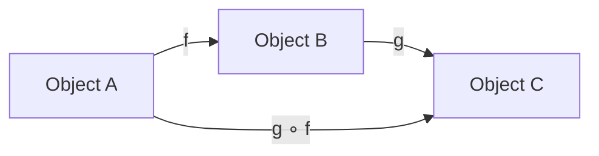
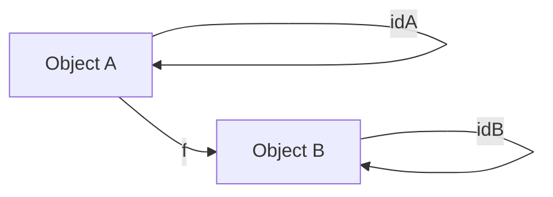

# Category theory

> [!info] Context
> Функциональное программирование опирается на теорию категорий, потому что она описывает отношения между типами и преобразованиями в самой общей форме.

## Main Content

Категории состоят из объектов и морфизмов. Морфизм — это абстрактное преобразование, которое связывает два объекта: если есть морфизм `f: A -> B`, то он переводит элемент или структуру из типа `A` в тип `B`, при этом можно последовательно применять морфизмы через композицию.

Запись `g ∘ f` читается как `g` после `f`: сначала применяется `f`, а затем результат передаётся в `g`.

```text
f: A -> B
g: B -> C

g ∘ f: A -> C
```

В коде это выглядит как вложенный вызов `g(f(value))`. Важно читать композицию справа налево по порядку выполнения: в `g ∘ f` сначала выполняется `f`, потом `g`.

В программировании морфизмы часто проявляются как функции между типами или как преобразования состояний, которые сохраняют общую структуру. Когда мы объединяем функции (композируем), мы идём тем же путём, как и при композиции морфизмов.

Пример диаграммы морфизмов:



> [!tip] Схема показывает, что если `f` идёт из `A` в `B`, а `g` из `B` в `C`, то по правилам теории категорий можно сразу получить морфизм `g ∘ f` из `A` в `C`.

### Three Category Rules

Категория задаётся не только объектами и морфизмами. Чтобы набор объектов и стрелок действительно был категорией, композиция морфизмов должна подчиняться трём правилам.

#### 1. Composition definition

Если есть два морфизма:

```text
f: A -> B
g: B -> C
```

то их можно скомпоновать, потому что конец `f` совпадает с началом `g`. Результатом будет новый морфизм:

```text
g ∘ f: A -> C
```

В программировании это похоже на композицию функций:

```ts
const f = (value: number): string => String(value);
const g = (value: string): boolean => value.length > 0;

const composed = (value: number): boolean => g(f(value));
```

> [!important] Композиция возможна только если тип результата первой функции подходит как тип аргумента второй функции.

#### 2. Composition associativity

Если есть три морфизма:

```text
f: A -> B
g: B -> C
h: C -> D
```

то порядок группировки композиции не должен менять результат:

```text
h ∘ (g ∘ f) = (h ∘ g) ∘ f
```

В программировании это означает, что обе записи описывают одну и ту же цепочку преобразований:

```ts
h(g(f(value)));
```

> [!tip] Ассоциативность не говорит, что можно менять порядок функций. Она говорит только, что можно по-разному расставлять скобки вокруг одной и той же последовательности.

#### 3. Composition identity

Composition identity говорит: у каждого объекта есть специальная "стрелка в себя", которая ничего не меняет.

```text
idA: A -> A
```

Эта стрелка называется тождественным морфизмом. Она работает как нейтральный элемент для композиции: если добавить её до или после полезного преобразования, итоговый результат должен остаться тем же самым.

Если есть морфизм:

```text
f: A -> B
```

то у объектов `A` и `B` есть свои identity-морфизмы:

```text
idA: A -> A
idB: B -> B
```

И должны выполняться два равенства:

```text
f ∘ idA = f
idB ∘ f = f
```

Почему два? Потому что `f` соединяет два разных объекта: начинается в `A`, а заканчивается в `B`.

```text
A --idA--> A --f--> B
```

Это то же самое, что:

```text
A --f--> B
```

И второй вариант:

```text
A --f--> B --idB--> B
```

Это тоже то же самое, что:

```text
A --f--> B
```

Диаграмма:



В программировании это соответствует функции `identity`, которая возвращает входное значение без изменений:

```ts
const identity = <T>(value: T): T => value;
```

Для функции `f: number -> string`:

```ts
const f = (value: number): string => String(value);

const idNumber = (value: number): number => value;
const idString = (value: string): string => value;

const beforeF = (value: number): string => f(idNumber(value));
const afterF = (value: number): string => idString(f(value));

beforeF(42) === f(42); // true
afterF(42) === f(42); // true
```

Здесь `idNumber` играет роль `idA`, потому что `A` это `number`. `idString` играет роль `idB`, потому что `B` это `string`.

> [!important] Важная мысль
> `identity` не делает программу полезнее сама по себе. Она нужна как закон композиции: мы можем вставить или убрать "ничего не делающее" преобразование, и смысл цепочки не изменится.

> [!important] Коротко: первое правило говорит, когда композиция возможна; второе говорит, что группировка композиции не важна; третье говорит, что у каждого объекта есть "ничего не меняющее" преобразование.

## Examples

Order

## Related Topics

- [[02-typescript:functiona-programming-in-ts/16.functors]]
- [[02-typescript:functiona-programming-in-ts/18.monads]]

## Sources

- [Category Theory for Programmers](https://github.com/hmemcpy/milewski-ctfp-pdf)
