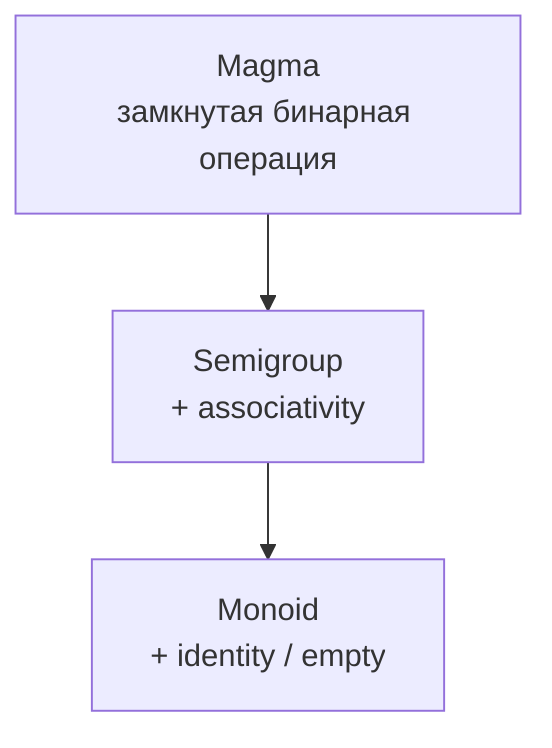

---
tags:
  [
    typescript,
    functional-programming,
    algebraic-structures,
    magma,
    semigroup,
    monoid,
  ]
aliases: [Magma, Semigroup, Monoid]
---

# Magma, Semigroup, Monoid

> [!info] Context
> `Magma`, `Semigroup` и `Monoid` — это простые алгебраические структуры, которые часто встречаются в functional programming. Они помогают формально ответить на три вопроса:
>
> 1. Можно ли безопасно "склеить" два значения одного типа в одно значение того же типа?
> 2. Можно ли по-разному группировать вычисления без изменения результата?
> 3. Есть ли нейтральное значение, с которого удобно начинать `reduce` и `fold`?

## Main Content

### Общая картина

Эти структуры удобно понимать как лестницу усложнения:



Здесь важно помнить идею из [[type-as-set]]: мы всегда говорим не просто про "тип сам по себе", а про пару:

1. множество значений
2. операция, которой мы их объединяем

Например, `number` с операцией `+` и `number` с операцией `-` — это разные структуры, хотя carrier type один и тот же.

> [!important] Операция важна не меньше, чем тип
> `number` с `+` может быть `Monoid`, а `number` с `-` только `Magma`. Нельзя говорить "числа — это monoid" без указания операции.

**Итог:** `Magma`, `Semigroup` и `Monoid` описывают не просто данные, а данные вместе с правилом их объединения.

### 1. Magma

`Magma` — самая базовая структура.

Определение:

> [!tip] Magma
> `Magma` — это множество значений с бинарной операцией, которая замкнута на этом же множестве.

"Замкнута" значит: если взять два значения типа `A`, результат тоже будет типа `A`.

```typescript
interface Magma<A> {
  concat: (x: A, y: A) => A;
}
```

#### Примеры `Magma`

```typescript
const numberAddition: Magma<number> = {
  concat: (x, y) => x + y,
};

const numberSubtraction: Magma<number> = {
  concat: (x, y) => x - y,
};

const stringConcat: Magma<string> = {
  concat: (x, y) => x + y,
};

const arrayConcat: Magma<readonly number[]> = {
  concat: (x, y) => [...x, ...y],
};
```

Почему это `Magma`:

1. `number + number -> number`
2. `number - number -> number`
3. `string + string -> string`
4. `Array<A> + Array<A> -> Array<A>`

#### Контрпример

Если носителем считать целые числа, то деление не даёт `Magma`:

```typescript
// 4 / 5 = 0.8, а это уже не integer
```

То есть операция не замкнута на исходном множестве.

> [!warning] Частая ошибка
> `Subtraction` на числах — это всё ещё `Magma`, потому что замкнутость есть. Но это уже не `Semigroup`, потому что нет associativity.

**Итог:** чтобы получить `Magma`, достаточно одного свойства: из двух значений типа `A` должна получаться ещё одна `A`.

### 2. Semigroup

`Semigroup` — это `Magma`, у которой операция ассоциативна.

```typescript
interface Semigroup<A> extends Magma<A> {}
```

TypeScript не умеет проверить закон ассоциативности на уровне типов, поэтому этот контракт приходится держать в голове и проверять тестами или рассуждением.

#### Закон associativity

```text
concat(x, concat(y, z)) === concat(concat(x, y), z)
```

Смысл не в том, что можно менять порядок аргументов. Смысл в том, что можно по-разному расставлять скобки.

#### Примеры `Semigroup`

```typescript
const sum: Semigroup<number> = {
  concat: (x, y) => x + y,
};

const product: Semigroup<number> = {
  concat: (x, y) => x * y,
};

const strings: Semigroup<string> = {
  concat: (x, y) => x + y,
};

const arrays: Semigroup<readonly string[]> = {
  concat: (x, y) => [...x, ...y],
};
```

Проверка на примере строк:

```typescript
"a" + ("b" + "c") === "a" + "b" + "c"; // true
```

Проверка на примере чисел со сложением:

```typescript
1 + (2 + 3) === 1 + 2 + 3; // true
```

#### Что не является `Semigroup`

`Subtraction` на числах:

```typescript
10 - (5 - 1) === 6;
10 - 5 - 1 === 4;
```

Результаты разные, значит associativity нарушена.

`Division` на ненулевых вещественных числах тоже неассоциативно:

```typescript
12 / (6 / 2) === 4;
12 / 6 / 2 === 1;
```

#### Почему `Semigroup` полезен

Ассоциативность позволяет:

1. безопасно перегруппировывать вычисления
2. комбинировать данные по частям
3. распараллеливать aggregation

Например, если сумма ассоциативна, можно считать её батчами:

```typescript
const leftChunk = 1 + 2;
const rightChunk = 3 + 4;

const total = leftChunk + rightChunk;
```

Это даёт тот же результат, что и обычная левая или правая свёртка.

**Итог:** `Semigroup` говорит не только "значения можно склеивать", но и "группировка склеивания не меняет смысл".

### 3. Monoid

`Monoid` — это `Semigroup`, у которого есть нейтральный элемент.

```typescript
interface Monoid<A> extends Semigroup<A> {
  empty: A;
}
```

Нейтральный элемент означает:

```text
concat(x, empty) === x
concat(empty, x) === x
```

#### Примеры `Monoid`

```typescript
const sumMonoid: Monoid<number> = {
  concat: (x, y) => x + y,
  empty: 0,
};

const productMonoid: Monoid<number> = {
  concat: (x, y) => x * y,
  empty: 1,
};

const stringMonoid: Monoid<string> = {
  concat: (x, y) => x + y,
  empty: "",
};

const arrayMonoid: Monoid<readonly string[]> = {
  concat: (x, y) => [...x, ...y],
  empty: [],
};
```

Ещё полезные прикладные примеры:

```typescript
const allMonoid: Monoid<boolean> = {
  concat: (x, y) => x && y,
  empty: true,
};

const anyMonoid: Monoid<boolean> = {
  concat: (x, y) => x || y,
  empty: false,
};
```

Почему это важно на практике:

```typescript
const concatAll =
  <A>(monoid: Monoid<A>) =>
  (items: readonly A[]): A =>
    items.reduce(monoid.concat, monoid.empty);

const total = concatAll(sumMonoid)([10, 20, 30]); // 60
const sentence = concatAll(stringMonoid)(["fp", " ", "rocks"]); // "fp rocks"
```

Если у нас есть `Monoid`, мы можем безопасно сворачивать даже пустой массив:

```typescript
concatAll(sumMonoid)([]); // 0
concatAll(stringMonoid)([]); // ""
```

> [!important] Практическая ценность `Monoid` > `Monoid` особенно полезен там, где нужен начальный accumulator: `reduce`, агрегация логов, сбор ошибок, объединение конфигов, конкатенация списков.

#### Что является `Semigroup`, но не `Monoid`

Хорошие интуитивные примеры:

1. non-empty strings с конкатенацией
2. non-empty arrays с конкатенацией
3. positive numbers с addition, если `0` исключён из множества

Во всех трёх случаях associativity есть, но нет допустимого `empty` внутри выбранного множества.

**Итог:** `Monoid` — это `Semigroup`, которой добавили нейтральное значение. Именно оно делает структуру особенно удобной для `fold`.

### 4. Как быстро различать эти структуры

Можно проверять их как чеклист:

| Вопрос                      | Если ответ "да" | Что это значит           |
| --------------------------- | --------------- | ------------------------ |
| Из двух `A` получается `A`? | Да              | Есть кандидат на `Magma` |
| Скобки можно переставлять?  | Да              | Это `Semigroup`          |
| Есть нейтральное значение?  | Да              | Это `Monoid`             |

На одном и том же типе можно получить разные ответы:

| Carrier        | Operation | Structure |
| -------------- | --------- | --------- |
| `number`       | `+`       | `Monoid`  |
| `number`       | `*`       | `Monoid`  |
| `number`       | `-`       | `Magma`   |
| `string`       | `+`       | `Monoid`  |
| `readonly A[]` | concat    | `Monoid`  |

**Итог:** структура определяется не типом в вакууме, а парой "тип + операция".

### 5. Где это встречается дальше в FP

Эти три структуры редко изучают ради них самих. Обычно они потом всплывают как строительные блоки:

1. `Monoid` нужен для `fold`
2. `Semigroup` полезен для accumulation ошибок и логов
3. `Monoid` и `Semigroup` часто появляются в библиотеках вроде `fp-ts`
4. понимание associativity помогает читать более сложные абстракции без магии

Например, `Either` часто комбинируют с `Semigroup`, когда хотят накапливать несколько ошибок, а не падать на первой.

> [!tip] Хорошая практическая эвристика
> Если ты пишешь код, который "объединяет" значения одного типа, почти всегда полезно спросить: это просто `Magma`, уже `Semigroup` или полноценный `Monoid`?

**Итог:** знание этих структур нужно не ради терминов, а ради более точного дизайна операций объединения.

## Related Topics

- [[type-as-set]]
- [[17.category-theory]]
- [[15.ADT,Pattern-Matching]]
- [[11.Either]]
- [[applicative-functors]]
- [[monads]]

## Sources

- [Video: Magma, Semigroup, Monoid](https://www.youtube.com/watch?v=Vev5_wJDJig)
- [Category Theory for Programmers](https://github.com/hmemcpy/milewski-ctfp-pdf)

## Demo

```ts
type AddAll = (xs: List<number>) => number;
const addAll: AddAll = (xs) =>
  match(
    () => 0,
    (head: number, tail: List<number>) => head + addAll(tail),
  )(xs);

console.log(addAll(cons(2, cons(3, cons(4, nil)))));
```

Point free style

```ts
type AddAll = (xs: List<number>) => number;
const addAll: AddAll = match(
  () => 0,
  (head: number, tail: List<number>) => head + addAll(tail),
);

console.log(addAll(cons(2, cons(3, cons(4, nil)))));
```

---

```ts
type MultiplyAll = (xs: List<number>) => number;
const multiplyAll: MultiplyAll = match(
  () => 1,
  (head: number, tail: List<number>) => head * multiplyAll(tail),
);
console.log(multiplyAll(cons(2, cons(3, cons(4, nil)))));
```

---

```ts
type AppendAll = (xs: List<string>) => string;
const appendAll: AppendAll = match(
  () => "",
  (head: string, tail: List<string>) => head.concat(multiplyAll(tail)),
);
console.log(appendAll(cons(2, cons(3, cons(4, nil)))));
```

Можем ли мы избавиться от постоянных повторов, объявив одну функцию?
Для этого мы можем использовать Magma

```ts
interface Magma<A> {
  concat: (x: A, y: A) => A;
}
interface Semigroup<A> extends Magma<A> {}

const addSemigroup: Semigroup<number> = { concat: (x, y) => x + y };
const multiplySemigroup: Semigroup<number> = { concat: (x, y) => x * y };
const appendSemigroup: Semigroup<string> = { concat: (x, y) => x.concat(y) };
```

```ts
const concatAll =
  <A>(s: Semigroup<A>) =>
  (startsWith: A) =>
  (xs: List<A>): A =>
    match(
      () => startsWith,
      (head: A, tail: List<A>) =>
        s.concat(head, concatAll(s)(startsWith)(tail)),
    )(xs);

concatAll(addSemigroup)(0)(cons(2, cons(3, cons(4, nil))));
concatAll(multiplySemigroup)(1)(cons(2, cons(3, cons(4, nil))));
concatAll(appendSemigroup)("")(cons("a", cons("b", cons("c", nil))));
```

Но мы всегда указываем дефолтное значение
Почему бы нам не ввести абстракцию, чтобы этого избежать?

В этом нам поможет `Monoid`

### Monoid

```ts
interface Monoid<A> extends Semigroup<A> {
  empty: A;
}

const addMonoid: Monoid<number> = { ...addSemigroup, empty: 0 };
const multiplyMonoid: Monoid<number> = { ...multiplySemigroup, empty: 1 };
const appendMonoid: Monoid<string> = { ...appendSemigroup, empty: "" };

const concatAll =
  <A>(m: Monoid<A>) =>
  (xs: List<A>): A =>
    match(
      () => m.empty,
      (head: A, tail: List<A>) => m.concat(head, concatAll(m)(tail)),
    )(xs);

concatAll(addMonoid)(cons(2, cons(3, cons(4, nil))));
concatAll(multiplyMonoid)(cons(2, cons(3, cons(4, nil))));
concatAll(appendMonoid)(cons("a", cons("b", cons("c", nil))));
```
