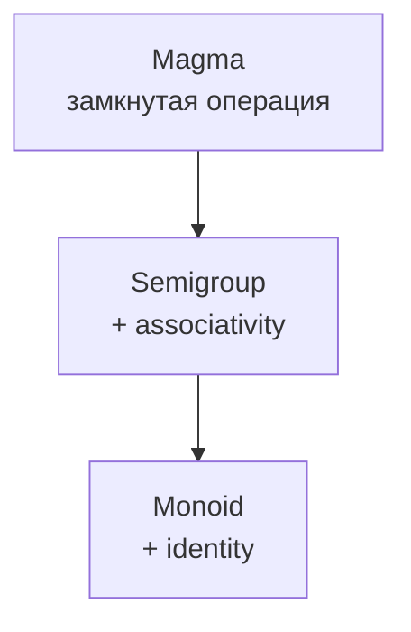
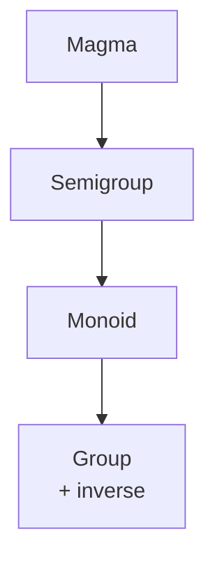

# Group

> [!info] Context
> `Group` в functional programming удобно понимать как следующий шаг после `[[18.magma,semigroup,monoid]]`: у нас уже есть ассоциативная операция и нейтральный элемент, а теперь добавляется возможность "отменить" вклад любого элемента через `inverse`.
>
> Это важно потому, что `Group` формализует идею обратимости: если действие можно применить и потом корректно отменить, значит с ним проще строить `undo`, рассуждать о симметриях и описывать reversible transformations.

## Main Content

### Overview

Если в предыдущей заметке мы шли по лестнице



то теперь добавляется ещё одна ступень:



Интуитивно:

1. `Magma` говорит: два значения можно объединить в одно значение того же типа.
2. `Semigroup` говорит: скобки можно переставлять без изменения результата.
3. `Monoid` говорит: есть нейтральное значение `empty`.
4. `Group` говорит: у каждого значения есть корректный обратный элемент.

Например, числа со сложением образуют `Group`, потому что:

- операция: `x + y`
- нейтральный элемент: `0`
- обратный элемент для `x`: `-x`

```ts
1 + 2 + (-3) === 0;
5 + (-5) === 0;
```

> [!important] Главное различие
> `Group` это не просто "что-то можно как-то откатить". Нужно, чтобы операция была ассоциативной, существовал `empty`, и для **каждого** элемента был корректный inverse относительно этой же операции.

Коротко: `Group` это `Monoid`, где у каждого значения есть способ вернуться к `empty`.

### 1. Интуиция: что такое inverse

У `Monoid` уже есть:

```ts
interface Monoid<A> {
  concat: (x: A, y: A) => A;
  empty: A;
}
```

Но одного `empty` недостаточно, чтобы "отменять" конкретные значения.

Если взять числа со сложением:

```ts
10 + 5 === 15;
15 + (-5) === 10;
```

Здесь `-5` является inverse для `5`.

Если взять строки с конкатенацией:

```ts
"hello" + " world" === "hello world";
```

то для строки `" world"` не существует такой строки `x`, чтобы:

```ts
" world" + x === "";
```

Именно поэтому строки с `concat` могут быть `Monoid`, но не `Group`.

> [!tip] Полезная ментальная модель
> `inverse(a)` не "ломает" значение `a`, а добавляет такой элемент, который при объединении с `a` даёт `empty`.

Коротко: inverse всегда определяется относительно конкретной операции, а не "вообще для типа".

### 2. Формальное определение

`Group` можно определить как `Monoid`, в котором для каждого элемента существует обратный элемент.

```ts
interface Group<A> {
  concat: (x: A, y: A) => A;
  empty: A;
  inverse: (value: A) => A;
}
```

Так как `Group` уже включает в себя поведение `Monoid`, более точная запись такая:

```ts
interface Monoid<A> {
  concat: (x: A, y: A) => A;
  empty: A;
}

interface Group<A> extends Monoid<A> {
  inverse: (value: A) => A;
}
```

#### Laws для Group

Для любого `a: A` должны выполняться:

```text
concat(a, inverse(a)) === empty
concat(inverse(a), a) === empty
```

И, конечно, сохраняются законы `Monoid`:

```text
concat(a, empty) === a
concat(empty, a) === a
concat(a, concat(b, c)) === concat(concat(a, b), c)
```

> [!warning] Частая ошибка
> Если есть операция "отмены", но сама операция неассоциативна или не имеет identity, это ещё не `Group`.

> [!important] `Group` не обязан быть `commutative`
> По определению для `Group` не требуется, чтобы `concat(a, b) === concat(b, a)`. Если это свойство тоже выполняется, такую группу называют `abelian group`.

Коротко: `Group` наследует все законы `Monoid` и добавляет двусторонний inverse.

### 3. Почему `Group` не равен просто "есть undo"

Фраза "у нас есть undo" звучит похоже на `Group`, но это не одно и то же.

Чтобы структура была `Group`, нужны строгие условия:

1. `concat` должен объединять **два значения одного типа** в значение того же типа
2. операция должна быть ассоциативной
3. должен существовать `empty`
4. для **каждого** элемента нужен inverse
5. inverse должен работать и слева, и справа

Рассмотрим систему команд:

```ts
type Command =
  | { type: "InsertText"; value: string }
  | { type: "DeleteLast"; count: number };
```

Можно ли сказать, что это уже `Group`, потому что "каждую команду можно отменить"? Нет, не сразу.

Проблемы:

- не очевидно, что команды образуют замкнутую бинарную операцию `Command x Command -> Command`
- не очевидно, что композиция ассоциативна
- inverse может зависеть от внешнего состояния, а не только от самого значения

Например, чтобы отменить `DeleteLast`, нужно знать, **что именно было удалено**. Значит inverse не выводится только из самого элемента.

> [!important] Важный критерий
> В `Group` inverse определяется на уровне самой структуры данных: `inverse(a)` зависит от `a`, а не от скрытого контекста, истории и внешнего состояния.

Коротко: любое `undo`-поведение ещё не делает модель группой. Нужны algebraic laws, а не только интуиция "можно откатить".

### 4. Примеры Group

#### Числа со сложением

Это классический пример `Group<number>`.

```ts
interface Group<A> {
  concat: (x: A, y: A) => A;
  empty: A;
  inverse: (value: A) => A;
}

const sumGroup: Group<number> = {
  concat: (x, y) => x + y,
  empty: 0,
  inverse: (value) => -value,
};

sumGroup.concat(10, 5); // 15
sumGroup.concat(5, sumGroup.inverse(5)); // 0
sumGroup.concat(sumGroup.inverse(5), 5); // 0
```

Проверка законов:

```ts
const a = 7;

sumGroup.concat(a, sumGroup.empty) === a;
sumGroup.concat(sumGroup.empty, a) === a;
sumGroup.concat(a, sumGroup.inverse(a)) === sumGroup.empty;
sumGroup.concat(sumGroup.inverse(a), a) === sumGroup.empty;
```

#### `bigint` со сложением

```ts
const bigintSumGroup: Group<bigint> = {
  concat: (x, y) => x + y,
  empty: 0n,
  inverse: (value) => -value,
};

bigintSumGroup.concat(10n, -10n) === 0n;
```

#### `boolean` с XOR

Это менее очевидный, но очень полезный пример.

```ts
const xor = (x: boolean, y: boolean): boolean => x !== y;

const xorGroup: Group<boolean> = {
  concat: xor,
  empty: false,
  inverse: (value) => value,
};

xorGroup.concat(true, true) === false;
xorGroup.concat(false, false) === false;
xorGroup.concat(true, xorGroup.inverse(true)) === false;
```

Почему `inverse(value) === value`?

Потому что для XOR каждый элемент является обратным самому себе:

```ts
true !== true; // false
false !== false; // false
```

> [!tip] Наблюдение
> Inverse не обязан быть "отрицанием" в бытовом смысле. Он просто должен нейтрализовать элемент относительно выбранной операции.

Коротко: хорошие примеры `Group` появляются там, где есть не только объединение, но и корректная обратимость.

### 5. Контрпримеры

#### Строки с конкатенацией

```ts
interface Monoid<A> {
  concat: (x: A, y: A) => A;
  empty: A;
}

const stringMonoid: Monoid<string> = {
  concat: (x, y) => x + y,
  empty: "",
};
```

Это `Monoid`, потому что:

- операция ассоциативна
- есть identity `""`

Но это не `Group`, потому что для произвольной строки нет строки-обратной, которая вернёт нас к `""`.

```ts
"abc" + "???" === ""; // невозможно
```

#### Массивы с конкатенацией

```ts
const arrayMonoid: Monoid<readonly number[]> = {
  concat: (x, y) => [...x, ...y],
  empty: [],
};
```

Это тоже `Monoid`, но не `Group`.

Почему? После конкатенации нельзя подобрать такой массив `inverse([1, 2])`, чтобы:

```ts
const result = [1, 2].concat(inverse);
// не существует такого inverse, чтобы result содержательно стал []
```

Здесь важно не сравнение ссылок, а сама algebraic idea: операция `concat` только наращивает массив, но не даёт обратного элемента, который нейтрализовал бы уже добавленные элементы и вернул нас к `empty`.

#### Числа с вычитанием

Это важный контрпример: кажется, что раз есть "минус", то должна быть и обратимость. Но проблема раньше.

```ts
const subtract = (x: number, y: number): number => x - y;

subtract(10, subtract(5, 1)); // 6
subtract(subtract(10, 5), 1); // 4
```

Операция неассоциативна. Значит это даже не `Semigroup`, а следовательно не `Monoid` и не `Group`.

> [!warning] Типичная ловушка
> Наличие inverse не спасает, если базовая операция не удовлетворяет законам более простых структур.

Коротко: не каждый familiar API с "минусом", "remove" или "undo" образует `Group`.

### 6. Demo: reversible transformations

Один из самых полезных способов почувствовать `Group` на практике это представить действия как накопленные изменения.

Например, смещение координаты:

```ts
type Position = {
  readonly x: number;
};

type Delta = number;

interface Group<A> {
  concat: (x: A, y: A) => A;
  empty: A;
  inverse: (value: A) => A;
}

const deltaGroup: Group<Delta> = {
  concat: (x, y) => x + y,
  empty: 0,
  inverse: (value) => -value,
};

const applyDelta = (position: Position, delta: Delta): Position => ({
  x: position.x + delta,
});

const start: Position = { x: 10 };
const moveRight = 7;
const undoMoveRight = deltaGroup.inverse(moveRight);

const afterMove = applyDelta(start, moveRight); // { x: 17 }
const backToStart = applyDelta(afterMove, undoMoveRight); // { x: 10 }
```

Можно накапливать несколько изменений:

```ts
const totalDelta = deltaGroup.concat(5, deltaGroup.concat(-2, 8)); // 11
const undone = deltaGroup.inverse(totalDelta); // -11

applyDelta(start, totalDelta); // { x: 21 }
applyDelta(applyDelta(start, totalDelta), undone); // { x: 10 }
```

Схема идеи:

```mermaid
flowchart LR
  A["start"] -->|apply delta| B["new state"]
  B -->|apply inverse(delta)| C["start again"]
```

Здесь особенно хорошо видно, почему `Group` связан с symmetry:

- действие переводит систему в новое состояние
- inverse возвращает её обратно
- структура описывает допустимые reversible transformations

Это перекликается с идеями из [[17.category-theory]]: нас интересуют не только объекты, но и допустимые преобразования между состояниями.

Коротко: `Group` полезен, когда изменения можно безопасно комбинировать и так же безопасно отменять.

### 7. Практический смысл для functional programming

В FP algebraic structures ценны не из-за "математичности ради математики", а потому что они позволяют:

1. проектировать API через laws
2. безопасно переиспользовать generic algorithms
3. отделять свойства операции от конкретного бизнес-домена

Если у тебя есть `Group<A>`, ты заранее знаешь:

- как комбинировать значения
- какое значение нейтрально
- как отменять вклад элемента

Это может пригодиться для:

- `undo/redo`
- diff/apply/revert моделей
- работы с transformations
- описания симметрий и перестановок

> [!important] Сильная сторона algebraic thinking
> Как только ты распознал `Group`, ты начинаешь думать не в терминах отдельных функций, а в терминах законов и гарантированных свойств всей операции.

Коротко: `Group` полезен не сам по себе, а как способ заранее знать, какие преобразования допустимы и обратимы.

### 8. Вопросы для самопроверки

1. Почему `string` с операцией конкатенации это `Monoid`, но не `Group`?
2. Почему `number` с вычитанием не образует `Group`, хотя там есть "минус"?
3. В чём разница между "у нас есть undo" и "у нас есть `Group`"?
4. Обязана ли любая `Group` быть `commutative`? Если нет, как называется частный случай, где `commutative` всё-таки выполняется?

### Краткое резюме

- `Group` = `Monoid` + `inverse`
- кроме `inverse`, должны сохраняться `associativity` и `identity`
- inverse определяется относительно конкретной операции
- не всякая обратимость в бизнес-логике означает `Group`
- хорошие примеры: числа со сложением, `bigint` со сложением, `boolean` с XOR
- плохие примеры: строки и массивы с конкатенацией, числа с вычитанием

## Exercises

### Exercise 1: Проверка нейтральной пары

**Difficulty:** beginner

**Task:** реализуй функцию `isNeutralPair`, которая проверяет, что значение и его `inverse` действительно дают `empty` с обеих сторон.

**Requirements:**
- функция должна принимать `Group<A>`, значение `A` и функцию сравнения `equals`
- нужно проверить оба закона: `a <> inverse(a)` и `inverse(a) <> a`
- тесты должны проходить для `number`-group и `boolean`-group

**Test cases:**

```typescript
type Group<A> = {
  concat: (x: A, y: A) => A;
  empty: A;
  inverse: (value: A) => A;
};

type Eq<A> = (left: A, right: A) => boolean;

function isNeutralPair<A>(
  group: Group<A>,
  value: A,
  equals: Eq<A>,
): boolean {
  const left = group.concat(value, group.inverse(value));
  const right = group.concat(group.inverse(value), value);
  return equals(left, group.empty) && equals(right, group.empty);
}

const sumGroup: Group<number> = {
  concat: (x, y) => x + y,
  empty: 0,
  inverse: (value) => -value,
};

const xorGroup: Group<boolean> = {
  concat: (x, y) => x !== y,
  empty: false,
  inverse: (value) => value,
};

const sameNumber: Eq<number> = (left, right) => Object.is(left, right);
const sameBoolean: Eq<boolean> = (left, right) => left === right;

console.assert(isNeutralPair(sumGroup, 7, sameNumber) === true);
console.assert(isNeutralPair(sumGroup, 0, sameNumber) === true);
console.assert(isNeutralPair(xorGroup, true, sameBoolean) === true);
console.assert(isNeutralPair(xorGroup, false, sameBoolean) === true);
```

> [!tip]- Hint 1
> Сначала вычисли выражение с `value`, потом с `inverse(value)`. Для `Group` важны обе стороны.

> [!tip]- Hint 2
> Для примитивов достаточно `Object.is` или `===`, но сама функция должна оставаться общей.

> [!warning]- Solution
> ```typescript
> type Group<A> = {
>   concat: (x: A, y: A) => A;
>   empty: A;
>   inverse: (value: A) => A;
> };
>
> type Eq<A> = (left: A, right: A) => boolean;
>
> function isNeutralPair<A>(
>   group: Group<A>,
>   value: A,
>   equals: Eq<A>,
> ): boolean {
>   const left = group.concat(value, group.inverse(value));
>   const right = group.concat(group.inverse(value), value);
>   return equals(left, group.empty) && equals(right, group.empty);
> }
> ```

### Exercise 2: Компенсация последовательности

**Difficulty:** beginner

**Task:** реализуй функцию `cancelsWithInverse`, которая проверяет, что последовательность значений вместе со своей обратной последовательностью действительно сводится к `empty`.

**Requirements:**
- функция должна работать для любого `Group<A>`
- для построения обратной последовательности нужно идти справа налево и применять `inverse`
- результат должен сравниваться с `group.empty`
- тесты должны проходить для `number`-group и `boolean`-group

**Test cases:**

```typescript
type Group<A> = {
  concat: (x: A, y: A) => A;
  empty: A;
  inverse: (value: A) => A;
};

type Eq<A> = (left: A, right: A) => boolean;

function foldGroup<A>(group: Group<A>, values: readonly A[]): A {
  let acc = group.empty;
  for (const value of values) {
    acc = group.concat(acc, value);
  }
  return acc;
}

function cancelsWithInverse<A>(
  group: Group<A>,
  values: readonly A[],
  equals: Eq<A>,
): boolean {
  const inverted: A[] = [];

  for (let index = values.length - 1; index >= 0; index -= 1) {
    inverted.push(group.inverse(values[index]));
  }

  return equals(foldGroup(group, [...values, ...inverted]), group.empty);
}

const sumGroup: Group<number> = {
  concat: (x, y) => x + y,
  empty: 0,
  inverse: (value) => -value,
};

const xorGroup: Group<boolean> = {
  concat: (x, y) => x !== y,
  empty: false,
  inverse: (value) => value,
};

const sameNumber: Eq<number> = (left, right) => Object.is(left, right);
const sameBoolean: Eq<boolean> = (left, right) => left === right;

console.assert(cancelsWithInverse(sumGroup, [], sameNumber) === true);
console.assert(cancelsWithInverse(sumGroup, [5, -2, 8], sameNumber) === true);
console.assert(cancelsWithInverse(sumGroup, [0, 0, 0], sameNumber) === true);
console.assert(cancelsWithInverse(xorGroup, [], sameBoolean) === true);
console.assert(cancelsWithInverse(xorGroup, [true, false, true], sameBoolean) === true);
```

> [!tip]- Hint 1
> Сначала построй inverse-цепочку: иди с конца массива к началу и применяй `group.inverse` к каждому элементу.

> [!tip]- Hint 2
> Потом склей исходную и обратную последовательности и проверь, что свёртка приводит к `group.empty`.

> [!warning]- Solution
> ```typescript
> type Group<A> = {
>   concat: (x: A, y: A) => A;
>   empty: A;
>   inverse: (value: A) => A;
> };
>
> type Eq<A> = (left: A, right: A) => boolean;
>
> function foldGroup<A>(group: Group<A>, values: readonly A[]): A {
>   let acc = group.empty;
>   for (const value of values) {
>     acc = group.concat(acc, value);
>   }
>   return acc;
> }
>
> function cancelsWithInverse<A>(
>   group: Group<A>,
>   values: readonly A[],
>   equals: Eq<A>,
> ): boolean {
>   const inverted: A[] = [];
>
>   for (let index = values.length - 1; index >= 0; index -= 1) {
>     inverted.push(group.inverse(values[index]));
>   }
>
>   return equals(foldGroup(group, [...values, ...inverted]), group.empty);
> }
> ```

### Exercise 3: Инверсия последовательности

**Difficulty:** intermediate

**Task:** реализуй функцию `invertSequence`, которая строит обратную последовательность: идёт справа налево и заменяет каждый элемент на его `inverse`.

**Requirements:**
- результат должен быть в обратном порядке
- для каждого элемента нужно применить `group.inverse`
- для `number`-group проверяй, что исходная последовательность и её инверсия дают `empty`

**Test cases:**

```typescript
type Group<A> = {
  concat: (x: A, y: A) => A;
  empty: A;
  inverse: (value: A) => A;
};

function foldGroup<A>(group: Group<A>, values: readonly A[]): A {
  let acc = group.empty;
  for (const value of values) {
    acc = group.concat(acc, value);
  }
  return acc;
}

function invertSequence<A>(group: Group<A>, values: readonly A[]): A[] {
  const result: A[] = [];
  for (let index = values.length - 1; index >= 0; index -= 1) {
    result.push(group.inverse(values[index]));
  }
  return result;
}

const sumGroup: Group<number> = {
  concat: (x, y) => x + y,
  empty: 0,
  inverse: (value) => -value,
};

const xorGroup: Group<boolean> = {
  concat: (x, y) => x !== y,
  empty: false,
  inverse: (value) => value,
};

const numbers = [5, -2, 8];
const invertedNumbers = invertSequence(sumGroup, numbers);
console.assert(JSON.stringify(invertedNumbers) === JSON.stringify([-8, 2, -5]));
console.assert(foldGroup(sumGroup, [...numbers, ...invertedNumbers]) === 0);

const toggles = [true, false, true];
const invertedToggles = invertSequence(xorGroup, toggles);
console.assert(JSON.stringify(invertedToggles) === JSON.stringify([true, false, true]));
console.assert(foldGroup(xorGroup, [...toggles, ...invertedToggles]) === false);
```

> [!tip]- Hint 1
> В inverse-цепочке порядок важен: сначала отменяешь последнее действие, потом предпоследнее.

> [!tip]- Hint 2
> Если просто сделать `map`, ты потеряешь ключевую часть идеи `Group` - обратный порядок композиции.

> [!warning]- Solution
> ```typescript
> type Group<A> = {
>   concat: (x: A, y: A) => A;
>   empty: A;
>   inverse: (value: A) => A;
> };
>
> function invertSequence<A>(group: Group<A>, values: readonly A[]): A[] {
>   const result: A[] = [];
>   for (let index = values.length - 1; index >= 0; index -= 1) {
>     result.push(group.inverse(values[index]));
>   }
>   return result;
> }
> ```

### Exercise 4: Сжатие отменяющих пар

**Difficulty:** intermediate

**Task:** реализуй функцию `compressCancelingPairs`, которая удаляет соседние элементы, если они взаимно уничтожают друг друга через `inverse`.

**Requirements:**
- проверять можно только соседние элементы
- функция должна работать с любым `Group<A>`
- тесты должны покрывать случай, когда ничего не сокращается, и случай, когда вся последовательность схлопывается

**Test cases:**

```typescript
type Group<A> = {
  concat: (x: A, y: A) => A;
  empty: A;
  inverse: (value: A) => A;
};

type Eq<A> = (left: A, right: A) => boolean;

function compressCancelingPairs<A>(
  group: Group<A>,
  values: readonly A[],
  equals: Eq<A>,
): A[] {
  const result: A[] = [];

  for (const value of values) {
    const last = result[result.length - 1];
    if (last !== undefined && equals(value, group.inverse(last))) {
      result.pop();
      continue;
    }

    result.push(value);
  }

  return result;
}

const sumGroup: Group<number> = {
  concat: (x, y) => x + y,
  empty: 0,
  inverse: (value) => -value,
};

const xorGroup: Group<boolean> = {
  concat: (x, y) => x !== y,
  empty: false,
  inverse: (value) => value,
};

const sameNumber: Eq<number> = (left, right) => Object.is(left, right);
const sameBoolean: Eq<boolean> = (left, right) => left === right;

console.assert(
  JSON.stringify(compressCancelingPairs(sumGroup, [5, -5, 3, 2, -2], sameNumber)) ===
    JSON.stringify([3]),
);
console.assert(
  JSON.stringify(compressCancelingPairs(sumGroup, [1, 2, 3], sameNumber)) ===
    JSON.stringify([1, 2, 3]),
);
console.assert(
  JSON.stringify(compressCancelingPairs(xorGroup, [true, true, false], sameBoolean)) ===
    JSON.stringify([false]),
);
console.assert(
  JSON.stringify(compressCancelingPairs(xorGroup, [false, false], sameBoolean)) ===
    JSON.stringify([]),
);
```

> [!tip]- Hint 1
> Используй стек: последний добавленный элемент проще всего проверить на cancellation через `inverse`.

> [!tip]- Hint 2
> Для `Group` не нужно искать inverse у всей последовательности - достаточно знать, какой элемент отменяет последний.

> [!warning]- Solution
> ```typescript
> type Group<A> = {
>   concat: (x: A, y: A) => A;
>   empty: A;
>   inverse: (value: A) => A;
> };
>
> type Eq<A> = (left: A, right: A) => boolean;
>
> function compressCancelingPairs<A>(
>   group: Group<A>,
>   values: readonly A[],
>   equals: Eq<A>,
> ): A[] {
>   const result: A[] = [];
>
>   for (const value of values) {
>     const last = result[result.length - 1];
>     if (last !== undefined && equals(value, group.inverse(last))) {
>       result.pop();
>       continue;
>     }
>
>     result.push(value);
>   }
>
>   return result;
> }
> ```

### Exercise 5: Reversible counter

**Difficulty:** advanced

**Task:** реализуй `createReversibleCounter`, который хранит текущее значение, позволяет применять `delta` и отменять последнее изменение через `undo`.

**Requirements:**
- `apply(delta)` должен изменять текущее значение и добавлять `delta` в историю
- `undo()` должен отменять последнее изменение, если история не пуста
- если история пуста, `undo()` ничего не делает
- реализация должна использовать `Group<number>`

**Test cases:**

```typescript
type Group<A> = {
  concat: (x: A, y: A) => A;
  empty: A;
  inverse: (value: A) => A;
};

function createReversibleCounter(group: Group<number>, initial = 0) {
  let value = initial;
  const history: number[] = [];

  return {
    apply(delta: number) {
      value = group.concat(value, delta);
      history.push(delta);
      return value;
    },
    undo() {
      if (history.length === 0) {
        return value;
      }

      const delta = history.pop()!;
      value = group.concat(value, group.inverse(delta));
      return value;
    },
    current() {
      return value;
    },
    history() {
      return [...history];
    },
  };
}

const sumGroup: Group<number> = {
  concat: (x, y) => x + y,
  empty: 0,
  inverse: (value) => -value,
};

const counter = createReversibleCounter(sumGroup, 10);

console.assert(counter.current() === 10);
console.assert(counter.apply(5) === 15);
console.assert(counter.apply(-2) === 13);
console.assert(JSON.stringify(counter.history()) === JSON.stringify([5, -2]));
console.assert(counter.undo() === 15);
console.assert(counter.undo() === 10);
console.assert(counter.undo() === 10);
console.assert(JSON.stringify(counter.history()) === JSON.stringify([]));
```

> [!tip]- Hint 1
> Сначала сделай простую версию с `value` и `history`, а потом добавь `undo` через `inverse`.

> [!tip]- Hint 2
> Если `undo()` вызывает `concat(value, inverse(delta))`, значит ты используешь закон группы, а не просто "магическое" вычитание.

> [!warning]- Solution
> ```typescript
> type Group<A> = {
>   concat: (x: A, y: A) => A;
>   empty: A;
>   inverse: (value: A) => A;
> };
>
> function createReversibleCounter(group: Group<number>, initial = 0) {
>   let value = initial;
>   const history: number[] = [];
>
>   return {
>     apply(delta: number) {
>       value = group.concat(value, delta);
>       history.push(delta);
>       return value;
>     },
>     undo() {
>       if (history.length === 0) {
>         return value;
>       }
>
>       const delta = history.pop()!;
>       value = group.concat(value, group.inverse(delta));
>       return value;
>     },
>     current() {
>       return value;
>     },
>     history() {
>       return [...history];
>     },
>   };
> }
> ```

## Anki Cards

> [!tip] Flashcards
> Q: Что такое `Group` в functional programming?
> A: Это `Monoid`, в котором для каждого элемента существует обратный элемент `inverse`, нейтрализующий его относительно той же операции.

> [!tip] Flashcards
> Q: Какие законы обязан удовлетворять `Group`?
> A: Законы `associativity` и `identity` из `Monoid`, а также два закона обратимости: `concat(a, inverse(a)) === empty` и `concat(inverse(a), a) === empty`.

> [!tip] Flashcards
> Q: Почему `Group` нельзя сводить к фразе "у нас есть undo"?
> A: Потому что кроме идеи отмены нужны строгие algebraic laws: замкнутая операция, associativity, identity и inverse для каждого элемента без скрытого внешнего контекста.

> [!tip] Flashcards
> Q: Почему `number` со сложением образует `Group`?
> A: Потому что сложение ассоциативно, `0` является identity, а для каждого числа `x` существует inverse `-x`.

> [!tip] Flashcards
> Q: Почему `boolean` с XOR образует `Group`?
> A: Потому что XOR ассоциативен, `false` является identity, а каждый элемент обратен самому себе.

> [!tip] Flashcards
> Q: Почему `string` с конкатенацией это `Monoid`, но не `Group`?
> A: У строк есть ассоциативная операция и identity `""`, но для произвольной строки нет inverse, который возвращал бы к `""`.

> [!tip] Flashcards
> Q: Почему `number` с вычитанием не образует `Group`?
> A: Потому что вычитание неассоциативно, значит структура не дотягивает даже до `Semigroup`.

> [!tip] Flashcards
> Q: Что означает, что inverse определяется относительно операции?
> A: Один и тот же тип может быть `Group` или не быть им в зависимости от выбранной операции; inverse существует не "для типа вообще", а для пары "тип + операция".

> [!tip] Flashcards
> Q: Зачем в `Group` проверять обратимость и слева, и справа?
> A: Потому что корректный inverse должен нейтрализовать элемент в обоих направлениях: `a <> inverse(a)` и `inverse(a) <> a`.

> [!tip] Flashcards
> Q: Какой практический смысл `Group` в программировании?
> A: Он помогает моделировать reversible transformations, `undo/redo`, diff/apply/revert и другие сценарии, где изменения можно безопасно комбинировать и отменять.

## Related Topics

- [[18.magma,semigroup,monoid]]
- [[17.category-theory]]
- [[11.Either]]
- [[type-as-set]]

## Sources

- [YouTube: Functional Programming - 20: Group](https://www.youtube.com/watch?v=6atlKUsn0mU)
- [YouTube: Functional Programming - 21: Group demo](https://www.youtube.com/watch?v=KSBx5PkP3ao)
- [Encyclopaedia Britannica: group](https://www.britannica.com/science/group-mathematics)
- [fp-ts core](https://fp-ts.github.io/core/)
- [fp-ts: Semigroup](https://fp-ts.github.io/core/modules/typeclass/Semigroup.ts.html)
- [fp-ts: Boolean](https://fp-ts.github.io/core/modules/Boolean.ts.html)
- [fp-ts: Bigint](https://fp-ts.github.io/core/modules/Bigint.ts.html)
