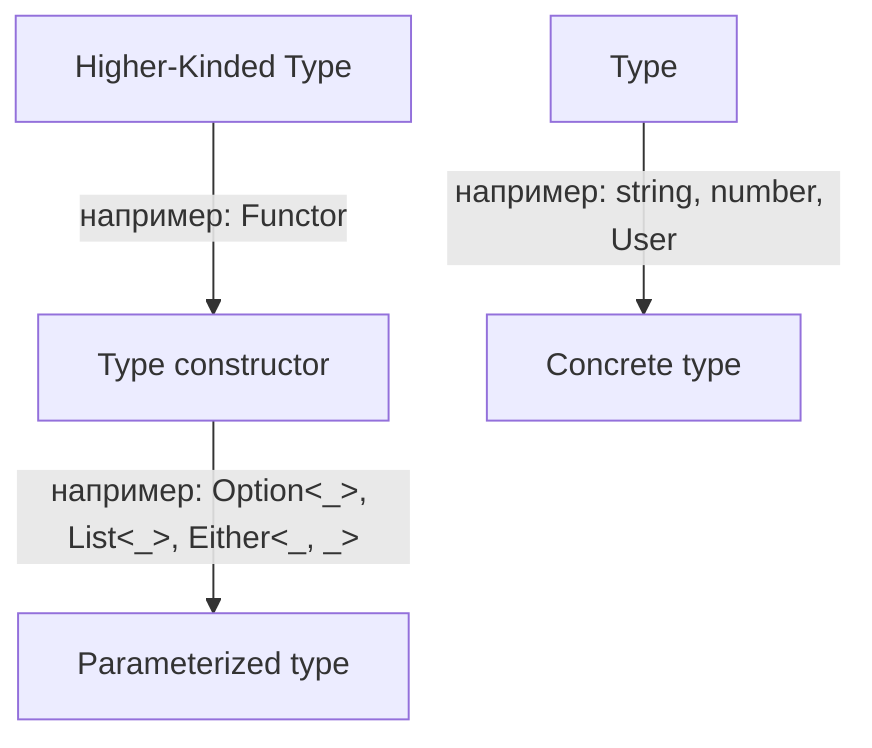

# Kind, Higher-Kinded Type

> [!info] Context
> `Kind` показывает, как классифицировать `type` и `type constructor`. `HKT` нужен, когда хочется писать общие абстракции вроде `Functor` для разных контейнеров: `Option`, `Either`, `List`.

## Overview

`type` в TypeScript часто означает конкретный тип: `string`, `number`, `User`.

`type constructor` принимает один или несколько параметров и возвращает новый тип:

```ts
type Option<A> = Some<A> | None
type Either<E, A> = Left<E> | Right<A>
type List<A> = Cons<A> | Nil
```

`Kind` описывает, сколько параметров нужно типу-конструктору:

- `string` имеет kind `*`
- `Option` имеет kind `* -> *`
- `Either` имеет kind `* -> * -> *`

В `Either<E, A>` правой ассоциативности соответствует запись `* -> (* -> *)`.



**Краткий вывод:** `kind` показывает форму типа, а не его значение.

## Deep Dive

`Functor` требует одну общую операцию:

```ts
map: (A -> B) -> F<A> -> F<B>
```

Чтобы написать такую сигнатуру один раз для `Option`, `Either` и `List`, нужен параметр `F`, который сам является `type constructor`. Это и есть `HKT`.

В Haskell и похожих языках это выражается напрямую. В TypeScript обычный generic работает только со значениями вроде `A`, но не с параметром вида `F<_>`. Поэтому библиотека `fp-ts` использует дополнительные кодировки, чтобы описывать `Functor`, `Applicative` и другие type class.

Пример связи:

- `Option<A>` можно сделать `Functor`, потому что у него есть `map`
- `Either<E, A>` тоже можно сделать `Functor`, если мапить только `Right`
- `List<A>` тоже подходит, потому что `map` сохраняет структуру списка

Right associativity важна, когда мы читаем типы как цепочки применения:

```ts
type F = * -> * -> *
// то же самое, что
type F = * -> (* -> *)
```

Это объясняет, почему `Either` принимает два параметра, но по смыслу остаётся одним type constructor.

**Краткий вывод:** `HKT` нужен для общих абстракций над контейнерами, а ограничение TypeScript в том, что такой уровень параметризации он выражает плохо.

## Related Topics

- [[17.category-theory]]
- [[22.functor]]
- [[11.Either]]
- [[13.linked-list]]
- [[fp-ts-phase-1-2]]

**Краткий вывод:** эта заметка связывает базовую теорию с практикой `Functor` и `fp-ts`.

## Sources

- [Functional Programming - 25: Kind, Higher-Kinded Type](https://www.youtube.com/watch?v=iYWAsyuquK4)
- [fp-ts Introduction](https://gcanti.github.io/fp-ts/)
- [fp-ts HKT.ts](https://gcanti.github.io/fp-ts/modules/HKT.ts.html)
- [TypeScript Handbook: Generics](https://www.typescriptlang.org/docs/handbook/2/generics.html)
- [Haskell Data.Kind](https://hackage.haskell.org/package/kinds/docs/Data-Kind.html)
- [GHC User’s Guide](https://downloads.haskell.org/ghc/latest/docs/users_guide.pdf)

**Краткий вывод:** источники идут от видео к практической кодировке в `fp-ts` и к формальному объяснению `kind`.
