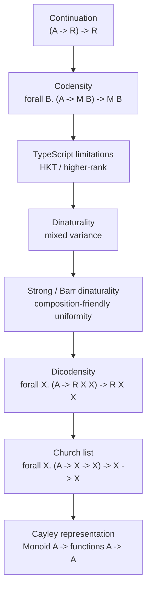

# Chapter: Strong Dinaturality и обобщённые Codensity-монады

> [!info] Context
> Эта глава связывает знакомые идеи из TypeScript FP — `Continuation`, `Codensity`, `Functor`, `Bifunctor`, `Monad`, `HKT`, variance и Church encoding — со статьёй Maciej Piróg и Filip Sieczkowski "Strong Dinatural Transformations and Generalised Codensity Monads". Цель не в том, чтобы доказать все теоремы статьи, а в том, чтобы понять, какую программную форму обобщает `dicodensity monad` и почему для этого нужна `strong dinaturality`.

## Main Content

### Где находится тема

Если читать статью сразу, легко потеряться в словах `dinatural transformation`, `mixed-variant bifunctor`, `Barr dinaturality`, `pointwise codensity monad`, `homomorphism objects`. Для учебного входа полезнее начать с более знакомой формы:

```typescript
type Continuation<R, A> = (resume: (value: A) => R) => R;
```

Эта форма говорит: "у меня пока нет готового `A`; дай мне продолжение `(A) => R`, и я построю итоговый `R`". Из неё вырастают:

- `Continuation monad`: фиксируем ответ `R`;
- `Codensity`: вместо фиксированного ответа используем монадический результат;
- `Dicodensity`: вместо обычного функтора используем `mixed-variant bifunctor`, где один и тот же тип может встречаться в положительной и отрицательной позиции.

Карта главы:



> [!important]
> TypeScript не поддерживает настоящие `higher-kinded types` и полноценные `higher-rank polymorphic types` так, как System F или Haskell. В этой главе TypeScript-код используется как учебная модель. Когда тип нельзя выразить честно, это будет помечено явно.

**Краткий вывод:** статья обобщает familiar continuation-like type, но делает это в мире, где параметр типа может стоять и "на входе", и "на выходе". Это требует более сильного понятия равномерности, чем обычная naturality.

### 1. Continuation monad: вычисление, которому нужно продолжение

Обычное значение типа `A` можно передать дальше напрямую:

```typescript
const value = 42;
const result = String(value);
```

`Continuation<R, A>` хранит не само `A`, а способ продолжить вычисление, если кто-то даст функцию `A -> R`.

```typescript
type Cont<R, A> = (resume: (value: A) => R) => R;

const ofCont =
  <R, A>(value: A): Cont<R, A> =>
  (resume) =>
    resume(value);

const mapCont =
  <R, A, B>(fa: Cont<R, A>, f: (value: A) => B): Cont<R, B> =>
  (resume) =>
    fa((value) => resume(f(value)));

const chainCont =
  <R, A, B>(fa: Cont<R, A>, f: (value: A) => Cont<R, B>): Cont<R, B> =>
  (resume) =>
    fa((value) => f(value)(resume));
```

`chainCont` показывает главное: продолжение можно не выполнять сразу, а передавать через цепочку. Это делает `Continuation` удобной моделью для CPS, раннего выхода, backtracking и управления порядком выполнения.

```typescript
const program: Cont<string, number> = chainCont(
  ofCont<string, number>(20),
  (n) => ofCont<string, number>(n + 22),
);

const rendered = program((n) => `answer = ${n}`);
// "answer = 42"
```

Если читать тип `(A -> R) -> R` как "дай мне потребителя `A`, и я дам итоговый ответ `R`", то `Continuation` уже похож на отложенный pipeline.

**Краткий вывод:** `Continuation` фиксирует итоговый тип ответа `R` и строит вокруг него монаду. Это первая точка входа к `Codensity`.

### 2. Codensity как generalized continuation

У `Continuation` ответ фиксирован:

```typescript
type Cont<R, A> = (resume: (value: A) => R) => R;
```

`Codensity` заменяет простой ответ `R` на результат внутри некоторой монады `M`:

```text
Codensity<M, A> ~= forall B. (A -> M<B>) -> M<B>
```

Интуиция: значение `A` будет передано не в обычное продолжение, а в продолжение, которое возвращает монадическое вычисление. Тогда длинная цепочка `chain` может быть представлена как одна накопленная функция.

В TypeScript нельзя написать полностью общий `M<_>` без HKT-кодировки, поэтому сначала посмотрим на конкретный случай для `Promise`:

```typescript
type CodensityPromise<A> = <B>(
  resume: (value: A) => Promise<B>,
) => Promise<B>;

const ofCodensityPromise =
  <A>(value: A): CodensityPromise<A> =>
  (resume) =>
    resume(value);

const chainCodensityPromise =
  <A, B>(
    fa: CodensityPromise<A>,
    f: (value: A) => CodensityPromise<B>,
  ): CodensityPromise<B> =>
  (resume) =>
    fa((value) => f(value)(resume));

const lowerPromise = <A>(fa: CodensityPromise<A>): Promise<A> =>
  fa((value) => Promise.resolve(value));
```

Здесь `CodensityPromise<A>` очень похож на `Cont<Promise<B>, A>`, но с важной разницей: `B` выбирает вызывающая сторона. Это и есть след `forall B`.

```typescript
const delayed = chainCodensityPromise(
  ofCodensityPromise(10),
  (n) => ofCodensityPromise(n * 2),
);

const finalPromise = lowerPromise(delayed);
```

В функциональном программировании `Codensity` часто появляется не ради `Promise`, а ради оптимизации монадических вычислений. Если обычный `chain` строит левостороннюю цепочку и каждый шаг дорого переассоциирует структуру, `Codensity` может накопить вычисление в continuation-like форме и затем "свернуть" его дешевле. Эта мотивация близка к теме [[reflection-without-remorse]]: ассоциативные операции могут быть одинаковыми по смыслу, но разными по стоимости.

Связь со статьёй: Piróg и Sieczkowski напоминают, что `codensity monad` можно читать как обобщение continuation monad. Категориально `Codensity` для функтора `G` — это `right Kan extension` `Ran_G G`. В `Set` её pointwise-форма читается как семейство преобразований, натуральных по `X`:

```text
(A -> G<X>) -> G<X>
```

В программной записи привычнее видеть изоморфную continuation-like форму:

```text
forall B. (A -> M<B>) -> M<B>
```

> [!tip]
> Для учебного чтения можно держать в голове одну фразу: `Codensity` превращает цепочку `chain` в цепочку continuation callbacks. Это не вся category-theoretic история, но хорошая программная интуиция.

**Краткий вывод:** `Codensity` сохраняет форму continuation, но обобщает ответ до монадического контекста. Поэтому она одновременно связана и с CPS, и с оптимизацией монад.

### 3. Где TypeScript упирается в границы

Формула `Codensity<M, A> ~= forall B. (A -> M<B>) -> M<B>` требует двух возможностей:

- параметризоваться по `M`, где `M` сам является type constructor вида `* -> *`;
- иметь `forall B` внутри типа, то есть higher-rank polymorphism.

Обычный TypeScript generic умеет параметризовать значения типами:

```typescript
type Box<A> = { readonly value: A };
```

Но он не умеет написать параметр `M`, который затем применяется как `M<A>`:

```typescript
// Псевдо-TypeScript: такая форма НЕ является валидным TypeScript.
// type Codensity<M<_>, A> = <B>(resume: (value: A) => M<B>) => M<B>;
```

Библиотеки вроде `fp-ts` обходят это через HKT-кодировку: `URI`, `Kind`, `URItoKind`. Это полезный практический компромисс, но он не делает TypeScript языком с настоящими HKT.

С `forall` ситуация тоньше. TypeScript позволяет generic function или generic method:

```typescript
interface PolymorphicIdentity {
  <A>(value: A): A;
}
```

Но это не то же самое, что строгая parametricity из System F. Из-за structural typing, overloads, `any`, type assertions и runtime-проверок TypeScript не может гарантировать те же "free theorems", на которые опираются теоретические модели.

**Краткий вывод:** TypeScript помогает увидеть форму, но не доказывает равномерность. В этой теме это особенно важно, потому что `dinaturality` и `strong dinaturality` как раз говорят о равномерности polymorphic transformations.

### 4. Natural transformation и dinatural transformation

Обычная `natural transformation` связывает два functor:

```text
alpha<A>: F<A> -> G<A>
```

И требует, чтобы порядок "сначала преобразовать структуру" и "сначала сделать `map`" не менял результат.

```typescript
type Option<A> =
  | { readonly tag: "None" }
  | { readonly tag: "Some"; readonly value: A };

const none: Option<never> = { tag: "None" };

const some = <A>(value: A): Option<A> => ({
  tag: "Some",
  value,
});

const mapOption = <A, B>(
  fa: Option<A>,
  f: (value: A) => B,
): Option<B> =>
  fa.tag === "None" ? none : some(f(fa.value));

const optionToArray = <A>(fa: Option<A>): ReadonlyArray<A> =>
  fa.tag === "None" ? [] : [fa.value];

const leftPath = optionToArray(mapOption(some(1), String));
const rightPath = optionToArray(some(1)).map(String);
// Оба пути дают ["1"].
```

Здесь `A` стоит в covariant позиции: мы можем применять функцию `A -> B` через `map`.

`Dinatural transformation` нужна, когда один и тот же параметр встречается в mixed positions: где-то covariant, а где-то contravariant. Самый знакомый программный пример — функция:

```typescript
type Endo<X> = (value: X) => X;
```

В типе `Endo<X>` параметр `X` стоит:

- в аргументе функции: contravariant position;
- в результате функции: covariant position.

Church-encoded list делает это ещё заметнее:

```typescript
interface ChurchList<A> {
  run<X>(cons: (head: A) => (tail: X) => X, nil: X): X;
}
```

В `cons: (head: A) => (tail: X) => X` тип `X` одновременно принимается как вход `tail` и возвращается как результат. Значит, обычная naturality по `X` уже не подходит: `X` не просто "лежит внутри контейнера", он участвует в двух направлениях.

На категориальном языке статья работает с `mixed-variant bifunctor`:

```text
R : Dᵒᵖ × D -> A
```

Первая координата `Dᵒᵖ` означает contravariant поведение, вторая `D` — covariant поведение. Поэтому `R<X, Y>` можно читать как структуру, где `X` стоит "слева/на входе", а `Y` — "справа/на выходе".

**Краткий вывод:** naturality подходит для одного covariant параметра. Dinaturality появляется, когда один и тот же типовой параметр проходит через mixed variance.

### 5. Почему ordinary dinaturality недостаточно

В обычной разработке мы привыкли, что хорошие преобразования можно компоновать:

```text
F<A> -> G<A> -> H<A>
```

Для natural transformations это действительно работает: композиция natural transformations снова natural.

Для dinatural transformations в общем случае это неверно. Статья подчёркивает именно этот разрыв: ordinary dinaturality слишком слабая, потому что dinatural transformations generally do not compose.

Почему это важно для монад? Монада требует композиционной структуры:

- `of` вставляет значение в контекст;
- `chain` последовательно склеивает вычисления;
- законы монад говорят, что склейка ведёт себя стабильно.

Если базовое понятие "равномерного преобразования" не замкнуто относительно композиции, на нём трудно построить надёжную monad construction. Поэтому статья использует более сильную версию: `strong dinaturality`, также известную как `Barr dinaturality`.

> [!warning]
> Не стоит читать `dinatural` как "natural, только сложнее". Для этой главы ключевое отличие практическое: ordinary dinaturality не даёт нужной композиционности в общем случае, а strong dinaturality вводится именно чтобы получить более устойчивое поведение.

**Краткий вывод:** ordinary dinaturality выражает равномерность для mixed variance, но не даёт достаточно хорошей композиции. Для построения `dicodensity monad` нужна stronger condition.

### 6. Strong dinaturality как усиленная parametricity

`Parametricity` в духе System F говорит: polymorphic функция не должна знать конкретный тип `X`, поэтому она обязана вести себя равномерно для всех `X`. Из этой идеи появляются "free theorems": свойства, которые следуют из одного типа функции.

`Strong dinaturality` можно воспринимать как похожую, но более строгую дисциплину для mixed-variant ситуаций. Если обычная naturality спрашивает: "совместимо ли преобразование с `map`?", то strong dinaturality спрашивает: "совместимо ли оно с более богатыми способами согласованно связать разные типы в contravariant и covariant позициях?".

Для программиста это можно перевести так:

- обычный `map` двигает значение только в одну сторону;
- mixed-variant структура похожа на API, где тип участвует и как input, и как output;
- значит, проверка равномерности должна учитывать не одну стрелку `X -> Y`, а более сложное согласование между `X` и `Y`;
- такая проверка нужна, чтобы потом безопасно компоновать преобразования.

В статье эта идея формализуется через `Barr dinaturality` и используется как фундамент для определения `C_R`. В учебной главе достаточно держать фокус на назначении: strong dinaturality — это усиленная форма равномерности, пригодная для построения монады из mixed-variant bifunctor.

**Краткий вывод:** strong dinaturality связывает parametricity, mixed variance и композиционность. Это технический мост от System F типов к category-theoretic monad construction.

### 7. Dicodensity monad

Теперь можно прочитать центральную формулу:

```text
C_R<A> = forall X. (A -> R<X, X>) -> R<X, X>
```

Сравним с `Codensity`:

```text
Codensity<M, A> = forall B. (A -> M<B>) -> M<B>
```

Разница в том, что `M<B>` заменяется на `R<X, X>`, где `R` — `mixed-variant bifunctor`:

```text
R : Dᵒᵖ × D -> A
```

То есть внутри continuation-like формы стоит не просто контейнер `M<B>`, а bifunctor, которому один и тот же `X` передают в contravariant и covariant позиции.

В TypeScript это нельзя записать полностью общим и строгим способом. Можно только показать форму:

```typescript
// Псевдо-TypeScript: R<_Contravariant, _Covariant> не выражается
// как полноценный higher-kinded параметр в обычном TypeScript.
//
// type Dicodensity<R<_, _>, A> =
//   <X>(resume: (value: A) => R<X, X>) => R<X, X>;
```

Чтобы сделать форму конкретной, возьмём частный случай `R<X, Y> = (input: X) => Y`. Тогда `R<X, X>` — это endofunction:

```typescript
type Hom<X, Y> = (input: X) => Y;
type Endo<X> = Hom<X, X>;

interface DicodensityHom<A> {
  run<X>(resume: (value: A) => Endo<X>): Endo<X>;
}
```

Если раскрыть `Endo<X>`, получится:

```typescript
interface DicodensityHomExpanded<A> {
  run<X>(resume: (value: A) => (input: X) => X): (input: X) => X;
}
```

Это уже почти Church encoding списка. Разница только в группировке аргументов:

```typescript
interface ChurchList<A> {
  run<X>(cons: (head: A) => (tail: X) => X, nil: X): X;
}
```

Если `run` возвращает `Endo<X>`, то мы можем передать начальное значение `nil` позже:

```typescript
const toChurchList =
  <A>(value: DicodensityHom<A>): ChurchList<A> =>
  ({
    run: (cons, nil) => value.run(cons)(nil),
  });
```

Именно поэтому статья использует Church-encoded list как мотивирующий пример: тип списка в System F имеет форму `forall X. (A -> X -> X) -> X -> X`, где `X` встречается и положительно, и отрицательно.

**Краткий вывод:** `Dicodensity` сохраняет continuation-like форму, но разрешает ответу быть mixed-variant: `R<X, X>`. Это обобщает `Codensity` и захватывает Church encoding списка.

### 8. Три важных частных случая

Статья показывает, что `dicodensity monad` действительно обобщает знакомые конструкции. Для учебного чтения достаточно трёх случаев.

#### Constant R даёт continuation

Если `R<X, Y>` не зависит от `X` и `Y`, а всегда равен фиксированному ответу `O`, то:

```text
C_R<A> = forall X. (A -> O) -> O
```

Так как `X` больше нигде не важен, остаётся обычная continuation form:

```typescript
type Cont<R, A> = (resume: (value: A) => R) => R;
```

#### R<X, Y> = G<Y> даёт codensity

Если bifunctor игнорирует contravariant аргумент `X` и зависит только от `Y`, то mixed-variant часть исчезает:

```text
R<X, Y> = G<Y>
```

Тогда:

```text
C_R<A> = forall X. (A -> G<X>) -> G<X>
```

Это и есть pointwise codensity monad для functor `G`.

#### R<X, Y> = X -> Y даёт list/Cayley связь

Если:

```text
R<X, Y> = X -> Y
```

то:

```text
R<X, X> = X -> X
```

И формула становится:

```text
C_R<A> = forall X. (A -> X -> X) -> X -> X
```

Это Church-encoded list. Один элемент `A` превращается в функцию, которая добавляет этот элемент в аккумулятор типа `X`.

**Краткий вывод:** `dicodensity monad` не появляется из ниоткуда. Она содержит continuation, codensity и Church-encoded list как разные проекции одной формы.

### 9. Church-encoded list в TypeScript

Обычный список можно представить как algebraic data type:

```typescript
type List<A> =
  | { readonly tag: "Nil" }
  | { readonly tag: "Cons"; readonly head: A; readonly tail: List<A> };

const nil = <A>(): List<A> => ({ tag: "Nil" });

const cons = <A>(head: A, tail: List<A>): List<A> => ({
  tag: "Cons",
  head,
  tail,
});
```

Church encoding хранит список не как данные, а как способ свернуть список:

```typescript
interface ChurchList<A> {
  run<X>(cons: (head: A) => (tail: X) => X, nil: X): X;
}

const empty = <A>(): ChurchList<A> => ({
  run: (_cons, nil) => nil,
});

const prepend =
  <A>(head: A, tail: ChurchList<A>): ChurchList<A> =>
  ({
    run: (cons, nil) => cons(head)(tail.run(cons, nil)),
  });

const fromArray = <A>(items: ReadonlyArray<A>): ChurchList<A> =>
  items.reduceRight<ChurchList<A>>(
    (tail, head) => prepend(head, tail),
    empty(),
  );

const toArray = <A>(list: ChurchList<A>): ReadonlyArray<A> =>
  list.run<ReadonlyArray<A>>(
    (head) => (tail) => [head, ...tail],
    [],
  );

const numbers = fromArray([1, 2, 3]);
const materialized = toArray(numbers);
// [1, 2, 3]
```

Теперь посмотрим на variance:

```typescript
interface ChurchList<A> {
  run<X>(cons: (head: A) => (tail: X) => X, nil: X): X;
}
```

Внутри `cons`:

- `tail: X` — вход функции, то есть negative/contravariant occurrence;
- результат `=> X` — выход функции, то есть positive/covariant occurrence;
- итоговый результат `run(...): X` тоже positive occurrence.

Такая форма не является обычным `Functor<X>`, где `X` просто лежит "внутри". Она ближе к `R<X, X>` для `R<X, Y> = X -> Y`.

Добавим `map`, чтобы увидеть, что список всё ещё является `Functor` по элементам `A`:

```typescript
const mapChurch =
  <A, B>(list: ChurchList<A>, f: (value: A) => B): ChurchList<B> =>
  ({
    run: (cons, nil) => list.run((head) => cons(f(head)), nil),
  });

const strings = toArray(mapChurch(numbers, (n) => `#${n}`));
// ["#1", "#2", "#3"]
```

Важно не перепутать две разные оси:

- `A` — тип элементов списка; по нему можно делать обычный `map`;
- `X` — тип результата fold; он появляется в mixed positions и связан с dinaturality/strong dinaturality.

> [!important]
> Generic method `run<X>` в TypeScript помогает смоделировать Church encoding, но не даёт такой же гарантии parametricity, как System F. В учебных примерах мы пишем "как если бы" реализация была равномерной по `X`.

**Краткий вывод:** Church list показывает, почему статье нужен mixed-variant bifunctor. Тип `X` в fold-алгебре списка не просто covariant: он одновременно input и output.

### 10. Cayley representation: список, моноид и функции X -> X

В [[18.magma,semigroup,monoid]] моноид задаётся операцией `concat` и нейтральным элементом `empty`:

```typescript
interface Monoid<A> {
  readonly empty: A;
  concat(left: A, right: A): A;
}
```

Каждый элемент моноида можно представить как функцию "добавить этот элемент слева":

```typescript
const cayley =
  <A>(monoid: Monoid<A>, value: A): Endo<A> =>
  (next) =>
    monoid.concat(value, next);
```

Например, для строк:

```typescript
const stringMonoid: Monoid<string> = {
  empty: "",
  concat: (left, right) => left + right,
};

const hello = cayley(stringMonoid, "Hello, ");
const result = hello("world");
// "Hello, world"
```

Функции `A -> A` сами образуют моноид относительно композиции:

```typescript
const identity = <A>(value: A): A => value;

const compose =
  <A>(after: Endo<A>, before: Endo<A>): Endo<A> =>
  (value) =>
    after(before(value));

const endoMonoid = <A>(): Monoid<Endo<A>> => ({
  empty: identity,
  concat: compose,
});
```

Это и есть Cayley representation: вместо того чтобы хранить элемент напрямую, мы представляем его действием на другие элементы.

Связь со списками такая:

- list monad можно понимать как free monoid по элементам `A`;
- Church list кодирует список через fold;
- fold строит endofunction `X -> X`;
- `R<X, Y> = X -> Y` приводит `dicodensity` к Church list.

Статья расширяет эту линию: не только списки и обычные hom-functors, но и более общие `homomorphism objects`, Eilenberg-Moore algebras и monads, связанные с semirings и ordered nondeterminism. Для этой главы это advanced overview: важно увидеть направление обобщения, а не разобрать все условия теорем.

**Краткий вывод:** Cayley representation объясняет, почему функции `X -> X` естественно появляются рядом со списками и моноидами. `Dicodensity` делает эту связь частью более общей конструкции.

### 11. Как читать статью после этой главы

Теперь основные слова статьи можно связать с программной интуицией:

- `continuation monad` — базовая форма `(A -> O) -> O`;
- `codensity monad` — continuation-like форма, натуральная по промежуточному типу;
- `mixed-variant bifunctor R : Dᵒᵖ × D -> A` — структура, где типовой параметр может быть и input, и output;
- `dinatural transformation` — попытка выразить равномерность для mixed variance;
- `strong/Barr dinaturality` — усиленная форма, которая лучше ведёт себя относительно композиции;
- `dicodensity monad C_R` — обобщение `Codensity` с `G<X>` до `R<X, X>`;
- `Church encoding of list` — главный type-theoretic пример, потому что `X` встречается в `A -> X -> X` mixed-variant образом;
- `Cayley-style representation` — способ увидеть монады через представления элементами функций/стрелок.

Что можно отложить на второй проход:

- доказательства через universal properties;
- construction as a limit;
- подробности comma categories;
- Eilenberg-Moore categories;
- homomorphism objects;
- semiring и ordered nondeterminism examples.

Это не "лишние" части статьи, а следующий уровень строгости. Но если читать их без моста через `Continuation`, `Codensity`, `ChurchList` и `Cayley`, формулы будут выглядеть изолированно.

**Краткий вывод:** полезная первая цель — не доказать статью, а научиться распознавать её центральную форму: `forall X. (A -> R<X, X>) -> R<X, X>`.

## Related Topics

- [[cps]]
- [[17.category-theory]]
- [[22.functor]]
- [[02-typescript/fp-course/05-monad/monad]]
- [[25.kind,higher-kinded_type]]
- [[30.bifunctor]]
- [[32.covariant-contravariant-functors]]
- [[18.magma,semigroup,monoid]]
- [[reflection-without-remorse]]

## Sources

- [Maciej Piróg, Filip Sieczkowski — Strong Dinatural Transformations and Generalised Codensity Monads, MFPS pre-proceedings PDF](https://www.coalg.org/calco-mfps-2025/pre-proceedings/MFPS25-22.pdf)
- [arXiv:2510.06777 — Strong Dinatural Transformations and Generalised Codensity Monads](https://arxiv.org/abs/2510.06777)
- [Ralf Hinze — Kan Extensions for Program Optimisation](https://www.cs.ox.ac.uk/people/ralf.hinze/publications/MPC12.pdf)
- [Hackage — Control.Monad.Codensity](https://hackage.haskell.org/package/kan-extensions/docs/Control-Monad-Codensity.html)
- [Janis Voigtländer — Asymptotic Improvement of Computations over Free Monads](https://janis-voigtlaender.eu/Voi08d.html)
- [fp-ts HKT module](https://gcanti.github.io/fp-ts/modules/HKT.ts.html)
- [fp-ts guide — Write type class instances](https://gcanti.github.io/fp-ts/guides/HKT.html)
- [Philip Wadler — Theorems for Free!](http://ttic.uchicago.edu/~dreyer/course/papers/wadler.pdf)
- [Vene, Ghani, Johann, Uustalu — Parametricity and Strong Dinaturality](https://ncatlab.org/nlab/files/Vene-StrongDinaturality.pdf)
- [Eugenio Moggi — Notions of Computation and Monads](https://www.cs.cmu.edu/~crary/819-f09/Moggi91.pdf)
