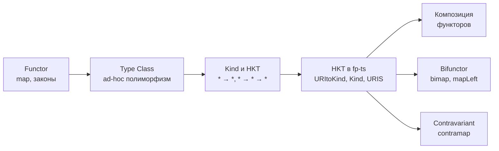
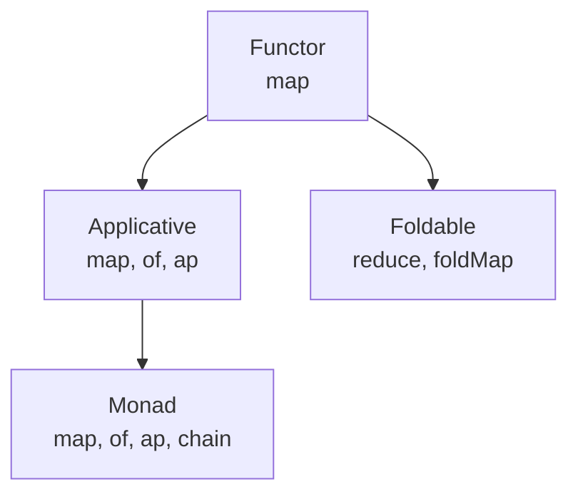
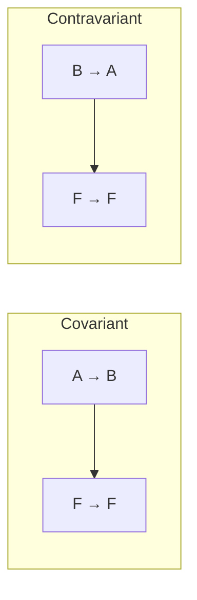

# Chapter: Функторы в TypeScript и fp-ts

> [!info] Context
> Объединяет темы 22-32 курса. Пререквизиты: [[17.category-theory]], [[11.Either]], generics в TypeScript.
> Покрывает: functor, kind, HKT, type class, functor composition, bifunctor, contravariant functor.

## Overview

Функтор — центральная абстракция функционального программирования. Это паттерн, который позволяет применять обычную функцию `(A) => B` к значению, завёрнутому в контейнер `F<A>`, получая `F<B>`. Операция `map` — знакомая по `Array.map` — это частный случай функторного преобразования.

Проблема TypeScript в том, что язык не позволяет параметризовать тип по type constructor: нельзя написать `type Map<F, A, B> = (f: (a: A) => B) => F<A> => F<B>`, где `F` — произвольный контейнер. Для решения этой проблемы fp-ts вводит кодировку Higher-Kinded Types через interface merging.

Глава строится по нарастающей:



1. **Функтор** — определение, законы, реализация `map` для Option и Either
2. **Type class** — ad-hoc полиморфизм, отличие от OOP-интерфейсов
3. **Kind и HKT** — классификация типов по арности, проблема TypeScript
4. **HKT в fp-ts** — URItoKind, module augmentation, Functor1/Functor2, lift
5. **Композиция функторов** — вложенные контейнеры, composeR
6. **Bifunctor** — bimap для типов с двумя параметрами
7. **Contravariant functor** — contramap для «потребителей»

## Deep Dive

### 1. Что такое функтор

Функтор — это тип `F`, для которого определена операция `map`:

```typescript
map: <A, B>(f: (a: A) => B) => (fa: F<A>) => F<B>
```

`map` поднимает (lift) обычную функцию `(A) => B` до работы внутри контейнера. Контейнер при этом сохраняет свою структуру: `Option` остаётся `Option`, `Array` остаётся `Array`, `Either` остаётся `Either`.

#### Реализация для Option

```typescript
type Option<A> = { _tag: 'Some'; value: A } | { _tag: 'None' }

const some = <A>(value: A): Option<A> => ({ _tag: 'Some', value })
const none: Option<never> = { _tag: 'None' }
const isNone = <A>(x: Option<A>): x is { _tag: 'None' } => x._tag === 'None'

const mapOption = <A, B>(f: (a: A) => B) => (fa: Option<A>): Option<B> =>
  isNone(fa) ? none : some(f(fa.value))
```

Ничего магического: если значение есть — применяем `f`, если нет — возвращаем `None`.

#### Реализация для Either

```typescript
type Either<E, A> = { _tag: 'Left'; left: E } | { _tag: 'Right'; right: A }

const left = <E>(e: E): Either<E, never> => ({ _tag: 'Left', left: e })
const right = <A>(a: A): Either<never, A> => ({ _tag: 'Right', right: a })
const isLeft = <E, A>(x: Either<E, A>): x is { _tag: 'Left'; left: E } =>
  x._tag === 'Left'

const mapEither = <A, B>(f: (a: A) => B) =>
  <E>(fa: Either<E, A>): Either<E, B> =>
    isLeft(fa) ? fa : right(f(fa.right))
```

> [!important] Either как функтор
> `map` для Either трансформирует только `Right`. `Left` проходит насквозь без изменений. Это согласуется с семантикой: `Left` — ошибка, `Right` — успешное значение.

#### Два закона функтора

Любой корректный `map` должен подчиняться двум законам:

**Identity:** `map(x => x)` не меняет контейнер.

```typescript
const id = <A>(x: A): A => x

// map(id)(some(42)) === some(42)
// map(id)(none)      === none
```

**Composition:** `map(g ∘ f)` эквивалентно `map(f)`, затем `map(g)`.

```typescript
const double = (x: number) => x * 2
const toString = (x: number) => `${x}`

// map(x => toString(double(x)))(some(5))
// эквивалентно
// map(toString)(map(double)(some(5)))
// Оба дают: some('10')
```

Законы гарантируют, что `map` ведёт себя предсказуемо: не добавляет побочных эффектов, не меняет структуру контейнера, не теряет и не дублирует значения.

#### Lifting как перспектива

`map` можно рассматривать двояко:

- **Применение к контейнеру:** берём `Option<string>` и функцию `string => number`, получаем `Option<number>`
- **Поднятие функции:** берём `string => number` и получаем `Option<string> => Option<number>`

Второй взгляд — это curried-форма: `map :: (A → B) → (F<A> → F<B>)`. Функция поднимается из мира обычных значений в мир контейнеров. В fp-ts эта операция так и называется — `lift`.

**Итог:** функтор — это тип с `map`, который поднимает обычные функции до работы внутри контейнера, подчиняясь законам identity и composition.

---

### 2. Type Class и ad-hoc полиморфизм

Type class — это спецификация поведения для группы типов. В отличие от OOP-интерфейса, type class ассоциирует поведение с типом извне, а не требует от типа наследовать интерфейс.

#### Простой пример: Show

```typescript
interface Show<A> {
  toString: (a: A) => string
}

const numberShow: Show<number> = { toString: (a) => a.toString() }
const boolShow: Show<boolean> = { toString: (a) => (a ? 'Yes' : 'No') }
```

`Show` — type class. `numberShow`, `boolShow` — type class instances (конкретные реализации для конкретных типов).

#### Ad-hoc полиморфизм

Функция, принимающая type class instance как аргумент, работает с любым типом, для которого есть реализация:

```typescript
const log = <A>(S: Show<A>) => (a: A): void => {
  console.log(S.toString(a))
}

log(numberShow)(42)    // '42'
log(boolShow)(true)    // 'Yes'
```

Это ad-hoc полиморфизм: одна функция `log`, но поведение зависит от переданного instance. Паттерн аналогичен Strategy.

#### Иерархия type classes для type constructors

Type classes применяются не только к конкретным типам (`*`), но и к type constructors (`* → *`):



- **Functor** — `map`
- **Applicative** — `map` + `of` + `ap`
- **Monad** — `map` + `of` + `ap` + `chain`
- **Foldable** — `reduce`, `foldMap`

Applicative и Monad — темы отдельных глав. Здесь показана только общая иерархия.

> [!tip] Отличие от OOP
> В OOP интерфейс привязан к объекту: `class MyList implements Mappable`. В FP type class instance — отдельная сущность: `const myListFunctor: Functor1<'MyList'> = { ... }`. Тип и его поведение развязаны.

**Итог:** type class описывает контракт, type class instance — реализацию для конкретного типа. Это позволяет добавлять поведение к типам без модификации самих типов.

---

### 3. Kind и Higher-Kinded Types

Мы определили type class `Show<A>` для конкретных типов. Но `Functor` — это type class для type constructor'ов (`Option<_>`, `Array<_>`). Чтобы написать обобщённый `Functor<F>`, нужно понять, чем type constructor отличается от конкретного типа.

#### Kind — «тип типов»

Типы в TypeScript различаются по тому, сколько параметров им нужно для создания конкретного типа:

| Тип | Kind | Пояснение |
|---|---|---|
| `string`, `number`, `boolean` | `*` | Конкретный тип, готов к использованию |
| `Option<_>`, `Array<_>` | `* → *` | Один параметр: подставь `A` — получишь конкретный тип |
| `Either<_, _>` | `* → * → *` | Два параметра: подставь `E` и `A` |
| `Functor<_>` | `(* → *) → *` | Принимает type constructor — это и есть HKT |

Kind `* → * → *` записывается правоассоциативно: `* → (* → *)`. Это значит, что `Either`, получив первый аргумент `E`, возвращает type constructor `* → *`. Поэтому `Either<string, _>` — это функтор (kind `* → *`), хотя сам `Either` имеет kind `* → * → *`.

#### Проблема TypeScript

Попробуем написать обобщённый `map`:

```typescript
// Не валидный TypeScript!
type Map<F, A, B> = (f: (a: A) => B) => (fa: F<A>) => F<B>
//                                             ^^^^
// Error: Type 'F' is not generic.
```

TypeScript позволяет параметризовать типы только конкретными типами (kind `*`), но не type constructor'ами (kind `* → *`). Параметр `F` в `F<A>` не работает — компилятор не понимает, что `F` нужно «применить» к `A`.

Haskell, Scala, PureScript решают это напрямую. TypeScript — нет. Поэтому нужна кодировка, и fp-ts предлагает именно её.

**Итог:** kind классифицирует типы по арности. TypeScript не поддерживает HKT нативно, что создаёт проблему для обобщённых абстракций вроде Functor.

---

### 4. Кодировка HKT в fp-ts

Это ключевая секция главы. fp-ts решает отсутствие HKT в TypeScript через три механизма: реестр типов, строковые ключи и interface merging.

> [!important] Почему именно этот подход?
> Можно было бы обойтись перегрузками (отдельная функция `mapOption`, `mapEither`...) или conditional types. Но это не масштабируется: каждый новый контейнер потребовал бы обновления всех обобщённых функций. Подход fp-ts с реестром позволяет регистрировать новые типы без изменения существующего кода — open/closed principle на уровне типов.

#### Шаг 1: Реестр URItoKind

fp-ts объявляет пустой интерфейс `URItoKind<A>` в модуле `fp-ts/HKT`:

```typescript
// Внутри fp-ts/HKT.ts (упрощённо)
interface URItoKind<A> {}
interface URItoKind2<E, A> {}
```

Каждый тип регистрирует себя через module augmentation (interface merging):

```typescript
// При определении Option
declare module 'fp-ts/HKT' {
  interface URItoKind<A> {
    Option: Option<A>
  }
}

// При определении Either
declare module 'fp-ts/HKT' {
  interface URItoKind2<E, A> {
    Either: Either<E, A>
  }
}
```

TypeScript объединяет все определения `URItoKind` в один интерфейс. Результат:

```typescript
interface URItoKind<A> {
  Option: Option<A>
  Array: A[]
  // ... все зарегистрированные типы
}
```

#### Шаг 2: Kind и URIS

```typescript
// URIS — объединение всех зарегистрированных ключей для * → *
type URIS = keyof URItoKind<any>  // 'Option' | 'Array' | ...

// Kind восстанавливает конкретный тип по строковому ключу
type Kind<F extends URIS, A> = URItoKind<A>[F]

// Пример:
type T = Kind<'Option', number>  // = Option<number>
```

Для типов с двумя параметрами:

```typescript
type URIS2 = keyof URItoKind2<any, any>  // 'Either' | ...
type Kind2<F extends URIS2, E, A> = URItoKind2<E, A>[F]

// Пример:
type T2 = Kind2<'Either', string, number>  // = Either<string, number>
```

#### Шаг 3: Functor1 и Functor2

Теперь можно описать Functor для разных kind:

```typescript
// Для * → * (Option, Array, List)
interface Functor1<F extends URIS> {
  readonly URI: F
  readonly map: <A, B>(fa: Kind<F, A>, f: (a: A) => B) => Kind<F, B>
}

// Для * → * → * (Either)
interface Functor2<F extends URIS2> {
  readonly URI: F
  readonly map: <E, A, B>(fa: Kind2<F, E, A>, f: (a: A) => B) => Kind2<F, E, B>
}
```

#### Шаг 4: Создание instances

```typescript
const optionFunctor: Functor1<'Option'> = {
  URI: 'Option',
  map: (fa, f) => isNone(fa) ? none : some(f(fa.value))
}

const eitherFunctor: Functor2<'Either'> = {
  URI: 'Either',
  map: (fa, f) => isLeft(fa) ? fa : right(f(fa.right))
}
```

#### Шаг 5: Обобщённая функция lift

```typescript
function lift<F extends URIS2>(
  F: Functor2<F>
): <E, A, B>(f: (a: A) => B) => (fa: Kind2<F, E, A>) => Kind2<F, E, B>

function lift<F extends URIS>(
  F: Functor1<F>
): <A, B>(f: (a: A) => B) => (fa: Kind<F, A>) => Kind<F, B>

function lift<F extends URIS>(F: Functor1<F>) {
  return <A, B>(f: (a: A) => B) => (fa: Kind<F, A>): Kind<F, B> =>
    F.map(fa, f)
}

// Использование:
const increment = (x: number) => x + 1

const liftedForOption = lift(optionFunctor)(increment)
liftedForOption(some(12))  // some(13)
liftedForOption(none)       // none

const liftedForEither = lift(eitherFunctor)(increment)
liftedForEither(right(12))         // right(13)
liftedForEither(left('error'))     // left('error')
```

Одна функция `lift` работает с любым зарегистрированным функтором. Перегрузки (overloads) нужны, чтобы TypeScript правильно выводил типы для разных kind.

> [!warning] Статус fp-ts
> Библиотека fp-ts не развивается активно с 2023 года — автор (Giulio Canti) перешёл в проект Effect. Концепции из fp-ts актуальны и переносимы, но для новых проектов стоит рассмотреть Effect.

**Итог:** fp-ts кодирует HKT через строковый реестр типов и interface merging. Ключевые элементы: `URItoKind`, `Kind`, `URIS`, `Functor1`/`Functor2`. Это позволяет писать обобщённые функции вроде `lift` для любого зарегистрированного функтора.

---

### 5. Композиция функторов

#### Проблема: вложенные контейнеры

Допустим, есть данные типа `Option<Array<number>>`:

```typescript
const data: Option<number[]> = some([1, 2, 3])
```

Нужно удвоить каждое число внутри. `mapOption` проникает только на один уровень — внутрь `Option`. Чтобы добраться до `Array`, нужен вложенный `map`:

```typescript
const double = (x: number) => x * 2

// Вложенный map:
const result = mapOption((xs: number[]) => xs.map(double))(data)
// some([2, 4, 6])
```

Это можно переписать в point-free форме:

```typescript
const mapArray = <A, B>(f: (a: A) => B) => (xs: A[]): B[] => xs.map(f)

const result = mapOption(mapArray(double))(data)
// some([2, 4, 6])
```

#### Композиция двух map — это тоже функтор

Выражение `mapOption(mapArray(f))` — это композиция функций `mapArray` и `mapOption`. Запишем через `composeR` (слева направо):

```typescript
type ComposeR = <A, B, C>(f: (a: A) => B, g: (b: B) => C) => (a: A) => C
const composeR: ComposeR = (f, g) => (a) => g(f(a))

const mapOptionArray = composeR(mapArray, mapOption)

mapOptionArray(double)(data)  // some([2, 4, 6])
```

Математический факт: композиция двух функторов — тоже функтор. Это значит, что `mapOptionArray` автоматически удовлетворяет обоим законам, если исходные `mapOption` и `mapArray` их соблюдают.

#### Регистрация составного функтора в fp-ts

В лекционном подходе составной функтор можно зарегистрировать как отдельный URI:

```typescript
declare module 'fp-ts/HKT' {
  interface URItoKind<A> {
    OptionArray: Option<A[]>
  }
}

const optionArrayFunctor: Functor1<'OptionArray'> = {
  URI: 'OptionArray',
  map: (fa, f) => optionFunctor.map(fa, xs => xs.map(f))
}
```

> [!tip] Современный подход
> В fp-ts v2 регистрация составного URI не нужна. Достаточно вложенных вызовов `pipe` с `O.map` и `A.map`. Функция `getFunctorComposition` из ранних версий deprecated.

**Итог:** композиция двух функторов даёт новый функтор. На практике в fp-ts v2 это решается вложенным `pipe(data, O.map(A.map(f)))`, без регистрации отдельного URI.

---

### 6. Bifunctor

#### Проблема

`Either<E, A>` — функтор по `A` (правый параметр). Но иногда нужно трансформировать и `E`. Например, превратить техническую ошибку в доменную:

```typescript
type ApiError = { code: number; message: string }
type DomainError = { userMessage: string }

const toDomainError = (e: ApiError): DomainError => ({
  userMessage: `Ошибка: ${e.message}`
})
```

Обычный `map` не поможет — он работает только с `Right`.

#### bimap

Bifunctor определяет операцию `bimap`, которая трансформирует оба параметра одновременно:

```typescript
bimap: <A, B, C, D>(
  f: (a: A) => C,  // трансформация левого
  g: (b: B) => D   // трансформация правого
) => (fab: Either<A, B>) => Either<C, D>
```

Реализация для Either:

```typescript
const bimapEither = <A, B, C, D>(
  f: (a: A) => C,
  g: (b: B) => D
) => (fa: Either<A, B>): Either<C, D> =>
  isLeft(fa) ? left(f(fa.left)) : right(g(fa.right))
```

#### Связь bimap, map и mapLeft

`map` и `mapLeft` выводятся из `bimap` через identity:

```typescript
const id = <A>(a: A): A => a

// map трансформирует только Right
const map = <B, D>(g: (b: B) => D) => bimapEither(id, g)

// mapLeft трансформирует только Left
const mapLeft = <A, C>(f: (a: A) => C) => bimapEither(f, id)

// bimap(id, id) = identity
// bimapEither(id, id)(right(42)) === right(42)
// bimapEither(id, id)(left('err')) === left('err')
```

#### Практический пример

```typescript
type ApiResponse = Either<ApiError, { data: string; timestamp: Date }>

const transform = bimapEither(
  toDomainError,                                    // Left: ApiError → DomainError
  (r: { data: string; timestamp: Date }) => r.data  // Right: берём только data
)

// left({ code: 404, message: 'Not found' })
// → left({ userMessage: 'Ошибка: Not found' })

// right({ data: 'ok', timestamp: new Date() })
// → right('ok')
```

#### Законы Bifunctor

- **Identity:** `bimap(id, id) = id`
- **Composition:** `bimap(f1 ∘ f2, g1 ∘ g2) = bimap(f1, g1) ∘ bimap(f2, g2)`

#### fp-ts интерфейс

```typescript
import { Bifunctor2 } from 'fp-ts/Bifunctor'

const eitherBifunctor: Bifunctor2<'Either'> = {
  URI: 'Either',
  bimap: (fa, f, g) => isLeft(fa) ? left(f(fa.left)) : right(g(fa.right)),
  mapLeft: (fa, f) => isLeft(fa) ? left(f(fa.left)) : fa
}
```

**Итог:** Bifunctor расширяет Functor на типы с двумя параметрами. `bimap` трансформирует обе стороны; `map` и `mapLeft` — частные случаи `bimap` с `id` на одной из сторон.

---

### 7. Ковариантные и контравариантные функторы

#### Covariant (обычный функтор)

Все функторы выше — ковариантные. Направление стрелки сохраняется:

```text
map :: (A → B) → F<A> → F<B>
```

Если `A → B`, то `F<A> → F<B>`. Направление то же.

Ковариантные функторы — **производители** (producers) значений. `Option<A>` производит `A` (или ничего). `Array<A>` производит ноль или более `A`.

#### Contravariant (контравариантный функтор)

Контравариантный функтор переворачивает направление:

```text
contramap :: (B → A) → F<A> → F<B>
```

Обратите внимание: функция идёт из `B` в `A`, но результат — из `F<A>` в `F<B>`. Направление стрелки обратное.

Контравариантные функторы — **потребители** (consumers) значений. `Predicate<A>` потребляет `A` и возвращает `boolean`. Если ты умеешь потреблять `A` и знаешь, как превратить `B` в `A`, то ты умеешь потреблять `B`.



#### Пример: Predicate

```typescript
type Predicate<A> = (a: A) => boolean

const contramapPredicate = <A, B>(f: (b: B) => A) =>
  (pred: Predicate<A>): Predicate<B> =>
    (b) => pred(f(b))
```

Есть предикат «число чётное». Нужен предикат «строка чётной длины»:

```typescript
const isEven: Predicate<number> = (n) => n % 2 === 0
const length = (s: string): number => s.length

const isEvenLength: Predicate<string> = contramapPredicate(length)(isEven)

isEvenLength('book')    // true  (длина 4)
isEvenLength('books')   // false (длина 5)
```

`length` превращает `string` в `number`. `isEven` потребляет `number`. Через `contramap` получаем предикат, потребляющий `string`.

#### Пример: Eq и Ord

```typescript
import { contramap } from 'fp-ts/Eq'
import * as S from 'fp-ts/string'

type User = { name: string; age: number }

// Eq<string> → Eq<User> (сравнение пользователей по имени)
const eqByName = contramap((u: User) => u.name)(S.Eq)

eqByName.equals({ name: 'Alice', age: 30 }, { name: 'Alice', age: 25 })  // true
```

`pipe` из fp-ts — это функция для left-to-right композиции: `pipe(value, f, g)` = `g(f(value))`. Она делает цепочки трансформаций читаемыми:

```typescript
import { contramap } from 'fp-ts/Ord'
import * as N from 'fp-ts/number'
import { pipe } from 'fp-ts/function'

// Ord<number> → Ord<User> (сортировка по возрасту)
// pipe: берём N.Ord, применяем contramap — получаем Ord<User>
const byAge = pipe(N.Ord, contramap((u: User) => u.age))
```

Логика одинаковая: есть операция над простым типом (`number`, `string`), через `contramap` расширяем её на составной тип (`User`).

#### fp-ts интерфейс

```typescript
interface Contravariant1<F extends URIS> {
  readonly URI: F
  readonly contramap: <A, B>(fa: Kind<F, A>, f: (b: B) => A) => Kind<F, B>
}
```

> [!tip] Мнемоника
> Ковариантный = производитель (Array выдаёт значения). Контравариантный = потребитель (Predicate принимает значения). Если нужно адаптировать потребителя под новый тип входных данных — используй `contramap`.

**Итог:** ковариантный функтор (`map`) работает с производителями, контравариантный (`contramap`) — с потребителями. `contramap` особенно полезен для `Eq`, `Ord` и `Predicate`, позволяя строить сложные сравнения и предикаты из простых.

## Related Topics

- [[17.category-theory]] — теоретическая основа: объекты, морфизмы, законы
- [[11.Either]] — ключевой пример для Functor и Bifunctor
- [[18.magma,semigroup,monoid]] — другие type classes в алгебраической иерархии
- [[ch08-functors-and-containers]] — функторы в Mostly Adequate Guide
- [[ch10-applicative-functors]] — следующий уровень: Applicative
- [[ch11-natural-transformations/natural-transformations]] — преобразования между функторами (функции `F<A> → G<A>`, сохраняющие `map`)

## Sources

- [Getting started with fp-ts: Functor](https://dev.to/gcanti/getting-started-with-fp-ts-functor-36ek)
- [fp-ts HKT.ts](https://gcanti.github.io/fp-ts/modules/HKT.ts.html)
- [fp-ts Bifunctor.ts](https://gcanti.github.io/fp-ts/modules/Bifunctor.ts.html)
- [fp-ts Contravariant.ts](https://gcanti.github.io/fp-ts/modules/Contravariant.ts.html)
- [Video course playlist](https://www.youtube.com/watch?v=Z3PLwD3iebg&list=PLuPevXgCPUIMbCxBEnc1dNwboH6e2ImQo)
- [Video 22: Functor](https://www.youtube.com/watch?v=N4mft_n06Wo)
- [Video 25: Kind, Higher-Kinded Type](https://www.youtube.com/watch?v=iYWAsyuquK4)
- [Video 26: Type Class](https://www.youtube.com/watch?v=yHKGqlXus_4)
- [Video 27: Type Class in fp-ts](https://www.youtube.com/watch?v=8llcVd9UVBQ)
- [Video 28: Functor Composition](https://www.youtube.com/watch?v=zrp4ovF7HYk)
- [Video 30: Bifunctor](https://www.youtube.com/watch?v=B3iHXFDt_3Y)
- [Video 32: Covariant and Contravariant Functors](https://www.youtube.com/watch?v=CWk1YlWXFME)

---

*Глава написана моделью claude-opus-4-6 (Opus 4.6)*
