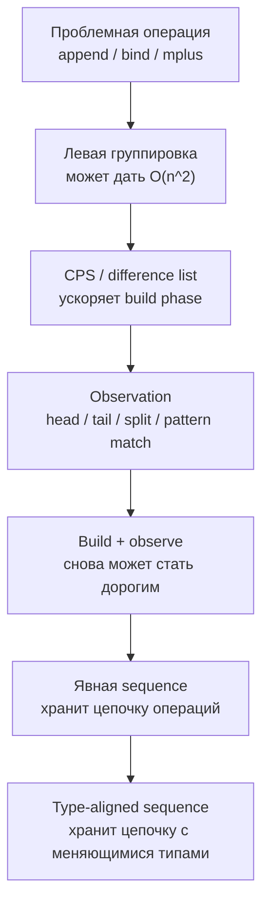

---
tags:
  [
    typescript,
    functional-programming,
    monads,
    performance,
    cps,
    sequences,
  ]
---

# Reflection without Remorse: скрытые последовательности операций

> [!info] Context
> Статья Atze van der Ploeg и Oleg Kiselyov "Reflection without Remorse" разбирает производительную проблему, которая появляется у ассоциативных операций вроде `append`, `bind`, `mplus` и композиции функций. Главная идея: когда программа долго строит цепочку операций и периодически наблюдает промежуточный результат, CPS уже не всегда спасает. Вместо этого скрытую последовательность операций нужно сделать явной структурой данных.

## Main Content

### Где находится тема

Эта глава соединяет несколько уже знакомых идей:

- [[18.magma,semigroup,monoid|Monoid]]: ассоциативная операция и нейтральный элемент
- [[17.category-theory|Category theory]]: композиция стрелок и associativity
- [[22.functor|Functor]]: контейнеры и преобразование внутреннего значения
- [[34.IO|IO]] и [[36.Task-and-asynchronous-side-effects|Task]]: вычисления как значения

Минимальные prerequisites:

- понимать, что associativity разрешает менять группировку, но не порядок операций;
- уметь читать рекурсивные структуры данных вроде linked list и tree;
- знать идею `flatMap`/`bind`: значение в контексте плюс функция, которая возвращает новое значение в контексте;
- понимать, что lazy/deferred representation может переносить работу на более поздний момент.

Статья написана на Haskell и использует `GADTs`, `Monad`, `Codensity`, `Free Monad`, `LogicT` и `type aligned sequences`. В TypeScript мы не можем выразить все гарантии так же строго, но можем понять саму форму проблемы и построить близкую учебную модель.

Ключевая карта:



**Итог:** тема не про "монады ради монад", а про конкретный performance pattern: цепочки ассоциативных операций дешевы или дороги в зависимости от представления.

### Проблемный паттерн: build and observe

Начнем с обычного списка. В связном списке `append(left, right)` должен пройти по всему `left`, чтобы прицепить `right` в конец.

```typescript
type List<A> = Nil | Cons<A>;

interface Nil {
  readonly tag: "Nil";
}

interface Cons<A> {
  readonly tag: "Cons";
  readonly head: A;
  readonly tail: List<A>;
}

const nil: Nil = { tag: "Nil" };

const cons = <A>(head: A, tail: List<A>): List<A> => ({
  tag: "Cons",
  head,
  tail,
});

const append = <A>(left: List<A>, right: List<A>): List<A> => {
  if (left.tag === "Nil") {
    return right;
  }

  return cons(left.head, append(left.tail, right));
};
```

С точки зрения результата эти выражения эквивалентны:

```typescript
append(append(xs, ys), zs);
append(xs, append(ys, zs));
```

Но по стоимости они разные. В первом случае `xs` обходится дважды: сначала внутри `append(xs, ys)`, потом как часть левого аргумента внешнего `append`. Во втором случае `xs` обходится один раз.

Если построить длинную левостороннюю цепочку:

```typescript
const leftAssociated = append(append(append(a, b), c), d);
```

то ранние куски будут повторно обходиться снова и снова. Для `n` маленьких списков это легко превращается в `O(n^2)`.

> [!important]
> Associativity гарантирует одинаковый смысл разных группировок, но не гарантирует одинаковую стоимость. В функциональном коде это особенно важно: "эквивалентные по законам" выражения могут сильно отличаться по runtime.

**Итог:** проблема появляется у операций, которые проходят по левому аргументу, но не проходят по правому. Левая группировка таких операций может быть асимптотически хуже правой.

### Та же проблема у дерева и `bind`

Списки не уникальны. Возьмем дерево, где `substitute` заменяет каждый лист другим деревом.

```typescript
type Tree = Leaf | Node;

interface Leaf {
  readonly tag: "Leaf";
}

interface Node {
  readonly tag: "Node";
  readonly left: Tree;
  readonly right: Tree;
}

const leaf: Leaf = { tag: "Leaf" };

const node = (left: Tree, right: Tree): Tree => ({
  tag: "Node",
  left,
  right,
});

const substitute = (tree: Tree, replacement: Tree): Tree => {
  if (tree.tag === "Leaf") {
    return replacement;
  }

  return node(
    substitute(tree.left, replacement),
    substitute(tree.right, replacement),
  );
};
```

`substitute(left, replacement)` проходит по `left`, но не проходит по `replacement`. Значит, цепочка:

```typescript
substitute(substitute(x, y), z);
```

имеет тот же неприятный профиль, что и левосторонний `append`.

Теперь сделаем дерево generic: листья хранят значения, а `flatMap` заменяет каждый лист деревом нового типа.

```typescript
type TreeOf<A> = LeafOf<A> | NodeOf<A>;

interface LeafOf<A> {
  readonly tag: "Leaf";
  readonly value: A;
}

interface NodeOf<A> {
  readonly tag: "Node";
  readonly left: TreeOf<A>;
  readonly right: TreeOf<A>;
}

const pureTree = <A>(value: A): TreeOf<A> => ({
  tag: "Leaf",
  value,
});

const flatMapTree = <A, B>(
  tree: TreeOf<A>,
  f: (value: A) => TreeOf<B>,
): TreeOf<B> => {
  if (tree.tag === "Leaf") {
    return f(tree.value);
  }

  return {
    tag: "Node",
    left: flatMapTree(tree.left, f),
    right: flatMapTree(tree.right, f),
  };
};
```

Это уже форма monadic `bind`:

```text
flatMap(flatMap(m, f), g)
flatMap(m, (x) => flatMap(f(x), g))
```

По monad law эти записи имеют одинаковый смысл, но первая может быть дороже, потому что промежуточное дерево обходится повторно.

**Итог:** `bind` не обязан быть бинарной ассоциативной операцией в обычном смысле, но его associativity law создает ту же ловушку производительности.

### Частичное решение: CPS и difference lists

Для списков популярное решение называется difference list. Вместо списка мы храним функцию, которая получает хвост и достраивает список перед ним.

```typescript
type DList<A> = (tail: List<A>) => List<A>;

const emptyDList = <A>(): DList<A> => (tail) => tail;

const fromList = <A>(list: List<A>): DList<A> =>
  (tail) => append(list, tail);

const concatDList = <A>(left: DList<A>, right: DList<A>): DList<A> =>
  (tail) => left(right(tail));

const toList = <A>(list: DList<A>): List<A> => list(nil);
```

Теперь `concatDList` - это композиция функций. Она не обходит список сразу. Поэтому много конкатенаций можно дешево собрать, а потом один раз превратить в обычный список:

```typescript
const result = toList(
  concatDList(
    concatDList(fromList(a), fromList(b)),
    fromList(c),
  ),
);
```

Та же идея обобщается:

- для `Monoid` получается "difference monoid";
- для `Monad` получается `Codensity`;
- для композиции функций получается откладывание цепочки вызовов.

Но CPS хорошо работает, когда есть две отдельные фазы:

1. build: долго строим цепочку;
2. observe: один раз наблюдаем результат.

Если программа постоянно чередует build и observe, появляются новые расходы. Например, чтобы узнать, пустой ли `DList`, надо сначала сделать `toList`. Если после этого мы берем tail и снова превращаем его в `DList`, то добавляем новый слой функций к оставшейся части.

> [!warning]
> CPS не делает наблюдение бесплатным. Он переносит работу в момент интерпретации. Если интерпретация нужна часто и частично, стоимость может вернуться.

**Итог:** CPS лечит левостороннее построение цепочек, но плохо подходит для сценариев, где нужно регулярно смотреть на промежуточное состояние.

### Что такое reflection в этой статье

В статье `reflection` означает возможность посмотреть на внутреннее состояние вычисления и продолжить работу с остатком.

Примеры:

- у списка: посмотреть `head` и `tail`;
- у недетерминированного вычисления: получить первый результат и оставшиеся варианты;
- у parser/iteratee: понять, завершено ли вычисление или оно ждет следующий input;
- у free monad/effect system: pattern match по следующей инструкции программы.

В TypeScript аналог можно представить так:

```typescript
type Split<A> =
  | { readonly tag: "Empty" }
  | { readonly tag: "Cons"; readonly head: A; readonly tail: LazyChoices<A> };

interface LazyChoices<A> {
  readonly split: () => Split<A>;
  readonly concat: (right: LazyChoices<A>) => LazyChoices<A>;
}
```

`split` - это reflection: мы не просто запускаем вычисление до конца, а раскрываем один слой и оставляем возможность продолжать.

Проблема статьи: многие CPS-представления быстры для `concat`/`bind`, но вынуждены делать дорогую конвертацию при `split`. Если `split` вызывается много раз, например "возьми первые `n` результатов", программа может стать квадратичной.

**Итог:** reflection нужен не для теоретической красоты, а для практических операций вроде `head/tail`, `split`, `pattern match`, `take n`, `interleave`, `cut`, partial interpretation.

### Главная идея: скрытую последовательность сделать явной

Статья предлагает другой ход. Не нужно представлять цепочку операций ни как левое дерево вызовов, ни как CPS-дерево функций. Нужно представить ее как sequence.

Абстрактный интерфейс:

```typescript
type ViewLeft<A> =
  | { readonly tag: "Empty" }
  | { readonly tag: "Cons"; readonly head: A; readonly tail: Seq<A> };

interface Seq<A> {
  readonly concat: (right: Seq<A>) => Seq<A>;
  readonly viewLeft: () => ViewLeft<A>;
}
```

Для настоящего выигрыша `Seq` должна поддерживать:

- дешевый `concat`;
- дешевый `viewLeft`;
- частичное раскрытие без полной конвертации.

В статье для этого используются эффективные purely functional sequence structures, например catenable queues/finger trees. Ниже будет учебная модель интерфейса; конкретная реализация `Seq` в TypeScript может быть разной.

Теперь вернемся к дереву без значений. Вместо того чтобы в каждом узле хранить готовые дочерние деревья, будем хранить выражения, которые еще надо интерпретировать.

```typescript
type FastTree = FastLeaf | FastNode;
type TreeExp = Seq<FastTree>;

interface FastLeaf {
  readonly tag: "Leaf";
}

interface FastNode {
  readonly tag: "Node";
  readonly left: TreeExp;
  readonly right: TreeExp;
}
```

Операция подстановки больше не обязана рекурсивно обходить все поддерево:

```typescript
const substituteFast = (tree: FastTree, replacement: TreeExp): FastTree => {
  if (tree.tag === "Leaf") {
    return value(replacement);
  }

  return {
    tag: "Node",
    left: tree.left.concat(replacement),
    right: tree.right.concat(replacement),
  };
};

const value = (expression: TreeExp): FastTree => {
  const view = expression.viewLeft();

  if (view.tag === "Empty") {
    return { tag: "Leaf" };
  }

  return substituteFast(view.head, view.tail);
};
```

Важный сдвиг: `substituteFast` не обходит левое дерево целиком. В `Node` она только дописывает `replacement` в последовательность отложенных операций у детей. `value` раскрывает только верхний слой. Это и дает поддержку чередования build и observe.

**Итог:** вместо полной нормализации после каждого шага мы храним отложенную последовательность операций и раскрываем ее частично, ровно настолько, насколько требует наблюдение.

### Почему для `bind` нужны type-aligned sequences

Для обычного `append` все элементы последовательности имеют один тип:

```typescript
Seq<List<number>>
```

Для `bind` ситуация другая. Цепочка:

```text
m >>= f1 >>= f2 >>= f3
```

может менять тип на каждом шаге:

```text
m  : M<A>
f1 : A -> M<B>
f2 : B -> M<C>
f3 : C -> M<D>
```

Обычная `Seq` не подходит: элементы не имеют один общий тип вроде `(A) => M<B>`. Нам нужна последовательность стрелок, где выход предыдущей стрелки совпадает со входом следующей.

Сначала можно думать об этом как о pipeline:

```text
string -> number -> boolean -> string
```

Каждый шаг может иметь свой тип входа и выхода. Но порядок шагов нельзя свободно переставлять: `boolean -> string` не может идти перед `string -> number`. В статье это называется type alignment: соседние элементы последовательности должны совпадать по граничному типу.

В TypeScript это можно выразить через phantom-типы на публичной границе:

```typescript
type Edge<A, B> = (value: A) => B;

interface TSeq<A, B> {
  readonly steps: readonly Edge<unknown, unknown>[];
  readonly _start?: (value: A) => void;
  readonly _end?: B;
}

const tempty = <A>(): TSeq<A, A> => ({
  steps: [],
});

const tsingleton = <A, B>(edge: Edge<A, B>): TSeq<A, B> => ({
  steps: [edge as Edge<unknown, unknown>],
});

const tconcat = <A, B, C>(
  left: TSeq<A, B>,
  right: TSeq<B, C>,
): TSeq<A, C> => ({
  steps: [...left.steps, ...right.steps],
});

const runTSeq =
  <A, B>(sequence: TSeq<A, B>) =>
  (input: A): B =>
    sequence.steps.reduce<unknown>(
      (value, step) => step(value),
      input,
    ) as B;
```

> [!warning]
> Эта реализация `TSeq` использует массив и поэтому не дает asymptotic improvement, о котором говорит статья: `tconcat` здесь копирует массивы. Ее задача только показать type alignment на TypeScript. Для настоящего performance-выигрыша вместо массива нужна структура с дешевым `concat` и дешевым `viewLeft`, например catenable queue или finger tree.

Теперь корректная композиция проходит:

```typescript
const parseNumber = tsingleton((text: string): number => Number(text));
const isEven = tsingleton((value: number): boolean => value % 2 === 0);
const show = tsingleton((value: boolean): string => String(value));

const program = tconcat(tconcat(parseNumber, isEven), show);

const result: string = runTSeq(program)("42");
```

А неправильная композиция не должна проходить на уровне публичного API:

```typescript
// Ошибка типов: isEven ждет number, а show возвращает string.
// const broken = tconcat(show, isEven);
```

> [!important]
> Это не полная замена Haskell `GADTs`. Внутри `TSeq` мы используем `unknown` и приведение типа, потому что TypeScript не умеет выразить такую структуру так же точно. Но публичные функции `tsingleton` и `tconcat` уже фиксируют главную гарантию: конец левой последовательности должен совпадать с началом правой.

**Итог:** type-aligned sequence - это не просто "массив функций". Это путь по графу типов: каждая стрелка должна начинаться там, где закончилась предыдущая.

### Обобщенный рецепт из статьи

Статья предлагает общий способ чинить такие структуры:

1. Найти рекурсивный тип, где операция вроде `append`, `bind` или `mplus` проходит по левому аргументу.
2. Заменить рекурсивные self-reference поля на sequence отложенных операций.
3. Переписать проблемную операцию так, чтобы она не обходила структуру, а добавляла операцию в sequence.
4. Добавить функцию частичного наблюдения: она раскрывает один слой, а остаток оставляет как sequence.
5. Если тип меняется по ходу цепочки, использовать type-aligned sequence.

В псевдо-TypeScript это выглядит так:

```typescript
interface Reflective<Expression, Value> {
  readonly toExpression: (value: Value) => Expression;
  readonly observeOneLayer: (expression: Expression) => Value;
}
```

Но смысл не в этом интерфейсе. Смысл в смене представления:

```text
До:
  recursive structure + recursive bind/append

После:
  recursive structure + explicit sequence of pending operations
```

**Итог:** мы не пытаемся угадать правильную группировку выражения. Мы выбираем представление, где группировка перестает быть источником квадратичной стоимости.

### Где это применяется

В статье разобраны четыре важных семейства примеров.

#### Iteratees

`Iteratee` - это вычисление, которое либо уже завершено, либо ждет input. Упрощенно:

```typescript
type Iteratee<I, A> =
  | { readonly tag: "Done"; readonly value: A }
  | { readonly tag: "Get"; readonly next: (input: I) => Iteratee<I, A> };
```

`bind` для такой структуры легко написать так, что он будет накапливать левостороннюю цепочку. Если потом есть операция вроде `par`, которая смотрит, находятся ли два iteratee в состоянии `Done` или `Get`, нам нужна reflection. CPS ускорит построение цепочки, но `par` вынудит обратно раскрывать структуру.

Идея статьи: хранить продолжение после `Get` как type-aligned sequence, чтобы `bind` добавлял шаг дешево, а `par` мог наблюдать один слой без полной конвертации.

#### LogicT и недетерминизм

У недетерминированного вычисления часто есть операция:

```typescript
type MaybeSplit<A> =
  | { readonly tag: "None" }
  | { readonly tag: "Some"; readonly head: A; readonly tail: Logic<A> };

interface Logic<A> {
  readonly split: () => MaybeSplit<A>;
}
```

`split` нужен для `take n`, `interleave`, `cut`, fair conjunction. Это reflection: мы достаем первый результат и остаток. Если внутреннее представление основано на CPS, каждое `split` может заново добавлять работу к хвосту. Поэтому "получить первые n результатов" может стать квадратичным.

#### Free Monad

Классическая free monad:

```typescript
type Free<F, A> =
  | { readonly tag: "Pure"; readonly value: A }
  | { readonly tag: "Impure"; readonly instruction: F };
```

В реальном коде `instruction` обычно содержит continuation. Pattern matching по `Pure`/`Impure` - это reflection: интерпретатор смотрит на следующую инструкцию программы. Если `bind` каждый раз рекурсивно проходит по free monad term, длинные программы могут страдать от той же проблемы. Решение: хранить pending binds как type-aligned sequence.

#### Extensible effects

Effect system на free monad или похожем представлении часто работает так:

1. программа отправляет request;
2. handler смотрит на request;
3. handler решает, что делать дальше;
4. continuation продолжает программу.

То есть handler постоянно наблюдает следующий слой программы. Если продолжения представлены через CPS, reflection становится менее прозрачным и может быть дорогим. Явная sequence позволяет сохранить прямой стиль интерпретации и контролировать стоимость.

**Итог:** статья важна для любых систем, где программа одновременно строит цепочку вычислений и частично ее интерпретирует: parsers, streams, nondeterminism, effects, free monads, coroutines.

### Что стоит перенести в TypeScript-практику

Не нужно сразу писать `Codensity`, `Free Monad` и собственную catenable queue. Практический урок проще:

1. Если у операции есть закон associativity, не считай автоматически, что все группировки одинаково быстрые.
2. Если операция обходит левый аргумент, левосторонняя цепочка подозрительна.
3. Если CPS-представление приходится часто раскрывать, проверь стоимость конвертации.
4. Если нужно чередовать build и observe, подумай о явной структуре для отложенных операций.
5. Если цепочка меняет типы, обычный `Array<Step>` теряет важную информацию; нужен type-aligned API или другой способ зафиксировать допустимый порядок шагов.

В TypeScript это особенно заметно в самописных:

- parser combinators;
- validators;
- effect-like DSL;
- fluent builders;
- lazy streams;
- tree interpreters;
- workflow engines.

> [!tip]
> Хороший диагностический вопрос: "Мы сейчас храним программу как дерево вложенных функций, как рекурсивный AST или как явную очередь шагов?" Ответ часто объясняет performance-поведение.

**Итог:** статья дает не готовый TypeScript-рецепт, а способ смотреть на структуру вычисления: где находится цепочка, как она группируется и сколько стоит ее частично наблюдать.

## Related Topics

- [[18.magma,semigroup,monoid|Magma, Semigroup, Monoid]]
- [[17.category-theory|Category theory]]
- [[22.functor|Functor]]
- [[25.kind,higher-kinded_type|Kind, Higher-Kinded Type]]
- [[27.class-in-fp-ts|Type classes in fp-ts]]
- [[34.IO|IO]]
- [[36.Task-and-asynchronous-side-effects|Task and Asynchronous Side Effects]]
- [[../dsl/fluent-builder-dsl|Fluent Builder DSL]]

## Sources

- [Atze van der Ploeg, Oleg Kiselyov - Reflection without Remorse: Revealing a hidden sequence to speed up monadic reflection](https://okmij.org/ftp/Haskell/zseq.pdf)
- [Companion code: reflectionwithoutremorse](https://github.com/atzeus/reflectionwithoutremorse)
- [Chris Okasaki - Purely Functional Data Structures](https://www.cambridge.org/core/books/purely-functional-data-structures/0409255DA1B48FA731859AC72E34D494)
- [Ralf Hinze, Ross Paterson - Finger trees: a simple general-purpose data structure](https://www.staff.city.ac.uk/~ross/papers/FingerTree.html)
