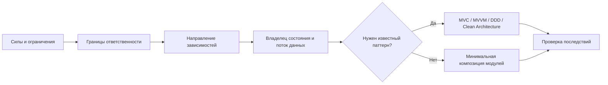

# Архитектура: карта решений

## Цель

Научиться не «выбирать любимый паттерн», а принимать и проверять архитектурное решение в таком порядке:

1. зафиксировать силы дизайна и ограничения;
2. провести границы и направить зависимости;
3. определить владельцев состояния и поток данных;
4. только затем выбрать MVC, MVVM, DDD или элементы Clean Architecture;
5. явно записать, какие альтернативы отвергнуты и какой ценой получено решение.

**Наблюдаемый результат:** для нового сценария вы можете подготовить короткий ADR, схему зависимостей и схему потока данных; на каждой схеме видны владельцы ответственности, направление стрелок и критерии пересмотра решения.

## Предварительные знания

- классы, интерфейсы, композиция и [[../03-oop/MOC|OOP]];
- принцип инверсии зависимостей из [[../03-oop/solid/MOC|SOLID]];
- базовый TypeScript;
- для React/MobX-примеров — понимание компонента, store и реактивного обновления из [[../05-frontend/MOC|Frontend]].

Если трудно различить бизнес-правило, состояние интерфейса и инфраструктурную деталь, сначала выпишите по три примера каждого вида из знакомого приложения. Без этого названия слоёв будут маскировать неясные границы.

## Рабочая модель решения

Паттерн здесь — следствие решения, а не исходная точка. Если простая композиция модулей уже выдерживает ожидаемые изменения, добавлять архитектурный слой не требуется.

## Путь обучения по зависимостям

### 1. Силы дизайна: что должно пережить изменение

До выбора паттерна зафиксируйте:

| Сила | Что наблюдать | Как влияет на решение |
|---|---|---|
| Частота изменений | Что меняется независимо: UI, правила, хранилище, интеграции | Часто меняющиеся части получают явную границу |
| Цена ошибки | Где ошибка приводит к потере денег, данных или доверия | Критичные правила изолируются и получают явные контракты |
| Число способов ввода/вывода | Один UI или HTTP, CLI, очередь и фоновая задача | Несколько адаптеров усиливают пользу независимого application/domain-ядра |
| Согласованность состояния | Допустимы ли задержки, конкуренция и частичные обновления | Нужны явные владелец состояния, переходы и обработка ошибок |
| Ограничения команды | Размер, опыт, срок, стоимость поддержки | Сложность решения должна окупаться конкретной силой |

**Проверка:** для одной функции продукта составьте таблицу «сила → свидетельство → архитектурное последствие → условие пересмотра». Формулировка «так принято» не считается свидетельством.

### 2. Границы и зависимости: кто о ком имеет право знать

Прочитайте [[mvc/counter/counter|базовый Counter]], затем [[mvc/counterTwo/counterTwo|изолированный CounterTwo]] и [[mvc/taskExample/classicWay/taskExample-classic|Task Manager с Observer]].

Идите не от названий классов, а от вопросов:

1. Какое правило должно работать без DOM, React, базы данных и сети?
2. Кто создаёт объекты и связывает реализации с контрактами?
3. Какая стрелка зависимости вынудит менять стабильное правило из-за изменения UI?
4. Нужна ли обратная связь: возвращаемое значение, событие, callback или реактивная подписка?

`Model`, которая импортирует конкретный `View`, связывает бизнес-состояние со способом отображения. Интерфейс полезен только тогда, когда меняет направление зависимости или отделяет реальную вариативность; пустой интерфейс сам по себе границу не создаёт.

**Проверка:** нарисуйте граф импортов для двух Counter-примеров. Отдельно отметьте runtime-поток вызовов: направление вызова и направление исходной зависимости могут различаться.

### 3. Состояние и поток данных: где находится источник истины

Изучите [[mvc/users/users|Users CRUD]] как цепочку «событие → проверка → изменение → отображение», а затем сравните ручное уведомление из [[mvc/taskExample/classicWay/taskExample-classic|Observer-примера]] с реактивным потоком из [[mvc/taskExample/frontend/taskExample-frontend|MobX + React]].

Для каждого изменяемого значения укажите:

- владельца и единственный источник истины;
- допустимые команды изменения;
- производные значения;
- момент и способ уведомления потребителя;
- состояния `loading`, `empty`, `success`, `error`;
- поведение при повторном или конкурирующем событии.

Не выбирайте Observer или реактивный store только ради автоматического рендера. Их цена — скрытые подписки, жизненный цикл и более сложная диагностика порядка обновлений.

**Проверка:** проследите один сценарий создания пользователя и один сценарий сортировки. Для каждого запишите вход, владельца перехода, новое состояние, уведомление и отображаемый результат.

### 4. MVC или MVVM: выбрать посредника по силам UI

Сначала прочитайте [[mvc/mvc|MVC]], затем [[vm/vm|ViewModel]] и [[mvvm/MVVM|MVVM]].

| Наблюдаемая сила | MVC уместен, когда… | MVVM уместен, когда… |
|---|---|---|
| Характер взаимодействия | события удобно преобразовать в явные команды Controller | View декларативно привязывается к состоянию и командам ViewModel |
| Логика представления | её мало, результат можно вернуть View | много форматирования, фильтров и UI-состояний |
| Механизм обновления | ручной поток остаётся прозрачным | фреймворк уже даёт наблюдаемость и binding |
| Цена неявности | важнее видеть каждый вызов | реактивность сокращает повторяющийся код сильнее, чем усложняет трассировку |

Это не взаимоисключающие ярлыки для всего приложения. Controller может обслуживать входной адаптер, а ViewModel — конкретное представление. Решение должно указывать границу применимости.

**Проверка:** объясните, почему один и тот же [[mvc/taskExample/frontend/taskExample-frontend|TaskStore]] можно описать как Model + ViewModel, и назовите факт, который заставил бы разделить эти роли.

### 5. DDD: моделировать идентичность и правила только при наличии доменной сложности

Прочитайте [[ddd/entity-vs-value-object|Entity и Value Object]].

Классифицируйте объект не по наличию `class`, `id` или MobX, а по смыслу:

- **Entity** сохраняет идентичность на протяжении жизненного цикла;
- **Value Object** определяется значением, обычно неизменяем и проверяет собственные инварианты;
- **Domain Service** выражает правило, которое естественно не принадлежит одной Entity или Value Object;
- **Application Service / use case** координирует сценарий и внешние порты.

DDD не требуется для каждого CRUD. Если правила сводятся к переносу DTO между формой и API, богатая доменная модель создаст больше церемонии, чем защиты.

**Проверка:** для трёх понятий знакомого домена запишите идентичность, жизненный цикл, инварианты и способ сравнения. После этого классифицируйте их и укажите хотя бы одну отвергнутую классификацию.

Для углубления после этой проверки используйте [интерактивный гид по Decider](ddd/decider-pattern-guide.html): он связывает доменные инварианты, state machine, события и границу инфраструктуры. Это специализированный вариант для сложных решений, а не обязательная часть DDD.

### 6. Clean Architecture: защитить ядро направлением зависимостей

Прочитайте [[ddd/clean-architecture|Clean Architecture + DDD]] после разделов о границах и DDD.

Проверяйте не дерево папок, а правило зависимостей:

- domain не импортирует UI, фреймворк, базу данных или сетевой клиент;
- application координирует use case и определяет нужные ему порты;
- внешние адаптеры преобразуют протоколы и реализуют порты;
- composition root выбирает реализации и связывает граф объектов.

Четыре слоя не являются обязательным минимумом. Выделяйте слой, когда у него есть самостоятельная причина изменяться и граница защищает проверяемое правило.

**Проверка:** для каждого импорта на схеме подпишите «разрешён», «нарушает направление» или «зависит от выбранной границы», затем объясните критерий без ссылки на имя папки.

## Смежный маршрут: client-server взаимодействие

Это отдельная dependency-ordered серия, а не седьмой шаг выбора application architecture. Главы 1–6 образуют основной маршрут:

1. [[client-server/01-client-server-request-lifecycle/01-client-server-request-lifecycle|Путь HTTPS-запроса от URL до ответа]] — по наблюдениям браузера, `curl`, proxy и приложения восстановить пройденные границы запроса и выбрать следующую диагностическую проверку.
   - [[client-server/01-client-server-request-lifecycle/exercises|Практика пути HTTPS-запроса]].
2. [[client-server/02-dns-tcp-tls/02-dns-tcp-tls|DNS, TCP и TLS]] — по имени узла, порту и выводу сетевых инструментов различить разрешение имени, установление TCP-соединения и проверку TLS.
   - [[client-server/02-dns-tcp-tls/exercises|Практика DNS, TCP и TLS]].
3. [[client-server/03-http-messages-and-semantics/03-http-messages-and-semantics|HTTP-сообщения и семантика]] — прочитать HTTP-обмен и обосновать выбор метода, статуса и полей через наблюдаемое поведение клиента и сервера.
   - [[client-server/03-http-messages-and-semantics/exercises|Практика HTTP-сообщений и семантики]].
4. [[client-server/04-browser-state-and-security/04-browser-state-and-security|Состояние браузера и границы безопасности]] — независимо определить отправку cookie, доступ JavaScript к ответу, серверную авторизацию и необходимость защиты от CSRF.
   - [[client-server/04-browser-state-and-security/exercises|Практика состояния браузера и границ безопасности]].
5. [[client-server/05-http-caching/05-http-caching|HTTP caching: кто отвечает на запрос]] — по cache key, возрасту и policy предсказать fresh hit, revalidation или miss, определить фактического автора ответа и выбрать безопасную политику хранения.
6. [[client-server/06-reliable-client-server-interaction/06-reliable-client-server-interaction|Надёжное взаимодействие: что делать после timeout]] — отличить подтверждённый отказ от неизвестного результата, ограничить retry policy и защитить побочный эффект ключом идемпотентности.

Планируемые расширения маршрута:
7. `07-rest-and-http-api-design.md` — REST и проектирование HTTP API.
8. `08-polling-sse-websocket.md` — способы длительного client-server обмена.
9. `09-production-request-path.md` — CDN, reverse proxy, load balancer и observability.

### Статус и редакторский контракт

Главы 1–6 переработаны и проверены. Не переписывайте их заново без нового запроса или конкретного технического дефекта.

- Писать естественным русским. Оставлять английские названия API, протокольные поля, значения и термины без устойчивого русского эквивалента; не смешивать языки внутри обычной фразы без причины.
- Одна глава решает одну диагностическую или проектную задачу. Справочные таблицы, примеры и предупреждения остаются только тогда, когда помогают выполнить эту задачу.
- Не дублировать соседние главы: первая даёт карту пути; вторая объясняет DNS/TCP/TLS; третья — HTTP; четвёртая — cookie, origin, CORS и CSRF; пятая — HTTP caching; шестая — timeout, retry и idempotency.
- Не превращать главы в подготовку к собеседованию. Проверка результата должна требовать объяснения наблюдений или решения нового случая.
- Использовать минимум примеров, достаточный для проверки механизма. Все исполняемые примеры запускать через реальный entrypoint.
- Существующие sibling `exercises.md` глав 1–4 не перерабатывались.
- **Follow-up для циклов глав 1–6: ничего.** Упражнения, quiz, Anki cards и проекты в этих циклах не создавались и не обновлялись.
- Перед каждой следующей главой снова задать обязательный multi-select вопрос о follow-up; выбор `ничего` из завершённых циклов автоматически не переносить.
- После изменения главы проверить frontmatter, wikilinks, code fences, исполняемые примеры и выполнить `pnpm run audit` из корня vault.

#### 7. REST и HTTP API: проектировать uniform interface вокруг resources

**Destination:** `client-server/07-rest-and-http-api-design/07-rest-and-http-api-design.md` и sibling `exercises.md`.

**Prerequisites:** полный основной маршрут 1–6, особенно HTTP semantics, stateless request context, caching и idempotency.

**Observable outcome:** для bounded domain выделить resources и representations, спроектировать URL/method/status/error/pagination contract и объяснить, какие REST constraints он соблюдает или нарушает.

**Central mechanism:** REST — набор architectural constraints, а не синоним JSON API. Связать client-server, stateless, cache, uniform interface, layered system и optional code-on-demand с resource identification, manipulation through representations, self-descriptive messages и hypermedia. URL style, pagination и error representation показать как API design decisions, а не как полное определение REST.

**Observation:** `curl`-trace небольшого API показывает переходы по links, media types, conditional update и machine-readable error; затем один intentionally RPC-shaped endpoint сравнивается по наблюдаемым trade-offs.

**Practice and pass criterion:** ученик исправляет API contract без подмены resource action-именами, реализует минимальный black-box HTTP server, сохраняет method/status/cache semantics, диагностирует hidden session state и переносит design на новый domain. Pass — client проходит контрактные сценарии без знания server implementation.

**Source:** [Roy Fielding: Representational State Transfer, chapter 5](https://ics.uci.edu/~fielding/pubs/dissertation/rest_arch_style.htm).

#### 8. Polling, SSE и WebSocket: выбрать форму длительного обмена

**Destination:** `client-server/08-polling-sse-websocket/08-polling-sse-websocket.md` и sibling `exercises.md`.

**Prerequisites:** request/response и connection boundaries из глав 1–3; timeout, reconnect, duplicate и retry reasoning из главы 6. Глава 7 не является prerequisite.

**Observable outcome:** по направлению данных, latency target, update frequency, ordering, reconnect и backpressure constraints обосновать polling, long polling, SSE или WebSocket и назвать failure/recovery contract.

**Central mechanism:** сравнить lifecycle и data direction, а не бренды API. Разобрать polling interval, held response в long polling, `text/event-stream` и `Last-Event-ID`/reconnect для SSE, bidirectional messages и opening handshake для WebSocket, application-level ordering, duplicate handling и отсутствие backpressure в классическом browser `WebSocket`.

**Observation:** один локальный Node.js event source доступен как polling и SSE; DevTools/CLI показывают число requests, latency и reconnect cursor. WebSocket handshake и buffered delivery наблюдаются отдельно, не смешивая их с HTTP response semantics.

**Practice and pass criterion:** ученик предсказывает потери/дубли после reconnect, реализует один выбранный transport с cursor, диагностирует proxy buffering и slow consumer, затем переносит выбор с notification feed на collaborative interaction. Pass — решение включает направление потока, recovery, ordering и resource bounds, а не только latency.

**Sources:** [MDN: Using server-sent events](https://developer.mozilla.org/en-US/docs/Web/API/Server-sent_events/Using_server-sent_events), [MDN: WebSocket API](https://developer.mozilla.org/en-US/docs/Web/API/WebSockets_API), [RFC 6455: The WebSocket Protocol](https://www.rfc-editor.org/rfc/rfc6455.html).

#### 9. Production request path: восстановить путь через intermediaries

**Destination:** `client-server/09-production-request-path/09-production-request-path.md` и sibling `exercises.md`.

**Prerequisites:** главы 1–6. Главы 7–8 дают дополнительные API/streaming cases, но не блокируют capability production path.

**Observable outcome:** по browser evidence, edge/proxy/application logs, metrics и traces восстановить last confirmed boundary для пути `Browser → DNS → CDN → reverse proxy/load balancer → application → database/cache`, локализовать failure и объяснить ответственность каждого hop.

**Central mechanism:** каждый intermediary завершает один hop и инициирует следующий. Разобрать CDN, reverse proxy, load balancer, TLS termination, horizontal replicas, health checks, correlation ID propagation и различие logs/metrics/traces. Не превращать все компоненты в один абстрактный «server».

**Observation:** локальная multi-process Node.js цепочка edge → load balancer → две application replicas → data service прокидывает один correlation ID и печатает structured events; controlled failure одной replica показывает health routing и trace gap.

**Practice and pass criterion:** ученик связывает client timing с server-side evidence, реализует минимальную proxy chain без потери request ID, диагностирует `502`, unhealthy replica и DB latency, затем переносит метод last confirmed boundary на новый topology. Pass — одна request identity проходит все hops, а вывод о root cause опирается на конкретный signal.

**Sources:** [NGINX: Reverse Proxy](https://docs.nginx.com/nginx/admin-guide/web-server/reverse-proxy/), [NGINX: HTTP Load Balancing](https://docs.nginx.com/nginx/admin-guide/load-balancer/http-load-balancer/), [OpenTelemetry: Observability primer](https://opentelemetry.io/docs/concepts/observability-primer/).

## Практика: отдельный маршрут

Выполняйте [[exercises|набор упражнений по архитектуре]] после шести шагов выше. Задания образуют зависимую последовательность:

1. предсказать последствия прямой зависимости;
2. объяснить выбор и отвергнуть лишние паттерны;
3. изменить поток состояния;
4. реализовать минимальную границу;
5. диагностировать нарушение зависимости;
6. перенести решение в новый домен.

Каждый этап завершается наблюдаемым артефактом или диаграммой, ручным checkpoint, явными trade-off критериями и рефлексией. Не переходите к следующему этапу, пока текущий вывод нельзя проверить или опровергнуть по созданному артефакту.

## Самопроверка извлечения

Не открывая заметки, ответьте письменно:

1. Почему список слоёв не определяет направление зависимостей?
2. Чем владелец состояния отличается от подписчика на его изменения?
3. При какой силе ViewModel полезнее Controller?
4. Что делает Entity сущностью, если убрать `id` из примера?
5. Где определяется порт в Clean Architecture и почему?
6. Назовите ситуацию, где отказ от MVC, MVVM, DDD и Clean Architecture — обоснованное архитектурное решение.

**Наблюдаемый check:** в каждом ответе есть критерий, контрпример и последствие ошибки. Если ответ опирается только на название паттерна, вернитесь к соответствующему шагу и обновите схему, а не перечитывайте весь каталог.

## Канонические заметки

### Границы, состояние и UI-посредники

- [[mvc/mvc|MVC: Model, View, Controller]]
- [[vm/vm|ViewModel: логика представления]]
- [[mvvm/MVVM|MVVM и data binding]]

### Домен и правило зависимостей

- [[ddd/entity-vs-value-object|Entity и Value Object]]
- [[ddd/clean-architecture|Clean Architecture + DDD]]

## Треки примеров

Это не дополнительные «уровни архитектуры», а материал для сравнения решений.

### Эволюция связи Model и View

1. [[mvc/counter/counter|Counter: прямая зависимость Model → View]]
2. [[mvc/counterTwo/counterTwo|CounterTwo: Model не знает View]]
3. [[mvc/taskExample/classicWay/taskExample-classic|Task Manager: ручной Observer]]
4. [[mvc/taskExample/frontend/taskExample-frontend|Task Manager: MobX + React]]

### Поток CRUD

- [[mvc/users/users|Users: создание, проверка, сортировка и рендер]]

### Доменное решение как state machine

- [Decider: интерактивная схема применения](ddd/decider-pattern-guide.html) — отдельный учебный трек про `decide`, `evolve`, replay и критерии отказа от Event Sourcing.

## Связанные темы

- [[../03-oop/MOC|OOP]]
- [[../03-oop/solid/MOC|SOLID]]
- [[../05-frontend/MOC|Frontend (React + MobX)]]

## Источники

Источники ниже — маршруты для углубления, а не канонические заметки раздела.

### Чистая архитектура и системный дизайн

- [Явный дизайн в разработке приложений — Беспоясов (серия)](https://bespoyasov.ru/blog/explicit-design-series/)
- [Чистая архитектура фронтенд-приложений — Беспоясов](https://bespoyasov.ru/blog/clean-architecture-on-frontend/)
- [Front End System Design Playbook](https://www.greatfrontend.com/front-end-system-design-playbook)
- [UI/UX: Учимся использовать настоящий MVC](https://habr.com/ru/articles/893652)

### Паттерны и компоненты

- [Patterns.dev — design patterns и component patterns](https://www.patterns.dev/)
- [Modularizing React Applications with Established UI Patterns — Martin Fowler](https://martinfowler.com/articles/modularizing-react-apps.html)
- [Гайд по написанию и рефакторингу переиспользуемых компонентов — Яндекс](https://habr.com/ru/companies/yandex/articles/662826/)
- [Пишем хорошие компоненты, которые захочется переиспользовать — Авито](https://habr.com/ru/companies/avito/articles/739330/)

### Рефакторинг и качество

- [Tale of a Refactor](https://commerce.nearform.com/blog/2024/tale-of-a-refactor)
- [Качество кода](https://habr.com/ru/companies/oleg-bunin/articles/433326/)
