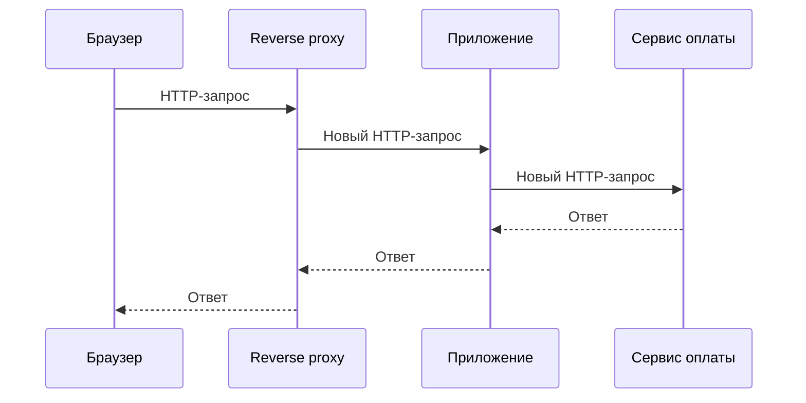

# Клиент-серверное взаимодействие: путь HTTPS-запроса

> [!info] Контекст
> Пользователь открывает `https://shop.example/orders/42`, но страница не загружается. В одном случае браузер сообщает об ошибке DNS, в другом — отклоняет сертификат, в третьем получает `502 Bad Gateway`, а в четвёртом приложение возвращает `500` с `request-id`. Это не варианты одной ошибки «сервер не отвечает»: запрос дошёл до разных границ системы.

[[../../MOC|К карте архитектуры]] · [[exercises|К упражнениям]]

## Результат главы

По записи Chrome DevTools, выводу `curl` и журналам proxy или приложения вы сможете:

1. восстановить пройденную часть пути от URL до ответа;
2. назвать участника, создавшего каждое наблюдение;
3. отделить подтверждённые события от предположений;
4. выбрать следующую проверку для первой неподтверждённой границы.

Глава даёт общую карту. Механика DNS, TCP и TLS разобрана в [[../02-dns-tcp-tls/02-dns-tcp-tls|следующей главе]], а структура HTTP-сообщений — в [[../03-http-messages-and-semantics/03-http-messages-and-semantics|главе 3]].

## Две модели одного запроса

В коде сетевое взаимодействие выглядит коротко:

```javascript
const response = await fetch(url);
const order = await response.json();
```

Эта модель описывает намерение программы: получить ресурс и обработать результат. Для диагностики нужна другая модель — последовательность независимых границ:

```text
URL
→ решение браузера об отправке запроса
→ разрешение имени
→ транспортное соединение
→ защищённый канал
→ HTTP-запрос
→ edge или reverse proxy
→ приложение
→ HTTP-ответ
→ обработка ответа браузером
```

Стрелка `fetch → server` не является одним физическим действием. Каждая граница может завершиться отдельно и оставляет собственные наблюдения.

## Клиент и сервер — роли

**Клиент** начинает конкретное взаимодействие. **Сервер** ожидает входящий запрос и отвечает по правилам протокола. Это роли, а не виды устройств.



Reverse proxy — сервер для браузера и клиент для приложения. Приложение — сервер для proxy и клиент для сервиса оплаты.

Слово «сервер» часто скрывает несколько разных сущностей:

| Сущность | Что это | Пример |
|---|---|---|
| Host | Машина или виртуальная машина | VM с сетевым интерфейсом |
| Process | Запущенная программа | `node`, `nginx` |
| Listener | Точка приёма соединений | `127.0.0.1:3000` |
| HTTP server | Компонент, принимающий HTTP-сообщения | `http.Server`, reverse proxy |
| Handler | Код, обрабатывающий маршрут | `GET /orders/:id` |

Из различий следуют разные диагнозы. `Connection refused` может означать, что на порту нет listener. `502` часто создаёт доступный proxy, которому не ответило приложение. `500` с записью в журнале приложения показывает, что его обработчик уже выполнялся.

## URL ещё не является сетевым адресом

Разберём URL:

```text
https://shop.example:443/orders/42?view=full#payment
```

- `https` задаёт схему и требования к защищённому взаимодействию;
- `shop.example` — имя узла, которое предстоит разрешить в адрес;
- `443` — порт; для HTTPS он обычно подразумевается;
- `/orders/42?view=full` участвует в формировании HTTP request target;
- `#payment` остаётся в браузере и в HTTP-запрос не входит.

URL сообщает браузеру, что запросить. Для соединения операционной системе понадобится пара `IP-адрес:порт`. Это разные представления одной цели, а не взаимозаменяемые названия.

## Базовый путь HTTPS-запроса

Рассмотрим новый запрос по HTTP/1.1 или HTTP/2: нужного ответа нет в локальном кэше, подходящее соединение ещё не открыто, а перед приложением находится обратный прокси-сервер.

### 1. Браузер решает, нужен ли запрос в сеть

До DNS браузер проверяет локальное состояние и политики. Ответ может уже находиться в HTTP-кэше; запрос может перехватить Service Worker; навигация может быть запрещена политикой безопасности.

Поэтому ввод URL не гарантирует появления сетевого пакета.

### 2. Имя преобразуется в возможные IP-адреса

Сетевой стек не соединяется с `shop.example` как со строкой. Сначала он получает один или несколько адресов через настроенный механизм разрешения имён. Результат может прийти из кэша.

Успешное разрешение имени ещё не доказывает доступность порта, корректность сертификата или работу приложения.

### 3. Клиент устанавливает транспортное соединение

Для HTTP/1.1 и HTTP/2 поверх HTTPS обычно используется TCP. Операционная система выбирает локальный адрес и временный порт, затем пытается установить соединение с удалённым `IP:port`.

Успешный `connect` подтверждает транспортную связь с удалённой точкой. Он не подтверждает HTTP-маршрут и запуск обработчика приложения.

> [!note] HTTP/3
> HTTP/3 переносит HTTP через QUIC поверх UDP. TLS 1.3 встроен в установление QUIC-соединения, поэтому отдельная цепочка `TCP → TLS` к HTTP/3 неприменима. Общий диагностический принцип сохраняется: сначала установите, какая версия протокола и какая граница действительно наблюдались.

### 4. TLS создаёт защищённый канал

Для HTTPS клиент и удалённая сторона согласуют параметры TLS. Клиент проверяет цепочку доверия сертификата и соответствие имени из URL.

Успешный TLS handshake подтверждает защищённый канал до TLS endpoint. В production этим endpoint часто является CDN или reverse proxy, а не процесс приложения.

### 5. Браузер отправляет HTTP-запрос

После установки канала браузер формирует HTTP-сообщение: метод, цель, поля и при необходимости тело. Отправка байтов не означает, что приложение уже обработало запрос. Между браузером и приложением могут находиться WAF, CDN, балансировщик нагрузки и обратный прокси-сервер.

### 6. Пограничный компонент принимает решение

Reverse proxy может:

- отклонить запрос самостоятельно;
- вернуть ответ из cache;
- выбрать upstream;
- открыть или переиспользовать отдельное соединение с приложением;
- заменить ошибку upstream собственным ответом.

Ответ `403`, `502` или `504` способен появиться до выполнения обработчика приложения.

### 7. Приложение обрабатывает отдельный входящий запрос

Когда запрос достигает приложения, HTTP-сервер разбирает сообщение и вызывает обработчик. В Node.js входящее тело представлено потоком: оно может приходить частями, а клиент может разорвать соединение до завершения чтения или отправки ответа.

Запись `request started` с идентификатором подтверждает вход в приложение. Она не подтверждает фиксацию бизнес-операции. Запись `response finished` подтверждает работу server-side API, но сама по себе не доказывает получение всего ответа браузером.

### 8. Ответ проходит обратный путь

Прокси-сервер может изменить поля, сжать тело, сохранить результат в кэше или заменить ответ. Браузер способен получить статус и только часть тела.

Следовательно, `200 OK` и полностью полученный ответ — разные события.

### 9. Браузер интерпретирует ответ

При навигации браузер обрабатывает документ и создаёт запросы к CSS, JavaScript, изображениям и API. Один введённый URL не равен одному HTTP-запросу, а успешный ответ документа не доказывает успешный рендеринг страницы.

## Путь зависит от уже накопленного состояния

Последовательность выше — не обязательный ритуал перед каждым запросом.

| Состояние | Что может не выполняться заново |
|---|---|
| Ответ найден в browser cache | DNS, соединение, TLS и запрос к origin |
| Сохранён DNS result | Новый DNS lookup |
| Открыто подходящее соединение | TCP и TLS handshake |
| Запрос перехватил service worker | Обращение к сети вообще |
| TLS завершает proxy | TLS защищает участок только до proxy; дальше начинается отдельный hop |

Если в DevTools отсутствует отдельное время DNS или подключения, сначала проверьте reuse и cache. Отсутствие строки не доказывает, что зависимость между этапами исчезла.

## Что можно увидеть в Chrome DevTools

Откройте **Network**, включите **Preserve log** и **Disable cache**, затем перезагрузите `https://example.com/`. Выберите запрос типа `document`.

В **Headers** важны:

- полный Request URL;
- Request Method;
- Status Code;
- Remote Address.

`Remote Address` показывает сетевую точку, к которой подключился браузер. Это может быть CDN или proxy.

В **Timing** этапы имеют ограниченный смысл:

| Поле | Что наблюдает браузер | Чего из него нельзя вывести |
|---|---|---|
| Queueing / Stalled | Ожидание внутри браузера | Время работы приложения |
| DNS Lookup | Разрешение имени | Доступность HTTP endpoint |
| Initial connection | Установление соединения | Запуск handler |
| Request sent | Передачу запроса | Получение запроса приложением |
| Waiting (TTFB) | Время до первого байта ответа | Чистое время backend-кода |
| Content Download | Получение тела | Успешный рендеринг страницы |

TTFB включает сетевую задержку, работу промежуточных компонентов и приложения. Выделить из него время handler можно только по server-side telemetry.

## Что можно увидеть через `curl`

Следующая команда принудительно использует HTTP/1.1 и показывает события соединения и HTTP-обмена:

```bash
curl --http1.1 --verbose --output /dev/null https://example.com/
```

Verbose output записывается в `stderr`. Конкретные строки зависят от версии и окружения, но в нём можно найти:

```text
имя разрешено
→ выбран удалённый адрес
→ соединение установлено
→ TLS handshake завершён
→ request отправлен
→ response status получен
```

Если окружение использует outbound proxy, trace покажет дополнительный endpoint и, для HTTPS, возможно `CONNECT`. Это часть реального пути.

Для накопительных времён:

```bash
curl --http1.1 --silent --show-error --output /dev/null \
  --write-out 'dns=%{time_namelookup}\ntcp=%{time_connect}\ntls=%{time_appconnect}\nttfb=%{time_starttransfer}\ntotal=%{time_total}\nremote=%{remote_ip}:%{remote_port}\nstatus=%{http_code}\n' \
  https://example.com/
```

Все значения отсчитываются от начала операции. Чтобы получить приблизительную длительность отдельного интервала, вычитайте соседние накопительные значения. Это всё равно измерение со стороны `curl`, а не профилирование сервера.

## Диагностика по последней подтверждённой границе

Для каждого сбоя фиксируйте не предполагаемую причину, а последнее подтверждённое событие.

| Наблюдение | Что подтверждено | Что ещё не подтверждено |
|---|---|---|
| `Could not resolve host` | Попытка разрешения имени завершилась ошибкой | Соединение с HTTP endpoint |
| `Connection refused` | Получен явный транспортный отказ | Работа HTTP server и приложения |
| Connection timeout | Ожидаемое событие не наступило до deadline | Конкретная причина и состояние удалённой операции |
| Certificate mismatch | TLS endpoint доступен, проверка имени не пройдена | HTTP-обработка |
| `403` от CDN/WAF | Пограничный HTTP-компонент ответил | Запуск handler приложения |
| `502 Bad Gateway` | Proxy принял запрос и сообщил об upstream failure | Получил ли приложение запрос |
| `500` и совпадающий `request-id` в журнале | Запрос связан с приложением | Получил ли браузер полное тело ответа |
| `200`, затем обрыв тела | Status получен | Полное получение ответа |

Диагностический алгоритм:

1. Запишите URL, метод, время и correlation ID.
2. Назовите последнее наблюдаемое событие без объяснения причины.
3. Укажите, кто создал это наблюдение: браузер, ОС, proxy или приложение.
4. Назовите следующее ожидаемое событие.
5. Выберите проверку, которая различит хотя бы две правдоподобные причины: DNS output, `curl -v`, proxy log, application log или trace span.

Не начинайте с увеличения timeout или автоматического retry. Они меняют поведение системы до локализации сбоя и могут создать повторную операцию.

## Почему удалённый запрос не равен вызову функции

Обычный локальный вызов выполняется внутри одного процесса и имеет общий адресный простор. Сетевое взаимодействие пересекает процессы и машины, поэтому:

- сообщение может не дойти;
- ответ может потеряться после успешного выполнения операции;
- клиент и сервер имеют независимые часы и сроки ожидания;
- сериализация ограничивает передаваемые данные;
- промежуточный компонент может ответить вместо приложения;
- клиент не видит удалённый exception, пока сервер не превратит его в протокольный результат.

После timeout клиент может не знать, выполнил ли сервер операцию. Эта неопределённость станет центральной темой главы о retries и idempotency.

## Проверка результата

Возьмите незнакомый trace и без текста главы выполните три действия:

1. Нарисуйте только подтверждённые границы пути.
2. Для каждого вывода укажите источник наблюдения и хотя бы один вывод, который из него не следует.
3. Предложите следующую проверку для первой неподтверждённой границы.

Перенос: повторите разбор для cached response, reused connection и TLS termination на proxy. Если схема в каждом случае остаётся одинаковой, вы воспроизводите список, а не анализируете фактический путь.

## Related Topics

- [[../02-dns-tcp-tls/02-dns-tcp-tls|DNS, TCP и TLS]] — как имя превращается в защищённое соединение.
- [[../03-http-messages-and-semantics/03-http-messages-and-semantics|HTTP-сообщения и семантика]] — что именно передают по установленному каналу.
- [[../04-browser-state-and-security/04-browser-state-and-security|Состояние браузера и границы безопасности]] — почему браузер может отправить запрос, но не открыть ответ JavaScript.

## Sources

- [Chrome DevTools: Network features reference](https://developer.chrome.com/docs/devtools/network/reference) — запись запросов, cache controls, Headers и Timing.
- [curl man page: `--write-out`](https://curl.se/docs/manpage.html#-w) — определения `time_namelookup`, `time_connect`, `time_appconnect`, `time_starttransfer` и `time_total`.
- [Node.js: Anatomy of an HTTP Transaction](https://nodejs.org/en/learn/http/anatomy-of-an-http-transaction) — listener, handler, request/response и потоковое тело запроса.
- [RFC 9110: HTTP Semantics](https://www.rfc-editor.org/rfc/rfc9110.html) — роли клиента, сервера и intermediary, структура HTTP-взаимодействия.
- [RFC 9114: HTTP/3](https://www.rfc-editor.org/rfc/rfc9114.html) — HTTP поверх QUIC и использование TLS 1.3.
