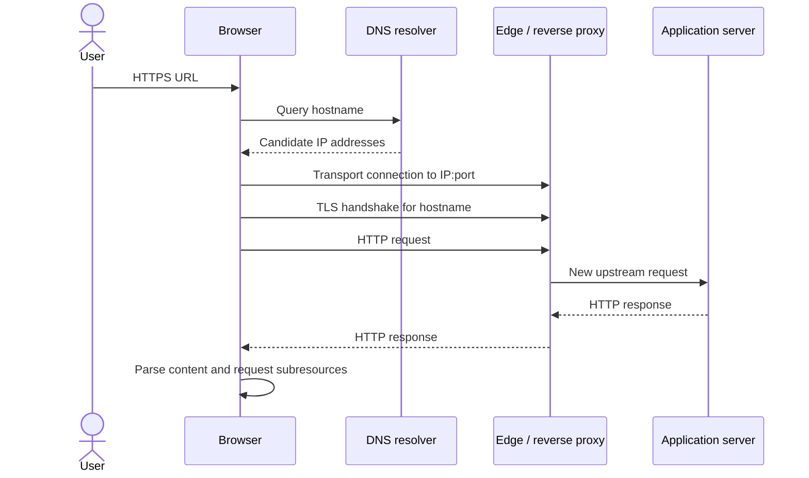

# Клиент-серверная модель: путь запроса от URL до ответа

> [!info] Практический сценарий
> Пользователь вводит `https://shop.example/orders/42?view=full` и видит ошибку. В одном случае browser пишет `ERR_NAME_NOT_RESOLVED`, в другом показывает предупреждение о certificate, в третьем получает `502 Bad Gateway`, в четвёртом — `500` с `request-id`. Фраза «server не отвечает» смешивает четыре разные границы. Задача главы — научиться восстанавливать реальный путь запроса и локализовать, что уже произошло, а что ещё не доказано.

[[../../MOC|К карте архитектуры]] · [[exercises|К упражнениям]]

## Контракт главы

**Условия:** дана навигация по HTTPS URL, запись Chrome DevTools Network, `curl` trace или логи одного из участников.

**Наблюдаемый результат:** вы можете сверху вниз восстановить путь до HTTP response, назвать вход и выход каждого этапа, а затем ограничить диагноз последней подтверждённой границей.

К концу главы вы должны уметь:

1. объяснить путь `URL → browser policy/cache → DNS → IP:port → transport → TLS → HTTP → edge/proxy → application → response`;
2. различить server как роль, host как машину, process как программу, listener как сетевую точку входа и handler как application code;
3. связать поля DevTools и `curl` с конкретными этапами;
4. объяснить, почему HTTP status, transport error и browser policy error — разные классы исходов;
5. обосновать, почему network call нельзя моделировать как обычный вызов функции.

### Что намеренно оставлено следующим главам

Эта глава строит **end-to-end карту**, но не разбирает внутренние алгоритмы каждого участка. [[../02-dns-tcp-tls/02-dns-tcp-tls|Следующая глава]] углубляет DNS cache, sockets, TCP handshake, reliable byte stream и TLS handshake. `03-http-messages-and-semantics.md` разберёт methods, fields, status codes и conditional requests. Browser security, caching, retries и production infrastructure получат собственные главы.

Граница важна: здесь недостаточно назвать этап, но и не нужно запоминать TCP flags, структуру TLS records или все DNS record types.

## Две модели одного запроса

Fullstack-разработчик обычно видит логическую модель:

```text
fetch(url) → request → handler → response → await response
```

Сеть выполняет более длинную работу:

```text
name resolution
→ выбор endpoint
→ создание transport channel
→ защита channel
→ передача protocol messages
→ обработка независимыми процессами
→ обратная передача response
```

Обе модели полезны, но отвечают на разные вопросы.

- **Application model** объясняет intent: какой resource запросили и какой outcome вернулся.
- **Network model** объясняет delivery: как bytes дошли до нужной сетевой точки и где могли потеряться, задержаться или быть отвергнуты.

Главная ошибка поверхностной модели — считать логическую стрелку `browser → server` одним физическим действием. На практике каждая стрелка пересекает независимую границу и даёт собственное evidence.

## Client и server — роли, а не устройства

**Client** инициирует конкретное взаимодействие. **Server** ожидает входящее взаимодействие на известной границе и отвечает в рамках protocol.

Один process может менять роль:

```text
Browser             Reverse proxy           Application          Payment API
client       →       server
                    client          →       server
                                          client        →        server
```

Поэтому утверждение «server сделал request» не противоречиво: application server выступает client по отношению к payment API.

### Пять сущностей, которые нельзя называть одним словом server

| Сущность | Что это | Пример |
|---|---|---|
| **Host** | Машина или virtual machine с OS и network interfaces | VM с IP address |
| **Process** | Выполняющаяся программа | process `node` или `nginx` |
| **Listener** | Socket, принимающий соединения на local address и port | `127.0.0.1:3000` |
| **HTTP server** | Компонент, который разбирает HTTP message и формирует response | Node `http.Server`, reverse proxy |
| **Handler** | Application code для конкретного method/route | `GET /orders/:id` |

`Connection refused` может означать, что host достижим, но на port нет listener. `502` может означать, что edge HTTP server доступен, но он не получил response от upstream process. `500` может означать, что handler действительно начал выполняться. Эти исходы требуют разных проверок.

## URL: инструкция browser, а не готовый сетевой адрес

Разберём URL:

```text
https://shop.example:443/orders/42?view=full#payment
\___/   \__________/ \_/\________/ \_______/ \_____/
scheme     hostname   port    path      query    fragment
```

- `scheme` задаёт способ доступа и protocol expectations; `https` требует защищённого соединения;
- `hostname` — имя, которое нужно разрешить в один или несколько IP addresses;
- `port` выбирает listener на удалённом endpoint; для HTTPS default port — `443`;
- `path` и `query` участвуют в выборе HTTP resource и handler;
- `fragment` используется browser внутри документа и не входит в HTTP request target.

URL может не содержать явный port, но connection всегда направлено на конкретный port. Default value выводится из scheme.

### URL, origin и endpoint отвечают на разные вопросы

| Понятие | Состав | На какой вопрос отвечает |
|---|---|---|
| URL | scheme, authority, path, query, fragment и другие допустимые компоненты | Какой resource и каким способом адресован? |
| Origin | `scheme + hostname + port` | Какая browser security boundary применяется? |
| Network endpoint | `IP address + port` для выбранного transport | К какой сетевой точке подключаться сейчас? |

`https://shop.example/orders/42` и `https://shop.example/cart` имеют один origin, но разные URLs. Один hostname может разрешаться в несколько IP addresses. Один IP address может обслуживать множество hostnames. Поэтому равенство URL, origin и endpoint нельзя подменять друг другом.

Origin станет центральным понятием в главе о same-origin policy и CORS. Здесь достаточно видеть, почему browser знает origin до отправки request.

## Protocol layering: зачем путь разделён на слои

Beej формулирует базовую идею сети как обмен произвольными bytes между программами, которым нужны identification, routing и integrity mechanisms. Один protocol не решает все задачи сразу, поэтому используется protocol stack.

| Уровень модели | Что передаёт или определяет | Основная ответственность | Чего не гарантирует |
|---|---|---|---|
| HTTP | request/response semantics | Method, target, fields, content, status | Доставку bytes и identity удалённого process |
| TLS | Защищённые records | Confidentiality, integrity, server authentication | Успех HTTP operation или авторизацию пользователя |
| TCP для HTTP/1.1 и HTTP/2 | Ordered byte stream между endpoints | Упорядочивание, retransmission и flow control в рамках connection | Deadline доставки, живость remote application и business outcome |
| IP | Packets между IP addresses | Маршрутизация packets через сети | Доставку, порядок и отсутствие дубликатов |
| Link layer | Frames на одном физическом участке | Передачу до следующего сетевого узла | End-to-end доставку до application |

Application передаёт данные OS через network API. OS и network interface инкапсулируют данные: добавляют metadata своего уровня, передают их дальше, а принимающая сторона снимает соответствующие оболочки. Router не обязан понимать `/orders/42`; ему достаточно network-layer information. HTTP handler не обязан знать, шли packets по Wi-Fi или Ethernet.

### Packet switching: между client и server нет выделенного провода

Internet — packet-switched network. Данные делятся на packets и используют links вместе с трафиком других программ. Packets могут идти через несколько routers, задерживаться, теряться или приходить не в том порядке. TCP скрывает часть этой сложности от HTTP и предоставляет ordered byte stream, но не превращает сеть в локальную память.

Эта деталь объясняет variance latency: два одинаковых HTTP requests не обязаны пройти путь за одинаковое время, даже если application code не изменился.

> [!note] HTTP/3
> HTTP/3 переносит те же HTTP semantics через QUIC. QUIC работает поверх UDP и включает TLS 1.3 в установление transport connection, поэтому отдельная последовательность `TCP handshake → TLS handshake` к нему неприменима. Для первой карты мы принудительно наблюдаем HTTP/1.1, чтобы границы TCP и TLS были видны; переносимые выводы — роли, HTTP semantics и необходимость transport/security boundary.

## Полный путь: fresh HTTPS navigation

Ниже рассматривается диагностический baseline:

- browser cache отключён;
- service worker не перехватывает navigation;
- готовое connection не переиспользуется;
- используется HTTP/1.1 или HTTP/2 поверх TCP/TLS;
- перед application находится edge HTTP proxy.

В реальном запуске часть этапов может отсутствовать или быть переиспользована. Это не опровержение модели, а отдельное решение конкретного участника.



### Этап 0. Browser решает, нужен ли network request

Ввод URL запускает navigation algorithm, а не безусловный вызов network API. До DNS browser может:

- нормализовать URL и определить default port;
- применить policy, например upgrade к HTTPS;
- найти пригодный response в browser cache;
- передать request service worker;
- заблокировать действие локальной security policy.

Если response пришёл из local cache или service worker, application server не участвовал. Чтобы наблюдать baseline в Chrome DevTools, включают **Disable cache** при открытом DevTools и проверяют, нет ли service worker intervention.

**Выход этапа:** browser решил выполнить network fetch и знает scheme, hostname, port и HTTP resource.

### Этап 1. Browser разрешает hostname

Network stack нужен IP address, а URL содержит hostname. Browser, OS и DNS resolver могут использовать свои caches; если готового результата нет, resolver выполняет DNS lookup. Ответ может содержать несколько IPv4/IPv6 candidates, а client выбирает пригодный address.

DNS отвечает на вопрос «какие addresses сейчас связаны с этим name?». Он не знает route `/orders/42`, не выбирает Node handler и не доказывает, что port `443` принимает connections.

В production DNS часто указывает не на application host, а на CDN, load balancer или reverse proxy. Поэтому IP из DevTools обычно является адресом **первой удалённой network boundary**, а не машины с business code.

**Выход этапа:** один или несколько candidate IP addresses.

**Failure boundary:** ошибка name resolution завершает fresh path до connection. Но отсутствие нового DNS event в trace может означать cache или reused connection, а не «DNS не используется».

### Этап 2. OS создаёт socket и выбирает endpoints

Browser обращается к socket API операционной системы. Для исходящего TCP connection важны две стороны:

```text
local IP : ephemeral port  ↔  remote IP : service port
```

Remote port обычно следует из URL scheme (`443` для HTTPS). Local ephemeral port выбирает OS. Вместе addresses, ports и transport protocol идентифицируют конкретное connection среди множества одновременных connections.

Port адресует не «программу вообще», а transport endpoint. Чтобы connection приняли, на remote address/port должен существовать listener либо network component, который пересылает трафик дальше.

**Выход этапа:** socket связан с выбранными local и remote endpoints.

### Этап 3. Устанавливается transport connection

Для HTTP/1.1 и HTTP/2 browser обычно устанавливает TCP connection. Handshake подтверждает, что стороны могут обмениваться transport data и создаёт состояние connection на обоих endpoints. После этого TCP предоставляет applications ordered byte stream.

Это ещё не HTTP success:

- certificate ещё не проверен;
- HTTP request ещё может не быть отправлен;
- application handler может находиться за другим connection;
- peer может закрыть transport сразу после установления.

`Connection refused` обычно отличается от timeout: отказ означает явный отрицательный ответ на попытку соединения, тогда как timeout означает отсутствие ожидаемого события до deadline. Но timeout сам по себе не называет root cause.

**Выход этапа:** transport channel до первого network peer.

### Этап 4. TLS защищает channel и связывает его с hostname

Для HTTPS client и peer выполняют TLS handshake. В упрощённой модели они:

1. согласуют TLS version и cryptographic parameters;
2. server предъявляет certificate chain;
3. client проверяет доверие, срок и соответствие certificate запрошенному hostname;
4. стороны получают keys для защищённого обмена;
5. через ALPN договариваются, например, об HTTP/1.1 или HTTP/2.

TLS защищает HTTP headers и body в transit. Router видит network metadata, но не должен видеть plaintext URL path и content. Если TLS завершается на reverse proxy, proxy расшифровывает HTTP request и создаёт отдельное upstream connection. Шифрование «до домена» не означает одно непрерывное encrypted connection до application process.

Certificate warning означает, что browser не принял server identity или параметры защищённого channel. Application handler обычно ещё не получил HTTP request.

**Выход этапа:** authenticated encrypted channel и выбранный application protocol.

### Этап 5. Browser формирует и отправляет HTTP request

Теперь browser кодирует HTTP request. В логическом виде он содержит:

```http
GET /orders/42?view=full HTTP/1.1
Host: shop.example
Accept: text/html
User-Agent: <browser>
```

HTTP/2 и HTTP/3 используют другой wire framing, но сохраняют request semantics: method, target, fields и content. Именно поэтому приложение можно обсуждать на уровне HTTP независимо от конкретной версии transport encoding.

Передача request не атомарна. Headers и body занимают bytes; большой upload может ещё идти, когда другая сторона уже приняла начало message. Если client disconnect произошёл во время body, handler или proxy может увидеть partial input.

**Выход этапа:** HTTP server получил достаточно bytes, чтобы разобрать request, либо exchange оборвался раньше.

### Этап 6. Edge принимает решение до application

Публичный endpoint часто принадлежит не application process. На пути могут находиться компоненты с пересекающимися названиями:

| Компонент | Типичная роль в этом path |
|---|---|
| CDN | Принимает request близко к client и может вернуть cached response |
| L4 load balancer | Распределяет transport connections, обычно не интерпретируя HTTP semantics |
| Reverse proxy / L7 load balancer | Завершает HTTP/TLS, применяет routing и создаёт upstream request |
| API gateway | Добавляет API-specific routing, authentication, limits и transformations |

Один продукт может выполнять несколько ролей. Диагностика должна опираться не на label «load balancer», а на фактическую boundary: завершает ли он TLS, видит ли HTTP, создаёт ли новый request, может ли ответить сам.

Edge может вернуть redirect, cached response, `403`, `429`, `502` или `504` без запуска application handler. Поэтому наличие HTTP response доказывает достижение **какого-то HTTP server**, но не конкретного process.

**Выход этапа:** edge response либо новый upstream request.

### Этап 7. Application server принимает upstream request

Application process обычно получает уже отдельный request от proxy. OS принимает connection на listener, HTTP implementation разбирает bytes и вызывает handler. Framework превращает эту работу в удобные objects, но transaction boundary остаётся:

- request method, target и headers уже пришли по сети;
- request body — входящий stream, а не мгновенно готовый object;
- response headers и body нужно записать и завершить;
- client или proxy может disconnect до завершения;
- handler может обратиться к database, cache или другому service и получить новый partial failure.

Application log с `request-id` — сильнее, чем browser status, потому что связывает конкретный request с конкретным process. Но строка «request started» ещё не доказывает commit business operation, а строка «response finished» не доказывает получение всех bytes browser.

**Выход этапа:** application response либо failure/termination на application boundary.

### Этап 8. Response проходит обратные границы

Application serializes status, fields и content в HTTP response. Proxy читает upstream response и может:

- изменить fields;
- сжать content;
- сохранить response в shared cache;
- заменить response собственной error page;
- оборвать downstream transfer при upstream failure.

Browser может получить status и только часть body. Поэтому «получен `200`» и «response полностью скачан» — разные события. Network tooling отдельно показывает time to first byte и content download.

**Выход этапа:** browser получил complete response либо зафиксировал interruption.

### Этап 9. Browser обрабатывает response и создаёт новые requests

Для navigation browser интерпретирует status и fields, декодирует body и начинает обработку документа. HTML часто ссылается на CSS, JavaScript, fonts, images и API data. Browser строит граф дополнительных requests, возможно к другим origins.

Следовательно:

```text
один введённый URL ≠ один HTTP request ≠ вся загрузка страницы
```

`200` для document не доказывает success subresources, JavaScript execution или application rendering. DevTools Network показывает requests, а не абстрактную «загрузку сайта» одной строкой.

## Наблюдение 1: Chrome DevTools как timeline границ

Откройте Chrome DevTools → **Network** и подготовьте fresh-like navigation:

1. включите **Preserve log**;
2. включите **Disable cache**;
3. очистите текущий log;
4. откройте `https://example.com/`;
5. выберите request типа `document`;
6. изучите **Headers** и **Timing**.

В **Headers → General** зафиксируйте:

- Request URL;
- Request Method;
- Status Code;
- Remote Address.

`Remote Address` — endpoint, к которому подключился browser. Это может быть CDN или proxy, а не application host.

В **Timing** Chrome может показать:

| Поле | Что измеряется | Важное ограничение |
|---|---|---|
| Queueing / Stalled | Ожидание внутри browser до передачи | Это не server processing |
| DNS Lookup | Name resolution | Может отсутствовать при cache/reuse |
| Initial connection | Connection establishment, включая TCP и SSL negotiation в представлении Chrome | Может отсутствовать на reused connection |
| Proxy negotiation | Согласование с configured proxy | Показывается только при соответствующем path |
| Request sent | Передача request | Не доказывает выполнение handler |
| Waiting (TTFB) | Время до первого byte response | Включает latency, intermediaries и server work |
| Content Download | Чтение response body | Не равно JavaScript/rendering time |

Сделайте второй reload. Если DNS и Initial connection исчезли или сократились, это evidence cache/reuse, а не нарушение порядка зависимостей.

> [!warning] Граница DevTools
> Network panel наблюдает browser model. Он не раскрывает каждый router hop, внутренний upstream request proxy или database call. Для этих границ нужны packet trace, proxy/application logs, metrics и distributed tracing.

## Наблюдение 2: curl отделяет события от времён

### Событийный trace

Принудительно используйте HTTP/1.1, чтобы увидеть последовательность TCP → TLS → HTTP:

```bash
curl --http1.1 --verbose --output /dev/null https://example.com/
```

Verbose trace идёт в `stderr`. Ищите evidence, а не точное совпадение строк:

```text
Host ... was resolved          # name resolution завершён
Trying <ip>:443                # выбран remote endpoint
Connected to ...               # transport connection установлен
TLS handshake / certificate    # защищённый channel согласован
> GET / HTTP/1.1               # request отправляется
< HTTP/1.1 200 OK              # response status получен
```

Если окружение использует outbound proxy, появятся proxy endpoint и `CONNECT`. Это дополнительная граница, а не шум, который нужно игнорировать.

### Cumulative timings

```bash
curl --http1.1 --silent --show-error --output /dev/null \
  --write-out 'dns=%{time_namelookup}\ntcp=%{time_connect}\ntls=%{time_appconnect}\nttfb=%{time_starttransfer}\ntotal=%{time_total}\nremote=%{remote_ip}:%{remote_port}\nstatus=%{http_code}\n' \
  https://example.com/
```

Все времена отсчитываются от начала operation:

- `time_namelookup` — name resolution завершён;
- `time_connect` — transport connection установлен;
- `time_appconnect` — TLS handshake завершён;
- `time_starttransfer` — получен первый response byte;
- `time_total` — transfer завершён.

Чтобы оценить интервалы, вычитайте соседние cumulative timestamps:

```text
TCP establishment ≈ time_connect - time_namelookup
TLS               ≈ time_appconnect - time_connect
request + RTT + server/edge wait
                  ≈ time_starttransfer - time_appconnect
download          ≈ time_total - time_starttransfer
```

Это диагностические приближения, не чистое измерение одного component. Например, TTFB объединяет request upload, network latency, queueing и обработку несколькими servers.

## Наблюдение 3: увидеть application boundary без framework

Создайте `server.mjs`:

```js
import { randomUUID } from "node:crypto";
import { createServer } from "node:http";

const server = createServer((request, response) => {
  const requestId = randomUUID();

  console.log("request:start", {
    requestId,
    method: request.method,
    target: request.url,
    host: request.headers.host,
    remoteAddress: request.socket.remoteAddress,
    remotePort: request.socket.remotePort,
  });

  request.on("aborted", () => {
    console.log("request:aborted", { requestId });
  });

  response.on("finish", () => {
    console.log("response:finish", {
      requestId,
      statusCode: response.statusCode,
    });
  });

  const body = JSON.stringify({ ok: true, requestId });

  response.writeHead(200, {
    "content-type": "application/json; charset=utf-8",
    "content-length": Buffer.byteLength(body),
    "x-request-id": requestId,
  });
  response.end(body);
});

server.listen(3000, "127.0.0.1", () => {
  console.log("listening on http://127.0.0.1:3000");
});
```

Запустите server и client в разных terminals:

```bash
node server.mjs
```

```bash
curl --verbose 'http://127.0.0.1:3000/orders?limit=2'
```

Этот локальный experiment намеренно исключает DNS и TLS: URL использует IP literal и scheme `http`. Он изолирует границу HTTP server.

Обратите внимание:

- process слушает `127.0.0.1:3000`;
- client подключается с local ephemeral port, который server видит как `remotePort`;
- Node handler получает `request.url` как path и query, а scheme/host доступны через другие данные;
- `response.end()` завершает запись response;
- event `finish` означает, что response передан OS для отправки, но не подтверждает, что client application прочитал body;
- один `requestId` связывает client-visible header и server logs.

Framework может скрыть эти details за `req`, `res`, middleware и return value, но физическая transaction boundary не исчезает.

## Почему network call не является обычным вызовом функции

Сравним локальный вызов и remote operation:

| Свойство | Локальный вызов функции | Network call |
|---|---|---|
| Передача аргументов | Значения доступны в одном address space по правилам runtime | Данные serializes в protocol message |
| Control flow | Общий call stack | Независимые event loops/processes, общего stack нет |
| Время | Обычно мало по сравнению с network latency | Queueing, packet transfer и remote work дают variable latency |
| Ошибка | Return/throw в одном runtime | DNS, connection, TLS, protocol, proxy, application и downstream failures |
| Состояние caller/callee | Обычно судьба одного process | Один участник может продолжить после timeout или disconnect другого |
| Подтверждение | Return означает завершение callee | Отсутствие response не доказывает, что operation не выполнена |

Особенно опасна последняя строка:

```text
client отправил request
→ application выполнил operation
→ response потерялся
→ client получил timeout
```

Для client это не confirmed success, но и не confirmed failure. Автоматический retry может повторить side effect. Idempotency и retry policy разбираются в `06-reliable-client-server-interaction.md`; здесь важно увидеть, откуда возникает неопределённость.

Remote exception также не «всплывает» в browser. Application должна превратить outcome в HTTP response, закрытие connection или отсутствие response. Если process crash произошёл до serialization, client увидит не JavaScript stack trace, а network/protocol symptom.

## Failure matrix: что дошло до какой границы

| Наблюдение | Последняя подтверждённая граница | Достигнут ли edge HTTP server? | Достигнут ли application handler? |
|---|---|---|---|
| Response from browser cache / service worker | Local browser component | Нет необходимости | Нет необходимости |
| `ERR_NAME_NOT_RESOLVED` / `Could not resolve host` | Browser/OS resolver attempt | Обычно нет для fresh path | Нет |
| `Connection refused` | Transport stack получил явный отказ; его мог создать destination или network policy | HTTP не доказан | Нет |
| Connection timeout | Attempt начат, ожидаемое transport event не наступило до deadline | Неизвестно | Неизвестно, обычно не доказано |
| Certificate mismatch | TLS peer доступен, identity check не пройден | TLS endpoint достигнут | HTTP handler обычно не достигнут |
| HTTP `403` от CDN/WAF | Edge HTTP response получен | Да | Не обязательно |
| HTTP `502 Bad Gateway` | Proxy получил request и сообщил upstream failure | Да | Неизвестно |
| HTTP `504 Gateway Timeout` | Gateway не получил ожидаемый upstream response вовремя | Да | Handler мог выполняться |
| HTTP `500` + application `request-id` в log | Application сформировала или связала response | Да | Да |
| HTTP `200`, body оборвался | Status получен, transfer не завершён | Да | Operation могла завершиться |
| Browser блокирует чтение cross-origin response | Server response мог прийти, browser policy ограничила caller | Возможно | Возможно |

Слова `usually`, `could` и `unknown` здесь принципиальны. Architecture и connection reuse меняют путь. Например, status `500` без request correlation не доказывает, что его создало именно application: proxy тоже способен сформировать `500`.

### Метод диагностики: last confirmed boundary

Для любого incident задайте пять вопросов:

1. **Что инициировал client?** Полный URL, method, время, request ID.
2. **Какое событие подтверждено последним?** DNS result, connection, TLS, sent request, response status, complete body.
3. **Какой participant создал evidence?** Browser, OS, proxy или application.
4. **Какое следующее событие ожидалось?** Это первая неподтверждённая граница.
5. **Какой probe различит две причины?** DNS output, `curl -v`, packet capture, edge log, application log или trace span.

Не начинайте с изменения timeout или retry. Они меняют поведение системы до локализации failure и могут скрыть или усилить проблему.

## Распространённые заблуждения

### 1. «DNS находит server»

DNS возвращает candidate IP addresses. Он не проверяет port, TLS certificate, HTTP route или здоровье application process. В production address часто принадлежит edge.

### 2. «Соединение установлено — request дошёл до handler»

Transport connection заканчивается на network peer. После него остаются TLS, HTTP parsing, edge policy, upstream routing и передача application. `Connected` — evidence только transport boundary.

### 3. «HTTPS — это HTTP после полного TCP/TLS пути для любой версии»

Это корректная модель HTTP/1.1 и HTTP/2. HTTP/3 использует QUIC, где TLS 1.3 интегрирован в transport establishment. HTTP semantics остаются, transport mechanics отличаются.

### 4. «Status `4xx`/`5xx` означает network failure»

Status существует только внутри HTTP response. Он доказывает, что некоторый HTTP server разобрал достаточно request, чтобы ответить. Кто именно ответил — определяется headers, routing и logs, а не классом status.

### 5. «TTFB — это время работы backend handler»

TTFB включает часть client work, request transfer, network round trips, edge queueing, upstream work и время до первого byte. Без server-side span это не чистый backend latency.

## Вопросы для собеседования

1. Что именно происходит после ввода HTTPS URL до отправки HTTP request?
2. Чем hostname, IP address, port, listener и handler отличаются друг от друга?
3. Почему client и server — роли, а reverse proxy играет обе роли?
4. Зачем network stack разделён на HTTP, TLS, transport, IP и link layer?
5. Что доказывает DNS response и чего он не доказывает?
6. Что доказывает `Connected to ...` в `curl --verbose`?
7. Почему browser может не выполнять DNS lookup при повторном request?
8. Как TLS termination на proxy меняет path до application?
9. Чем L4 load balancer концептуально отличается от HTTP reverse proxy?
10. Почему IP в DevTools Remote Address может не принадлежать application host?
11. В какой момент application server получает method, target, headers и body?
12. Почему request body нельзя считать мгновенно готовым object?
13. Может ли client получить HTTP `502`, если application handler не запускался?
14. Почему `200` не доказывает complete response и успешный page render?
15. Из каких интервалов складывается TTFB?
16. Почему timeout не доказывает, что remote operation не выполнена?
17. Каким evidence вы свяжете browser request с application log?
18. Как найти last confirmed boundary при incident?

## Свидетельства результата

Глава достигла цели, если без текста перед глазами вы можете выполнить три действия.

### 1. Нарисовать path с вариантами

Для fresh HTTPS navigation покажите DNS, transport, TLS, HTTP, edge и application. Затем измените схему для:

- cached response;
- reused connection;
- TLS termination на proxy;
- HTTP/3.

### 2. Прочитать реальные наблюдения

По DevTools или `curl` trace назовите:

- remote endpoint;
- последнюю подтверждённую boundary;
- первую неподтверждённую boundary;
- минимум два вывода, которые evidence **не** позволяет сделать.

### 3. Диагностировать, а не угадывать

Для `DNS error`, certificate failure, `502`, `500` и interrupted body выберите следующий probe и объясните, какие две причины он различает. Практика находится в [[exercises|sibling exercises.md]].

## Related Topics

- [[../../MOC|Архитектура: карта решений]] — client-server boundary как отдельный маршрут перед HTTP API и production design.
- [[../02-dns-tcp-tls/02-dns-tcp-tls|Следующая глава: DNS, IP, port, TCP и TLS]] — connection и гарантии transport/security layers.
- Затем: `03-http-messages-and-semantics.md` — точная структура и semantics HTTP messages.
- Browser policy: `04-browser-state-and-security.md`.
- Caching и partial failures: `05-http-caching.md` и `06-reliable-client-server-interaction.md`.

## Sources

- [Beej’s Guide to Network Concepts](https://beej.us/guide/bgnet0/html/) — packet switching, client/server architecture, sockets, protocol layering, IP/ports, DNS и TCP overview.
- [Kurose & Ross: Computer Networking — A Top-Down Approach, 9th Edition](https://gaia.cs.umass.edu/kurose_ross/) — top-down организация application, transport и network layers.
- [Kurose & Ross: Wireshark Labs](https://gaia.cs.umass.edu/kurose_ross/wireshark.php) — наблюдение HTTP, DNS, TCP и TLS как реальных message exchanges.
- [MDN: How the web works](https://developer.mozilla.org/en-US/docs/Learn_web_development/Getting_started/Web_standards/How_the_web_works) — общий путь navigation, DNS, HTTP и resources страницы.
- [MDN: Overview of HTTP](https://developer.mozilla.org/en-US/docs/Web/HTTP/Guides/Overview) — user-agent, proxies, server, messages, connections и HTTP layering.
- [MDN: Origin](https://developer.mozilla.org/en-US/docs/Glossary/Origin) — origin как `scheme + hostname + port`.
- [MDN: Transport Layer Security](https://developer.mozilla.org/en-US/docs/Web/Security/Defenses/Transport_Layer_Security) — encryption, integrity, authentication и TLS handshake.
- [Chrome DevTools: Network features reference](https://developer.chrome.com/docs/devtools/network/reference) — Network panel, Remote Address и Timing phases.
- [curl man page: `--write-out`](https://curl.se/docs/manpage.html#-w) — semantics `time_namelookup`, `time_connect`, `time_appconnect`, `time_starttransfer` и `time_total`.
- [Node.js: Anatomy of an HTTP Transaction](https://nodejs.org/en/learn/http/anatomy-of-an-http-transaction) — listener, request/response objects, method, URL, headers и streaming body.
- [RFC 9114: HTTP/3](https://www.rfc-editor.org/rfc/rfc9114.html) — HTTP semantics over QUIC и интеграция TLS 1.3 в transport layer.
