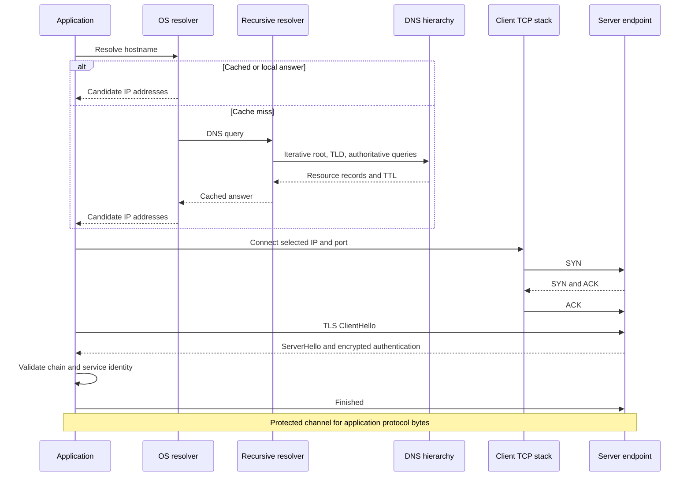

# DNS, IP, port, TCP и TLS: как клиент находит сервер и подключается

> [!info] Практический сценарий
> `https://api.example.com:443/orders` открывается на ноутбуке, но container получает `ENOTFOUND`. После подстановки найденного IP ошибка меняется на certificate mismatch. На другом host тот же вызов заканчивается общим `timeout`. Все три сообщения звучат как «не удалось подключиться», но подтверждают разные границы. В этой главе мы превратим hostname в наблюдаемый защищённый channel и научимся точно называть последний завершённый этап.

[[../../MOC|К карте архитектуры]] · [[../01-client-server-request-lifecycle/01-client-server-request-lifecycle|Предыдущая глава]] · [[exercises|К упражнениям]]

## Контракт главы

**Условия:** дан HTTPS hostname и port, а также output `dns.lookup()`, `dig`, `net.Socket`, `openssl s_client` или client error.

**Наблюдаемый результат:** вы можете восстановить путь `hostname → candidate IP addresses → выбранный IP:port → TCP connection → TLS channel`, различить ответственность каждого механизма и ограничить диагноз последней подтверждённой границей.

После главы вы должны уметь:

1. различать hostname, IP address, port, socket, endpoint и connection;
2. объяснять recursive и iterative части DNS resolution, роль cache и TTL;
3. читать TCP three-way handshake как синхронизацию состояния двух endpoints;
4. точно формулировать гарантии reliable ordered byte stream и их границы;
5. объяснять, зачем после TCP нужен TLS и что проверяет certificate validation;
6. разделять DNS, TCP и TLS failures даже тогда, когда внешний API возвращает один `timeout`.

### Предварительные знания

Нужна end-to-end карта из [[../01-client-server-request-lifecycle/01-client-server-request-lifecycle|первой главы]]: URL, client/server roles, listener, fresh/reused path и last confirmed boundary. Достаточно уметь запускать Node.js и читать terminal output. Реализация DNS server, TCP stack или cryptography не требуется.

### Что намеренно не входит в главу

Мы не разбираем packet headers, routing protocols, NAT, TCP congestion control, DNSSEC, certificate issuance и внутреннее устройство cipher algorithms. DNS transport через UDP/TCP/DoH, TLS resumption и QUIC будут обозначены только как варианты, меняющие отдельные стрелки. Структура HTTP messages начинается в следующей главе.

## Центральный механизм: три преобразования вместо одной стрелки

Строка `api.example.com:443` ещё не указывает на process. Client последовательно получает три разных результата:

```text
hostname
  -- name resolution --> candidate IP addresses
  -- endpoint choice --> selected IP address + port
  -- TCP --> bidirectional ordered byte stream
  -- TLS --> authenticated and protected channel
```

У каждого преобразования свой input, output и класс ошибок.

| Этап | Input | Успешный output | Чего успех не доказывает |
|---|---|---|---|
| Name resolution | hostname и record type | один или несколько candidate IP addresses | достижимость любого address |
| Endpoint choice | candidates, address family, policy, port | конкретный remote endpoint | наличие listener |
| TCP | local endpoint и remote endpoint | connection state и ordered byte stream | identity server или encryption |
| TLS | byte stream, reference hostname, trust policy | negotiated keys и проверенная secure channel | HTTP status или business outcome |

Эта последовательность описывает **fresh TCP/TLS path**. Cache может убрать network DNS query, а pool может переиспользовать уже открытый channel. Поэтому это dependency order, а не утверждение, что каждый HTTP request выполняет все этапы заново.

## Один path как обмен сообщениями



Диаграмма показывает logical messages, а не обязательное соответствие «одна стрелка — один packet». TCP может объединять данные, retransmit segments и выбирать размеры segments независимо от application.

## Hostname и IP address отвечают на разные вопросы

**Hostname** — имя в namespace. Для DNS имя выбирает набор resource records. Оно удобно как стабильная application-facing identity, даже если deployment меняет addresses.

**IP address** — network-layer address, по которому IP routing доставляет packets к следующему destination. Он не является process ID и не доказывает, какая application получит bytes.

Связь не обязана быть один-к-одному:

- один hostname может иметь несколько `A` и `AAAA` records;
- несколько hostnames могут вести к одному IP address;
- `CNAME` может направить lookup к другому canonical name;
- anycast может объявлять один IP из нескольких физических locations;
- reverse proxy или CDN может принимать connections для множества services на одном address.

`A` содержит IPv4 address, `AAAA` — IPv6 address. `CNAME` содержит alias на другое DNS name, а не готовый IP. Client или resolver следует chain до address records, проверяя limits и ошибки.

> [!warning] IP не равен server identity
> DNS answer сообщает, куда попробовать отправить packets. TLS отдельно проверяет, соответствует ли представленная service identity имени, которое хотел client. Успешный connect к IP без проверки hostname оставляет возможность подключиться не к тому service.

### Candidate не означает selected

Resolver может вернуть несколько IPv4 и IPv6 addresses. Client выбирает порядок попыток и может запускать их с небольшим overlap, чтобы один недоступный address family не задержал connection. Поэтому два clients с одинаковым DNS answer могут выбрать разные remote addresses.

При incident нужно записывать не только hostname, но и фактически выбранные `remoteAddress` и `remotePort`. Список DNS answers объясняет candidates; socket tuple показывает состоявшийся выбор.

## DNS: распределённый поиск typed records

DNS — распределённая hierarchical database. Query содержит как минимум имя и type требуемой информации. Для HTTPS path чаще всего нужны `A` и/или `AAAA`, но DNS не ограничен address records.

Три участника часто скрыты за словом «DNS»:

1. **Application resolver API** — например, browser API или Node `dns.lookup()`.
2. **Stub/OS resolver** — использует OS name-service configuration, локальные правила и configured recursive resolver.
3. **Recursive resolver** — возвращает готовый answer client и при cache miss сам проходит DNS hierarchy.

Authoritative name server отвечает за данные своей zone. Root server не хранит IP каждого сайта: он направляет resolver к servers следующего уровня. TLD server, например для `.com`, направляет к authoritative servers нужного domain. Затем authoritative server возвращает record или authoritative negative answer.

### Recursive и iterative — разные отношения

Обычный laptop отправляет recursive query configured resolver: «верни конечный answer». Recursive resolver выполняет дальнейшую работу от имени client.

Между resolver и hierarchy чаще используется iterative pattern:

```text
root:          спроси servers зоны com
com TLD:       спроси authoritative servers example.com
authoritative: вот A и AAAA для api.example.com
```

Это не означает, что каждый lookup достигает root. Cache на любом подходящем resolver сокращает путь.

### Где может находиться cache

Name resolution state может существовать в нескольких местах:

- browser или application;
- OS resolver и name-service components;
- local network resolver;
- recursive resolver провайдера или организации;
- intermediate DNS infrastructure.

Record TTL задаёт, сколько DNS cache может считать record пригодным без refresh. TTL не гарантирует, что application будет хранить answer ровно столько: component может применить собственные limits, а open connection продолжает существовать независимо от истечения DNS TTL.

Negative answers также могут cache-ироваться. Повторный `NXDOMAIN` поэтому не доказывает, что authoritative server опрашивался сейчас.

### `dns.lookup()` и DNS query — не синонимы

В Node.js это различие наблюдаемо:

- `dns.lookup()` использует OS name-resolution facilities, как большинство applications. Answer может прийти из `/etc/hosts`, NSS, local cache или DNS;
- `dns.resolve4()`, `dns.resolve6()` и другие `resolve*()` отправляют queries настроенному DNS server через DNS client implementation Node и не используют `/etc/hosts` как `lookup()`.

Поэтому `dig example.com` и `dns.lookup('example.com')` могут вернуть разные наборы или порядок addresses. `dig` показывает DNS protocol view; `lookup()` лучше отражает то, что получит обычный Node connection на этом host.

> [!note] DNS тоже использует сеть
> Фраза «DNS выполняется до TCP» относится к TCP connection с целевым HTTPS endpoint. Сам DNS traffic обычно использует UDP и при необходимости TCP; browser также может использовать DNS over HTTPS. Детали transport DNS не нужны для диагностики этой главы: сначала отделите name resolution от connection к application endpoint.

### Что означает DNS success

DNS success доказывает только получение применимого answer в наблюдаемом resolution path. Он не доказывает:

- что выбранный IP доступен из текущей network namespace;
- что port открыт;
- что answer одинаков во всех regions, containers или resolvers;
- что cache уже увидел недавнее изменение zone;
- что endpoint предъявит certificate для исходного hostname.

## Port: выбор transport service на host

IP доставляет packet к network endpoint host или intermediary. **Port** позволяет transport protocol демультиплексировать traffic к подходящему socket state.

TCP port — unsigned 16-bit number от `0` до `65535`. Для public HTTPS conventional default — `443`, но scheme только выбирает default: service может слушать другой port.

Важные границы:

- port number имеет смысл вместе с transport protocol: TCP `443` и UDP `443` — разные namespaces;
- destination port выбирает listener, source port обычно временно назначает client OS;
- один port не является глобальным process ID;
- binding относится к local address и port: `127.0.0.1:3000` и `192.0.2.10:3000` — разные local endpoints;
- binding `0.0.0.0:3000` означает listen на подходящих local IPv4 interfaces, но `0.0.0.0` не является remote destination для production client.

Один listener `203.0.113.10:443` может принимать тысячи connections. Они различаются remote endpoints, хотя local port у всех один.

## Socket, endpoint и connection

Слово **socket** используют в двух близких смыслах:

1. OS/API object, через который process просит kernel создать, подключить, читать или писать transport state;
2. endpoint identity — IP address и port для конкретного transport.

Чтобы не смешивать их, в диагностике записывайте tuple явно.

```text
local socket  = local IP address + local port
remote socket = remote IP address + remote port
TCP connection = <local socket, remote socket>
```

Например:

```text
local  = 192.0.2.25:53144
remote = 203.0.113.10:443
```

`53144` — ephemeral source port текущего client connection. Следующий connection к тому же server может получить другой local port.

| Состояние | Что существует | Что ещё не существует |
|---|---|---|
| После создания socket object | local kernel/API handle | remote connection |
| После `bind()` | выбранный local endpoint | установленный peer |
| Server после `listen()` | listening socket | отдельная connection для конкретного client |
| После `accept()` | connected socket с полным tuple | гарантия application success |
| Client после успешного `connect()` | established TCP connection | TLS identity и secure channel |

Listening socket и accepted connected socket — разные objects. Listener остаётся на `:443`, пока каждое принятое connection получает собственное состояние и remote tuple.

## Почему DNS предшествует TCP connection к hostname

TCP SYN должен содержать destination IP address. Hostname нельзя поместить в IP destination field. Поэтому при fresh path client сначала получает candidate addresses, выбирает один и только затем начинает `connect()`.

Есть три важных исключения из слишком жёсткой формулировки:

- cached answer убирает новый network DNS query, но address всё равно должен быть известен;
- literal IP в configuration убирает hostname lookup, но усложняет service identity и deployment;
- уже открытое connection может быть reused без нового DNS и handshake.

DNS success и TCP success остаются независимыми facts. Первый даёт address data; второй подтверждает установленное transport state с конкретным endpoint.

## TCP connection: синхронизация двух endpoints

TCP — connection-oriented transport. До передачи обычного byte stream peers синхронизируют начальные sequence numbers и создают connection state.

### Three-way handshake

Для обычного active open:

```text
Client                                         Server
CLOSED                                         LISTEN
  |                                              |
  | SYN, client initial sequence number          |
  |--------------------------------------------->| SYN-RECEIVED
  |                                              |
  | SYN + ACK, server ISN, ack client ISN + 1    |
  |<---------------------------------------------|
  |                                              |
  | ACK, ack server ISN + 1                      |
  |--------------------------------------------->| ESTABLISHED
ESTABLISHED                                     |
```

`SYN` объявляет начало sequence space стороны. `ACK` подтверждает, какое следующее sequence number ожидается. Three-way handshake позволяет обеим сторонам подтвердить взаимную синхронизацию и снижает риск принять старые duplicate segments за новое connection.

`connect` event в Node означает, что local TCP stack считает connection установленным. Это не доказывает, что TLS handshake или application protocol уже начались.

### Connection определяется четырьмя значениями

Для обычного TCP flow identity включает:

```text
local IP, local port, remote IP, remote port
```

Поэтому один server port обслуживает множество connections:

```text
192.0.2.25:53144 → 203.0.113.10:443
192.0.2.26:49820 → 203.0.113.10:443
192.0.2.25:53145 → 203.0.113.10:443
```

Local и remote — относительные слова. Для server первое connection выглядит как `203.0.113.10:443 ↔ 192.0.2.25:53144`.

## Reliable ordered byte stream: точная гарантия TCP

RFC 9293 определяет TCP как reliable, in-order byte-stream service.

### Byte stream

Application пишет последовательность bytes. TCP может разделить её на segments иначе, чем были сделаны `write()` calls. Принимающая сторона может получить несколько writes одним read или один write несколькими reads.

```text
sender writes:    [ABC] [DEF]
receiver reads:   [A] [BCDE] [F]
```

TCP сохраняет порядок bytes, но не message boundaries. Framing должен определить application protocol — например, длиной, delimiter или grammar. HTTP делает это на своём уровне.

### Reliability

TCP использует sequence numbers, acknowledgements, checksum и retransmission, чтобы обнаруживать loss/corruption и восстанавливать stream, пока connection остаётся работоспособным. Duplicate transport segments не превращаются в duplicate bytes для receiving application.

Слово reliable не означает «доставка обязательно состоится». Если восстановить stream невозможно или endpoint сбросил state, application получает connection error. TCP также не имеет встроенной гарантии liveness: молча исчезнувший peer может обнаружиться только после traffic, retransmission limits, keepalive policy или application deadline.

### Ordered

Receiving application получает bytes в исходном порядке. Если ранний segment потерян, более поздние bytes могут ждать восстановления пропуска. Это сохраняет stream semantics, но может увеличить latency.

### Чего TCP не гарантирует

TCP не гарантирует:

- deadline доставки;
- постоянную доступность remote process;
- encryption или peer identity;
- границы application messages;
- HTTP response;
- выполнение business operation ровно один раз;
- знание client о том, обработал ли server уже отправленные bytes перед разрывом.

Последний пункт критичен для retries. Connection error после отправки request не откатывает remote handler. Эта проблема будет разобрана в главе о reliable interaction.

> [!note] Flow control и congestion control
> Flow control ограничивает sender возможностями receiver buffer; congestion control ограничивает нагрузку с учётом network path. Оба механизма влияют на throughput и latency, но их algorithms выходят за границы этой главы.

## TCP failures: отказ не равен timeout

### Connection refused

Если active open получает подходящий TCP reset, local API обычно сообщает `ECONNREFUSED`. Частая причина — на destination port нет listener. Reset также может сгенерировать firewall или другое network device, поэтому ошибка не доказывает конкретный process state без server-side evidence.

Тем не менее это **явный отрицательный transport result**: попытка дошла до компонента, который ответил reset. HTTP и TLS ещё не доказаны.

### Connection timeout

Timeout означает только: ожидаемое событие не произошло до выбранного deadline. Возможны packet loss, filtering, routing problem, недоступный host, перегрузка или слишком короткий deadline.

Один `ETIMEDOUT` без stage label не отвечает, ожидал ли client:

- DNS answer;
- SYN-ACK;
- TLS handshake message;
- application response bytes.

Чтобы timeout был диагностическим evidence, instrument должен записывать текущий stage и время перехода между stages.

### Reset после establishment

`ECONNRESET` после успешного connect доказывает больше: TCP connection успело существовать, а затем peer или intermediary сбросил его. Но без stage timestamps неизвестно, произошло это во время TLS handshake, после TLS или во время application exchange.

## Зачем после TCP нужен TLS

TCP решает delivery semantics byte stream, но bytes без TLS видимы и изменяемы для network attacker. TCP endpoint также не доказывает application service identity.

TLS строит secure channel поверх reliable ordered transport. Для web это даёт три свойства:

- **confidentiality** — application data после установления keys не читается наблюдателем network path;
- **integrity** — незаметное изменение protected records обнаруживается;
- **authentication** — client проверяет identity server; client certificate используется значительно реже и только когда protocol/deployment его требует.

TLS не авторизует пользователя в application и не гарантирует корректность business logic.

## TLS 1.3 handshake без магии

Для fresh full handshake с certificate-based server authentication основные сообщения таковы:

1. **ClientHello**: client предлагает TLS versions, cipher suites, key shares и extensions. Для web важны SNI с requested hostname и ALPN с application protocols, например `h2` и `http/1.1`.
2. **ServerHello**: server выбирает version и cryptographic parameters; key shares позволяют сторонам получить shared keying material.
3. **EncryptedExtensions**: server передаёт negotiated extension results, которые не нужны для создания первоначального cryptographic context.
4. **Certificate**: server предъявляет certificate chain или необходимые certificates.
5. **CertificateVerify**: signature private key связывает certificate identity с transcript handshake.
6. **Finished**: authenticator transcript подтверждает negotiated secrets и целостность handshake.
7. Client проверяет chain, validity, signatures и service identity, затем отправляет свой `Finished`.
8. Стороны обмениваются protected application data через TLS record protocol.

После `ServerHello` handshake messages TLS 1.3 защищены handshake keys. Полный обычный TLS 1.3 handshake требует одного network round trip до возможности client отправлять обычные application data; HelloRetryRequest, external certificate checks и transport retransmissions могут добавить задержку.

TLS resumption может сократить handshake. `0-RTT` позволяет отправить early data раньше, но имеет weaker replay guarantees и не должен механически применяться к operations с side effects. Подробная retry/idempotency модель появится позже.

## Certificate validation: chain и name — две проверки

Certificate не является «пропуском, которому достаточно существовать». Client должен как минимум проверить:

1. certification path до доверенного trust anchor;
2. signatures и допустимые certificate constraints;
3. validity interval;
4. соответствие presented service identity исходному reference identifier, обычно hostname из URL;
5. доказательство владения private key через handshake messages.

Ошибка `unable to get local issuer certificate` относится к trust path. Ошибка hostname mismatch означает, что chain может быть cryptographically valid, но certificate не подтверждает requested service.

### DNS, SNI и identity verification не заменяют друг друга

Рассмотрим `https://api.example.com`:

- DNS выбирает candidate IP;
- TCP подключается к выбранному IP и port `443`;
- SNI `api.example.com` помогает multi-tenant TLS endpoint выбрать certificate/configuration;
- certificate verification сравнивает reference name `api.example.com` с permitted identifiers certificate;
- ALPN выбирает application protocol поверх TLS.

Подстановка IP в `connect` допустима только при сохранении reference hostname для SNI и identity check. В `curl` эту задачу решает `--resolve`; в Node `tls.connect()` нужно явно передать `servername`, потому что low-level API не включает SNI автоматически.

```text
connect destination: 203.0.113.10:443
SNI:                 api.example.com
verify identity:     api.example.com
```

Это три разных inputs. Нельзя отключать certificate verification, чтобы «починить DNS»: такой workaround удаляет security boundary вместо исправления resolution.

## Где заканчивается TLS protection

TLS защищает traffic между TLS peers. Если CDN или reverse proxy завершает TLS, browser аутентифицирует этот edge endpoint. Дальнейший hop к application имеет отдельное connection и отдельную security policy.

Поэтому успешный browser TLS handshake не доказывает:

- identity конкретного application process за proxy;
- encryption каждого internal hop;
- authorization request;
- успешный HTTP response;
- отсутствие logging plaintext на endpoints.

TLS также не скрывает весь metadata. IP addresses, ports, traffic timing и приблизительные объёмы остаются наблюдаемыми. Некоторые handshake fields могут быть видимы в зависимости от extensions и deployment.

## Наблюдение: пройти DNS, TCP и TLS без HTTP

Следующий Node script останавливается сразу после TLS. Он намеренно не отправляет HTTP request: так evidence каждого слоя не смешивается с HTTP semantics.

Создайте временный файл `inspect-channel.mjs`:

```javascript
import { lookup, resolve4 } from "node:dns/promises";
import { once } from "node:events";
import { connect as connectTcp } from "node:net";
import { connect as connectTls } from "node:tls";

const hostname = process.argv[2] ?? "example.com";
const port = Number(process.argv[3] ?? 443);
const deadlineMs = 5_000;
let stage = "dns";
let tcp;
let secure;

const armDeadline = (socket, currentStage) => {
  socket.setTimeout(deadlineMs, () => {
    const error = new Error(`${currentStage} deadline exceeded`);
    error.code = "ETIMEDOUT";
    socket.destroy(error);
  });
};

try {
  const osAnswers = await lookup(hostname, { all: true });
  const dnsA = await resolve4(hostname, { ttl: true }).catch(() => []);
  const selected = osAnswers.find(({ family }) => family === 4) ?? osAnswers[0];

  console.log({ stage, hostname, osAnswers, dnsA, selected });

  stage = "tcp";
  tcp = connectTcp({
    host: selected.address,
    port,
    family: selected.family,
  });
  armDeadline(tcp, stage);
  await once(tcp, "connect");
  tcp.setTimeout(0);

  console.log({
    stage,
    local: `${tcp.localAddress}:${tcp.localPort}`,
    remote: `${tcp.remoteAddress}:${tcp.remotePort}`,
  });

  stage = "tls";
  secure = connectTls({
    socket: tcp,
    servername: hostname,
    ALPNProtocols: ["http/1.1"],
  });
  armDeadline(secure, stage);
  await once(secure, "secureConnect");
  secure.setTimeout(0);

  const certificate = secure.getPeerCertificate();
  console.log({
    stage,
    authorized: secure.authorized,
    protocol: secure.getProtocol(),
    alpn: secure.alpnProtocol,
    subject: certificate.subject,
    subjectAltName: certificate.subjectaltname,
    validFrom: certificate.valid_from,
    validTo: certificate.valid_to,
  });

  secure.end();
} catch (error) {
  console.error({ stage, code: error.code, message: error.message });
  secure?.destroy();
  tcp?.destroy();
  process.exitCode = 1;
}
```

Запустите:

```bash
node inspect-channel.mjs example.com 443
```

Ожидайте три JSON-like records:

1. `dns`: OS answers, отдельный DNS `A` query с TTL и выбранный candidate;
2. `tcp`: реальный local/remote tuple после establishment;
3. `tls`: certificate authorization, negotiated TLS version и ALPN.

Values addresses, ports, TTL и certificate dates изменяются со временем. Критерий не в совпадении snapshot, а в наличии трёх последовательно подтверждённых boundaries.

### Сопоставление с CLI tools

`dig` показывает DNS records, но не OS resolution path:

```bash
dig +noall +answer example.com A
dig +noall +answer example.com AAAA
```

`openssl s_client` показывает TLS peer и verification, если сохранить hostname отдельно от IP:

```bash
openssl s_client \
  -connect 203.0.113.10:443 \
  -servername api.example.com \
  -verify_hostname api.example.com \
  -brief
```

Подставьте реальный address из текущего lookup. Не копируйте documentation address `203.0.113.10`: блок `203.0.113.0/24` зарезервирован для примеров и не является production endpoint.

`ss` показывает socket state и tuples на local host:

```bash
ss --tcp --numeric --process
```

Tool visibility различается: `dig` не доказывает connect, `ss` не объясняет certificate identity, а `openssl s_client` не доказывает HTTP handler outcome.

## Диагностика по last confirmed boundary

| Наблюдение | Последняя подтверждённая граница | Что не доказано | Следующий probe |
|---|---|---|---|
| `ENOTFOUND` от `dns.lookup()` | application вызвала OS resolver | NXDOMAIN как единственная причина: Node использует этот code и для некоторых local failures | сравнить OS configuration, `/etc/hosts`, `dns.resolve*()` и resolver logs |
| `EAI_AGAIN` | resolution attempt начат | существование или отсутствие authoritative record | повторить через known resolver, проверить reachability resolver |
| `dig` вернул `A` | конкретный DNS server дал answer | что `dns.lookup()` выберет тот же address | выполнить application-equivalent lookup |
| `ECONNREFUSED` | transport stack получил explicit reset | какой именно component создал reset | проверить listener и network policy с обеих сторон |
| TCP connect timeout | SYN attempt не завершился до deadline | host down, packet drop, firewall или overload | packet capture/server listener evidence, другой path/address |
| `connect` произошёл, затем TLS timeout | TCP connection established | получение complete `ServerHello` или certificate | TLS trace и server TLS logs |
| hostname mismatch | TLS peer предъявил certificate, не подходящий reference name | что DNS answer неправильный | проверить SNI, requested hostname и virtual-host configuration |
| unknown CA / incomplete chain | certificate path не построен до trusted anchor | что hostname обязательно неверен | проверить served chain и client trust store |
| TLS success | secure channel с authenticated TLS endpoint | HTTP response и identity upstream application | перейти к HTTP trace и correlation evidence |

Диагноз должен содержать три части:

```text
confirmed: <наблюдаемое событие>
not confirmed: <следующая граница>
next probe: <проверка, различающая минимум две причины>
```

## Почему один timeout не называет этап

Высокоуровневый client может установить один deadline на всю operation:

```text
DNS + address attempts + TCP + TLS + request + response
```

Если library возвращает только `timeout`, информация о текущем stage потеряна. Одинаковый внешний symptom может возникнуть до SYN, между SYN и SYN-ACK, после TCP во время TLS или после отправки application bytes.

Минимальная instrumentation model:

```text
resolution_started_at
resolution_finished_at
selected_remote_endpoint
tcp_connected_at
tls_secured_at
application_bytes_sent_at
first_response_byte_at
operation_finished_at
```

Не все APIs раскрывают каждую timestamp. Тогда вывод ограничивается доступными events. Отсутствующее поле нельзя заменять догадкой.

## Распространённые заблуждения

### 1. «DNS возвращает адрес единственного server»

DNS возвращает typed records, часто несколько. Они могут вести к CDN, proxy или anycast service, а не к application host. Фактический connection использует один выбранный candidate.

### 2. «Port — это номер process»

Port принадлежит transport namespace и local endpoint. OS связывает listener с process state, но process может иметь много ports, а после restart другой process может bind тот же endpoint.

### 3. «Socket и connection — одно и то же»

Socket object может существовать до connect, listener не является accepted connection, а TCP connection определяется парой local/remote sockets. Всегда уточняйте object, endpoint или established flow.

### 4. «Reliable TCP означает, что request обязательно выполнится»

TCP восстанавливает ordered byte stream, пока connection можно поддерживать. Он не гарантирует deadline, HTTP response или business outcome. Разрыв после send оставляет outcome remote operation неизвестным.

### 5. «TLS encryption достаточно; certificate name неважно»

Encryption без проверки service identity может создать защищённый channel с attacker. Client должен проверить trust path и соответствие reference hostname. SNI помогает выбрать configuration, но сам по себе ничего не аутентифицирует.

## Вопросы для собеседования

1. Почему hostname нельзя использовать как destination field TCP/IP packet?
2. Чем `A`, `AAAA` и `CNAME` отличаются по смыслу?
3. Какие components могут ответить на lookup без обращения к authoritative server?
4. В чём различие recursive и iterative DNS resolution?
5. Почему истечение DNS TTL не закрывает существующее TCP connection?
6. Почему `dig` и `dns.lookup()` могут дать разные результаты?
7. Что именно идентифицируют IP address и port?
8. Чем listening socket отличается от accepted connected socket?
9. Какими четырьмя значениями идентифицируется обычное TCP connection?
10. Зачем TCP нужен three-way handshake?
11. Что означает reliable ordered byte stream и где заканчиваются его гарантии?
12. Почему TCP не сохраняет boundaries между `write()` calls?
13. Чем `ECONNREFUSED` отличается от connection timeout?
14. Почему успешного TCP handshake недостаточно для HTTPS?
15. Какие свойства даёт TLS и каких свойств он не даёт?
16. Чем DNS hostname, TLS SNI и certificate identity check отличаются друг от друга?
17. Что именно проверяют `CertificateVerify` и `Finished` в TLS 1.3?
18. Почему HTTPS до CDN не доказывает encryption internal hop?
19. Как определить stage общего timeout, если library его не сообщает?
20. Какой минимальный evidence нужен, чтобы утверждать, что TLS endpoint authenticated?

## Свидетельства результата

Чтение главы не является evidence. Результат подтверждают следующие действия без текста перед глазами.

### 1. Восстановить state transitions

По hostname и trace покажите:

- откуда пришли candidate addresses;
- какой endpoint выбран;
- какой local/remote tuple создан;
- завершился ли TCP handshake;
- завершилась ли certificate validation;
- какой application protocol выбран через ALPN.

### 2. Назвать гарантии и не-гарантии

Для DNS answer, TCP `connect` и TLS `secureConnect` сформулируйте по одному доказанному и двум недоказанным facts. Формулировка «соединение работает» без layer и boundary недостаточна.

### 3. Диагностировать failure

Для `ENOTFOUND`, `ECONNREFUSED`, TCP timeout, TLS timeout и hostname mismatch назовите last confirmed boundary и следующий probe, который различает минимум две причины. Практика находится в [[exercises|sibling exercises.md]].

## Related Topics

- [[../01-client-server-request-lifecycle/01-client-server-request-lifecycle|Путь HTTPS-запроса от URL до ответа]] — end-to-end карта и client/server roles.
- [[../03-http-messages-and-semantics/03-http-messages-and-semantics|HTTP messages и semantics]] — control data, fields, content, methods, status codes и conditional requests после установления channel.
- `06-reliable-client-server-interaction.md` — timeout, retry, duplicate operation и idempotency key.
- `09-production-request-path.md` — CDN, load balancer, TLS termination и internal hops.

## Sources

- [MDN: How browsers work](https://developer.mozilla.org/en-US/docs/Web/Performance/Guides/How_browsers_work) — sequencing DNS lookup, TCP connection и TLS negotiation в fresh navigation.
- [MDN: TCP handshake](https://developer.mozilla.org/en-US/docs/Glossary/TCP_handshake) — introductory three-way handshake и connection termination.
- [MDN: Transport Layer Security](https://developer.mozilla.org/en-US/docs/Web/Security/Defenses/Transport_Layer_Security) — confidentiality, integrity, authentication и назначение TLS handshake.
- [Beej’s Guide to Network Concepts: DNS](https://beej.us/guide/bgnet0/html/#dns) — resolver, hierarchy, authoritative servers, caching, TTL и record types.
- [RFC 1034: Domain Names — Concepts and Facilities](https://www.rfc-editor.org/rfc/rfc1034.html) — distributed namespace, resolvers, recursive/iterative resolution и cache model.
- [RFC 2308: Negative Caching of DNS Queries](https://www.rfc-editor.org/rfc/rfc2308.html) — caching `NXDOMAIN` и отсутствующих record sets.
- [RFC 8305: Happy Eyeballs v2](https://www.rfc-editor.org/rfc/rfc8305.html) — ordering candidate addresses и staggered parallel connection attempts.
- [RFC 9293: Transmission Control Protocol](https://www.rfc-editor.org/rfc/rfc9293.html) — connection state, three-way handshake и reliable in-order byte-stream service.
- [RFC 9846: TLS 1.3](https://www.rfc-editor.org/rfc/rfc9846.html) — актуальная TLS 1.3 specification, handshake messages и security properties; документ заменяет RFC 8446.
- [RFC 9525: Service Identity in TLS](https://www.rfc-editor.org/rfc/rfc9525.html) — reference identity, presented identity и certificate hostname verification.
- [Node.js: DNS](https://nodejs.org/api/dns.html) — различие `dns.lookup()` и `dns.resolve*()`.
- [Node.js: Net](https://nodejs.org/api/net.html) — `connect` event и local/remote socket fields.
- [Node.js: TLS](https://nodejs.org/api/tls.html) — `secureConnect`, certificate authorization, SNI, ALPN и `tls.connect()` defaults.
