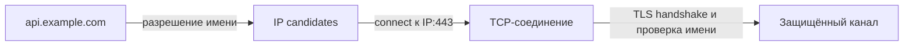

# DNS, TCP и TLS: как клиент устанавливает защищённое соединение

> [!info] Контекст
> `https://api.example.com/orders` работает на ноутбуке, но container получает `ENOTFOUND`. После подстановки IP ошибка меняется на certificate mismatch. На другой машине тот же вызов завершается timeout. Чтобы поставить диагноз, нужно разделить три этапа: получить адрес, установить транспортное соединение и проверить identity TLS endpoint.

[[../../MOC|К карте архитектуры]] · [[../01-client-server-request-lifecycle/01-client-server-request-lifecycle|К предыдущей главе]] · [[exercises|К упражнениям]]

## Результат главы

По hostname, port и выводу `dns.lookup()`, `dig`, socket API или `openssl s_client` вы сможете:

1. определить, завершилось ли разрешение имени;
2. назвать выбранный удалённый endpoint и состояние TCP-соединения;
3. проверить, завершился ли TLS handshake и для какого имени подтверждён сертификат;
4. не приписывать одному этапу гарантии другого.

Предварительное знание — общая карта из [[../01-client-server-request-lifecycle/01-client-server-request-lifecycle|главы 1]]. HTTP methods, fields и statuses начинаются в [[../03-http-messages-and-semantics/03-http-messages-and-semantics|следующей главе]].

## Три разных результата

Строка `api.example.com:443` ещё не указывает на процесс. Клиент последовательно получает три результата:



У каждого результата своя граница:

| Этап | Успех доказывает | Успех не доказывает |
|---|---|---|
| Разрешение имени | Получен применимый IP-адрес | Доступность порта и правильность сертификата |
| TCP connect | Установлено соединение с `IP:port` | Identity сервиса и работоспособность HTTP route |
| TLS handshake | Согласован защищённый канал; выполнены настроенные проверки | Доступность нужного HTTP-ресурса |

Фраза «соединение установлено» бесполезна без указания этапа.

## Имя узла, IP-адрес и порт

**Hostname** — имя в пространстве имён. Оно удобно как стабильное имя приложения, даже если при новом развёртывании меняются адреса.

**IP-адрес** нужен сетевому уровню для доставки пакетов к узлу или пограничному компоненту. Одному имени могут соответствовать несколько адресов IPv4 и IPv6, а один адрес может обслуживать множество имён.

**Порт** выбирает транспортную точку входа на адресе. `203.0.113.10:443` и `203.0.113.10:5432` — разные точки подключения.

DNS отвечает на вопрос «какие данные связаны с именем?», а не «какой процесс работает?». Ответ может вести к CDN, балансировщику нагрузки или обратному прокси-серверу, а не к машине приложения.

## Разрешение имени

DNS — распределённая иерархическая система типизированных записей. Для подключения по IPv4 и IPv6 обычно интересны записи `A` и `AAAA`, но DNS хранит и другие типы данных.

Упрощённый путь выглядит так:

1. программа обращается к системному механизму разрешения имён;
2. локальная политика может проверить `/etc/hosts`, кэш и настройки DNS;
3. рекурсивный DNS-сервер возвращает готовый ответ, при необходимости обращаясь к другим DNS-серверам;
4. клиент получает один или несколько возможных адресов.

Resolver может вернуть IPv4 и IPv6 одновременно. Клиент выбирает порядок попыток и способен начинать их с небольшим перекрытием, чтобы недоступность одного семейства адресов не задерживала соединение. Поэтому набор DNS-адресов и фактически выбранный удалённый адрес не обязаны совпадать один к одному.

### Кэш и TTL

Результаты разрешения имён могут кэшировать приложение, браузер, операционная система и рекурсивный DNS-сервер. TTL ограничивает срок повторного использования записи в DNS-кэше; он не является таймером существующего TCP-соединения.

Отрицательные результаты, например `NXDOMAIN`, тоже могут попасть в кэш. Поэтому исправленная DNS-запись не обязана стать видимой всем клиентам немедленно.

### `dns.lookup()` и DNS-запрос — не одно и то же

В Node.js `dns.lookup()` использует системный механизм разрешения имён. Он может учесть `/etc/hosts` и вообще не отправить DNS-пакет. Методы `dns.resolve*()` обращаются к DNS-серверам и не используют тот же набор системных источников.

Наблюдение через системный путь:

```bash
node --input-type=module -e '
  import { lookup } from "node:dns/promises";
  console.log(await lookup("example.com", { all: true }));
'
```

Явный запрос записей:

```bash
node --input-type=module -e '
  import { resolve4, resolve6 } from "node:dns/promises";
  console.log({
    A: await resolve4("example.com"),
    AAAA: await resolve6("example.com")
  });
'
```

Различие результатов не доказывает поломку DNS. Сначала установите, какие источники и policy использовал каждый инструмент.

### Что означает ошибка разрешения имени

`ENOTFOUND` в Node.js не следует читать буквально как «домен не существует»: документация Node.js использует этот код и для некоторых других сбоев `lookup()`. Надёжный вывод уже: системный механизм не вернул приложению пригодный адрес.

Следующие проверки зависят от вопроса:

- `dns.lookup()` показывает путь, близкий к обычному Node-приложению;
- `dig` показывает DNS records от выбранного resolver;
- `/etc/hosts` и системная resolver configuration объясняют локальные различия;
- server-side DNS logs или packet capture нужны, если важен сам обмен DNS messages.

## Socket и соединение

Socket API связывает приложение с транспортным протоколом. В сервере важно различать:

- **listening socket** — ожидает новые соединения на локальном address и port;
- **connected socket** — представляет одно установленное соединение с конкретной удалённой стороной.

Обычное TCP-соединение различается четырьмя значениями:

```text
local IP, local port, remote IP, remote port
```

Поэтому тысячи клиентов могут одновременно обращаться к одному `server IP:port`: их локальные адреса и временные порты различаются.

Hostname не входит в эту четвёрку. К моменту TCP connect уже выбран IP-адрес.

## Как устанавливается TCP-соединение

TCP — транспортный протокол с установлением соединения. При обычном активном открытии стороны выполняют three-way handshake:

```text
client                         server
  | -------- SYN ------------> |
  | <----- SYN + ACK ---------- |
  | -------- ACK ------------> |
```

Handshake синхронизирует состояние двух endpoints и подтверждает двустороннюю достижимость, необходимую для начала потока. Он не проверяет TLS certificate и не отправляет HTTP request.

### Что гарантирует TCP

RFC 9293 определяет TCP как надёжный упорядоченный поток байтов (`reliable, in-order byte stream`).

- **Поток байтов:** приложение не видит границы вызовов `write()`. Один `write()` может быть прочитан частями, а несколько вызовов — одним `read()`.
- **Порядок:** приложение получает байты в исходной последовательности. Более поздние данные могут ждать восстановления пропуска.
- **Надёжность:** TCP обнаруживает потери и часть повреждений, повторно передавая сегменты, пока соединение остаётся работоспособным.

Эти свойства не означают «запрос выполнен ровно один раз». TCP не знает границ HTTP-операций и не подтверждает фиксацию бизнес-изменения. После разрыва клиент может не знать, успел ли сервер обработать уже доставленные байты.

TCP также не обещает фиксированную задержку, бесконечные повторные попытки или автоматическое восстановление потока после разрыва.

## Транспортные сбои: явный отказ и timeout

### `ECONNREFUSED`

Явный отказ обычно означает, что клиент получил TCP reset в ответ на попытку соединения. Частая причина — отсутствие listener на указанном порту. Reset может создать firewall или другой сетевой компонент, поэтому без наблюдения на стороне сервера точный источник не доказан.

### Timeout

Timeout означает только, что ожидаемое событие не произошло за отведённое время. Среди причин: потеря пакетов, фильтрация, ошибка маршрутизации, недоступный узел, перегрузка или слишком короткий timeout.

Молчание не сообщает, где потерян пакет и в каком состоянии находится удалённая сторона.

### `ECONNRESET`

Reset после успешного `connect` подтверждает, что TCP-соединение существовало, а затем удалённая сторона или промежуточный компонент его сбросили. Если приложение не записывало этапы, неизвестно, произошёл reset во время TLS handshake или позже.

## Зачем поверх TCP нужен TLS

TCP доставляет байты, но не защищает их от чтения и изменения участником сети и не подтверждает подлинность сервиса. TLS создаёт канал со следующими свойствами:

- **аутентификация** — серверная сторона аутентифицируется; клиентская аутентификация опциональна;
- **конфиденциальность** — после установки канала данные доступны его сторонам, хотя TLS не скрывает сам факт и примерный объём обмена;
- **целостность** — изменение защищённых данных обнаруживается.

TLS защищает участок только между своими сторонами. Если TLS заканчивается на CDN, браузер аутентифицирует endpoint CDN. Связь CDN с приложением — отдельный участок со своей политикой защиты.

## TLS 1.3 без деталей криптографии

Для нового соединения с аутентификацией по сертификату существенна такая последовательность:

1. `ClientHello` сообщает поддерживаемые параметры, key share, SNI и варианты ALPN.
2. `ServerHello` выбирает параметры; стороны получают ключи handshake.
3. Сервер передаёт настройки, цепочку сертификатов и доказательство владения закрытым ключом.
4. Сообщения `Finished` подтверждают целостность всей переписки handshake.
5. Стороны переходят к защищённым данным прикладного протокола.

Эта схема объясняет границы, но не заменяет спецификацию. Возобновление сессии, PSK и 0-RTT меняют число сообщений и свойства ранних данных.

## DNS-имя, SNI и проверка сертификата

Для `https://api.example.com` участвуют три разных механизма:

1. DNS даёт возможные адреса.
2. SNI сообщает TLS endpoint имя, для которого клиент хочет конфигурацию и certificate.
3. Проверка service identity сопоставляет исходное имя с identity, представленной в сертификате.

Подстановка IP через `https://203.0.113.10/` меняет reference identity на IP. Соединение с нужной машиной может установиться, но certificate для `api.example.com` закономерно не пройдёт проверку.

> [!warning] Не отключайте verification ради диагностики
> Опция вроде `rejectUnauthorized: false` превращает проверку соединения в другой эксперимент. Она может показать, что TLS peer отвечает, но больше не доказывает identity сервиса. Сохраняйте исходную ошибку и проверяйте SNI, имя и certificate chain отдельно.

## Наблюдение через OpenSSL

Следующая команда устанавливает TCP-соединение, выполняет TLS handshake с SNI и завершает стандартный ввод:

```bash
openssl s_client \
  -connect example.com:443 \
  -servername example.com \
  -verify_hostname example.com \
  -brief </dev/null
```

Ищите не конкретное форматирование, а подтверждения:

- connection установлено с указанным endpoint;
- согласованы версия TLS и cipher suite;
- certificate verification завершилась успешно или с конкретной ошибкой;
- через ALPN мог быть выбран application protocol.

`openssl s_client` не доказывает работу HTTP route: команда не отправляет HTTP-запрос.

Чтобы отделить network path от DNS, можно сначала сохранить один из адресов и передать его в `-connect`, но оставить hostname в `-servername` и `-verify_hostname`. Тогда destination address и проверяемая service identity остаются разными явными параметрами.

## Диагностика по границам

| Наблюдение | Последняя подтверждённая граница | Следующая проверка |
|---|---|---|
| `ENOTFOUND` | Системное разрешение имени завершилось без пригодного результата | Сравнить `lookup`, DNS records и локальную resolver policy |
| Адрес получен, connect timeout | Известны candidates; TCP handshake не подтверждён | Проверить route, firewall и доступность конкретного `IP:port` |
| `ECONNREFUSED` | Получен явный транспортный отказ | Проверить listener и сетевую политику на destination |
| TCP connected, TLS timeout | Транспортное соединение установлено | Проверить TLS listener, SNI и proxy logs |
| Certificate chain error | TLS peer представил certificate | Проверить trust store и полноту chain |
| Hostname mismatch | Certificate получен, но identity не соответствует имени | Проверить исходный URL, SNI и SAN certificate |
| TLS success, HTTP timeout | Защищённый канал установлен | Перейти к HTTP trace и журналам следующей границы |

Если библиотека сообщает один общий timeout, добавьте временные отметки вокруг `lookup`, `connect` и TLS handshake. Без этапа число `5000 ms` не локализует проблему.

## Проверка результата

Для нового HTTPS endpoint без текста главы:

1. покажите, откуда получены candidate addresses и какой из них выбран;
2. назовите local/remote tuple установленного TCP-соединения;
3. объясните, какое имя передано через SNI и какое имя проверяет certificate verifier;
4. для каждого наблюдения назовите одно доказанное и два недоказанных свойства;
5. выберите следующий probe для DNS error, TCP timeout и hostname mismatch.

Перенос: объясните, почему истечение DNS TTL не закрывает существующее соединение и почему TLS до CDN не доказывает шифрование внутреннего hop.

## Related Topics

- [[../01-client-server-request-lifecycle/01-client-server-request-lifecycle|Путь HTTPS-запроса]] — место DNS, TCP и TLS в полном запросе.
- [[../03-http-messages-and-semantics/03-http-messages-and-semantics|HTTP-сообщения и семантика]] — обмен после установления защищённого канала.
- [[../04-browser-state-and-security/04-browser-state-and-security|Состояние браузера и границы безопасности]] — browser policy поверх HTTP и TLS.

## Sources

- [Node.js: DNS](https://nodejs.org/api/dns.html) — различие `dns.lookup()` и `dns.resolve*()`.
- [RFC 1034: Domain Names — Concepts and Facilities](https://www.rfc-editor.org/rfc/rfc1034.html) — namespace, resolvers, recursive resolution и cache.
- [RFC 2308: Negative Caching of DNS Queries](https://www.rfc-editor.org/rfc/rfc2308.html) — cache отрицательных DNS-ответов.
- [RFC 8305: Happy Eyeballs v2](https://www.rfc-editor.org/rfc/rfc8305.html) — выбор IPv4/IPv6 candidates и перекрывающиеся попытки соединения.
- [RFC 9293: Transmission Control Protocol](https://www.rfc-editor.org/rfc/rfc9293.html) — TCP state, handshake и reliable in-order byte stream.
- [RFC 9846: TLS 1.3](https://www.rfc-editor.org/rfc/rfc9846.html) — актуальная спецификация TLS 1.3 и свойства защищённого канала.
- [RFC 9525: Service Identity in TLS](https://www.rfc-editor.org/rfc/rfc9525.html) — reference identity, presented identity и проверка имени.
- [Node.js: Net](https://nodejs.org/api/net.html) и [Node.js: TLS](https://nodejs.org/api/tls.html) — socket events, `secureConnect`, SNI, ALPN и certificate authorization.
