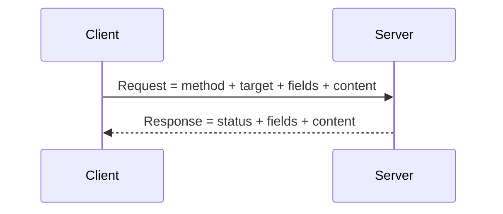

# HTTP-сообщения и семантика

> [!info] Контекст
> Frontend вызывает `fetch("/orders/42")`. Сервер отвечает `404 Not Found` с JSON-описанием ошибки, но `catch` не выполняется. Разработчик принимает выполненный Promise за успешную операцию. Ошибка возникает из-за смешения трёх фактов: HTTP-ответ получен, его status не относится к `2xx`, а JSON ещё нужно отдельно прочитать и проверить.

[[../../MOC|К карте архитектуры]] · [[../02-dns-tcp-tls/02-dns-tcp-tls|К предыдущей главе]] · [[exercises|К упражнениям]]

## Результат главы

По raw HTTP/1.1 exchange, записи DevTools, выводу `curl` или объекту Fetch `Response` вы сможете:

1. выделить control data, fields и content HTTP-сообщения;
2. объяснить выбор method через желаемую семантику операции;
3. прочитать status как результат обработки одного request;
4. предсказать поведение redirect и conditional request;
5. отделить HTTP outcome от transport failure и ошибки декодирования.

Предполагается, что защищённый канал уже установлен, как описано в [[../02-dns-tcp-tls/02-dns-tcp-tls|главе 2]]. Cookie, CORS и browser policy относятся к [[../04-browser-state-and-security/04-browser-state-and-security|следующей главе]].

## HTTP передаёт сообщения, а не вызовы функций

После установления соединения стороны обмениваются HTTP-сообщениями:



Request сообщает, над каким resource клиент хочет выполнить действие. Response сообщает результат обработки этого request и при необходимости переносит representation.

Transport доставляет bytes. HTTP придаёт им форму и смысл. Успешный TCP/TLS канал не гарантирует `2xx`, а полученный `404` уже доказывает, что обмен дошёл до HTTP.

## Абстрактное сообщение и HTTP/1.1 запись

RFC 9110 описывает HTTP-сообщение через четыре части:

1. **управляющие данные** — method и target для запроса; status для ответа;
2. **поля** — метаданные и инструкции обработки;
3. **содержимое** — необязательные данные сообщения;
4. **trailer fields** — необязательные поля после содержимого.

HTTP/1.1 записывает эти части текстуально. HTTP/2 и HTTP/3 используют другое framing, но сохраняют общую семантику методов, полей и статусов.

### Запрос

```http
POST /orders?notify=true HTTP/1.1
Host: api.example.test
Content-Type: application/json
Accept: application/json
Content-Length: 29

{"sku":"book-7","quantity":2}
```

Здесь:

- `POST` — метод;
- `/orders?notify=true` — request target;
- строки до пустой строки — поля;
- JSON после пустой строки — содержимое.

Fragment из URL, например `#payment`, браузер в request target не отправляет.

### Ответ

```http
HTTP/1.1 201 Created
Location: /orders/8472
Content-Type: application/json
Content-Length: 26

{"id":8472,"status":"new"}
```

- `201` — статус;
- `Location` указывает URI созданного ресурса;
- `Content-Type` описывает представление;
- `Content-Length` задаёт длину содержимого в байтах, а не в JavaScript characters.

### Где заканчивается сообщение

TCP предоставляет поток байтов без границ HTTP-сообщений. HTTP/1.1 framing определяет длину содержимого, например через `Content-Length`, chunked transfer coding или правила конкретного ответа. Один socket `data` event не обязан совпадать с одним полем, запросом или телом.

Полностью полученная status line ещё не означает полностью полученное содержимое.

## Ресурс и представление

**Ресурс** — объект адресации HTTP. Это не обязательно файл или строка в базе данных.

**Представление** — конкретная форма состояния ресурса: JSON, HTML, изображение, вариант на другом языке или в другом encoding.

У одного ресурса может быть несколько представлений. Поле `Content-Type` описывает представление в текущем сообщении, а не «тип URL».

```http
Content-Type: application/json; charset=utf-8
```

Поле `Accept` выражает предпочтения получателя относительно ответа:

```http
Accept: application/json, text/plain;q=0.5
```

`Content-Type` отвечает на вопрос «что находится в этом сообщении?», а `Accept` — «какое представление желательно получить?».

Если клиент отправляет JSON, но сервер не поддерживает этот media type, подходящий результат — `415 Unsupported Media Type`. Если сервер не может предоставить ни один приемлемый формат ответа, он может вернуть `406 Not Acceptable`.

## Метод задаёт семантику запроса

Метод — часть публичного протокольного контракта. Он сообщает желаемое действие относительно целевого ресурса, а не имя функции или устройство хранилища.

| Метод | Основное намерение | Safe | Idempotent |
|---|---|---:|---:|
| `GET` | Получить представление | Да | Да |
| `HEAD` | Получить поля как у `GET`, без содержимого ответа | Да | Да |
| `POST` | Передать данные для обработки согласно ресурсу | Нет | Нет |
| `PUT` | Создать или заменить состояние целевого ресурса | Нет | Да |
| `DELETE` | Удалить связь целевого ресурса с его текущей функциональностью | Нет | Да |
| `OPTIONS` | Получить сведения о вариантах взаимодействия | Да | Да |

### Safe не означает «без побочных эффектов»

Safe method не просит изменить состояние, за которое отвечает клиент. Сервер всё равно может записать access log или увеличить metric. Эти сопутствующие эффекты не меняют заявленное намерение запроса.

`GET /orders/42?delete=true` нарушает safe semantics: crawler, prefetcher или link checker вправе выполнить `GET`.

### Idempotent не означает «одинаковый ответ»

Метод идемпотентен, если несколько одинаковых запросов имеют тот же ожидаемый эффект, что один запрос.

Первый `DELETE /orders/42` может вернуть `204`, второй — `404`; итоговое состояние ресурса остаётся тем же. Журналы, timestamps и статус не обязаны совпадать.

Идемпотентность метода не гарантирует корректность реализации. Обработчик `PUT`, который каждый раз списывает деньги, нарушает выбранную семантику.

## Статус сообщает результат одного запроса

Первая цифра status code задаёт класс:

| Класс | Смысл |
|---|---|
| `1xx` | Промежуточная информация |
| `2xx` | Запрос успешно получен, понят и принят; конкретный код уточняет результат |
| `3xx` | Для завершения нужен redirect или используется сохранённая representation |
| `4xx` | Проблема связана с request или доступом клиента |
| `5xx` | Server считает, что ошибся или не способен выполнить request |

Практические различия важнее запоминания списка:

| Ситуация | Status | Какое решение доступно клиенту |
|---|---:|---|
| Resource получен | `200 OK` | Читать representation |
| Resource создан | `201 Created` | Использовать URI из `Location` |
| Успех без content | `204 No Content` | Не запускать decoder body |
| Неверный ввод | `400 Bad Request` | Исправить request |
| Нет аутентификации | `401 Unauthorized` | Получить или обновить credentials |
| Server понял request, но отказывается его выполнить | `403 Forbidden` | Не повторять без изменения; причину отказа и состояние authentication уточнить отдельно |
| Resource не найден | `404 Not Found` | Обработать отсутствие |
| Конфликт с текущим состоянием | `409 Conflict` | Получить актуальное состояние или разрешить конфликт |
| Не выполнена precondition | `412 Precondition Failed` | Не перезаписывать состояние вслепую |
| Неподдерживаемый media type request | `415 Unsupported Media Type` | Изменить `Content-Type` или формат |
| Слишком много requests | `429 Too Many Requests` | Учитывать policy и `Retry-After` |
| Неожиданная ошибка server | `500 Internal Server Error` | Сопоставить request-id с журналами |
| Proxy не получил корректный upstream response | `502 Bad Gateway` | Проверить следующую server-side границу |
| Gateway не дождался upstream | `504 Gateway Timeout` | Outcome upstream может оставаться неизвестным |

Status принадлежит response, а не исключению JavaScript. `4xx` и `5xx` — завершившиеся HTTP-ответы.

## `fetch()` разделяет получение ответа и HTTP success

`fetch()` возвращает Promise объекта `Response`. Promise обычно выполняется для любого доступного HTTP-ответа, включая `404` и `500`. Проверка `response.ok` классифицирует только диапазон `200–299`.

```javascript
const response = await fetch("/orders/42");

if (!response.ok) {
  throw new Error(`HTTP ${response.status}`);
}

const order = await response.json();
```

Здесь есть три отдельные границы ошибок:

1. `fetch()` rejected — response недоступен вызывающему коду из-за network error, malformed URL, abort или browser policy;
2. `response.ok === false` — доступен HTTP response вне `2xx`;
3. `response.json()` rejected — content нельзя декодировать как JSON или чтение body оборвалось.

Нельзя заменять эти проверки одним `try/catch` и называть любой outcome «network error».

### Воспроизводимое наблюдение

Скрипт запускает локальный сервер, получает `404` и показывает выполненный Fetch Promise:

```javascript
import { createServer } from "node:http";

const server = createServer((_request, response) => {
  response.writeHead(404, { "content-type": "application/json" });
  response.end(JSON.stringify({ error: "not found" }));
});

server.listen(0, "127.0.0.1", async () => {
  const { port } = server.address();
  const response = await fetch(`http://127.0.0.1:${port}/orders/42`);

  console.log({
    status: response.status,
    ok: response.ok,
    body: await response.json(),
  });

  server.close();
});
```

Ожидаемый смысл результата: `status` равен `404`, `ok` равен `false`, JSON доступен. Если заменить адрес на недоступную точку, граница изменится: объекта `Response` может не быть.

## Перенаправление создаёт новый запрос

Ответ с перенаправлением содержит статус и обычно `Location`. User agent принимает решение и создаёт следующий запрос. Это не внутренний переход между обработчиками сервера.

Для исходного `POST /orders` различайте:

- `303 See Other` — следующий запрос получает представление результата через `GET` или `HEAD`;
- `307 Temporary Redirect` — сохраняет метод и содержимое;
- `308 Permanent Redirect` — сохраняет метод и содержимое и сообщает постоянное перенаправление;
- `301` и `302` имеют исторически неоднозначное поведение для `POST`; не выбирайте их, когда сохранение метода критично.

При автоматическом перенаправлении DevTools и `curl -L` показывают несколько HTTP-обменов. Итоговый статус не заменяет историю предыдущих ответов.

## Условные запросы защищают от лишней передачи и lost update

Validators связывают запрос с известной клиенту версией представления.

### `If-None-Match`: изменилось ли представление

Первый ответ:

```http
HTTP/1.1 200 OK
ETag: "order-v7"
Content-Type: application/json

{"id":42,"status":"paid"}
```

Повторная проверка:

```http
GET /orders/42 HTTP/1.1
If-None-Match: "order-v7"
```

Если выбранное представление не изменилось, сервер отвечает `304 Not Modified` без содержимого. Клиент использует сохранённое представление. `304` не является «пустым `200`»: он имеет смысл только вместе с conditional request и сохранённым состоянием клиента или кэша.

### `If-Match`: обновить только известную версию

```http
PUT /orders/42 HTTP/1.1
If-Match: "order-v7"
Content-Type: application/json

{"id":42,"status":"cancelled"}
```

Сервер выполняет update, только если текущий validator совпадает. Иначе он возвращает `412 Precondition Failed`. Так клиент обнаруживает concurrent modification вместо молчаливой перезаписи.

Полная политика кэширования относится к следующему учебному циклу; здесь важен механизм precondition.

## Как читать трассировку HTTP

Разбирайте обмен в фиксированном порядке:

1. Был ли получен HTTP response или наблюдение закончилось раньше?
2. Каковы method и target исходного request?
3. Какие fields изменяют interpretation content или processing?
4. Как определяется граница content?
5. Что status сообщает об outcome именно этого request?
6. Были ли redirects или повторные requests?
7. Какое решение должен принять client: декодировать, исправить request, обновить credentials, разрешить conflict или перейти к диагностике server-side boundary?

Не выводите из status то, чего в нём нет. `500` не сообщает stack trace, `502` не доказывает, что handler не запускался, а `200` не гарантирует корректность JSON или business result.

## Проверка результата

Без текста главы разберите незнакомые request и response:

1. подпишите control data, fields и content;
2. объясните safe и idempotent свойства method через intended effect;
3. назовите client decision, которое позволяет принять status;
4. предскажите следующий method для `303` и `307`;
5. объясните отдельно поведение `fetch`, `response.ok` и decoder;
6. измените сценарий так, чтобы `If-Match` обнаружил lost update.

Перенос: спроектируйте три различимых response для «создано», «такой resource уже существует» и «request имеет неподдерживаемый media type». Если client не может выбрать разное поведение по вашим messages, contract остаётся неоднозначным.

## Related Topics

- [[../01-client-server-request-lifecycle/01-client-server-request-lifecycle|Путь HTTPS-запроса]] — где HTTP находится в полном сетевом пути.
- [[../02-dns-tcp-tls/02-dns-tcp-tls|DNS, TCP и TLS]] — гарантии канала, по которому передаются HTTP messages.
- [[../04-browser-state-and-security/04-browser-state-and-security|Состояние браузера и границы безопасности]] — cookie, same-origin policy, CORS и CSRF поверх HTTP.

## Sources

- [RFC 9110: HTTP Semantics](https://www.rfc-editor.org/rfc/rfc9110.html) — message abstraction, methods, fields, statuses, redirects и conditional requests.
- [RFC 9112: HTTP/1.1](https://www.rfc-editor.org/rfc/rfc9112.html) — запись сообщений, `Content-Length`, framing и определение длины тела.
- [RFC 6585: Additional HTTP Status Codes](https://www.rfc-editor.org/rfc/rfc6585.html) — `428 Precondition Required` и `429 Too Many Requests`.
- [MDN: HTTP messages](https://developer.mozilla.org/en-US/docs/Web/HTTP/Guides/Messages) — HTTP/1.1 запись request/response и различия framing между версиями.
- [MDN: `Window.fetch()`](https://developer.mozilla.org/en-US/docs/Web/API/Window/fetch) — fulfillment/rejection contract, `Response.ok` и `Response.status`.
- [Fetch Standard](https://fetch.spec.whatwg.org/) — browser fetch algorithm, network errors и redirect processing.
